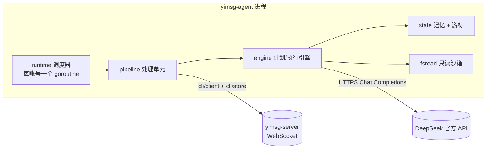
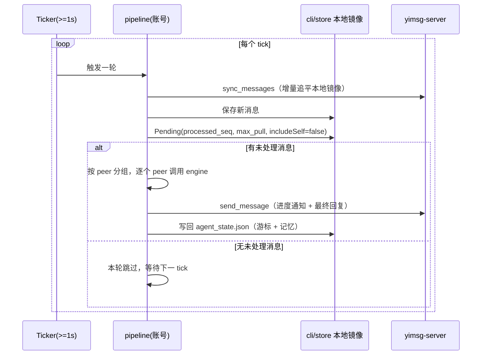
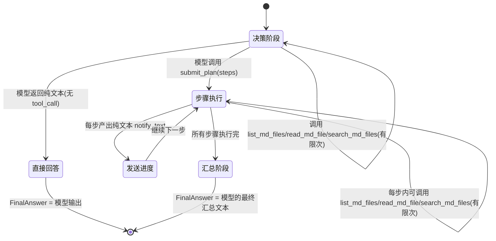

# yimsg-agent 方案

> 主要对照：`agent/` 目录下的 Go 实现与 `agent/cmd/yimsg-agent/main.go` 的启动流程。
> 最后复核：2026-07-23。
> 触发更新：新增/修改配置字段、计划执行引擎、记忆结构或工具沙箱边界时同步更新。
> 入口关系：本文件是 `agent/` 的组件专属方案文档；跨组件文档导航见 [`../../docs/README.md`](../../docs/README.md)。

## 1. 定位

`yimsg-agent` 是一个独立的 Go 常驻进程：登录多个 yimsg 账号，循环拉取每个账号收到的消息，调用 DeepSeek 官方 API 生成回复（必要时先规划再分步执行），把回复通过 yimsg 发回去。它面向"多账号自动客服 / 聊天机器人"场景，是 `cli/`（供 AI *调用*的命令行工具）的另一面：`cli/` 把"读/发消息"能力封装成子命令交给外部 AI 调用；`agent/` 反过来自己内置 AI 决策循环，不需要外部驱动。

`agent/` 不重新实现 WebSocket 二进制帧协议，而是直接复用同一 Go module 下 `cli/` 已经写好、已经过 `cli/tests/e2e` 验证的基础设施：

| 复用的包 | 用途 |
|---|---|
| `cli/account` | 账号 session（token）落盘、加载 |
| `cli/client` | 一条连接上的登录 / 鉴权 / 收发请求-响应 |
| `cli/store` | 本地 SQLite 消息镜像：`sync_messages` 增量同步、按账号 `Pending` 查询未处理消息 |
| `cli/msgid` | 发消息时生成 `msg_id`（UUIDv7 base64url） |

`agent/` 新增的是 `cli/` 没有的部分：多账号配置与共享只读知识库目录、固定节奏的轮询循环、AI 处理进度（seq）持久化、按账号隔离的记忆、计划-执行引擎、只读 Markdown 文件工具沙箱、DeepSeek 客户端。



## 2. 账号配置与共享知识库目录

### 2.1 输入方式

同时支持配置文件和命令行两种输入方式（互斥，二选一）：

- **配置文件**（推荐，用于多账号）：`yimsg-agent -config agent.toml`，见 §2.2 的 TOML 结构。
- **命令行**（用于单账号快速启动或临时调试）：`yimsg-agent -server ws://... -username U -password P -deepseek-api-key-env DEEPSEEK_API_KEY`；也可以重复 `-account "username:password"` 传入多个账号，但密码会出现在进程参数列表里，仅建议本地调试使用，生产场景一律用配置文件。

两种输入方式最终都被 `config.Load` / `config.Resolve` 归一化成同一个内部 `*config.Config` 结构，后续所有逻辑不区分来源。

### 2.2 配置文件结构

```toml
[deepseek]
base_url = "https://api.deepseek.com"   # 官方地址，OpenAI 兼容 Chat Completions
model = "deepseek-chat"
api_key_env = "DEEPSEEK_API_KEY"        # 从该环境变量读取 key；不建议用下面这项明文写库
# api_key = ""
temperature = 0.7
request_timeout_seconds = 60

[agent]
server = "ws://127.0.0.1:8080/ws"
data_dir = "./agent_data"               # 全部账号共享的本地状态根目录，见第 3 节
poll_interval_seconds = 2               # 会被 clamp 到 >= 1（需求硬性下限）
max_pull = 30                           # 每轮最多拉取的未处理消息数，默认 30
max_plan_steps = 6
max_tool_calls_per_step = 4
memory_max_chars_per_peer = 4000
memory_max_peers = 500
insecure_skip_verify = false

[[accounts]]
username = "bot1"
password_env = "YIMSG_AGENT_BOT1_PASSWORD"

[[accounts]]
username = "bot2"
password_env = "YIMSG_AGENT_BOT2_PASSWORD"
poll_interval_seconds = 1               # 单账号可覆盖 [agent] 的全局默认值
max_pull = 10
```

`[agent]` 下的轮询间隔、拉取上限等是全局默认值；每个 `[[accounts]]` 条目可以单独覆盖（未覆盖则继承全局默认）。密码优先从 `password_env` 指向的环境变量读取，配置文件里只留一个环境变量名，避免明文密码进库；`password` 字段仍然保留，仅用于本地联调，两者都未设置则拒绝启动。账号不再单独配置文件夹——多步执行时能读到什么由 §2.3 的共享目录统一决定。

### 2.3 共享只读知识库（`<data_dir>/resources/`）

`agent_data/` 是**全部账号共用的同一个数据文件夹**，二级目录布局与 `cli/account`（`yimsg-cli` 复用的同一个包）完全一致，按用户名分子目录，例如：

```text
agent_data/
  user1/       # 账号 user1 的私有状态（session、同步库、游标+记忆）
  user2/       # 账号 user2 的私有状态，与 user1 完全隔离
  resources/   # 全部账号共享的只读 Markdown 知识库
```

`resources/` 是多步执行引擎在决策阶段和每个步骤里唯一允许**只读**访问的目录（见第 7 节的沙箱实现），v1 是**全部账号共享同一份**，不再按账号单独隔离知识库：

- 路径固定为 `<data_dir>/resources`，由 `config.Resolve` 在启动时自动创建（`os.MkdirAll`），不需要用户提前准备，也不是可单独配置的路径。
- 沙箱层禁止任何形式越出该目录：不接受绝对路径参数、拒绝 `..` 穿越、对最终路径做 `EvalSymlinks` 后再校验前缀，见 §7.2。
- 沙箱只暴露"列出 / 读取 / 正则搜索 `.md` 文件"，没有写、删、执行能力——第 5 条需求原文就是"读操作"，因此 v1 不提供任何写权限。
- `resources/` 与 `<data_dir>/<username>/`（每个账号自己的 token、同步库、记忆、游标状态）严格分开：前者是"AI 能读到什么"（所有账号共享、只读），后者是"AI 引擎自己的运行状态"（按账号私有、agent 内部读写），语义不同、访问路径也不同，AI 侧工具调用只能触达前者。
- v1 是有意的简化：单个共享知识库覆盖不了"不同账号需要看到不同资料"的场景，后续如果出现这类需求，可以在 `resources/` 下按账号再分子目录、由 fsread 按账号选择子目录根，而不需要改变整体目录布局。

## 3. 目录与本地状态布局

```text
<data_dir>/
  resources/         # 全部账号共享的只读知识库，见 §2.3
  <username>/
    session.json      # 复用 cli/account：{uid, username, token, server_url, login_at}
    data.db           # 复用 cli/store：sync_messages 落地的本地镜像，用于计算 Pending
    agent_state.json  # agent 自己的状态：AI 处理进度游标 + 按对端分桶的记忆，见第 4、5 节
```

账号目录以**用户名**命名而不是 `uid`：用户名在登录前就已知、目录名对人类可读，方便直接在文件系统上分辨账号；这与 `cli/account` 的布局完全一致（`agent/` 直接复用同一个包），研发阶段不处理"同一用户名先后在不同服务器注册出不同 uid"这种极端场景，目录按用户名直接复用/覆盖。

`agent_state.json` 与 `data.db` 是两套独立的"游标"，不能混用：

- `data.db` 的同步游标（`MAX(seq)`）表示"这条消息已经拉到本地镜像"，由 `cli/store.SaveMessages` 维护，含义是"看到了"。
- `agent_state.json.processed_seq` 表示"AI 已经处理完这条消息并且回复/记忆都已落盘"，含义是"处理完了"，只在一批消息全部成功处理后才推进，语义更强。两者都基于账号级 `seq`（见根 `CLAUDE.md`：消息顺序只依赖 `seq`），`processed_seq <= 本地同步游标`恒成立。

## 4. 轮询循环与消息游标

每个账号一个独立 goroutine，互不阻塞、互不共享连接：



- **最小间隔**：`poll_interval_seconds` 配置值在启动时被 `max(value, 1)` 强制下限为 1 秒（对应需求"最小间隔一秒"），小于 1 时记一条警告日志但不拒绝启动。
- **最大拉取条数**：`max_pull` 默认 30，对应 `cli/store.Pending` 的 `limit` 参数，超出部分留到下一轮。
- **批内分组**：一批 `Pending` 结果可能来自多个不同的好友/群（`peer`）。按 `peer` 首次出现的顺序分组（不打乱跨 peer 的先后关系，但同一 peer 内部保持 `seq` 升序），逐个 peer 调用一次第 6 节的计划/执行引擎。
- **游标推进语义**：按 peer 分组顺序处理；某个 peer 分组处理失败（DeepSeek 调用失败、发送失败等）时立即中止本轮剩余分组的处理，`processed_seq` 只推进到"最后一个完整处理成功的 peer 分组"的最大 `seq` 为止。这保证了**不丢消息、不跳过**，代价是一个卡住的 peer 会阻塞同一轮里排在它之后的其他 peer（下一轮继续尝试，先处理更早的 peer），这是刻意的简化选择，第 11 节会说明其局限与后续改进方向。
- **连接与重连**：每个账号的连接在整个进程生命周期内尽量复用；连接断开或 token 失效时按指数退避重连（2s/4s/8s/16s，封顶），重连期间该账号的轮询暂停，不影响其他账号。
- **优雅关闭**：收到 `SIGINT`/`SIGTERM` 后取消 context，等待当前正在处理的 peer 分组处理完（不会腰斩到一半），再退出；因为游标只在分组成功后才推进，即使强制杀进程也不会造成状态不一致，最坏情况是重复处理最后一个未及落盘的分组（服务端 `send_message` 按 `(uid, msg_id)` 幂等，重复发送同一逻辑回复不会导致协议层重复，但如果 AI 两次生成了不同措辞的回复，用户可能会看到两条语义相同的消息——这属于"至少一次"处理语义的已知代价）。

## 5. 记忆设计

### 5.1 隔离粒度

"每个用户需要有单独的记忆"在本项目场景下对应"每个账号（每个 bot 身份）"：不同账号的记忆物理隔离在不同的 `<data_dir>/<username>/agent_state.json` 文件里，永不互相读取。账号内部按对端（peer：好友 uid 或群 group_id）再分桶存储，避免同一账号同时跟多个好友/群聊天时记忆互相串场：

```json
{
  "processed_seq": 1204,
  "memory": {
    "peers": {
      "u:1001": { "summary": "……", "updated_at": 1753232000000, "turns": 12 },
      "g:2002": { "summary": "……", "updated_at": 1753231000000, "turns": 3 }
    }
  }
}
```

`peer_key` 用 `u:<uid>` 表示好友、`g:<group_id>` 表示群；组织（`org_id`）会话不在 v1 范围内（见第 11 节）。

### 5.2 读写时机

- **读**：处理某个 peer 分组前，先取该 peer 现有的 `summary` 拼进 engine 的 system/context 里，作为"你和这个对端过去聊过什么"的背景。
- **写**：一个 peer 分组处理完（direct 回答或多步计划全部执行完）后，用 engine 的 `Reflect` 调用（第 6.4 节）让 DeepSeek 基于"旧记忆 + 本轮用户消息 + 本轮最终回复"生成新的摘要，替换旧摘要，`turns` 自增，`updated_at` 刷新。
- **落盘时机**：与 §4 的游标推进绑定在一起，同一次 `Commit` 原子写入（临时文件 + `rename`），避免游标和记忆不一致。

### 5.3 上限与淘汰

- 单个 peer 的摘要文本硬上限 `memory_max_chars_per_peer`（默认 4000 字符），engine 生成的摘要如果超过，`state.Store` 落盘前会硬截断（防御性兜底，正常情况下 `Reflect` 的 prompt 会要求模型自己控制长度）。
- 单账号最多跟踪 `memory_max_peers` 个 peer（默认 500），超出后按 `updated_at` 淘汰最久未活跃的 peer，防止长期运行的进程无限增长本地文件（呼应根 `CLAUDE.md` 对长期内存"必须有上限、淘汰策略"的要求）。
- v1 的记忆是滚动摘要（rolling summary），不是向量库/RAG，检索不到摘要之外的历史细节；第 11 节会说明这是相对业内方案的一个明显差距。

## 6. 计划与多步执行引擎（`agent/engine`）

这是本方案里最核心的部分,对应需求"Agent 可以直接回答,也可以指定计划,多步执行,每步执行完会发纯文本信息告知"。

### 6.1 总体流程

引擎用 DeepSeek 的 Chat Completions + Function Calling（`tools`）实现一个两阶段的 **Plan-and-Execute** 循环,而不是无约束的自由 ReAct(避免步骤数、工具调用数不可控)。四个自定义"工具"贯穿整个流程:

| 工具名 | 阶段 | 作用 |
|---|---|---|
| `list_md_files` | 决策阶段 + 每个步骤 | 列出共享知识库（`resources/`）内某子目录下的 `.md` 文件 |
| `read_md_file` | 决策阶段 + 每个步骤 | 读取共享知识库内一个 `.md` 文件的完整内容 |
| `search_md_files` | 决策阶段 + 每个步骤 | 类似 grep 的正则搜索（纯文本匹配,不用向量库),返回每处命中前后 `context_chars` 个字符的上下文;`context_chars` 由模型每次调用时自行决定,用于在通读整份文件之前先定位相关内容,见 §6.6 |
| `submit_plan` | 仅决策阶段 | 模型认为需要分步执行时,提交一个有序步骤描述列表,不直接调用即代表选择"直接回答" |



### 6.2 决策阶段（Plan or Direct）

1. 组装消息:`system`（角色设定 + 工具使用说明 + "能直接回答就直接回答,只有需要多步骤查证/推理时才 submit_plan"的指令）+ 一条携带"记忆摘要 + 本轮用户消息"的 `user` 消息。
2. 调用 DeepSeek,`tools = [list_md_files, read_md_file, search_md_files, submit_plan]`,`tool_choice = auto`。
3. 若模型返回 `list_md_files`/`read_md_file`/`search_md_files` 的 `tool_calls`:执行对应的 `fsread.Sandbox` 方法,把结果作为 `role=tool` 消息追加进对话,再次调用模型;这个子循环最多 `max_tool_calls_per_step` 次(默认 4),超过后强制要求模型基于已有信息直接结束(不再提供工具,只允许纯文本或 `submit_plan`)。
4. 模型返回纯文本(无 `tool_calls`):判定为"直接回答"模式,`Result.FinalAnswer` = 该文本,流程结束,不发送任何进度消息。
5. 模型调用 `submit_plan(steps: []string)`:进入步骤执行阶段,`steps` 长度超过 `max_plan_steps`(默认 6)时截断并在日志中记录一条警告(不中止,只是后面的步骤不执行,避免无界步骤数拖垮一次处理)。

### 6.3 步骤执行阶段

对 `steps` 中的每一步 `i`(`0 <= i < len(steps)`,顺序执行,不并行):

1. 组装一条 `user`/`developer` 消息:"当前执行第 `i+1`/`N` 步:`<step 描述>`。已完成步骤的结论:`<之前每步的 notify_text 拼接>`。可以调用 `list_md_files`/`read_md_file`/`search_md_files` 查证,完成后用纯文本给出这一步的结论和可以对外展示的进度说明。"
2. 同样允许一个有限次数(`max_tool_calls_per_step`)的工具调用子循环。
3. 模型最终返回的纯文本被同时当作"这一步的结论"(喂给下一步的上下文)和"进度通知文本"(`notify_text`),通过调用方传入的 `Notifier` 立即发送成一条纯文本聊天消息(对应需求"每步执行完会发纯文本信息告知")——**不等全部步骤跑完再补发**,是执行到哪一步就通知到哪一步。
4. 全部步骤跑完后,再发起一次汇总调用:把"用户原始问题 + 每一步的结论"交给模型,要求生成最终对用户的回复(不再提供工具),这次返回即 `Result.FinalAnswer`。

### 6.4 记忆回填调用(Reflect)

处理完(不论是直接回答还是多步执行)之后,`Engine.Reflect(ctx, oldSummary, userText, finalAnswer, maxChars)` 单独发起一次不带工具的 Chat Completions 调用,prompt 明确要求"把旧摘要与本轮对话合并压缩成不超过 `maxChars` 字符的新摘要,只保留后续对话可能用得上的关键信息",返回值直接替换该 peer 的 `summary`。

### 6.5 关键字/正则检索(`search_md_files`)

对应需求"类似 grep 的搜索文件能力,返回前后 n 个字符,不用向量数据库"。实现在 `agent/fsread.Sandbox.Search(pattern, subdir string, contextChars int)`:

- **纯文本匹配,不做语义检索**:`pattern` 是标准 Go 正则表达式(`regexp` 标准库),对沙箱根目录(`resources/`)下 `subdir` 里每个 `.md`/`.markdown` 文件的**全文**做 `FindAllStringIndex`,不引入任何向量库/embedding/相似度检索,命中即字面匹配。
- **上下文长度由模型决定**:每处命中返回其前后各 `context_chars` 个字符的原文,`context_chars` 是模型在这次工具调用里自己传入的参数,不是固定配置;模型没有传时默认给 200,更精确的检索可以传更小的值,需要更完整上下文时可以传更大的值,上限被 clamp 到 `MaxContextChars`(2000),防止一次检索把过多内容塞进模型上下文。
- **按字符(rune)切片而不是按字节**:上下文边界按 Unicode 字符计数,不会把中文等多字节字符从中间切断。
- **命中数量上限**:单次调用最多返回 `MaxSearchMatches`(50)条命中,超过时 `truncated=true`,提示模型缩小 `pattern` 或指定 `subdir` 再搜一次,而不是一次性把整个 `resources/` 的命中都塞进模型上下文。
- **与 `read_md_file` 的关系**:`search_md_files` 用于"文件较多或较长时先定位关键字所在位置",定位后再用 `read_md_file` 读整份文件确认完整上下文;两者不互相替代。

### 6.6 每次处理的 DeepSeek 调用次数

一次 peer 分组处理最坏情况下的调用次数 = 决策阶段(1 + 最多 `max_tool_calls_per_step`) + 步骤执行阶段(`max_plan_steps` × (1 + 最多 `max_tool_calls_per_step`)) + 汇总(1) + 记忆回填(1)。默认参数下上限是 `1+4 + 6×(1+4) + 1 + 1 = 37` 次;这是刻意的、可配置的成本/延迟上限,而不是无界循环,第 11 节会说明这与业内方案的取舍差异。`search_md_files` 与 `list_md_files`/`read_md_file` 共享同一个 `max_tool_calls_per_step` 预算,不会额外增加调用次数上限。

## 7. 文件读取沙箱工具(`agent/fsread`)

### 7.1 能力边界

只提供三个只读能力,不提供任何写、删、执行、目录穿越到 `resources/` 之外的能力:

- `ListMarkdown(subdir string) ([]string, error)`:列出沙箱根目录(`resources/`)下 `subdir` 里的 `.md`/`.markdown` 文件相对路径(递归,数量上限防止超大目录拖垮响应)。
- `ReadMarkdown(relPath string) (string, error)`:读取一个 `.md`/`.markdown` 文件全文,单文件大小上限(默认 200KB),超出截断并附加截断提示。
- `Search(pattern, subdir string, contextChars int) (matches []SearchMatch, truncated bool, err error)`:对沙箱根目录(`resources/`)下 `subdir` 里每个 `.md`/`.markdown` 文件做类似 grep 的正则搜索(不用向量库),返回每处命中前后 `contextChars` 个字符的上下文,`contextChars` 由调用方(模型)决定;内部基于 `ListMarkdown` + `ReadMarkdown` 实现,因此天然复用同一套越界防御与单文件大小上限,不是独立的文件访问路径。细节见 §6.5。

### 7.2 越界防御

`resolve(relPath)` 内部:

1. 拒绝绝对路径输入(`filepath.IsAbs`)。
2. `filepath.Join(root, relPath)` 后 `filepath.Clean`,校验结果仍然以 `root` 为前缀(处理 `..` 穿越)。
3. 对最终路径调用 `filepath.EvalSymlinks`(文件存在时),再次校验解析后的真实路径仍然以 `root` 的真实路径为前缀,防止 `resources/` 内部放一个指向外部的符号链接绕过前两步的字符串前缀校验。
4. 只接受 `.md`/`.markdown` 后缀,其余一律拒绝(即使路径本身在 `resources/` 内)。

## 8. DeepSeek 集成(`agent/deepseek`)

- 官方 Chat Completions 接口,`POST {base_url}/chat/completions`,`Authorization: Bearer <api_key>`,请求体是标准 OpenAI 兼容格式(`model`/`messages`/`tools`/`tool_choice`/`temperature`),响应解析 `choices[0].message`(含 `content` 或 `tool_calls`)。
- `api_key` 优先从配置里的 `api_key_env` 指定的环境变量读取,`api_key` 明文字段仅用于本地联调,两者都为空则启动失败(拒绝用空 key 静默运行)。
- 网络层重试:对连接失败、超时、`5xx`、`429` 做指数退避重试(默认最多 3 次),对 `4xx`(除 `429`)不重试(通常是请求本身有问题,重试没有意义)。
- 请求超时 `request_timeout_seconds`(默认 60s),防止一次调用卡住整个账号的轮询循环。

## 9. 错误处理、重试与关闭

- **账号级隔离**:一个账号的登录失败、DeepSeek 调用异常、发送失败,只影响该账号自己的 goroutine,不会级联影响其他账号。
- **连接重连**:见 §4"连接与重连"。
- **DeepSeek 调用失败**:整个 peer 分组处理判定为失败,按 §4 的批内失败语义处理,下一轮重试。
- **发送失败**(`send_message` 报错):同样判定分组失败;已经成功发送的进度消息不会撤回(纯文本通知本身没有回滚语义,用户会看到"执行到一半"的进度,这是可接受的,因为下一轮重试时如果最终答案生成成功,用户会收到完整回复)。
- **panic 防护**:每个账号的处理循环外层 `recover`,防止单个账号里未预期的 panic 打垮整个进程。

## 10. 测试策略

- `agent/config`:TOML 解析、默认值填充、`poll_interval_seconds` 下限 clamp、缺少账号/密码/DeepSeek key 时的拒绝逻辑、共享 `resources/` 目录的自动创建,纯 Go 单测。
- `agent/fsread`:合法读取、`..` 穿越拒绝、绝对路径拒绝、符号链接逃逸拒绝、非 `.md` 后缀拒绝、大文件截断,以及 `Search` 的正则匹配、多字节字符上下文边界、非法正则拒绝、`context_chars` clamp、命中数截断、跨文件/子目录范围,纯 Go 单测。
- `agent/state`:游标推进、记忆按 peer 分桶读写、超过 `memory_max_peers` 的 LRU 淘汰、超过 `memory_max_chars_per_peer` 的硬截断、原子写入(模拟中途失败不损坏已有文件),纯 Go 单测。
- `agent/deepseek`:用 `httptest.Server` 模拟 DeepSeek 接口,校验请求体格式、鉴权头、重试退避策略、超时,纯 Go 单测。
- `agent/engine`:注入实现同一接口的 fake `ChatCompleter`(不经 HTTP),按脚本化的多轮响应验证:直接回答分支、计划分支的步骤顺序与进度通知时机、工具调用次数上限、超过 `max_plan_steps` 时的截断行为、`search_md_files` 的调用参数透传与 `context_chars` 默认值,纯 Go 单测。
- `agent/tests/e2e`:对已启动的真实 `yimsg-server` + 一个模拟 DeepSeek 接口的 `httptest.Server`,编译并驱动 `yimsg-agent` 二进制,验证完整链路:两个真实账号互为好友、一个账号给 agent 账号发消息、agent 轮询拉到消息、调用(模拟)DeepSeek、通过真实 WebSocket 把回复发回去、`agent_state.json` 的游标与记忆按预期落盘。运行方式与 `cli/tests/e2e`/`server/tests/e2e` 一致,由 `tools/scripts/run_all_tests.sh` 统一启动服务端后执行。

## 11. 与业内通用执行引擎的差距,以及后续要如何完善

v1 是一个满足当前需求、参数可控、成本有界的最小可用实现,和 LangChain/LangGraph、AutoGPT、OpenAI Assistants/Responses API、Claude Agent SDK 这类成熟的通用 Agent 执行引擎相比,存在下面这些明显差距:

| 维度 | v1 现状 | 业内通用方案 | 后续改进方向 |
|---|---|---|---|
| 计划的动态性 | 一次性生成、线性执行、不可中途修改的静态步骤列表 | 支持执行中重新规划(observe → replan),步骤可以根据中间结果增删 | 引入"每步执行后允许模型追加/删除后续步骤"的重规划钩子 |
| 步骤并行度 | 严格串行,一个 peer 内步骤之间、不同 peer 之间(批内)都是顺序执行 | 支持无依赖步骤并行执行、多 peer 并发处理 | 先做"批内不同 peer 并发"(peer 之间天然无状态耦合),步骤级并行留待有明确 DAG 依赖描述之后再做 |
| 工具生态 | 仅一类只读 Markdown 文件工具(列表/读取/正则搜索) | 网页搜索、代码执行、数据库查询、调用其它内部/外部 API、子 Agent 调用等丰富工具集,且多为标准化协议(如 MCP) | 按需扩展工具集,优先考虑接入 MCP 协议而不是每个工具各写一套 schema |
| 记忆机制 | 单账号内按 peer 分桶的滚动文本摘要,硬性数量/长度上限 | 向量库 + 语义检索(RAG)、分层记忆(短期/长期/情景记忆)、可回溯的完整历史 | 摘要之外的原始消息其实已经在 `cli/store` 本地库里,后续可以加一个"按需检索本地历史消息"的工具,把"总结性记忆"和"可检索的完整记录"解耦 |
| 失败语义 | 批内失败即整批中止,依赖下一轮整体重试,没有单条消息级别的死信队列 | 细粒度重试/退避、死信队列、人工介入通道 | 引入按 peer 的独立重试计数与退避,连续失败超过阈值的 peer 可以跳过并告警,而不是无限阻塞后续处理 |
| 人工介入 | 无——全自动运行,没有"计划提交前等待人工批准"的选项 | 高风险操作(如涉及资金、外发大范围通知)通常有 human-in-the-loop 审核点 | 当工具集扩展到有副作用的操作时,补充一个"计划需要人工确认"的可选开关 |
| 成本/预算跟踪 | 只有步骤数/工具调用数的硬上限,不追踪 token 消耗与费用 | 按 token/费用做预算控制,超预算自动降级或中止 | 记录每次调用的 `usage`,按账号累计 token 消耗,提供软性预算告警 |
| 可观测性 | 仅日志(进程标准输出),没有结构化的执行轨迹 | 完整的 trace/span(每一步、每次工具调用、每次模型调用都可回放) | 后续可以把每次处理的完整消息序列落盘或接入统一的 trace 收集 |
| 工具调用标准化 | 自定义 4 个工具、内嵌在 DeepSeek 请求里,没有走通用协议 | 越来越多方案统一用 MCP(Model Context Protocol)描述和暴露工具 | 工具数量增长到一定规模后,评估把 `agent/fsread` 等工具改造成标准 MCP server,而不是继续手写 `tools` schema |

这些差距是有意识的权衡结果,不是遗漏:当前只有一类只读工具、单一转发场景,过度提前引入通用 Agent 框架的全部能力(动态重规划、并行 DAG、向量记忆、MCP)会显著增加复杂度而收益有限。本节列出差距是为了让后续扩展工具集或接入更复杂场景时,有一个清晰的、按需升级的路线图,而不是从零重新设计。
