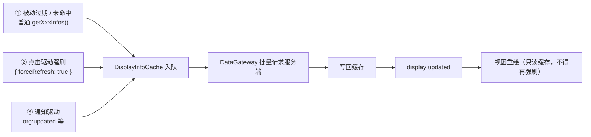

# 展示资料缓存刷新策略

> 主要对照：`packages/sdk/src/state/cache.ts`、`packages/sdk/src/datagateway/base.ts`、`packages/sdk/src/datagateway/persistent.ts`、`packages/uikit/src/app/views/chat/detail-panel.ts`、`packages/uikit/src/app/views/chat/conversation-list.ts`、`packages/uikit/src/app/views/contacts.ts`、`packages/uikit/src/app/views/org-admin.ts`。
> 最后复核：2026-08-23。
> 触发更新：新增或删除 `forceRefresh` 调用点、改变展示资料 TTL / 队列语义、改变 `display:updated` 驱动的重绘链路，或新增展示资料 scope 时同步更新。
> 入口关系：上级索引见 [`README.md`](../README.md)；缓存内部接口见 [`DisplayInfoCache接口.md`](../../packages/sdk/docs/DisplayInfoCache接口.md)，同步域（`sync_*` / seq 游标）见 [`同步机制方案.md`](同步机制方案.md)，视图侧交互见 [`UI设计方案.md`](../../packages/uikit/docs/UI设计方案.md)。

## 目录

- [1. 定位与边界](#1-定位与边界)
- [2. 缓存模型](#2-缓存模型)
- [3. 三条刷新通道](#3-三条刷新通道)
- [4. 强刷场景全表](#4-强刷场景全表)
- [5. 禁止强刷的场景](#5-禁止强刷的场景)
- [6. 回环规则](#6-回环规则)
- [7. 目标失效的处理](#7-目标失效的处理)
- [8. 新增强刷入口检查清单](#8-新增强刷入口检查清单)
- [9. 已知缺口](#9-已知缺口)
- [10. 覆盖测试](#10-覆盖测试)

## 1. 定位与边界

本文只描述**展示资料**（用户昵称 / 头像 / 备注、群名称、组织名称、tag 名称）的刷新口径，即 `DisplayInfoCache` 与 `get_user_infos` / `get_group_infos` / `get_org_infos` / `get_tag_infos` 这一条链路。

不在本文范围内：

- 消息、通讯录、屏蔽列表、免打扰、会话、组织结构边等**同步域**数据，它们走 `sync_*` + seq 游标，口径见 [`同步机制方案.md`](同步机制方案.md)。
- Persistent 模式的本地表结构与 GC，见 [`前端设计方案.md`](前端设计方案.md)。

两者的关键差异：同步域有服务端游标兜底，落后一定会被下一轮同步追平；**展示资料没有游标，只有 TTL**，服务端也不会因为某人改了昵称就向全部关联用户广播（既定性能策略）。因此展示资料的新鲜度完全由客户端的刷新时机决定，这就是本文存在的原因。

## 2. 缓存模型

| 事实 | 值 / 位置 |
|---|---|
| scope | `user` / `group` / `org` / `tag` 四类，各自独立的有界 FIFO |
| TTL | `DEFAULT_CACHE_TTL_SECONDS = 7 * 24 * 3600`（`packages/sdk/src/internal/sdk-defaults.ts`），构造时注入，运行期不可改 |
| 读取语义 | `getXxxInfos()` **永远同步返回**：命中返回当前值（哪怕已过期），未命中返回空值 |
| 补拉时机 | 未命中、已过期，或调用方显式传 `{ forceRefresh: true }` 时入队 |
| 批量合并 | 同 scope 的待拉取 key 在 `loadMergeWindowMs`（默认 8ms）窗口内合并成一次请求 |
| 写回与通知 | DataGateway 拿到服务端结果后回写缓存，并发 `display:updated` 事件让 UI 重读 |
| 过期基准 | 写入时刻 + TTL（org / tag 字典条目没有业务 `updated_at`） |

一个直接推论：**只要条目还在 TTL 内，普通读取既不会拿到新值，也不会去问服务端**。改名后本机缓存里的旧名可以存活 7 天，而其他账号因为缓存里压根没有该条目，首次读取就能拿到新名——"别人看到新名字、只有我自己看到旧名字"就是这么来的（BUG-005）。

## 3. 三条刷新通道

- **① 被动**：兜底通道，覆盖冷启动、列表滚动到新条目、TTL 自然过期。成本最低，新鲜度最差。
- **② 点击驱动强刷**：用户显式表达"我要看这个对象的当前状态"时（打开详情、进入会话、打开管理弹层、完成一次写操作），绕过 TTL 问一次服务端。这是本项目保证展示资料新鲜度的**主通道**。
- **③ 通知驱动**：服务端轻通知本身就意味着数据已变，收到后对受影响对象强刷。当前只有组织域用到（`org:updated`）。

## 4. 强刷场景全表

| scope | 触发点 | 代码位置 | 为什么必须强刷 |
|---|---|---|---|
| `user` | 打开用户详情面板 | `packages/uikit/src/app/views/chat/detail-panel.ts` `showUserDetail()` | 昵称 / 头像变更不向全部好友广播，点开详情是用户唯一明确的"看最新资料"意图 |
| `group` | 打开群详情面板 | `packages/uikit/src/app/views/chat/detail-panel.ts` `showGroupDetail()` | 群名 / 群头像变更不向全部成员广播 |
| `group` | 进入群会话 | `packages/uikit/src/app/views/chat/conversation-list.ts` `openConversation()` | 会话标题、会话列表、已打开详情共用同一份缓存，进入群聊时统一追平 |
| `org` + `tag` | 通讯录点开组织条目 | `packages/uikit/src/app/views/contacts.ts` `showOrgDetail()` → `renderOrgPanel({ forceRefresh: true })` | 组织改名后本机缓存在 TTL 内仍是旧名 |
| `org` + `tag` | 组织面板切换面包屑 / 下钻子部门 | `packages/uikit/src/app/views/contacts.ts` 面包屑与 `.org-tag-row` 点击 | 换节点即换 tag，等价于一次新的"查看"意图 |
| `org` + `tag` | 收到 `org:updated` 且面板开着 | `packages/uikit/src/app/views/contacts.ts` `refreshOrgPanel()` | 通知只带 `org_id`、只同步结构边，名字必须自己去取 |
| `org` + `tag` | 打开管理弹层 | `packages/uikit/src/app/views/org-admin.ts` `openOrgAdmin()` 首次 `render({ forceRefresh: true })` | 同上 |
| `org` + `tag` | 管理弹层内切换节点 | `packages/uikit/src/app/views/org-admin.ts` `renderFresh()` | 同上 |
| `org` + `tag` | 管理弹层内每次写操作之后 | `packages/uikit/src/app/views/org-admin.ts` 各写操作分支的 `renderFresh()` | 写操作不做本地乐观更新、也不回写缓存，只有强刷能把自己刚改的名字读回来 |

统一口径：**"用户主动表达查看意图" + "自己刚写完" + "服务端通知已变" 三类入口强刷，其余一律读缓存。**

## 5. 禁止强刷的场景

| 场景 | 原因 |
|---|---|
| `display:updated` 驱动的任何重绘 | 强刷会再次触发 `display:updated`，形成无限循环，见 [§6](#6-回环规则) |
| 列表行渲染（会话列表、好友列表、群成员行、组织成员行、转发选择器） | 行数不可控，强刷会把一次滚动放大成成批请求；这些位置靠通道 ① + 详情页强刷回写来追平 |
| 定时器、轮询 | 与"轻通知 + 主动拉取"的整体设计冲突，且没有上限 |

## 6. 回环规则

`DisplayInfoCache` 在写回后**不比对新旧值**，只要服务端返回了条目就会发 `display:updated`（`cache.ts` 的 `upsertXxxInfos` → `onDisplayUpdated`）。因此：

> 任何由 `display:updated` 触发的重绘路径，其展示资料读取必须是**不带 `forceRefresh` 的普通读**。

实现上的固定做法是把"渲染函数"和"渲染入口"分开：渲染函数接受 `{ forceRefresh }` 参数，点击 / 通知入口传 `true`，`display:updated` 入口用默认值。已有的两个范例：

- 聊天详情：`display:updated` 走就地打补丁的 `refreshDetailPanel()`；会重新调用 `showGroupDetail()`（内含强刷）的 `rerenderCurrentDetailPanel()` 只挂在 `blocklist:updated` / `mutelist:updated` 上。
- 组织面板：`renderOrgPanel(options)` / `openOrgAdmin` 内的 `render(options)` 与 `renderFresh()`。

`display:updated` 的全局重绘链路是 `main-app.ts` → `refreshVisibleViews()` → 各视图 render，新增视图接入时按同一条规则检查。

## 7. 目标失效的处理

强刷会更早暴露"对象已经不存在或自己已经没有权限"。这类失败不能只弹一个 toast 就把陈旧界面留在屏幕上：

- 判定入口：`packages/uikit/src/app/error-i18n.ts` 的 `serverErrorCodeOf()`，只认 WebSocket 业务错误的稳定 code。
- `FORBIDDEN` / `NOT_FOUND`：判定当前详情已失效，收起面板 / 关闭弹层，回到空态。
- 其余（连接失败、上传失败、`INTERNAL_ERROR`、客户端校验）：属于可恢复失败，保留当前界面，只提示。

展示给用户的文案一律仍走 `describeError()`，不得直接拼接原始 message。

## 8. 新增强刷入口检查清单

1. 这个入口是"用户主动查看""自己刚写完"还是"服务端通知已变"？三者都不是就不要强刷。
2. 它会不会被 `display:updated` 间接调用？会就必须拆参数。
3. 渲染的对象数量是否有上限？列表类入口不强刷。
4. 失败时目标可能已失效吗？按 [§7](#7-目标失效的处理) 处理 `FORBIDDEN` / `NOT_FOUND`。
5. 补一条锁住方向的测试：入口强刷 + `display:updated` 不强刷，两侧都要断言。
6. 回到本文 [§4](#4-强刷场景全表) 补表。

## 9. 已知缺口

- **在飞的普通加载会吞掉后续 `forceRefresh`**：`ScopeStore.enqueue()` 的第一行是 `if (this.loading.has(key)) return;`，同一 key 已有普通加载在飞时，随后的强制刷新意图直接被丢弃，资料继续显示旧缓存。登记为 `BUG-018`，见 [`线上网页真实操作测试TODO.md`](../development/线上网页真实操作测试TODO.md)。
- **强刷标记按批生效**：`drainPending()` 中只要本批任一 key 被标记强制，整批都按强制请求，属于当前实现的有意简化。

## 10. 覆盖测试

| 层次 | 位置 | 覆盖点 |
|---|---|---|
| UIKit 单元 | `packages/uikit/tests/unit/uikit-org-display-refresh.test.ts` | 打开弹层强刷、写操作后强刷、`display:updated` 重绘不强刷 |
| UIKit 单元 | `packages/uikit/tests/unit/error-i18n.test.ts` | `serverErrorCodeOf()` 只认业务错误码，可恢复失败返回 `null` |
| SDK 单元 | `packages/sdk/tests/unit/sdk/cache.test.ts` | `DisplayInfoCache` 的 TTL、队列、`forceRefresh` 入队与批量合并 |
| Web E2E | `apps/web/tests/e2e/org.spec.ts` | 组织改名后弹层标题 / 面包屑 / 通讯录条目即时追平；组织删除后失效详情自动收起 |
| Web E2E | `apps/web/tests/e2e/group.spec.ts` | 群头像在成员重新进入群聊、打开群详情后被强制刷新 |
