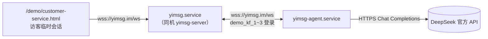

# 部署方案

> 主要对照：`.github/workflows/deploy.yml`、`.github/workflows/release.yml`、`tools/scripts/build_release.sh`、`tools/scripts/build.sh`、`tools/scripts/init_server_env.sh`、`tools/scripts/install-windows-autostart.ps1`、`tools/scripts/deploy-windows-local.ps1`、`server/cmd/yimsg-server/main.go`、`server/internal/config/config.go`、`config.toml`、`agent/cmd/yimsg-agent/main.go`、`agent/README.md`。
> 最后复核：2026-07-23。
> 触发更新：部署目标机器变更、启动方式变更、反向代理 / TLS 接入方式变更、yimsg-agent 部署方式或所用账号变更时同步更新。
> 入口关系：上级索引见 [`README.md`](../README.md)；第 0 节面向下载发行包的普通单机用户，第 1-9 节是自建 Linux 服务器（当前线上唯一实际部署），第 10 节是线上服务器的 GitHub Actions 自动化路径，第 11 节是另一套完全独立的 Windows 本机研发部署，第 12 节说明公开发行版构建与发布，第 13 节是 yimsg-agent 客服自动回复的部署方式。

## 目录

- [0. 下载发行包，解压即用](#0-下载发行包解压即用)
- [1. 定位](#1-定位)
- [2. 当前实现](#2-当前实现)
- [3. 配置](#3-配置)
- [4. 标准化环境初始化](#4-标准化环境初始化)
- [5. 首次部署流程](#5-首次部署流程)
- [6. 后续更新部署流程](#6-后续更新部署流程)
- [7. 测试与验证](#7-测试与验证)
- [8. 边界](#8-边界)
- [9. 维护点](#9-维护点)
- [10. GitHub Actions 自动化部署（可选）](#10-github-actions-自动化部署可选)
- [11. Windows 本机部署（研发/演示用）](#11-windows-本机部署研发演示用)
- [12. v0.1 公开发行工作流](#12-v01-公开发行工作流)
- [13. yimsg-agent 客服自动回复部署](#13-yimsg-agent-客服自动回复部署)

## 0. 下载发行包，解压即用

v0.1 提供四种自包含发行包：

| 系统 | 架构 | 文件 |
|---|---|---|
| Windows | x86-64（Go `amd64`） | `yimsg-0.1.0-windows-x86_64.zip` |
| Linux | x86-64（Go `amd64`） | `yimsg-0.1.0-linux-x86_64.tar.gz` |
| Linux | ARM64 | `yimsg-0.1.0-linux-arm64.tar.gz` |
| macOS | Apple Silicon / ARM64 | `yimsg-0.1.0-macos-arm64.tar.gz` |

下载并完整解压后，在解压目录直接运行 `yimsg`（Windows 为 `yimsg.exe`），无需创建或修改配置文件。服务默认监听 `127.0.0.1:38081`，数据自动写入程序旁的 `data/`，浏览器访问 `http://127.0.0.1:38081/`。

需要让办公室、分支机构、居家或移动设备通过局域网 / 公网共用这一套部署时，改用一条命令：

```bash
yimsg --listen 0.0.0.0:38081
```

也可以通过 `--data-dir <目录>` 指定数据位置。发行包携带的 `config.example.toml` 只面向 HTTPS 证书、分片数、GC / 缓存限制等高级选项；复制为 `config.toml`，仅取消需要覆盖的行，再用 `yimsg --config config.toml` 启动。位置参数 `yimsg config.toml` 继续兼容。

发行包中的 `web/`、`website/` 和默认 `data/` 都按可执行文件所在目录定位，因此从其它工作目录执行绝对路径形式的 `yimsg` 也能正常找到静态资源。开放公网访问前仍必须自行配置 TLS、防火墙和域名。一次部署可以服务多个地点、终端、网站和业务系统，但它仍是一台机器上的单进程服务，不是多机集群。

## 1. 定位

Yimsg 服务端是单个 Go 二进制 + 本地 SQLite 分片文件，不依赖外部数据库/缓存服务；前端构建产物是静态文件，由服务端直接挂载。单台机器的部署形态是**单机 systemd 常驻**，不使用容器、不使用负载均衡多实例（在线连接注册表和消息 fanout 是单进程内存态，详见 `server/internal/online/online.go`，因此单机内天然不支持水平扩展）。

部署形态支持同时维护多台**互相独立、不共享数据**的单机部署：每台机器各自维护自己的 `data/` 目录和在线连接状态，不是一套跨机器同步的集群；新增机器时按第 4、5 节流程原样重复一遍即可。当前线上有两台机器：`yimsg-se`（首尔）运行仓库自带的常规官网 `website/`；`yimsg-gz`（广州）的官网首页替换为仓库根目录独立的 `website-icp/` 静态页面（专用于 yimsg.cn / www.yimsg.cn 的 ICP 备案，纯静态介绍页、无跳转、无商业元素），因此**已从第 10 节 GitHub Actions 部署矩阵中移除**，也**不应再对 `yimsg-gz` 运行第 6 节末尾的 `tools/scripts/deploy-remote.sh`**（该脚本固定上传仓库的 `website/`，会覆盖 ICP 备案页）；`yimsg-gz` 上 `server`/`web/`/`data/` 之外的官网静态资源改为手动单独更新 `website-icp/` 内容。多台机器可以共用同一张网站 TLS 证书（Cloudflare Origin CA 证书本就设计为可放在多个源站后面，见第 8 节）。

本文只覆盖“把代码部署到已购买的 Linux 云服务器”这件事本身，域名解析、云厂商安全组/防火墙规则由使用者在对应控制台自行操作，本文档只记录需要放行的端口。

## 2. 当前实现

| 项 | `yimsg-se`（首尔） | `yimsg-gz`（广州） |
|---|---|---|
| 服务器操作系统 | Debian 13 (trixie) x86_64 | Debian 13 (trixie) x86_64 |
| 服务器 IP | `43.131.244.40`（云厂商分配，重建实例会变化，以实际控制台显示为准） | `114.132.42.135`（云厂商分配，重建实例会变化，以实际控制台显示为准） |
| SSH 别名（本机 `~/.ssh/config`） | `yimsg-se` | `yimsg-gz` |
| 当前状态 | 已部署并在线运行 | 已部署并在线运行；官网首页是独立的 `website-icp/` ICP 备案静态页，不随常规发布流程更新（见第 1 节） |

新增机器时，其余配置应与下表保持一致：

| 项 | 值 |
|---|---|
| 部署路径 | `/opt/yimsg/`（`server` 二进制、`seed-demo` 二进制、`config.toml`、`web/` 聊天 App 产物、`website/` 官网静态资源、`data/` 数据目录） |
| 运行账号 | 系统账号 `yimsg`（`useradd --system --home-dir /opt/yimsg --shell /usr/sbin/nologin --gid yimsg yimsg`），非 root；不同机器由系统自动分配 UID/GID，数字不要求相同 |
| 监听端口 | `0.0.0.0:443`（生产直连 HTTPS，证书由服务端进程读取） |
| TLS 证书 | `/etc/ssl/certs/yimsg.pem`、`/etc/ssl/certs/yimsg.key`；新增机器共用同一份证书内容时，从已有机器人工搬运（不经 GitHub Actions，见第 9 节）；本地开发 / 自动化测试不配置这两项，继续使用 HTTP |
| URL 结构 | HTTPS 根路径 `/` 是官网首页（介绍 yimsg）；`web/` 下 `app/`、`demo/`、`uikit/` 三个平级目录分别挂载在同名根路径下，彼此没有共同前缀——`/app/` 是真正需要注册登录的聊天 App（官网导航「打开应用」链接到这里），`/demo/` 是固定 demo 账号的演示页（官网「立即体验」等链接到这里），`/uikit/` 是可嵌入第三方站点的 widget bundle；`/demo/`、`/uikit/` 根路径本身不提供页面，直接 404 |
| 进程管理 | systemd unit `/etc/systemd/system/yimsg.service`，已 `enable`，开机自启 + 崩溃自动重启 |
| 低端口绑定方式 | systemd unit 内 `AmbientCapabilities=CAP_NET_BIND_SERVICE` 授权非 root 进程绑定 443；不依赖二进制文件 capability |

## 3. 配置

普通单机启动不需要配置文件。当前线上服务器需要直连 HTTPS 和固定绝对路径，因此保留 `/opt/yimsg/config.toml`（相对高级模板只覆盖必要项，其余用内置默认值）：

```toml
[server]
host = "0.0.0.0"
port = 443
tls_cert = "/etc/ssl/certs/yimsg.pem"
tls_key = "/etc/ssl/certs/yimsg.key"

[database]
data_dir = "/opt/yimsg/data"
shard_count = 4

[frontend]
static_dir = "/opt/yimsg/web"

[website]
static_dir = "/opt/yimsg/website"
mount_path = "/"

[media]
upload_dir = "/opt/yimsg/data/media"
```

systemd unit `/etc/systemd/system/yimsg.service`：

```ini
[Unit]
Description=Yimsg Server
After=network.target

[Service]
Type=simple
User=yimsg
Group=yimsg
WorkingDirectory=/opt/yimsg
ExecStart=/opt/yimsg/server /opt/yimsg/config.toml
Restart=on-failure
RestartSec=3
AmbientCapabilities=CAP_NET_BIND_SERVICE
NoNewPrivileges=true

[Install]
WantedBy=multi-user.target
```

## 4. 标准化环境初始化

新机器、重建机器或发现多台服务器环境不一致时，先执行本节，保证所有机器的运行环境标准一致。标准一致指账号名、home 目录、shell、部署目录、配置文件、systemd unit、证书路径与权限一致；UID/GID 数字由各机器系统分配，允许不同；`*.prev` 这类历史备份目录不是运行环境不变量，不需要为了“对齐环境”跨机器复制。

以下命令以 `<alias>` 代表目标机器，实际替换为对应机器的 SSH 别名（当前是 `yimsg-se`）。脚本是幂等的，可重复执行；登录用户必须是 root，或具备免密 sudo 权限：

```bash
./tools/init_server_env.sh <alias>
```

完成后用以下命令核对标准环境：

```bash
ssh <alias> 'set -e
id yimsg
getent passwd yimsg
getent group yimsg
ls -ld /opt/yimsg /opt/yimsg/web /opt/yimsg/website /opt/yimsg/data /opt/yimsg/data/media
ls -l /opt/yimsg/config.toml /etc/ssl/certs/yimsg.pem /etc/ssl/certs/yimsg.key
systemctl is-enabled yimsg
systemctl cat yimsg
'
```

若新机器还没有 TLS 证书，先按第 9 节第 4 条从已有机器搬运证书，再执行本节；否则 `test -r /etc/ssl/certs/yimsg.*` 会失败。

## 5. 首次部署流程

以下命令以 `<alias>` 代表目标机器，实际替换为对应机器的 SSH 别名（当前是 `yimsg-se`），有多台机器时逐台各执行一次。在本机（macOS/Linux 开发机）执行：

```bash
# 1. 交叉编译 Linux/amd64 二进制（modernc.org/sqlite 是纯 Go 实现，不依赖 CGO，可直接跨平台编译）
GOOS=linux GOARCH=amd64 go build -o server-linux-amd64 ./server/cmd/yimsg-server

# 2. 构建前端产物（复用 tools/build.sh 的前半段：协议生成物 + npm run build）
go run ./tools/cmd/protocolgen
npm run build                    # 产物在仓库根目录 web/

# 3. 传输到服务器（website/ 是仓库自带的静态官网，无需构建）
scp server-linux-amd64 <alias>:/opt/yimsg/server
# /opt/yimsg/config.toml 使用第 3 节的生产 HTTPS 配置，不直接覆盖为本地模板
scp -r web/* <alias>:/opt/yimsg/web/
scp -r website/* <alias>:/opt/yimsg/website/
```

服务器环境必须已按第 4 节完成标准化初始化。初始化不在 GitHub Actions 部署流程内执行；新机器或重建机器必须先手动运行 `./tools/init_server_env.sh <alias>`，再执行本节部署。

## 6. 后续更新部署流程

代码有变更后，对每台机器（当前是 `yimsg-se`）分别重复第 5 节的“本机编译 + 传输”部分（`web/`、`website/` 直接覆盖即可）。**二进制不要直接覆盖同名文件**——传成 `server.new`，在服务器上原子替换，避免覆盖到正在运行的进程文件。

**当前是演示/研发阶段站点：每次更新部署都会清空 `/opt/yimsg/data` 并用 `server/tools/cmd/seed-demo` 重新生成官网演示数据（demo_alice/demo_bob/demo_carol 等固定账号），不做旧数据兼容或迁移**。`seed-demo` 也要随每次部署用当前代码重新交叉编译，不复用旧二进制；以下命令同样对 `<alias>` 分别执行两遍：

```bash
GOOS=linux GOARCH=amd64 go build -o server-linux-amd64 ./server/cmd/yimsg-server
GOOS=linux GOARCH=amd64 go build -o seed-demo-linux-amd64 ./server/tools/cmd/seed-demo
scp server-linux-amd64 <alias>:/opt/yimsg/server.new
scp seed-demo-linux-amd64 <alias>:/opt/yimsg/seed-demo.new
ssh <alias> "
  set -euo pipefail
  systemctl stop yimsg   # 先停服务，避免 systemd Restart=on-failure 和 seed-demo 抢同一份数据目录
  chmod +x /opt/yimsg/server.new
  mv /opt/yimsg/server.new /opt/yimsg/server
  chmod +x /opt/yimsg/seed-demo.new
  mv /opt/yimsg/seed-demo.new /opt/yimsg/seed-demo
  chown -R yimsg:yimsg /opt/yimsg
  setcap -r /opt/yimsg/server 2>/dev/null || true
  /opt/yimsg/seed-demo -config /opt/yimsg/config.toml   # 内部会自行清空并重建 data/（含 media 上传目录）
  chown -R yimsg:yimsg /opt/yimsg/data
  systemctl start yimsg
"
```

低端口绑定由 systemd unit 的 `AmbientCapabilities=CAP_NET_BIND_SERVICE` 提供，不依赖 `/opt/yimsg/server` 文件上的 capability。部署流程显式清理文件 capability，避免多台机器因历史操作不同出现漂移。

本节手动流程已封装为 `tools/scripts/deploy-remote.sh <alias>`（如 `tools/scripts/deploy-remote.sh yimsg-gz`），本机交叉编译 + scp 上传，跳过 GitHub Actions 的排队等待，适合本机到目标机器上传带宽较好、想更快看到效果的场景。它和第 10 节的 GitHub Actions 部署可以对同一台机器同时触发而不冲突，靠两层机制配合：①上传阶段用当次运行专属的 `RUN_TAG`（本脚本是 `local-<pid>`，GitHub Actions 是 `gh-<run_id>-<run_attempt>`）给上传目标加后缀（如 `server.new.<tag>`、`web.new.<tag>/`），两边各写各的临时文件/目录，不会并发写同一个目标——**这一步是必须的**：早期实现两边共用固定文件名 `server.new` 上传，同时触发时曾经出现两边并发写同一个文件、写出大小相同但内容不同（已损坏）的二进制，服务器起不来；②远程原子替换那段临界区（停服务、把上传好的文件 `mv` 成正式文件名、跑 seed-demo、重启服务）用同一把文件锁 `/opt/yimsg/.deploy.lock`（`flock`）互斥，谁先抢到锁谁先跑完，后完成的一方最终生效。目标机器必须已按第 4 节完成标准化环境初始化。

## 7. 测试与验证

```bash
ssh yimsg-se "systemctl status yimsg --no-pager"
curl -k -sS -o /dev/null -w "%{http_code}\n" https://43.131.244.40/       # yimsg-se 官网首页，期望 200
curl -k -sS -o /dev/null -w "%{http_code}\n" https://43.131.244.40/app/   # yimsg-se 聊天 App，期望 200
```

有多台机器时，对每台机器的 SSH 别名和 IP 重复上述命令。

## 8. 边界

- **生产使用 HTTPS，端口 443 由 Go 服务直接监听**。云厂商安全组需放行 443（HTTPS）和 22（SSH）；如需保留 HTTP 80 或做 HTTP → HTTPS 跳转，需要后续增加反向代理或独立跳转服务，当前服务进程只监听一个端口。
- **Cloudflare Origin CA 证书只适合放在 Cloudflare 后面使用**。直接用 IP 访问源站做健康检查时，使用 `curl -k` 仅验证源站服务可用；公网用户应通过绑定到 Cloudflare 的域名访问 HTTPS。多台源站可以共用同一份证书，因为 Cloudflare Origin CA 证书本就支持挂在多个源站后面，不代表机器之间有任何运行时耦合。
- **每台机器都是单机架构，不支持水平扩展**：在线连接注册表、消息 fanout 任务队列都是进程内存态。有多台机器时，它们是多套完全独立、互不同步数据的部署，不是同一服务的多实例集群；同一用户在不同机器上各自拥有独立账号和数据，不会互通。
- **防火墙/安全组完全由云厂商控制台管理**：服务器本机未安装 `ufw`/`iptables`，端口放行只能去控制台操作，本文档和部署脚本都不涉及。
- **root 密码类凭证不进版本库、不进聊天记录**：SSH 访问统一用密钥（`~/.ssh/yimsg_deploy`，仅本机保存），密码仅用于首次装公钥或紧急救援，用完建议立即在控制台重置。

## 9. 维护点

1. 如未来改为 Caddy / Nginx 终止 TLS：`config.toml` 的 `server.port` 改为内部端口（如 `38081`），清空 `tls_cert` / `tls_key`，由反向代理监听 80/443 并转发到内部 HTTP 端口。
2. 服务器重建或更换 IP 后：更新本文第 2 节对应机器的 IP，更新本机 `~/.ssh/config` 里对应别名的 `HostName`，以及 GitHub Secrets 里对应的 `SSH_HOST_<NAME>`（见第 10 节）。
3. `data/` 目录是唯一状态；**但当前站点是演示/研发阶段站点，每次通过 GitHub Actions 或第 6 节流程更新部署都会清空并用 `seed-demo` 重新生成，不具备持久保留价值，不需要备份**。如果未来站点转为承载真实用户数据，需要先移除部署流程里清空 `data/` 与重跑 `seed-demo` 的步骤，再考虑按目录备份/迁移。
4. **证书搬运是人工操作，不经 GitHub Actions**：新增机器时，其 `/etc/ssl/certs/yimsg.pem`/`.key` 需要人工从已有机器搬运过去（例如 `scp -p yimsg-se:/etc/ssl/certs/yimsg.pem /tmp/yimsg.pem && scp -p yimsg-se:/etc/ssl/certs/yimsg.key /tmp/yimsg.key && scp -p /tmp/yimsg.pem /tmp/yimsg.key <新机器别名>:/tmp/`，然后在新机器上执行 `install -o root -g root -m 644 /tmp/yimsg.pem /etc/ssl/certs/yimsg.pem` 和 `install -o root -g yimsg -m 640 /tmp/yimsg.key /etc/ssl/certs/yimsg.key`），且必须在第一次对该机器跑部署（第 4/5/10 节）之前完成，否则 `systemctl start yimsg` 会因证书文件缺失而失败。

## 10. GitHub Actions 自动化部署（可选）

工作流文件：`.github/workflows/deploy.yml`，触发方式是手动 `workflow_dispatch`（不随 push 自动执行，避免研发阶段误触发上线）。workflow 用矩阵（matrix）的 `include` 列表逐台机器执行一遍，每项包含展示别名 `name` 和对应的 secret 名 `host_secret`（如 `{name: se, host_secret: SSH_HOST_SE}`）；新增机器时只需在 `include` 里加一行，无需改动后续步骤。**`yimsg-gz` 已从 `include` 列表中移除**：该机器官网首页是专用的 ICP 备案静态页 `website-icp/`，需要保持与仓库常规官网 `website/` 不同，因此不参与本自动化部署，避免每次发布把 `website/` 覆盖过去；后续如需更新 `yimsg-gz` 的代码或聊天 App，需要手动单独执行部署，且手动步骤中官网静态资源部分要传 `website-icp/` 而不是 `website/`。所有机器共用同一套编译产物（各自独立构建一次），但目标主机不同。核心步骤等价于第 5、6 节的”本机编译 + scp 传输 + 远程原子替换 + 重启 systemd”，全部在 GitHub 托管的 `ubuntu-latest` runner 上执行，不依赖第三方 Action 处理私钥（直接写入 runner 上的临时文件，随 job 结束一起销毁）。上传阶段用当次运行专属的 `RUN_TAG=gh-<run_id>-<run_attempt>` 给上传目标加后缀，远程原子替换步骤用 `/opt/yimsg/.deploy.lock` 文件锁包裹临界区，两层机制合起来跟第 6 节末尾提到的本机快速部署脚本 `tools/scripts/deploy-remote.sh` 互斥，允许对同一台机器同时触发两条部署路径而不冲突（详见第 6 节关于 `RUN_TAG` 必要性的说明）。**每次运行都会交叉编译全新的 `seed-demo` 二进制随部署上传，并在远程清空 `/opt/yimsg/data` 后重新执行 `seed-demo` 重建官网演示数据**，触发前需知悉这一点（详见第 6 节）。同一次运行还会交叉编译 `yimsg-agent` 二进制并原子替换、重启 `yimsg-agent.service`，细节见第 13 节。

GitHub Actions 默认目标机器已经按第 4 节完成标准化初始化，不在 workflow 内创建账号、目录、`config.toml` 或 systemd unit。新机器、重建机器或环境漂移修复时，必须先在本机运行 `./tools/init_server_env.sh <alias>`，再触发 workflow。证书仍不经 GitHub Actions 同步，必须按第 9 节第 4 条人工搬运。

部署 workflow 的 SSH/SCP 步骤统一启用批处理模式、20 秒连接超时和 15 秒 keepalive；每个 `scp` 上传默认最多等待 1800 秒，超过会直接失败，避免网络抖动时长时间卡住。需要临时放宽时，可在 workflow 环境里设置 `DEPLOY_SCP_TIMEOUT_SECONDS`。

需要在仓库 Settings → Secrets and variables → Actions 里配置：

| Secret | 说明 |
|---|---|
| `SSH_HOST_SE` | `yimsg-se` 的服务器 IP 或域名（对应本机 `~/.ssh/config` 里 `yimsg-se` 的 `HostName`） |
| `SSH_USER` | 登录用户名，所有机器共用；该用户需要免密执行 `useradd`/`chown`/`systemctl restart`（通常是 root，或已配置 `sudo NOPASSWD` 的账号） |
| `SSH_PRIVATE_KEY` | 所有机器共用的部署私钥内容（`~/.ssh/yimsg_deploy` 私钥全文，各机器都已装对应公钥），只用于本次部署，不要与其它用途复用 |
| `SSH_PORT` | 可选，SSH 端口，所有机器共用，不设置时默认为 `22` |
| `DEEPSEEK_API_KEY` | 第 13 节 yimsg-agent（客服 demo_kf_1~3 自动回复）使用的 DeepSeek 官方 API Key；留空时 workflow 仍会正常部署服务端，yimsg-agent 会因为拿不到 key 反复 `Restart=on-failure`，等这个 secret 填好后重新触发一次本 workflow 即可让 yimsg-agent 正常启动 |

新增机器时，在仓库 Secrets 里添加对应的 `SSH_HOST_<NAME>`，并在 `deploy.yml` 的 matrix `include` 里加一行 `{name: <alias>, host_secret: SSH_HOST_<NAME>}` 即可，无需改动其余 workflow 逻辑；私钥/账号轮换后同步更新 `SSH_PRIVATE_KEY`/`SSH_USER`（所有机器共用同一套）。首次配置或某台机器重建换 IP 后，同步更新对应的 `SSH_HOST_<NAME>`。

## 11. Windows 本机部署（研发/演示用）

**这是一套跟第 1-10 节 Linux 生产部署完全独立、不共享任何状态的部署**，只用于在开发者自己的 Windows 机器上跑一份可通过 `http://127.0.0.1/` 直接访问的完整服务（官网首页 + 聊天 App + Demo），供本机验收变更效果，不面向公网用户。**不要把它跟仓库目录里临时起的 `go run ./server/cmd/yimsg-server`/`server.exe`（例如监听 `38081` 的本地开发端口）混为一谈**——那是开发调试，随时起停、无固定位置；这里说的"本机部署"专指下表这套固定位置、开机自启、生产同款二进制的部署。

| 项 | 值 |
|---|---|
| 部署目录 | `C:\yimsg\`，与开发仓库目录（如 `C:\Users\<user>\Code\yimsg\`）完全独立 |
| 监听 | `0.0.0.0:80`（HTTP，无 TLS） |
| 进程管理 | Windows 计划任务 `YimsgServer`：`SYSTEM` 账号、`AtStartup` 触发、崩溃自动重启（`RestartCount 999`/`RestartInterval 1 分钟`）。**普通用户会话无法 `Stop-Process`/`Stop-ScheduledTask`/`Start-ScheduledTask` 这个任务，必须用管理员（UAC 提权）PowerShell** 执行第 11.2 节的更新步骤；且必须先停任务再替换 `server.exe`，否则文件被运行中的进程占用、直接覆盖会失败，若只是杀掉进程而不停任务，计划任务会在 1 分钟内用旧二进制自动把它拉起来 |
| 数据 | `C:\yimsg\data\`；跟第 6 节的服务器端部署一致，**每次更新部署都用 `seed-demo` 清空并重新生成演示数据，不做旧数据保留** |
| 安装脚本 | `tools/scripts/install-windows-autostart.ps1`，只负责注册并启动计划任务，不负责编译或复制文件——运行前必须已存在 `C:\yimsg\server.exe` 和 `C:\yimsg\config.toml`，否则直接报错退出 |

`C:\yimsg\config.toml`：

```toml
[server]
host = "0.0.0.0"
port = 80

[database]
data_dir = "C:/yimsg/data"
shard_count = 4

[frontend]
static_dir = "C:/yimsg/web"

[website]
static_dir = "C:/yimsg/website"
mount_path = "/"

[media]
upload_dir = "C:/yimsg/data/media"
```

### 11.1 首次部署

在仓库根目录编译产物：

```powershell
go build -o C:\yimsg\server.exe .\cmd\server
go build -o C:\yimsg\seed-demo.exe .\tools\cmd\seed-demo
go run .\tools\cmd\protocolgen
npm run build
Copy-Item web C:\yimsg\web -Recurse -Force
Copy-Item website C:\yimsg\website -Recurse -Force
```

手动创建上方 `C:\yimsg\config.toml`，初始化演示数据，再在**管理员** PowerShell 中注册开机自启：

```powershell
C:\yimsg\seed-demo.exe -config C:\yimsg\config.toml
powershell -ExecutionPolicy Bypass -File tools\scripts\install-windows-autostart.ps1
```

### 11.2 后续更新部署流程

代码有变更后，在**管理员**（提权）PowerShell 中于仓库根目录执行：

```powershell
powershell -ExecutionPolicy Bypass -File tools\scripts\deploy-windows-local.ps1
```

该脚本封装了完整流程：编译 `server.exe`/`seed-demo.exe`、刷新协议生成物、构建前端产物、
停止 `YimsgServer` 计划任务、替换 `C:\yimsg` 下的二进制与 `web/`/`website/`、用新构建的
`seed-demo` 清空重建 `data/`（跟服务器端部署一致）、重新启动计划任务，最后自检
`http://127.0.0.1/` 是否返回 200。部署目录默认 `C:\yimsg`，可用 `-DeployRoot` 参数覆盖。
脚本要求管理员权限（用于停止/启动 SYSTEM 身份运行的计划任务），且要求 `C:\yimsg\config.toml`
已存在（即已完成过第 11.1 节的首次部署），否则直接报错退出。

### 11.3 测试与验证

```powershell
Get-ScheduledTask -TaskName YimsgServer | Select-Object TaskName, State
Invoke-WebRequest -Uri http://127.0.0.1/ -UseBasicParsing       # 期望 200
Invoke-WebRequest -Uri http://127.0.0.1/app/ -UseBasicParsing   # 期望 200
```

## 12. v0.1 公开发行工作流

`.github/workflows/release.yml` 接受 `v*` tag push，也可以在 GitHub Actions 页面手动输入版本。工作流先核对根目录 `VERSION`，再完整运行 `./tools/run_all_tests.sh`，成功后调用 `tools/scripts/build_release.sh` 交叉编译第 0 节的四个平台、打包中英文快速开始与静态资源、生成 SHA-256 校验文件，最后创建 GitHub Release。任一全量测试或发行包构建失败都不会发布。

本地复现发行包构建：

```bash
bash tools/scripts/build_release.sh 0.1.0
```

输出位于 `dist/`。服务端版本通过 Go linker flags 写入二进制，可用每个平台的 `yimsg --version` 核对版本、Git commit 和 UTC 构建时间。`package.json` 工作区版本与根目录 `VERSION` 同步为 `0.1.0`；准备后续发行时应同时更新它们，并按版本添加 `.github/release-notes/v<version>.md`，没有专用说明时工作流会使用 GitHub 自动生成的 release notes。

## 13. yimsg-agent 客服自动回复部署

`yimsg-agent`（方案见 [`../../agent/docs/agent方案.md`](../../agent/docs/agent方案.md)）以第三个客服账号方的身份常驻登录 `demo_kf_1`/`demo_kf_2`/`demo_kf_3`（跟官网 `/demo/customer-service.html` 演示页用的是同一批账号，见 `packages/uikit/examples/customer-service.html`），轮询这三个账号收到的消息并调用 DeepSeek 官方 API 自动回复，让访客在客服组件 demo 里发消息真的能收到回复。目前只在 `yimsg-se` 上部署；新增机器如果也需要这个能力，按本节流程原样在该机器上重复一遍即可。



### 13.1 与服务端部署的关系

- `yimsg-agent` 和 `yimsg-server` 是同机的两个独立 systemd 服务（`yimsg.service` / `yimsg-agent.service`），互不依赖对方的数据目录：`yimsg-agent` 自己的本地状态在 `/opt/yimsg/agent_data/`（session、同步库、游标+记忆，以及按 [`../../agent/docs/agent方案.md`](../../agent/docs/agent方案.md) §2.3 分成私有 `<username>/resources/` 与共享 `resources/` 两层的知识库），不受第 6 节"每次部署清空 `/opt/yimsg/data` 并重跑 `seed-demo`"影响；但 `seed-demo` 每次都会重新注册 `demo_kf_1~3` 账号并清空好友/消息数据，`yimsg-agent` 依赖的账号密码不变（见 §13.2），重新部署后照常能登录。
- `yimsg-agent` 虽然和 `yimsg-server` 跑在同一台机器上，但 `agent.toml` 里的 `server` 配的是公网域名 `wss://yimsg.im/ws`（走 Cloudflare 代理），跟浏览器访问客服 demo 页面时走的是同一条链路，而不是直连 `127.0.0.1` 或服务器内网 IP：`/etc/ssl/certs/yimsg.pem` 是 Cloudflare Origin CA 证书，只在 Cloudflare 边缘节点侧被信任，直连源站 IP/`127.0.0.1` 校验证书会失败（需要 `insecure_skip_verify = true` 才能绕过）；走公网域名则复用 Cloudflare 的公开可信证书，配置更简单，代价是多一趟到 Cloudflare 边缘再回源的网络往返，对一个轮询间隔以秒计的客服 demo 场景可以忽略。

### 13.2 配置与账号

`/opt/yimsg/agent.toml`（由 `tools/scripts/init_server_env.sh` 固定生成，见 §13.4，不是每次部署都覆盖的自定义配置）：

```toml
[deepseek]
base_url = "https://api.deepseek.com"
model = "deepseek-chat"
api_key_env = "DEEPSEEK_API_KEY"

[agent]
server = "wss://yimsg.im/ws"
data_dir = "/opt/yimsg/agent_data"
poll_interval_seconds = 2
max_pull = 30

[[accounts]]
username = "demo_kf_1"
password = "Demo@123456"

[[accounts]]
username = "demo_kf_2"
password = "Demo@123456"

[[accounts]]
username = "demo_kf_3"
password = "Demo@123456"
```

`demo_kf_1~3` 的密码固定为 `server/tools/cmd/seed-demo/main.go` 里已公开的 `demoPassword`（`Demo@123456`），本来就写在仓库源码里、不是需要保密的凭证，因此直接明文写进 `agent.toml`，不走 `password_env`。真正的密钥只有 DeepSeek API Key：配置文件里只留 `api_key_env = "DEEPSEEK_API_KEY"`，实际值放在不进版本库的 `/opt/yimsg/agent.env`（`EnvironmentFile`，见 §13.4），由 GitHub Actions 用同名 secret 写入（见第 10 节 Secrets 表）。

### 13.3 systemd unit

`/etc/systemd/system/yimsg-agent.service`：

```ini
[Unit]
Description=Yimsg Agent (demo_kf_1~3 customer-service auto-reply)
After=network.target yimsg.service

[Service]
Type=simple
User=yimsg
Group=yimsg
WorkingDirectory=/opt/yimsg
EnvironmentFile=/opt/yimsg/agent.env
ExecStart=/opt/yimsg/agent -config /opt/yimsg/agent.toml
Restart=on-failure
RestartSec=5
NoNewPrivileges=true

[Install]
WantedBy=multi-user.target
```

`agent.toml`（含 demo 账号密码）权限 `640`（`yimsg:yimsg`），`agent.env`（含 DeepSeek key）权限 `600`（`yimsg:yimsg`），跟 `/etc/ssl/certs/yimsg.key` 同等级别地只允许 `yimsg` 账号自己读取。`DEEPSEEK_API_KEY` 为空时 `config.Resolve` 会拒绝启动（见 `agent/config/config.go`），`Restart=on-failure` 会让它按 `RestartSec=5` 反复重启，这是预期状态，不代表机器故障。

### 13.4 首次启用 / 环境标准化

`yimsg-agent` 的目录、配置文件、systemd unit 由第 4 节的 `tools/scripts/init_server_env.sh` 一并创建（幂等，可重复执行）：

```bash
./tools/scripts/init_server_env.sh yimsg-se
```

该脚本会创建 `/opt/yimsg/agent_data/`（`yimsg` 专属，`700`）、覆盖生成 §13.2 的 `agent.toml`、在 `/opt/yimsg/agent.env` 不存在时创建一个只有 `DEEPSEEK_API_KEY=`（空值）的占位文件、写入并 `enable` §13.3 的 systemd unit。这一步和第 4 节其余部分一样**在 GitHub Actions 之外手动执行**，必须在第一次触发第 10 节 workflow 之前完成，否则远程原子替换步骤检测不到 `/etc/systemd/system/yimsg-agent.service` 会直接跳过 `yimsg-agent` 的二进制替换与启动（不影响 `yimsg-server` 本身的部署结果，见第 10 节 workflow 说明）。

新机器或者环境漂移修复时同样先跑这一步，再触发 GitHub Actions。

### 13.5 后续更新部署流程

代码有变更后，第 10 节的 GitHub Actions workflow（`workflow_dispatch` 手动触发）会自动交叉编译 `agent-linux-amd64`、用 `secrets.DEEPSEEK_API_KEY` 生成本次运行专属的 `agent.env`、上传后原子替换 `/opt/yimsg/agent` 和 `/opt/yimsg/agent.env`，再重启 `yimsg-agent.service`；`agent.toml` 不会被这个流程覆盖（跟 `config.toml` 一样，只由 §13.4 的初始化脚本生成）。

`DEEPSEEK_API_KEY` 这个 secret 需要仓库管理员在 GitHub Settings → Secrets and variables → Actions 里手动填入真实的 DeepSeek 官方 API Key；留空也能正常触发部署，只是 `yimsg-agent` 会按 §13.3 的说明反复重启，等 secret 填好后重新触发一次 workflow 即可让它正常拉起。

### 13.6 测试与验证

```bash
ssh yimsg-se "systemctl status yimsg-agent --no-pager"
```

功能验证：浏览器访问 `https://yimsg.im/demo/customer-service.html`，页面会自动注册一个访客账号并向 `demo_kf_1`（客服-小美）发起临时会话，发一条消息后等待 `yimsg-agent` 轮询到并回复（默认轮询间隔 2 秒）。`demo_kf_2`/`demo_kf_3` 同理，切换页面上方的客服按钮即可分别测试。

### 13.7 客服知识库内容（demo）

`demo_kf_1~3` 按 [`../../agent/docs/agent方案.md`](../../agent/docs/agent方案.md) §2.3 的私有 + 共享两层知识库回答问题，demo 用的内容维护在服务器本地，不进版本库（和 `agent.env`、`/opt/yimsg/data` 一样是运行时数据，不是源码）：

| 目录 | 内容 |
|---|---|
| `/opt/yimsg/agent_data/resources/` | 全部客服共享：yimsg 产品通用信息（支持平台、群人数上限、消息保留期限、文件/图片上传限制等） |
| `/opt/yimsg/agent_data/demo_kf_1/resources/` | 客服-小美独享：账号与登录相关（找回密码、多端登录、拉黑/屏蔽） |
| `/opt/yimsg/agent_data/demo_kf_2/resources/` | 客服-小林独享：开发者接入相关（UIKit 嵌入、SDK 集成） |
| `/opt/yimsg/agent_data/demo_kf_3/resources/` | 客服-阿强独享：故障处理与人工升级相关 |

内容是纯 Markdown 文件，`yimsg-agent` 每次处理消息都直接读磁盘（不缓存），因此更新内容只需要 SSH 上去编辑对应 `.md` 文件，不需要重启 `yimsg-agent.service`、也不需要重新部署。这几个目录本身（`agent_data/resources/`、`agent_data/<username>/resources/`）由 `yimsg-agent` 进程启动时 `config.Resolve` 自动创建（见 agent方案.md §2.3），不需要提前手动 `mkdir`；只有目录里的 `.md` 文件内容需要人工撰写并用 `scp` 上传。
