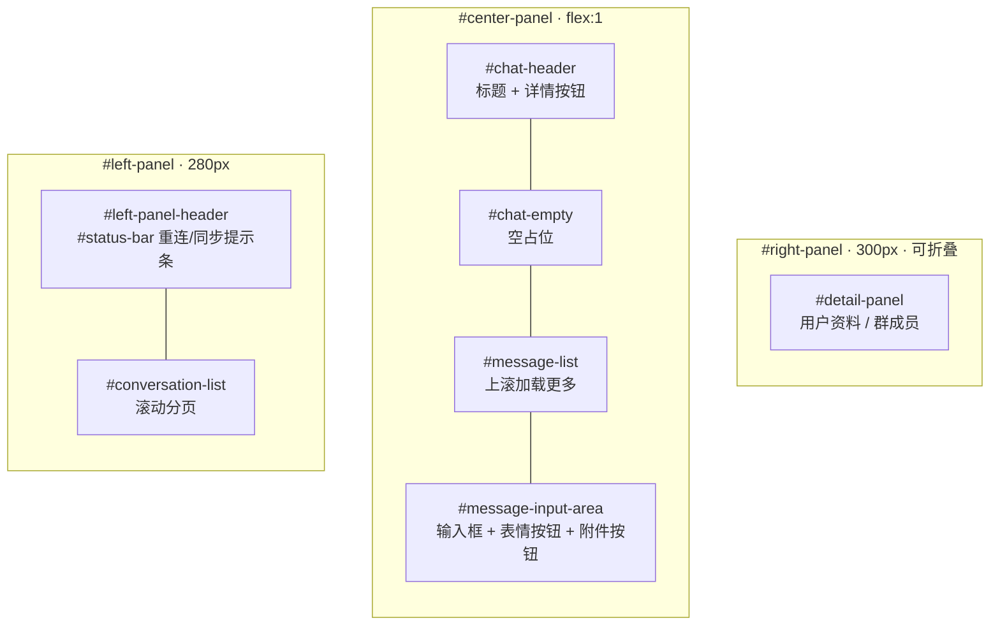
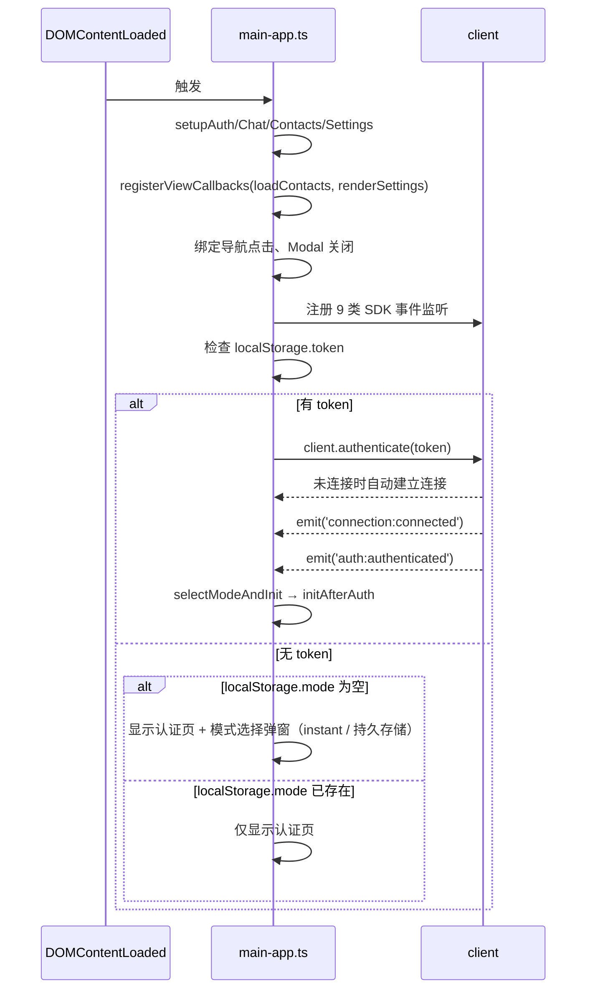
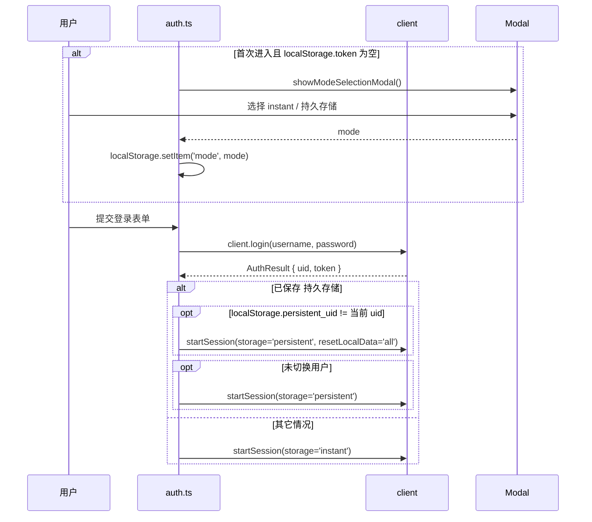

# UI 设计方案

> 主要对照：`frontend/src/uikit/app/views/`、`frontend/src/uikit/app/style.css`、`frontend/src/uikit/app/bounded-stream-window.ts`、`frontend/src/uikit/app/view-refresh.ts`。
> 最后复核：2026-07-16。
> 触发更新：视图结构、布局、有界消息流窗口、样式 token、移动端交互或本地 UI 状态变化时同步更新。
> 入口关系：上级索引见 [`README.md`](README.md)；本文面向 UI 维护者，说明视图结构、交互、有界消息流窗口、状态和样式约束。

## 目录

- [1. 技术方案](#1-技术方案)
- [2. 文件结构](#2-文件结构)
- [3. DOM 结构与页面布局](#3-dom-结构与页面布局)
  - [3.1 顶层 DOM](#31-顶层-dom)
  - [3.2 导航栏（#navbar）](#32-导航栏navbar)
  - [3.3 聊天视图（#view-chat）三栏布局](#33-聊天视图view-chat三栏布局)
- [4. 入口与初始化（main-app.ts）](#4-入口与初始化main-appts)
  - [4.1 DOMContentLoaded 流程](#41-domcontentloaded-流程)
  - [4.2 initAfterAuth 流程](#42-initafterauth-流程)
  - [4.3 SDK 事件监听](#43-sdk-事件监听)
  - [4.4 handleMessagesReceived 详解](#44-handlemessagesreceived-详解)
- [5. 视图模块详解](#5-视图模块详解)
  - [5.1 auth.ts — 认证视图](#51-authts-认证视图)
  - [5.2 chat.ts / views/chat/* — 聊天视图](#52-chatts-viewschat-聊天视图)
  - [5.3 contacts.ts — 通讯录视图](#53-contactsts-通讯录视图)
  - [5.4 settings.ts — 设置视图](#54-settingsts-设置视图)
- [6. 跨视图通信](#6-跨视图通信)
  - [6.1 回调注册](#61-回调注册)
  - [6.2 SDK 事件中转](#62-sdk-事件中转)
  - [6.3 直接函数调用](#63-直接函数调用)
- [7. 公共 UI 组件](#7-公共-ui-组件)
  - [7.1 头像](#71-头像)
  - [7.2 Toast](#72-toast)
  - [7.3 状态栏](#73-状态栏)
  - [7.4 Modal](#74-modal)
  - [7.5 未读角标](#75-未读角标)
- [8. 渲染策略](#8-渲染策略)
  - [8.1 全量重绘 vs 增量更新](#81-全量重绘-vs-增量更新)
  - [8.2 有界消息流窗口与分页口径](#82-有界消息流窗口与分页口径)
  - [8.3 显示名称更新](#83-显示名称更新)
- [9. 事件处理模式](#9-事件处理模式)
  - [9.1 初始化阶段绑定](#91-初始化阶段绑定)
  - [9.2 动态生成元素的事件绑定](#92-动态生成元素的事件绑定)
  - [9.3 滚动分页](#93-滚动分页)
  - [9.4 键盘快捷键](#94-键盘快捷键)
- [10. 错误处理](#10-错误处理)
- [11. 状态管理](#11-状态管理)
  - [11.1 层次划分](#111-层次划分)
  - [11.2 数据流方向](#112-数据流方向)
- [12. CSS 设计系统](#12-css-设计系统)
  - [12.1 CSS Variables](#121-css-variables)
  - [12.2 布局](#122-布局)
  - [12.3 响应式](#123-响应式)
  - [12.4 关键 CSS 类](#124-关键-css-类)
- [13. 性能考虑](#13-性能考虑)
- [14. SDK 使用边界](#14-sdk-使用边界)
- [15. 维护检查点](#15-维护检查点)

本文档详细描述 UI 视图层（`frontend/src/uikit/app/views/`、`frontend/src/uikit/app/main-app.ts`、`frontend/src/uikit/app/utils.ts`、`frontend/src/uikit/app/bounded-stream-window.ts`）的设计逻辑。原独立的“有界消息流窗口改造”说明已经并入本文，本文是 UI 结构、交互、有界消息流窗口和样式约束的单一事实源。

**依赖关系：** UI 层仅通过当前 `AppInstance.client` 与业务逻辑交互，不直接接触 WebSocket、DataGateway 或缓存内部。SDK 的公开接口和事件见 [SDK 设计方案](sdk设计方案.md)；双模式架构、DataGateway、内存状态等全局设计见 [前端设计方案](前端设计方案.md)；UIKit 的整体架构与嵌入接口见 [UIKit 方案](UIKit方案.md)。

---

## 1. 技术方案

| 项 | 选择 | 说明 |
|----|------|------|
| **框架** | 无框架（Vanilla TypeScript） | 直接使用 DOM API，零依赖，轻量 |
| **渲染** | `createElement` + 受控 `SafeHtml` | 用户输入默认 `textContent`；需要 HTML 的路径必须显式包装 |
| **样式** | 单文件 CSS + CSS Variables | `style.css`，BEM 风格命名，CSS 变量主题 |
| **路由** | 无 URL 路由 | 当前视图（chat/contacts/settings）与打开中的会话只存于 `AppInstance` 内存状态，不读写 `location`/`history`，不支持 URL 深链 |
| **大列表** | `BoundedPageWindow` + `BoundedStreamWindow` | 所有列表统一为有界滑动窗口全量渲染、双向翻页；滚动处理按动画帧合并，翻页用 `keyOf` 锚点保持位置 |
| **状态** | `AppInstance` 本地状态 + SDK 只读快照 API | 按事件局部刷新可见页 |

**XSS 防护：** 外部 URL 必须通过 allowlist；普通文本不直接进入 `innerHTML`；Markdown / 扩展消息 HTML 只能通过 `SafeHtml` 显式进入 DOM。安全单测与 UI 恶意输入回归覆盖该约束。

移动端或粗指针设备上，消息操作按钮始终可见且不对 `opacity` 做过渡，避免新消息插入后的首帧与 UI 测试读取时机竞争。

---

## 2. 文件结构

```
frontend/src/
├── main.ts                         — 主应用入口：调用 UIKit mountApp()
└── uikit/app/
    ├── main-app.ts                 — 统一装配、事件订阅、认证后初始化
    ├── app-instance.ts             — AppInstance、DOM scope、存储 scope
    ├── bounded-page-window.ts               — 列表数据窗口 BoundedPageWindow（按页边界游标记账、整页裁剪）
    ├── bounded-stream-window.ts             — 列表渲染引擎 BoundedStreamWindow（单一全量渲染模式）
    ├── style.css                   — 完整应用样式
    └── views/
        ├── auth.ts                 — 认证（登录 / 注册 / 模式选择）
        ├── chat.ts                 — 聊天门面（对外导出 setup/render API）
        ├── chat/                   — 会话、消息、转发、详情、导航
        ├── contacts.ts             — 通讯录（好友 / 请求 / 搜索 / 建群）
        ├── settings.ts             — 设置（资料 / 密码 / 登出）
        └── session-preferences.ts  — 屏蔽列表 / 免打扰详情状态辅助
```

**实例模式：** 每个 UIKit 挂载点都有独立 `AppInstance`，内部持有自己的 `YimsgClient`、DOM scope、存储适配器、聊天状态和联系人分页状态。主应用和嵌入态共享同一套视图代码，但不共享运行时状态。

---

## 3. DOM 结构与页面布局

### 3.1 顶层 DOM

```
<body>
├── .mc-app-shell                — `shell.ts` 生成的统一应用骨架
├── #view-auth                   — 认证视图（登录/注册表单）
├── #app                         — 主应用容器（认证前隐藏）
│   ├── #navbar                  — 侧边导航（56px 宽）
│   └── #main-content            — 视图容器（flex:1）
│       ├── #view-chat           — 聊天视图（默认）
│       ├── #view-contacts       — 通讯录视图（hidden）
│       └── #view-settings       — 设置视图（hidden）
├── #modal-overlay               — 模态框遮罩（hidden）
│   └── #modal-content           — 模态框内容区
└── #toast-container             — Toast 通知容器（fixed 右上）
```

### 3.2 导航栏（#navbar）

```
#navbar（56px 宽，垂直排列）
├── .nav-item[data-view="chat"]       聊天图标 + .nav-badge（未读红点）
├── .nav-item[data-view="contacts"]   通讯录图标 + .nav-badge（PENDING_INCOMING 红点，即待我处理的请求）
├── .nav-spacer                       弹性空白
└── .nav-item[data-view="settings"]   设置图标
```

点击导航项 → `switchView(name)` → 隐藏所有 `.view`，显示 `#view-{name}`，更新 `.active`。只改内存态和 DOM class，不触碰 `location`/`history`：无论在应用内做任何操作（登录/注册、聊天、建群、加好友等），浏览器"后退"都应该直接离开应用本身，而不是回退到应用内部的上一个视图或上一个打开的会话——这是所有视图切换和打开会话都不写 URL 的直接原因。

会话列表是有界滑动窗口，按服务端不透明边界游标双向翻页、超限整页裁剪（细节见 [`有界消息流窗口设计方案.md`](有界消息流窗口设计方案.md) §6），触底向后翻、触顶向前翻；未读角标直接使用会话项携带的 `unreadCount`；instant 模式由后端返回，持久存储模式来自本地会话表。他端来消息 `messages:received` 触发 `force` 刷新：用户贴顶时直接清空重拉首页；不贴顶时列表不动，只点亮"有新消息"提示条（`#conversation-update-pill`）并刷新未读角标，点击提示条或滚回顶部后追平。本端发送消息 `conversations:sent` 默认让该会话「移动到顶部」：无论当前滚动位置都重拉首页并滚回顶部（`renderConversationList({ toTop:true })`），不点亮提示条；会话列表初始渲染由 `renderReadyState` 负责、不依赖该事件。`conversations:clearunread` / `conversations:delete` 携带 `keys`：对仍在数据窗口内的会话调 `getConversations({ targets })` 定向拉取当前状态并更新窗口（删除态返回空 → 移除往上补齐），不整列表重拉、会话不在窗口则忽略（`refreshConversations`）。

不支持会话深链：应用不读取、也不写入任何 URL 状态（无论独立主应用 `embedded: false` 还是嵌入式 widget `embedded: true`），进入 ready 状态固定落在会话列表（chat 视图，不预选会话）。宿主页面如需让嵌入式 widget 直接打开指定会话，走 `mount()` 返回的 `handle.openConversation(target)` 编程式接口，不经过 URL。这个设计同时解决了两个问题：一是同一页面可以同时挂载多个 widget（如客服工作台一屏多开多个客服账号）时，多个 widget 不再需要抢同一份浏览器 `location`/`history`；二是应用内部导航（切视图、打开会话等）不再往宿主页面的浏览器历史里塞状态，避免用户点"后退"时先被迫在应用内部状态间来回，而不是直接离开应用。

### 3.3 聊天视图（#view-chat）三栏布局



右栏默认 `.collapsed`（`width:0; overflow:hidden`），点击 `#toggle-detail` 按钮切换。

---

## 4. 入口与初始化（main-app.ts）

### 4.1 DOMContentLoaded 流程



### 4.2 initAfterAuth 流程

```
initAfterAuth():
  mode = getStoredMode()
  if mode == null → 抛错（调用方必须先完成模式选择）
  await client.startSession({ storage })      // SDK 内部：判断持久化能力、创建 DataGateway；persistent 打开本地库后后台同步
  pendingCount = client.getContactCount(CONTACT_STATUS_PENDING_INCOMING)   // 只统计待我处理的请求，不含自己发出的
  updateContactBadges(pendingCount)
  showAppView()
  renderConversationList()
  renderSettings()
  后续 session:sync / messages:received / contacts:updated / display:updated 继续驱动局部刷新
```

### 4.3 SDK 事件监听

| 事件 | 处理函数 | UI 行为 |
|------|---------|---------|
| `connection:connected` | — | 隐藏状态栏；若当前已处于已登录状态，则读 UI 层保存的 token 并调 `authenticate(token)` 重新认证 |
| `connection:disconnected` | — | 显示 "Reconnecting..." 状态栏（每次断线/重连尝试都立即显示，不设失败次数阈值） |
| `session:sync` | — | `started` / `reset` 时显示同步状态栏；对应域 `success` / `failed` 后隐藏或保留其他同步域状态，并按域刷新会话 / 联系人 |
| `messages:received` | `handleMessagesReceived` | 重绘信号：`renderConversationList({force, keys})` + `refreshOpenConversation()` 重新拉取打开中会话；贴顶整列表 reset 重排，不贴顶则按 `event.conversationKeys` 定向刷新窗口内会话（不重排）；`event.messages` 仅用于 `onMessages`（角标/响铃），不直接追加 |
| `conversations:clearunread` / `conversations:delete` | — | `refreshConversations(keys)`：对在窗口会话 `getConversations({targets})` 定向拉取并更新/移除 |
| `conversations:sent` | — | `renderConversationList({toTop:true})`（本端发送，移动到顶部） |
| `messages:deleted` | — | `removeMessage(messageId)` 就地从消息窗口删除并往上补齐，不重拉 |
| `contacts:updated` | `handleContactsChanged` | 更新通讯录红点；若通讯录可见 → 刷新待处理请求和当前好友分页 |
| `blocklist:updated` | — | 失效当前详情页状态并重绘当前详情面板 |
| `conversations:mutelist-updated` | — | 失效当前详情页状态并重绘当前详情面板 |
| `session:kicked` | `handleSessionKicked` | Toast 提示 → 登出 → 回到登录页 |
| `display:updated` | — | 重绘会话列表、消息列表、详情面板（贴底时保持贴底，上翻阅读位置不动）；若通讯录 / 设置页可见 → 重绘对应视图，组织详情面板也随成员资料补齐刷新 |

### 4.4 handleMessagesReceived 详解

```
bindClient('messages:received', event):  // main-app.ts
  if event.messages.length: app.emitMessages(event.messages)  // 仅供 onMessages（角标/响铃）
  handleMessagesReceived(app, event.conversationKeys)         // 重绘信号，不消费 payload

handleMessagesReceived(app, keys):     // main-app.ts — 重绘分发
  renderConversationList({ force: true, keys })  // 不贴顶时据 keys 定向刷新窗口内会话
  refreshOpenConversation()            // 委托给 chat 门面 / message-list 子模块

// chat/message-list.ts — refreshOpenConversation():
  if !currentConvKey → return          // currentConvKey 存在于 chat/state.ts
  if 聊天视图不可见 → return
  if messagePageHasNewer → 同步新消息提示条后 return   // 交给触底加载或提示条跳转
  if 用户未贴底（距底部 > 50px）:
    messagePageHasNewer = true → 点亮新消息提示条 → return   // 不打断阅读
  // 贴底：reloadLatestMessagePage()
  messages = await client.getMessages({ target, limit })   // 重新拉取最新一页
  setInitialMessagePage(messages)      // 新消息/撤回/删除按服务端最新态统一反映
  renderMessages(); scrollToBottom()
  if 可自动清未读: client.clearUnread(target)  // 异步，fire-and-forget
```

> 新消息提示条 `#new-message-pill` 的可见性与 `messagePageHasNewer` 同步（`renderMessages` 末尾 `syncNewMessagePill`），点击跳到最新一页并滚到底部，细节见 [`有界消息流窗口设计方案.md`](有界消息流窗口设计方案.md) §5。

> `event.messages` 只承载按累积的通知 `msg_id` 批量取到的内容，用于 `onMessages`；会话列表与消息列表一律通过 `get_conversations` / `get_messages` 重新拉取重绘，不把通知 payload 当作完整集合。

---

## 5. 视图模块详解

每个视图模块遵循统一模式：

```
export function setup*()        — DOMContentLoaded 时调用，绑定事件监听
export function render*()       — 渲染/重绘函数，可被 main-app.ts 或其他视图调用
内部函数                         — 模块私有，处理交互逻辑
```

### 5.1 auth.ts — 认证视图

#### 导出函数

| 函数 | 说明 |
|------|------|
| `setupAuth()` | 绑定 Tab 切换、登录/注册表单提交事件 |
| `authenticate(token)` | 用 token 恢复会话 → 按已保存模式初始化 → initAfterAuth |
| `ensureInitialModeSelection()` | 进入页面时若无 token，则先要求用户选择模式 |
| `showAuthView()` | 显示 `#view-auth`、隐藏 `#app` |
| `showAppView()` | 隐藏 `#view-auth`、显示 `#app` |
| `handleSessionKicked()` | Toast 提示 → `client.logout()` → 显示登录页 |

#### 内部函数

| 函数 | 说明 |
|------|------|
| `login(username, password)` | `client.login()` → `initSelectedModeAfterAuth()` |
| `register(username, password, nickname)` | `client.register()` → 自动调用 `login()` |
| `initSelectedModeAfterAuth()` | 认证成功后直接使用已保存模式启动会话；切换 持久存储用户时把“重置本地会话数据”的业务意图交给 SDK |
| `promptModeSelection(options)` | 显示模式选择 Modal，保存 mode / layout，并按需初始化会话 |
| `showModeSelectionModal()` | 渲染 instant/持久存储选择 Modal，返回 Promise |

#### 交互流程



#### DOM 元素

| 元素 | 用途 |
|------|------|
| `.auth-card .tab` | 登录/注册 Tab 切换 |
| `#login-form` / `#register-form` | 表单容器 |
| `#login-username` / `#login-password` | 登录输入 |
| `#reg-username` / `#reg-password` / `#reg-nickname` | 注册输入 |
| `#auth-error` | 错误信息显示（非 Toast） |

#### 设计要点

- **认证错误**使用 `#auth-error` 元素显示（非 Toast），避免遮挡表单
- **模式选择 Modal** 用 `Promise` 等待用户点击，协调异步流程
- 只要没有 token，就会先要求选择模式（instant / 持久存储）
- token 无效时会清空 token 并回到登录页；模式在下一次登录前重新选择
- 登录成功后不再二次弹出模式选择，而是直接按已保存模式初始化；若已保存 `persistent` 且当前环境支持，则继续使用 `persistent`

---

### 5.2 chat.ts / views/chat/* — 聊天视图

聊天视图拆分为一个门面文件 `chat.ts` 和一组实现模块 `views/chat/*`，共同承载会话列表、消息区、详情面板三个子区域。

#### 模块本地状态（UI 层私有，不在 SDK 中）

| 变量 | 类型 | 说明 |
|------|------|------|
| `currentConvKey` | `string\|null` | 当前打开的会话 convKey |
| `currentMessages` | `Message[]` | 当前消息面板中展示的有界消息页，按 seq 升序保存 |
| `loadingMoreMessages` | `boolean` | 是否正在加载更早消息（防抖） |
| `loadingNewerMessages` | `boolean` | 是否正在加载更新消息（防抖） |
| `messagePageHasOlder` / `messagePageHasNewer` | `boolean` | 当前页旧侧 / 新侧是否还有可分页数据 |

#### 导出函数

| 函数 | 说明 |
|------|------|
| `setupChat()` | 绑定发送、上传、滚动、详情面板等所有事件 |
| `registerViewCallbacks(loadContacts, renderSettings)` | 注册跨视图回调 |
| `getCurrentConvKey()` | 返回当前 convKey（供 main-app.ts 判断使用） |
| `renderConversationList()` | 重绘左栏会话列表 |
| `openConversation(conv)` | 切换到指定会话，加载消息 |
| `renderMessages()` | 重绘中栏消息列表 |
| `scrollToBottom()` | 消息列表滚动到底部；动态高度消息会在多帧测量后继续收敛到底部 |
| `loadNewerMessages()` | 消息下滚加载被分页裁掉的更新历史 |
| `refreshOpenConversation()` | 收到 `messages:received` 重绘信号时刷新打开中的会话（不消费 payload）：贴底时重拉最新一页并滚底，上翻阅读中只点亮新消息提示条，由 main-app.ts 调用 |
| `refreshDetailPanel()` | 轻量刷新详情面板的昵称/头像，由 main-app.ts 在 `display:updated` 时调用 |
| `rerenderCurrentDetailPanel()` | 当前详情面板整块重绘，用于屏蔽 / 免打扰状态变更后的刷新 |
| `applyConversationGuards()` | 根据屏蔽列表状态禁用当前单聊的输入、表情与附件按钮 |
| `startDMFromContact(uid)` | 从通讯录发起私聊 |
| `switchView(name)` | 切换主视图 |

#### 内部函数

| 函数 | 说明 |
|------|------|
| `msgPreview(msg, isGroup)` | 生成会话列表的最后消息预览文本 |
| `getConversations()` | 触底用上一页 `page.endCursor` 调 `client.getConversations({ cursor, limit })`，只渲染当前页和预取范围 |
| `loadOlderMessages()` | 消息上滚加载更早历史，更新 chat/state.ts 中的 `currentMessages` 数据页 |
| `sendMessage()` | 先调 `client.validateTextMessage()`，再通过 `client.sendMessage()` / `client.sendQuotedTextMessage()` 发送 |
| `uploadAndSend(file, type)` | 上传文件 → 发送消息 |
| `showGroupDetail(groupId)` | 右栏渲染群详情 + 成员列表 |
| `showUserDetail(uid)` | 右栏渲染用户资料 |
| `appendMembers(container, members)` | 追加成员列表 DOM |
| `cleanupMemberScroll()` | 清理成员列表滚动监听 |

#### 会话列表渲染

```
renderConversationList():
  page = client.getConversations({ cursor, limit })
  conversations = page.conversations
  对每条 conversation:
    descriptor = client.describeConversation(conv)
    convKey = descriptor.key
    isGroup = descriptor.kind === 'group'
    target = descriptor.target
    display = isGroup ? client.getGroupInfos([gid]) : client.getUserInfos([uid])
    unread = conv.unreadCount || 0
    preview = msgPreview(conv.lastMessage, isGroup)

  innerHTML = conversations.map(conv →
    <div class="conversation-item {active?}" data-key="{convKey}">
      <div class="avatar-wrapper">
        <div class="avatar avatar-md">{avatarInnerHtml}</div>
        {unread > 0 ? '<span class="unread-badge">{min(unread, 99)}+</span>' : ''}
      </div>
      <div class="conversation-info">
        <div class="conversation-top">
          <div class="conversation-name-row">
            <span class="conversation-name">{name}</span>
          </div>
          <span class="conversation-time">{formatTime}</span>
        </div>
        <div class="conversation-preview">{preview}</div>
      </div>
    </div>
  ).join('')

  绑定每个 conversation-item 的 click → openConversation(conv)
```

**未读角标**：数字 > 99 时显示 "99+"；有未读时在 avatar-wrapper 内显示红色 badge。

**导航栏红点**：`client.getUnreadCount() > 0` → `setNavBadge('.nav-item[data-view="chat"]', visible)`。

#### 消息渲染

```
renderMessages():
  对每条 message:
    isSelf = msg.from_uid === client.getSessionSnapshot().currentUid

    if msg.msg_type === MSG_TYPE_SYSTEM:
      创建 .message-system 居中灰色文本
    else:
      创建 .message-row（self → 右对齐，other → 左对齐）
      if isGroup && !isSelf && from_uid !== lastSender:
        添加 .message-sender 标签（显示发送者昵称）
      创建 .message-bubble:
        TEXT → escapeHtml(content)
        IMAGE → 
        FILE → 解析 JSON content → 文件图标 + 文件名 + 大小 + 下载链接
      添加 .message-time 时间戳

  追踪 lastSender，连续同一发送者不重复显示昵称
```

**消息类型渲染规则**：

| msg_type | 渲染 | 说明 |
|----------|------|------|
| 0 (TEXT) | 纯文本 `escapeHtml` | 防 XSS |
| 1 (IMAGE) | `` 标签 | 点击新标签页打开原图 |
| 2 (SYSTEM) | 居中灰色文字 | 无气泡、无发送者 |
| 3 (FILE) | 文件图标 + 名称 + 大小 + 下载链接 | content 为 JSON `{url, name, size}` |

#### 进入会话流程

```
openConversation(conv):
  descriptor = client.describeConversation(conv)
  convKey = descriptor.key
  target = descriptor.target

  currentConvKey = convKey
  client.clearUnread(target)                          // 清未读 + 通知服务端
  setNavBadge(...)                                 // 更新导航栏红点

  设置 #chat-title、显示 #chat-header / #message-input-area
  applyConversationGuards()                        // 若当前单聊已被我屏蔽，则禁用输入区
  隐藏 #chat-empty

  messages = await client.getMessages({ target, limit: 30 })
  setInitialMessagePage(messages.reverse(), hasOlder)
  renderMessages()
  scrollToBottom()
```

补充约束：上面这条 `clearUnread(target)` 只属于“用户真正打开会话”的路径。桌面布局下，当前 chat 视图可见时仍允许自动清当前会话未读；mobile 布局下只有 `#view-chat.mobile-showing-chat` 时才允许自动清未读，若只是停留在会话列表，不应因为保留了 `currentConvKey` 就自动消红点。

#### 发送消息流程

```
sendMessage():
  content = #msg-input.value.trim()
  if input.disabled || !content || !currentConvKey → return

  target = client.describeConversation(currentConvKey).target
  client.validateTextMessage(content)
  result = composerQuote
    ? await client.sendQuotedTextMessage(target, { text: content, quote })
    : await client.sendMessage(target, content)
  appendLiveMessageToPage(result.message)
  // SDK 内部只更新会话快照；当前消息面板仍由 chat/state.ts 中的 currentMessages 数据页维护
  renderMessages()
  scrollToBottom()
  清空输入框
```

#### 引用与转发

`chat.ts` 门面不再直接 import `message_ext` 子模块，也不再自己处理转发加密；这些实现下沉到 `views/chat/*`。

- 撤回入口：消息操作菜单会在“自己发送、仍处于撤回时限内、且消息不是 recall event / recall placeholder”时显示 `撤回`。
- 引用发送：`client.sendQuotedTextMessage(target, { text, quote })`
- 转发发送：转发弹窗按会话分页读取目标候选，最多选择 500 个目标会话，并对每个目标调用 `client.forwardMessages(target, messages, comment)`
- 转发渲染：`client.describeMessage(message).forward`（标题与被转发的 msg_ids）
- ext / markdown 渲染：`client.describeMessage(message)`

#### 附件上传流程

```
#msg-attach click → 动态创建附件菜单:
  [📷 Image] → 触发 #file-picker-image.click()
  [📎 File]  → 触发 #file-picker-file.click()

uploadAndSend(file, type):
  showStatus('Uploading...', 'syncing')
  data = await client.uploadFile(file, type)
  hideStatus()

  if type === 'image':
    await client.sendMessage(target, data.url, MSG_TYPE_IMAGE)
  if type === 'file':
    content = JSON.stringify({ url: data.url, name: file.name, size: data.size })
    await client.sendMessage(target, content, MSG_TYPE_FILE)

  renderMessages()
  scrollToBottom()
```

#### 表情选择流程

```
#msg-emoji click → 在 #message-input-area 内挂载 .emoji-picker 浮层:
  顶部 .emoji-picker-tabs：按分类（表情/手势/动物/食物/活动/旅行/物品/符号/旗帜）切换
  .emoji-picker-grid：当前分类的 emoji 网格，点击写入 #msg-input 光标位置

  选中 emoji 后浮层不关闭（可连续插入多个）
  点击浮层与 #msg-emoji 之外的区域 → 关闭浮层
```

emoji 数据（`views/chat/emoji-data.ts`）为纯 Unicode 字符表，跟随系统 emoji 字体渲染，不引入图片资源。

#### 详情面板

**用户详情（`showUserDetail`）**：

```
showUserDetail(uid):
  requestId = ++detailRequestId                    // 防竞态：旧请求结果忽略
  display = client.getUserInfos([uid])              // 未命中或过期时触发后台刷新
  blocklistPage = await client.getBlocklist({ uids: [uid], limit: 1 })
  mutePage = await client.getMutelist({ toUid: uid, limit: 1 })
  渲染：头像 + 昵称 + 状态标签（屏蔽 / 免打扰） + 设置备注 / 屏蔽 / 免打扰按钮
  500ms 后重新读取（等待 display:updated 更新缓存）
```

**群详情（`showGroupDetail`）**：

```
showGroupDetail(groupId):
  requestId = ++detailRequestId
  display = client.getGroupInfos([groupId])
  memberPage = await client.getGroupMembers(groupId, { limit: list.pageSize })
  mutePage = await client.getMutelist({ groupId, limit: 1 })

  渲染：群头像（可点击上传更换） + 群名 + 免打扰状态标签 + 编辑 / 免打扰 / 收藏按钮 + 成员窗口范围
  群主显示 "Owner" 角标
  成员列表是有界滑动窗口（role 倒序、uid 升序），按服务端边界游标双向翻页、整页裁剪、全量渲染

  if requestId !== detailRequestId → return        // 被新请求覆盖，丢弃
```

**竞态保护：** 使用递增的 `detailRequestId`。如果用户快速切换详情面板，旧的异步请求返回时检查 ID 不匹配则丢弃结果，防止旧数据覆盖新数据。

#### 分页策略

所有列表都是有界滑动窗口、双向 keyset 游标翻页：滚动到顶部 / 底部 160px 内触发，向后用尾页 `end_cursor`、向前用首页 `start_cursor`，超 `maxPages` 整页裁剪，补页后由引擎用 `keyOf` 锚点保持位置。

| 列表 | 游标 | 每页数量 |
|------|------|---------|
| 会话列表 | `get_conversations` 边界游标 | `list.pageSize`（40） |
| 消息列表 | `get_messages` 边界游标 | `chat.messagePageSize`（30） |
| 通讯录好友 / 请求 | `get_contacts` 边界游标 | `list.pageSize`（40） |
| 群成员 | `get_group_members` 边界游标（role 倒序、uid 升序） | `list.pageSize`（40） |

所有分页使用 loading 标志防止重复请求，`hasMore` 标志停止已无数据的方向。

---

### 5.3 contacts.ts — 通讯录视图

#### 导出函数

| 函数 | 说明 |
|------|------|
| `setupContacts()` | 绑定 Tab 切换、搜索、滚动事件和通讯录左右栏拖拽改宽 |
| `loadContacts()` | 加载待处理请求，并在好友 Tab 可见时刷新好友分页 |
| `updateContactBadges(pendingCount)` | 更新导航栏通讯录红点 |

#### 内部函数

| 函数 | 说明 |
|------|------|
| `loadFriendPage({ mode })` | reset / forward / backward 三种模式调用 `client.getContacts()` 维护好友窗口 |
| `renderFriends()` | 全量渲染好友窗口条目 |
| `renderRequests(requests)` | 渲染待处理请求列表 |
| `refreshContactsDisplay()` | `display:updated` 等显示资料变化时重绘联系人列表；若组织详情面板打开，也重新渲染当前 tag |
| `searchUser()` | 按用户名搜索用户 |
| `addFriend(friendUid)` | 发送好友请求 |
| `acceptFriend(friendUid)` | 接受好友请求；只有接收方能调用成功，UI 只在 `#requests-incoming` 渲染按钮 |
| `rejectFriend(friendUid)` | 拒绝好友请求；只有接收方能调用成功，UI 只在 `#requests-incoming` 渲染按钮 |
| `deleteFriend(friendUid)` | 删除好友 |
| `showCreateGroupModal()` | 显示建群 Modal |
| `showCreateOrgModal()` | 显示创建组织 Modal |

#### 三个 Tab

```
#view-contacts
├── .contacts-left（桌面默认 280px，可通过 #contacts-resizer 拖拽调整）
│   ├── .tabs
│   │   ├── [data-ctab="friends"]     Friends
│   │   ├── [data-ctab="requests"]    Requests（.nav-badge，PENDING_INCOMING 红点）
│   │   └── [data-ctab="search"]      Search
│   ├── .contacts-content（滚动容器）
│   │   ├── #friends-tab              好友列表（点击选中，操作在右侧详情面板）
│   │   ├── #requests-tab             请求列表容器
│   │   │   ├── #requests-outgoing    我发出的请求（仅"等待验证"文案，无按钮，为空时隐藏）
│   │   │   └── #requests-incoming    待我处理的请求（Accept / Reject 按钮）
│   │   └── #search-tab               搜索 + 结果 + Add 按钮
│   └── .contacts-footer
│       ├── #create-org-btn           Create Organization 按钮
│       └── #create-group-btn         Create Group 按钮
├── #contacts-resizer（桌面鼠标拖拽分隔条；移动布局隐藏）
└── #contacts-detail-panel.contacts-right
```

桌面布局中，通讯录左栏拖拽宽度限制在 `220px` 到 `520px` 之间，并始终为右侧详情区保留至少 `320px` 可用宽度；双击分隔条恢复默认宽度。移动布局保持单列切换，不展示拖拽分隔条。

#### 好友列表项渲染

```
renderFriends():
  items = state.friendWindow.items                                 // 有界窗口，全量渲染
  预取窗口内条目的展示信息（getUserInfos / getGroupInfos）
  friendListView.render({ items, hasMoreBefore, hasMoreAfter, loadBefore, loadAfter, keyOf, renderItem }):
    对窗口内每个 friend:
      createElement('div.contact-item'):
        avatar(display) + name（无内联按钮）
        click → showContactDetail(friend)，右侧详情面板渲染 Chat / Remark / Mute / Block / Delete 操作
    触顶且 hasMoreBefore → loadBefore → loadFriendPage({ mode:'backward' })
    触底且 hasMoreAfter → loadAfter → loadFriendPage({ mode:'forward' })
```

组织条目打开后右侧进入组织架构浏览器：根 tag 名称来自 `getOrgInfos()`；直接子项来自 `getTags()`。子 tag 行使用响应里的 `name` / `avatar`；成员行只拿到 `uid` 和职务，昵称 / 头像必须通过 `getUserInfos()` 的显示资料缓存补齐。成员资料冷缓存未命中时显示加载态，不得把 UID 当作成员名长期展示；后续 `display:updated` 会触发 `refreshContactsDisplay()`，打开中的组织详情面板随之重新渲染为真实昵称。面包屑栏右侧的"管理"按钮打开 `views/org-admin.ts` 弹层（对当前节点无管理权限时，写操作提交后由服务端拒绝、UI 用 toast 提示，浏览器本身不做权限预判）。该弹层同样只拿到 tag/成员 `uid`，展示名称走同一套 `getTagInfos()` / `getUserInfos()` 缓存；弹层自身也订阅 `display:updated` 并在事件到来时重新渲染当前节点，避免新建部门等操作后名称冷缓存未命中时长期停留在 UID 兜底态。该弹层的 `showTextInputModal`/`showConfirmModal` 等嵌套提示框复用同一个 `#modal-overlay`/`#modal-content`，resolve 时会短暂把 `hidden` 加回去，因此订阅解绑不能监听 `modal-overlay` 的 `hidden` class（会把嵌套提示框关闭误判成弹层整体关闭而提前解绑），而是监听 `modal-content` 上只在本弹层自身两个真正关闭路径才摘掉的 `modal-content-wide` class；事件触发时还要先确认 `modal-content` 当前渲染的确实是本弹层自己的列表视图，避免在嵌套提示框还开着或弹层已关闭时误重渲染。

#### 搜索用户

```
searchUser():
  username = #search-username.value.trim()
  result = await client.searchUser(username)

  if result:
    渲染搜索结果卡片：头像 + 昵称 + 用户名 + [Add Friend] 按钮
    按钮点击 → client.addFriend(uid) → showToast success
  else:
    显示 "User not found"
```

#### 建群 Modal

```
showCreateGroupModal():
  friends = 按 keyset 游标累加 client.getContacts({ status: CONTACT_FRIEND, cursor, limit: 80 })

  渲染 Modal:
    群名输入框 #group-name-input
    好友复选框列表 #member-select-list（最多选 500 人）
    选中计数 #member-count
    [Cancel] / [Create] 按钮

  Create 点击:
    name = #group-name-input.value
    selectedUids = 选中的 checkbox 的 value
    memberUids = selectedUids + 当前用户 UID
    await client.createGroup(name, memberUids)
    closeModal()
    showToast success
    // conversations:sent 事件会自动触发会话列表重绘
```

#### 创建组织 Modal

```
showCreateOrgModal():
  name = await showTextInputModal({ title, label })  // 复用通用文本输入 Modal，仅需组织名称
  if !name: return

  orgId = await client.createOrg(name)               // 调用方自动成为组织根管理员（GRANT 边），任意登录用户可调用
  await client.addOrgMember(orgId, orgId, 当前用户 UID) // 再把自己挂为组织根的普通成员，使其出现在自己的通讯录里
  showToast success
  // add_org_member 触发的 contacts:updated 通知会驱动通讯录列表自动刷新
```

`create_org` 只写组织字典行和管理员 GRANT 边，不产生通讯录条目；`add_org_member` 才会把调用方 upsert 进 uid 分片的通讯录组织行并推送 `contacts:updated`，两步都做才能让新建组织出现在创建者自己的"好友"列表里。

---

### 5.4 settings.ts — 设置视图

#### 导出函数

| 函数 | 说明 |
|------|------|
| `setupSettings()` | 绑定保存、修改密码、登出、头像上传事件 |
| `renderSettings()` | 渲染当前用户资料和模式标识 |

#### 内部函数

| 函数 | 说明 |
|------|------|
| `saveProfile()` | 保存昵称修改 |
| `changePassword()` | 修改密码（旧密码 + 新密码） |
| `logout()` | 登出 → 断连 → 回到登录页 |
| `uploadAvatar(file)` | 上传头像 → 更新资料 |

#### 页面结构

```
#view-settings
└── .settings-page
    ├── .settings-header
    │   ├── #settings-avatar        头像（点击上传）
    │   ├── #settings-nickname      当前昵称
    │   ├── #settings-uid           UID
    │   └── #settings-mode          模式标识（instant / 持久存储）
    ├── .settings-card（Profile）
    │   ├── #edit-nickname          昵称编辑框
    │   └── #save-profile-btn       保存按钮
    ├── .settings-card（Password）
    │   ├── #old-password           旧密码
    │   ├── #new-password           新密码
    │   └── #change-pwd-btn         修改按钮
    └── #logout-btn                 登出按钮
```

#### renderSettings

```
renderSettings():
  snapshot = client.getSessionSnapshot()
  display = client.getUserInfos([snapshot.currentUid])
  #settings-avatar → avatarInnerHtml(display)
  #settings-nickname → display.nickname || snapshot.currentUid
  #settings-uid → 'UID: ' + snapshot.currentUid
  #settings-mode → snapshot.mode（instant 橙色 / 持久存储 绿色）
  #edit-nickname → display.nickname
```

#### 头像上传

```
#settings-avatar click → #avatar-picker.click()
#avatar-picker change →
  file = event.target.files[0]
  data = await client.uploadFile(file, 'avatar')
  await client.updateProfile({ avatar: data.url })   // SDK 自动更新缓存
  renderSettings()                                     // 立即重绘
```

---

## 6. 跨视图通信

视图模块之间不直接 import，通过以下机制通信：

### 6.1 回调注册

```typescript
// chat.ts / views/chat/*
export function registerViewCallbacks(
  loadContacts: () => void,
  renderSettings: () => void,
) { ... }

// main-app.ts
registerViewCallbacks(loadContacts, renderSettings);
```

`switchView()` 切换到对应视图时调用注册的回调（加载数据/刷新渲染）。

### 6.2 SDK 事件中转

所有视图的数据更新由 `main-app.ts` 统一监听 SDK 事件后分发：

```
SDK emit('messages:received')        → main-app.ts → renderConversationList({force, keys}) + refreshOpenConversation()（不贴顶时按 conversationKeys 定向刷新窗口内会话；payload.messages 仅供 onMessages）
SDK emit('conversations:clearunread'/'conversations:delete') → main-app.ts → refreshConversations(keys)（定向 getConversations({targets}) 更新/移除窗口）
SDK emit('conversations:sent')    → main-app.ts → renderConversationList({ toTop:true })（本端发送移动到顶部）
SDK emit('messages:deleted')         → main-app.ts → removeMessage(messageId) + refreshConversations([key])（定向刷新会话预览）
SDK emit('contacts:updated')         → main-app.ts → updateContactBadges() + loadContacts()
SDK emit('display:updated')          → main-app.ts → renderConversationList() + renderSettings()
```

### 6.3 直接函数调用

| 调用方 | 被调用 | 场景 |
|--------|--------|------|
| contacts.ts | `startDMFromContact(uid)` (chat.ts 门面) | 点击好友的 Chat 按钮 |
| contacts.ts | `switchView('chat')` (chat.ts 门面) | 跳转到聊天视图 |
| auth.ts | `initAfterAuth()` (main-app.ts) | 认证成功后初始化 |

---

## 7. 公共 UI 组件

无独立组件文件，通过函数和 HTML 模板在各视图中复用。

### 7.1 头像

```typescript
avatarInnerHtml(display: { avatar: string; nickname: string }): string
```

| 情况 | 渲染 |
|------|------|
| 有头像 URL | `` |
| 无头像 | 昵称首字（`escapeHtml`），显示在圆形容器中 |

三种尺寸：`.avatar-sm` (32px)、`.avatar-md` (40px)、`.avatar-lg` (64px)。

### 7.2 Toast

```typescript
showToast(text: string, type?: string)
```

右上角浮层，4 秒自动消失。`type` 为 `'success'`（绿色左边框）或 `'error'`（红色左边框）。

### 7.3 状态栏

```typescript
showStatus(text: string, cls: string)   // 显示，cls = 'syncing' | 'reconnecting'
hideStatus()                             // 隐藏
```

内嵌在会话列表顶部 `#left-panel-header` 内的小提示条（非 fixed，不覆盖全局视口），移动端/桌面端布局共用同一实现。`syncing` → 浅蓝底 + 蓝字；`reconnecting` → 灰底 + 灰字（不使用红色，避免过度告警）。

### 7.4 Modal

全局单例 `#modal-overlay` + `#modal-content`。每次使用时替换 `innerHTML`。

```typescript
closeModal()   // 添加 .hidden 类
```

- 点击遮罩关闭（除非设置了 `data-preventClose`）
- 用途：模式选择、建群、转发、确认 / 文本输入通用弹窗（`app.showConfirmModal` / `app.showTextInputModal`）、组织管理（`views/org-admin.ts`，`.modal-content-wide` 修饰类加宽到 640px 以容纳部门树 + 成员列表 + 管理员区块）

### 7.5 未读角标

```html
<!-- 会话列表未读数（红色圆形，显示数字） -->
<span class="unread-badge">{count}</span>    <!-- count > 99 时显示 "99+" -->

<!-- 导航栏红点（无数字） -->
<span class="nav-badge"></span>
```

```typescript
setNavBadge(selector: string, visible: boolean)   // 增删红点
```

---

## 8. 渲染策略

### 8.1 全量重绘 vs 增量更新

| 场景 | 策略 | 说明 |
|------|------|------|
| 会话列表 | **有界窗口全量渲染** | `getConversations()` 无游标拉首页，触底用尾页边界游标向后翻、触顶向前翻，超限整页裁剪 |
| 消息列表 | **有界窗口全量渲染** | 窗口只保留有限消息页（≤150 条），全部交给浏览器布局，滚动零重建 |
| 好友列表 | **有界窗口全量渲染** | `get_contacts(status=FRIEND)` 双向翻页，不为总数或搜索预拉全量 |
| 请求列表（待我处理） | **有界窗口全量渲染** | `get_contacts(status=PENDING_INCOMING)` 双向翻页，带接受/拒绝按钮；红点只表达已加载窗口内是否存在请求 |
| 请求列表（我发出的） | **一次性拉取，不分页** | `get_contacts(status=PENDING_OUTGOING, limit=N)`，仅展示"等待验证"文案，不带接受/拒绝按钮，不参与红点 |
| 建群候选 / 转发候选 / 群成员 | **有界窗口全量渲染** | 选中状态独立于 DOM 保存，双向翻页，群成员标题用 `page.total` 显示成员总数 |
| 设置页 | **局部更新** | 更新特定元素的 `textContent` / `src` |

**设计取舍：** 所有列表统一为「有界滑动窗口 + 全量渲染 + 双向翻页」，UIKit 用 `BoundedStreamWindow` 作为唯一渲染引擎（单一模式，无 `itemSize` / spacer / 切片）。滚动条不要求精确反映完整数据集，滚动空间只代表“已加载窗口”；服务端尚未加载的数据只由 `hasMoreBefore` / `hasMoreAfter` 和“已到顶 / 已到底 / 没有更多”边界提示表达。背景数据变化不打断浏览：消息列表用户不贴底时只点亮新消息提示条，贴底才重拉最新一页；会话列表用户不贴顶时只点亮“列表有更新”提示条，贴顶才重拉首页。

### 8.2 有界列表窗口与分页口径

列表渲染的目标是：DOM 和 UI 内存只保留有界数量的数据与节点；滚动空间只代表当前已加载窗口，不模拟未加载数据高度。当前实现没有引入第三方虚拟列表库，全部使用 Vanilla TypeScript 与 DOM API。完整设计见 [`有界消息流窗口设计方案.md`](有界消息流窗口设计方案.md)，下表只作概述。

| 区域 | 代码入口 | 数据窗口 | 数据来源 |
|---|---|---|---|
| 会话列表 | `views/chat/conversation-list.ts` | 有界滑动窗口，双向翻页 | `client.getConversations()` |
| 消息列表 | `views/chat/message-list.ts`、`message-page.ts` | 有界滑动窗口（≤150 条），双向翻页 | `client.getMessages()` |
| 通讯录好友 | `views/contacts.ts` | 有界滑动窗口，双向翻页 | `client.getContacts()` |
| 好友请求 | `views/contacts.ts` | 有界滑动窗口，双向翻页 | `client.getContacts()` |
| 群成员 | `views/chat/detail-panel.ts` | 有界滑动窗口，双向翻页 | `client.getGroupMembers()` |
| 转发候选 | `views/chat/forward.ts` | 有界滑动窗口，双向翻页 | `client.getConversations()` |
| 建群候选 | `views/contacts.ts` | 有界滑动窗口，双向翻页 | `client.getContacts()` |

数据层 `bounded-page-window.ts` 与渲染层 `bounded-stream-window.ts`：

| 组件 / 方法 | 责任 | 使用场景 |
| --- | --- | --- |
| `BoundedPageWindow<T>` | 按页保存条目与不透明边界游标，`setInitial` / `appendForward` / `prependBackward` / `appendLive` 维护窗口，超 `maxPages` 整页裁剪 | 所有列表数据窗口 |
| `BoundedStreamWindow<T>` | 持有 scroll 监听（帧合并），全量渲染窗口条目 | 所有列表渲染 |
| `render()` | 统一执行空态 / 加载态 / 边界提示、全量节点渲染、scrollTop 先读后清恢复、`keyOf` 锚点保持和触顶 / 触底分页触发 | 所有列表渲染 |
| `createFrameScheduler()` | 将高频滚动重绘合并到同一动画帧 | 引擎内部滚动处理 |
| `getOrCreateBoundedStreamWindow()` | 按 owner 复用引擎实例 | UIKit 页面级列表 |

不再做逐行实测高度、测量缓存、估算校正或窗口切片：数据窗口本身有上限，全部渲染，浏览器布局即真实位置；翻页锚点由引擎据 `keyOf`（消息列表用 `messageId`）单次 DOM 读取恢复。所有列表都保留浏览器原生 scroll anchoring 兜底头像 / 图片等异步增高，不再对任何列表设 `overflow-anchor: none`。

### 8.3 显示名称更新

显示名称通过 `client.getUserInfos()` / `client.getGroupInfos()` **同步读取**。缓存 miss 时返回空字符串或 uid，SDK 后台拉取完成后触发 `display:updated` 事件，`main-app.ts` 统一调用 `renderConversationList()` 等可见视图刷新入口重绘。组织成员详情属于特殊展示面：成员行只允许在冷缓存期间显示加载态，不能把 UID 作为最终昵称回退。

**一次闪烁问题：** 冷启动时可能短暂显示空昵称 → 后台拉取完成后刷新为真实昵称。实践中由于缓存命中率高、拉取速度快，用户几乎感知不到。

---

## 9. 事件处理模式

### 9.1 初始化阶段绑定

```
setup*() 在 DOMContentLoaded 时调用:
  对固定 DOM 元素绑定事件监听（表单提交、按钮点击、键盘快捷键、滚动）
```

### 9.2 动态生成元素的事件绑定

两种模式：

**模式 A — innerHTML + querySelector + addEventListener**：

```typescript
container.innerHTML = items.map(item => `
  <div class="item" data-uid="${item.uid}">...</div>
`).join('');

container.querySelectorAll('.item').forEach(el => {
  el.addEventListener('click', () => handleClick(el.dataset.uid));
});
```

**模式 B — createElement + 直接绑定**：

```typescript
const div = document.createElement('div');
const btn = document.createElement('button');
btn.addEventListener('click', () => handleClick(uid));
div.appendChild(btn);
container.appendChild(div);
```

- **模式 A** 用于大批量渲染（会话列表），模板字符串更简洁
- **模式 B** 用于需要复杂交互的元素（联系人详情面板的多个操作按钮），事件绑定更直观

### 9.3 滚动分页

滚动监听由 `BoundedStreamWindow` 统一持有（帧合并），render 末尾做触界检测：

```
checkReach():
  触底: maxScrollTop - scrollTop <= 160 且 hasMoreAfter → loadAfter()
  触顶: scrollTop <= 160 且 hasMoreBefore → loadBefore()
  （并发守卫在加载回调内部：if (loading || !hasMore) return）

  加载完成 → loading = false → 重渲（视窗未填满时链式补页）
  无数据返回 → hasMore = false（边界提示"已到顶 / 已到底 / 没有更多"）
```

### 9.4 键盘快捷键

| 场景 | 按键 | 行为 |
|------|------|------|
| 消息输入 | Enter | 发送消息 |
| 消息输入 | Shift+Enter | 换行（不发送） |
| 搜索输入 | Enter | 执行搜索 |
| 登录/注册表单 | Enter | 提交表单（原生 form submit） |

---

## 10. 错误处理

| 场景 | 方式 | 说明 |
|------|------|------|
| 认证失败 | `#auth-error` 元素 | 内嵌表单下方，非 Toast |
| 网络操作失败 | `showToast(msg, 'error')` | 4s 自动消失 |
| 操作成功 | `showToast(msg, 'success')` | 4s 自动消失 |
| 连接断开 | `connection:disconnected` → `showStatus('Reconnecting...', 'reconnecting')` | 会话列表顶部提示条（灰色）；每次断线/重连尝试都立即显示，不等待失败次数阈值，重连成功后隐藏 |
| SDK 同步中 | `session:sync` → `showStatus('Syncing messages...', 'syncing')` | 会话列表顶部提示条（浅蓝色）；可覆盖启动后台同步和通知同步，所有同步域结束后隐藏 |
| 被踢下线 | Toast + 自动登出 | 跳转到登录页 |

所有异步操作使用 `try/catch`，捕获后 Toast 显示错误信息。

---

## 11. 状态管理

### 11.1 层次划分

```
SDK 层（YimsgClient — 单门面）
├── SessionLifecycleMachine               — sessionState / connectionState / SessionSnapshot
├── 会话数据通过 YimsgClient / DataGateway 读取；SDK 不维护 ConversationStore
├── PendingContactsIndex                         — 待处理请求 key 集合
├── DisplayInfoCache                      — 用户/群显示信息缓存
└── DataGateway                            — instant / 持久存储数据读取与同步

视图层（模块级变量 — 辅助状态）
├── views/chat/state.ts: currentConvKey, currentMessages, loadingMoreMessages,
│                        detailRequestId, detailOpen, memberScrollHandler
├── contacts.ts: friendPage, friendPageLoading, requestPage, requestPageLoading
└── settings.ts: 无（状态在 input 元素中）

持久存储
├── localStorage.token                     — 登录令牌
├── localStorage.mode                      — 运行模式
├── localStorage.persistent_uid                   — 最近一次成功初始化 持久存储的 uid
└── 其他 UI 自管状态（可选）
```

### 11.2 数据流方向

```
SDK 事件 → main-app.ts 事件处理 → 调用 render 函数 → 读取 client.get* 快照 → 渲染 DOM
                                                    ↗
用户操作 → view 事件处理 → 调用 client.xxx() → SDK 更新内部状态 → emit 事件 ↗
```

**单向数据流：** UI 不直接修改 SDK 内部状态。UI 只维护自己的视图态，如 `currentConvKey` 和 `currentMessages`。

---

## 12. CSS 设计系统

### 12.1 CSS Variables

| 类别 | 变量 | 说明 |
|------|------|------|
| **主色** | `--primary`, `--primary-hover` | 蓝色系按钮和链接 |
| **语义色** | `--error`, `--success`, `--warning` | 红 / 绿 / 黄 |
| **背景** | `--bg-page`, `--bg-panel`, `--bg-hover`, `--bg-active` | 分层背景 |
| **文字** | `--text-primary`, `--text-secondary`, `--text-placeholder` | 三级文字 |
| **气泡** | `--bubble-self`, `--bubble-other` | 消息气泡颜色 |
| **间距** | `--space-xs`(4px) ~ `--space-2xl`(32px) | 统一间距 |
| **圆角** | `--radius-sm`, `--radius-md`, `--radius-lg` | 统一圆角 |
| **阴影** | `--shadow-sm`, `--shadow-md`, `--shadow-lg` | 分层阴影 |
| **字号** | `--font-size-xs` ~ `--font-size-xl` | 统一字号 |

### 12.2 布局

| 区域 | 方案 |
|------|------|
| 全局 | Flexbox（`#app` 水平排列 navbar + main-content） |
| 聊天三栏 | Flexbox（左栏固定 280px + 中栏 flex:1 + 右栏 300px 可折叠） |

### 12.3 响应式

```css
@media (min-width: 1280px) {
  #app { max-width: 1280px; margin: 0 auto; border-radius; box-shadow; }
}
```

桌面端居中带圆角阴影，移动端全屏。

### 12.4 关键 CSS 类

| 组件 | 类名 | 说明 |
|------|------|------|
| 按钮 | `.btn`, `.btn-primary`, `.btn-secondary`, `.btn-danger`, `.btn-sm`, `.btn-block` | 尺寸 36px / 28px |
| 输入框 | `.input` | 40px 高度，圆角边框 |
| Tab | `.tab`, `.tab.active` | 底部蓝色指示线 |
| 会话项 | `.conversation-item`, `.conversation-item.active` | 68px 高度，hover/active 背景 |
| 消息 | `.message-row`, `.message-row.self`, `.message-bubble`, `.message-system` | 气泡布局 |
| 工具 | `.hidden`, `.empty-state`, `.error-text` | 显隐/空态/错误 |

---

## 13. 性能考虑

| 优化点 | 策略 |
|--------|------|
| **分页加载** | 所有列表均支持滚动分页，避免一次加载全部数据 |
| **loading 防重** | 所有分页请求使用 loading 标志，防止滚动触发重复请求 |
| **竞态保护** | 详情面板使用递增 requestId，丢弃过时请求的结果 |
| **缓存同步读取** | `getUserInfos()` 同步返回，不阻塞渲染 |
| **去重合并** | 新消息按 `msg_id` 去重后追加，按 `seq` 排序 |
| **懒加载** | 设置页/通讯录在切换到可见时才加载数据 |
| **事件委托** | 滚动事件绑定在容器上，不在每个子元素上 |

**会话列表和消息列表都已引入数据分页化。** 会话排序结果通过 `getConversations()` 按展示通道 keyset 游标读取当前页，SDK 不暴露全量快照。消息列表不累积完整会话历史，只保留当前阅读分页；向上用 `page.startCursor + backward`、向下用 `page.endCursor` 读取，DOM 层继续由有界消息流窗口控制节点数量。

---

## 14. SDK 使用边界

SDK 公开方法、类型和事件的完整清单统一维护在 [`sdk接口说明.md`](sdk接口说明.md)，UI 文档不再重复逐方法矩阵。本文只保留 UI 层使用 SDK 时需要遵守的边界：

1. UI 通过 `YimsgClient` 门面调用 SDK，不直接访问 WebSocket transport、DataGateway 或本地持久存储 worker。
2. 会话、联系人、群成员和消息列表都使用分页接口，不恢复全量快照读取。
3. UI 只解析 `ConversationDescriptor`、`MessageContentDescriptor` 等 SDK 输出模型，不自行约定会话 key 前缀或扩展消息 envelope。
4. SDK 公开 API、事件或 `ClientOptions` 变化时，先同步 [`sdk接口说明.md`](sdk接口说明.md) 和 [`sdk设计方案.md`](sdk设计方案.md)；只有 UI 调用方式或交互边界变化时才更新本文。
5. 提交前运行 `./tools/check_docs_consistency.sh` 复核 SDK 公开方法清单；涉及 UI 行为或实现时运行 `./tools/run_all_tests.sh`。

## 15. 维护检查点

修改以下代码时必须同步本文或确认本文仍然适用：

- `frontend/src/uikit/app/main-app.ts`、`frontend/src/uikit/app/app-instance.ts`：启动、生命周期、事件订阅、视图切换。
- `frontend/src/uikit/app/views/**`：认证、会话、聊天、联系人、设置、会话偏好等视图结构与交互。
- `frontend/src/uikit/app/bounded-stream-window.ts`、`frontend/src/uikit/app/views/chat/*`：有界消息流窗口、消息操作、转发 / 引用 / 详情面板。
- `frontend/src/uikit/app/style.css`：布局断点、移动端按钮可见性、主题变量和宿主样式隔离。
- `frontend/src/sdk/**`：若 SDK 事件、分页读取、会话偏好、屏蔽列表、撤回或显示缓存语义变化，需要同步 UI 调用关系。
- `frontend/tests/unit/`、`frontend/tests/ui/`：新增或调整 UI 行为测试时，应回写本文的测试映射和边界说明。
