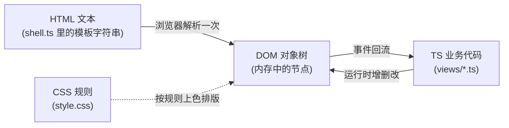
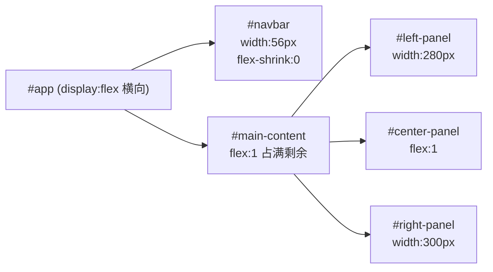
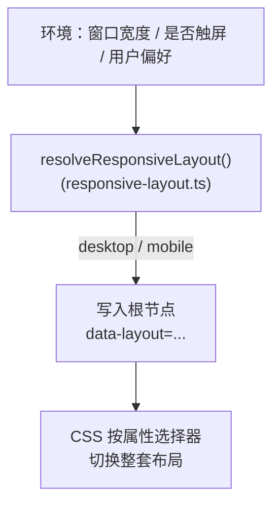
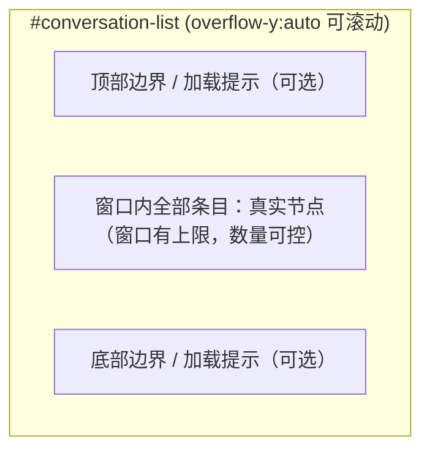
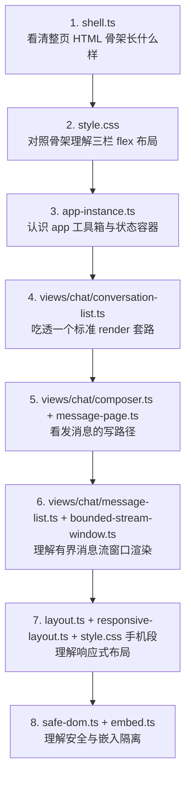
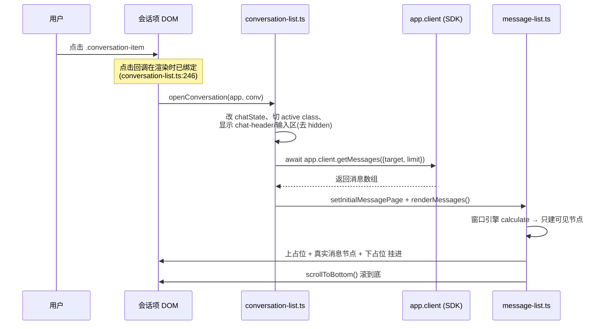

# UIKit 阅读指南

> 主要对照：`frontend/src/uikit/app/shell.ts`、`frontend/src/uikit/app/style.css`、`frontend/src/uikit/app/app-instance.ts`、`frontend/src/uikit/app/views/`、`frontend/src/uikit/app/bounded-stream-window.ts`、`frontend/src/uikit/app/safe-dom.ts`、`frontend/src/uikit/embed.ts`。
> 最后复核：2026-07-11。
> 触发更新：UIKit 视图结构、样式系统、DOM 构建模式、布局机制或新手上手路线发生变化时同步更新。
> 入口关系：上级索引见 [`README.md`](../README.md)；本文是面向「懂 TypeScript、不懂 HTML/CSS」读者的入门导读，讲清前端语法基础与本项目的实现套路，不替代 [`UI设计方案.md`](UI设计方案.md)（视图细节权威）与 [`UIKit方案.md`](UIKit方案.md)（嵌入契约权威）。

## 目录

- [1. 这份指南怎么用](#1-这份指南怎么用)
- [2. 后端视角的浏览器心智模型](#2-后端视角的浏览器心智模型)
- [3. HTML 基础：页面的「数据结构」](#3-html-基础页面的数据结构)
- [4. CSS 基础：渲染规则](#4-css-基础渲染规则)
- [5. DOM 操作：运行时改页面](#5-dom-操作运行时改页面)
- [6. 本项目的实现套路](#6-本项目的实现套路)
- [7. 布局机制：一套结构，桌面与手机两种样子](#7-布局机制一套结构桌面与手机两种样子)
- [8. 有界列表窗口：为什么不能一次画完所有数据](#8-有界列表窗口为什么不能一次画完所有数据)
- [9. 安全：为什么不能随手拼 HTML](#9-安全为什么不能随手拼-html)
- [10. 推荐阅读路线](#10-推荐阅读路线)
- [11. 一次完整的数据流追踪](#11-一次完整的数据流追踪)
- [12. 语法速查与小词典](#12-语法速查与小词典)

## 1. 这份指南怎么用

这份文档假设你**能读懂 TypeScript**（类型、`class`、`async/await`、闭包都没问题），但**没写过 HTML/CSS**，看到 `<div class="...">` 和 `flex:1` 会发懵。

目标有两个：

1. 把 HTML/CSS/DOM 这三样东西，翻译成后端工程师熟悉的概念，让你能独立读懂 `frontend/src/uikit/` 下的代码。
2. 把本项目反复使用的几个「套路」讲清楚，这样你读任意一个视图文件都能快速对号入座。

阅读方式：先顺序读第 2~5 章建立基础，再读第 6~9 章理解本项目套路，最后按第 10 章的路线去读真实代码。每一节都尽量挂到 `frontend/src/uikit/` 里的**真实文件和行号**，建议左边开文档、右边开代码对照看。

## 2. 后端视角的浏览器心智模型

先把四样东西和后端世界对应起来，后面就不容易混：

| 浏览器里的东西 | 是什么 | 后端类比 |
|---|---|---|
| HTML | 一段描述「页面里有哪些元素、怎么嵌套」的文本 | 一份**结构化数据**（像 JSON / protobuf 的 schema 实例），只描述结构，不含逻辑 |
| DOM | HTML 被浏览器解析后，在内存里形成的**对象树** | 把 JSON 反序列化成内存对象树后，那棵可被代码增删改查的树 |
| CSS | 一组「什么样的元素长什么样」的规则 | 一份**声明式配置 / 渲染策略**，类似模板引擎的样式规则，与数据分离 |
| JS/TS | 运行时逻辑：响应事件、改 DOM、发请求 | 你的**业务代码**，本项目就是 `frontend/src/uikit/app/` 下的 `.ts` |

关键认知：**HTML 只是初始结构，真正在跑的是 DOM 这棵内存树。** 本项目几乎所有界面变化，都是 TS 代码在运行时直接操作 DOM 树（建节点、改文字、加/删 class），而不是重新生成 HTML 文本。



本项目的入口对应关系：

- HTML 初始结构 → `frontend/src/uikit/app/shell.ts` 里的 `APP_SHELL_HTML` 常量（一大段模板字符串）。
- CSS 规则 → `frontend/src/uikit/app/style.css`。
- 运行时逻辑 → `frontend/src/uikit/app/app-instance.ts` 和 `frontend/src/uikit/app/views/` 下的视图文件。

## 3. HTML 基础：页面的「数据结构」

### 3.1 标签、属性、嵌套

HTML 的基本单元是**元素（element）**，写法是一对尖括号标签包住内容：

```html
<div class="auth-card">登录卡片</div>
```

拆解：

- `div` 是**标签名**，决定这是什么元素。`<div>` 是最通用的「块状容器」，没有语义，纯粹用来分组和布局。
- `class="auth-card"` 是**属性（attribute）**，属性是 `名="值"` 的键值对。`class` 最特殊也最常用——它是给这个元素贴的「标签名集合」，CSS 和 JS 都靠它来定位元素。
- `<div>...</div>` 之间是**内容**，可以是文字，也可以再嵌套别的元素。

元素层层嵌套就形成一棵树。看 `shell.ts:11-31`（登录区）的真实结构，去掉细节后是这样：

```html
<section id="view-auth" class="view">      <!-- 整个登录视图 -->
  <div class="auth-card">                   <!-- 中间的卡片 -->
    <h1>yimsg</h1>                        <!-- 标题 -->
    <div class="tabs">                       <!-- 登录/注册切换条 -->
      <button class="tab active" data-tab="login">登录</button>
      <button class="tab" data-tab="register">注册</button>
    </div>
    <form id="login-form" class="auth-form"> <!-- 登录表单 -->
      <input class="input" type="text" id="login-username" placeholder="用户名">
      <input class="input" type="password" id="login-password" placeholder="密码">
      <button type="submit" class="btn btn-primary btn-block">登录</button>
    </form>
  </div>
</section>
```

这棵树和后端的嵌套结构体没有本质区别，只是语法换成了尖括号。

### 3.2 你在本项目里会反复见到的标签

| 标签 | 含义 | 后端类比 |
|---|---|---|
| `<div>` | 无语义块容器，用于分组/布局 | 匿名 struct，纯粹装东西 |
| `<span>` | 无语义**行内**容器，包一小段文字 | 同上，但不换行 |
| `<section>` / `<nav>` / `<header>` | 有语义的块容器（区块/导航/页头），功能和 `<div>` 一样，只是名字自带含义 | 给 struct 起了个有意义的名字 |
| `<button>` | 按钮，可点击 | — |
| `<input>` | 单行输入框；`type` 决定种类（`text`/`password`/`file`/`checkbox`） | — |
| `<textarea>` | 多行输入框 | — |
| `<form>` | 表单容器，可整体提交（触发 `submit` 事件） | — |
| `` | 图片，`src` 指向地址 | — |
| `<svg>` | 矢量图标，本项目导航栏图标都是内联 `<svg>`（见 `shell.ts:36-54`） | — |
| `<h1>`~`<h4>` | 标题，数字越小越大 | — |
| `<p>` | 段落文字 | — |

### 3.3 三个最关键的属性

- **`class`**：元素的「分类标签」，可以有多个，空格分隔。例如 `class="btn btn-primary btn-block"` 表示这个按钮同时属于 `btn`、`btn-primary`、`btn-block` 三类，CSS 会把三类的样式叠加上去。这是 CSS 复用的核心机制。
- **`id`**：元素的**全局唯一标识**，整页只能出现一次。本项目用 `id` 给「需要 JS 精确抓取的关键节点」命名，例如 `id="msg-input"`（消息输入框）、`id="conversation-list"`（会话列表容器）。JS 侧用 `app.$('msg-input')` 就能拿到它（见 §6.2）。
- **`data-*`**：自定义数据属性，名字以 `data-` 开头，专门用来在 HTML 元素上挂业务数据。例如 `data-view="chat"`、`data-key="..."`。JS 侧通过 `element.dataset.view` 读取（注意 `data-view` 在 JS 里变成 `dataset.view`，连字符转驼峰）。本项目用它把「这个 DOM 节点对应哪个业务对象」记在节点上，例如 `conversation-list.ts:224` 给每个会话项写 `div.dataset.key = key`，点击时就知道点的是哪个会话。

## 4. CSS 基础：渲染规则

CSS（层叠样式表）回答一个问题：**「长什么样的元素，应该被画成什么样」**。它是声明式的，你只写规则，浏览器负责套用。

### 4.1 一条 CSS 规则的结构

```css
.btn-primary { background: #5b5bf0; color: #ffffff; }
```

- `.btn-primary` 是**选择器（selector）**：决定这条规则作用于哪些元素。这里的 `.` 前缀表示「按 class 匹配」，即所有 `class` 含 `btn-primary` 的元素。
- `{ ... }` 里是**声明块**，由若干 `属性: 值;` 组成。`background`（背景色）和 `color`（文字色）就是属性。

可以把一条规则理解为：`选择器`（一个查询条件）+ `声明块`（一组要设置的字段值）。

> 注意：本项目的 `style.css` 是**压缩过的**（一行写很多规则、没有多余空格），读起来挤，但语法完全一样。读的时候在 `{` 和 `}` 处断句即可。

### 4.2 选择器：怎么挑中元素

这是读 CSS 最需要练的部分。本项目用到的选择器类型：

| 选择器写法 | 含义 | 例子（出自 style.css） |
|---|---|---|
| `.类名` | 匹配 class 含该名字的元素 | `.btn`、`.conversation-item` |
| `#id名` | 匹配该 id 的唯一元素 | `#navbar`、`#message-list` |
| `标签名` | 匹配所有该标签 | `button`、`img`、`a` |
| `A B`（空格） | **后代**选择器：A 内部任意层级的 B | `.auth-card h1`（卡片里的 h1） |
| `A.b`（紧挨） | 同时满足 A 和 class b | `.message-row.self`（既是消息行又带 self） |
| `A > B` | **直接子元素** B（只一层） | `.mc-app-shell > :not(.mc-size-guard)` |
| `A + B` | 紧跟在 A 后面的兄弟 B | `.message-row + .message-row`（相邻两条消息） |
| `A:hover` | **伪类**：鼠标悬停时的 A | `.btn-primary:hover` |
| `A:not(x)` | 不满足 x 的 A | `.message-row:not(.self)` |
| `A::placeholder` | **伪元素**：输入框的占位提示文字 | `.input::placeholder` |
| `[attr=val]` | 按属性匹配 | `.nav-item[data-view="chat"]`（见 `conversation-list.ts:154`） |

把这些组合起来读。例如 `style.css:109`：

```css
.message-row:not(.self) .message-bubble { background: var(--bubble-other); ... }
```

读作：「在**不是自己发的**消息行里面的气泡，背景用 `--bubble-other`」。这正是「别人发的消息气泡是白色，自己发的是蓝色」的实现。

### 4.3 「层叠」：多条规则命中同一元素时谁说了算

CSS 名字里的「层叠（Cascading）」指：一个元素可能被多条规则命中，浏览器按**优先级**合并它们。规则简化版优先级从高到低：

1. 带 `!important` 的声明（本项目在布局切换里用，例如 `style.css:266` 的手机布局强制覆盖）。
2. 选择器越「具体」越优先：`#id` > `.class` > `标签名`。
3. 同等具体时，**后写的覆盖先写的**。

这解释了本项目按钮为什么能层层叠加：`class="btn btn-primary btn-block"` 命中三条规则，`.btn` 给基础形状，`.btn-primary` 给主色，`.btn-block` 给 `width:100%`，互不冲突地合并成最终样式（见 `style.css:14-23`）。

### 4.4 CSS 变量：设计 token

`style.css:1` 第一行（`:root{--primary:#5b5bf0; ...}`）定义了一堆 `--xxx` 变量，这叫 **CSS 自定义属性**，是本项目的「设计 token」。

- 定义：`--primary: #5b5bf0;`（在 `:root` 里定义，`:root` 表示整篇文档的根，相当于全局作用域）。
- 使用：`color: var(--primary);`，`var(...)` 就是取值。

好处和后端常量一样：颜色、间距、字号集中定义一次，到处引用，改一处全局生效。本项目的 token 分几类，认得前缀就能猜含义：

| 前缀 | 含义 | 例子 |
|---|---|---|
| `--primary` / `--bg-*` / `--text-*` / `--border*` | 颜色 | `--bg-panel`（面板底色）、`--text-secondary`（次要文字） |
| `--space-*` | 间距（xs=4px 到 2xl=32px） | `--space-lg`（16px） |
| `--font-size-*` / `--line-height-*` | 字号 / 行高 | `--font-size-body`（14px） |
| `--shadow-*` | 阴影 | `--shadow-md` |

### 4.5 盒模型：每个元素都是一个盒子

浏览器把每个元素都当成一个矩形盒子，从内到外四层：

```
+--------------- margin（外边距，盒子和别人的距离）----------------+
|  +------------ border（边框）------------------------------+   |
|  |  +--------- padding（内边距，边框到内容的留白）------+   |   |
|  |  |                                                  |   |   |
|  |  |             content（内容区）                     |   |   |
|  |  |                                                  |   |   |
|  |  +--------------------------------------------------+   |   |
|  +--------------------------------------------------------+   |
+----------------------------------------------------------------+
```

对应属性：`margin`、`border`、`padding`、`width`/`height`。

本项目在 `style.css:2` 设了一行非常重要的全局规则：

```css
*,*:before,*:after { box-sizing: border-box; margin:0; padding:0; }
```

- `*` 是通配选择器（匹配所有元素）。
- `margin:0;padding:0` 把浏览器默认留白清零，从干净状态开始。
- `box-sizing:border-box` 改变 `width` 的含义：默认情况下 `width` 只算内容区，加了 padding/border 会把盒子撑大（很反直觉）；设为 `border-box` 后，`width` 包含 padding 和 border，**你写 `width:280px` 盒子就是 280px**。这是现代 CSS 的标配，省去大量算账。

### 4.6 Flexbox：本项目排版的主力

绝大多数「一排东西怎么摆」的问题，本项目都用 **Flexbox（弹性盒）** 解决。它的心智模型是：

> 给一个**容器**设 `display:flex`，它的**直接子元素**就会沿一条主轴排成一排，你再用几个属性控制对齐和伸缩。

容器上的关键属性：

| 属性 | 作用 | 常见值 |
|---|---|---|
| `display:flex` | 开启 flex 容器 | — |
| `flex-direction` | 主轴方向 | `row`（水平，默认）/ `column`（垂直） |
| `justify-content` | 主轴方向怎么分布 | `flex-start` / `center` / `space-between`（两端对齐） |
| `align-items` | 交叉轴方向怎么对齐 | `center`（居中）/ `flex-start` / `stretch` |
| `gap` | 子元素之间的间距 | `var(--space-sm)` |

子元素上的关键属性：

| 属性 | 作用 |
|---|---|
| `flex:1` | 「占满剩余空间」，多个都写 `flex:1` 则平分 |
| `flex-shrink:0` | 「我不许被压缩」，空间不够时保持原尺寸 |

举本项目最典型的例子，会话列表项 `style.css:93`：

```css
.conversation-item{
  height:66px;
  display:flex;            /* 头像、信息、时间排成一排 */
  align-items:center;      /* 垂直居中 */
  gap:var(--space-md);     /* 之间留 12px */
}
```

里面的 `.conversation-info`（`style.css:96`）写了 `flex:1`，意思是「头像和时间各占自己需要的宽度，中间的信息区占满剩下的所有横向空间」。这就是聊天列表「头像靠左、时间靠右、中间名字自适应」的实现。

再看整个应用的主骨架是怎么用 flex 拼出来的（`style.css:58,63,71,72,75`）：



最外层 `#app` 是横向 flex 容器：左侧导航栏固定 56px 不缩，主内容区 `flex:1` 吃掉剩余宽度；主内容区内部又是一层 flex，会话列表固定 280px、聊天区 `flex:1`、详情面板固定 300px。**整个三栏布局就是两层嵌套的 flex。**

而 `#center-panel`（`style.css:75`）自己是 `flex-direction:column`（纵向 flex），于是它内部「聊天头 / 消息列表 / 输入区」从上到下排列，其中 `#message-list`（`style.css:78`）写 `flex:1` 吃掉中间所有高度并 `overflow-y:auto`（内容超出就内部滚动）——这就是「头和输入框固定、中间消息区滚动」的实现。

### 4.7 定位 position：脱离常规排版

大部分元素按「文档流」从上到下、从左到右自然排布。当你需要让某个元素**叠在别的元素上**或**固定在屏幕某处**时，用 `position`：

| 值 | 含义 | 本项目用处 |
|---|---|---|
| `static` | 默认，按文档流 | — |
| `relative` | 相对自己原位微调，且**成为子元素 `absolute` 的定位基准** | `.avatar-wrapper`（`style.css:100`）做未读红点的基准 |
| `absolute` | 相对最近的 `relative` 祖先定位，脱离文档流 | `.unread-badge`（`style.css:102`）钉在头像左上角 |
| `fixed` | 相对**屏幕**定位，滚动也不动 | `.modal-overlay`（`style.css:35`）全屏遮罩、`.toast-container`（`style.css:43`）右上角提示 |

配合 `top`/`right`/`bottom`/`left`/`z-index`（层叠高度，越大越靠上层）使用。例如未读红点 `style.css:102`：父元素 `.avatar-wrapper` 设 `position:relative`，红点设 `position:absolute; top:-4px; left:-4px`，就被钉在头像左上角外侧。

### 4.8 媒体查询与过渡动画（先认识即可）

- **`@media`**：根据屏幕条件套用不同规则。例如 `style.css:60` 的 `@media(min-width:1280px)`：屏幕宽于 1280px 时给 `#app` 加圆角和外边距（大屏上居中成一个卡片）。本项目还用 `@media (hover:hover)`、`(pointer:coarse)` 判断是不是触屏设备（`style.css:204,254`）。
- **`transition`**：属性变化时平滑过渡而非瞬变。例如 `.btn`（`style.css:14`）写 `transition:background-color .2s`，悬停变色时有 0.2 秒渐变。
- **`@keyframes` + `animation`**：定义关键帧动画。例如 `modal-in`（`style.css:38`）让弹窗淡入并轻微上移。

这些读到时知道是「响应式」和「动效」即可，不影响理解主逻辑。

## 5. DOM 操作：运行时改页面

前面说过，跑起来后真正在变的是 DOM 树。本项目的视图代码做的事，归根到底就是这几类 DOM 操作。逐个对照后端心智：

### 5.1 抓取节点

```ts
const el = document.getElementById('msg-input');     // 按 id 抓唯一节点
const items = container.querySelectorAll('.tab');     // 按 CSS 选择器抓一组
```

本项目把抓取封装成了 `app.$('msg-input')`（见 `app-instance.ts:253`），等价于 `getElementById`，找不到会抛错。

### 5.2 建节点 / 删节点 / 挂节点

```ts
const div = document.createElement('div');   // 新建一个 <div> 对象（还没进树）
container.appendChild(div);                   // 挂到容器末尾，这一刻才显示
div.remove();                                 // 从树上摘掉
container.innerHTML = '';                     // 清空容器所有子节点
```

`createElement` + `appendChild` 是「以对象方式精确建树」，`innerHTML = '<...>'` 是「直接用字符串替换内部结构」。本项目两种都用（见 §6.3 的取舍）。

### 5.3 改内容

这是最容易踩坑的地方，**两个属性必须分清**：

| 写法 | 行为 | 安全性 |
|---|---|---|
| `el.textContent = name` | 把 name 当**纯文本**塞进去 | 安全。即使 name 含 `<script>` 也只会显示成文字 |
| `el.innerHTML = html` | 把字符串当 **HTML 解析**并建树 | 危险。字符串里的标签会被当真，可能被注入攻击 |

本项目的硬性规则：**凡是来自用户的内容（昵称、消息文本、备注…），只能走 `textContent`，或先用 `escapeHtml()` 转义再拼进 `innerHTML`。** 详见 §9。例如消息正文 `message-list.ts:95` 用 `div.textContent = ...`；而拼接结构时（如 `conversation-list.ts:239`）对名字调用了 `app.escapeHtml(name)`。

### 5.4 改 class 与样式

```ts
el.classList.add('active');       // 加一个 class
el.classList.remove('hidden');    // 删一个 class
el.classList.toggle('collapsed'); // 有则删、无则加
el.style.height = '120px';        // 直接改某条内联样式
```

本项目控制「显示/隐藏」几乎全靠一个工具 class：`.hidden{display:none!important}`（`style.css:13`）。要藏一个元素就 `el.classList.add('hidden')`，要显示就 `remove('hidden')`。视图切换（聊天/通讯录/设置）本质就是给当前视图去掉 `hidden`、给其它视图加上 `hidden`。

### 5.5 读写自定义数据

```ts
div.dataset.key = key;            // 写：对应 HTML 的 data-key 属性
const k = div.dataset.key;        // 读
```

见 `conversation-list.ts:224`，每个会话项把业务 key 记在 `dataset.key` 上。

### 5.6 监听事件

```ts
button.addEventListener('click', () => { /* 点击时执行 */ });
input.addEventListener('input', () => { /* 每次输入变化 */ });
form.addEventListener('submit', (e) => { e.preventDefault(); /* 拦截默认提交 */ });
```

事件就是「用户/浏览器发生了某动作」的回调注册。注意 `submit` 默认会让浏览器刷新页面，本项目在表单提交里都会调 `e.preventDefault()` 拦下来，改成自己用 SDK 发请求（见 `auth.ts`）。本项目大量用到的事件类型：`click`（点击）、`input`（输入框内容变化）、`submit`（表单提交）、`scroll`（滚动，有界消息流窗口靠它）、`keydown`（按键）。

## 6. 本项目的实现套路

理解了通用基础，再看本项目「自己的约定」。这些套路在每个视图里反复出现，认得了就读得飞快。

### 6.1 一份静态骨架 + 运行时填充

整个应用的初始 HTML 不是写在 `.html` 文件里，而是 `shell.ts` 里的一个**模板字符串** `APP_SHELL_HTML`（`shell.ts:1-161`）。它一次性声明了所有视图的**外壳**：登录区、三栏聊天区、通讯录区、设置区、弹窗层、toast 层。注意这里很多容器是**空的**，例如 `<div id="conversation-list"></div>`（`shell.ts:61`）——真正的会话项是运行时由 `conversation-list.ts` 填进去的。

挂载这份骨架有两种方式（这也是「主应用」和「嵌入式 UIKit」的区别）：

- 主应用：`app.ts:16` 直接 `document.body.innerHTML = APP_SHELL_HTML`，占满整个页面。
- 嵌入式：`embed.ts:138-171` 用 **Shadow DOM**（影子 DOM）挂载，把整套 UI 关进一个隔离容器，避免和宿主页面的样式互相污染（详见 §9.3 与 `UIKit方案.md`）。

### 6.2 `app` 这个「上帝对象」

`app-instance.ts` 里的 `AppInstance` 类是贯穿全场的核心对象，几乎每个视图函数第一个参数都是它。把它理解成「这次挂载的运行时上下文 + 工具箱」，常用成员：

| 成员 | 作用 |
|---|---|
| `app.$('id')` | 按 id 抓 DOM 节点（`app-instance.ts:253`） |
| `app.dom` | 一组 DOM 句柄与 `ownerDocument`（建节点用 `app.dom.ownerDocument.createElement`，保证多实例/Shadow DOM 下挂到正确的文档） |
| `app.client` | SDK 客户端，所有数据/网络都走它（`app.client.getMessages(...)` 等） |
| `app.chatState` | 聊天视图的运行时状态（当前会话、消息分页、选择态…） |
| `app.t('key')` | 国际化取词（`app-instance.ts:365`），见 §6.5 |
| `app.escapeHtml(s)` | HTML 转义（`app-instance.ts:259`），见 §9 |
| `app.showToast(text)` | 右上角弹一条提示 |
| `app.avatarInnerHtml(...)` | 生成头像内部 HTML（有图用图，没图用昵称首字母，`app-instance.ts:330`） |

> 为什么处处传 `app` 而不用全局变量？因为 UIKit 支持**一个页面挂多个独立实例**（`layout.ts:7` 的注释点明了这点）。所有状态都挂在 `app` 上、所有 DOM 都从 `app.dom` 取，实例之间才不会串。这跟后端「不要用全局可变状态、把上下文显式传进每个函数」是同一个工程纪律。

### 6.3 渲染函数：`render*` 模式

每个列表/面板都有一个 `renderXxx(app)` 函数，职责是「读当前状态 → 重建这块 DOM」。典型结构（以 `conversation-list.ts` 的 `renderConversationPage` 为模板，`conversation-list.ts:122-253`）：

```ts
function renderConversationPage(app) {
  const container = app.$('conversation-list');   // 1. 抓容器
  // 2. 处理空态
  if (空) { container.innerHTML = `<div class="empty-state">...</div>`; return; }
  container.innerHTML = '';                         // 3. 清空旧内容
  for (const conv of conversations) {               // 4. 逐条建节点
    const div = app.dom.ownerDocument.createElement('div');
    div.className = 'conversation-item' + (选中 ? ' active' : '');
    div.dataset.key = key;                          //    业务 key 记到节点上
    div.innerHTML = `... ${app.escapeHtml(name)} ...`; //  内部结构（注意转义）
    div.addEventListener('click', () => openConversation(app, conv)); // 5. 绑事件
    container.appendChild(div);                      // 6. 挂上去
  }
}
```

注意这里**混用**了两种建 DOM 的方式，是有讲究的：

- **外层节点用 `createElement`**：因为要给它 `addEventListener` 绑点击、要写 `dataset`、要按条件加 class，用对象方式更清晰也更安全。
- **节点内部的纯展示结构用 `innerHTML` 模板字符串**：内部是一坨静态结构（头像框、名字、时间、预览），用字符串一把写完更省事；但凡是变量都套 `app.escapeHtml(...)` 防注入。

这个「外层 createElement 绑逻辑、内层 innerHTML 铺结构」的组合，是本项目视图代码的**标准手法**，在 `contacts.ts`、`message-list.ts`、`detail-panel.ts` 里反复出现。

### 6.4 视图切换靠 `hidden` class

应用有「聊天 / 通讯录 / 设置」几个顶层视图，它们在 `shell.ts` 里**全部同时存在于 DOM**，只是用 `hidden` class 控制谁可见（`shell.ts:99,123` 初始就给通讯录、设置加了 `hidden`）。切换视图 = 改 class，不重建 DOM，也不读写 `location`/`history`（当前视图只是内存里的一个状态，见 `app/views/chat/navigation.ts` 的 `switchView`），导航点击在 `navbar` 上（`shell.ts:34-55`，每个 `.nav-item` 带 `data-view` 标明目标视图）。

### 6.5 国际化 i18n：界面不写死中文

界面上所有文案都不直接写在逻辑里，而是通过 `app.t('chat.typeMessage')` 这样的 key 取词，词典在 `app/i18n.ts`。例如 `composer.ts:46` 的输入框占位：`input.placeholder = app.t('chat.typeMessage')`。这样切换中英文（设置页的语言按钮）只需换词典，不动视图代码。读视图时看到 `app.t(...)` 就知道「这是一段会随语言变化的文案」。

> `shell.ts` 模板里有些文案先写了中文（如「登录」「发送」），那是初始占位，`app-instance.ts:377` 起的一段会在挂载后用 `app.t(...)` 把它们刷成当前语言。

## 7. 布局机制：一套结构，桌面与手机两种样子

本项目**不为手机单独写一套 HTML**，而是同一份 `shell.ts` 骨架，靠 CSS 切换成两种布局。这是「响应式」的核心思想，值得专门理解。

切换开关是挂在根节点上的一个属性：`data-layout="desktop"` 或 `data-layout="mobile"`。`layout.ts:11` 的 `applyResolvedLayoutForApp` 就在做这件事——把解析出来的布局值写到 `dataset.layout`。



CSS 侧用**属性选择器**针对两种值写不同规则。`style.css:261` 起的一大段全是 `body[data-layout=\"mobile\"] ...`，逐条把桌面三栏改造成手机单列：

| 桌面（默认规则） | 手机（`[data-layout="mobile"]` 覆盖） |
|---|---|
| `#app` 横向 flex，三栏并排 | `flex-direction:column`，纵向堆叠（`style.css:262`） |
| `#navbar` 竖在左侧 64px | 变成底部横向 tab 栏（`order:2` 排到最后，`style.css:266`） |
| 三栏同时可见 | 右侧详情面板默认 `display:none` 隐藏；点开群 / 好友详情后用 `#view-chat` 上的 `.mobile-showing-detail` 切换：全屏显示详情面板、隐藏列表与聊天区，面板内置"返回"按钮收起 |
| 列表与聊天并排 | 选中会话后用 `.mobile-showing-chat` 切换：显示聊天、隐藏列表（`style.css:278-279`） |
| 独立部署桌面布局有 `#app{min-width:960px}` 兜底，窗口过窄时整体横向滚动而非挤压 | 手机布局与嵌入式 UIKit（`.mc-app-shell[data-embedded]`）都不受此最小宽度限制 |

判定逻辑在 `responsive-layout.ts:19` 的 `detectResponsiveLayout`：宽度 ≤ 640px（`MOBILE_LAYOUT_MAX_WIDTH`）或检测到 `pointer:coarse`（触屏）就判为手机；`layout.ts:30` 的 `watchLayoutChangesForApp` 监听窗口 `resize` 事件实时重判。

读这段 CSS 的诀窍：**先读没有 `[data-layout]` 前缀的规则（桌面基准），再把带 `[data-layout="mobile"]` 前缀的当成「打补丁」叠上去看。** 你会发现手机布局基本是「把某些栏的尺寸/方向/显隐改掉」，结构本身没动。

## 8. 有界列表窗口：为什么不能一次画完所有数据

会话、联系人、消息都可能成千上万条。如果每条都建一个 DOM 节点，浏览器会卡死。本项目所有列表共用同一种模式：**有界滑动窗口 + 全量渲染 + 双向翻页**，分两层。

- **数据层** `app/bounded-page-window.ts` 的 `BoundedPageWindow`：内存里只保留「用户附近的若干页」，每页带服务端返回的不透明边界游标。向后 / 向前翻页用尾 / 首页游标拉下一页，窗口超过 `maxPages` 页就**整页裁掉相反端**，并把那一端的 `hasMore` 置 true——用户滚回去时再用相邻保留页的游标拉回来。
- **渲染层** `app/bounded-stream-window.ts` 的 `BoundedStreamWindow`：因为数据窗口本身有上限，干脆把窗口里的条目**全部**渲染成真实 DOM，滚动时一个节点都不重建。没有窗口切片、没有 spacer、没有行高配置。



滚动事件由引擎自己监听并按帧合并：滚到距顶 / 距底阈值内且该方向 `hasMore`，就向服务端再翻一页；未加载部分由 `hasMore` 标志和「加载中 / 没有更多」提示行表达，不为未加载数据模拟滚动高度。

读消息列表 `message-list.ts` 时，关注三步：①把窗口里全部消息交给 `BoundedStreamWindow.render(...)`；②对每条消息按类型（文本/图片/文件/系统/引用…）建不同结构；③翻页头 / 尾插入或裁剪后，引擎据调用方传入的 `keyOf`（消息用 `messageId`）保持视口顶部第一条可见条目位置不变，画面不跳。

> 内存纪律：每个列表的数据窗口都有页数上限（消息 5×30=150 条、其它列表 5×40=200 条），DOM 节点数随之有界。这呼应 CLAUDE.md「长期内存状态必须有上限和淘汰策略」的要求。

## 9. 安全：为什么不能随手拼 HTML

这一节是本项目的**红线**，单独拎出来。

### 9.1 XSS 的来由

如果你把用户输入直接塞进 `innerHTML`：

```ts
// 危险！假设 name 来自别人设置的昵称
el.innerHTML = `<span>${name}</span>`;
```

只要别人把昵称改成 ``，这段就会被当 HTML 执行，盗取信息。这叫 **XSS（跨站脚本）**。

### 9.2 本项目的三道防线

工具都在 `app/safe-dom.ts`：

1. **`escapeHtml(str)`（`safe-dom.ts:10`）**：把 `< > & " '` 转成 `&lt;` 等实体，让它们只能显示成文字、无法成为标签。**凡是要拼进 `innerHTML` 的用户数据，必须先过它。** 视图里到处可见 `app.escapeHtml(name)`。能用 `textContent` 的就更优先用 `textContent`（天生安全）。
2. **`SafeHtml` 品牌类型（`safe-dom.ts:3-26`）**：用 TypeScript 的 `unique symbol` 给「已确认安全的 HTML 字符串」打一个类型标记。只有显式调用 `safeHtml(...)` 包装过的字符串才能进 `setSafeHtml(el, html)`（`safe-dom.ts:48`）。这样**类型系统会逼你**在编译期就想清楚「这段 HTML 真的安全吗」，而不是运行时才暴雷。
3. **可信 URL 校验（`safe-dom.ts:32`）**：`normalizeTrustedResourceUrl` 只放行 `http:`/`https:` 和站内相对路径，挡掉 `javascript:` 这类伪协议。设置图片地址、链接地址时走 `setTrustedImageSrc`/`setTrustedAnchorHref`（`safe-dom.ts:52,59`），后者还自动加 `rel="noopener noreferrer"` 防标签劫持。

读视图代码时，看到 `escapeHtml` / `setSafeHtml` / `setTrusted*` 就知道「这里在处理外部不可信数据」，是正常且必须的，不要图省事绕过它们。

### 9.3 Shadow DOM：样式隔离

嵌入模式（`embed.ts:138`）把整套 UI 装进 Shadow DOM。Shadow DOM 是浏览器提供的「封装边界」：里面的 CSS 不会漏到宿主页面，宿主的 CSS 也进不来。代价是 `style.css` 里写给 `body`/`:root` 的全局规则在影子里不生效，所以 `shell.ts:163` 的 `rewriteAppStylesForShadow` 会把这些选择器**改写**成影子内的等价选择器（`body` → `.mc-app-shell` 等）。这段不影响你读视图逻辑，知道「嵌入时样式是隔离的、选择器被重写过」即可。

## 10. 推荐阅读路线

建议按下面的顺序读，从「骨架与样式」到「单个视图」再到「跨视图机制」，难度递增：



各阶段对应文件与本指南章节：

| 阶段 | 主文件 | 配合本指南 |
|---|---|---|
| 1 骨架 | `app/shell.ts` | §3、§6.1 |
| 2 样式 | `app/style.css` | §4、§6.4 |
| 3 上下文 | `app/app-instance.ts` | §6.2、§6.5 |
| 4 列表渲染 | `app/views/chat/conversation-list.ts` | §5、§6.3 |
| 5 写路径 | `app/views/chat/composer.ts`、`message-page.ts` | §5.6、§11 |
| 6 有界消息流窗口 | `app/views/chat/message-list.ts`、`app/bounded-stream-window.ts` | §8 |
| 7 响应式 | `app/layout.ts`、`responsive-layout.ts` | §7 |
| 8 安全/嵌入 | `app/safe-dom.ts`、`embed.ts` | §9 |

更细的视图职责与状态字段，读完本指南后去看 [`UI设计方案.md`](UI设计方案.md)；嵌入接口看 [`UIKit方案.md`](UIKit方案.md)；SDK 数据怎么来看 [`sdk设计方案.md`](../sdk/sdk设计方案.md)。

## 11. 一次完整的数据流追踪

把前面所有套路串起来，跟一遍「用户点一个会话 → 看到消息」的全过程，落到真实代码：



逐步对照：

1. **绑定**：渲染会话列表时，每个项 `div.addEventListener('click', () => openConversation(app, conv))`（`conversation-list.ts:246`）。
2. **入口**：点击触发 `openConversation`（`conversation-list.ts:290`）。它先更新状态 `app.chatState.currentConvKey/currentConversation`，调 `clearUnread`，并用 class 操作切换界面：给选中项加 `active`、给 `chat-header`/`message-input-area` 去掉 `hidden`、给 `chat-empty` 加 `hidden`、手机布局加 `mobile-showing-chat`（`conversation-list.ts:335-343`）。
3. **取数**：`await app.client.getMessages({ target, limit })`（`conversation-list.ts:347`）——所有网络细节封装在 SDK 里，视图只 `await`。注意它先检查 `requestId` 是否过期（`conversation-list.ts:351`）防止快速切会话时旧响应覆盖新界面，这是前端版的「请求竞态保护」。
4. **写入分页状态**：`setInitialMessagePage(...)`（`message-page.ts`）把消息存进 `chatState`。
5. **渲染**：`app.views.chat?.renderMessages()` → `message-list.ts:60` 的 `renderMessages`，经窗口引擎只渲染可见区间，再 `scrollToBottom()` 滚到最新。

发消息的写路径同理：`composer.ts:50` 的 `sendMessage` 读输入框 `input.value`、校验、`await app.client.sendText(...)`、`appendLiveMessageToPage` 追加到分页、`renderMessages()` + `scrollToBottom()`。**读任何交互都可以套这个模板：事件 → 改状态 → （可能 await SDK）→ render 重建 DOM。**

## 12. 语法速查与小词典

读代码时随手查。

**HTML/属性**

| 看到 | 含义 |
|---|---|
| `<div>` / `<span>` | 块容器 / 行内容器 |
| `class="a b"` | 元素属于 a、b 两类（CSS/JS 定位用） |
| `id="x"` | 全局唯一标识，`app.$('x')` 抓它 |
| `data-foo="v"` | 自定义数据，JS 侧 `el.dataset.foo` |
| `placeholder` | 输入框灰色提示文字 |
| `type="file"` | 文件选择输入框 |

**CSS 选择器**

| 看到 | 含义 |
|---|---|
| `.x` / `#y` / `tag` | 按 class / id / 标签匹配 |
| `A B` / `A>B` | A 的后代 B / 直接子 B |
| `A.b` / `A:not(.b)` | 同时是 A 和 b / 是 A 但不是 b |
| `A:hover` | 鼠标悬停 A |
| `A+B` | 紧邻 A 之后的兄弟 B |
| `[k="v"]` | 属性等于某值 |

**CSS 属性**

| 看到 | 含义 |
|---|---|
| `display:flex` | 开启弹性布局容器 |
| `flex:1` / `flex-shrink:0` | 占满剩余 / 不许被压缩 |
| `flex-direction:column` | 子元素纵向排列 |
| `justify-content` / `align-items` | 主轴分布 / 交叉轴对齐 |
| `gap` | 子元素间距 |
| `position:relative/absolute/fixed` | 定位基准 / 相对祖先 / 相对屏幕 |
| `overflow-y:auto` | 纵向内容超出则内部滚动 |
| `box-sizing:border-box` | width 含 padding 和 border |
| `var(--x)` | 取 CSS 变量（设计 token） |
| `!important` | 强制提高优先级 |
| `z-index` | 层叠高度，越大越靠上 |

**DOM/JS**

| 看到 | 含义 |
|---|---|
| `app.$('id')` | 抓 DOM 节点 |
| `createElement` / `appendChild` / `remove` | 建 / 挂 / 删节点 |
| `textContent =` | 设纯文本（安全） |
| `innerHTML =` | 设 HTML（需转义，危险） |
| `classList.add/remove/toggle` | 增删切换 class |
| `dataset.x` | 读写 data-x |
| `addEventListener('click', fn)` | 监听事件 |
| `e.preventDefault()` | 拦截浏览器默认行为 |

**本项目专有**

| 看到 | 含义 |
|---|---|
| `APP_SHELL_HTML` | 整页 HTML 骨架（shell.ts） |
| `app` / `AppInstance` | 运行时上下文兼工具箱 |
| `app.client` | SDK，所有数据/网络 |
| `app.chatState` | 聊天视图运行时状态 |
| `app.t('k')` | 国际化取词 |
| `app.escapeHtml` / `safeHtml` / `setTrusted*` | 三道安全防线（safe-dom.ts） |
| `render*` 函数 | 读状态重建某块 DOM |
| `.hidden` class | 控制显隐 |
| `data-layout` | desktop/mobile 布局开关 |
| `bounded-stream-spacer` / `BoundedStreamWindow` | 有界消息流窗口占位与统一分页列表引擎 |
