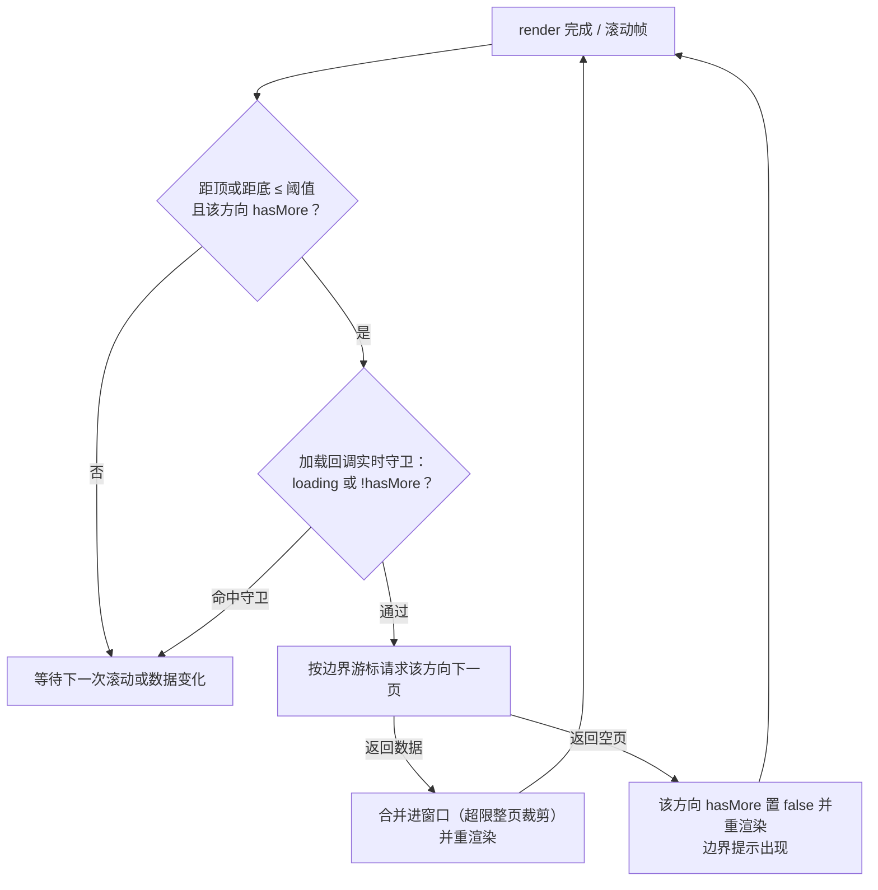

# 有界列表窗口设计方案

> 主要对照：`frontend/src/uikit/app/bounded-stream-window.ts`、`frontend/src/uikit/app/bounded-page-window.ts`、`frontend/src/uikit/app/views/chat/message-list.ts`、`frontend/src/uikit/app/views/chat/message-page.ts`、`frontend/src/uikit/app/views/chat/conversation-list.ts`、`frontend/src/uikit/app/views/contacts.ts`、`frontend/src/uikit/app/views/chat/detail-panel.ts`、`frontend/src/uikit/app/views/chat/forward.ts`、`frontend/src/app-config.ts`。
> 最后复核：2026-06-30。
> 触发更新：列表渲染引擎、有界窗口分页 / 裁剪 / 边界游标算法、消息分页归一化、锚点策略、提示条行为或列表分页配置变化时同步更新。
> 入口关系：上级索引见 [`README.md`](../README.md)；本文是列表渲染实现的单一事实源，`UI设计方案.md` §8 保留概述性表格，细节以本文为准。

## 目录

- [1. 目标与取舍](#1-目标与取舍)
- [2. 原理：有界列表窗口如何工作](#2-原理有界列表窗口如何工作)
  - [2.1 成本在 DOM，不在数据](#21-成本在-dom不在数据)
  - [2.2 两层窗口模型](#22-两层窗口模型)
  - [2.3 数据窗口：按页边界游标记账](#23-数据窗口按页边界游标记账)
  - [2.4 渲染窗口：有界全量渲染](#24-渲染窗口有界全量渲染)
  - [2.5 分页与触界：滚动条只代表已加载部分](#25-分页与触界滚动条只代表已加载部分)
  - [2.6 锚点：内容双端变化时画面不动](#26-锚点内容双端变化时画面不动)
- [3. 数据窗口 BoundedPageWindow](#3-数据窗口-boundedpagewindow)
  - [3.1 跨页去重：可变展示序键下「绝不重复显示」](#31-跨页去重可变展示序键下绝不重复显示)
- [4. 渲染引擎 BoundedStreamWindow](#4-渲染引擎-boundedstreamwindow)
- [5. 消息列表](#5-消息列表)
- [6. 会话列表与"列表有更新"提示](#6-会话列表与列表有更新提示)
- [7. 其它列表场景](#7-其它列表场景)
- [8. 配置参数说明](#8-配置参数说明)
- [9. CSS 约束](#9-css-约束)
- [10. 扩展阅读](#10-扩展阅读)

---

## 1. 目标与取舍

聊天应用的列表天然是长列表（消息数万条、会话和联系人成百上千），不能全量拉取、全量渲染。本项目把消息列表验证过的模型推广到**所有列表**，用**单一模式**收敛复杂度：**有界滑动窗口 + 全量渲染 + 双向翻页**。明确取舍：

1. **滚动条不要求精确**，甚至不需要出现（CSS 已隐藏滚动条）。滚动空间只代表"已加载窗口"，绝不为未加载数据模拟高度。
2. **到顶 / 到底用轻量提示**：未加载数据只由 `hasMoreBefore` / `hasMoreAfter` 表达，滚到边界时显示"加载中"或"已到最早 / 已到最新 / 没有更多"。
3. **背景数据变化不打断浏览**：列表不动，只点亮提示条（消息列表"有 N 条新消息"、会话列表"有新消息"、通讯录"通讯录有更新"）；只有用户已贴边（消息列表贴底、会话/通讯录列表贴顶）时才直接重拉。

这些取舍删掉了上一代实现里只为"滚动条精确"服务的全部复杂度：逐行实测高度（rAF 首测 + ResizeObserver）、测量缓存、估算校正，以及"固定行高窗口切片 + spacer"那一整套渲染路径。剩下的都是确定性计算：渲染引擎只有一种模式，没有 `itemSize` / `spacer` / `overscan` 配置。

整个实现没有引入第三方虚拟列表库，全部用原生 TypeScript 和 DOM API 完成，核心是两个小模块：数据层 `bounded-page-window.ts`（约 130 行）与渲染层 `bounded-stream-window.ts`（约 170 行）。

§2 先讲与具体代码无关的原理，§3 起对照仓库代码讲实现细节。

---

## 2. 原理：有界列表窗口如何工作

### 2.1 成本在 DOM，不在数据

一条数据在内存里只是一个几百字节的对象，数组放几万条毫无压力；但把它**渲染**出来是另一回事：每行至少是"容器 + 头像 + 文本"好几个元素节点，浏览器要为每个节点维护样式、布局和绘制信息。节点数上去之后，首次渲染、每次 reflow 乃至滚动合成都会变慢。

而屏幕高度是固定的：无论数据有多少，用户一次只能看见十几行。

```
全量渲染整个数据集：DOM 节点数 ∝ 数据总量   （必卡）
有界列表窗口：       DOM 节点数 ∝ 窗口上限   （恒定几十~一两百个节点，与数据量无关）
```

出发点就这一句：**渲染成本应该正比于"窗口里有多少"，而不是"一共有多少"。**

### 2.2 两层窗口模型

长列表方案由两层互相独立的"窗口"组成：


- **数据窗口**解决"数据太多"：内存里只保留完整数据集中用户附近的若干页，靠分页拉取扩展、超限时整页裁剪收缩（§2.3）；
- **渲染窗口**解决"DOM 太多"：因为数据窗口本身有上限，渲染窗口干脆等于数据窗口，**全部渲染**（§2.4）。

本项目两层窗口都收敛成同一种取舍，所有列表共用：数据窗口是有界滑动窗口，渲染窗口是它的全量。

### 2.3 数据窗口：按页边界游标记账

服务端展示通道是 **keyset 游标分页**：只能从已知边界顺序翻页，游标对客户端**不透明**（禁止客户端解析或构造，见[《同步机制方案》](../../同步机制方案.md)）。要做"裁掉一端、用户滚回去时再拉回来"的有界滑动窗口，关键是裁剪后还能找到那一端的续翻锚点。

做法是**按页记账**：窗口是若干"已加载页"的有序拼接，每页保存服务端随该页返回的 `start_cursor` 与 `end_cursor`。

```
完整集合（展示序）
----------------------------------------------------------------->

       page0            page1            page2
   [s0 .. e0]       [s1 .. e1]       [s2 .. e2]
       └ 首页 start_cursor=s0          尾页 end_cursor=e2 ┘
  hasMoreBefore?  ← 向前续翻用 s0      向后续翻用 e2 →  hasMoreAfter?
```

- 续翻向后（更靠后 / 更新）：用尾页 `end_cursor`，方向 FORWARD，结果 `appendForward` 到尾部；
- 续翻向前（更靠前 / 更旧）：用首页 `start_cursor`，方向 BACKWARD，结果 `prependBackward` 到头部；
- 窗口最多保留 `maxPages` 页，**整页**从相反端裁剪，并把被裁端的 `hasMore` 置 true。

被裁掉的整页连同它的边界游标一起丢弃，但相邻保留页的边界游标仍是有效的续翻锚点——内存窗口只是完整集合上的一个视图，丢弃不等于丢失。整页裁剪让"裁剪后续翻"无需在客户端重建游标，天然契合不透明游标。

对应实现：§3。

### 2.4 渲染窗口：有界全量渲染

经典虚拟列表只渲染视窗附近的行，再用 spacer 撑高滚动条，这要求"不渲染某行也能知道它有多高"——固定行高才算得准，变高行（消息气泡）就得"估算 + 实测 + 校正"，复杂度几乎全来源于此。

既然数据窗口已经有上限，就不必再切片：**窗口里的全部条目都渲染成真实 DOM**。高度不可知的根源是"想替没渲染的行报高度"，全部渲染后这个问题整个消失：没有 spacer、没有行高配置、没有估算误差、滚动零重建，行高永远是浏览器布局的真实值。一两百个节点对任何现代浏览器都是小负载，重建只发生在数据变化时。

对应实现：§4。

### 2.5 分页与触界：滚动条只代表已加载部分

放弃为完整数据集模拟总高度（§1 取舍 1）：**滚动空间只代表已加载窗口**。滚动条比例会随加载推进而变化，但聊天场景没人盯着滚动条看绝对位置（CSS 干脆隐藏了它），"还有没有更多"用边界提示文字表达足够。

剩下的只是何时翻页：滚动接近边界（距顶 / 距底不足一个阈值）且该方向 `hasMore` 时触发。



这个循环天然覆盖"首屏不足一屏"：render 后立即触界检测，内容不满一屏就继续补页，直到填满视窗或服务端返回空页——循环必然终止。

对应实现：§4。

### 2.6 锚点：内容双端变化时画面不动

向头部插入一页更旧数据后，浏览器保持的是 `scrollTop` 这个**数值**，而不是用户正在看的**内容**：同一 scrollTop 之下内容整体被推下去一页，画面猛跳。

画面"不动"的精确定义是：用户正在看的那条（锚点）相对视口顶的偏移 `delta` 在重渲染前后不变。由此直接得出修正公式：

```
渲染前：delta = 锚点行顶 - 视口顶
渲染后：scrollTop += (锚点行新顶 - 视口顶) - delta
```

这个公式对头部插入、尾部裁剪、双端同时变化一视同仁。前提是渲染后读到的行位置就是最终布局，这正是全量渲染（无估算）才能给出的保证。锚点保持由渲染引擎统一负责：调用方提供每个条目的稳定标识 `keyOf`，引擎在重渲染前后据此对齐。

对应实现：§4。

---

## 3. 数据窗口 BoundedPageWindow

文件：`frontend/src/uikit/app/bounded-page-window.ts`。所有列表共用的数据窗口，泛型 `BoundedPageWindow<T>`：

```
构造：new BoundedPageWindow<T>(maxPages, normalize?, identityOf?)
  maxPages    窗口最多保留多少页，超出整页裁剪
  normalize   每页入窗前对该页条目的归一化（默认恒等；消息列表用它去重 / 过滤删除态 / 按 seq 排序）
  identityOf  条目的稳定身份键，用于跨页去重（默认不去重；会话 / 联系人 / 群成员必须传，§3.1）

状态：pages[]（每页 { items, startCursor, endCursor }）、hasMoreBefore、hasMoreAfter
读取：items（flatten 拼接）、count、loaded、backwardCursor（首页 start）、forwardCursor（尾页 end）
```

| 方法 | 触发时机 | 窗口变化 |
|---|---|---|
| `reset` | 切换 / 重拉前清空 | 清空所有页与 hasMore |
| `setInitial(page)` | 打开 / 重拉首页 | 清空后放入这一页，hasMore 取该页两端 |
| `appendForward(page)` | 触底续翻向后 | 跨页去重后尾部追加；超 `maxPages` 整页裁首并 `hasMoreBefore=true` |
| `prependBackward(page)` | 触顶续翻向前 | 跨页去重后头部插入；超 `maxPages` 整页裁尾并 `hasMoreAfter=true` |
| `appendLive(item)` | 本地发送 / 转发成功回包 | 并入尾页（经 normalize），超限整页裁首 |

`PageLoadResult<T>`（`{ items, startCursor, endCursor, hasMoreBackward, hasMoreForward }`）与 SDK 各 `get_*` 返回的 `page`（PageInfo）同构，调用方把 SDK 结果整理成它喂给窗口，全程不解析游标。

### 3.1 跨页去重：可变展示序键下「绝不重复显示」

keyset 游标只保证**单次查询快照内**翻页边界不重叠，**前提是排序键不可变**：消息的 `seq` 绑定 `messageId` 永不变，各页 keyset 区间在身份上天然不相交，跨页拼接永不重复。但**会话和联系人的展示序键是可变的**——会话收到新消息会按新 `seq` 重排、联系人改名会按新 `sort_key` 重排，同一实体会在不同时刻落到不同页：

```
会话窗口（展示序 seq DESC，活跃→沉默）
  窗口已加载 [1,2,3,4,5,6...]，会话 5 当前落在某保留页 P
  ① 用户向后滚动，头部页被整页裁掉（hasMoreBefore=true）
  ② 会话 5 收到新消息：seq 变大、跳到最活跃端；但窗口里 P 仍是旧快照（stale 5）
  ③ 用户滚回顶部触发 prependBackward，拉回的更活跃页里又出现了 5
  ④ 朴素拼接 = 新页的 5 + 旧页 P 的 5 → 同一会话渲染两次（重复！）
```

> 注：纯「向后下滑」方向不会重复——`seq` 单调增、会话只会往**活跃端**跳，跳到的是已划过的区域；真正的重复出现在**反向回滚 + 整页裁剪 + 并发重排**这一边界组合。

**解法（通用、`identityOf` 驱动）**：传入与展示序键解耦的稳定身份键 `identityOf`（会话 / 联系人 = `friendUid:groupId`，群成员 = `userId`，消息 = `messageId`，见 `list-identity.ts`）。`appendForward` / `prependBackward` 在新页入窗**之前**，先把其它保留页里与新页同身份的旧条目删掉——**新拉的页代表服务端当前真值，用新的覆盖旧的**。这样整个窗口里每个身份至多出现一次，从源头杜绝重复渲染。

**稳定性取舍（不追求完美，但重复显示不可接受）**：

- **排序变动 / 实时重排**：被覆盖的旧条目所在页会变短、甚至变空，不再与服务端「整页」一一对应。这不影响正确性——`hasMore` 由服务端 PageInfo 决定、不看条数；续翻锚点用首 / 尾页的边界游标，**空页仍保留其有效边界游标**。代价是空页仍占一个 `maxPages` 名额、可能让某真实页提前被裁（提前一点触发续翻），可接受。
- **可视窗口最顶 / 最底变动**：去重发生在续翻入窗那一刻，删除的是「视窗之外、用户看不到」的旧页条目；渲染层按 `keyOf` 锚点保持视口位置（§2.6），最顶 / 最底条目的相对位置不跳。极端情况下若被删条目恰好影响锚点，最多是一次轻微位移，**不会出现重复或错乱**。
- **陈旧但不重复**：身份去重只解决「重复」。某会话被删 / 内容变化但其所在旧页未刷新，仍可能短暂显示陈旧数据——这由「贴顶 / 贴底自动 reset 追平」覆盖（§6），与去重正交。多端短期不一致本就是同步模型允许的（见[《同步机制方案》](../../同步机制方案.md)）。
- **去重 vs 不去重**：消息窗口的 `seq` 不可变、跨页天然不重复，`identityOf` 在那里是防御性兜底（正常永不触发）；`appendLive`（仅消息用）不参与跨页去重，保持尾页归一化原行为。

---

## 4. 渲染引擎 BoundedStreamWindow

文件：`frontend/src/uikit/app/bounded-stream-window.ts`。所有列表共用同一个引擎、**只有一种渲染模式**：有界窗口全量渲染。

构造参数（`BoundedStreamWindowOptions`）：

| 字段 | 作用 |
|---|---|
| `scrollElement` | 原生滚动容器；引擎只监听 scroll，不接管 wheel/touchmove |
| `contentElement` | 内容容器，未传时与 scrollElement 相同（通讯录两个 tab 共用滚动容器时分开传） |
| `onScroll` | 每个滚动帧（触界检测前）执行的回调，供"列表有更新"贴顶追平等场景使用 |

每次数据变化时，调用方把当前状态整体交给 `render(state)`：

```
render(state):
  1. scrollOffset = scrollElement.scrollTop                 // 先读后清
     keyOf 提供时：anchor = 视口顶部第一条可见条目 { key, delta }
  2. content.innerHTML = ''
  3. 未加载（loaded=false）→ 只显示 loadingText，返回
     空列表 → 只显示 emptyText（.empty-state），返回
  4. 头部：!hasMoreBefore 且有 topBoundaryText → "已到最早"
           loadingBefore → "加载中"
  5. 渲染 items 全部，每条由调用方 renderItem(item, index) 生成元素数组；
     keyOf 提供时在该条首元素打 data-bsw-key
  6. 尾部：!hasMoreAfter 且有 bottomBoundaryText → "已到最新 / 没有更多"
           loadingAfter → "加载中"
  7. 恢复 scrollTop = scrollOffset；anchor 存在则按 §2.6 公式校正
  8. checkReach()                                           // 触顶 / 触底检测
```

**为什么"先读后清"？** 执行 `innerHTML = ''` 后容器内容高度瞬间归零，浏览器会把 `scrollTop` 夹回 0；scrollTop 与锚点都必须在清空前确定，渲染完再恢复。

**触界检测 `checkReach`**（render 末尾和滚动帧执行）：

```
maxScrollTop = scrollHeight - clientHeight
scrollTop ≤ 160px                且 hasMoreBefore → loadBefore()
maxScrollTop - scrollTop ≤ 160px 且 hasMoreAfter  → loadAfter()
```

引擎只用 `hasMore*` **快照**粗滤；并发与终止守卫由加载回调自身的实时 `loading` / `hasMore` 状态承担。链式补页天然成立（§2.5）。

**滚动接线**：引擎构造时自己给 `scrollElement` 挂 scroll 监听（经 `createFrameScheduler` 帧合并），每帧先调 `onScroll?.()` 再 `checkReach()`，DOM 不随滚动变化。页面级列表用 `getOrCreateBoundedStreamWindow(WeakMap, owner, factory)` 复用实例；弹窗 / 详情面板随容器元素一起被回收。

**指针按下期间推迟重建（避免吃掉点击）**：`render` 是整列表 `innerHTML = ''` 重建，会销毁鼠标按下的那一行节点。若重建发生在 `mousedown` 与 `mouseup` 之间，`mouseup` 落到新节点上，浏览器因「按下与抬起不在同一节点」而**不再派发 `click`**——点击被「吃掉」。初始同步阶段后台刷新（`messages:received` / `session:sync success` → 会话列表 `force` reset）会在「一堆网络请求」期间反复重建列表，表现为「刚打开点会话没反应，过一会儿才行」。

引擎据此在 `scrollElement` 上监听 `pointerdown` / `pointerup` / `pointercancel`（并在 `window` 上兜底监听释放，以防指针在列表外抬起）：指针按下期间 `render(state)` 只更新 `lastState` 并标记积压，不动 DOM；指针抬起后用 `createFrameScheduler` 把积压的重建安排到**下一帧**。`click` 在 `pointerup` 之后、下一帧之前同步派发，因此仍落在存活的原节点上，点击不再失效；随后下一帧再按最新 `lastState` 重建。指针未按下时 `render` 一如既往立即应用，常规渲染路径不受影响。

---

## 5. 消息列表

文件：`message-list.ts`、`message-page.ts`。消息数据窗口是 `BoundedPageWindow<Message>`（存于 `chatState.messageWindow`），`normalize = sortUniqueBySeq`：同 `messageId` 保留最新状态、删除态剔除、按 seq 升序。窗口上限 `messagePageMaxPages` 页（默认 5 页 × 30 条 = 150 条）。

`message-page.ts` 是窗口在消息场景上的薄封装，并把窗口投影同步到 `chatState`（`currentMessages` 供渲染 / 选择栏读取，`messagePageHasOlder` / `messagePageHasNewer` 由窗口两端 hasMore 派生）：

| 函数 | 触发时机 |
|---|---|
| `resetMessagePage` | 切换会话：清空窗口与各状态 |
| `setInitialMessagePage(result)` | 打开会话首次加载；贴底收到重绘信号或点击提示条后重拉最新一页 |
| `prependOlderMessagesToPage(result)` | 上滑触顶加载更旧 |
| `appendNewerMessagesToPage(result)` | 下滑触底加载更新 |
| `appendLiveMessageToPage(message)` | 本地发送 / 转发成功回包，追加到尾页并保持贴底 |
| `markMessagesHasNewer` | 未贴底时收到重绘信号：标记尾部之后有更新 |

续翻游标取自窗口：`messageBackwardCursor`（首页 start）、`messageForwardCursor`（尾页 end），原样透传给 `get_messages`，不在前端构造游标。

**DOM 锚点**：每条消息首元素带 `data-bsw-key`（messageId），翻页头 / 尾插入或裁剪后由引擎统一保持视口位置（§2.6、§4）。

**scrollToBottom 与图片加载贴底**：

```typescript
const BOTTOM_SETTLE_FRAME_COUNT = 4;
export function scrollToBottom(app) {
  let remaining = BOTTOM_SETTLE_FRAME_COUNT;
  const settle = () => { list.scrollTop = list.scrollHeight; if (--remaining > 0) scheduleFrame(settle); };
  settle();
}
```

图片等富内容首帧可能还是占位尺寸，连续若干帧重设才能真正到底。更晚到达的长尾由两层兜底：`setup.ts` 在消息列表挂 `load` 捕获监听（贴底时继续贴底）；列表保留浏览器原生 scroll anchoring（未设 `overflow-anchor:none`），视口上方异步增高由浏览器自动锚定。

**新消息提示条** `#new-message-pill`：可见性与 `messagePageHasNewer` 同步（`renderMessages` 末尾 `syncNewMessagePill`）。`refreshOpenConversation`（收到 `messages:received` 重绘信号，不消费 payload）：

```
窗口尾部之后已有更新（hasNewer=true）→ 只同步提示条
用户未贴底（距底 > 50px）              → markMessagesHasNewer + pendingNewMessageCount++，
                                         提示条显示"有 N 条新消息"，列表不动
用户贴底                               → reloadLatestMessagePage()：重拉最新一页、滚到底部、自动清未读
```

点击提示条执行 `reloadLatestMessagePage()`；触底追平（`loadNewerMessages` 返回空页把 hasNewer 归零）、重拉最新页、切换会话后提示条自动隐藏。上翻加载历史导致尾部被整页裁剪（hasNewer=true）时同样亮起，充当"回到最新"入口。

---

## 6. 会话列表与"列表有更新"提示

文件：`conversation-list.ts`。会话列表是 `chatState.conversationWindow`（`BoundedPageWindow<LocalConversation>`），顶端锚定在"最活跃"那一端：

```
首次进入 / 贴顶刷新 / 实时重排 / 备注变更
  → loadConversations({ mode:"reset" })：无游标拉首页重建窗口 + getUnreadCount
触底（checkReach，hasMoreAfter）
  → loadConversations({ mode:"forward" })：尾页 end_cursor 向后拉一页，超限整页裁首
触顶（checkReach，hasMoreBefore，即此前向后滚动裁掉过更活跃页）
  → loadConversations({ mode:"backward" })：首页 start_cursor 向前拉回被裁页
```

**背景刷新不打断浏览**（`renderConversationList({ force:true })`，由他端来消息 `messages:received` / 同步完成触发；会话列表初始渲染由 `renderReadyState` 调 `renderConversationList()` 完成）：

```
用户贴顶（scrollTop ≤ 4px）→ 直接 reset 重拉首页并自动滚回最顶端（新会话立即可见）
否则                       → conversationListStale = true：列表不重排，点亮
                             #conversation-update-pill（"有新消息"）
  ├ 带受影响会话 key（messages:received 的 conversationKeys）
  │   → refreshConversations(keys)：对仍在数据窗口内的会话定向拉取并就地更新未读/预览，
  │     不在窗口的会话只兜底刷新未读角标（否则"收到消息列表完全不动"）
  └ 不带 key（同步完成等）         → 仅刷新未读角标，重渲当前数据
点击提示条 或 滚回顶部（onScroll → maybeCatchUpStale）→ reset 重拉首页，提示条隐藏
```

**reset 必须显式归零滚动容器**：`loadConversations({ mode:"reset" })` 渲染后会把 `scrollTop` 置 0。reset 语义是回到"最活跃端"重建首页，但 `render` 的锚点恢复会把原视口顶部条目顶在原位，从而把新置顶 / 新增的会话挤出视口——表现为"明明贴顶却要下拉才看得到新会话，下一条消息又因 scrollTop>4 误亮提示条"。渲染后归零覆盖锚点恢复，与消息列表贴底时 `scrollToBottom` 对称。`toTop`（本端发送）和贴顶背景刷新共用这一归零逻辑。

本端发送消息走 `renderConversationList({ toTop:true })`（`conversations:sent`，`keys` 非空）：无论当前滚动位置都 reset 重拉首页并滚回顶部，让自己发出的会话回到顶部，不点亮提示条——这是用户主动行为，移动到顶部即预期。

`conversations:clearunread` / `conversations:delete` 不走 force 重拉，而走 `refreshConversations(keys)`：对仍在数据窗口内的会话调 `getConversations({ targets })` 定向拉取当前状态，`BoundedPageWindow.updateMatching` 就地更新命中条目；拉取后该会话不存在（已删除）则 `BoundedPageWindow.removeMatching` 把它从所在页剔除，剩余条目在 flatten 后自然往上补齐（防抖动）。`messages:deleted` 用 `removeMatching` 删消息窗口对应消息，并对所在会话定向刷新预览。`messages:received` 在不贴顶时也复用这条路径（见上 `renderConversationList({ force, keys })`），让收到消息的会话即时更新未读/预览而不重排。页结构与边界游标不变，续翻锚点不受影响；删除使窗口变短后，`render` 末尾触界检测按窗口**真实长度**判断：视窗未填满且仍有更多时链式补页，超过 `maxPages` 仍按整页裁剪。命中条目都不在数据窗口时不做定向拉取，但仍刷新未读角标并重渲（同步提示条），靠后续贴顶 / 全量刷新追平排序。通讯录列表同理有 `#contacts-update-pill`（"通讯录有更新"）。

会话 `seq` 随新消息重排，双向续翻 + 整页裁剪叠加并发重排时同一会话可能被不同页带回，窗口用 `identityOf = friendUid:groupId`（`list-identity.ts`）跨页去重，新拉的页覆盖旧页同身份条目，保证绝不重复显示（§3.1）。

仅展示用的"空会话占位"（刚从通讯录点开、还没有任何消息的会话）固定插在窗口条目头部参与渲染，不进入持久数据。转发弹窗的会话选择列表（`forward.ts`）用同一数据窗口与引擎，同样按身份跨页去重。

---

## 7. 其它列表场景

所有列表都是"有界滑动窗口 + 全量渲染 + 双向翻页"，差别只在数据源与背景刷新策略。游标一律用服务端返回的不透明边界游标，按整页裁剪。凡展示序键可变的列表（会话 / 联系人 / 群成员）都传 `identityOf` 跨页去重（§3.1）。

| 场景 | 文件 | 数据加载 | 背景刷新策略 |
|---|---|---|---|
| 通讯录好友 / 请求 | `contacts.ts` | `get_contacts` 双向翻页，整页裁剪 | 不贴顶时推迟（`contactsStale`），滚回顶部后追平并自动滚回最顶端（`loadContacts` 贴顶时 reset 后归零 `scrollTop`，同会话列表）；角标即时更新 |
| 群成员 | `detail-panel.ts` | `get_group_members` 双向翻页，标题用 `page.total` 显示成员总数 | 无背景刷新（面板重开重建） |
| 转发候选 | `forward.ts` | `get_conversations` 双向翻页 | 无背景刷新（弹窗生命周期内） |
| 建群候选 | `contacts.ts` | `get_contacts`（只取用户好友）双向翻页 | 无背景刷新（弹窗生命周期内） |

通讯录两个 tab（好友 / 请求）共用滚动容器 `.contacts-content`，两个引擎实例分别以 `#friends-tab` / `#requests-tab` 作为 `contentElement`，翻页加载回调里按 tab 可见性短路；tab 切换时按 tab 记忆并恢复 scrollTop。

---

## 8. 配置参数说明

文件：`frontend/src/app-config.ts`

| 场景 | 参数 | 默认值 | 含义 |
|---|---|---|---|
| 消息列表 | `chat.messagePageSize` | 30 | 每次拉取消息条数 |
| 消息列表 | `chat.messagePageMaxPages` | 5 | 消息窗口最多保留页数（30×5=150 条上限） |
| 其它列表 | `list.pageSize` | 40 | 会话 / 通讯录 / 群成员 / 转发候选 / 建群候选每页拉取条数 |
| 其它列表 | `list.maxPages` | 5 | 列表窗口最多保留页数（40×5=200 条上限） |

引擎内部常量（`bounded-stream-window.ts`）：`REACH_THRESHOLD_PX = 160`（触顶 / 触底加载触发阈值）。

视图层常量：消息列表"贴底"判定 50px（`NEAR_BOTTOM_THRESHOLD_PX`）、列表"贴顶"判定 4px（`LIST_TOP_STICKY_PX`）、`scrollToBottom` 稳定帧数 4。引擎不再有 `itemSize` / `overscan` / spacer 等切片相关配置。

---

## 9. CSS 约束

```css
/* 滚动容器：必须有明确高度和 overflow-y:auto */
#conversation-list { flex: 1; overflow-y: auto; }
#message-list      { flex: 1; overflow-y: auto; padding: 16px; }
.contacts-content  { flex: 1; overflow-y: auto; }
#members-list      { max-height: 320px; overflow-y: auto; }
```

所有列表都是有界窗口全量渲染：引擎在数据变更时用 `keyOf` 锚点保持视口位置，滚动不重建 DOM，因此统一保留浏览器原生 scroll anchoring 兜底头像 / 图片等异步增高，**不再**对任何列表设 `overflow-anchor: none`，也不再有 `.bounded-stream-spacer`。

提示条样式同在 `style.css`：`.new-message-pill` 绝对定位悬浮于 `#center-panel` 内消息列表底部上方；`.list-updated-pill` 复用同一基础样式，悬浮于 `#left-panel` 底部；`hidden` 类控制显隐。`.list-boundary-hint` 是边界 / 加载提示行。

---

## 10. 扩展阅读

| 文档 | 关联内容 |
|---|---|
| [`UI设计方案.md`](UI设计方案.md) §8 | 渲染策略总表和有界列表窗口概述 |
| [`UIKit阅读指南.md`](UIKit阅读指南.md) | 浏览器心智模型、DOM/CSS 基础，适合无前端经验读者 |
| [`有界集合方案.md`](../sdk/有界集合方案.md) | `BoundedQueue` 等基础设施，窗口背后的内存约束思路 |
| [`../../同步机制方案.md`](../../同步机制方案.md) | 消息、会话 keyset 游标设计，与分页拉取逻辑对应 |
