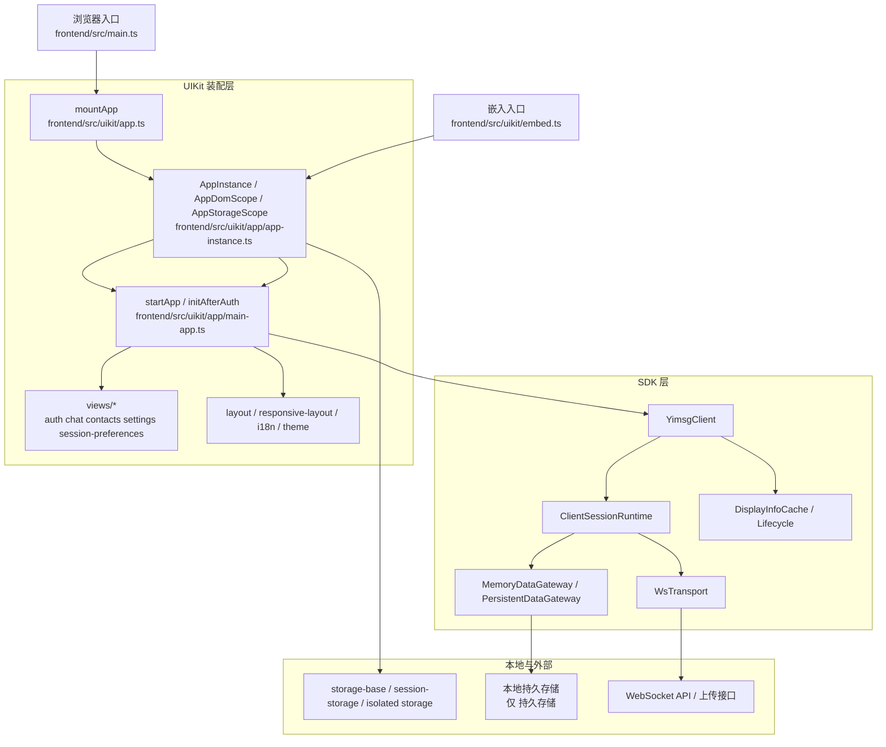

# 前端设计方案

> 主要对照：`frontend/src/main.ts`、`frontend/src/home-dashboard-main.ts`、`frontend/src/uikit/`、`frontend/src/worker/`。
> 最后复核：2026-06-15。
> 触发更新：前端运行形态、启动装配、本地存储、SDK 内存边界或 SDK/UIKit 分层变化时同步更新。
> 入口关系：上级索引见 [`README.md`](README.md)；通用同步机制见 [`../同步机制方案.md`](../同步机制方案.md)，本文是前端运行形态、分层、存储与启动装配的总览入口。
> 本文只描述当前实现的稳定结构、边界和阅读路径，不再维护逐字段、逐流程的伪规格说明。更细的 UI、SDK、UIKit 接口细节分别见 UI设计方案.md、sdk设计方案.md、UIKit方案.md。

## 目录

- [1. 文档定位](#1-文档定位)
- [2. 当前前端的真实形态](#2-当前前端的真实形态)
- [3. 分层结构](#3-分层结构)
  - [3.1 各层职责](#31-各层职责)
- [4. 启动与装配流程](#4-启动与装配流程)
  - [4.1 主应用启动](#41-主应用启动)
  - [4.2 嵌入式 UIKit 启动](#42-嵌入式-uikit-启动)
- [5. AppInstance 是 UI 运行时的中心](#5-appinstance-是-ui-运行时的中心)
- [6. SDK 与 UI 的边界](#6-sdk-与-ui-的边界)
  - [6.1 SDK 负责什么](#61-sdk-负责什么)
  - [6.2 UI 负责什么](#62-ui-负责什么)
  - [6.3 两者如何协作](#63-两者如何协作)
- [7. 运行模式与存储](#7-运行模式与存储)
  - [7.1 模式](#71-模式)
  - [7.2 会话级持久化项](#72-会话级持久化项)
  - [7.3 持久存储本地副本](#73-持久存储本地副本)
- [8. 布局、移动端与嵌入式宿主](#8-布局移动端与嵌入式宿主)
  - [8.1 布局选择](#81-布局选择)
  - [8.2 当前 mobile 行为](#82-当前-mobile-行为)
  - [8.3 嵌入式 UIKit 的宿主限制](#83-嵌入式-uikit-的宿主限制)
- [9. 当前稳定能力与边界](#9-当前稳定能力与边界)
  - [9.1 当前稳定装配的视图](#91-当前稳定装配的视图)
  - [9.2 需要特别注意的边界](#92-需要特别注意的边界)
- [10. 构建、产物与测试](#10-构建产物与测试)
  - [10.1 构建](#101-构建)
  - [10.2 测试](#102-测试)
- [11. 推荐阅读顺序](#11-推荐阅读顺序)
- [12. 结论](#12-结论)

## 1. 文档定位

这份文档现在承担的是“前端总览”的职责，而不是历史需求说明。

它回答四个问题：

1. 当前前端是怎么分层的。
2. 主应用和嵌入式 UIKit 复用了哪些代码。
3. 状态、存储、布局和会话未读分别由谁负责。
4. 阅读和修改代码时应该从哪里切入。

如果你要看具体 DOM 结构、交互规则和视图模块，请读 UI设计方案.md；如果你要看 SDK 能力、DataGateway、缓存、通知流和内存边界，请读 sdk设计方案.md；如果你要接入宿主页面，请读 UIKit方案.md。

## 2. 当前前端的真实形态

当前前端不是“两套 UI”，而是“一套 UIKit UI，三种使用形态”：

| 运行形态 | 入口 | 宿主 | 说明 |
|---|---|---|---|
| 单实例完整应用 | frontend/src/main.ts -> mountApp() | Light DOM | 项目自身默认入口，继续承载完整 Web / Web 应用 |
| 九宫格控制台 | frontend/src/home-dashboard-main.ts -> mountHomeDashboard() | Light DOM 控制台 + 9 个 Shadow DOM UIKit 实例 | 独立页面直接渲染控制台外壳，每格提供 host 并调用 mount() 创建独立 Shadow DOM 聊天实例，同时提供加载 / 卸载 / 删数据 / 调尺寸控制 |
| 嵌入式 UIKit | frontend/src/uikit/embed.ts -> mount() | Shadow DOM | 可嵌入第三方页面的完整聊天 UI |

九宫格这里的 Light DOM 指控制台外壳，不是聊天实例本身。每个 tile 都先由控制台提供普通 DOM host，再复用嵌入式 UIKit 的 Shadow DOM 挂载路径；这样调试控制台保持页面级可见性，多实例聊天 UI 仍然获得样式、主题、语言和尺寸边界隔离。

其中，九宫格控制台会重复调用 `mount()`；单实例完整应用与嵌入式 UIKit 都走同一套 UIKit 装配流程：

- 都会创建 AppInstance。
- 都会调用 startApp(app)。
- 都复用 frontend/src/uikit/app/views/ 下的视图模块。
- 都通过 YimsgClient 访问业务能力。

因此，当前前端设计的核心不是“主应用调用 SDK，UIKit 只是一个 demo 壳”，而是：

> UIKit 已经是前端 UI 的统一装配层；主应用和嵌入式 widget 只是在宿主环境、存储作用域和对外回调上有差异。

## 3. 分层结构



### 3.1 各层职责

| 层 | 主要职责 | 当前代码入口 |
|---|---|---|
| 浏览器入口 | 启动应用，不放业务逻辑 | frontend/src/main.ts |
| UIKit 装配层 | 组装视图、DOM、存储、布局、语言、事件订阅 | frontend/src/uikit/app.ts、frontend/src/uikit/app/main-app.ts |
| UIKit 视图层 | 处理认证、聊天、通讯录、设置等页面交互 | frontend/src/uikit/app/views/ |
| SDK 层 | 连接、认证、会话状态、缓存、DataGateway 编排 | frontend/src/sdk/ |
| DataGateway 层 | 屏蔽 memory / persistent 数据来源差异 | frontend/src/sdk/datagateway/ |
| 本地存储层 | token、mode、layout、lang、本地 持久存储数据 | frontend/src/uikit/app/storage-base.ts、frontend/src/uikit/app/session-storage.ts、frontend/src/sdk/datagateway/persistent.ts |

## 4. 启动与装配流程

### 4.1 主应用启动

主应用入口非常薄：frontend/src/main.ts 只做一件事，就是调用 mountApp()。

mountApp() 的职责也很克制：

1. 等待 DOM 就绪。
2. 创建主应用使用的 AppInstance。
3. 调用 startApp(app)。

真正的初始化逻辑都在 startApp(app) 里：

- 创建 auth、chat、contacts、settings、session-preferences 视图。
- 绑定底部或侧边导航切换。
- 订阅 SDK 事件并驱动 UI 重绘。
- 尝试从存储恢复 token。
- 已登录则继续 startSession；未登录则显示认证页或模式选择。

### 4.2 嵌入式 UIKit 启动

mount(container, options) 会额外处理几件主应用不需要的事情：

- 解析宿主容器并创建 Shadow DOM。
- 注入经 rewriteAppStylesForShadow 处理过的样式。
- 为每个 widget 创建隔离存储作用域，避免多实例共享 token、mode、layout、lang。
- 根据宿主尺寸计算布局，并在尺寸过小时显示保护态。
- 对宿主暴露 onReady、onAuthenticated、onLogout、onMessages、onConversationOpen、onError 等回调。

结论很简单：主应用和嵌入式 UIKit 共享同一套 UI 代码，但嵌入态比主应用多了“样式隔离、实例隔离、宿主适配”三个责任。

## 5. AppInstance 是 UI 运行时的中心

当前 UI 层不再依赖一组全局散落变量，而是把运行时上下文收敛到 AppInstance。

AppInstance 主要承载四类东西：

| 类型 | 说明 |
|---|---|
| client | 当前视图绑定的 YimsgClient |
| dom | 当前宿主的查询作用域、floating root、layout host、viewport host |
| storage | 当前实例的 token / mode / persistent_uid / layout / lang 读写能力 |
| runtime | embedded 标记、instanceId、初始 token、宿主 hooks |

此外，AppInstance 还持有一组明确属于 UI 的运行时状态，例如：

- chatState：当前会话、当前消息数据页、消息多选、详情面板开关、前进转发状态。
- contactsViewState：好友通讯录窗口范围、过滤后的 total、请求列表、当前 tab 加载状态。
- sessionPreferences：屏蔽列表和会话免打扰详情页按需查询入口，不保留本地偏好缓存。

这条边界很重要：

- SDK 负责“业务真相”和事件发出。
- UI 负责“当前页面怎么显示”和局部交互状态。

## 6. SDK 与 UI 的边界

UI 只通过 YimsgClient 的公开 API 和事件工作，不直接碰 transport、DataGateway 或内部 store。

### 6.1 SDK 负责什么

YimsgClient 当前负责：

- WebSocket 连接和重连。
- 登录、登出、token 认证。
- startSession 以及 memory / persistent DataGateway 选择。
- 会话分页读取、待处理请求计数 / 分页、显示信息缓存。
- 消息发送、撤回、转发、上传、群组和联系人相关调用。
- 把底层通知整理成 UI 可消费的事件。

SDK 层的长期硬原则是内存严格可控：任何新增缓存、运行态集合、同步队列、事件载荷或分页读取能力，都必须有明确上限、合并/淘汰策略或生命周期释放路径；不得让 JS 堆内存随历史消息量、联系人总量、会话总量或通知频率无界增长。具体边界和默认值以 [`sdk设计方案.md`](sdk设计方案.md) §10 为准。

其中最关键的几块内存状态在 SDK 内部：

| 状态 | 作用 |
|---|---|
| SessionLifecycleMachine | 维护 authenticated / ready / disconnected 等会话与连接快照 |
| 会话状态 | SDK 不维护 ConversationStore；会话分页和未读数以服务端 / DataGateway 为准，UIKit 维护当前活跃会话等视图态 |
| DataGateway 待处理请求能力 | 通过 `getContactCount(CONTACT_STATUS_PENDING)` 和待处理联系人分页读取驱动红点与 Requests Tab；联系人分页排序以服务端 `sort_key` 结果为准，搜索用 `search_text` |
| DisplayInfoCache | 维护用户和群显示信息缓存 |
| ClientSessionRuntime | 串联 transport、DataGateway 与通知处理 |

### 6.2 UI 负责什么

UI 当前负责：

- 何时显示哪个 view。
- 会话列表、消息列表、设置、联系人等 DOM 渲染。
- 用户手势、按钮点击、滚动加载、弹窗等交互。
- 移动端与桌面端布局切换的页面表现。
- 嵌入态的宿主尺寸保护和 Shadow DOM 适配。

### 6.3 两者如何协作

典型的数据流仍然是单向的：

```text
用户操作
  -> 视图模块调用 app.client.xxx()
  -> SDK 更新内部状态 / 发请求 / 收通知
  -> SDK emit 事件
  -> startApp 注册的处理器触发重绘
  -> 视图读取 client.getXxx() 快照重新渲染
```

## 7. 运行模式与存储

### 7.1 模式

当前前端保留三种运行选择：

| 模式 | 说明 |
|---|---|
| memory | 轻量模式，不依赖本地持久化能力，本地数据不持久化 |
| persistent | 请求持久化本地会话数据；具体浏览器存储实现由 SDK DataGateway 决定 |
| persistent-cleardata | 从干净的本地会话状态启动，再按持久化会话初始化 |

持久化会话新增 `fileSystem` 选择：`opfs`（浏览器）或 `local`（Node.js 本地 SQLite）。未显式指定时，SDK 按环境自动探测后端并选择可用实现。

主应用会在登录前做模式选择；嵌入式 UIKit 可以通过 mount options 直接指定 mode。

### 7.2 会话级持久化项

UI 层统一通过 session-storage.ts 管理以下键：

- token
- mode
- persistent_uid
- layout
- lang

主应用默认走 localStorage；如果浏览器存储不可用，会自动回退到内存存储。嵌入式 UIKit 默认使用隔离的内存存储，避免多个 widget 抢同一份状态。

### 7.3 持久存储本地副本

持久存储 DataGateway 使用 SDK 内部本地持久化能力，本地副本按“用户 + 实例”区分：

```text
yimsg-{uid}__{instanceId}.db
```

这意味着同一页面上即使同账号多开，只要 instanceId 不同，持久存储本地副本也是隔离的。

持久存储本地表与后端同步表高度一致：除本地不保存 `uid` 列外，字段语义保持一致；软删除数据不落本地，只用于推进游标并删除本地有效行。消息、会话、联系人、屏蔽列表和免打扰表如何作为同步副本使用，统一见 [`../同步机制方案.md`](../同步机制方案.md)。

| 表 | 主键 / 关键索引 | 当前用途 |
|---|---|---|
| `messages` | `seq` 主键、`msg_id` 唯一、`idx_messages_group(group_id, seq)` | 保存已同步消息；`status=0xff` tombstone 到达时删除本地行；撤回时回写原消息为占位态；持久存储不主动裁剪本地消息 |
| `conversations` | `(to_uid, group_id)` 主键 | 保存会话物化视图、最后消息和未读数，供会话分页与总未读读取；删除状态不保存 |
| `contacts` | `(type, id)` 主键、`idx_contacts_sort(status, sort_key, type, id)`、`idx_contacts_search(status, search_text)` | 保存联系人 / 群收藏 / 组织 / 待处理请求及排序/搜索投影，`type` 区分 friend/group/org，`id` 存目标 ID，供联系人分页、搜索和待处理红点读取 |
| `blocklist` | `uid` 主键、`idx_blocklist_status(status, updated_at, uid)` | 保存当前生效屏蔽列表副本，供管理页分页与过滤状态读取 |
| `mutelist` | `(to_uid, group_id)` 主键、`idx_mutelist_updated_at(updated_at, to_uid, group_id)` | 保存当前开启免打扰副本，供管理页分页与过滤状态读取 |
| `displayinfo` | `(uid, group_id)` 主键、`idx_displayinfo_updated_at(updated_at)` | 保存用户和群显示信息缓存；`updated_at` 表示本地缓存写入时间；用户缓存使用 `uid>0, group_id=0`，群缓存使用 `uid=0, group_id>0`，按 SDK 缓存 TTL 清理过期项 |
| `meta` | `key` 主键 | 保存 `schema_version` 以及 `msg_seq`、`contact_seq`、`conversation_seq`、`blocklist_seq`、`mutelist_seq` 同步游标 |

研发阶段不维护 持久存储本地库迁移逻辑；`schema_version` 不匹配时 Worker 会重建本地表，随后由 SDK 按后端数据重新同步。

## 8. 布局、移动端与嵌入式宿主

### 8.1 布局选择

当前布局选择只有三个值：

- desktop
- mobile
- auto

auto 模式的实际判定规则由 responsive-layout.ts 统一提供：

- 优先看 pointer: coarse。
- 否则看容器宽度或 viewport 宽度是否小于等于 640 px。

### 8.2 当前 mobile 行为

mobile 不是“把桌面压缩一下”，而是不同的导航和可见性语义：

- 会话列表与聊天面板按单列切换。
- 打开会话后 view-chat 会进入 mobile-showing-chat 状态。
- 点击 chat-header 左侧返回区会退回会话列表。
- 只有真正进入聊天面板时才自动清当前会话未读；停留在会话列表时保留红点。

这条未读规则现在已经和桌面端明确分离：桌面端当前会话可见即可自动 clearUnread，mobile 必须真的处于聊天面板可见态。

### 8.3 嵌入式 UIKit 的宿主限制

嵌入式 UIKit 现在有明确的宿主尺寸保护规则：

- 最小硬阈值：320 x 360 px
- 推荐尺寸：至少 360 x 420 px

低于硬阈值时，widget 不再继续尝试压缩 UI，而是直接显示“容器太小，无法完整显示”的保护提示。这是当前实现的一部分，不是文档约定。

## 9. 当前稳定能力与边界

### 9.1 当前稳定装配的视图

startApp(app) 当前明确注册并使用了这些视图：

- auth
- chat
- contacts
- settings
- session-preferences

聊天视图内部再拆成 conversation-list、message-list、navigation、detail-panel、composer、forward、selection 等子模块。

### 9.2 需要特别注意的边界

当前主应用装配链路只覆盖认证、会话、联系人、群、设置、消息扩展和会话偏好。后续如果增加新的可选业务能力，应先明确它属于核心能力还是插件能力，并同步更新 SDK、UIKit 和服务端接口文档。

## 10. 构建、产物与测试

当前前端工具链非常直接：TypeScript + Vite + Vitest + Playwright。

### 10.1 构建

frontend/package.json 当前以“标准 build 同时产出主应用和 UIKit”为准：

| 命令 | 作用 |
|---|---|
| npm run build:app | 构建主应用产物到 web/ |
| npm run build | 先构建主应用，再构建 UIKit 到 web/uikit/ |
| npm run build:uikit | 仅重建 UIKit bundle |

这点已经是当前代码和测试脚本依赖的事实，不能再把 build 写成“只构建主应用”。

### 10.2 测试

| 命令 | 作用 |
|---|---|
| npm run test:unit | 前端单元测试 |
| npm run test:sdk | SDK 集成测试 |
| npm run test:ui | Playwright UI 回归 |
| ./tools/run_all_tests.sh | 仓库级最终校验 |

仓库当前的约定是：涉及代码行为变更时，最终以 ./tools/run_all_tests.sh 作为收口验证。

## 11. 推荐阅读顺序

如果你现在要继续改前端，建议按这个顺序读：

1. frontend/src/main.ts
2. frontend/src/uikit/app.ts
3. frontend/src/uikit/app/main-app.ts
4. frontend/src/uikit/app/app-instance.ts
5. frontend/src/uikit/app/views/chat.ts 和 chat/*
6. frontend/src/sdk/client.ts
7. frontend/src/sdk/client-session-runtime.ts

如果你要看专项主题，再跳转：

1. UI 设计方案.md：页面结构、视图职责、主要交互。
2. UIKit方案.md：主应用与嵌入态如何共享一套 UIKit，以及宿主页面怎么挂载、有哪些 options 和回调。
3. sdk设计方案.md：SDK、缓存、DataGateway、通知流和内存边界。

## 12. 结论

当前前端最重要的事实只有四条：

1. UIKit 已经是统一 UI 装配层，主应用和嵌入式挂载共享同一套视图与运行时。
2. AppInstance 负责收拢 UI 运行时上下文，YimsgClient 负责业务状态与事件，二者边界已经比旧版本清晰得多。
3. 这份文档应该长期维持为“总览和边界说明”，把细节留给专项文档和代码本身，才能真正跟上实现。
4. SDK 是前端业务内核，后续所有 SDK 相关设计都必须先满足内存严格可控，再扩展功能流程。
