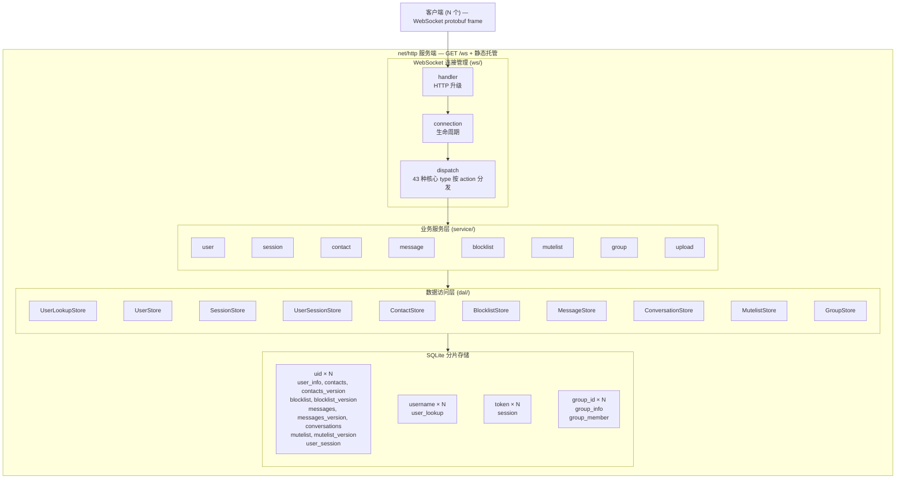
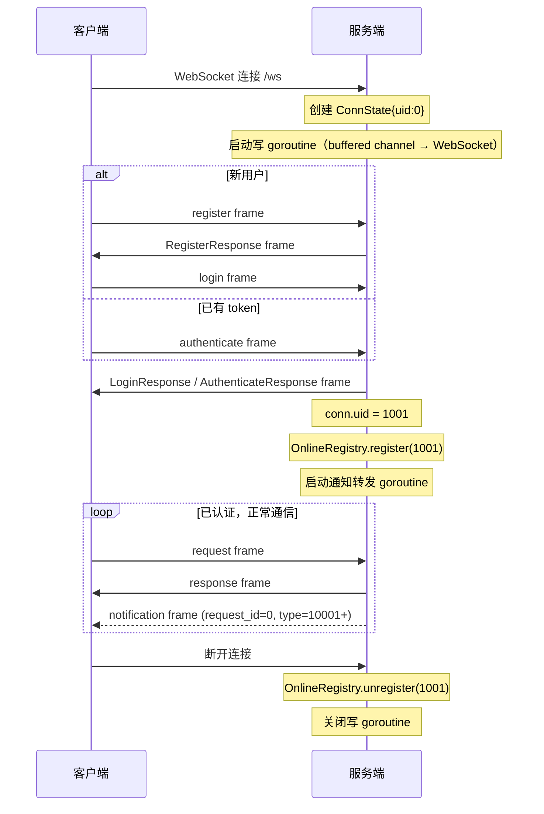
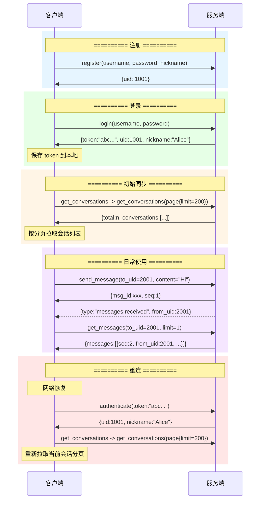
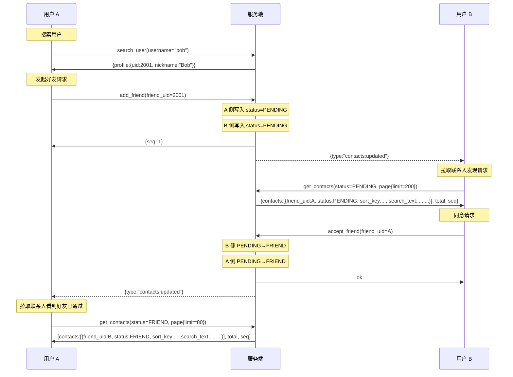
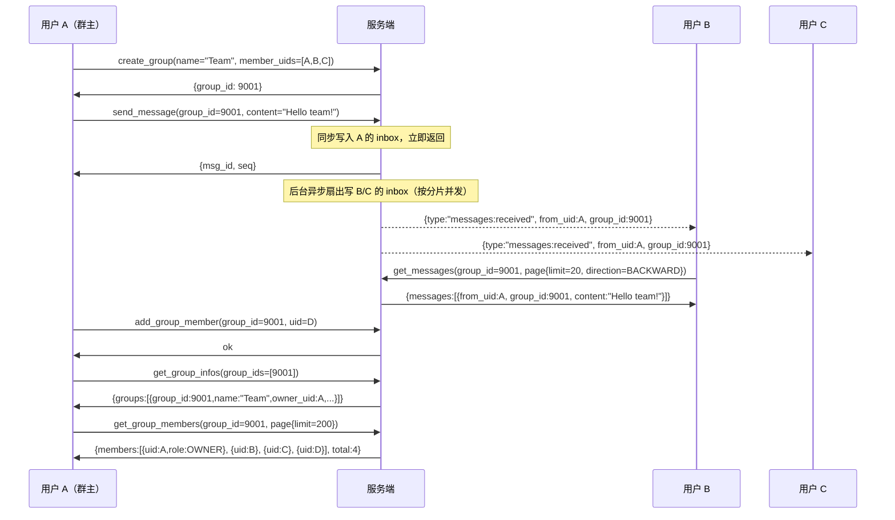

# 服务器设计文档

> 主要对照：`cmd/server/main.go`、`internal/ws/`、`internal/service/`、`internal/online/`、`internal/taskqueue/`。
> 最后复核：2026-07-10。
> 触发更新：服务端启动、dispatch、PostAction、在线态、异步任务队列或 GC 行为变化时同步更新。
> 入口关系：上级索引见 [`README.md`](README.md)；通用同步机制见 [`../同步机制方案.md`](../同步机制方案.md)，本文是服务端启动、模块边界、dispatch、PostAction、在线态、异步任务队列和 GC 的架构入口。

## 目录

- [1. 总体架构](#1-总体架构)
  - [1.1 Go Module 结构](#11-go-module-结构)
  - [1.2 依赖关系](#12-依赖关系)
  - [1.3 技术选型](#13-技术选型)
- [2. 数据库分片架构](#2-数据库分片架构)
  - [2.1 四组路由](#21-四组路由)
  - [2.2 连接模型](#22-连接模型)
  - [2.3 SQLite PRAGMA](#23-sqlite-pragma)
- [3. WebSocket 协议设计](#3-websocket-协议设计)
  - [3.1 协议格式](#31-协议格式)
  - [3.2 连接生命周期](#32-连接生命周期)
  - [3.3 认证规则](#33-认证规则)
- [4. 接口边界与权威清单](#4-接口边界与权威清单)
- [5. 客户端调用时序图](#5-客户端调用时序图)
  - [5.1 完整用户生命周期](#51-完整用户生命周期)
  - [5.2 好友请求完整流程](#52-好友请求完整流程)
  - [5.3 群聊完整流程](#53-群聊完整流程)
- [6. 后台 GC 任务](#6-后台-gc-任务)
  - [6.1 Session GC](#61-session-gc)
  - [6.2 Message GC](#62-message-gc)
  - [6.3 Conversation GC](#63-conversation-gc)
  - [6.4 Contact GC](#64-contact-gc)
  - [6.5 User GC](#65-user-gc)
- [7. 关键设计决策](#7-关键设计决策)
- [8. 维护检查点](#8-维护检查点)

## 1. 总体架构



**辅助组件：**
- 后台 GC 任务 (gc.go)：session_gc | message_gc | conversation_gc | contact_gc | blocklist_gc | mutelist_gc | user_gc
- 在线注册表 (online.go)：`sync.RWMutex + map[int64][]*Conn`
- 静态文件服务 (http.FileServer)：官网（纯静态营销站）由 `[website]` 配置挂载在根路径作为首页（默认 `/` → `website/` 目录）；`[frontend]` 配置的 `web/` 目录下 `app/`、`demo/`、`uikit/` 三个子目录分别挂载在同名根路径下（`/app/`、`/demo/`、`/uikit/`），彼此没有共同前缀，也不与官网根路径冲突

**并发模型：**
- 所有 service handler 均为普通 Go 函数，内部直接操作 SQLite（modernc.org/sqlite + database/sql）
- `dispatch` 返回 `(Response, postAction)`，postAction 是 Go int 常量（iota），描述需要执行的后处理：
  - `actionSetAuth` — 登录/认证成功后注册在线状态、启动通知转发
  - `actionClearAuth` — 登出后注销在线状态
  - 群消息扇出不再走 postAction：在 `sendMessage` 主流程中直接 `submitTask` 投递到异步任务队列（`internal/taskqueue`），由后台 worker 按分片分组并发写入，dispatch 不感知
- Go 函数天然同步执行，goroutine 轻量级调度，无需像 Rust 中使用 `spawn_blocking` 隔离阻塞操作

### 1.1 Go Module 结构

```
yimsg/
├── go.mod                         # Go module 根
├── config.toml                    # 运行时配置模板（字段默认值以注释形式列出）
├── web/                           # 前端静态文件
├── cmd/
│   └── server/
│       └── main.go               # 入口
├── internal/
│   ├── config/
│   │   └── config.go             # Config（TOML 反序列化）
│   ├── snowflake/
│   │   └── snowflake.go          # Snowflake ID 生成器
│   ├── auth/
│   │   └── auth.go               # 认证与密码（bcrypt + token 生成）
│   ├── shard/
│   │   └── shard.go              # 分片管理（DB, Group, Database）
│   ├── dal/
│   │   ├── types.go              # 数据结构 + 常量
│   │   ├── schema.go             # DDL
│   │   ├── helpers.go            # withTx, bumpSeq, isNoRows
│   │   ├── user_lookup_store.go
│   │   ├── user_store.go
│   │   ├── session_store.go
│   │   ├── user_session_store.go
│   │   ├── contact_store.go
│   │   ├── blocklist_store.go
│   │   ├── message_store.go
│   │   ├── conversation_store.go
│   │   ├── mutelist_store.go
│   │   ├── group_store.go
│   ├── protocol/
│   │   ├── yimsg.proto        # 协议单一事实源：Type、Request、Response、ErrorCode、Notification
│   │   ├── frame.go              # WebSocket codec/size/request_id/type 帧编解码
│   │   ├── request.go            # Request（43 种核心 interface）
│   │   ├── response.go           # Response
│   │   └── notification.go       # Notification（6 种核心推送）
│   ├── online/
│   │   └── online.go             # 在线用户管理（Registry）
│   ├── taskqueue/
│   │   └── taskqueue.go          # 通用持久化异步任务队列（群消息 / 系统消息扇出）
│   ├── plugin/
│   │   ├── plugin.go             # Plugin / Host 接口
│   │   └── registry.go           # 插件注册、schema 合并与 dispatch
│   ├── service/
│   │   ├── state.go              # AppState
│   │   ├── user.go
│   │   ├── session.go
│   │   ├── contact.go
│   │   ├── message.go
│   │   ├── message_ext.go
│   │   ├── message_recall.go
│   │   ├── group.go
│   │   ├── blocklist.go
│   │   ├── mutelist.go
│   │   ├── upload.go
│   │   └── gc.go                 # 后台 GC
│   └── ws/
│       └── connection.go         # WebSocket 处理 + dispatch
```

### 1.2 依赖关系

```
cmd/server ──→ internal/ws ──→ internal/service ──→ internal/dal ──→ internal/config
                                    │                    ↑
                                    └────────────────────┘
```

### 1.3 技术选型

| 组件 | 选型 | 说明 |
|------|------|------|
| 并发模型 | goroutines | 轻量级用户态线程，Go 运行时调度 |
| HTTP/WS 框架 | net/http + gorilla/websocket | 标准库 HTTP + 成熟 WebSocket 库 |
| 数据库 | SQLite + modernc.org/sqlite (via database/sql) | WAL 模式，纯 Go 实现无需 CGO |
| 密码哈希 | bcrypt (golang.org/x/crypto/bcrypt) | bcrypt 算法 |
| 序列化 | protobuf wire | WebSocket action / notification 统一使用 protobuf 二进制；JSON 仅保留在 HTTP 上传响应、测试夹具或历史兼容辅助中 |
| 日志 | log（标准库） | 标准日志 |
| 互斥锁 | sync.RWMutex / sync.Mutex | 标准库同步原语 |

---

## 2. 数据库分片架构

### 2.1 四组路由

所有数据访问通过路由键定位到具体的 SQLite 分片文件：

```
路由公式: hash(key) % shard_count → shard_index

uid_shards:      uid_0.db ~ uid_{N-1}.db
username_shards: username_0.db ~ username_{N-1}.db
token_shards:    token_0.db ~ token_{N-1}.db
group_shards:    group_0.db ~ group_{N-1}.db
```

| 路由键 | 分片组 | 包含的表 | 路由方式 |
|--------|--------|----------|----------|
| `uid` | uid_shards | user_info, contacts, contacts_version, blocklist, blocklist_version, messages, messages_version, conversations, mutelist, mutelist_version, user_session | `uid % N` |
| `username` | username_shards | user_lookup | `hash(username) % N` |
| `token` | token_shards | session | `hash(token) % N` |
| `group_id` | group_shards | group_info, group_member | `group_id % N` |

### 2.2 连接模型

```
DB               = 1 *sql.DB writer + 1 *sql.DB reader  (WAL 模式单写多读)
Group            = []*DB                                  (N 个分片)
Database         = 4 × Group                              (4 组路由)
```

- SQLite WAL 模式允许并发读 + 单写
- 每个分片 1 个写连接（`*sql.DB` writer）+ 1 个读连接（`*sql.DB` reader），database/sql 内部管理连接池
- 写操作通过 writer 串行化（SQLite 单写者模型），读操作不阻塞写
- 同一 uid 的 user/contact/message 共享同一分片

### 2.3 SQLite PRAGMA

```sql
PRAGMA journal_mode = WAL;          -- 读写不阻塞
PRAGMA synchronous = NORMAL;        -- 性能与安全平衡
PRAGMA cache_size = -65536;         -- 64MB 页缓存
PRAGMA wal_autocheckpoint = 1000;   -- 自动 checkpoint
```

---

## 3. WebSocket 协议设计

### 3.1 协议格式

所有业务通信使用 WebSocket 二进制帧，protobuf 是单一事实源。帧格式：

```text
magic:uint8('M') + codec:uint8(bitfield) + reserved:uint8(0) + checksum:uint8(CRC-8) + size:uint16 + request_id:uint64 + type:uint16 + body
```

`magic` 固定为 ASCII `M`，`reserved` 当前固定为 `0`，`checksum` 是将 checksum 字节置 0 后对完整 frame header + body 计算的 CRC-8（poly `0x07`、init `0x00`）。`codec` 是位域：bit0 为大小端（0=big-endian，1=little-endian），bit1-4 为 version（当前 1），bit5-7 保留为 0，并与后续 `reserved` 字节连续。协议整包上限是 `0xffff` 字节，header 为 16 字节，所以 `size` 最大为 `65519`。`type=0` 是无效值，`request_id=0` 且 `type` 位于通知段表示服务端通知。

Request / Response 结构规则：

- 每个 type 在 `internal/protocol/yimsg.proto` 中定义独立 Request / Response。
- `uid` 与 `request_id` 由 WebSocket 帧头解析后填入 Go 端 `BaseInfo` 结构体，作为每个业务方法的第一个参数传入。proto 中不再包含 `BaseRequest`。
- Response 使用 `BaseResponse base = 1`，由 `ErrorCode code` 和 `msg` 表达成功或失败，业务字段从 10 开始。

### 3.2 连接生命周期



### 3.3 认证规则

- 连接建立后，首条业务 frame 必须是 `register`、`login` 或 `authenticate` 对应的 interface
- 认证成功前，发送其他 type 会通过 `BaseResponse.code=AUTH_REQUIRED` 返回错误
- 认证成功后，`conn.uid` 被设置，后续请求自动使用该 uid
- `logout` 会清除连接状态，需重新认证

---

## 4. 接口边界与权威清单

完整 WebSocket interface、HTTP 接口、请求 / 响应字段和 SDK ↔ 服务端映射统一维护在 [`../接口总览.md`](../接口总览.md)。本文不再重复列出逐 type 字段表，只保留服务端架构层需要理解的 dispatch 边界：

| 类别 | 当前实现 | 权威清单 |
|---|---|---|
| 认证前 type | `register`、`login`、`authenticate` | [`../接口总览.md` § 6 服务端接口详解](../接口总览.md#6-服务端接口详解) |
| 认证后 type | 用户、通讯录、消息、群组、会话偏好等核心 type | [`../接口总览.md` § 6 服务端接口详解](../接口总览.md#6-服务端接口详解) |
| HTTP 上传 | `POST /api/upload`，鉴权后写入媒体目录并返回 URL | [`多媒体资源方案.md`](多媒体资源方案.md) |
| 推送通知 | 普通业务通知由 service 直接调用 `Online().Notify`；群消息扇出在 service 内投递到异步任务队列，由 worker 写入后通知，dispatch 不感知 | [`推送事件方案.md`](推送事件方案.md) |
| 插件 type | 插件注册到 `plugin.Registry`，核心 dispatch 未命中后进入插件路由 | [`../插件架构方案.md`](../插件架构方案.md) |

维护口径：

1. 新增或调整 type 时，先更新 `internal/protocol/yimsg.proto`，运行 `go run ./tools/cmd/protocolgen`，再更新 `internal/ws/connection.go` 和对应 service，同步 [`../接口总览.md`](../接口总览.md)；本文只在 dispatch 分类、认证边界或后处理模式变化时更新。
2. 请求 / 响应字段和 SDK 方法映射不在本文维护，避免与接口总览重复。
3. `login` / `authenticate` 的在线态时序属于架构约束：必须先注册在线连接，再返回认证成功响应，并在响应后启动推送转发。
4. 提交前运行 `./tools/check_docs_consistency.sh`，用自动输出复核 action、SDK 与 schema 清单；涉及实现时运行 `./tools/run_all_tests.sh`。

## 5. 客户端调用时序图

### 5.1 完整用户生命周期



### 5.2 好友请求完整流程



### 5.3 群聊完整流程



---

## 6. 后台 GC 任务

### 6.1 Session GC

- **默认间隔：** 3600s（1 小时）；若运行时配置值 `<= 0`，内部兜底为 60s
- **操作：**
  1. 广播所有 token 分片，执行 `DELETE FROM session WHERE expire_at < now`
  2. 遍历所有 uid 分片的 user_session 表，检查每个 token 对应的 session 是否存在，删除孤儿记录
- **影响：** 无业务影响，仅清理过期记录和孤儿索引

### 6.2 Message GC

- **默认间隔：** 3600s（1 小时）；若运行时配置值 `<= 0`，内部兜底为 300s
- **默认保留范围：** `message_max_count = 100000`，按消息 seq 保留范围删除 `seq <= max(seq)-message_max_count` 的旧消息
- **操作：** 遍历所有 uid 分片，找到消息 seq 跨度超过保留范围的用户，保留最近保留范围内消息
- **影响：** 消息 gap 对客户端透明（无删除语义需要同步）

### 6.3 Conversation GC

- **默认间隔：** 3600s（1 小时）；若运行时配置值 `<= 0`，内部兜底为 300s
- **默认保留范围：** `conversation_max_count = 10000`，按 `seq` 窗口清理旧会话行
- **操作：** 遍历所有 uid 分片，找到会话 `seq` 跨度超过保留范围的用户，像 Message GC 一样删除窗口外会话行
- **影响：** 会话同步不返回 `seq_too_old`；长时间未同步的客户端只继续接收服务端仍保留的会话变化，已被 GC 的会话允许丢失

### 6.4 Contact GC

- **默认间隔：** 3600s（1 小时）；若运行时配置值 `<= 0`，内部兜底为 300s
- **操作：** 事务内三步执行：
  1. 快照截止水位 `cutoff_seq = MAX(seq) WHERE status = 0xff`
  2. 物理删除 `DELETE WHERE status = 0xff`
  3. 升水位线 `gc_safe_seq = MAX(gc_safe_seq, cutoff_seq)`
- **影响：** `rebuild=false && last_seq < gc_safe_seq` 的客户端会收到 `seq_too_old` 错误，恢复策略见 [`../同步机制方案.md`](../同步机制方案.md)

### 6.5 Blocklist GC

- **默认间隔：** 3600s（1 小时）；若运行时配置值 `<= 0`，内部兜底为 300s
- **操作：** 遍历所有 uid 分片，按 UID 游标扫描存在 `status=0xff` tombstone 的用户，物理删除已解除屏蔽记录并推进 `blocklist_version.gc_safe_seq`
- **影响：** 当前生效屏蔽列表不受影响；过旧屏蔽列表同步游标会收到 `seq_too_old` 错误，恢复策略见 [`../同步机制方案.md`](../同步机制方案.md)

### 6.6 Mute GC

- **默认间隔：** 3600s（1 小时）；若运行时配置值 `<= 0`，内部兜底为 300s
- **操作：** 遍历所有 uid 分片，按 UID 游标扫描存在 `status=0xff` tombstone 的用户，物理删除已关闭免打扰记录并推进 `mutelist_version.gc_safe_seq`
- **影响：** 当前静音会话不受影响；过旧免打扰同步游标会收到 `seq_too_old` 错误，恢复策略见 [`../同步机制方案.md`](../同步机制方案.md)

### 6.7 User GC

- **默认间隔：** 3600s（1 小时）
- **操作：** 清理注册流程中断产生的孤儿 `user_lookup` 数据（注册是 username 分片与 uid 分片的两步写入，无跨分片事务保证）：遍历所有 username 分片，对每条 `(username, uid)` 映射检查 uid 对应的 user_info 记录是否存在，若不存在则删除该 user_lookup 记录
- **影响：** 无业务影响，仅清理不完整的注册残留数据

---

## 7. 关键设计决策

| 决策 | 方案 | 理由 |
|------|------|------|
| 核心业务 WebSocket | 核心业务接口走 WS；媒体上传走 HTTP multipart，媒体文件走静态访问 | IM 场景需要长连接推送；上传与静态资源使用 HTTP 更贴近浏览器能力 |
| 连接级认证 | 首条消息认证，后续复用 | 避免每条消息携带 token 的开销 |
| 扇出写 | 群消息：发送者 inbox 同步写入后立即返回，其余成员异步扇出（按分片并发） | 发送者零等待；读取时只查自己的 inbox，无需 JOIN |
| 通知与同步分离 | WS 推送信号 → 客户端主动拉取 | 推送可丢失，同步协议保证最终一致 |
| seq 游标分页 | `WHERE seq > last_seq LIMIT N` | 高效利用索引，无 OFFSET 性能问题 |
| 单语句消息写入 | INSERT...SELECT MAX(seq)+1 | 无需事务，SQLite 单写者天然串行 |
| gc_safe_seq 水位线 | 事务内先快照待删除水位，再物理删除，最后单调推进水位 | 确保客户端要么增量安全，要么被引导全量 |
| 密码修改踢全部 | 查 user_session 获取 token 列表，按 token 路由逐一删除 session | 精准定位，无需广播 |
| goroutine 并发模型 | 所有 service handler 为普通 Go 函数，dispatch 直接在 goroutine 中执行，通过 postAction 常量（iota）描述后处理 | Go 函数天然同步执行，goroutine 由 Go 运行时调度，无需显式的阻塞隔离；database/sql 自带连接池管理，sync.Mutex 在 goroutine 中使用无性能问题 |

---

## 8. 维护检查点

修改以下代码时必须同步本文或确认本文仍然适用：

- `cmd/server/main.go`：启动流程、HTTP 路由、静态资源、上传入口或插件加载顺序。
- `internal/ws/connection.go`：action 分发、认证前拦截、PostAction 语义、在线注册与认证响应顺序。
- `internal/service/`：注册 / 登录、联系人、消息、群组、屏蔽列表、免打扰、撤回、GC 等业务流程。
- `internal/protocol/`：Request / Response / Notification 字段、错误语义或 `client_config`。
- `internal/dal/`、`internal/shard/`：分片路由、Store 边界、事务策略、GC 依赖的数据结构。
