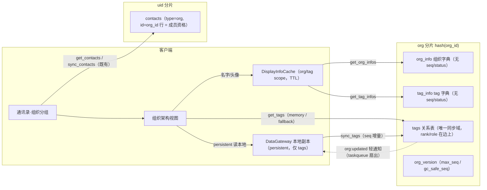
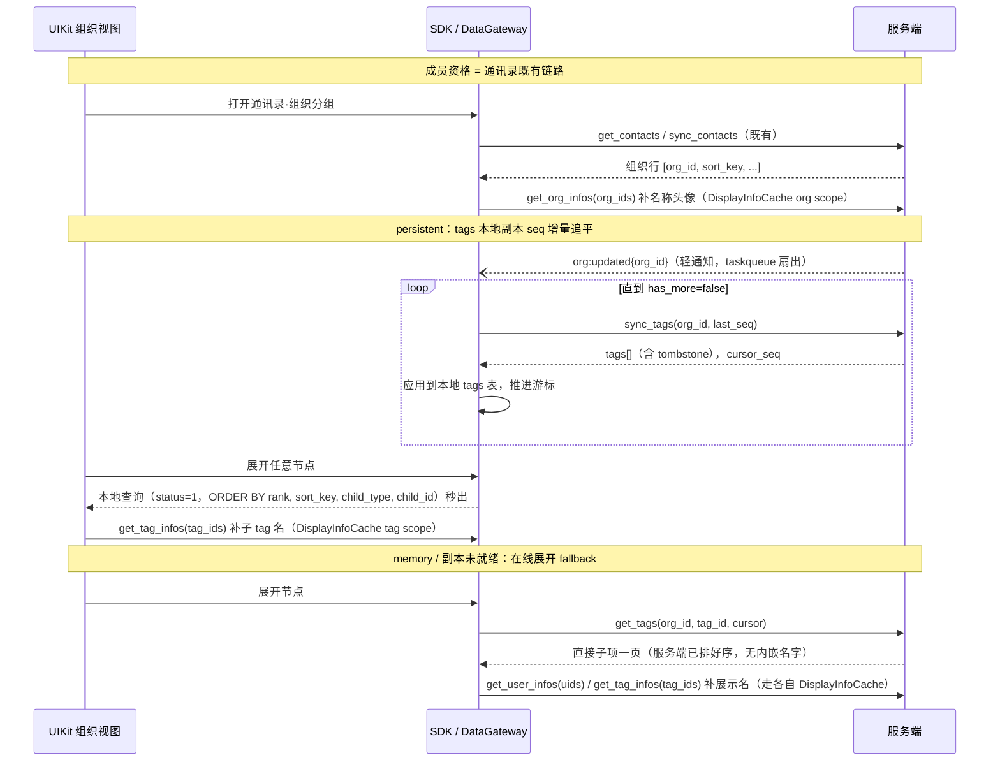

# 组织架构方案

> 主要对照：`internal/dal/org_store.go`、`internal/service/org.go`、`internal/protocol/yimsg.proto`、`frontend/src/sdk/datagateway/persistent.ts`、`frontend/src/sdk/state/cache.ts`、`frontend/src/uikit/app/views/contacts.ts`。
> 最后复核：2026-07-07。
> 触发更新：组织架构域的 schema、action、tag 模型、排序规则、同步机制或通讯录集成方式变化时同步更新。
> 入口关系：上级索引见 [`README.md`](README.md)；数据库总览见 [`db/数据库设计总览.md`](db/数据库设计总览.md)，通讯录现状见 [`db/通讯录数据库设计.md`](db/通讯录数据库设计.md)，通用同步契约见 [`../同步机制方案.md`](../同步机制方案.md)；本文是组织架构（组织通讯录）的设计单一事实源。

## 目录

- [1. 定位](#1-定位)
- [2. 设计目标](#2-设计目标)
- [3. 业内方案调研与选型](#3-业内方案调研与选型)
  - [3.1 主流产品的组织模型](#31-主流产品的组织模型)
  - [3.2 模型演进：五轮收敛](#32-模型演进五轮收敛)
  - [3.3 同步档位：直接落地完整同步域](#33-同步档位直接落地完整同步域)
- [4. 核心思想](#4-核心思想)
- [5. 数据模型](#5-数据模型)
  - [5.1 org 分片组：四张表](#51-org-分片组四张表)
  - [5.2 成员资格并入 contacts（既有表变更）](#52-成员资格并入-contacts既有表变更)
  - [5.3 表结构一览](#53-表结构一览)
- [6. 绝对排序规则](#6-绝对排序规则)
- [7. 协议接口](#7-协议接口)
- [8. 同步与读取流程](#8-同步与读取流程)
- [9. 与通讯录的集成](#9-与通讯录的集成)
- [10. 权限与写入](#10-权限与写入)
- [11. 垃圾回收](#11-垃圾回收)
- [12. 性能与扩容](#12-性能与扩容)
- [13. 测试](#13-测试)
- [14. 边界](#14-边界)
- [15. 维护点](#15-维护点)
- [16. 实现入口](#16-实现入口)

## 1. 定位

- 负责：组织（如"腾讯科技有限公司广州研发中心"）在通讯录中的呈现、组织 / tag 展示字典（组织、部门、横向分组的名字与头像）、`tags` 关系表（唯一的同步域，按边的绝对排序 + seq 增量 + 通知扇出 + 本地副本）、协议与权限。
- 不负责：好友 / 收藏群通讯录既有行为（见 [`db/通讯录数据库设计.md`](db/通讯录数据库设计.md)）、组织内聊天能力（tag 不是会话目标，成员间沟通仍走单聊 / 群聊）、复杂 RBAC 权限体系（`tags.role` 只是"是否管理员"的二值标识，不是权限系统）。

通讯录自此有三类条目：**好友、群、组织**——三类都是 `contacts` 表的行。组织条目记录"我在哪个组织"，走既有通讯录同步；组织架构内容（`tags` 关系表）是独立的新同步域，按 `org_id` 路由、seq 增量追平。

## 2. 设计目标

| 目标 | 约束 |
|---|---|
| 展示字典与同步域分离 | 组织 / tag 的名字头像是无 `seq`/`status` 的纯字典（`org_info` / `tag_info`），与 `group_info` 同构，按需查询、走 `DisplayInfoCache` TTL 缓存；只有结构关系（`tags`）是完整同步域，遵守 [`../同步机制方案.md`](../同步机制方案.md) 的"轻通知 + 主动拉取"契约 |
| 变更即时可见 + 离线可用 | 结构变更推送 `org:updated` 轻通知给全体在线成员；persistent 模式持有 `tags` 本地副本，离线可浏览、打开秒出 |
| 成员资格即通讯录条目 | "我在哪个组织"就是 `contacts` 的一行（与好友、收藏群并列第三类），复用既有 seq 增量同步、排序 / 搜索投影、tombstone、Contact GC 和 `contacts:updated` 通知；**不建任何反查表** |
| 组织与 tag 是同构的两类字典实体 | 组织（`org_info`）和 tag / 部门 / 横向分组（`tag_info`）各自独立成表，字段相同（`name`、`avatar`），概念不再合并为"根 tag"；两者都只是名字字典，结构关系统一落在 `tags` 表 |
| 一人多岗 + 按边排序 | 一个人可挂在多个 tag 下；排序值 `rank`、角色 `role` 落在"某父节点包含某子项"这条边上，同一人在不同 tag 下排序与角色互相独立 |
| 绝对排序 | 展开一个节点的返回顺序完全由服务端落库的 `rank` 决定；客户端零排序逻辑 |
| 管理员标识 | `tags.role` 标识某子项在其挂载节点下是否为管理员（`MEMBER` / `ADMIN`），随边独立存在，一人可在不同节点下有不同角色 |
| 性能好 | `org` 分片组按 `org_id` 路由，一个组织的全部数据同分片；展开与同步都是单分片单索引 keyset / seq 顺扫，无 JOIN |
| 数据结构简单 | 组织域四张表（组织字典 + tag 字典 + 关系 + 版本）；协议四个只读 action + 一个通知 + `ContactTarget` 扩展 |

## 3. 业内方案调研与选型

### 3.1 主流产品的组织模型

| 产品 | 组织模型 | 排序 | 同步策略 |
|---|---|---|---|
| 企业微信 | 部门树 + 独立的"标签"（可含成员与部门） | 部门与成员均有 `order` 排序字段，落库、服务端为准 | 通讯录带版本 / 增量游标，客户端与本地副本追平 |
| 钉钉 | 部门树 + 角色组 | 部门 `order` 字段绝对排序 | 懒加载为主，辅以变更事件推送 |
| 飞书 | 部门树 + 用户组 | 部门、成员各自带排序字段 | 开放平台提供变更事件订阅 + 按部门分页拉取 |
| LDAP / AD | 目录树 + **可嵌套的组**（group 可含 user 和 group），组织本身也是目录节点 | 目录属性排序 | 目录复制协议（增量复制到副本） |
| Google Groups | 组可嵌套组 | 名字排序 | 按需查询 |
| Slack | 扁平 user groups，不可嵌套 | 名字排序 | 全量拉取 |

本方案采纳的共识与推进的一步：

1. **排序字段落库、服务端为单一事实源**（企业微信 / 钉钉 / 飞书一致做法）——采纳。
2. **变更事件 + 增量副本**（企微通讯录游标、AD 目录复制的思路）——采纳，且直接套用本项目已有的同步契约，不发明新机制。
3. **"组可以嵌套组、组可以含人"**（LDAP 的目录观）——采纳，但组织本身不再视为"根节点"，而是与 tag 平级的独立展示字典实体；DAG 结构关系统一落在一张关系表（`tags`）里。
4. **展示字典与结构同步域彻底分离**（与项目里 `group_info`/`user_info` 是无 seq 字典、`group_member` 走独立 CRUD 的先例一致）——组织名字、tag 名字都是"改了就改了"的当前值查询，不需要客户端增量追平；只有"谁在哪个节点下、排第几、是不是管理员"这件结构性事实需要增量同步。

### 3.2 模型演进：五轮收敛

数据模型经历五轮收敛，每一轮都在删概念或拆清楚字典与结构的边界：

| 版本 | 概念 | 表 | 特例 / 冗余 |
|---|---|---|---|
| v1 部门树 | 组织、部门、部门成员 | info / 部门 / 成员 / 反查，4 张 | 部门与横向分组两套语义 |
| v2 tag 统一 | 组织、tag、边 | info / tag / 边 / 反查，4 张 | `tag_id=0` 虚拟根 |
| v3 组织即根 tag | tag、边 | tag / 边 / 反查，3 张 | `user_org` 反查表与 `get_orgs` 专用入口 |
| v4 成员资格并入通讯录 | tag、边 | tag / 边（+ 版本表），并入 contacts | 节点表混装"组织根"与"部门"两种语义，边表 `child_tag_id`/`uid` 互斥字段冗余 |
| **v5 字典与关系彻底分离（当前）** | **组织、tag、关系** | **`org_info` / `tag_info` / `tags`（+ 版本表），并入 contacts** | **无：字典按需查询，关系是唯一同步域，`tags.child_id` + `child_type` 替代两个互斥列** |

v5 的两个关键动作：其一延续 v4——不建 `user_org` 反查表，组织条目就是 `contacts` 的第三类行（`type=org, id=org_id`）；其二是本轮新增——把"组织根"从节点表里独立出来变成 `org_info`（与 `tag_info` 同构的字典表），`tags` 表不再需要 `child_tag_id`/`uid` 两个互斥列，改用统一的 `child_id` + `child_type` 区分子项是人还是 tag，并新增 `role` 标识管理员身份。字典表因为不参与同步，天然获得与 `group_info` 一致的按需查询 + TTL 缓存能力（`get_org_infos` / `get_tag_infos`），前端不再需要为组织名字维护专门的本地表。

与"部门树 + 标签两套"（企微形态）相比的收益：结构关系只有一张表（`tags`），一人多岗天然支持，横向分组与部门同一展示通道；代价：tag 嵌套构成 DAG，需要写入侧防环。

### 3.3 同步档位：直接落地完整同步域

同步档位曾有三个候选：L0 零同步（每次展开现拉）、L1 轻通知 + 内存缓存失效、L2 完整同步域。**决策：结构关系（`tags`）落地 L2，展示字典（`org_info`/`tag_info`）落地 L0（按需查询 + 客户端 TTL 缓存）**，理由：

- 结构关系（谁在哪个节点下、排第几、是不是管理员）是离线浏览、打开秒出的必要数据，值得完整同步域；组织 / tag 的名字头像只是展示层数据，与 `group_info`/`user_info` 同等对待即可，没有理由为它单独维护同步游标和本地表。
- 项目同步框架（轻通知、seq 游标、tombstone、`gc_safe_seq` 重建、DataGateway 双模式）现成，`tags` 同步只是把路由键从 `uid` 换成 `org_id`，无新机制。
- 字典与同步域拆开后，前端 `DisplayInfoCache` 只需新增 `org`、`tag` 两个 scope（与既有 `user`、`group` scope 同构），不需要额外的本地持久化表和游标管理。

L2（`tags`）的两笔账及其对策（见 [8](#8-同步与读取流程) / [14](#14-边界)）：

1. **广播型扇出**：组织结构变更要通知全体成员，与现有同步域"每次通知 1~2 人"量级不同。对策：通知经 taskqueue 异步扇出，同一组织未消费的通知任务合并为一条（一次架构调整成批变更只扇出一次）；通知体只带 `org_id`，重活在客户端增量拉取侧。
2. **初次同步读放大**：全量副本 = 成员数 × 边数。对策：仅 persistent 模式建副本；初次同步为后台低优先级分页任务，完成前视图走在线展开 fallback（双轨，见 [8](#8-同步与读取流程)）；memory 模式永远不建副本。

读取因此是**双轨**的，与消息域同构：persistent 模式读本地副本（秒开、离线可用），memory 模式走在线逐级展开（零副本、内存有界）；在线展开接口同时是 persistent 模式初次同步未完成时的 fallback。

## 4. 核心思想



四条设计原则：

1. **字典与结构关系分离**：组织（`org_info`）和 tag（`tag_info`，部门 / 横向分组的统一抽象）都只是"名字 + 头像"的展示字典，不参与同步；tag 与 tag、tag 与人的包含关系统一落在 `tags` 关系表的一行里，整个组织架构就是"两张字典表 + 一张关系表"存储的 DAG。
2. **rank / role 在边上**：排序值和管理员标识都不属于人、也不属于 tag 本身，属于"某节点包含某子项"这条边。一人多岗即多条边，每条边独立 `rank` / `title` / `role`，同一人在不同节点下的排序、职务、管理员身份互不干扰。
3. **`tags` 是唯一的标准同步域**：`seq` 全部从 `org_version.max_seq` 分配（先例：`messages` / `conversations` 共用 `messages_version`），任何结构变更 bump seq 并留 tombstone；变更后 `org:updated` 轻通知全员，客户端用 `sync_tags` 增量追平；`last_seq < gc_safe_seq` 时全量重建。展示排序走 `rank` 索引、同步游标走 `seq` 索引，两者正交。
4. **独立分片域**：`org` 分片组，路由键 `org_id`（Snowflake 全局唯一），一个组织的字典、关系和版本同分片。

## 5. 数据模型

所有 ID 由 Snowflake 生成（禁自增主键）；时间戳毫秒；TEXT 用 `NOT NULL DEFAULT ''`；`status`/`child_type`/`role` 的 0 为非法值。

### 5.1 org 分片组：四张表

路由规则与其他分片组一致：`hash(org_id) % N → shard`。

```sql
-- 组织字典表：仅组织展示信息，无 seq/status，不参与同步（与 group_info 同构）。
CREATE TABLE IF NOT EXISTS org_info (
    org_id     INTEGER PRIMARY KEY,
    name       TEXT    NOT NULL DEFAULT '',
    avatar     TEXT    NOT NULL DEFAULT '',
    created_at INTEGER NOT NULL,
    updated_at INTEGER NOT NULL
);

-- tag 字典表：部门/横向分组的展示信息，无 seq/status，不参与同步。
CREATE TABLE IF NOT EXISTS tag_info (
    org_id     INTEGER NOT NULL,
    tag_id     INTEGER NOT NULL,
    name       TEXT    NOT NULL DEFAULT '',
    avatar     TEXT    NOT NULL DEFAULT '',
    created_at INTEGER NOT NULL,
    updated_at INTEGER NOT NULL,
    PRIMARY KEY (org_id, tag_id)
);

-- tags：唯一的同步域（组织关系表）。一行是"某父节点（组织根传 org_id、
-- 部门传 tag_id）下挂一个子项"，child_type 区分子项是人（PERSON, child_id=uid）
-- 还是 tag（TAG, child_id=tag_id）；role 标识该子项在这个父节点下是否为
-- 管理员；rank/title/sort_key 是边的属性。
CREATE TABLE IF NOT EXISTS tags (
    org_id     INTEGER NOT NULL,
    tag_id     INTEGER NOT NULL,              -- 父节点（组织根传 org_id）
    child_id   INTEGER NOT NULL,              -- 子项：child_type=PERSON 时为 uid，=TAG 时为 tag_id
    child_type INTEGER NOT NULL CHECK (child_type <> 0),  -- 1=PERSON, 2=TAG
    title      TEXT    NOT NULL DEFAULT '',   -- 本节点下的职务展示（仅人条目常用）
    rank       INTEGER NOT NULL DEFAULT 2147483647,
    sort_key   TEXT    NOT NULL DEFAULT '',
    role       INTEGER NOT NULL DEFAULT 1 CHECK (role <> 0),  -- 1=MEMBER, 2=ADMIN
    status     INTEGER NOT NULL CHECK (status <> 0),  -- 1=ACTIVE, 0xff=DELETED tombstone
    seq        INTEGER NOT NULL DEFAULT 0,
    created_at INTEGER NOT NULL,
    updated_at INTEGER NOT NULL,
    PRIMARY KEY (org_id, tag_id, child_id, child_type)
);
-- 展开一个父节点：仅 ACTIVE 行，tag 与人混合的绝对排序 + keyset 分页，索引即最终顺序。
CREATE INDEX IF NOT EXISTS idx_tags_order ON tags(org_id, tag_id, status, rank, sort_key, child_type, child_id);
-- 同步游标：seq 增量顺扫。
CREATE INDEX IF NOT EXISTS idx_tags_seq ON tags(org_id, seq);
-- 按子项反查：离职判定（人是否还有边）、昵称/tag 改名联动刷投影。
CREATE INDEX IF NOT EXISTS idx_tags_child ON tags(org_id, child_type, child_id);

-- 版本表：tags 的 seq 空间 + GC 水位线（先例：messages_version）。
CREATE TABLE IF NOT EXISTS org_version (
    org_id      INTEGER PRIMARY KEY,
    gc_safe_seq INTEGER NOT NULL DEFAULT 0,
    max_seq     INTEGER NOT NULL DEFAULT 0
);
```

- `org_info` / `tag_info` 无 `seq`/`status`：改名、改头像直接原地更新；删除 tag 时 `tag_info` 行物理删除（无 tombstone），由 `tags` 表的 tombstone 承载"这个 tag 曾经存在过、现在没了"的语义。
- `sort_key` 是名字归一化投影（人取昵称、tag 取 tag 名），生成规则复用 `contacts` 的 `ContactSortKey`（首版小写归一化，后续可扩展拼音）；改 tag 名时级联刷新"以其为子项"的边的 `sort_key` 并各自 bump seq。
- 人的昵称、头像不落组织表：客户端拿到 `uid` 后走既有 `get_user_infos` / uidCache 通道补展示资料，与群成员列表同构；tag 子项的名字同理走 `get_tag_infos`。
- **不做 JOIN**：在线展开 `get_tags` 只返回 `child_id`/`child_type` 等结构字段，不内嵌子项名字；子 tag 名字、人昵称均由客户端另发 `get_tag_infos` / `get_user_infos` 批量点查后在应用层拼接（与 `get_group_members` 不内嵌昵称的先例一致）。

### 5.2 成员资格并入 contacts（既有表变更）

**不建反查表**。"uid 属于哪个组织"由通讯录直接承载：`contacts` 使用统一目标键 `type` / `id`，其中组织成员资格为 `type=org, id=org_id`，主键与排序 / 搜索索引使用统一目标键：

```sql
CREATE TABLE IF NOT EXISTS contacts (
    uid            INTEGER NOT NULL,
    type           INTEGER NOT NULL,
    id             INTEGER NOT NULL,
    status         INTEGER NOT NULL CHECK (status <> 0),
    remark_name    TEXT    NOT NULL DEFAULT '',
    sort_key       TEXT    NOT NULL DEFAULT '',
    search_text    TEXT    NOT NULL DEFAULT '',
    seq            INTEGER NOT NULL DEFAULT 0,
    created_at     INTEGER NOT NULL DEFAULT 0,
    updated_at     INTEGER NOT NULL DEFAULT 0,
    PRIMARY KEY (uid, type, id)
);
CREATE INDEX IF NOT EXISTS idx_contacts_seq ON contacts(uid, seq);
CREATE INDEX IF NOT EXISTS idx_contacts_sort ON contacts(uid, status, sort_key, type, id);
CREATE INDEX IF NOT EXISTS idx_contacts_search ON contacts(uid, status, search_text);
```

组织行的语义与群收藏行同构：

- `status = FRIEND` 表示"已加入组织"（无 PENDING 态：入职由组织侧发起，不存在申请流程）；离职即软删除 `status = DELETED`，走既有 tombstone 同步与 Contact GC 物理清理。
- `sort_key` / `search_text` 投影基于组织名（`org_info.name`），支持 `remark_name` 备注（备注组织名），刷新规则与群收藏一致：客户端调用 `get_org_infos` 拉展示资料时，服务端刷新调用方组织行的投影。
- 组织行完整复用 `get_contacts` 分页、`sync_contacts` 增量、`contacts:updated` 通知、`get_contact_count` 统计，**通讯录域不新增任何接口**。

研发阶段不做 migration：`contacts` 主键变更直接重建分片库并重新同步。

### 5.3 表结构一览

新增 4 张表 + 变更 1 张既有表：

| 分片组 | 表 | 变更 | 主键 | 索引 | 角色 |
|---|---|---|---|---|---|
| org | `org_info` | **新增** | `org_id` | — | 组织展示字典：`name`、`avatar`，无 seq/status，不参与同步 |
| org | `tag_info` | **新增** | `(org_id, tag_id)` | — | tag（部门/横向分组）展示字典：`name`、`avatar`，无 seq/status，不参与同步 |
| org | `tags` | **新增** | `(org_id, tag_id, child_id, child_type)` | `idx_tags_order(org_id, tag_id, status, rank, sort_key, child_type, child_id)`、`idx_tags_seq(org_id, seq)`、`idx_tags_child(org_id, child_type, child_id)` | 唯一的同步域：包含关系 + 每条边独立的 `rank` / `title` / `role` / `sort_key`，带 `status` / `seq` |
| org | `org_version` | **新增** | `org_id` | — | `tags` 的 seq 空间 + `gc_safe_seq` 水位线 |
| uid | `contacts` | **统一目标键** | `(uid, type, id)` | `idx_contacts_sort(uid, status, sort_key, type, id)`，其余不变 | 通讯录三类条目：好友 / 群 / 组织；组织行即成员资格 |

## 6. 绝对排序规则

`rank` 是绝对排序的唯一入口，作用在边上，对子 tag 和人统一：

- `rank` 越小越靠前；显式排序建议按 10、20、30 稀疏编排，预留插位空间。
- 默认值 `2147483647`（`INT32_MAX`）表示"未显式排序"，自然沉到所有显式排序之后，落到 `sort_key`（名字）字典序。
- 子 tag 和人共享同一个排序空间，管理侧可以自由编排（例如"公司领导"tag 里让领导 1、2 排最前，子 tag "秘书处"排最后）；不想混排时按段编排即可（如子 tag 用 1000 段、人用 2000 段），协议不强加"tag 一定在人前面"的规则。
- 排序与同步正交：展示走 `(status, rank, sort_key, child_type, child_id)` 索引，同步走 `(org_id, seq)` 索引；`seq` 永远不参与展示排序。
- 在线展开 SQL 与索引完全对齐，一次索引顺扫即最终展示顺序；persistent 模式本地副本用同构的本地索引与同一条 ORDER BY：

```sql
-- 展开一个父节点的直接子项（idx_tags_order 覆盖；本地副本同构）
SELECT child_id, child_type, title, rank, sort_key, role FROM tags
WHERE org_id = ? AND tag_id = ? AND status = 1
  AND (rank, sort_key, child_type, child_id) > (?, ?, ?, ?)   -- keyset 游标，首页传 (-1, '', 0, 0)
ORDER BY rank ASC, sort_key ASC, child_type ASC, child_id ASC
LIMIT ?;
```

效果即需求原文：同一个 A，"xx 部门"这条边 `rank=1` 排第一；"公司领导"这条边 `rank=INT32_MAX`，与其他未显式排序的领导一起按名字排（A 名字靠后即排最后）。同名再按 `child_type` / `child_id` 兜底，保证顺序全序、分页游标稳定。

这与企业微信 / 钉钉的 `order` 字段是同一思路，两点差异：方向取"值小靠前"，与 SQL `ASC` 索引方向一致；排序值挂在边上而非成员行上，从而"一人多处、处处独立排序"。

## 7. 协议接口

组织域：四个只读 action + 一个通知；另扩展既有 `ContactTarget`。遵循协议规则：独立 Request / Response、`BaseResponse base = 1`、业务字段从 10 开始、enum 0 保留 invalid、通知固定 `request_id=0`。

```proto
TYPE_ACTION_GET_ORG_INFOS = 44; // action=get_org_infos auth=true domain=组织 desc=批量读取组织展示资料
TYPE_ACTION_GET_TAGS      = 45; // action=get_tags      auth=true domain=组织 desc=在线展开 tags（组织关系表）中某节点的直接子项（tag 与人混合有序）
TYPE_ACTION_SYNC_TAGS     = 46; // action=sync_tags     auth=true domain=组织 desc=按 org 增量同步 tags（组织关系表）
TYPE_ACTION_GET_TAG_INFOS = 47; // action=get_tag_infos auth=true domain=组织 desc=批量读取 tag（部门/横向分组）展示资料
TYPE_NOTIFY_ORG_UPDATED   = 10010; // notification=org:updated desc=组织架构发生变化，携带 org_id，客户端按 sync_tags 增量追平
```

```proto
// 既有消息扩展：通讯录第三类条目。
message ContactTarget {
  oneof kind {
    int64 uid = 1;      // 联系人用户 ID
    int64 group_id = 2; // 通讯录收藏群 ID
    int64 org_id = 3;   // 新增：组织 ID
  }
}

// tags 条目状态；0 保留为非法值。
enum TagStatus {
  TAG_STATUS_INVALID = 0; // reserved=invalid meaning=无效状态
  TAG_STATUS_ACTIVE  = 1; // meaning=有效
  TAG_STATUS_DELETED = 255; // meaning=已删除 tombstone
}

// 区分 tags 一行挂载的子项是人还是 tag；0 保留为非法值。
enum TagChildType {
  TAG_CHILD_TYPE_INVALID = 0;
  TAG_CHILD_TYPE_PERSON  = 1; // child_id 为 uid
  TAG_CHILD_TYPE_TAG     = 2; // child_id 为 tag_id
}

// 标识某子项在其挂载节点下是否为管理员；0 保留为非法值。
enum TagRole {
  TAG_ROLE_INVALID = 0;
  TAG_ROLE_MEMBER  = 1;
  TAG_ROLE_ADMIN   = 2;
}

message OrgUpdatedNotification {
  int64 org_id = 1; // required 发生变化的组织
}

// 组织展示资料字典：仅名字/头像，不参与同步（与 GroupInfo 同构）。
message OrgInfo {
  int64 org_id = 1;
  string name = 2;
  string avatar = 3;
}

// tag（部门/横向分组）展示资料字典：仅名字/头像，不参与同步。
message TagInfo {
  int64 tag_id = 1;
  string name = 2;
  string avatar = 3;
}

// tags 条目：在线展开与同步共用，唯一的同步域。
message Tag {
  int64 tag_id = 1;            // required 父节点 ID；展开组织根传 org_id
  int64 child_id = 2;          // required 子项 ID：PERSON 为 uid，TAG 为 tag_id
  TagChildType child_type = 3; // required 子项类型
  string title = 4;            // optional 本节点下的职务展示文本（仅人条目常用）
  int64 rank = 5;              // required 排序值，越小越靠前；2147483647 表示未显式排序
  string sort_key = 6;         // required 名字归一化排序键
  TagRole role = 7;            // required 子项在本节点下的角色，标识是否为管理员
  TagStatus status = 8;        // required 在线展开恒为 ACTIVE；同步含 DELETED tombstone
  int64 seq = 9;                // required 同步序号
}

message GetOrgInfosRequest {
  repeated int64 org_ids = 10; // required 组织 ID 列表，来自通讯录组织行；去重后受服务端批量上限约束
}
message GetOrgInfosResponse {
  BaseResponse base = 1;
  repeated OrgInfo orgs = 10;
}

message GetTagInfosRequest {
  int64 org_id = 10;           // required 组织 ID（分片路由键）
  repeated int64 tag_ids = 11; // required tag ID 列表，去重后受服务端批量上限约束
}
message GetTagInfosResponse {
  BaseResponse base = 1;
  repeated TagInfo tags = 10;
}

message GetTagsRequest {
  int64 org_id = 10; // required 组织 ID（分片路由键）
  int64 tag_id = 11; // required 要展开的父节点；展开组织根传 tag_id=org_id，0 非法
  PageQuery page = 12; // optional 展示分页游标；按 (rank, sort_key, child_type, child_id) 升序
}
message GetTagsResponse {
  BaseResponse base = 1;
  repeated Tag tags = 10; // 仅 ACTIVE，tag 与人按绝对排序混合
  PageInfo page = 11;
}

message SyncTagsRequest {
  int64 org_id = 10;    // required
  int64 last_seq = 11;  // optional 客户端最后同步序号
  int64 limit = 12;     // optional 同步条数
  bool rebuild = 13;    // optional 是否强制重建本地副本
}
message SyncTagsResponse {
  BaseResponse base = 1;
  repeated Tag tags = 10; // 增量条目（含 tombstone）
  bool has_more = 11;
  int64 cursor_seq = 12;
}
```

要点：

- **通讯录域零新接口**：组织条目走既有 `get_contacts` / `sync_contacts`；`get_org_infos` / `get_tag_infos` 与 `get_user_infos` / `get_group_infos` 同构，只负责展示资料（名称 / 头像）与投影刷新，客户端走 `DisplayInfoCache` 的 `org` / `tag` scope 按需查询 + TTL 缓存。
- **结构关系不内嵌名字**：`Tag`（`get_tags` / `sync_tags` 的条目）只有 `child_id` + `child_type`，不内嵌子项的名字 / 头像；客户端展开后按需批量调 `get_tag_infos`（TAG 子项）/ `get_user_infos`（PERSON 子项）补齐展示名，与 `get_group_members` 不内嵌昵称的先例一致。
- **一个游标追平结构变更**：`sync_tags` 按 `seq` 升序返回变更、`cursor_seq` 推进；`rebuild=false && last_seq < gc_safe_seq` 时返回 `SEQ_TOO_OLD`，客户端清空该组织本地副本与游标后 `last_seq=0, rebuild=true` 重来（与 `sync_contacts` 同款契约）。
- **帧上限约束**：协议整包 ≤ `0xffff`、body ≤ 65519 字节；在线展开与同步单页条数均可配置且服务端按批量上限校验。
- **无管理面 action**：研发阶段组织建制（建组织、建 tag、连边、设 rank/role）由 `tools/cmd/seed-data/` 类管理工具直写数据库完成，不上协议；线上管理后台是后续独立议题（见 [14. 边界](#14-边界)）。

## 8. 同步与读取流程



**persistent 模式**（本地副本，DataGateway 新增本地表 `tags` + 每组织游标）：

- **同步触发**：① 连接建立后对通讯录中每个组织行做一次增量 `sync_tags`（无变更即一次空往返，补上离线期间错过的通知）；② 收到 `org:updated` 时对该组织增量；③ 通讯录出现新组织行（入职）且无游标时，启动后台低优先级全量同步（分页循环直到 `has_more=false`）。
- **tombstone 处理**：`status=DELETED` 的边收到即删本地行、推进游标，不保存 tombstone（与 contacts 本地副本同规则）。
- **副本清理**：通讯录组织行 tombstone（离职）时，DataGateway 删除该组织的本地 `tags` 数据与游标；服务端侧该用户也已过不了成员校验。
- **fallback**：初次全量同步完成前，组织视图走在线 `get_tags`，与 memory 模式同路径；同步完成后切本地读。
- **展示字典不进本地副本**：`org_info` / `tag_info` 不参与同步，不在 persistent 本地建专门表，而是复用 `displayinfo` 通用展示缓存表（`org` / `tag` scope，与 `user` / `group` 同构）。

**memory 模式**：不建任何 `tags` 副本，恒走在线展开；视图只持有"当前展开路径上各级已加载窗口"，返回上级或离开视图即释放；展示字典缓存（`DisplayInfoCache`）与副本模式无关，两种模式都有。

**通用约定**：面包屑即导航栈（DAG 下同一 tag 可能有多条到达路径，客户端不反推路径，面包屑就是用户实际点击的展开栈，只存 `tagId`，展示名每次渲染时从 `org`/`tag` 展示缓存现查）；人的昵称 / 头像统一走既有 uidCache，tag 的名字 / 头像统一走 tag 展示缓存，组织架构域不重复缓存。

## 9. 与通讯录的集成

通讯录页三分组：**好友、群、组织**——同一张 `contacts` 表的三类行，同一套机制：

| 分组 | contacts 行 | 同步方式 |
|---|---|---|
| 好友 | `friend_uid > 0` | seq 增量同步（现状不变） |
| 群 | `group_id > 0` | seq 增量同步（现状不变） |
| 组织 | `org_id > 0`（新增） | 同一套 seq 增量同步、tombstone、`contacts:updated` 通知 |

- 入职时组织侧写入通讯录组织行并推送 `contacts:updated`，客户端增量同步后组织条目自动出现；离职即 tombstone，条目自动消失——多端一致、离线可见，行为与好友 / 群收藏完全对齐。
- 组织行支持备注、按 `sort_key` 参与通讯录统一排序与搜索（`search_text` 含组织名）。
- 架构内容（`tags` 关系表）是独立同步域：组织条目点开即"展开组织根（tag_id=org_id）"（persistent 读本地副本），之后逐级点击下钻，顶部面包屑随展开栈生长；人条目点开进既有用户资料页（可发起单聊、加好友）。主应用与嵌入式 UIKit 共享该视图。

## 10. 权限与写入

- **读权限**：四个组织 action 在 service 层统一前置校验"调用方是组织成员"——点查调用方 uid 分片的 `contacts(uid, type=org, id=org_id)` 且 `status = FRIEND`，主键命中 O(1)，未命中返回 `ERROR_FORBIDDEN`。身份取自帧头解析后的 `BaseInfo.uid`，不信任 body。tag 级不再细分可见性（首版全组织成员可见全部 tag）。
- **写路径**（管理工具直写，非协议；org 分片内 `tags` 行变更在单事务内逐行 `bumpSeq(org_id)`，事务提交后投递一条 `org:updated` 扇出任务；`org_info`/`tag_info` 字典行变更本身不 bump seq）：
  - 建组织：写 `org_info` 字典行（`CreateOrg`，Snowflake 新 `org_id`）。
  - 建 tag：写 `tag_info` 字典行并挂到父节点下（`AddOrgTag`，父节点可以是组织根或另一个 tag；防环 + 根不为子在挂边时校验）。
  - 人挂进 tag：插 `tags` 边（`child_type=PERSON`，`role` 默认 MEMBER，可指定 ADMIN；bump seq）；若是该人在此组织的第一条 ACTIVE 边（`idx_tags_child` 判定），uid 分片 Upsert 通讯录组织行（`status=FRIEND`，投影按组织名，bump contacts seq）并推送 `contacts:updated`。
  - 人摘出 tag：对应边 `status→DELETED`（bump seq）；若该人在本组织再无 ACTIVE 边，uid 分片软删除通讯录组织行并推送 `contacts:updated`。
  - 删 tag：`tag_info` 字典行物理删除（无 tombstone）；其两个方向的关联边（`tag_id=X` 的下挂边、`child_type=TAG,child_id=X` 的被挂边）在同事务内全部 `status→DELETED`、逐行 bump seq；被挂在别处的子节点不受影响（DAG）。
  - tag 连 tag（挂子 tag）：插边前两项校验——**防环**：从"待挂的子 tag"沿 ACTIVE 边向下 BFS（同分片、主键前缀扫描），可达集合中不得出现"待挂入的父 tag"；**根不为子**：组织根（`org_id`）不得作为 `child_id` 出现。
  - 调排序 / 改职务 / 改角色：更新对应边的 `rank` / `title` / `role`（bump seq）。
  - 改组织名：更新 `org_info` 字典行（不 bump seq，无边引用组织根，无级联）。
  - 改 tag 名：更新 `tag_info` 字典行；以其为 `child_type=TAG` 子项的边重算 `sort_key` 并逐行 bump seq（org 分片内按 `org_id` 前缀扫描定位，改名低频、成本可接受）。
- **昵称变化刷投影**：用户改昵称时，service 从其同分片的 contacts 组织行取得所属组织列表，对每个组织经 `idx_tags_child` 定位其 ACTIVE 边、重算 `sort_key` 并 bump seq（触发 `org:updated`）；跨分片写沿用容忍规则，失败由管理工具重放兜底。
- **双写容忍**：`tags`（org 分片）与 `contacts` 组织行（uid 分片）跨分片、无事务，沿用好友双写的容忍规则；不一致的兜底方向是"以 contacts 为门"——漏删只多一个打不开新数据的空条目，漏插则用户暂时看不到组织，均可由管理工具重放修复。
- **通知扇出**：`org:updated` 经 taskqueue 异步扇出（复用群消息 fanout 机械）：worker 由 `idx_tags_child` 取全体 ACTIVE 成员 uid，向在线成员推送 `OrgUpdatedNotification{org_id}`；同一组织在队列中未消费的通知任务合并为一条，成批架构调整只扇出一次；离线成员靠上线后的增量同步追平，不补发通知。

## 11. 垃圾回收

**Org GC**：与 Contact GC 同款三步，清理 `tags` tombstone、升水位线；默认间隔 3600s、批大小 500。`org_info`/`tag_info` 字典行本身没有 tombstone（改名原地更新、删 tag 物理删行），GC 只需要处理 `tags`：

```
1. OrgStore.ListPurgeable(limit, afterOrgID)
   → SELECT DISTINCT org_id FROM tags WHERE status = 0xff AND org_id > ? LIMIT ?
2. 对每个 org_id：OrgStore.Purge(org_id) — 事务内三步：
   a. 快照：tags 中 status=0xff 行的 MAX(seq)
   b. 物理删除：DELETE FROM tags WHERE org_id = ? AND status = 0xff
   c. 升水位线：UPDATE org_version SET gc_safe_seq = MAX(old, snapshotSeq)
```

事务保证三步原子；`gc_safe_seq` 单调不回退。游标落后于水位线的客户端在下次 `sync_tags` 收到 `SEQ_TOO_OLD`，清本地重建。通讯录组织行的墓碑清理由既有 Contact GC 顺带完成，组织域不重复处理。

## 12. 性能与扩容

| 场景 | 路径 | 成本 |
|---|---|---|
| 打开组织分组 | contacts 既有分页 / 增量同步 | 与好友 / 群分组同价 |
| 组织名称 / 头像 | `get_org_infos` 批量点查 `org_info`（走 `DisplayInfoCache` TTL 缓存） | N 次主键点查，命中缓存则 0 |
| tag 名称 / 头像 | `get_tag_infos` 批量点查 `tag_info`（走 `DisplayInfoCache` TTL 缓存） | 同上 |
| 权限校验 | 调用方 uid 分片 contacts 主键点查 | O(1) |
| 展开一个节点（persistent） | 本地 `tags` 副本索引查询 | 零网络往返，秒出 |
| 展开一个节点（memory / fallback） | `idx_tags_order` keyset 顺扫一页；子项名字另发请求批量点查 | 一次索引扫描，无排序开销 |
| 增量同步一页 | `idx_tags_seq` 顺扫 | 一次往返，通常空结果 |
| 通知扇出 | taskqueue worker：成员列表一次索引扫描 + 在线推送 | 异步、按组织合并，不阻塞写路径 |
| 防环检查（写入侧） | `tags` 主键前缀向下 BFS | 仅管理写路径，低频 |

- **分片红利**：一个组织的字典、关系和版本都在 `hash(org_id)` 同一分片，展开、同步、GC 都不跨分片；组织之间天然水平打散。成员资格行跟随各成员的 uid 分片，天然分散。
- **同步读放大有界**：增量同步按 seq 顺扫、只返回变更行；全量重建仅发生在初次入职、`SEQ_TOO_OLD` 或本地库重建，且是后台分页任务。
- **读写形态**：组织架构读多写少（调岗、入离职低频），SQLite WAL 单写多读够用；写路径的额外成本只有逐行 bump seq 与一条异步扇出任务。
- **扩容**：`org` 分片组独立按 `hash(org_id) % N` 扩容，与 uid / group 分片组互不牵连。

## 13. 测试

- Go 单测：`OrgStore` 展开排序正确性（rank 优先、sort_key 次之、child_type / child_id 兜底；tag 与人混排；status 过滤）、keyset 游标翻页无重无漏、seq 分配单调、tombstone 生成（摘人 / 删 tag 级联）、Purge 三步与水位线、防环与"根不为子"校验、`org_info`/`tag_info` 字典读写与改名级联；`ContactStore` 组织行 Upsert / 软删除 / 投影刷新与三列互斥。
- E2E（`tests/e2e/`）：非成员读 / 同步组织被拒；入职后 `sync_contacts` 出现组织行 → 全量 `sync_tags` → 在线展开与副本一致；`get_tag_infos` 返回子 tag 名字字典；变更后收到 `org:updated` → 增量追平（含改名、调 rank/role、删 tag 级联 tombstone）；`SEQ_TOO_OLD` 全量重建；一人多岗在两个 tag 下均可见且顺序不同；摘除最后一条边后组织行 tombstone、条目消失。
- 前端：DataGateway `tags` 本地副本应用增量 / tombstone / 游标推进 / 离职清库；`DisplayInfoCache` 的 `org` / `tag` scope 缓存读写；UIKit 组织分组、persistent 秒开与 memory 在线展开双轨、面包屑导航栈的 Playwright 用例。
- 落地时按仓库规则从根目录跑 `./tools/run_all_tests.sh` 全量测试。

## 14. 边界

| 边界 | 约定 |
|---|---|
| 单用户组织数 | 无协议层限制（contacts 分页天然承载）；可在管理写入侧设 sanity 上限（如 ≤ 128） |
| tag 图形态 | DAG：一个 tag / 一个人都可以有多个父节点；禁止环（写入侧 BFS 校验）；组织根不得被挂为子项；展开深度建议 ≤ 15 层（写入侧校验），防止 UI 面包屑与误配置失控 |
| 单节点直接子项 | 无硬限制，keyset 分页读取 |
| 组织行状态机 | 只有 FRIEND（在职）与 DELETED（tombstone）两态，无 PENDING：入职由组织侧发起，无申请流程 |
| 角色语义 | `tags.role` 只有 MEMBER / ADMIN 二值，不是权限系统；具体"管理员能做什么"留给后续管理后台方案 |
| 通知扇出 | 广播型：组织变更通知全体在线成员；必须保持"通知只带 org_id + 队列内按组织合并"两条纪律，禁止在通知体里携带增量数据 |
| 初次同步读放大 | 全量副本 = 成员数 × 边数；仅 persistent 模式建副本、后台低优先级分页；超大组织（10 万边级）上线前先压测初次同步与 GC 后重建风暴 |
| 人数统计 | **不做**递归人数统计（DAG 下去重递归计数需要闭包信息）；首版连直属人数也不返回，确有需要时后续加"直属子项计数"可选字段 |
| 全树搜索 / 定位某人 | 首版不做；persistent 模式本地副本已具备做本地全树搜索的数据基础，属前端后续能力；服务端搜索接口另立方案 |
| 组织与会话 | tag 不是会话目标，不能"给 tag 发消息"；组织内沟通走单聊 / 群聊（"按 tag 建群"可作为后续入口能力） |
| 管理面 | 首版无线上管理 action，建制由管理工具完成；后续若上管理后台，另立方案（涉及管理员角色与审计，`tags.role` 可作为其基础字段） |
| 研发阶段 | 无 migration、无旧数据兼容；`contacts` 主键变更与本地副本 schema 不匹配都直接重建 |

## 15. 维护点

- 改组织 schema / 索引或 `contacts` 扩列：同步 [`db/数据库设计总览.md`](db/数据库设计总览.md)、[`db/schema字段对照.md`](db/schema字段对照.md)、[`db/通讯录数据库设计.md`](db/通讯录数据库设计.md) 与本文。
- 改组织 action、通知、`ContactTarget` 或消息结构：先改 `internal/protocol/yimsg.proto`，跑 `go run ./tools/cmd/protocolgen`，同步 [`../接口总览.md`](../接口总览.md)、[`推送事件方案.md`](推送事件方案.md) 与本文。
- 改同步语义（游标、tombstone、重建、GC 水位）：`tags` 同步域完全遵守 [`../同步机制方案.md`](../同步机制方案.md) 通用契约，任何偏离先改通用方案再改本文；DataGateway 本地表变化、`DisplayInfoCache` scope 变化同步 [`../frontend/sdk设计方案.md`](../frontend/sdk设计方案.md)。
- 改排序规则（rank 语义、sort_key 归一化）：本文 [第 6 节](#6-绝对排序规则) 是单一事实源，注意与 `contacts` 的 `ContactSortKey` 保持同一套归一化实现；投影刷新链路（改 tag 名、改昵称）见 [第 10 节](#10-权限与写入)。
- 动结构形态（如允许环、加 tag 级可见性、加递归统计、扩展 `role` 语义）：先回看 [3.2](#32-模型演进五轮收敛) / [14. 边界](#14-边界) 的取舍前提，这些能力大多要求引入闭包信息或权限系统，等价于换存储模型。
- 新增 GC：Org GC 落地时同步 [`db/数据库设计总览.md`](db/数据库设计总览.md) 的 GC 总览表。

## 16. 实现入口

方案已落地，代码入口：

- 协议：`internal/protocol/yimsg.proto` 组织域（`TagStatus`/`TagChildType`/`TagRole`、`OrgUpdatedNotification`、四个 action、`ContactTarget.org_id`），生成物经 `protocolgen` 刷新。
- DAL：`internal/dal/org_store.go`（`org_info`/`tag_info` 字典读写、`tags` 关系表：bumpSeq / 展开分页 / 同步分页 / 防环 BFS / Purge 水位线）；`internal/dal/contact_store.go` 组织行（三列互斥、组织投影刷新、`ListOrgIDs`）。
- Service：`internal/service/org.go`（四个只读用例 + 成员校验 + 组织建制写路径 + `org:updated` taskqueue 扇出）；`internal/service/user.go` 昵称变化刷组织边投影；`internal/service/gc.go` Org GC。
- 工具：`tools/cmd/seed-data/`（广州研发中心样例：公司领导 / 研发部（后台组、前端组）/ 行政部、一人多岗）；`tools/cmd/test-seed/`（UI 测试组织样例）；`tools/cmd/seed-demo/`（官网通讯录 demo 用，4 层 tag、约 76 人的复杂组织架构样例）。
- 前端：SDK `getOrgInfos / getTagInfos / getTags` 与 `org:updated` 客户端事件；`frontend/src/sdk/datagateway/persistent.ts` 本地 `tags` 副本（`org_seq:<orgId>` 游标、tombstone 即删、离职清库、seq_too_old 重建）；`frontend/src/sdk/state/cache.ts` 的 `org`/`tag` scope（TTL 缓存，与 `user`/`group` scope 同构）；UIKit `frontend/src/uikit/app/views/contacts.ts` 组织条目 + 面包屑架构浏览器。
- 测试：`internal/dal/org_store_test.go`、`internal/service/org_test.go`、`tests/e2e/org_test.go`（经 `-config` 直连数据目录建制）、`frontend/tests/unit/sdk/org-datagateway.test.ts`。
