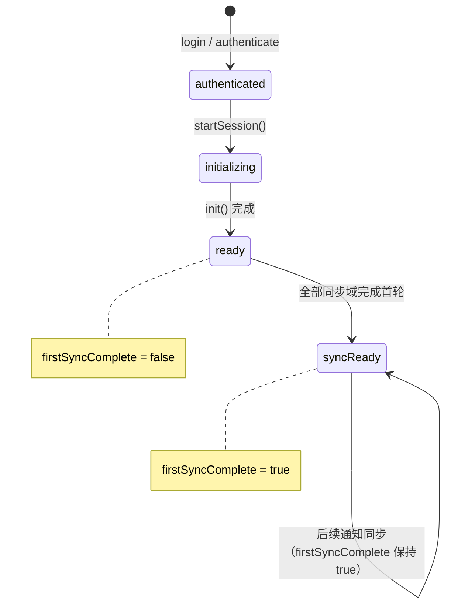

# 同步机制方案

> 主要对照：`internal/ws/connection.go`、`internal/service/`、`internal/dal/*_store.go`、`internal/appmsg/notification.go`、`frontend/src/sdk/sync-loop.ts`、`frontend/src/sdk/datagateway/`、`frontend/src/worker/sqlite.worker.ts`。
> 最后复核：2026-07-16。
> 触发更新：消息、通讯录、屏蔽列表、免打扰或会话的 `get_*` / `sync_*` action、通知、游标、GC 水位、DataGateway 同步循环或持久存储本地同步表变化时同步更新。
> 入口关系：上级索引见 [`README.md`](README.md)；服务端 action 和 HTTP 接口见 [`接口总览.md`](接口总览.md)，SDK 对外 API 见 [`frontend/sdk接口说明.md`](frontend/sdk接口说明.md)，本文集中描述跨消息、通讯录、屏蔽列表、免打扰和会话的同步机制。

## 目录

- [1. 定位](#1-定位)
- [2. 总原则](#2-总原则)
- [3. 领域对照](#3-领域对照)
- [4. 服务端实现约定](#4-服务端实现约定)
- [5. SDK 执行模型](#5-sdk-执行模型)
- [6. 持久存储本地副本](#6-持久存储本地副本)
- [7. 过旧游标与重建](#7-过旧游标与重建)
- [8. 新增同步域清单](#8-新增同步域清单)
- [9. 测试入口](#9-测试入口)
- [10. 维护边界](#10-维护边界)

## 1. 定位

本文是 Yimsg 同步机制的共同契约，覆盖五类需要客户端追平的主数据：消息、通讯录、屏蔽列表、会话免打扰和会话列表。

本文负责说明：

1. 服务端如何通过轻量通知提示变化。
2. 客户端如何通过分页读取和游标增量追平数据。
3. 服务端 DAL / Service / WebSocket action 的同步分工。
4. SDK instant / 持久存储 DataGateway 的执行差异。
5. tombstone、GC 水位和 `seq_too_old` 的统一处理。

本文不替代字段级文档：完整 action、请求和响应字段仍以 [`接口总览.md`](接口总览.md) 为准；表结构仍以 [`server/db/schema字段对照.md`](server/db/schema字段对照.md) 与各领域数据库文档为准；SDK 业务方 API 仍以 [`frontend/sdk接口说明.md`](frontend/sdk接口说明.md) 为准。

## 2. 总原则

### 2.1 轻通知 + 主动拉取

WebSocket Notification 只表达“某类数据有变化”，不承载完整快照。客户端收到通知后按当前运行模式选择分页重读、游标增量同步或单点检查。

服务端通知和 SDK 公开事件在同步域内尽量同名，以减少概念切换；同名只表示同步域一致，通知层仍是轻量信号，SDK 事件层才是同步完成后的业务事件。

| 通知 | 触发同步域 | 客户端公开事件 |
|---|---|---|
| `messages:received`（携带 `target` + `msg_id`） | 消息、会话预览 | `messages:received`（重绘信号；`messages` 为按累积的通知 `msg_id` 批量取到的内容，供 `onMessages`） |
| `contacts:updated` | 通讯录、待处理请求 | `contacts:updated` |
| `blocklist:updated` | 屏蔽列表 | `blocklist:updated` |
| `conversations:mutelist-updated` | 会话免打扰 | `conversations:mutelist-updated` |
| `conversations:clearunread` | 某会话未读被清除 | `conversations:clearunread`（在窗口则 `getConversations({targets})` 定向刷新，不整列表重拉） |
| `conversations:delete` | 某会话被删除 | `conversations:delete`（定向拉取，返回空=已删则移除往上补齐） |
| `messages:delete` | 某消息被删除 | `messages:deleted`（就地删除往上补齐不拉取） |

### 2.2 分页读取 + 游标增量

主数据按两条相互独立的通道建模：**展示通道**（`get_*`）与**同步通道**（`sync_*`）。

- **展示通道（`get_*`）统一使用不透明 keyset 游标**：请求带 `PageQuery{cursor, direction, limit, around}`，响应带 `PageInfo{start_cursor, end_cursor, has_more_backward, has_more_forward, total}`。游标由服务端按各列表展示序的 keyset 字段编码（base64url 紧凑字符串），对客户端不透明、原样透传。`direction` 始终以屏幕方向为准：`FORWARD` 向尾/向下（追加，续翻用上一页 `end_cursor`），`BACKWARD` 向头/向上（前插，续翻用上一页 `start_cursor`）；空游标 + 方向表示从对应端起点开始；`around` 以锚点居中定位（messages 传 `msg_id`，contacts 传排序首字母）。keyset 游标抗实时重排与中途增删漂移，**彻底取代 offset 与 before_seq/after_seq/around_seq**。各列表展示序：消息 旧→新；会话/屏蔽/免打扰 新→旧；联系人按 `sort_key`（pending 按 `seq` 倒序）；群成员 `role` 倒序、`uid` 升序。
- **同步通道（`sync_*`）继续使用 `seq` 单调游标**：按单调游标读取变化，包含删除或关闭语义。所有 `Sync*Response` 都返回 `has_more`（是否还有更多增量，达到 `limit` 时为 `true`）与 `cursor_seq`（下一次增量同步应使用的 `last_seq`，等于本批最大 `seq`，空批为 `0`）；客户端据此驱动同步循环，不再靠条目数推断或自行从条目取游标。两条通道职责分明：展示通道服务有界消息流窗口呈现，同步通道服务本地副本追平 + tombstone/GC，互不耦合。
- UI 收到 SDK 事件后按当前页重新读取，不把事件载荷当作全量集合。
- SDK 和服务端都会裁剪 `limit`，调用方不能依赖超大 `limit` 拉全量。服务端按 `limit+1` 探测 `has_more` 后裁剪到 `limit`。

消息是状态化增量同步：`sync_messages(last_seq)` 按用户消息 `seq` 追平新消息、撤回事件和 `status=0xff` 删除 tombstone。持久 SDK 收到消息删除 tombstone 后直接删除本地 `messages` 行并推进游标。

### 2.3 JS 堆不保存无界集合

instant 模式不保存消息本地副本，也不维护消息同步游标：收到 `messages:received` 只按累积的通知 `msg_id` 批量直读内容供 `onMessages`，其余读取一律由 UI 直连后端分页拉取。持久存储模式把同步副本落到本地持久化能力，仍维护 `messages.seq` 等同步游标。持久存储本地表是磁盘副本，不等于 JS 堆缓存，所有公开读取仍必须分页化。

### 2.4 认证与通知时序

`login` / `authenticate` 成功时，服务端必须先完成在线注册，再返回认证成功响应。这样认证后紧随的 `messages:received`、`contacts:updated` 等通知不会在客户端建立同步入口前丢失。

## 3. 领域对照

| 领域 | 分页读取 | 增量同步 | 游标 | 删除 / 关闭语义 | 通知 | 主要本地表 |
|---|---|---|---|---|---|---|
| 消息 | `get_messages` | `sync_messages` | `messages.seq`，来自 `messages_version` | `status=0xff` tombstone；持久本地不保存删除行；撤回通过 recall event 回写原消息 | `messages:received` | `messages` |
| 通讯录 | `get_contacts` | `sync_contacts` | `contacts.seq` | `status=0xff` tombstone；持久本地不保存删除行 | `contacts:updated` | `contacts` |
| 屏蔽列表 | `get_blocklist` | `sync_blocklist` | `blocklist.seq` | `status=0xff` tombstone；持久本地不保存删除行 | `blocklist:updated` | `blocklist` |
| 免打扰 | `get_mutelist` | `sync_mutelist` | `mutelist.seq` | `status=0xff` tombstone 表示关闭；持久本地删除该行 | `conversations:mutelist-updated` | `mutelist` |
| 会话 | `get_conversations` | `sync_conversations` | `conversations.seq`，来自 `messages_version`；协议游标仍为 `last_seq` | `status=0xff` tombstone；持久本地不保存删除行；Conversation GC 像 Message GC 一样按 `seq` 窗口直接删除会话行 | `messages:received`（消息同步后追平会话）；`conversations:delete` 就地删 | `conversations` |
| 组织关系（tags） | `get_tags`（按节点展开） | `sync_tags` | `tags.seq`，来自 `org_version.max_seq`，**按 org_id 一游标**（本地 meta 键 `org_seq:<orgId>`） | `status=0xff` tombstone；持久本地不保存删除行；Org GC 清理后推进 `org_version.gc_safe_seq` | `org:updated`（仅携带 org_id，taskqueue 全员扇出、按组织合并） | `tags` |

### 3.1 消息

消息收件箱按用户 `uid` 分片，每个用户的 `messages.seq` 由 `messages_version.max_seq` 分配并单调递增。`get_messages` 只返回当前有效消息；`sync_messages(last_seq)` 返回有效消息、recall event 和消息删除 tombstone。客户端按 `seq` 推进游标，并在 SDK 层折叠撤回事件或删除本地行。

撤回不会额外暴露一条 UI 可见消息。撤回走 `send_message` + `MESSAGE_TYPE_RECALL` + `RecallBody`：服务端覆盖原消息为撤回占位并写入一条 recall 事件消息；`get_messages` 和 `sync_messages` 返回 `MESSAGE_TYPE_RECALL` 消息，SDK 把它归一化为原消息的撤回占位更新，并继续用该事件推进会话预览。

### 3.2 通讯录

服务端联系人表同时承担当前快照和变更流：好友、群收藏、待处理请求和删除状态都保留在 `contacts` 表中。`get_contacts` 按展示通道 `PageQuery` keyset 游标 + `status/targets` 读取（friend/默认按 `sort_key` 升序、pending 按 `seq` 倒序）；`sync_contacts` 才按 `last_seq/limit` 返回变更，避免把展示分页和增量同步混用。持久存储本地 `contacts` 表只保留有效行，收到 `status=0xff` tombstone 时删除对应本地行并推进 `contact_seq`。

`sort_key`/`search_text` 投影变化会 bump `seq`，因此无备注好友昵称或群名变化、或有备注联系人昵称/群名变化（影响 search_text）后，联系人分页和搜索都能通过增量同步收敛。

### 3.3 屏蔽列表

屏蔽列表管理页和详情页都通过 `get_blocklist` 读取当前生效分页，传入 `uid` 或 `uids` 即可完成单个 / 多个对象状态查询。`sync_blocklist` 返回 `last_seq` 之后的屏蔽和解除屏蔽记录，解除屏蔽以 tombstone 保留到 GC 清理；GC 清理后推进 `blocklist_version.gc_safe_seq`，过旧游标返回 `seq_too_old`。

### 3.4 免打扰

免打扰与屏蔽列表保持同类模型。`get_mutelist` 读取当前 `status=1` 的管理页分页，传入 `to_uid` / `group_id` 或 `to_uids` / `group_ids` 即可完成单个 / 多个对象状态查询；`sync_mutelist` 返回开启和关闭 tombstone。持久存储本地表只保存当前开启免打扰的数据，`status=0xff` 用于推进游标并删除本地行；GC 清理后推进 `mutelist_version.gc_safe_seq`，过旧游标返回 `seq_too_old`。

### 3.5 会话

会话列表是消息表的物化视图，使用 `messages_version` 分配的统一 `seq` 作为同步游标，不额外分配会话专用 seq。后端 `conversations.seq` 保存最后一条消息或会话删除事件的定位，协议仍通过 `last_seq` 传递游标和响应项序列。`get_conversations` 返回分页和分页项 `unread_count`；`get_unread_count` 返回全局未读总数；`sync_conversations` 通过 `last_seq` 追平服务端仍保留的会话排序、预览、状态和未读变化。

Conversation GC 与 Message GC 同类：按每个用户的 `conversations.seq` 保留窗口直接删除窗口外会话行，共用 `messages_version`，不维护 `conversation_version`，也不对过旧 `last_seq` 返回 `seq_too_old`。长时间未同步的客户端可能错过已被 GC 的消息或会话变化，多端会话列表允许短期或长期不一致；客户端只继续同步服务端当前未删除、仍保留的数据。

`clear_unread` 只清零会话未读、不动 seq；会话行已被 GC（缺失）时**不重建**——红点由 `conversations:clearunread` 事件在前端数据窗口内就地清除，后台会话表等下一条消息到来时自然重建追平。SDK 收到事件后只在数据窗口内就地把该会话未读清零、**不触发拉取**（不在窗口则忽略）。由于 clear_unread 不 bump seq，未读清除不依赖增量同步传播。`delete_conversation` / `delete_message` 同理：推送 `conversations:delete` / `messages:delete`，SDK 删本地副本并就地从数据窗口删除（剩余条目往上补齐防抖动），**不触发拉取**；不在窗口则忽略，靠后续全量刷新追平。消息同步后 SDK 也会继续追平会话表，使消息预览和未读状态保持一致。

### 3.6 组织关系（tags）

组织架构域拆成两部分：`org_info`（组织字典）/ `tag_info`（tag 字典）无 seq/status，不参与同步，
走与 `get_group_infos` 同构的按需查询 + `DisplayInfoCache` TTL 缓存（`get_org_infos` / `get_tag_infos`）；
唯一的同步域是 `tags` 关系表（按 `org_id` 分片，`seq` 来自 `org_version.max_seq`）。
成员资格是通讯录组织行（走 `sync_contacts`）；`tags` 读取双轨：persistent 模式
`sync_tags` 维护本地副本后本地展开（秒开、离线可用），instant 模式与副本未就绪时走在线 `get_tags`。
`get_tags` / `sync_tags` 的条目只有 `child_id`/`child_type` 等结构字段，不内嵌子项名字，
展示名由客户端另发 `get_tag_infos` / `get_user_infos` 按需补齐。
`org:updated` 是广播型轻通知（全体在线成员、taskqueue 扇出、队列内按组织合并），只携带 `org_id`；
`rebuild=false && last_seq < gc_safe_seq` 返回 `seq_too_old`，客户端清空该组织本地副本与游标后全量重建。
展示排序（`rank, sort_key, child_type, child_id` 索引）与同步游标（`seq` 索引）正交。详见 [`server/组织架构方案.md`](server/组织架构方案.md)。

## 4. 服务端实现约定

### 4.1 WebSocket action

所有 action 都从已认证连接读取 `uid`，客户端不传当前用户 ID。展示通道 `get_*` 用 `PageQuery{cursor, direction, limit, around}`，响应带 `PageInfo`；同步通道 `sync_*` 用 `last_seq` / `limit` / `rebuild`，响应统一带 `has_more` / `cursor_seq`，下一页用上一页的 `cursor_seq` 作为 `last_seq` 继续。响应字段以 [`接口总览.md`](接口总览.md) 的 action 表为准。

### 4.2 DAL 分工

DAL 负责稳定的数据模型，Service 只保留领域校验、响应组装和通知语义：

| DAL 能力 | 用途 |
|---|---|
| `List` / `ListFiltered` / `ListPage` | 当前分页读取 |
| `Sync` / `SyncList` | 游标之后的变化读取 |
| `GetVersion` | 读取 GC 安全水位或当前最大 seq |
| `Purge` | 物理清理 tombstone，并在需要时推进水位 |
| `Count` / `TotalUnreadCount` | 分别支撑有界消息流窗口和 `get_unread_count` 导航红点 |

### 4.3 写路径

写路径遵守三条规则：

1. 修改同步域状态时递增该域的单调游标。
2. 删除、解除或关闭状态先写 tombstone，不直接丢弃客户端需要看到的变化。
3. 写成功后只推轻量通知；复杂数据仍由客户端主动拉取。

消息和会话也遵循状态化同步：删除先写 `status=0xff` tombstone 并推进 `messages_version.max_seq`，GC 只物理清理保留窗口外数据，不推进 `gc_safe_seq`。

### 4.4 分片与事务

同步数据按既有路由键落分片：消息、通讯录、屏蔽列表、免打扰和会话都跟随 `uid` 分片。跨用户或跨群的聚合在应用层完成，不引入 JOIN，也不要求跨分片事务。双向联系人写入可能跨两个 uid 分片，业务层容忍短暂不对称状态。

## 5. SDK 执行模型

### 5.1 入口

SDK 内部同步入口集中在以下组件：

| 组件 | 职责 |
|---|---|
| `ClientEventBridge` | 接收原始通知，交给 DataGateway，并把结果封装成只读公开事件 |
| `BaseDataGateway.handleNotification()` | 将通知归类成同步任务 |
| `BaseDataGateway.enqueue()` | 合并同类任务，防止高频通知造成无界 Promise 队列 |
| `runIncrementalSync()` / `PersistentDataGateway` 各域同步循环 | 按服务端 `has_more` 决定是否续拉、用 `cursor_seq` 推进游标；持久表同步统一处理 `seq_too_old` 后的清表和从 0 重同步 |
| `InstantDataGateway` | 服务端分页直读；不维护消息游标，消息通知按累积的 `msg_id` 批量直读内容 + 派发重绘信号（行为继承自 `BaseDataGateway` 基线默认） |
| `PersistentDataGateway` | 本地持久同步副本 + 本地分页读取 |

### 5.2 通知处理

通知处理流程固定为：

1. `WsTransport.onNotification` 收到服务端通知。
2. `ClientEventBridge.handleNotification()` 转给当前 DataGateway。
3. DataGateway 按通知类型入队；instant 模式只执行 `get_*` 直读或失效派发，持久存储模式通过 `runIncrementalSync()` 串行追平。
4. instant 模式不维护消息游标，消息通知按累积的 `msg_id` 批量直读内容并派发重绘信号；其余域按直读结果失效派发。持久存储模式每批同步后推进游标并落地或派发事件。
5. `YimsgClient` 发出只读公开事件。
6. UI 按当前可见页重新读取。

### 5.3 instant 模式

instant 模式不维护本地完整副本，不调用任何 `sync_*` action，**也不发射任何 `session:sync` 事件**：instant 模式没有"同步"这个概念，处理通知只是 `get_*` 直读或失效派发，不应显示"同步中"，也不应触发 `session:sync` 驱动的重渲染。`session:sync` 是持久同步副本追平的进度信号，只由持久存储模式发射（见 §5.4 / §5.5.2）。

- 消息通知不维护游标、不扫描会话：把同一调度窗口内各通知的 `msg_id` 累积去重后一次性调 `get_messages(msg_ids=[...])` 批量读内容供 `onMessages`（角标/响铃），并始终派发 `messages:received` 重绘信号（即便取不到内容，如撤回/删除）；UI 收到信号后用 `get_conversations`/`get_messages` 重绘，新消息/撤回/删除均按服务端最新态反映。
- 联系人通知只桥接为 `contacts:updated` 失效事件；待处理红点、联系人长列表和详情状态均重新调用 `get_contacts` / `get_contact_count(status=CONTACT_STATUS_PENDING_INCOMING)`（红点只统计待我处理的请求，不含我自己发出的 `CONTACT_STATUS_PENDING_OUTGOING`），详情状态通过 `get_contacts(friend_uid/group_id, limit=1)` 过滤读取。
- 屏蔽列表和免打扰通知默认桥接为轻量失效事件；需要展示时调用带过滤条件的分页接口读取单个或多个对象状态。
- 会话分页直接读服务端，`messages:received` 触发 UI 重读当前页；`conversations:clearunread` / `conversations:delete` 只就地清红点 / 删会话，不重读。

### 5.4 持久存储模式

持久存储模式打开本地库后即可对 UI 提供本地已有副本，初始化后的后台任务和后续通知会继续追平本地副本：

- `messages` 追加或覆盖；撤回事件回写原消息；收到 `status=0xff` 后删除本地行。
- `contacts`、`blocklist`、`conversations`、`mutelist`、`tags` 收到 `status=0xff` 后删除本地行；删除事件仍推进对应 `meta` 游标。通讯录组织行 tombstone（离职）额外联动清空该组织本地 `tags` 副本与游标。`org_info`/`tag_info` 不进本地副本，走通用 `displayinfo` 缓存表（`org`/`tag` scope）。
- 管理列表、会话列表、联系人列表和详情页单个 / 多个状态查询优先读本地表。
- 表级游标保存在 `meta`，包括 `msg_seq`、`contact_seq`、`conversation_seq`、`blocklist_seq`、`mutelist_seq`；组织按 org 一游标，键为 `org_seq:<orgId>`。游标读取不在 JS 堆维护镜像缓存，每次推进 / 使用前都直接查询 `meta` 表当前值，与组织游标 `orgCursor`/`saveOrgCursor` 同一模式；UIKit 设置页「清除数据」删库重建后，`meta` 为空表，所有游标下一次读取即为 0，无需额外清缓存步骤。

#### 5.4.1 sync-only persistence（本地持久库只允许 sync 链路写入）

本地持久数据库只是服务端状态的缓存，不是业务 / action / UI / 乐观更新的状态源。任何持久化都必须经过 sync 链路：

- 禁止 action 成功后直接写本地表（如 `sendMessage` 后写 `conversations`、`mute`/`block`/`addFriend` 后改本地表）、禁止 UI 直接改持久表、禁止 action 与 sync 双写同一张表、禁止"先本地写后同步覆盖"等乐观持久化。
- action 成功后只允许：emit 事件、更新内存态、触发 sync。UI 临时展示只用内存态或 action 返回值。

#### 5.4.2 统一三段式同步结构

每个 domain 统一三段式：

```
fullSyncDomain(spec)  →  syncDomainPage(spec)  →  spec.applyPage（=applyXxxSyncBatch）
```

`messages / contacts / blocklist / mutelist` 四个域共用同一套通用引擎 `fullSyncDomain` / `syncDomainPage`，各域差异通过 `SyncDomainSpec` 以函数参数注入：

- `SyncDomainSpec`：描述单个域的 `domain` / 游标键 / 表名、`fetchPage`（拉一页并映射为 `SyncPage`，携带服务端 `has_more` / `cursor_seq`，`seq_too_old` 以抛 `ServerError` 表达）、`applyPage`（落库的唯一写入点，撤回折叠等**特殊逻辑在此实现**并回传可见条目）、`emitBatch` / `emitDone`（UI 事件）。游标完全由服务端 `cursor_seq` 推进，spec 不再提供 `getCursor`。
- `fullSyncDomain(spec, emit?)`：用 `runPersistentTableSync` 按服务端 `has_more` 循环分页、管理 rebuild/reset 与游标生命周期，结束后按 spec 派发 UI 事件；不拼 SQL、不写业务表、不解析网络协议。
- `syncDomainPage(spec, params)`：计算 rebuild → `fetchPage` 拉一页 → `seq_too_old` 清表重建 → `applyPage` 落库 → 用响应 `cursor_seq` 推进 seq 游标 / 写 sync meta → 按 `has_more` 维护 rebuild 标记；不 emit UI 事件、不跨 domain 写表。返回原始条目、可见条目（消息为撤回折叠后的可见消息）以及 `has_more` / `cursor_seq`。
- `applyXxxSyncBatch`：对应本地表的**唯一**写入点，只执行本地 SQL；不发网络请求、不 emit 事件、不写 meta / 游标、不写其它 domain 表。

消息域没有 `rebuild` / `seq_too_old` 语义（请求不带 `rebuild` 字段、服务端永不返回 `seq_too_old`），但仍走同一套引擎：`rebuild` 标记对其无副作用，逻辑因此完全统一、无需特判。`conversations` 域条目形状不同（游标是 `last_seq`、无 tombstone 重建），单独使用 `runIncrementalSync`，三段式落为 `fullSyncConversationsInternal → syncConversations → applyConversationSyncBatch`；`syncConversations` 同样用响应 `cursor_seq` 推进 `conversation_seq`，`runIncrementalSync` 按 `has_more` 决定是否续拉。

#### 5.4.3 domain 边界（强制）

各表只由对应 `applyXxxSyncBatch` 写入：`messages`↔`applyMessageSyncBatch`、`conversations`↔`applyConversationSyncBatch`、`contacts`↔`applyContactSyncBatch`、`blocklist`↔`applyBlocklistSyncBatch`、`mutelist`↔`applyMutelistSyncBatch`。`syncMessages` 只写 `messages` 与 `msg_seq`，**不写 `conversations`、不级联会话同步**；会话只由 `syncConversations` 维护。各 sync 只推进自己的 seq meta（`msg_seq` / `conversation_seq` / `contact_seq` / `blocklist_seq` / `mutelist_seq`），不得跨 domain 写表或隐式同步其它 domain。

### 5.5 同步就绪辅助状态

持久存储模式在 `startSession()` → `init()` 之后会启动后台首轮同步（`runBackgroundSync`），按 messages → conversations → contacts → blocklist → mutelist 的顺序逐域追平本地副本。首轮同步完成前，本地数据可能为空或不完整，UI 需要一种轻量方式判断“数据是否已就绪”。

SDK 提供两层机制，不改变轻通知模型：

#### 5.5.1 `SessionSnapshot.syncReadiness`（只读快照）

`getSessionSnapshot()` 返回的 `SessionSnapshot` 中包含 `syncReadiness: SyncReadiness` 字段：

```ts
interface SyncReadiness {
  /** 各同步域最近一次同步状态。首次同步前对应域为 undefined。 */
  readonly domains: Partial<Record<SyncDomain, SyncStatus>>;
  /** 所有同步域是否至少完成过一次首轮同步。 */
  readonly firstSyncComplete: boolean;
}
```

| 模式 | `firstSyncComplete` 行为 |
|------|--------------------------|
| instant | 恒为 `true`（无后台同步，数据按需直读服务端） |
| persistent | 初始 `false`；全部同步域（messages / conversations / contacts / blocklist / mutelist）至少完成过一次（status 为 success 或 failed）后变为 `true`，之后不再回退 |

调用方可以在渲染循环中轮询 `getSessionSnapshot().syncReadiness.firstSyncComplete`，或结合 `session:state-changed` 事件在 `sessionState === 'ready'` 后检查。



#### 5.5.2 `session:sync` 事件组合约定

不想轮询快照的调用方，可通过组合 `session:sync` 事件自行判断首轮同步完成：

1. 监听 `session:sync` 事件，记录每个 `domain` 的 `status`。
2. 当 messages / conversations / contacts / blocklist / mutelist 五个域都至少出现过一次 `success` 或 `failed` 时，首轮同步完成。
3. 之后收到的 `session:sync` 均属于后续通知触发的增量同步，不再改变首轮完成判断。

注意：`session:sync` 事件**只在持久存储模式发射**（包括初始化后台同步与后续通知触发的增量同步）；instant 模式不做同步、不发射任何 `session:sync`，因此该事件组合判断只适用于持久存储模式。持久存储模式下，通知触发的同步也会发射 `session:sync`，调用方需要在首轮完成后停止累积判断，避免把后续同步误认为首轮未完成。

#### 5.5.3 典型用法

```ts
// 方式一：轮询快照
const snapshot = client.getSessionSnapshot();
if (snapshot.sessionState === 'ready' && snapshot.syncReadiness.firstSyncComplete) {
  // 首轮同步完成，可以开始渲染数据
}

// 方式二：事件驱动
let firstSyncDone = false;
const domainsSeen = new Set<string>();
client.on('session:sync', (event) => {
  if (firstSyncDone) return;
  if (event.status === 'success' || event.status === 'failed') {
    domainsSeen.add(event.domain);
  }
  const ALL = ['messages', 'conversations', 'contacts', 'blocklist', 'mutelist'];
  if (ALL.every(d => domainsSeen.has(d))) {
    firstSyncDone = true;
    // 首轮同步完成
  }
});
```

## 6. 持久存储本地副本

持久存储本地库由 SDK 内部维护，按“用户 + 实例”隔离。各同步域与本地表对应关系见本文 [领域对照](#3-领域对照)。

本地副本遵守：

- `schema_version` 不匹配时直接重建本地表；研发阶段不写迁移或旧格式兼容逻辑。
- 磁盘表只保存当前有效同步副本，不保存软删除数据；删除事件仅用于推进游标并移除本地行。
- 本地分页读取只返回当前生效状态。
- `displayinfo` 是用户和群统一显示信息缓存，不参与主数据同步游标。

## 7. 过旧游标与重建

`seq_too_old` 表示客户端游标早于服务端 GC 安全水位，继续增量同步可能漏掉已物理清理的 tombstone。该机制只用于需要全量一致的 tombstone 同步域：通讯录、屏蔽列表、免打扰。

持久存储模式的恢复路径仍然只使用同步接口：本地游标为 0 时，SDK 直接以 `last_seq=0, rebuild=true` 执行同一个 `sync_*`，并在重建追平前每一批都保持 `rebuild=true`；本地游标非 0 时执行普通增量同步，若收到 `ok=false, error_code=SEQ_TOO_OLD, error=seq_too_old`，则清空对应本地表和 `meta` 游标，把该域内存游标重置为 0，再回到前述重建路径。服务端只在 `rebuild=false && last_seq < gc_safe_seq` 时拒绝过旧游标，不再对 `last_seq=0` 特判放行；当服务端已经存在 GC 安全水位时，`last_seq=0, rebuild=false` 无法证明客户端本地表为空，直接做普通增量同步可能漏掉已被 GC 的 tombstone，因此客户端不会发送这种普通增量请求。`rebuild=true` 表示客户端已经丢弃本地域，允许按小批量继续读取仍保留的当前有效行，即使某一批返回的最后 `seq` 仍小于 `gc_safe_seq`，下一批携带同一个 `rebuild=true` 也不会再次被判定为过旧。因此重建不会因为单批同步量较小而永远 `seq_too_old`。已被 GC 的 tombstone 不需要回放，因为本地表已经清空。`get_*` 只作为公开分页读取接口，不参与持久同步副本修复。

| 领域 | 触发条件 | 客户端处理 |
|---|---|---|
| 通讯录 | `rebuild=false && last_seq < contacts_version.gc_safe_seq` | 持久存储清空 `contacts` 和 `contact_seq`，再 `sync_contacts(last_seq=0, rebuild=true)` 并保持 `rebuild=true` 直到该域追平；instant 重读当前需要的联系人分页或待处理分页 |
| 屏蔽列表 | `rebuild=false && last_seq < blocklist_version.gc_safe_seq` | 持久存储清空 `blocklist` 和 `blocklist_seq`，再 `sync_blocklist(last_seq=0, rebuild=true)` 并保持 `rebuild=true` 直到该域追平；instant 以 `get_blocklist` 当前页或过滤条件重读可见状态 |
| 免打扰 | `rebuild=false && last_seq < mutelist_version.gc_safe_seq` | 持久存储清空 `mutelist` 和 `mutelist_seq`，再 `sync_mutelist(last_seq=0, rebuild=true)` 并保持 `rebuild=true` 直到该域追平；instant 以 `get_mutelist` 当前页或过滤条件重读可见状态 |
| 消息 | Message GC 清理旧消息页；`messages_version.gc_safe_seq` 固定为 0 | 客户端只继续同步较新的消息；历史消息页以服务端保留范围为准，已被 GC 的消息变化允许丢失 |
| 会话 | Conversation GC 清理旧会话行；共用 `messages_version` 且不推进 `gc_safe_seq` | 客户端只继续同步较新的会话变化；已被 GC 的会话变化允许丢失，持久存储不因历史缺口清表重建 |

重建不是旧数据兼容逻辑，而是当前同步协议的恢复路径：丢弃本地同步副本，再用同一套 `sync_*` 逻辑按服务端当前保留状态重新建立本地域和游标。

## 8. 新增同步域清单

新增一个需要多端或离线追平的同步域时，必须同时确认：

1. 是否需要 `get_*` 分页读取、`sync_*` 游标同步和单点 `check`。
2. 游标来源是独立 `seq`、消息 `seq`，还是已有版本表。
3. 删除或关闭状态是否需要 tombstone，以及 tombstone 的 GC 水位如何表达。
4. WebSocket 通知类型、触发矩阵和客户端公开事件。
5. instant 模式只保留哪些运行态游标。
6. 持久存储模式是否需要本地表、索引、`meta` 游标和重建逻辑。
7. `client_config.batch_max_limit` 与 SDK 默认批大小是否覆盖该同步域。
8. DAL、Service、WebSocket action、SDK DataGateway、文档和测试是否同步更新。

## 9. 测试入口

| 层级 | 重点 |
|---|---|
| DAL 单测 | `Sync` / `List` / `Purge`、seq 推进、tombstone、GC 水位 |
| Service 单测 | 写路径通知、领域校验、`seq_too_old` 响应 |
| 后端 E2E | 多端通知、离线后同步追平、屏蔽列表 / 通讯录 / 会话互相影响 |
| 前端 unit | `runIncrementalSync()`、DataGateway 队列合并、只读事件、持久存储本地表读写 |
| SDK 集成 | instant / 持久存储下消息、联系人、屏蔽列表、免打扰和会话同步一致性 |
| UI 测试 | 收到轻量事件后分页重读、有界消息流窗口和红点刷新 |

完整测试分层见 [`测试方案.md`](测试方案.md)。只改本文档和入口链接时可只运行文档一致性校验；修改实现时仍以 [`../tools/run_all_tests.sh`](../tools/run_all_tests.sh) 为最终校验。

## 10. 维护边界

- 本文维护跨领域同步机制和共同规则。
- [`接口总览.md`](接口总览.md) 维护 action、请求 / 响应字段和 SDK 映射。
- [`server/db/通讯录数据库设计.md`](server/db/通讯录数据库设计.md)、[`server/db/消息数据库设计.md`](server/db/消息数据库设计.md)、[`server/关系与会话偏好方案.md`](server/关系与会话偏好方案.md) 维护领域特有字段、排序、业务行为和 GC 细节。
- [`frontend/sdk设计方案.md`](frontend/sdk设计方案.md) 维护 SDK 内部组件边界、生命周期、只读契约和内存估算。
- [`frontend/sdk接口说明.md`](frontend/sdk接口说明.md) 维护业务方可见 API 和调用约束。

如果同一条同步规则同时影响服务端和前端，先更新本文，再在领域文档中保留指向本文的简要说明。
