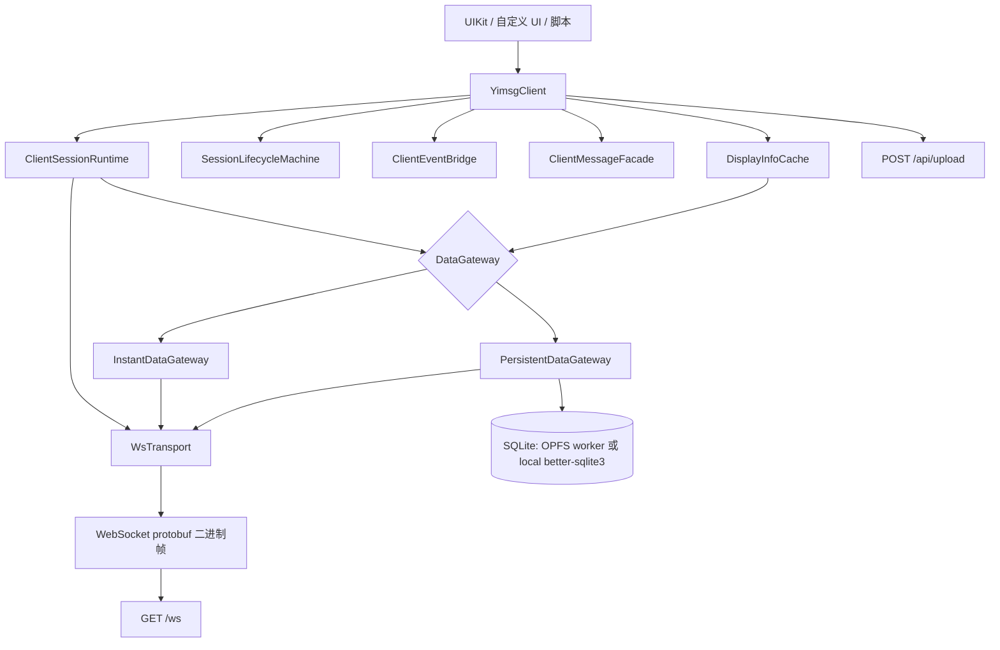
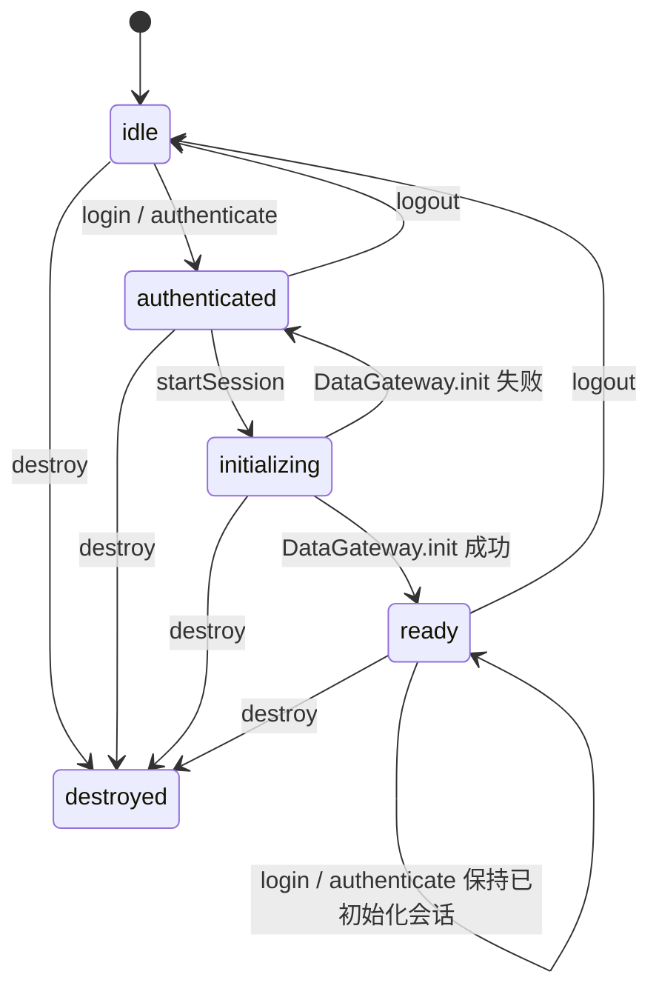
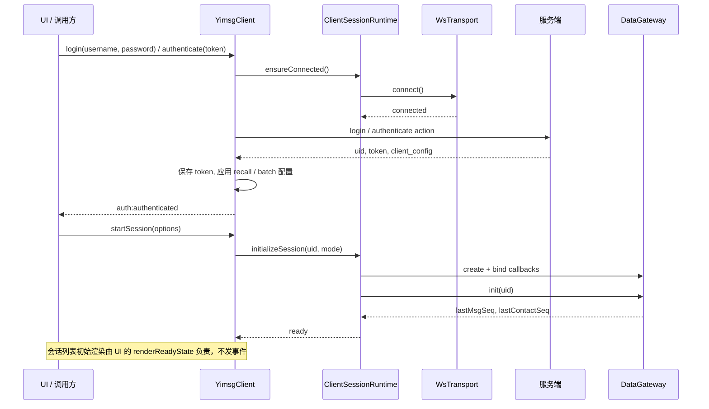
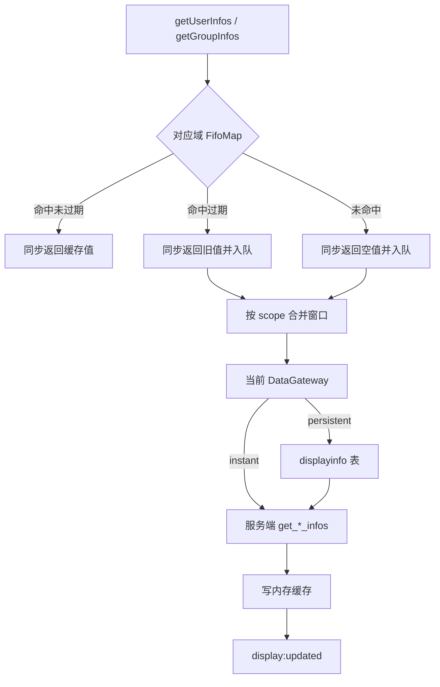

# SDK 设计方案

> 主要对照：`packages/sdk/src/index.ts`、`packages/sdk/src/types.ts`、`packages/sdk/src/client.ts`、`packages/sdk/src/internal/`、`packages/sdk/src/datagateway/`、`packages/sdk/src/state/`、`packages/sdk/src/transport/`、`protocol/generated/typescript/yimsg.ts`、`packages/sdk/src/worker/sqlite.worker.ts`、`protocol/yimsg.proto`。
> 最后复核：2026-07-16。
> 触发更新：SDK 公开方法、公开类型、事件、`ClientOptions`、会话生命周期、DataGateway 接口、同步域、本地 SQLite schema、DisplayInfoCache、WebSocket type/action、HTTP 上传 / 媒体接口或通知类型变化时同步更新。
> 入口关系：上级索引见 [`README.md`](../README.md)；调用者 API 见 [`sdk接口说明.md`](sdk接口说明.md)；DataGateway 接口摘要见 [`DataGateway接口.md`](DataGateway接口.md)；DisplayInfoCache 接口摘要见 [`DisplayInfoCache接口.md`](DisplayInfoCache接口.md)；同步契约见 [`../../同步机制方案.md`](../../../docs/architecture/同步机制方案.md)；UIKit / SDK / 后端接口总览见 [`../../protocol/接口总览.md`](../../../protocol/docs/接口总览.md)。

本文只描述当前 `packages/sdk/src/` 的实现事实，协议、接口、字段、事件和本地表均以当前代码为准。

## 1. 当前结论

当前 SDK 是 UI 无关的 IM 客户端库，公开入口收敛在 `packages/sdk/src/index.ts`。`YimsgClient` 是唯一公开类门面，调用方通过它完成认证、会话初始化、消息、会话、联系人、群、偏好、展示资料、上传和事件订阅。类型、错误类、常量和纯工具函数通过 `index.ts` 重导出。

SDK 的核心设计成立：公开层不暴露 WebSocket 帧、本地 SQLite、同步游标和内部缓存；`DataGateway` 屏蔽 instant / persistent 两种读模型；`DisplayInfoCache` 用同步返回 + 后台刷新支持列表渲染；长期内存结构都有明确上限。当前主要约束是实现复杂度集中在 `YimsgClient` 和同步链路，协议变更需要同步维护 action builder、生成物、文档和测试；persistent 模式进入 `ready` 不代表首轮后台同步结束，调用方需要使用 `syncReadiness` 或 `session:sync` 判断同步状态。

## 2. 架构边界



| 模块 | 当前职责 |
|---|---|
| `YimsgClient` | 公开门面；负责参数校验、认证流程、会话初始化入口、业务方法编排、写后缓存更新、错误包装和事件发出 |
| `ClientSessionRuntime` | 维护 transport 回调、连接复用、DataGateway 生命周期、同步就绪状态和 DataGateway 回调绑定 |
| `SessionLifecycleMachine` | 保存 `sessionState`、`connectionState`、`mode`、`currentUid`，派生认证和初始化状态 |
| `WsTransport` | 维护 WebSocket、request_id 配对、请求超时、pending 上限、心跳、断线重连和 notification 分发 |
| `generated/actions.gen.ts` | 由 protocolgen 生成的出方向 action 函数，只负责 `Type` + request/response codec + `transport.sendBinary`，不做整形 / 校验 / 归一化 |
| `server/internal/action-mappers.ts` | 出方向 action 的无状态业务工具：target 映射、分页游标、状态校验、`msg_id` 生成等请求整形（`*Request`）与响应归一化（`normalize*` / `map*`），由 client 与 DataGateway 直接复用 |
| `server/internal/codec.ts` | `MessageCodec` 类型与 `sendProtoAction` 底层发送点，被 `actions.gen.ts` 复用 |
| `DataGateway` | 统一会话、消息、联系人、屏蔽、免打扰和展示资料读取接口，隐藏 instant / persistent 差异 |
| `DisplayInfoCache` | 统一缓存用户 / 群展示资料，同步返回当前视图，后台合并加载缺失或过期 key |
| `ClientEventBridge` | 把内部消息、同步和通知回调转换为公开事件，并冻结事件载荷 |
| `ClientMessageFacade` | 处理会话 / 消息描述、引用消息、转发包加密上传和转发包下载解密 |

边界约束：

- WebSocket protobuf 二进制帧是主接口；HTTP 只用于 `POST /api/upload`、`GET /media/*` 和静态资源。
- `sync_*` action 只供 DataGateway 内部使用，不作为 `YimsgClient` 公开 API。
- SDK 不维护 UI 页面状态、选中会话、完整消息窗口或完整联系人列表；调用方通过分页和事件重新读取。
- persistent 本地库是可重建副本；schema 版本不一致时直接重建本地库，不做 migration。
- **msg_id 唯一生成点**：`src/sdk/server/internal/msgid.ts` 的 `generateMsgId()` 是全项目唯一的用户消息 `msg_id` 生成处（UUIDv7 的 base64url 编码，22 字符，使用 `crypto.getRandomValues`，禁止 `Math.random`）。`buildSendMessageRequest` 始终生成并上送 `msg_id`；msg_id 全链路是 string，禁止二进制 UUID。
- **sync-only persistence**：本地持久库只是服务端状态缓存，只允许 sync 链路写入。action 成功后只 emit 事件 / 更新内存态 / 触发 sync，禁止直接写本地表或乐观持久化。
- **统一三段式同步**：每个 domain 为 `fullSyncXxxInternal → syncXxx → applyXxxSyncBatch`。`applyXxxSyncBatch` 是对应本地表的唯一写入点（只写表，不写游标 / meta、不发请求、不 emit、不跨 domain）；`syncXxx` 负责请求服务端、调用 apply、推进自身 seq 游标与 meta；`fullSyncXxxInternal` 负责分页循环、rebuild/reset 与是否 emit。`syncMessages` 只写 `messages`，会话仅由 `syncConversations` 维护，禁止跨 domain 写表。

## 3. 生命周期

### 3.1 状态快照

`getSessionSnapshot()` 返回只读快照：

```ts
interface SessionSnapshot {
  readonly sessionState: 'idle' | 'authenticated' | 'initializing' | 'ready' | 'destroyed';
  readonly connectionState: 'disconnected' | 'connecting' | 'connected' | 'reconnecting';
  readonly mode: 'instant' | 'persistent';
  readonly currentUid: string;
  readonly isAuthenticated: boolean;
  readonly isSessionInitialized: boolean;
  readonly syncReadiness: SyncReadiness;
}
```

`syncReadiness` 由 `ClientSessionRuntime` 合并进快照：

| 模式 | `syncReadiness` |
|---|---|
| `instant` | `{ domains: {}, firstSyncComplete: true }` |
| `persistent` | `domains` 保存 `storage` 和业务同步域最近一次 `success` / `failed` 状态；`messages`、`conversations`、`contacts`、`blocklist`、`mutelist` 都至少完成一次后，`firstSyncComplete` 变为 `true` 且不回退 |

### 3.2 状态流转



连接状态独立变化：

| `connectionState` | 进入方式 |
|---|---|
| `connecting` | `ensureConnected()` 调用 `transport.connect()` |
| `connected` | WebSocket `onopen` |
| `disconnected` | 主动断开、登出、销毁或 WebSocket `onclose` |
| `reconnecting` | 非主动关闭后 `WsTransport.scheduleReconnect()` 累计连续失败达到 `reconnectNotifyThreshold` |

### 3.3 启动流程



`login()` / `authenticate()` 会在未连接时自动建连。`startSession()` 必须在认证后调用。

### 3.4 存储选择

| 参数 | 当前行为 |
|---|---|
| `storage` | 默认 `instant`；传 `persistent` 时先探测后端能力 |
| `fileSystem` | 可选 `opfs` / `local`；未传时 Node.js 优先 `local`，其他环境优先 `opfs` |
| `instanceId` | 参与 persistent DB 名，默认 `default` |
| `resetLocalData` | `false` / `undefined` 等价于 `none`；可传 `current-user` 或 `all` 在初始化前清理本地库 |

| 场景 | 结果 |
|---|---|
| 请求 `instant` | 创建 `InstantDataGateway` |
| 请求 `persistent` 且有可用后端 | 创建 `PersistentDataGateway`，DB 名为 `yimsg-{uid}__{instanceId}.db` |
| 请求 `persistent` 但无可用后端 | 自动降级为 `instant`，`SessionStartResult.degraded = true` |
| persistent 后端可用但打开或初始化失败 | `startSession()` 回到 `authenticated` 并抛 `StorageModeError(STORAGE_FAILED)` |
| `resetLocalData` 清理失败 | 错误写入 `SessionStartResult.resetLocalDataError`，初始化继续执行 |

降级到 instant 时不会执行 persistent 数据清理。

## 4. 配置

`ClientOptions` 在构造实例时生效。会话运行中没有修改配置的公开接口。

| 配置 | 默认值 | 当前用途 |
|---|---:|---|
| `wsUrl` | 浏览器按 `location` 推导；非浏览器为 `ws://localhost:8080/ws` | WebSocket 地址 |
| `uploadUrl` | `/api/upload` | HTTP 上传地址 |
| `requestTimeout` | `15000` ms | 连接等待、请求超时 |
| `reconnectInterval` | `2000` ms | 非主动断开后的重连等待 |
| `reconnectNotifyThreshold` | `3` | 连续重连尝试达到该次数才触发 `connection:reconnecting`，用于过滤瞬时网络抖动导致的 UI 闪烁提示 |
| `heartbeatInterval` | `30000` ms | 定时发送 protobuf `ping`；`<= 0` 禁用 |
| `wsFactory` | 原生 `WebSocket` | 测试或自定义运行时注入 |
| `maxPendingRequests` | `100` | WebSocket pending request 上限 |
| `cacheTtlSeconds` | `604800` | DisplayInfoCache TTL，构造后固定 |
| `cacheMaxEntries` | `10000` | DisplayInfoCache 用户、群各自有界缓存容量（两套独立池），构造后固定 |
| `profileLoadQueueMaxEntries` | `2000` | DisplayInfoCache 每个域 pending + loading 上限（用户与群独立） |
| `batchMaxLimit` | `500` | 批量接口本地上限；认证后与服务端 `client_config.batch_max_limit` 取较小值 |
| `recallWindowSeconds` | `120` | 认证前撤回窗口；认证后以后端 `client_config.recall_window_seconds` 为准 |

`login()` / `authenticate()` 会解析服务端 `client_config`。当前 SDK 只运行期应用 `recall_window_seconds` 和 `batch_max_limit`；`getClientConfig().cacheTtlSeconds` 与 `cacheMaxEntries` 始终反映构造期配置，不会被服务端配置覆盖。

## 5. 公开接口和事件

### 5.1 公开接口分组

| 能力域 | `YimsgClient` 方法 |
|---|---|
| 构造与状态 | `new YimsgClient(options)`、`getSessionSnapshot()`、`getClientConfig()`、`getBoundedCollectionStats()` |
| 事件 | `on()`、`off()`、`once()`、`listenerCount()`、`removeAllListeners()` |
| 生命周期 | `register()`、`login()`、`authenticate()`、`startSession()`、`logout()`、`destroy()` |
| 会话 | `getConversations()`、`getUnreadCount()`、`clearUnread()`、`deleteConversation()`、`describeConversation()` |
| 消息 | `sendMessage()`、`sendText()`、`sendMarkdown()`、`sendImage()`、`sendFile()`、`sendQuotedTextMessage()`、`forwardMessages()`、`getMessages()`、`recallMessage()`、`deleteMessage()`、`describeMessage()`、`describeMessageConversation()`、`validateTextMessage()` |
| 联系人 | `getContacts()`、`getContactCount(status)`、`addFriend()`、`acceptFriend()`、`rejectFriend()`、`deleteFriend()`、`updateRemark()`、`favoriteGroup()`、`unfavoriteGroup()`、`searchUser()` |
| 屏蔽 / 免打扰 | `blockUser()`、`unblockUser()`、`getBlocklist()`、`muteConversation()`、`unmuteConversation()`、`getMutelist()` |
| 群组 | `createGroup()`、`getGroupMembers()`、`updateGroupInfo()`、`addGroupMember()`、`removeGroupMember()`、`getGroupInfos()` |
| 用户 / 上传 | `getUserInfos()`、`updateUserInfo()`、`updatePassword()`、`uploadFile()` |

公开模型在 `client-pages.ts` 和 `model-mappers.ts` 中由 snake_case 服务端模型映射为 camelCase，并通过 `freezeObject()` / `freezeArray()` / `freezeMap()` 返回。

### 5.2 前置条件

| 接口类别 | 前置条件和读取路径 |
|---|---|
| `register()` / `login()` / `authenticate()` | 未连接时自动连接 |
| 写操作 | 需要认证；多数写操作不要求会话处于 `ready` |
| `getConversations()` / `getContacts()` | 需要认证且需要 `startSession()` 创建 DataGateway；正常调用方应等待 `startSession()` 返回 |
| `getMessages()` / `getContactCount(status)` | 需要认证且会话处于 `ready` |
| `getUnreadCount()` / `getBlocklist()` / `getMutelist()` | 需要认证；DataGateway 存在时走 DataGateway，否则直连服务端 |
| `getUserInfos()` / `getGroupInfos()` | 同步读取 DisplayInfoCache；无 DataGateway 时返回空展示值且不触发远端刷新 |
| `uploadFile()` | 需要认证 token，走 `fetch(uploadUrl)` |

### 5.3 事件

事件是变化信号，不是完整业务快照。

| 事件 | 载荷事实 |
|---|---|
| `session:state-changed` | `{ from, to, reason }` |
| `connection:connected` / `connection:disconnected` / `connection:reconnecting` | `{ snapshot }` |
| `auth:authenticated` | `{ uid, snapshot }` |
| `session:sync` | `{ snapshot, domain, status, cursor?, error? }` |
| `session:kicked` | `{ snapshot }` |
| `messages:received` | `{ messages, conversationKeys }`：重绘信号，`messages` 为按累积的通知 `msg_id` 批量取到的内容（供 `onMessages`，可能为空），撤回 event 折叠为目标消息占位态；UI 收到后用 `get_*` 重绘，不消费 payload |
| `conversations:clearunread` | `{ keys }`：UI 对在窗口的会话 `getConversations({ targets })` 定向拉取并更新窗口 |
| `conversations:delete` | `{ keys }`：定向拉取（返回空=已删）→ 移除并往上补齐 |
| `conversations:sent` | `{ keys }`：本端发送消息成功后触发，让该会话移动到顶部（重拉首页+滚回顶部）；会话初始渲染由 UI `renderReadyState` 负责、不发事件 |
| `messages:deleted` | `{ messageId, key }`：消息窗口就地删除并往上补齐，并对会话 `key` 定向刷新预览 |
| `contacts:updated` | `{ reason: 'notification_sync' }` |
| `blocklist:updated` | `{ snapshot, reason: 'notification' }` |
| `mutelist:updated` | `{ snapshot, reason: 'notification' }` |
| `display:updated` | `{ keys, scope }` |
| `error` | `{ error, context, snapshot }` |

`EventEmitter` 没有硬性 listener 数量上限；同一事件超过 10 个 listener 时开发期输出一次告警。

## 6. 协议与传输

### 6.1 帧格式

`packages/sdk/src/transport/frame.ts` 负责 WebSocket 二进制帧编解码。帧字段语义、`codec` 位域、CRC-8 参数和整包上限的权威说明见 [`../../protocol/README.md`](../../../protocol/docs/README.md)，本文只保留 SDK 侧差异：

- `request_id` 在 SDK 内以字符串化的 `uint64` 保存；普通请求自增，通知固定为 `0`。
- SDK 发送请求时使用 big-endian；解码响应和通知时按 codec endian bit 解析。

### 6.2 `WsTransport`

`ClientTransport` 的最小接口是 `sendBinary(typeId, body, responseCodec)`。`WsTransport` 当前负责：

- 建立 WebSocket，设置 `binaryType = 'arraybuffer'`。
- 自增 `request_id`，保存每个 pending request 的 resolve / reject / timer / response codec。
- pending 数量达到 `maxPendingRequests` 时直接拒绝新请求。
- 请求超时后删除 pending 并抛 `ConnectionError(CONNECTION_TIMEOUT)`。
- 连接关闭时拒绝全部 pending；非主动关闭立即触发 `connection:disconnected` 并按 `reconnectInterval` 重连，连续重连尝试达到 `reconnectNotifyThreshold`（默认 3 次）仍未成功才触发 `connection:reconnecting`，成功重连后计数清零。
- 按 `heartbeatInterval` 发送 `TYPE_ACTION_PING`。
- 收到 `request_id = 0` 时，调用生成的 `dispatchNotificationFrame(handler, frame)`（`generated/notifications.gen.ts`）解码并分发；默认 handler 把强类型通知压平为既有 `Notification` 记录交给 DataGateway，可用 `setNotificationHandler()` 覆盖；`ok:false` 通过 `onNotificationError` 上报，不静默吞掉。
- 收到普通响应时使用请求保存的 `responseCodec` 解码；`base.code !== ERROR_OK` 时抛 `RequestError(REQUEST_FAILED)`，`details.serverErrorCode` 保存稳定服务端错误码名称。

### 6.3 协议机械映射生成边界

`go run ./tools/cmd/protocolgen` 以 `protocol/yimsg.proto` 为唯一事实源生成两端机械映射：

- TS action 是出方向，生成 `generated/actions.gen.ts` 中 `login(transport, req)` 这类无状态函数（只负责 `Type` + request/response codec + `sendBinary`，不做校验、缓存、事件、分页规则或 `msg_id` 生成）。
- TS notification 是入方向，生成 `generated/notifications.gen.ts` 中的 `NotificationHandler` 接口（方法不可选，漏实现即编译失败）与 `dispatchNotificationFrame`。
- SDK 公开接口、`server/internal/action-mappers.ts` 的请求整形与响应归一化、DataGateway、缓存、状态机继续手写；client 与 DataGateway 直接调用 `actions.gen.ts` 并复用 `action-mappers.ts` 工具，`msg_id` 仍只在 `server/internal/msgid.ts` 唯一生成点生成。

## 7. DataGateway

### 7.1 接口

`packages/sdk/src/datagateway/interface.ts` 定义当前 DataGateway 接口。`sync_*` 方法是内部 protected 能力，不暴露给 `YimsgClient` 调用方。

| 类别 | 方法 |
|---|---|
| 生命周期 | `init(uid)`、`clear()` |
| 会话 / 消息 | `get_conversations()`、`get_unread_count()`、`get_messages()` |
| 联系人 | `get_contacts()`、`get_contact_count(status)` |
| 偏好 | `get_blocklist()`、`get_mutelist()` |
| 展示资料 | `get_user_infos()`、`get_group_infos()` |
| 回调 | `onMessagesReceived()`、`onContactsChanged()`、`onBlocklistChanged()`、`onMutelistChanged()`、`onUnreadCleared()`、`onConversationDeleted()`、`onMessageDeleted()`、`onSessionKicked()`、`onError()`、`onSync()` |
| 通知 | `handleNotification(n)` |

### 7.2 BaseDataGateway

`BaseDataGateway` 提供服务端直读默认实现、展示资料远端刷新、通知队列和同步事件包装。

| 能力 | 当前实现 |
|---|---|
| 服务端直读 | 默认 `get_*` 读取直接调用对应 action |
| 内部增量同步 | `syncMessages`、`sync_contacts`、`sync_blocklist`、`sync_mutelist` 调用对应 `sync_*` action |
| 展示资料 | 默认同步返回空数组，同时后台远端刷新 |
| 通知队列 | 同一 notification type 只保留一个 pending 标记；处理期间重复通知会在当前轮结束后再跑一轮 |
| 同步事件 | 有 domain 的任务发出 `started` / `success` / `failed` |
| 清理 | 清空游标、通知标记、会话 key 集合和全部回调 |

### 7.3 InstantDataGateway

instant 模式不维护本地完整副本。它的全部行为恰好就是 `BaseDataGateway` 的基线默认（直读后端、不维护游标、消息通知按累积 `msg_id` 批量直读、联系人通知只发失效信号），因此 `InstantDataGateway` 目前是一个不含任何额外逻辑的空壳类，保留独立文件只为将来 instant 专属逻辑预留落点。

| 逻辑 | 当前实现（均继承自 Base 基线默认） |
|---|---|
| 初始化 | `init()` 沿用 Base 默认，直接返回当前游标 `lastMsgSeq = 0`、`lastContactSeq = 0`；不读后端、不维护消息游标 |
| 普通读取 | Base 的服务端直读 |
| 展示资料 | 同步返回空数组，后台请求服务端 |
| 消息通知 | 把同一调度窗口内各通知的 `msg_id` 累积去重，一次 `get_messages(msg_ids=[...])` 批量读内容供 `onMessages`；始终 `emitMessagesReceived`（内容为空也派发重绘信号）。不维护游标、不扫描会话 |
| 联系人通知 | 直接发 `contacts:updated` 失效信号（与 block/mute 默认一致） |
| 屏蔽 / 免打扰通知 | 直接发 `blocklist:updated` / `mutelist:updated` 失效信号 |
| 会话清未读通知 | `conversations:clearunread` 经 `onUnreadCleared(convKey)` 发 SDK 事件 `conversations:clearunread({keys})`，UI 对在窗口会话 `getConversations({targets})` 定向刷新；本地 `clearUnread` 复用同一路径 |
| 会话删除通知 | `conversations:delete` 经 `onConversationDeleted(convKey)` 发 SDK 事件 `conversations:delete({keys})`，UI 定向拉取后移除往上补齐；本地 `deleteConversation` 复用同一路径 |
| 消息删除通知 | `messages:delete` 经 `onMessageDeleted(messageId, convKey)` 发 `messages:deleted({messageId,key})`，UI 就地删消息 + 定向刷新会话预览；本地 `deleteMessage` 复用同一路径 |

instant 模式不再维护消息同步游标：消息内容按累积的通知 `msg_id` 批量直读，列表与会话由 UI 收到信号后用 `get_*` 重绘。

### 7.4 PersistentDataGateway

persistent 模式维护当前用户、当前 `instanceId` 的 SQLite 副本。

| 逻辑 | 当前实现 |
|---|---|
| DB 名称 | `yimsg-{uid}__{instanceId}.db` |
| DB 后端 | `opfs` 使用 `SqliteWorkerApi` + `sqlite.worker.ts` + `@sqlite.org/sqlite-wasm`；`local` 使用 `LocalSqliteApi` + `better-sqlite3` |
| 初始化 | 打开 DB，读取 `meta` 中 `msg_seq`、`contact_seq`、`conversation_seq`、`blocklist_seq`、`mutelist_seq`，随后启动后台同步 |
| `ready` 时机 | DB 打开和 meta 读取成功后进入 `ready`；业务数据继续后台追平 |
| 本地读取 | 会话、未读、消息、联系人、待处理数、屏蔽、免打扰都查 SQLite |
| 展示资料 | 先查 `displayinfo` 返回已有行，再后台请求未命中或过期 key 并写回 `displayinfo` |
| 通知处理 | 覆盖 Base 的对应 handler，执行完整增量同步并写本地表 |
| 消息通知 | `messages:received`：先 `sync_messages` 写本地 `messages`、`sync_conversations` 写会话（同步阶段不派发内容），再按累积的通知 `msg_id` 批量读本地内容供 `onMessages`，最后派发重绘信号；后台同步只派发空重绘信号，不重复 `onMessages` 历史消息 |
| 清理 | `clear()` 递增 `backgroundSyncRun`，让未完成后台阶段在阶段间停止，并异步关闭 DB |

## 8. 展示资料缓存

`DisplayInfoCache` 将用户与群展示资料拆分为两套结构完全独立的有界集合（`userStore` / `groupStore`），key 永远是纯 uint64（`uid` 或 `group_id`），不再使用 `user:{uid}` / `group:{groupId}` 字符串 tagged key。每个域包含：

- `cache`：固定容量 `FifoMap<string, DisplayCacheEntry>`，FIFO 淘汰，溢出自动淘汰最旧条目。
- `pending` / `loading`：固定容量 `FifoSet<string>`，`enqueue()` 显式前置容量检查，满则抛 `ValidationError`，承载「待拉取 / 在飞」去重队列。

拆分的收益：key 永远纯 uint64、无需 tagged union / packed key、不会发生 uid 与 group_id 冲突；代价是允许少量容量浪费（用户与群各自预留容量）。详见 [`有界集合方案.md`](有界集合方案.md)。



当前规则：

- 非法 uint64（空字符串、`'0'`、非十进制）不入队，但返回 Map 中仍包含对应空展示值。
- 公开调用会先按字符串去重；去重后数量超过当前 `batchMaxLimit` 时抛 `ValidationError(INVALID_ARGUMENT)`。
- 命中未过期直接返回；命中过期返回旧值并后台刷新；未命中返回空值并后台刷新。
- 用户和群使用不同协议接口，分别按默认 8ms 合并窗口 flush。
- 后台加载按 `batchMaxLimit` 串行拆批；批次内顺序由有界集合 slot 顺序决定，与插入顺序无关。
- 单个域 `pending + loading` 超过 `profileLoadQueueMaxEntries` 时抛 `ValidationError(INVALID_ARGUMENT)`；用户与群队列上限相互独立。
- `cache` 满（达到固定容量）时按 FIFO 自动淘汰最旧 key，`size` 永不超过 `capacity`。
- `setUserInfos()` / `setGroupInfos()` 只写内存缓存，不写 persistent `displayinfo` 表；DataGateway 远端刷新会写 persistent 表。
- 登出、切换账号、销毁会清空缓存和队列。

## 9. 同步与通知

### 9.1 读模型

| 数据 | instant 模式 | persistent 模式 |
|---|---|---|
| 会话列表 | 服务端 `get_conversations` 分页 | 本地 `conversations` 按 `seq DESC` 分页 |
| 未读总数 | 服务端 `get_unread_count` | 本地 `conversations.unread_count` 汇总 |
| 消息列表 | 服务端 `get_messages` 分页 | 本地 `messages` 按会话过滤 |
| 联系人 | 服务端 `get_contacts` 分页 | 本地 `contacts` |
| 待我处理联系人数量（红点） | 服务端 `get_contact_count(status=CONTACT_STATUS_PENDING_INCOMING)` | 本地 `contacts` 统计 `CONTACT_PENDING_INCOMING`（不含自己发出的 `CONTACT_PENDING_OUTGOING`） |
| 屏蔽列表 | 服务端 `get_blocklist` 分页 | 本地 `blocklist` |
| 免打扰列表 | 服务端 `get_mutelist` 分页 | 本地 `mutelist` |
| 用户 / 群展示资料 | DisplayInfoCache 同步返回，后台读服务端 | DisplayInfoCache 同步返回，后台读 `displayinfo` 并刷新服务端 |

### 9.2 persistent 后台同步

`PersistentDataGateway.init()` 打开 DB 后调用 `startBackgroundSync()`，当前顺序为：

```text
storage(open DB + read meta)
  -> messages(sync_messages)
  -> conversations(sync_conversations)
  -> contacts(sync_contacts)
  -> blocklist(sync_blocklist)
  -> mutelist(sync_mutelist)
```

每个阶段通过 `session:sync` 发出状态：

| status | 语义 |
|---|---|
| `started` | 当前域开始同步，可能带 `cursor` |
| `success` | 当前域同步成功，可能带新 `cursor` |
| `failed` | 当前域同步失败，带 `error` |
| `reset` | contacts / blocklist / mutelist 因 `SEQ_TOO_OLD` 清空本地表并从 0 重建 |

`ClientSessionRuntime` 只在 `success` / `failed` 时更新 `syncReadiness.domains`；`storage` 阶段会发出 `session:sync`，但不参与 `firstSyncComplete` 判定。

### 9.3 notification 处理

| 服务端 notification | instant 模式 | persistent 模式 | 公开事件 |
|---|---|---|---|
| `messages:received` | 按累积的通知 `msg_id` 批量直读内容并派发重绘信号 | `sync_messages` 写消息表，再补跑 `sync_conversations` | `messages:received`、`session:sync` |
| `contacts:updated` | 发联系人失效信号 | `sync_contacts` 写联系人表 | `contacts:updated`、`session:sync` |
| `conversations:clearunread` | 回调 UI（UI 再定向 `getConversations({targets})` 刷新） | `clearLocalUnread` 置本地未读 0 后回调（sync-first） | `conversations:clearunread` |
| `conversations:delete` | 回调 UI（UI 定向拉取后移除） | `deleteLocalConversation` 删本地行后回调（sync-first） | `conversations:delete` |
| `messages:delete` | 回调 UI（就地删消息 + 定向刷新会话预览） | `deleteLocalMessage` 删本地行后回调（sync-first） | `messages:deleted` |
| `blocklist:updated` | 发屏蔽失效信号 | `sync_blocklist` 写屏蔽表 | `blocklist:updated`、`session:sync` |
| `mutelist:updated` | 发免打扰失效信号 | `sync_mutelist` 写免打扰表 | `mutelist:updated`、`session:sync` |
| `session:kicked` | 直接回调 | 直接回调 | `session:kicked` |

`BaseDataGateway.enqueue()` 保证同类型通知不会形成无界 Promise 队列。

### 9.4 游标与重建

| 域 | 游标 | persistent 保存位置 | 重建行为 |
|---|---|---|---|
| 消息 | `lastMsgSeq` | `meta.msg_seq` | 不做本地重建，按 `sync_messages(last_seq)` 继续推进 |
| 会话 | `lastConversationSeq` | `meta.conversation_seq` | 不做本地重建，按 `sync_conversations(last_seq)` 继续推进 |
| 联系人 | `lastContactSeq` | `meta.contact_seq` | `SEQ_TOO_OLD` 时清空 `contacts` 和游标，从 0 rebuild |
| 屏蔽 | `lastBlocklistSeq` | `meta.blocklist_seq` | `SEQ_TOO_OLD` 时清空 `blocklist` 和游标，从 0 rebuild |
| 免打扰 | `lastMutelistSeq` | `meta.mutelist_seq` | `SEQ_TOO_OLD` 时清空 `mutelist` 和游标，从 0 rebuild |
| 展示资料 | 无 sync 游标 | `displayinfo.updated_at`（本地缓存写入时间） | TTL 过期或未命中时按 key 刷新 |

消息和会话不设计本地重建流程。客户端长期离线后，如果服务端已按保留策略删除旧消息，SDK 只追平服务端当前仍保留的数据。

## 10. 本地 SQLite

两套 persistent 后端共用同一 schema 形状（schema 版本各自维护：浏览器 worker `'12'`、Node `better-sqlite3` `'13'`）。打开 DB 时先执行 `CREATE TABLE IF NOT EXISTS`，再读取 `meta.schema_version`；版本不一致时 drop 当前本地表并重建。

| 表 | 主键 | 关键列 | 索引 |
|---|---|---|---|
| `messages` | `seq` | `msg_id`、`from_uid`、`to_uid`、`group_id`、`msg_type`、`body`(BLOB protobuf MessageBody)、`search_text`、`send_time`、`status` | `idx_messages_group(group_id, seq)`、`idx_messages_search(search_text)` |
| `conversations` | `(to_uid, group_id)` | `seq`、`last_msg_id`、`unread_count`、`status` | 无额外索引 |
| `contacts` | `(type, id)` | `status`、`remark_name`、`sort_key`、`search_text`、`seq`；`type` 区分 friend/group/org，`id` 存目标 ID | `idx_contacts_sort(status, sort_key, type, id)`、`idx_contacts_search(status, search_text)` |
| `blocklist` | `uid` | `status`、`seq`、`created_at`、`updated_at` | `idx_blocklist_status(status, updated_at, uid)` |
| `mutelist` | `(to_uid, group_id)` | `status`、`seq`、`updated_at` | `idx_mutelist_updated_at(updated_at, to_uid, group_id)` |
| `displayinfo` | `(uid, group_id)` | `username`、`name`、`avatar`、`remark_name`、`updated_at`（本地缓存写入时间） | `idx_displayinfo_updated_at(updated_at)` |
| `meta` | `key` | `value` | 无额外索引 |

读取 / 写入规则：

| 表 | 当前规则 |
|---|---|
| `messages` | 群聊按 `group_id` 过滤；单聊按当前 UID 与 peer 双向过滤；默认排除 `STATUS_DELETED`；读取时 decode `body` protobuf；撤回事件折叠成目标消息占位态 |
| `conversations` | 过滤 `status != STATUS_DELETED`，按 `seq DESC` 分页；通过 `last_msg_id` 回查最后消息 |
| `contacts` | 默认过滤 `CONTACT_DELETED`；待处理按 `seq DESC`；普通联系人按 `sort_key COLLATE NOCASE`；搜索用 `search_text` |
| `blocklist` | 默认 `status = 0`，支持 `uid` / `uids` 过滤，按 `updated_at DESC` |
| `mutelist` | 默认 `status = 0`，支持单个或批量 target 过滤，按 `updated_at DESC` |
| `displayinfo` | 用户资料条件为 `group_id = '0' AND uid IN (...)`；群资料条件为 `uid = '0' AND group_id IN (...)` |
| `meta` | 保存 schema version 和各同步域游标 |

### 10.1 同步表写入纪律

本地表分两类，写入入口受严格约束：

- **同步表**：`messages`、`conversations`、`contacts`、`blocklist`、`mutelist`。只允许同步路径写入——`syncMessages` / `sync_contacts` / `fullSyncConversationsInternal`(`upsertConversations`) / `upsertBlocklist` / `upsertMutelist`，以及 `seq_too_old` 重建的 `resetLocalSyncTable`。所有 `get_*` 读模型只做 `SELECT`，不写本地同步表；`meta` 仅承载 schema 版本与各域同步游标。本地副本是服务端的只读投影，状态变更一律走「请求服务端 → 通知 → 同步」闭环回流。
- **cache 表**：`displayinfo`（展示信息缓存）允许 `putDisplayCache` 直接写入并后台刷新。
- **后续例外**：`messages` 若要支持「未发送/草稿消息」，也只能新增一个明确的本地插入接口，不放开其它写入点（后续再定）。

## 11. 错误、只读和内存边界

### 11.1 错误

所有 SDK 错误继承 `YimsgError`：

| kind | code | 典型来源 |
|---|---|---|
| `precondition` | `AUTH_REQUIRED`、`SESSION_NOT_INITIALIZED` | 未认证、未初始化会话 |
| `validation` | `INVALID_ARGUMENT` | 空参数、非法 storage / fileSystem、分页或批量超限、队列满、消息过长 |
| `auth` | `AUTH_FAILED` | 注册、登录、token 鉴权失败 |
| `connection` | `CONNECTION_FAILED`、`CONNECTION_TIMEOUT` | 未连接、断连、连接超时、请求超时、pending 队列满 |
| `request` | `REQUEST_FAILED`、`UPLOAD_FAILED` | 服务端业务失败、响应解码失败或 HTTP 上传失败 |
| `protocol` | `INVALID_RESPONSE` | 生产代码较少直接使用，保留给响应结构校验 |
| `storage` | `STORAGE_UNSUPPORTED`、`STORAGE_FAILED` | persistent 能力或 DB 读写失败 |

服务端业务错误码保存在 `RequestError.details.serverErrorCode`。

### 11.2 只读

| 返回 / 事件 | 当前方式 |
|---|---|
| 普通对象 | `freezeObject()` / `Object.freeze()` |
| 数组 | `freezeArray()` |
| 展示资料 Map | `freezeMap()` |
| 事件载荷 | 发出前冻结 |

新增公开返回值或事件载荷必须保持只读约束。

### 11.3 内存边界

| 结构 | 默认上限 | 说明 |
|---|---:|---|
| WebSocket pending request | 100 | 达到上限后新请求立即失败 |
| 公开分页 limit | 500 | `clampOptionalPageLimit()` 硬封顶 |
| batch 网络请求 | 500 | 构造期和服务端配置共同约束 |
| 同步批次 | 200 | `DEFAULT_SYNC_BATCH_SIZE` |
| 用户显示信息缓存 | 10000 | 独立 `FifoMap`，FIFO 淘汰 |
| 群显示信息缓存 | 10000 | 与用户对称的独立 `FifoMap`，FIFO 淘汰 |
| 显示信息队列 | 2000 | 每个域 pending + loading 合计；用户与群相互独立 |
| 转发包下载 | 1 MB | 读取 `arrayBuffer()` 前检查 `Content-Length` |
| 同类型通知任务 | 1 个 pending 标记 | 防止通知 Promise 链无界增长 |
| BaseDataGateway 通知累积器 | `batchMaxLimit`（默认 500） | 5 个 `pending*` 累积器（见 [`有界集合方案.md`](有界集合方案.md) 第 6 节），FIFO 淘汰 |
| SqliteWorkerApi 并发调用 | 256 | `DEFAULT_SQLITE_WORKER_MAX_PENDING_CALLS`，超限立即 reject |
| 事件 listener | 无硬上限 | 超过 10 个开发期告警 |

所有长期驻留集合都建立在「容量在构造时确定、size 永不超过 capacity」的有界结构（`FifoMap` / `FifoSet` / `BoundedQueue`）之上。`FifoMap` / `FifoSet` 基于原生 Map / Set 实现，不再提供字节上界静态估算；详见 [`有界集合方案.md`](有界集合方案.md)。

### 11.4 运行时统计

`client.getBoundedCollectionStats()` 返回所有有界集合的实时统计（`size` / `capacity` / `bucketCount` / `bucketCapacity` / `rejectCount` / `evictionCount` / `loadFactor`），反映「当前实际占用」，用于 benchmark、内存诊断与回归监控。

## 12. 当前评估与演进指导

本章面向后续架构演进，不是功能清单。评估目标按优先级排序为：**简洁易用、稳定、代码量少、规则清晰易懂**；只有当新能力能强化这些目标时才进入 SDK，否则应留在 UIKit、业务层或服务端。

### 12.1 当前结构评价

| 维度 | 评价 | 取舍 |
|---|---|---|
| 公开边界 | 清晰。调用方只依赖 `YimsgClient`、公开类型、错误类、常量和纯工具函数；公开面手写，保持稳定 | 单门面易学，但门面方法继续增长会降低可读性 |
| 协议机械映射 | 成熟。`protocolgen` 以 `protocol/yimsg.proto` 为唯一事实源生成出方向 action 与入方向通知分发 | 机械映射不写业务规则，避免生成代码变成第二套业务层 |
| 业务编排 | 可控但偏重。`server/internal/action-mappers.ts` 做请求整形与响应归一化，门面层做认证、会话、缓存写后更新 | 业务语义手写更清楚，但要靠测试和文档同步防漂移 |
| 读模型 | 合理。`instant` 轻量直连，`persistent` 负责本地副本和离线优先读取 | 两种模式必须保持同一公开语义，否则调用方心智成本会上升 |
| 同步模型 | 符合“轻通知 + 主动拉取”。通知只驱动同步或失效，UI 通过分页重读 | 最终一致简单稳定，但不提供 SDK 内置乐观 UI |
| 展示资料 | 适合高频渲染。同步返回当前缓存，后台刷新后发事件 | 调用方必须接受短暂旧值或空值 |
| 内存控制 | 边界明确。pending、分页、缓存、队列、同步批次和转发包都有上限 | 比无界缓存少一些命中率，换来可预测运行时 |
| 本地持久化 | 简单可控。本地库是可重建副本，schema version 不匹配直接重建 | 不承担 migration 和旧数据兼容，适合当前研发阶段 |

### 12.2 与业内方案对比

对比对象只取架构形态，不追求功能数量：Sendbird 的 `MessageCollection` 把视图、分页、事件和 gap 处理组合成面向频道页面的集合，并要求 huge gap 时 dispose 后重建；Stream React SDK 把大部分 UI 状态放在底层 client/channel，再由 React SDK 监听事件同步到 React state，离线队列在 React Native 侧支持发送等动作重试；Ably Chat 把 chat 能力建在通用 Pub/Sub client 之上，围绕 room 暴露 messages、presence、typing、reaction 等目的型 API；Matrix JS SDK 以单 `MatrixClient` 承载 homeserver 交互、sync、store、事件和可选 scheduler / crypto store，能力完整但心智负担较重。参考：[Sendbird Message collection](https://sendbird.com/docs/chat/sdk/v3/javascript/guides/message-collection)、[Stream SDK State Management](https://getstream.io/chat/docs/sdk/react/v13/guides/sdk-state-management/) / [Offline Support](https://getstream.io/chat/docs/sdk/react-native/v8/basics/offline-support/)、[Ably Chat](https://ably.com/docs/chat) / [SDK setup](https://ably.com/docs/chat/setup?lang=javascript)、[MatrixClient](https://matrix-org-matrix-js-sdk.mintlify.app/concepts/client) 官方文档。

| 方案 | 优点 | 代价 | 对 Yimsg 的启示 |
|---|---|---|---|
| Yimsg 当前 SDK | 单门面、协议生成、本地副本只由 sync 写入、内存有界、UI 无关 | 门面偏厚；无内置乐观发送队列；业务编排仍需手写对齐 | 保持“稳定薄内核”，优先减少概念和代码量 |
| Sendbird Collection 型 | 页面接入快；集合直接承接分页、实时事件和 gap 生命周期 | SDK 更靠近 UI 页面状态；collection dispose / 重建规则需要调用方理解 | 不引入可变 view collection；只借鉴“断层需显式信号” |
| Stream UI + Client 状态型 | UI 组件、上下文和乐观态体验完整；业务方少写界面状态胶水 | SDK / UI 绑定更深；功能面广，定制和升级成本更高 | UIKit 可以学习，核心 SDK 不应吸收 UI 状态 |
| Ably Room 能力型 | room 作为入口对象，概念直观；presence / typing / reactions 等短暂态边界清楚 | 依赖通用实时平台；功能扩展会自然增多 | 若将来加临时态，应放在独立短生命周期模块，不污染本地副本 |
| Matrix 全能力 Client 型 | 协议开放、sync/store/crypto 能力完整，可覆盖复杂客户端 | API 面和状态机复杂，学习与调试成本高 | 明确拒绝“大而全”；Yimsg 不把复杂协议能力下沉到前端 SDK |

结论：Yimsg 不应追赶业内 SDK 的功能广度。当前更有价值的差异化是**规则少、边界硬、失败可解释、资源有上限**。业内方案中值得吸收的是“断层显式化、生命周期更清楚、诊断更友好”，不是把 room collection、React state、离线动作队列或复杂 store 全量搬进核心 SDK。

### 12.3 优点、缺点与改进项

#### 优点

- **公开面薄且稳定。** 单 `YimsgClient` 入口降低接入成本，内部 transport、frame、SQLite、sync cursor 和缓存结构不外泄。
- **协议一致性强。** type ↔ request / response / notification 的机械映射由 `protocolgen` 生成，减少手写 switch 漂移。
- **状态源单一。** persistent 本地库只是服务端状态缓存，只有 sync 链路写入，action 成功后不直接改本地表。
- **资源可预测。** 长期驻留集合全部有容量与淘汰策略，能用 `getBoundedCollectionStats()` 统计接口解释内存。
- **UI 无关。** SDK 不保存选中会话、滚动窗口、组件状态或完整页面数据，UIKit 和业务 UI 可以独立演进。

#### 缺点

- **门面层仍偏厚。** 认证、会话生命周期、业务方法、错误包装、写后事件都聚在 `YimsgClient`，阅读和变更成本会随方法数增长。
- **同步就绪语义不够一眼可懂。** `startSession()` 返回和 persistent 首轮追平是两件事，需要调用方再看 `syncReadiness` 或 `session:sync`。
- **断层只有产品约定，缺少统一 SDK 信号。** 长期离线导致服务端保留窗口外数据不可重建时，调用方缺少类似 `gap` / `reset-required` 的明确事件。
- **错误码对调用方不够友好。** 多数业务失败归一为 `REQUEST_FAILED`，需要读 `details.serverErrorCode` 才能细分展示。
- **缺少内置诊断出口。** 有统计接口，但没有统一 debug snapshot 汇总连接、pending、sync、缓存、最后错误等信息。

#### 改进优先级

| 优先级 | 改进 | 原则 | 不做什么 |
|---|---|---|---|
| P0 | **收紧生命周期命名和文档示例。** 把 `connected`、`authenticated`、`ready`、`firstSyncComplete` 的含义在接口文档和示例中固定为一张状态表 | 让调用方不猜状态 | 不改变协议，不增加状态机分支 |
| P0 | **显式断层 / 重置事件。** 当 sync 判断本地副本无法追平时，发出统一事件并建议调用方重建会话或本地库 | 失败可解释 | 不在 SDK 里尝试复杂补偿或历史重建 |
| P1 | **拆薄门面内部文件。** 保持 `YimsgClient` 公开类不变，把联系人、群、偏好等业务方法移动到内部纯 helper 或小型 controller | 公开 API 稳定、内部可读 | 不引入多公开 client 类，不让调用方选择模块 |
| P1 | **错误分类 helper。** 增加只读的错误判定工具，例如 `isAuthErrorCode()`、`isRetryableError()`、`getServerErrorCode()` | 调用更易写、规则集中 | 不扩大服务端错误码，不把文案写死在 SDK |
| P1 | **诊断快照。** 增加 `getDebugSnapshot()` 或扩展现有统计，汇总连接状态、pending 数、sync 状态、缓存统计和最近错误 | 稳定性可观测 | 不引入日志框架，不默认打印大量日志 |
| P2 | **可选短暂态辅助。** 如果要做 typing / presence / reaction，仅作为短生命周期、无本地持久化的独立能力 | 临时态不污染同步副本 | 不把临时态写进 DataGateway 本地表 |
| 暂不做 | **SDK 内置离线动作队列 / 乐观持久化。** | 当前目标是规则少、状态源单一 | 不为了交互即时性牺牲 sync-only persistence |
| 暂不做 | **SDK 内置 view collection / React 状态层。** | 核心 SDK UI 无关，UIKit 负责组合体验 | 不把页面滚动、选中会话、有界消息流窗口放进 SDK |

### 12.4 架构结论

总体判断：当前 SDK **可以作为长期基线继续演进，但不应继续堆功能**。它已经具备 IM SDK 最关键的稳定性骨架：协议同源生成、连接与请求配对、主动同步、本地副本可重建、内存有界、公开返回只读。下一阶段的架构重点不是“更多能力”，而是：

1. **让状态更容易理解。** 生命周期、首轮同步、断层和重置必须有清晰名字、事件和示例。
2. **让失败更容易处理。** 错误分类、server error code 读取、可重试判断和诊断快照应形成统一入口。
3. **让内部更容易维护。** 保持单门面对外不变，内部继续把业务域拆成小 helper，防止 `YimsgClient` 变成大而全文件。
4. **坚持 sync-only persistence。** 所有可持久业务状态仍以服务端为源，本地库只由 sync 写入；UI 需要乐观效果时只能使用临时内存态或 action 返回值。
5. **拒绝功能蔓延。** presence、typing、reaction、thread、AI 等能力只有在产品明确需要且能保持短生命周期 / 独立模块 / 不污染本地副本时才加入。

最终建议：**保留当前“薄公开面 + 强约束内核”的路线，优先补生命周期、断层和诊断三个稳定性缺口；暂缓离线发送队列、view collection 和 UI 状态层。** 这比追求业内 SDK 的功能完整度更符合 Yimsg 当前“简洁易用、稳定、代码量少、规则清晰易懂”的目标。
