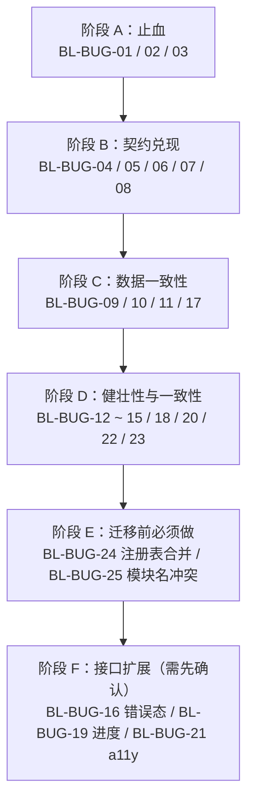

# BoundedList 测试方案

> 主要对照：`packages/uikit/tests/unit/bounded-list/`（`bounded-list.test.ts`、`stream-window.test.ts`、`page-window.test.ts`、`page-source.test.ts`、`selection.test.ts`、`registry.test.ts`、`update-pill.test.ts`、`stress.test.ts`、`known-issues.test.ts`、`fake-dom.ts`、`test-sources.ts`）与 `packages/uikit/src/app/bounded-list/`。
> 最后复核：2026-07-28。
> 触发更新：`bounded-list/` 源码行为变化、测试用例增删、覆盖率口径调整，或 §6 缺陷清单中任一条被修复 / 新增时同步更新。
> 入口关系：上级索引见 [`../../../docs/architecture/前端文档索引.md`](../../../docs/architecture/前端文档索引.md)；接口口径见 [`BoundedList组件设计.md`](BoundedList组件设计.md)，仓库整体测试分层见 [`../../../docs/development/测试方案.md`](../../../docs/development/测试方案.md)。

## 目录

- [1. 范围与目标](#1-范围与目标)
- [2. 测试环境](#2-测试环境)
  - [2.1 为什么是手写 fake DOM](#21-为什么是手写-fake-dom)
  - [2.2 fake DOM 能力清单](#22-fake-dom-能力清单)
  - [2.3 共用测试数据源](#23-共用测试数据源)
  - [2.4 三个容易踩的环境陷阱](#24-三个容易踩的环境陷阱)
- [3. 被测不变量](#3-被测不变量)
- [4. 用例分类](#4-用例分类)
  - [4.1 PageWindow 数据窗口](#41-pagewindow-数据窗口)
  - [4.2 PageSource 数据源](#42-pagesource-数据源)
  - [4.3 SelectionStore 选中态](#43-selectionstore-选中态)
  - [4.4 registry 注册表](#44-registry-注册表)
  - [4.5 update-pill 提示条](#45-update-pill-提示条)
  - [4.6 BoundedStreamWindow 渲染引擎](#46-boundedstreamwindow-渲染引擎)
  - [4.7 BoundedList 组件外壳](#47-boundedlist-组件外壳)
  - [4.8 大数据量与长序列压力](#48-大数据量与长序列压力)
  - [4.9 已知缺陷行为锁定](#49-已知缺陷行为锁定)
- [5. 覆盖率口径与结果](#5-覆盖率口径与结果)
- [6. 缺陷与待办清单](#6-缺陷与待办清单)
  - [6.1 P0](#61-p0)
  - [6.2 P1](#62-p1)
  - [6.3 P2](#63-p2)
  - [6.4 修复顺序建议](#64-修复顺序建议)
- [7. 执行方式](#7-执行方式)

---

## 1. 范围与目标

被测对象是 `packages/uikit/src/app/bounded-list/` 下的**全部 9 个文件**（含只有类型的 `types.ts` 与只有再导出的 `index.ts`）。

目标有三个，按优先级排列：

1. **锁住不变量**（§3）。列表组件的价值就在这几条：窗口有界、DOM 有界、身份唯一、游标只来自保留页、可完全释放。任何改动破坏其中一条都必须让测试变红。
2. **覆盖每一条分支**。行覆盖、分支覆盖、函数覆盖、语句覆盖**全部 100%**（§5）。边界组合（裁剪 + 去重 + 锚点 + 提示条 + 并发丢弃）是这个组件出错最多的地方，只有把分支走满才谈得上有回归保护。
3. **把缺陷变成可执行的事实**（§6）。已确认的每条缺陷都有一个锁定当前行为的用例，修复时必然失败，提醒同步更新断言与文档。

不在本方案范围内：

- 真实浏览器里的布局、重绘、滚动惯性 —— 由 Playwright UI 测试覆盖（`apps/web/tests/ui/`）。
- 具体宿主视图（会话列表、消息列表、通讯录）如何使用组件 —— 由各自的视图测试覆盖。
- SDK 分页接口本身 —— 由 SDK 单测与服务端 E2E 覆盖。

## 2. 测试环境

### 2.1 为什么是手写 fake DOM

仓库的 vitest 跑在 node 环境，没有装 jsdom。列表组件的绝大多数行为（清空重建、锚点、监听注销、触界检测、指针期间推迟重建）只需要**可控的**元素与事件模型，不需要真实布局引擎——反而是「布局可以由测试精确编排」让锚点公式这类断言变得可能。因此 `fake-dom.ts` 手写了一套最小 DOM。

代价是必须显式模拟真实浏览器会自动做的事：`scrollHeight` 不随内容增长、`innerHTML = ''` 不会把 `scrollTop` 夹回 0、`getBoundingClientRect()` 返回测试写死的矩形。相关陷阱见 §2.4。

### 2.2 fake DOM 能力清单

| 导出 | 能力 |
|---|---|
| `FakeElement` | `className` / `classList`（add / remove / toggle / contains）、`textContent`、`innerHTML = ''` 清空、`appendChild` / `removeChild` / `remove`、`parentElement`、`children`、`setAttribute` / `getAttribute`、`scrollTop` / `scrollHeight` / `clientHeight`、可写的 `rect` + `getBoundingClientRect()` |
| | `addEventListener` / `removeEventListener`（区分 capture）、`listenerCount(type)`、`dispatch(type, extra)` |
| `FakeWindow` | 同上的监听增删与 `listenerCount` / `dispatch`，用于验证 window 级 pointer 兜底监听被注销 |
| `FakeDocument` | `createElement()`；`new FakeDocument({ withView: false })` 模拟 `ownerDocument.defaultView` 为 `null` 的宿主 |
| `stripBoundingRect(el)` | 抽掉元素的 `getBoundingClientRect`，落到锚点 / `scrollToKey` 的降级分支 |
| `capturedListeners(el, type)` | 取出已注册的监听器本体，用于「注销之后仍被残留调用」这类白盒断言 |
| `viewOf(doc)` | 取 `defaultView`（断言用，`withView: false` 的文档上调用会抛错） |
| `asElement` / `asDoc` / `row` | 类型桥接与快捷行构造 |

**`listenerCount` 是关键能力**：内存泄漏回归不能只断言「不再触发」，必须断言监听器真的被移除了。

### 2.3 共用测试数据源

`test-sources.ts` 提供五种数据源，分别对应不同的分页语义：

| 工厂 | 语义 | 典型用途 |
|---|---|---|
| `createInstantSource(getAll, { withTotal })` | 每次 fetch 都重读 `getAll()`，`hasMore` 按真实剩余量精确判定 | 常规分页、模拟「服务端数据会变」 |
| `createAnchoredSource(getAll, anchorIndex)` | 首页从 `anchorIndex` 起切，两端都可能还有更多 | 双向续翻、双向裁剪、`around` 锚点加载 |
| `createOptimisticSource(getAll)` | 满页时**乐观**认为还有更多，只有真拿到空页才收敛 | 「触界续翻拿到空页」这条路径（提示条路径②） |
| `createControllableSource()` | 手动控制每一次 fetch 的 resolve / reject 时机 | 并发丢弃、错误处理、loading 标志的精确断言 |
| `createControllableFetcher()` | 手动控制 `fetchByIdentity` 的 resolve / reject | 定向刷新的竞态与失败路径 |

真实 keyset 分页在拿到一整页之前无法确定是否已到末尾，所以 `createOptimisticSource` 才是更贴近服务端行为的那一个；`createInstantSource` 的精确判定是为了让与分页无关的用例写起来简单。

### 2.4 三个容易踩的环境陷阱

**① `scrollHeight` 不随内容增长。** 默认 host 把它设成 `100000`（远大于 `clientHeight`），否则「内容不足一屏 → 双端都判定贴边 → 链式补页」会在与分页无关的用例里意外触发。需要验证链式补页的用例才显式把两者设成相等。

**② `reset` 默认 `pinEdge: true` 会把 `scrollTop` 摁到新鲜端。** 摁到顶之后，只要 `hasMoreBefore` 为 `true`，之后的每一次渲染都会触发 `backward` 续翻。所以只想观察某个单点行为的用例一律用 `reset({ pinEdge: false })` 再显式设置 `scrollTop = 500`。

**③ `withFrames` 的 stub 会在第一个 `await` 处失效。** `vi.stubGlobal` 配 `try/finally` 时，如果回调是 async 而外层没有 await，`finally` 会在回调刚进入第一个 `await` 时就执行、提前解除 stub。异步用例必须用 `withFramesAsync`。

## 3. 被测不变量

| # | 不变量 | 主要守护用例 |
|---|---|---|
| I1 | 窗口条目数 ≤ `pageSize × maxPages` | `page-window` B5、`stress` A1–A5 |
| I2 | DOM 条目节点数 == `state.count`，与数据总量无关 | `stress` A1/A5/D3 |
| I3 | 提供 `identityOf` 时，窗口内同一身份至多出现一次 | `page-window` C1–C5、`stress` A1/D2 |
| I4 | 续翻游标永远取自保留页的边界，从不在客户端重建 | `page-window` B1/B2/C3/C5、`bounded-list` C6、`stress` B2 |
| I5 | `reset` / `loadMore` 返回的 Promise 永远 resolve，不产生未处理拒绝 | `bounded-list` K1/K6 |
| I6 | `dispose()` 之后组件挂的监听数全部归 0，提示条 DOM 被摘除，注册表不含该实例 | `bounded-list` L1/L8、`stream-window` K1–K10、`stress` E1/E2 |
| I7 | 过期请求（被更新的 `reset` 取代）与已 `dispose` 实例上的结果整体丢弃，不触发任何回调 | `bounded-list` B9/B10/C10/K2/K5/L4–L7 |
| I8 | 同一帧内多次 `invalidate` 只跑一次决策，`count` 累加、`identities` 去重合并 | `bounded-list` E10/E11、`stress` C1 |
| I9 | 多选上限没有绕过路径 | `bounded-list` I7 |
| I10 | 链式补页在服务端遵守契约时必然终止 | `bounded-list` C8、`stress` B1 |

## 4. 用例分类

九个测试文件、共 **383 个用例**。每个文件内部按字母段分类，用例 id（`A1`、`C7`…）写在用例名开头，便于在文档与代码之间互相指认。

| 文件 | 用例数 | 覆盖对象 |
|---|---|---|
| `page-window.test.ts` | 44 | 数据窗口层 |
| `page-source.test.ts` | 24 | 数据源层 |
| `selection.test.ts` | 21 | 选中态 |
| `registry.test.ts` | 13 | 实例注册表 |
| `update-pill.test.ts` | 12 | 提示条 |
| `stream-window.test.ts` | 96 | 渲染引擎 |
| `bounded-list.test.ts` | 130 | 组件外壳 |
| `stress.test.ts` | 18 | 大数据量与长序列 |
| `known-issues.test.ts` | 25 | 已知缺陷行为锁定 |

### 4.1 PageWindow 数据窗口

| 段 | 主题 | 覆盖要点 |
|---|---|---|
| A | 基础记账（10 例） | `setInitial` 的空页 / 非空页、重复调用等价于重建、`total` 的透传与保留、空页续翻只收敛 `hasMore` 不动游标、`normalize` 作用于每一页、`hasMore*` 无 setter、`reset` 后可直接续翻式重建 |
| B | 整页裁剪（6 例） | 双向裁剪与对端 `hasMore` 置真、`maxPages=1` 每次整页替换、连续超额逐次裁到位、条目数上界、**裁剪只按页数不按条数**（单页 500 条不裁） |
| C | 跨页去重（10 例） | 双向去重、旧页被清空仍保留有效游标、§7.2 的「裁剪后回滚 + 并发重排」四步路径、空页占名额的已知取舍、未提供 `identityOf` 时不去重、页内重复不由去重负责、`hasIdentity` 跨页查找与删除后失效 |
| D | 就地增删改（7 例） | `updateMatching` / `removeMatching` 的命中与未命中、跨页多命中、删空整页后游标仍有效、删光全部条目后 `loaded` 仍为 `true` |
| E | 实时并入 `mergeLive`（7 例） | 双端并入与对应 `hasMore` 置 `false`、空窗口自建页、多页窗口下不触发裁剪、`normalize` 作用于整页、**不参与跨页去重**、连续 500 次并入只撑大单页 |
| F | 大数据量与长序列（4 例） | 1000 次 `appendForward`、400 步交替 append/prepend、每页与相邻页重叠一半的极端形态、1000 条窗口内的逐条精确增删改 |

### 4.2 PageSource 数据源

| 段 | 主题 | 覆盖要点 |
|---|---|---|
| A | `serverPageSource`（6 例） | 请求原样透传、`cursor: undefined` 不被替换、不透明游标原样搬运、`fetch` 与 `map` 的错误都不吞、`map` 内做过滤 |
| B | `localPageSource`（8 例） | reset 重新 `loadAll`、续翻只切片、`setQuery` 重新过滤排序、全过滤为空、`compare` 不污染原数组、缓存快照不受原数组后续修改影响、`loadAll` 抛错透传、`onProgress` 形参恒为 `undefined`（BL-BUG-19） |
| C | 边界与非法输入（7 例） | 两端越界夹紧、远超长度的游标、负游标、`limit=0`、空集合、backward 的 limit 超剩余量、reload 之后旧下标游标被夹紧 |
| D | 大数据量（3 例） | 1000 条配 `PageWindow` 的有界性、50000 条 + `compare` 翻遍全集只 `loadAll` 一次、50000 选 1 的极低命中率过滤 |

### 4.3 SelectionStore 选中态

| 段 | 主题 | 覆盖要点 |
|---|---|---|
| A | 基础语义（7 例） | `toggle` 增删、`replaceSingle` 替换且不受 `max` 约束、`snapshotIds` 是拷贝、`clear` 只在非空时通知、`retainOnly` 只在实际删除时通知、`retainOnly(∅)` 等价清空 |
| B | 上限（5 例） | `isExceeded` 三种情形、`max=0`、`max=1` 反复 toggle、被拒绝不通知、`retainOnly` 腾名额 |
| C | 订阅通知（5 例） | 多订阅者全量通知、取消函数幂等、同一函数重复订阅只登记一份、订阅者内部再改 store 不崩、订阅者在通知过程中取消自己 |
| D | 边界与大规模（4 例） | 空串 / 10KB 超长 id、转发上限 500 的真实规模、50000 身份的 `retainOnly` 只通知一次、200 个订阅者 |

### 4.4 registry 注册表

| 段 | 主题 | 覆盖要点 |
|---|---|---|
| A | 注册与注销（5 例） | 注册 / 注销的可见性、未注册实例的 unregister 空操作、重复注册同一实例只占一位、`registeredBoundedListIds` 是快照 |
| B | 广播（4 例） | 全量广播各一次且不带参数、Promise 返回值 fire-and-forget、空注册表、200 实例广播 |
| C | 边界（4 例） | 同 id 互相覆盖、unregister 不误删覆盖它的新实例、广播过程中注销自己、空 id 是合法 key |

用例统一用 `afterEach` 清理注册表——它是模块级单例，不清会跨用例污染广播断言。

### 4.5 update-pill 提示条

| 段 | 主题 | 覆盖要点 |
|---|---|---|
| A | 挂载与显隐（5 例） | 默认隐藏、`setVisible` 显隐与文案、初始 class、传空串真的清空文案、50 次反复显隐不重复挂载、同一 host 下多个提示条互不干扰 |
| B | 点击（3 例） | 触发 `onClick`、隐藏状态下同样触发、连续点击每次都回调 |
| C | 释放（3 例） | `dispose` 摘节点 + 注销监听、之后 `setVisible` 不影响 host、幂等 |
| D | `host=false`（1 例） | 不创建 DOM，全部方法空操作 |

### 4.6 BoundedStreamWindow 渲染引擎

| 段 | 主题 | 覆盖要点 |
|---|---|---|
| A | 全量渲染（7 例） | 无 spacer、锚点只打在首元素、一行多元素、返回空数组、每次都清空重建（不 diff）、`scrollTop` 先读后清恢复、被夹回 0 时显式恢复、1000 行一次性渲染 |
| B | 状态与边界提示（7 例） | 未加载 / 空态 / 边界 / 加载四种提示的**全部组合**（含文案缺失时什么都不渲染、未加载分支优先于空态、边界提示优先于加载提示）、三段式渲染顺序 |
| C | 触界检测（8 例） | `reachPx` 可配置与默认 160 的边界值（160 触发 / 161 不触发）、没有更多时不触发、内容不足一屏时双端都触发、未加载不检测、**空列表不检测**（BL-BUG-08）、滚动帧合并、从未 render 就滚动、回调缺失时空操作 |
| D | 锚点（7 例） | 头部插入后偏移不变、尾部裁剪不动、锚点选取规则（第一条底边仍在视口顶以下）、锚点消失时不校正、没有锚点节点时不校正、捕获阶段与恢复阶段各自的布局能力降级 |
| E | `scrollToKey`（6 例） | 下方 / 上方 / 已完整可见三种 nearest 情形、center 居中、拿不到布局信息仍返回 `true`、边界提示不会被误当成目标 |
| F | 贴边判定（5 例） | head / tail 的阈值边界、`stickyPx=0`、内容不足一屏时两端都贴边、`dispose` 后仍可查询 |
| G | 指针期间推迟重建（8 例） | 推迟与抬起后下一帧应用、多次 render 只应用最后一次、window 级兜底、无积压时不安排冲刷、未按下就收到抬起、抬起后又正常渲染导致冲刷退化为空操作、一次按下多次抬起只冲刷一次、未按下时立即重建 |
| H | 事件委托（8 例） | 嵌套元素上溯（含 5 层深）、`contentElement` 分离、无锚点祖先、点边界提示、`target` 为 `null`、路径中夹着没有 `getAttribute` 的节点、未提供 `onInteract` |
| I | 键盘导航（15 例） | 方向键移动与高亮、首次上下的起点、`preventDefault`、`Enter`/`Space` 激活与 `viaKeyboard`、无焦点时不激活、两端越界触发翻页且不移焦点、回调缺失、无条目 / 从未 render、其它按键不消费、焦点跟随下标、窗口变短时的钳制（BL-BUG-15）、清空后归位、首元素无 `classList` 的降级 |
| J | 内容 `load`（3 例） | 触发 `onContentLoad`、未提供时空操作（BL-BUG-06）、监听确实注册在捕获阶段 |
| K | 释放（10 例） | `scrollElement` / `window` / `contentElement` 三处监听全清、无 `defaultView` 的宿主、`dispose` 后 render 空操作 / `scrollToKey` 仍可查询、幂等、已排队的下一帧不触碰 DOM、**注销后残留调度被触发**（白盒）、200 实例压力 |
| L | 辅助导出（12 例） | `getOrCreateBoundedStreamWindow` 复用与区分、`catchUpAtEdge` 三态 + 短路 + fire-and-forget、`createFrameScheduler` 的合并 / 重排 / cancel / cancel 后重排 / 未调度时 cancel / 无 rAF 时同步执行 |

### 4.7 BoundedList 组件外壳

| 段 | 主题 | 覆盖要点 |
|---|---|---|
| A | 构造与默认值（8 例） | 提示条默认挂父元素、无父元素时退化、`pillHost: false`、显式 `pillHost`、`freshEdge` 决定 `stickyPx`/`settleFrames` 默认值的**边界取值**、显式 `stickyPx`、构造即注册、`selection` 无 `store` 时自建 |
| B | reset 首屏（12 例） | 首屏加载、空首页、加载中文案、`pinEdge` 双端行为、`pinEdge: false`、`settleFrames` 多帧与单帧、`reset({ query })` 四种传参组合（含显式 `undefined`）、并发丢弃、10 次乱序落地、切换后不残留旧数据、请求参数透传 |
| C | 双向续翻（12 例） | forward / backward 的裁剪、backward 到头收敛、无更多时不发请求、同方向并发守卫与反方向并发、裁剪后游标正确、触界自动续翻、链式补页终止（4 次请求）、空页回调、`loadMore` 期间 reset、跨页去重、`normalize` |
| D | setQuery 防抖（7 例） | `debounceMs=0` 同步、默认 300ms 的**边界值**（299 不触发 / 300 触发）、自定义值、负数等价 0、`dispose` 取消计时器、`dispose` 后空操作、`setQuery` 触发的 reset 回到新鲜端（1000 条 `localPageSource`） |
| E | invalidate 决策树（17 例） | `isActive=false` 的两种情形（含贴边时也不追平）、贴边追平、不贴边点亮、`pendingCount` 累加与归零、命中 / 未命中 / 无 `fetchByIdentity` 三条分支、定向刷新不动游标、同帧合并、身份去重、定向刷新失败、定向刷新返回 / 失败时已 dispose、无参 invalidate、首屏未加载时 invalidate、`onStaleChange` |
| F | 提示条三条路径（8 例） | 路径①及其 loading 守卫、路径②（tail）与只认新鲜端方向（head）、路径③、点击提示条、文案随计数变化、无待追平时贴边不发请求 |
| G | 本端增删改（10 例） | 双端 `upsertLocal`、不触发页数裁剪、`normalize` 去重、事件触发、`patch` 命中 / 未命中、`removeLocal` 与选中集修剪、`patch` 不触发 `onLoadStateChange`、空窗口 `upsertLocal` |
| H | 渲染与文案（12 例） | `pinnedItems` 参与渲染不计数、只有 pinned 时不显示空态、`RenderItemContext` 全字段、未开启 selection 的默认值、pinned 参与 `previous` 链、`emptyFiltered` 与回退、循环引用查询降级、边界文案、`text` 全缺省、`render()` 反映外部状态且不发请求不动滚动 |
| I | 交互与选中态（12 例） | 点击 / 键盘激活、点击 pinned（含遍历过不匹配的 pinned）、点到已不存在的身份、single 的双重语义、multi 的翻转、**上限无绕过**、共享 store 双实例、`onSelectionChange` 载荷、无回调时不崩、`selectable` 语义、外部改 store 触发重渲 |
| J | `scrollToIdentity`（4 例） | 命中 / 未命中、pinned 身份、center、身份在窗口但没有渲染节点 |
| K | 错误处理（8 例） | reset / forward / backward 三个阶段、过期失败被丢弃（reset 与 loadMore 各一）、无 `onError` 时 `console.warn` 且带 id 前缀、失败后可重新 reset、非 Error 拒绝值 |
| L | 释放（10 例） | 全部监听清零 + 注册表注销 + 提示条摘除、dispose 后所有命令空操作、`getState` 仍可读、在飞的 reset / loadMore 的成功与失败四种组合、50 实例压力、共享 store 取消订阅、同 id 重建 |
| M | 只读状态（7 例） | 初始快照全字段、`total` 透传与未知、`loading` 是并集、`onLoadStateChange`、`getState` 是新快照、`atFreshEdge` 实时 |
| N | 防御性守卫（3 例，白盒） | dispose 后残留的选中订阅回调、dispose 后残留的 invalidate 帧回调、无待处理 invalidate 时的帧回调 |

> N 段是**白盒用例**：这三个守卫在当前公开 API 下走不到（`dispose()` 已经取消了订阅与帧调度），但它们是防止将来调度实现变化后漏保护的安全网。用例通过子类捕获订阅回调、直接调用私有方法来验证守卫本身，并在注释里写明了这一点。

### 4.8 大数据量与长序列压力

| 段 | 主题 | 覆盖要点 |
|---|---|---|
| A | 有界性不变量（5 例） | 10000 条翻到尾、4000 条从中间双向翻 60 次、`maxPages=1` 翻 50 次、单页 2000 条不裁剪、`localPageSource` 50000 条翻遍全集只 `loadAll` 一次 |
| B | 长序列滚动（2 例） | 触界驱动的 200 次来回滚动（每轮必然拉到该端尽头且必然终止）、长序列翻页后仍能正确翻回起点 |
| C | 高频事件（5 例） | 同帧 1000 次 `invalidate`、2000 次 `upsertLocal`、1000 次 `patch` + 1000 次 `removeLocal`、500 个共享选中项、1000 次 `render()` 不发请求 |
| D | 极端形态数据（4 例） | 10KB 身份键、全部条目身份相同、每行 5 个节点、`normalize` 把整页压成 1 条 |
| E | 生命周期（2 例） | 200 次「打开 → 翻页 → 关闭」循环、100 实例共享一个 store 后全部释放 |

每个用例的断言都是**不变量**而不是具体数值：`count ≤ pageSize × maxPages`、DOM 节点数 == `count`、锚点键集合无重复。

### 4.9 已知缺陷行为锁定

`known-issues.test.ts` 的 25 个用例断言的都是**今天的实际行为**，不是期望行为。每个用例名以缺陷编号开头，注释里写明「期望 X，实际 Y」。修复某条缺陷时对应用例必然变红——这就是它的作用。

修复流程固定为：改这里的断言 → 把用例挪回对应的正式测试文件 → 在 §6 里勾掉它 → 同步 [`BoundedList组件设计.md`](BoundedList组件设计.md) §15。

## 5. 覆盖率口径与结果

覆盖率用 vitest 自带的 v8 provider 统计，范围限定在 `src/app/bounded-list/**`：

```bash
cd packages/uikit
npx vitest run --config vitest.config.ts \
  --coverage.enabled --coverage.provider=v8 \
  --coverage.include='src/app/bounded-list/**' \
  --coverage.reporter=text \
  tests/unit/bounded-list
```

2026-07-28 的结果：

| 指标 | 结果 |
|---|---|
| Statements | **100%**（690 / 690） |
| Branches | **100%**（396 / 396） |
| Functions | **100%**（135 / 135） |
| Lines | **100%**（579 / 579） |

逐文件都是 100%。`index.ts` 与 `types.ts` 没有可执行语句（纯再导出 / 纯类型），计为 0/0。

几处「公开 API 走不到」的分支是靠白盒手段覆盖的，都在代码与用例里写明了理由：

| 位置 | 分支 | 覆盖手段 |
|---|---|---|
| `bounded-list.ts` 选中订阅回调的 `disposed` 守卫 | dispose 后回调仍被调用 | 子类重写 `subscribe` 捕获回调，dispose 后直接调用（`bounded-list` N1） |
| `bounded-list.ts` `flushInvalidate` 的 `disposed` / `!pendingInvalidate` 守卫 | dispose 后 / 无待处理时的帧回调 | 直接调用私有方法（`bounded-list` N2/N3） |
| `stream-window.ts` 滚动帧回调的 `disposed` 守卫 | 注销后残留调度被触发 | `capturedListeners` 取出监听器本体，dispose 后手动调用（`stream-window` K9） |
| `page-window.ts` `mergeLive` 的裁剪循环 | 并入后页数超限 | `maxPages=0` 的边界配置（`known-issues` BL-BUG-17） |

**维护要求**：新增分支必须同步新增用例。CI 的质量趋势任务（`YIMSG_QUALITY_GATES=1`）会记录覆盖率，出现回落要在合并前补齐。

## 6. 缺陷与待办清单

共 25 条，全部由 §4.9 的用例锁定当前行为（BL-BUG-15 / 19 / 22 / 23 的锁定用例在对应的正式测试文件里）。优先级口径：**P0 = 会导致页面卡死或用户数据丢失；P1 = 功能不正确或契约未兑现；P2 = 健壮性、一致性与可维护性。**

### 6.1 P0

- [ ] **BL-BUG-01 [P0] 翻页失败后立即重试，形成不让出主线程的无限重试**
  - 位置：`bounded-list.ts` `loadMore` 的 `catch` 分支 → `this.render()` → `stream-window.ts` `checkReach()` → `loadAfter()` → 再次 `loadMore`。
  - 触发条件：用户停在某一端 **且** 窗口内容不足一屏（`maxScrollTop - scrollTop ≤ reachPx` 恒成立）**且** 该方向请求持续失败（断网、服务端 5xx）。
  - 后果：整条重试链全在微任务里跑，宏任务队列被饿死，**页面完全卡住**，同时对服务端形成风暴式重试。
  - 同类诱因：服务端违反契约，返回空页却仍报 `hasMore=true`（`known-issues` BL-BUG-01b 已锁定），或 `localPageSource` 被喂了负游标（`page-source` C3 注释）。
  - 修复建议：① `loadMore` 失败后**不要立即重渲**，或重渲时跳过一次 `checkReach`；② 引入该方向的失败退避（连续失败后暂停自动触界，改由用户手动触发或延时重试）；③ 给「空页却报 hasMore」加防御：`items.length === 0` 时强制把该端 `hasMore` 收敛为 `false`。
  - 锁定用例：`known-issues.test.ts` BL-BUG-01 / BL-BUG-01b（用熔断阀防止用例本身卡死）。

- [ ] **BL-BUG-02 [P0] `removeLocal` 的选中集修剪会清掉共享 store 中属于其它实例的选中项**
  - 位置：`bounded-list.ts` `removeLocal` → `this.selection?.retainOnly(new Set(本实例窗口内的身份))`。
  - 触发条件：多个实例共享同一个 `SelectionStore`（转发弹窗的「最近会话」+「通讯录」双 tab），任一实例调用 `removeLocal`。
  - 后果：**用户已选好的转发目标被静默清空**。同一问题也会误删 `pinnedItems` 的选中项（`retainOnly` 的集合不含 pinned），以及此前选中、后来被整页裁剪出窗口的目标。
  - 修复建议：`retainOnly` 只应作用于「本实例负责的身份域」。可选方案：① 改为精确移除被删的那一个 id（`store.remove(id)`），不做全量保留；② 给 `SelectionStore` 增加按实例分组的能力；③ 保留集合改为「本实例窗口 + pinnedItems + 其它实例声明的身份」。**推荐 ①**，语义最直白且不需要改 store 结构。
  - 锁定用例：`known-issues.test.ts` BL-BUG-02 / BL-BUG-02b。

- [ ] **BL-BUG-03 [P0] 定向刷新回调没有 requestId 守卫，陈旧结果会作用到新窗口**
  - 位置：`bounded-list.ts` `flushInvalidate` 里 `fetchByIdentity(...).then(...)`，只检查 `this.disposed`。
  - 触发条件：`fetchByIdentity` 在飞期间发生 `reset`（用户切会话 / 切 tab / 点提示条 / setQuery 落地）。
  - 后果：陈旧结果按身份 `updateMatching` / `removeMatching` 作用到**新窗口**上。最坏情况是新窗口里存在的条目被误删（旧上下文里它「不存在」）。
  - 修复建议：`flushInvalidate` 入口捕获 `this.requestId`，`then` / `catch` 里与当前值比对，不一致即整体丢弃（与 `reset` / `loadMore` 完全一致的守卫）。
  - 锁定用例：`known-issues.test.ts` BL-BUG-03。

### 6.2 P1

- [ ] **BL-BUG-04 [P1] 非空的最后一页把 `hasMore` 收敛为 `false` 时提示条不消失**
  - 位置：`bounded-list.ts` `loadMore` 只在 `page.items.length === 0` 时调 `handleEmptyPage`。
  - 后果：新鲜端之后已经没有未加载数据了，提示条却还亮着「有 N 条新消息」，用户点了才消失。
  - 修复建议：把路径② 的判定从「拿到空页」改成「该端 `hasMore` 由 `true` 收敛为 `false`」。
  - 锁定用例：`known-issues.test.ts` BL-BUG-04。

- [ ] **BL-BUG-05 [P1] 未提供 `text.updatePill` 时提示条仍以空文案显示**
  - 位置：`bounded-list.ts` `syncPill()` 的 `?? ''` —— 空串不是 `undefined`，会真的把文案清空并让提示条可见。
  - 后果：没打算要提示条的列表上出现一个空白色块。
  - 修复建议：`updatePill` 缺省时直接 `setVisible(false)`（或构造时把 `pillHost` 视为 `false`）。
  - 锁定用例：`known-issues.test.ts` BL-BUG-05。

- [ ] **BL-BUG-06 [P1] `onContentLoad` 未接线，图片异步增高后不重新贴底**
  - 位置：`bounded-list.ts` 构造 `BoundedStreamWindow` 时没有传 `onContentLoad`（引擎侧已实现并已挂 `load` 捕获监听）。
  - 后果：`freshEdge='tail'` 的消息列表在图片加载完之后不会重新滚到底，用户看到的是「差了一截」。
  - 修复建议：传入 `onContentLoad: () => { if (freshEdge === 'tail' && 此前贴底) pinToFreshEdge(); }`。注意判定要用**加载前缓存的贴底状态**，不能现算（图片已把内容撑高，现算必然误判成不贴底）。
  - 锁定用例：`known-issues.test.ts` BL-BUG-06；引擎侧能力由 `stream-window` J1–J3 覆盖。

- [ ] **BL-BUG-07 [P1] `isActive() === false` 时不重渲，提示条与状态脱节**
  - 位置：`bounded-list.ts` `flushInvalidate` 的第一条分支只改 `stale` / `pendingCount` 就 `return`，不调 `render()`。
  - 后果：tab 隐藏期间累积的更新，在切回可见时**不会自动出现提示条**，除非宿主主动调 `render()`。
  - 修复建议：该分支末尾补一次 `this.render()`（只重渲不发请求，成本可忽略），或明确把「切回可见时必须 `render()`」写进宿主约定。
  - 锁定用例：`known-issues.test.ts` BL-BUG-07。

- [ ] **BL-BUG-08 [P1] 空首页 + `hasMoreForward=true` 时停在空态不补页**
  - 位置：`stream-window.ts` `applyRender` 在 `items.length === 0` 分支 early return，不做 `checkReach()`。
  - 后果：服务端返回空页却报「还有更多」（`around` 锚点加载的乐观策略、全过滤命中为空等）时，列表定格在空态，用户以为没数据。
  - 修复建议：空态分支返回前也执行一次 `checkReach()`（空列表没有滚动空间，`maxScrollTop=0`，两端都会判定触界，正好触发补页）。
  - 锁定用例：`known-issues.test.ts` BL-BUG-08；引擎侧由 `stream-window` C5 锁定。

- [ ] **BL-BUG-09 [P1] `upsertLocal` 不做身份去重，重复并入会重复渲染**
  - 位置：`page-window.ts` `mergeLive` 既不调 `dropIdsFromExistingPages`，默认 `normalize` 也不去重。
  - 后果：本端重发 / 转发成功回包重复到达时，同一条消息渲染两遍。当前靠消息列表自己传 `normalize = sortUniqueBySeq` 兜住，其它列表没有这层保护。
  - 修复建议：`mergeLive` 在并入前也走一次 `dropIdsFromExistingPages`（跨页去重），或在默认 `normalize` 里按 `identityOf` 去重。
  - 锁定用例：`known-issues.test.ts` BL-BUG-09 / BL-BUG-09b。

- [ ] **BL-BUG-10 [P1] `mergeLive` 在空窗口自建页时游标为空串**
  - 位置：`page-window.ts` `mergeLive` 的 `pages.push({ items, startCursor: '', endCursor: '' })`。
  - 后果：随后的续翻会带着 `cursor: ''` 去请求服务端。空串不是 `undefined`，不会被数据源当成 reset 语义，服务端如何解读取决于实现——很可能返回错误或错误的一页。
  - 修复建议：自建页时把两端 `hasMore` 都置 `false`（本地条目之外没有已知边界），或在 `loadMore` 里对空游标短路（当作「没有可用的续翻锚点」，改走 `reset`）。
  - 锁定用例：`known-issues.test.ts` BL-BUG-10。

### 6.3 P2

- [ ] **BL-BUG-11 [P2] `localPageSource` 对非法游标不设防**
  - `Number('abc')` 得到 `NaN`，夹紧逻辑全部退化成 `NaN`，产出 `"NaN"` 游标且此后永远返回空页。
  - 修复建议：`Number.isFinite` 校验，非法时按 `0` 处理或直接抛出可辨识的错误。
  - 锁定用例：`known-issues.test.ts` BL-BUG-11。

- [ ] **BL-BUG-12 [P2] `isQueryActive` 用 `JSON.stringify` 比较，键顺序不同即误判**
  - `{a:1,b:2}` 与 `{b:2,a:1}` 语义相同但序列化结果不同，空态会错误地显示 `emptyFiltered`。
  - 修复建议：改为浅比较 / 稳定序列化，或让调用方显式提供 `isQueryEmpty(query)` 判定函数。
  - 锁定用例：`known-issues.test.ts` BL-BUG-12。

- [ ] **BL-BUG-13 [P2] 定向刷新期间提示条延迟亮起**
  - `flushInvalidate` 在 `fetchByIdentity` 分支里 `return`，把 `render()` 推迟到请求返回之后；请求慢时提示条要等几百毫秒才出现。
  - 修复建议：进入该分支前先 `render()` 一次同步提示条，请求返回后再 `render()` 一次。
  - 锁定用例：`known-issues.test.ts` BL-BUG-13。

- [ ] **BL-BUG-14 [P2] `dispose()` 后 `pinToFreshEdge` 已排队的帧仍会写 `scrollTop`**
  - `settleFrames > 1` 时后续帧通过 `scheduleFrame` 排队，没有 `disposed` 守卫也没有取消机制。
  - 后果：弹窗关闭后组件仍然改动宿主的滚动位置。
  - 修复建议：`settle` 回调开头加 `if (this.disposed) return;`，或改用带 `cancel` 的帧调度并在 `dispose` 里取消。
  - 锁定用例：`known-issues.test.ts` BL-BUG-14。

- [ ] **BL-BUG-15 [P2] 焦点行钳制发生在渲染末尾，窗口变短那一次渲染丢失高亮**
  - `focusedKey` 在渲染开头按旧 `focusedIndex` 计算（越界 → `null`），钳制却在末尾才做，于是这一次渲染没有任何行被高亮，要再渲染一次才恢复。
  - 修复建议：把钳制提到 `focusedKey` 计算之前。
  - 锁定用例：`stream-window.test.ts` I13。

- [ ] **BL-BUG-16 [P2] `reset` 失败后显示「暂无数据」，无法区分「没有数据」与「加载失败」**
  - 失败时窗口为空且 `loaded` 被置 `true`（这一点是刻意的，避免永久卡在加载态），但缺少错误态文案与重试入口。
  - 修复建议：`BoundedListText` 增加 `error?: (err: unknown) => string`，组件记录「上一次首屏是否失败」并优先渲染错误态；提示条位置复用为「重试」入口。**属于接口变更，需先确认。**
  - 锁定用例：`known-issues.test.ts` BL-BUG-16。

- [ ] **BL-BUG-17 [P2] `maxPages=0` 时 `setInitial` 不裁剪，随后一次 `mergeLive` 会把窗口连同新条目一起裁光**
  - `setInitial` 不做 `maxPages` 裁剪，`mergeLive` 却做——两者对同一个配置的解释不一致，`maxPages=0` 下会静默丢数据。
  - 修复建议：构造时校验 `maxPages >= 1`（见 BL-BUG-20），或让 `setInitial` 与 `mergeLive` 的裁剪口径一致。
  - 锁定用例：`known-issues.test.ts` BL-BUG-17。

- [ ] **BL-BUG-18 [P2] `onSelectionChange` 的 `items` 顺序与渲染顺序不一致**
  - `emitSelectionChange` 用 `[...window.items, ...pinned]`，渲染用 `[...pinned, ...windowItems]`。
  - 后果：宿主按 `snapshot.items` 顺序展示「已选目标」时与列表顺序对不上。
  - 修复建议：统一成 `[...pinned, ...window.items]`。
  - 锁定用例：`known-issues.test.ts` BL-BUG-18。

- [ ] **BL-BUG-19 [P2] `localPageSource` 的 `onProgress` 无法从 `PageSource.fetch` 透传**
  - `LocalPageSourceOptions.loadAll` 声明了 `onProgress` 形参，但 `fetch` 调 `reload(req.query)` 时不传，形参恒为 `undefined`；设计方案 §6.4 描述的「已加载 N 人」进度反馈实际不可用。
  - 修复建议：`FetchPageRequest` 增加可选 `onProgress`，由 `BoundedList` 在 `reset` 时注入（可与 `onLoadStateChange` 合并上报）。**属于接口变更，需先确认。**
  - 锁定用例：`page-source.test.ts` B8。

- [ ] **BL-BUG-20 [P2] 构造参数不做任何合法性校验**
  - `pageSize` / `maxPages` 传 `0` 或负数不报错（退化为恒空窗口 / 数据被裁光）；`selection.store` 与 `selection.max` 同时给出时 `max` 被静默忽略。
  - 修复建议：构造时校验 `pageSize >= 1`、`maxPages >= 1`，不合法直接抛错；`store` 与 `max` 同时给出时抛错或明确以 store 为准并在文档里写死（本文 §4.6 已写明当前行为）。
  - 锁定用例：`known-issues.test.ts` BL-BUG-20 / BL-BUG-20b。

- [ ] **BL-BUG-21 [P2] 组件不设置 `tabindex` / `role`，键盘导航实际不可达**
  - `keydown` 挂在 `scrollElement` 上，但组件不让它可聚焦，也不给行加 `role="option"` / `aria-selected`。
  - 修复建议：构造时给 `scrollElement` 补 `tabindex="0"` 与 `role="listbox"`，给行补 `role="option"` 与 `aria-selected`（多选场景）。
  - 锁定用例：`known-issues.test.ts` BL-BUG-21。

- [ ] **BL-BUG-22 [P2] `SelectionStore.notify()` 在遍历中被订阅者增删订阅时行为未定义**
  - 直接 `for...of` 遍历 `Set`：本轮通知期间新增的订阅者会被通知到，删除的会被跳过。当前没有实际影响（组件的订阅者只做重渲），但属于隐式契约。
  - 修复建议：`notify()` 遍历前先拷贝一份（`[...this.listeners]`）。
  - 锁定用例：`selection.test.ts` C4 / C5 覆盖了「不崩」，顺序语义未断言。

- [ ] **BL-BUG-23 [P2] `invalidateAllBoundedLists` 用 `void` 丢弃返回值，异步实现拒绝会变成未处理拒绝**
  - `Invalidatable.invalidate()` 的类型是 `void | Promise<void>`，因此拒绝在契约之内；当前仓库里的 `BoundedList.invalidate` 是同步 `void`，风险尚未被触发。
  - 修复建议：改为 `Promise.resolve(instance.invalidate()).catch((err) => console.warn(...))`。
  - 锁定用例：`registry.test.ts` B2（当前只断言 fire-and-forget 语义，注释里标注了该风险）。

- [ ] **BL-BUG-24 [P1] 存在两套互不连通的有界列表注册表，重连广播打不到 `createBoundedList` 创建的实例**
  - 现状：`bounded-list/registry.ts` 是模块级注册表，`BoundedList` 构造时自动登记；`app-instance.ts` 另有一份 `boundedLists: Map<string, BoundedListController>`，由 `main-app.ts` 手工登记三个条目（`conversations` / `open-conversation-messages` / `contacts`），重连时调的是 `app.invalidateBoundedLists()`——**旧的那一套**。
  - 后果：现在还没有视图迁移到 `createBoundedList`，所以尚未暴露；一旦某个视图迁移过去，**重连后的追平广播会静默漏掉它**，表现为「断网重连后这个列表不刷新」。
  - 修复建议：迁移视图的同时把 `app-instance.ts` 的 `registerBoundedList` / `invalidateBoundedLists` 改为转调 `bounded-list/registry.ts`（或反过来让组件同时登记到宿主注册表），并在最后一个调用方迁移完成后删除 `app.boundedLists`。
  - 优先级说明：定为 P1 而非 P2，是因为它会在迁移过程中**静默失效**且很难在功能测试里被发现。
  - 锁定用例：`known-issues.test.ts` BL-BUG-24。

- [ ] **BL-BUG-25 [P2] 模块名冲突：`./bounded-list` 解析到旧的 `.ts` 文件，组件的公开入口被遮蔽**
  - 现状：`packages/uikit/src/app/` 下同时存在 `bounded-list.ts`（旧的 `BoundedListController` 接口，只有类型）与 `bounded-list/`（新组件目录）。按 bundler 解析规则 `.ts` 文件优先于目录的 `index.ts`，因此 `import { createBoundedList } from './bounded-list'` 拿到的是**旧模块**，运行时导出为空。
  - 后果：`bounded-list/index.ts` 这个刻意收敛出来的公开入口，目前**只能靠 `./bounded-list/index` 这种写法访问**；按直觉写目录路径会在运行时拿到 `undefined`（TypeScript 会先报错，算是兜住了，但这是巧合而不是设计）。
  - 修复建议：把旧的 `bounded-list.ts` 并入 `bounded-list/registry.ts`（`BoundedListController` 与 `Invalidatable` 本来就是同一个契约），删除同名文件，消除歧义。可以与 BL-BUG-24 一起做。
  - 锁定用例：`known-issues.test.ts` BL-BUG-25。

### 6.4 修复顺序建议



阶段 A 的三条都可能导致用户可见的严重故障（页面卡死、选中丢失、条目被误删），且修复都局限在单个方法内、不涉及接口变更，应当优先合入。

阶段 E 单独拎出来，是因为这两条不影响组件自身的正确性，但会在**把现有视图迁移到组件**的那一刻集中爆发（重连广播漏掉迁移后的列表、公开入口按直觉写路径拿不到）——必须在迁移之前处理掉。

阶段 F 涉及 `BoundedListText` / `FetchPageRequest` 的字段增加，按仓库规则**需要先征求接口变更确认**。

## 7. 执行方式

```bash
# 只跑 bounded-list 相关用例
cd packages/uikit && npx vitest run --config vitest.config.ts tests/unit/bounded-list

# 带覆盖率
cd packages/uikit && npx vitest run --config vitest.config.ts \
  --coverage.enabled --coverage.provider=v8 \
  --coverage.include='src/app/bounded-list/**' \
  --coverage.reporter=text tests/unit/bounded-list

# UIKit 全量单测（从仓库根目录）
npm run test:uikit

# 仓库全量测试（从仓库根目录）
./tools/run_all_tests.sh
```

用例数与整体统计以 `tools/scripts/check_docs_consistency.sh` 的输出为准；本文 §4 的分项数量在用例增删时同步更新。
