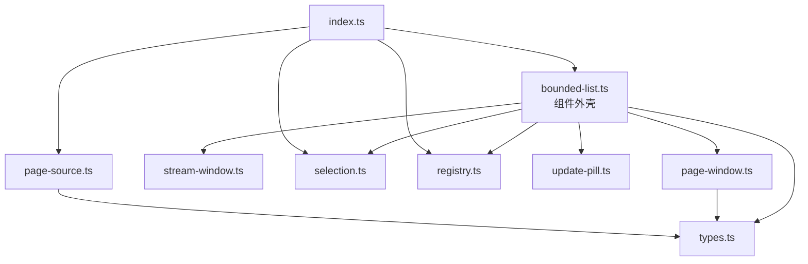
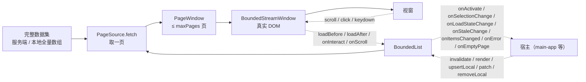
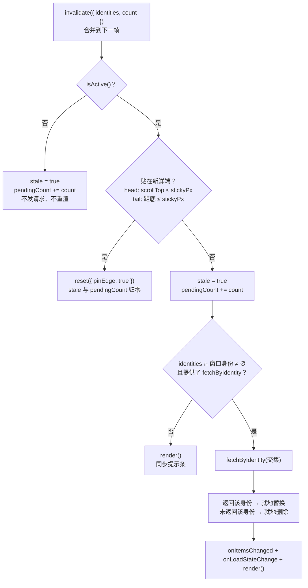
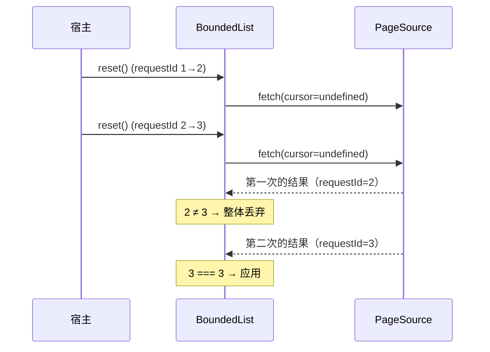
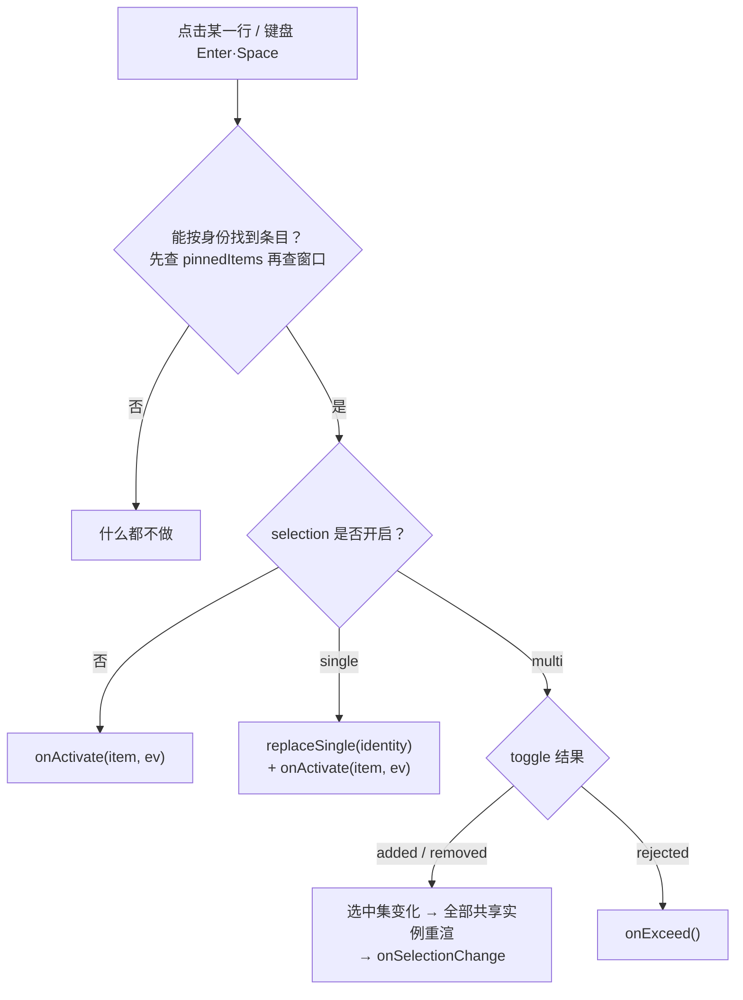

# BoundedList 组件设计与接口说明

> 主要对照：`packages/uikit/src/app/bounded-list/index.ts`、`packages/uikit/src/app/bounded-list/types.ts`、`packages/uikit/src/app/bounded-list/bounded-list.ts`、`packages/uikit/src/app/bounded-list/page-window.ts`、`packages/uikit/src/app/bounded-list/page-source.ts`、`packages/uikit/src/app/bounded-list/stream-window.ts`、`packages/uikit/src/app/bounded-list/selection.ts`、`packages/uikit/src/app/bounded-list/registry.ts`、`packages/uikit/src/app/bounded-list/update-pill.ts`。
> 最后复核：2026-07-28。
> 触发更新：`bounded-list/` 目录下任一模块的导出、参数、方法、事件、默认值、状态字段或行为规则变化时同步更新；测试口径同步 [`BoundedList测试方案.md`](BoundedList测试方案.md)。
> 入口关系：上级索引见 [`../../../docs/architecture/前端文档索引.md`](../../../docs/architecture/前端文档索引.md)；原理与场景矩阵见 [`有界消息流窗口设计方案.md`](有界消息流窗口设计方案.md)（目标态契约在其 §4），**本文是 `bounded-list/` 实际实现的接口单一事实源**，两者不一致时以本文为准并回头修订该文。

## 目录

- [1. 组件定位](#1-组件定位)
  - [1.1 一句话职责](#11-一句话职责)
  - [1.2 模块分层](#12-模块分层)
  - [1.3 数据流](#13-数据流)
- [2. 公开导出面](#2-公开导出面)
- [3. 类型契约](#3-类型契约)
  - [3.1 方向与新鲜端](#31-方向与新鲜端)
  - [3.2 分页请求与结果](#32-分页请求与结果)
  - [3.3 渲染上下文与文案](#33-渲染上下文与文案)
  - [3.4 状态与快照](#34-状态与快照)
- [4. BoundedList 构造参数](#4-boundedlist-构造参数)
  - [4.1 身份与宿主](#41-身份与宿主)
  - [4.2 数据源](#42-数据源)
  - [4.3 身份键](#43-身份键)
  - [4.4 新鲜端与滚动](#44-新鲜端与滚动)
  - [4.5 渲染与文案](#45-渲染与文案)
  - [4.6 选中态](#46-选中态)
  - [4.7 查询条件](#47-查询条件)
  - [4.8 事件回调](#48-事件回调)
- [5. BoundedList 命令式接口](#5-boundedlist-命令式接口)
- [6. BoundedList 只读状态](#6-boundedlist-只读状态)
- [7. PageSource 数据源接口](#7-pagesource-数据源接口)
  - [7.1 serverPageSource](#71-serverpagesource)
  - [7.2 localPageSource](#72-localpagesource)
- [8. PageWindow 数据窗口接口](#8-pagewindow-数据窗口接口)
- [9. BoundedStreamWindow 渲染引擎接口](#9-boundedstreamwindow-渲染引擎接口)
  - [9.1 构造参数与渲染状态](#91-构造参数与渲染状态)
  - [9.2 方法](#92-方法)
  - [9.3 自持的 DOM 事件](#93-自持的-dom-事件)
  - [9.4 辅助导出](#94-辅助导出)
- [10. SelectionStore 选中态接口](#10-selectionstore-选中态接口)
- [11. registry 注册表接口](#11-registry-注册表接口)
- [12. update-pill 提示条接口](#12-update-pill-提示条接口)
- [13. 核心行为规则](#13-核心行为规则)
  - [13.1 invalidate 决策树](#131-invalidate-决策树)
  - [13.2 提示条自动消失的三条路径](#132-提示条自动消失的三条路径)
  - [13.3 触界检测与链式补页](#133-触界检测与链式补页)
  - [13.4 请求并发与丢弃](#134-请求并发与丢弃)
  - [13.5 点击与键盘的事件分发](#135-点击与键盘的事件分发)
  - [13.6 渲染时序](#136-渲染时序)
- [14. 不变量与宿主约定](#14-不变量与宿主约定)
- [15. 与目标态契约的差异](#15-与目标态契约的差异)

---

## 1. 组件定位

### 1.1 一句话职责

`BoundedList<T, Q>` 把「**有界滑动窗口 + 全量渲染 + 双向翻页**」这一套列表机制封装成一个泛型组件：`T` 是条目类型，`Q` 是查询条件类型（无查询条件时为 `void`）。

它负责：分页拉取编排、窗口记账与整页裁剪、跨页去重、就地增删改、清空重建渲染、滚动锚点、空态 / 加载态 / 边界提示、提示条、选中态、触界翻页、键盘导航、以及**自己挂的全部监听的注销**。

它不负责：调哪个 SDK 方法（由 `source` 注入）、单行长什么样（由 `renderItem` 注入）、容器的 CSS 高度与 `overflow`（由宿主保证）、订阅 SDK 事件（宿主把事件翻译成一次 `invalidate()`）。

原理层面的取舍（为什么全量渲染、为什么按页记账、什么是新鲜端）见 [`有界消息流窗口设计方案.md`](有界消息流窗口设计方案.md) §2，本文不重复。

**当前接入状态**：组件本身已完整实现并有 100% 覆盖率的单测，但**还没有任何视图迁移过来**（对应 [`有界消息流窗口设计方案.md`](有界消息流窗口设计方案.md) §8.2 的「阶段 1：抽出组件外壳，先不迁移任何调用方」）。会话列表、消息列表、通讯录等仍在用组件化之前的手写胶水。迁移之前必须先处理 [`BoundedList测试方案.md`](BoundedList测试方案.md) §6 里标为「迁移前必须做」的两条（BL-BUG-24 / BL-BUG-25）。

### 1.2 模块分层

```
packages/uikit/src/app/bounded-list/
  index.ts          对外导出面（唯一允许被外部 import 的入口）
  types.ts          纯类型：无运行时代码
  bounded-list.ts   组件外壳：编排、生命周期、事件分发
  page-window.ts    数据窗口：按页边界游标记账、整页裁剪、跨页去重、就地增删改
  page-source.ts    数据源：serverPageSource / localPageSource
  stream-window.ts  渲染引擎：清空重建、锚点、边界提示、DOM 事件、触界检测
  selection.ts      选中态：可跨实例共享的 SelectionStore
  registry.ts       实例注册表：重连后一次性广播 invalidate
  update-pill.ts    「有更新」提示条的创建 / 显隐 / 释放
```

依赖方向是单向的，没有环：



`page-source.ts` 不被组件外壳直接引用——数据源是**调用方构造好之后作为参数注入**的，组件只认 `PageSource<T, Q>` 这个接口。

> ⚠️ `packages/uikit/src/app/` 下同时还存在一个**旧的同名文件** `bounded-list.ts`（只有 `BoundedListController` 接口，是组件化之前的重连广播契约）。按 bundler 解析规则 `.ts` 文件优先于目录的 `index.ts`，因此 `import ... from './bounded-list'` 拿到的是旧模块，本组件的公开入口目前只能写成 `./bounded-list/index`。详见 [`BoundedList测试方案.md`](BoundedList测试方案.md) §6.3 的 BL-BUG-25。

### 1.3 数据流



---

## 2. 公开导出面

`index.ts` 是唯一允许被外部 import 的入口。导出面刻意保持最小：

| 导出 | 种类 | 说明 |
|---|---|---|
| `createBoundedList<T, Q>(options)` | 函数 | 创建组件实例。等价于 `new BoundedList(options)`，推荐用工厂函数。 |
| `BoundedList<T, Q>` | 类 | 组件类本身，主要用于类型标注（`let list: BoundedList<Contact, Query>`）。 |
| `serverPageSource<R, T, Q>(fetch, map)` | 函数 | 服务端 keyset 游标分页数据源。 |
| `localPageSource<T, Q>(options)` | 函数 | 本地全量数组切片数据源。 |
| `SelectionStore` | 类 | 可跨实例共享的选中集。 |
| `invalidateAllBoundedLists()` | 函数 | 向全部已注册实例各广播一次 `invalidate()`。 |
| `registeredBoundedListIds()` | 函数 | 当前已注册的实例 id 快照（调试 / 测试用）。 |
| 类型 | `BoundedListOptions`、`BoundedListState`、`BoundedListText`、`Direction`、`ErrorPhase`、`FetchPageRequest`、`FreshEdge`、`PageLoadResult`、`PageSource`、`RenderItemContext`、`SelectionConfig`、`SelectionSnapshot`、`LocalPageSourceOptions`、`ToggleResult` | 见 §3。 |

`PageWindow`、`BoundedStreamWindow`、`createUpdatePill`、`registerBoundedList` / `unregisterBoundedList` **不在** `index.ts` 的导出面里：它们是组件内部实现，只有单测按路径直接 import。

---

## 3. 类型契约

全部定义在 `types.ts`（除 `SelectionStore` / `ToggleResult` 在 `selection.ts`、`LocalPageSourceOptions` 在 `page-source.ts`）。`types.ts` 只有类型、没有任何运行时代码。

### 3.1 方向与新鲜端

```typescript
type Direction = 'forward' | 'backward';
type FreshEdge = 'head' | 'tail';
```

| 类型 | 取值 | 含义 |
|---|---|---|
| `Direction` | `'forward'` | 向更靠后 / 更新的方向续翻，结果追加到窗口尾部 |
| | `'backward'` | 向更靠前 / 更旧的方向续翻，结果插入到窗口头部 |
| `FreshEdge` | `'head'` | 新数据从顶部进来（会话列表、通讯录、绝大多数列表） |
| | `'tail'` | 新数据从底部进来（消息列表） |

`freshEdge` 与 `Direction` 的换算固定为：`head → backward`、`tail → forward`（组件内部的 `freshDirection()`）。

### 3.2 分页请求与结果

```typescript
interface FetchPageRequest<Q> {
  readonly cursor?: string;   // 不透明游标；未提供 = reset（拉首页）
  readonly backward: boolean; // true = 向更靠前 / 更旧的方向
  readonly limit: number;     // 等于构造参数 pageSize
  readonly query: Q;          // 当前查询条件
}

interface PageLoadResult<T> {
  readonly items: readonly T[];
  readonly startCursor: string;
  readonly endCursor: string;
  readonly hasMoreBackward: boolean;
  readonly hasMoreForward: boolean;
  readonly total?: number;    // 未提供 = 未知，组件对外呈现为 -1
}

interface PageSource<T, Q> {
  fetch(req: FetchPageRequest<Q>): Promise<PageLoadResult<T>>;
}
```

关于 `cursor` 的三条硬约定：

1. **`undefined` 才是 reset 语义**。组件只在 `reset()` 里传 `undefined`；`loadMore()` 一定传字符串（哪怕是空串）。
2. **游标对组件不透明**：组件既不解析也不构造游标，只在「首页 `startCursor`」「尾页 `endCursor`」之间原样搬运。
3. `PageLoadResult` 与 SDK 各 `get_*` 返回的 `PageInfo` 同构，调用方在 `serverPageSource` 的 `map` 里做一次结构整理即可。

`hasMoreBackward` / `hasMoreForward` 由**服务端**决定，不看条数：一页返回不足 `limit` 条也可能仍然「还有更多」。

### 3.3 渲染上下文与文案

```typescript
interface RenderItemContext<T> {
  readonly index: number;          // 在「pinnedItems + 窗口条目」拼接后的下标
  readonly identity: string;       // identityOf(item) 的结果
  readonly selected: boolean;      // 未开启 selection 时恒为 false
  readonly selectable: boolean;    // 未开启 selection 时恒为 true
  readonly previous: T | undefined; // 上一条（index=0 时为 undefined）
}

interface BoundedListText {
  readonly loading?: () => string;
  readonly empty?: () => string;
  readonly emptyFiltered?: () => string;
  readonly headBoundary?: () => string;
  readonly tailBoundary?: () => string;
  readonly updatePill?: (count: number) => string;
}
```

文案一律是**函数**而不是字符串，因为语言可以在运行时切换；每次渲染都重新求值。全部字段可选，不提供就不渲染对应元素（`updatePill` 例外，见 §15 的 BL-BUG-05）。

| 文案 | 出现位置 | 生效条件 |
|---|---|---|
| `loading` | 首屏未加载时占满容器；续翻时出现在加载的那一端 | `!loaded`，或该端 `hasMore && loading*` |
| `empty` | 列表为空 | `loaded && items.length === 0 && !查询生效` |
| `emptyFiltered` | 有查询条件但无结果；缺省时回退到 `empty` | `loaded && items.length === 0 && 查询生效` |
| `headBoundary` | 固定显示在头部 | `!hasMoreBefore` |
| `tailBoundary` | 固定显示在尾部 | `!hasMoreAfter` |
| `updatePill` | 提示条文案，接收 `pendingCount` | 每次渲染都同步 |

「查询生效」的判定：`JSON.stringify(当前 query) !== JSON.stringify(initialQuery)`；序列化抛错（循环引用等）时降级为引用比较。

### 3.4 状态与快照

```typescript
interface BoundedListState {
  readonly loaded: boolean;        // 首屏是否已落定（含「失败落定」）
  readonly loading: boolean;       // loadingBefore || loadingAfter
  readonly loadingBefore: boolean; // 头部方向正在加载
  readonly loadingAfter: boolean;  // 尾部方向正在加载
  readonly hasMoreBefore: boolean;
  readonly hasMoreAfter: boolean;
  readonly count: number;          // 窗口内条目数（不含 pinnedItems）
  readonly total: number;          // 服务端 PageInfo.total；-1 = 未知
  readonly stale: boolean;         // 有待追平的背景更新（提示条是否亮）
  readonly pendingCount: number;   // 待追平条数
  readonly atFreshEdge: boolean;   // 当前是否贴在新鲜端（实时读 DOM）
}

interface SelectionSnapshot<T> {
  readonly ids: ReadonlySet<string>;
  readonly count: number;
  readonly items: readonly T[];    // 命中 ids 的完整条目
}

type ErrorPhase = 'reset' | 'forward' | 'backward' | 'refresh';
```

---

## 4. BoundedList 构造参数

`BoundedListOptions<T, Q = void>`。**所有配置一次性在构造时给全，构造后不再变更；要改配置就重建实例。**

### 4.1 身份与宿主

| 参数 | 类型 | 必填 | 默认 | 语义 |
|---|---|---|---|---|
| `id` | `string` | 是 | — | 实例唯一标识。构造时自动登记到注册表，`dispose()` 自动注销。同 id 重复注册互相覆盖（新的覆盖旧的）。也用于未提供 `onError` 时的 `console.warn` 前缀 `[BoundedList:<id>]`。空串是合法值，组件不做校验。 |
| `scrollElement` | `HTMLElement` | 是 | — | 原生滚动容器。组件在它上面挂 `scroll` / `pointerdown` / `pointerup` / `pointercancel` / `keydown`，并读它的 `scrollTop` / `scrollHeight` / `clientHeight` 做触界与贴边判定。**必须有确定高度和 `overflow-y: auto`**。 |
| `contentElement` | `HTMLElement` | 否 | `scrollElement` | 内容容器。两个 tab 共用一个滚动容器时（通讯录的好友 / 请求），各实例指向自己的内容节点。`click` 与 `load` 委托挂在它上面。 |
| `pillHost` | `HTMLElement \| false` | 否 | `scrollElement.parentElement ?? false` | 提示条挂载点。传 `false`（或滚动容器没有父元素）时不创建任何提示条 DOM，提示条相关方法退化为空操作，但 `state.stale` / `state.pendingCount` 仍照常记账。 |
| `isActive` | `() => boolean` | 否 | 恒 `true` | 宿主可见性判定。返回 `false` 时 `invalidate()` 只记 stale、不发任何请求、**也不重渲**（见 §15 的 BL-BUG-07）。可见性优先于贴边判定：不可见时即使贴在新鲜端也不追平。 |

### 4.2 数据源

| 参数 | 类型 | 必填 | 默认 | 语义 |
|---|---|---|---|---|
| `pageSize` | `number` | 是 | — | 每次拉取条数，原样作为 `FetchPageRequest.limit` 透传给 `source`。组件不校验取值（传 `0` 会得到恒空窗口）。 |
| `maxPages` | `number` | 是 | — | 窗口最多保留页数，超出按**整页**从相反端裁剪。`pageSize × maxPages` 就是这个列表的内存与 DOM 上界。 |
| `source` | `PageSource<T, Q>` | 是 | — | 「怎么取一页」，见 §7。 |
| `fetchByIdentity` | `(ids: readonly string[]) => Promise<readonly T[]>` | 否 | — | **定向拉单条**（批量）。`invalidate({ identities })` 命中窗口内条目时用它按身份精确拉当前状态；返回结果里没有的身份视为已删除并就地移除。不提供则 `invalidate` 退化为「只点亮提示条」。 |
| `normalize` | `(items: readonly T[]) => T[]` | 否 | `(items) => [...items]` | 每页入窗前的归一化。作用于 `setInitial` / `appendForward` / `prependBackward` 的**该页条目**，以及 `mergeLive` 的**整页条目**。消息列表用它做「同 messageId 保留最新、删除态剔除、按 seq 升序」。 |

### 4.3 身份键

| 参数 | 类型 | 必填 | 语义 |
|---|---|---|---|
| `identityOf` | `(item: T) => string` | 是 | **一个身份键，五处使用**：跨页去重、渲染锚点（`data-bsw-key`）、`invalidate({ identities })` 的交集判定、`patch` / `removeLocal` / `scrollToIdentity` 的定位、选中集的 key。合并成一个参数就从类型上消灭了「数据层 `identityOf` 与渲染层 `keyOf` 双口径」的隐患。 |

身份键必须与**展示序键彻底解耦**：只由路由分片身份决定，绝不随实时重排或改名而变化（会话 `friendUid:groupId`、联系人 `uid:groupId:orgId`、群成员 `userId`、消息 `messageId`）。

### 4.4 新鲜端与滚动

| 参数 | 类型 | 默认 | 语义 |
|---|---|---|---|
| `freshEdge` | `FreshEdge` | `'head'` | 新数据从哪一端进来。决定 `reset({ pinEdge: true })` 把滚动摁到哪一端、贴边判定看哪一端、`upsertLocal` 并入哪一页、提示条路径② 认哪个方向。 |
| `stickyPx` | `number` | `head: 4`、`tail: 50` | 贴边判定阈值（含等号：`scrollTop <= stickyPx` 即算贴顶）。 |
| `reachPx` | `number` | `160` | 触界加载阈值：距边界 ≤ 此值且该方向 `hasMore` 就请求下一页。默认值来自渲染引擎的 `DEFAULT_REACH_PX`。 |
| `settleFrames` | `number` | `head: 1`、`tail: 4` | `reset({ pinEdge: true })` 后连续重设滚动位置的帧数。第 1 帧同步执行，其余经 `requestAnimationFrame` 排队（环境没有 rAF 时退化为同步递归）。`tail` 需要多帧是因为图片等富内容首帧还是占位尺寸。 |

`tail` 端的贴边判定是 `max(0, scrollHeight - clientHeight) - scrollTop <= stickyPx`；内容不足一屏时 `maxScrollTop` 被夹到 0，此时**两端都判定为贴边**。

### 4.5 渲染与文案

| 参数 | 类型 | 必填 | 语义 |
|---|---|---|---|
| `renderItem` | `(item: T, ctx: RenderItemContext<T>) => readonly HTMLElement[]` | 是 | 画一行。返回数组是因为一行可能由多个平级元素组成（群聊消息的「发送者名 + 气泡行」）。组件把 `identityOf(item)` 写到返回数组**首元素**的 `data-bsw-key` 上作为锚点；返回空数组表示这一条不产生任何节点（也就没有锚点）。 |
| `pinnedItems` | `() => readonly T[]` | 否 | 钉在窗口条目**头部**、不进数据窗口的纯展示条目（会话列表的「空会话占位」、`@` 选择器的「所有人」）。参与渲染、参与 `renderItem` 的 `index` / `previous` 链、参与点击命中与 `scrollToIdentity`，但**不计入 `state.count`**，也不参与分页与裁剪。 |
| `text` | `BoundedListText` | 是 | 全部文案，见 §3.3。可以是空对象 `{}`。 |

### 4.6 选中态

```typescript
interface SelectionConfig<T> {
  readonly mode: 'single' | 'multi';
  readonly max?: number;
  readonly store?: SelectionStore;
  readonly onExceed?: () => void;
}
```

| 字段 | 语义 |
|---|---|
| `mode` | `'single'`：点击 → `replaceSingle(identity)` **并且**触发 `onActivate`（单选常等价于确认）。`'multi'`：点击 → `toggle(identity)`，**不**触发 `onActivate`。 |
| `max` | 多选上限。**仅在没有传 `store` 时生效**——传了 `store` 就以该 store 自己的 `max` 为准（见 §15 的 BL-BUG-20）。 |
| `store` | 外部共享的选中集。多个实例共享同一个 `store` 时，任一实例改动它，组件负责通知所有共享实例各自重渲，调用方不需要手工互调对方的 `render`。 |
| `onExceed` | 多选达上限且当前未选中时被拒绝的回调（宿主一般 `showToast`）。 |

不传 `selection` 则列表不可选：点击直接走 `onActivate`，`RenderItemContext.selected` 恒 `false`、`selectable` 恒 `true`。

**上限检查没有绕过路径**：无论点在行的哪个区域（复选框、头像、空白），多选都统一走 `SelectionStore.toggle` 内置的上限检查。

### 4.7 查询条件

| 参数 | 类型 | 语义 |
|---|---|---|
| `initialQuery` | `Q` | 初始查询条件；同时是「查询是否生效」的比较基准（决定空态用 `empty` 还是 `emptyFiltered`）。不提供时为 `undefined`。 |

`query` 的更新有两条路径：`setQuery(query, opts?)`（带防抖）与 `reset({ query })`（立即）。`reset` 用 `hasOwnProperty` 判断是否传了 `query`，因此**显式传 `query: undefined` 会真的把查询条件清空**，与「不传 `query`」（沿用上一次）语义不同。

### 4.8 事件回调

事件以构造参数里的回调形式提供，每个事件只有一个订阅者，没有 on/off 生命周期管理。

| 回调 | 签名 | 触发时机 |
|---|---|---|
| `onActivate` | `(item: T, ev: Event) => void` | 点击某一行（未开启 selection，或 `single` 模式），或键盘 `Enter` / `Space` 落在聚焦行。点不到条目（陈旧 DOM）时不触发。 |
| `onSelectionChange` | `(snapshot: SelectionSnapshot<T>) => void` | 选中集变化（含共享 `store` 被其它实例改动）。`snapshot.items` 由「窗口条目 + pinnedItems」按此顺序过滤得到（见 §15 的 BL-BUG-18）。 |
| `onLoadStateChange` | `(state: BoundedListState) => void` | `reset` 开始 / 结束、`loadMore` 开始 / 结束、`upsertLocal`、命中的 `removeLocal`、定向刷新落地之后。组件**不做前后 diff**，同样的状态也可能连续上报。 |
| `onStaleChange` | `(stale: boolean, pendingCount: number) => void` | `reset` 开始时（清零）、`invalidate` 决策落定时、提示条路径② 清零时。 |
| `onItemsChanged` | `(items: readonly T[]) => void` | 窗口内容变化：`reset` 成功、`loadMore` 成功、`upsertLocal`、命中的 `patch`、命中的 `removeLocal`、定向刷新落地。参数是**窗口条目**，不含 `pinnedItems`。 |
| `onError` | `(error: unknown, phase: ErrorPhase) => void` | 任一次拉取失败。未提供时组件 `console.warn`，**绝不产生未处理的 Promise 拒绝**。过期请求（已被更新的 `reset` 取代）与已 `dispose` 的实例上的失败都被静默丢弃，不上报。 |
| `onEmptyPage` | `(dir: Direction) => void` | `loadMore` 某方向返回空页。先于「路径② 清提示条」执行。 |

---

## 5. BoundedList 命令式接口

| 方法 | 签名 | 语义 | 并发与幂等 |
|---|---|---|---|
| `id` | `get id(): string` | 只读，返回构造时的 `id`。 | — |
| `reset` | `(opts?: { query?: Q; pinEdge?: boolean }) => Promise<void>` | 清空窗口、清 `stale` / `pendingCount`、无游标拉首页重建。`pinEdge` 默认 `true`：渲染后把滚动摁到 `freshEdge`（覆盖锚点恢复）。传 `query` 同时更新查询条件。 | 递增内部 requestId，旧请求返回后整体丢弃；`reset` 期间再调 `reset` 以最后一次为准。**返回的 Promise 永远 resolve，不会 reject**。 |
| `loadMore` | `(dir: Direction) => Promise<void>` | 按该方向边界游标续翻一页，超限整页裁剪。 | 该方向 `hasMore === false` 或同方向已在加载时**直接返回，不发请求**；反方向可以并发。捕获当前 requestId，被 `reset` 取代后结果整体丢弃。返回的 Promise 永远 resolve。 |
| `setQuery` | `(query: Q, opts?: { debounceMs?: number }) => void` | 更新查询条件并 `reset`。`debounceMs` 默认 `300`；`<= 0` 时同步发起 `reset`。 | 新的调用会取消上一次尚未触发的计时器；`dispose()` 也会取消。 |
| `invalidate` | `(opts?: { identities?: readonly string[]; count?: number }) => void` | **轻通知唯一入口**，按 §13.1 决策树处理。`count` 用于「有 N 条新消息」的累加，`identities` 用于定向刷新。 | 合并到下一帧执行；同一帧内多次调用只跑一次决策，`count` 累加、`identities` 按 Set 去重合并。 |
| `upsertLocal` | `(item: T) => void` | 本端产生的新条目并入新鲜端所在页（`tail` → 尾页、`head` → 首页），经 `normalize`，并把新鲜端方向的 `hasMore` 置 `false`。窗口为空时自建一页。 | 同步，不发请求。**不参与跨页去重**，幂等性由 `normalize` 负责。 |
| `patch` | `(id: string, update: (item: T) => T) => boolean` | 就地更新窗口内该身份的全部条目，页结构与边界游标不变。返回是否命中。命中才重渲并触发 `onItemsChanged`。 | 同步。不影响 `count`，因此不触发 `onLoadStateChange`。 |
| `removeLocal` | `(id: string) => boolean` | 就地删除窗口内该身份的条目，剩余条目自然往上补齐。返回是否命中。命中时同时把选中集修剪为「仍在本实例窗口内的身份」。 | 同步。共享 `store` 时会误伤其它实例的选中项，见 §15 的 BL-BUG-02。 |
| `render` | `() => void` | 用当前状态重渲（`pinnedItems` 重新求值、`text` 重新求值、`renderItem` 全部重跑），并同步提示条。展示资料异步到达（`display:updated`）时宿主调它。 | 不发任何请求、不改变滚动位置。指针按下期间只记账不动 DOM，抬起后下一帧应用。 |
| `scrollToIdentity` | `(id: string, opts?: { block?: 'center' \| 'nearest' }) => boolean` | 把某个身份的行滚进视口，`block` 默认 `'nearest'`。返回是否找到。 | 同步。身份必须**既在窗口 / pinnedItems 里、又已经渲染出带锚点的节点**，否则返回 `false`。 |
| `dispose` | `() => void` | 注销全部监听（含 window 级 pointer 兜底）、移除提示条 DOM、取消防抖计时器与帧调度、取消选中态订阅、从注册表注销、丢弃所有未完成请求的结果。 | 幂等。调用后其它命令均为空操作（`patch` / `removeLocal` / `scrollToIdentity` 返回 `false`），但 `getState()` 仍可读。 |

**约定**：弹窗 / 面板级列表必须在关闭路径上 `dispose()`；页面级列表在宿主的 disposer 里 `dispose()`。同 id 重建实例前必须先 `dispose()` 旧实例。

---

## 6. BoundedList 只读状态

`getState(): BoundedListState` 每次返回**新对象**，改它不影响组件。字段语义见 §3.4，几条容易踩的细节：

- `loaded` 用的是组件自己的 `firstLoadDone`，不是 `PageWindow.loaded`。**`reset` 失败也会把它置 `true`**——否则界面会永久卡在「加载中」。因此 `loaded === true` 只表示「首屏已落定」，不表示「首屏成功」。
- `hasMoreBefore` / `hasMoreAfter` 在组件里是**只读**的，只由分页结果与裁剪驱动，没有任何外部直写入口。
- `total` 直接透传服务端 `PageInfo.total`；续翻页未带 `total` 时保留上一次已知值；`reset` 后回到 `-1`。
- `atFreshEdge` 是**实时读 DOM** 计算的，不是缓存值；`dispose()` 之后仍按当前 DOM 返回结果。
- `count` 不含 `pinnedItems`。

---

## 7. PageSource 数据源接口

### 7.1 serverPageSource

```typescript
function serverPageSource<R, T, Q>(
  fetch: (req: FetchPageRequest<Q>) => Promise<R>,
  map: (raw: R) => PageLoadResult<T>,
): PageSource<T, Q>
```

实现只有一行：`fetch(req).then(map)`。三条契约：

1. **请求原样透传**，包括 `cursor: undefined`（reset 语义）——不会被替换成空串。
2. **游标原样搬运**，任意不透明内容都不解析、不构造。
3. **错误原样透传**：`fetch` 与 `map` 抛出的异常都不在这里吞掉，由上层 `BoundedList` 按 `onError` 接管。

`map` 是做结构整理的地方，也可以顺带做过滤（例如转发候选里剔除组织类联系人），组件不感知。

### 7.2 localPageSource

```typescript
interface LocalPageSourceOptions<T, Q> {
  readonly loadAll: (query: Q, onProgress?: (loaded: number) => void) => Promise<T[]>;
  readonly filter?: (item: T, query: Q) => boolean;
  readonly compare?: (a: T, b: T) => number;
}

function localPageSource<T, Q>(options: LocalPageSourceOptions<T, Q>): PageSource<T, Q>
```

用于「**刻意选择在客户端过滤 / 排序**」的场景（提及群成员按拼音排序 + 子串过滤、添加群成员候选）。它不改变数据获取方式，只把本地数组切成逻辑页喂给同一个有界窗口。

行为：

| 情况 | 行为 |
|---|---|
| `cursor === undefined`（reset / setQuery） | 重新 `loadAll(query)` → 应用 `filter` → 应用 `compare` → 缓存为 `entries` → 返回 `[0, limit)` 切片 |
| `backward === true` | 对 `entries` 取 `[cursor - limit, cursor)` 切片，**不重新 loadAll** |
| `backward === false` | 对 `entries` 取 `[cursor, cursor + limit)` 切片，**不重新 loadAll** |

游标编码是**字符串化的下标**，`startCursor` / `endCursor` 分别是该页在 `entries` 里的 `[start, end)` 半开区间端点。这套编码完全是内部实现细节，与服务端不透明游标不共享、不混用，也不会外传给服务端。

边界处理：两端下标都经 `Math.max(0, Math.min(x, entries.length))` 夹紧，`clampedEnd >= clampedStart` 恒成立，因此**永远不会产生负下标切片或越界条目**。`total` 恒等于 `entries.length`（过滤后的条数）。

`filter` / `compare` 都作用在 `loadAll` 返回数组的**副本**上，不会污染调用方数组。

非法游标（`Number(cursor)` 得到 `NaN`）当前没有防御，见 §15 的 BL-BUG-11。

---

## 8. PageWindow 数据窗口接口

`class PageWindow<T>`（内部模块，不在 `index.ts` 导出面）。

```typescript
constructor(
  maxPages: number,
  normalize: (items: readonly T[]) => T[] = (items) => [...items],
  identityOf?: (item: T) => string,
)
```

内部状态是 `pages: { items: T[]; startCursor: string; endCursor: string }[]` 加三个标量（`before` / `after` / `totalCount`）。

| 只读属性 | 类型 | 语义 |
|---|---|---|
| `hasMoreBefore` / `hasMoreAfter` | `boolean` | 只有 getter，没有 setter。 |
| `loaded` | `boolean` | `pages.length > 0`。注意**空首页不算已加载**（组件层因此另用 `firstLoadDone`）。 |
| `total` | `number` | `-1` 表示未知。 |
| `items` | `T[]` | 每次调用都重新 flatten 拼接一个新数组。 |
| `count` | `number` | 各页条目数之和。 |
| `backwardCursor` | `string` | 首页 `startCursor`；无页时为 `''`。 |
| `forwardCursor` | `string` | 尾页 `endCursor`；无页时为 `''`。 |

| 方法 | 语义 |
|---|---|
| `hasIdentity(id): boolean` | 逐页逐条比对 `identityOf`。未提供 `identityOf` 时恒 `false`。 |
| `reset(): void` | 清空全部页、两端 `hasMore`、`total`。 |
| `setInitial(page): void` | 清空后放入这一页（**空页则 `pages = []`**），两端 `hasMore` 与 `total` 取该页。**不做 `maxPages` 裁剪**。 |
| `appendForward(page): void` | 先用新页身份清理其它页的同身份旧条目 → 非空则尾部追加 → `after = page.hasMoreForward` → `total` 更新（未提供则保留旧值）→ 超 `maxPages` 时 `shift()` 裁首并 `before = true`。 |
| `prependBackward(page): void` | 对称：清理去重 → 非空则头部插入 → `before = page.hasMoreBackward` → `total` 更新 → 超限 `pop()` 裁尾并 `after = true`。 |
| `updateMatching(match, update): boolean` | 就地替换全部匹配条目，页结构与边界游标不变。返回是否命中。 |
| `removeMatching(match): boolean` | 就地删除全部匹配条目。页可能变空甚至全空，但**页本身与其边界游标保留**。返回是否命中。 |
| `mergeLive(item, edge): void` | 窗口为空时自建一页（游标为空串）；否则并入 `edge` 侧那一页并对整页跑 `normalize`。随后把该端 `hasMore` 置 `false` 并对另一端做整页裁剪。**不参与跨页去重**。 |

跨页去重的时机是「新页入窗**之前**」，删除的是其它保留页里的同身份旧条目——**新拉的页代表服务端当前真值，用新的覆盖旧的**。被清空的旧页仍占一个 `maxPages` 名额且仍保留有效边界游标，这是已知取舍。

---

## 9. BoundedStreamWindow 渲染引擎接口

`class BoundedStreamWindow<T>`（内部模块）。**只有一种渲染模式：有界窗口全量渲染**，没有 spacer、没有 `itemSize` / `overscan` 配置。

### 9.1 构造参数与渲染状态

```typescript
interface BoundedStreamWindowOptions {
  readonly scrollElement: HTMLElement;
  readonly contentElement?: HTMLElement;                 // 默认 = scrollElement
  readonly reachPx?: number;                             // 默认 160
  readonly onScroll?: () => void;                        // 每个滚动帧，触界检测之前
  readonly onInteract?: (identity: string, ev: Event, viaKeyboard: boolean) => void;
  readonly onContentLoad?: () => void;                   // contentElement 内 load 捕获
}

interface BoundedStreamWindowRenderState<T> {
  readonly items: ReadonlyArray<T>;
  readonly loaded?: boolean;          // 默认 true
  readonly hasMoreBefore?: boolean;
  readonly hasMoreAfter?: boolean;
  readonly loadingBefore?: boolean;
  readonly loadingAfter?: boolean;
  readonly emptyText?: string;
  readonly loadingText?: string;
  readonly topBoundaryText?: string;
  readonly bottomBoundaryText?: string;
  readonly loadBefore?: () => void;
  readonly loadAfter?: () => void;
  readonly renderItem: (item: T, index: number) => ReadonlyArray<HTMLElement>;
  readonly keyOf: (item: T, index: number) => string;
}
```

### 9.2 方法

| 方法 | 语义 |
|---|---|
| `render(state)` | 记下 `state` 为 `lastState`；指针按下期间只标记积压并返回，否则立即应用（时序见 §13.6）。`dispose()` 之后是空操作。 |
| `scrollToKey(key, block = 'nearest'): boolean` | 在 `contentElement` 的**直接子节点**里按 `data-bsw-key` 找到目标行并滚进视口。`'center'` 居中；`'nearest'` 只在行超出视口时最小滚动。找到即返回 `true`（即使拿不到布局信息、没有真的滚动）。 |
| `isAtEdge(edge, stickyPx): boolean` | 纯几何查询，不依赖内部状态；`dispose()` 之后仍可用。 |
| `dispose()` | 取消两个帧调度、注销 `scrollElement` / `window` / `contentElement` 上的全部监听、清空 `lastState`。幂等。 |

### 9.3 自持的 DOM 事件

调用方不需要、也不应该再自己挂这些监听：

| 事件 | 挂在哪 | 引擎做什么 |
|---|---|---|
| `scroll` | `scrollElement` | 经 `requestAnimationFrame` 帧合并 → `onScroll?.()` → `checkReach()` |
| `pointerdown` | `scrollElement` | 标记指针按下，之后的 `render` 只记账不动 DOM |
| `pointerup` / `pointercancel` | `scrollElement` **和** `window` | 清标记；有积压则安排到下一帧重建。挂 `window` 是因为指针可能在列表外抬起；**这两个必须在 `dispose()` 里移除**。`ownerDocument.defaultView` 为空时跳过。 |
| `click` | `contentElement`（事件委托） | 从 `ev.target` 沿 `parentElement` 上溯到 `contentElement`，找到第一个带 `data-bsw-key` 的祖先 → `onInteract(key, ev, false)`。上溯途中会跳过没有 `getAttribute` 的节点。找不到就什么都不做。 |
| `keydown` | `scrollElement` | `↑` / `↓` 移动焦点行（首次 `↓` 落在第 0 条、首次 `↑` 落在最后一条；越界时改为触发对应方向的 `loadBefore` / `loadAfter` 且**不移动焦点**），`Enter` / `Space` 激活当前聚焦行 → `onInteract(key, ev, true)`。方向键与激活键会 `preventDefault()`；其它按键完全不消费。 |
| `load`（捕获） | `contentElement` | `onContentLoad?.()`。图片等异步增高内容加载完成的钩子。 |

焦点行用 `bsw-row-focused` class 标记，且**跟随下标而不是身份**：头部插入内容后高亮会落到新的同下标行上。

### 9.4 辅助导出

| 导出 | 签名 | 语义 |
|---|---|---|
| `ANCHOR_KEY_ATTR` | `'data-bsw-key'` | 锚点属性名常量。 |
| `createFrameScheduler(cb)` | `(() => void) & { cancel(): void }` | 把同一帧内的多次调用合并成一次。用 token 递增而非 `cancelAnimationFrame` 实现取消，因此在没有真正取消能力的环境里也安全；`cancel()` 之后仍可重新调度。环境没有 `requestAnimationFrame` 时**同步执行**。 |
| `catchUpAtEdge(hasPendingUpdate, isAtEdge, catchUp)` | `void` | 「背景有更新 + 贴边缘追平」的统一契约。`hasPendingUpdate()` 为假时短路，连 `isAtEdge()` 都不执行；`catchUp` 返回的 Promise 按 fire-and-forget 处理。 |
| `getOrCreateBoundedStreamWindow(cache, owner, factory)` | `BoundedStreamWindow<T>` | 用 `WeakMap` 按 owner 复用实例。 |

---

## 10. SelectionStore 选中态接口

```typescript
type ToggleResult = 'added' | 'removed' | 'rejected';

class SelectionStore {
  constructor(max?: number);
  has(id: string): boolean;
  get size(): number;
  isExceeded(id: string): boolean;
  snapshotIds(): ReadonlySet<string>;
  subscribe(listener: () => void): () => void;
  toggle(id: string): ToggleResult;
  replaceSingle(id: string): void;
  clear(): void;
  retainOnly(existing: ReadonlySet<string>): void;
}
```

| 方法 | 语义 | 是否通知订阅者 |
|---|---|---|
| `has` / `size` | 查询。 | — |
| `isExceeded(id)` | 「已达上限且该 id 当前未选中」→ `true`，用于渲染时禁用未选项。未设 `max` 时恒 `false`。 | — |
| `snapshotIds()` | 返回**拷贝**，改它不影响 store。 | — |
| `subscribe(listener)` | 返回取消函数（幂等）。`listeners` 是 `Set`，同一函数重复订阅只登记一份。 | — |
| `toggle(id)` | 已选中 → 删除并返回 `'removed'`；未选中且已达 `max` → 返回 `'rejected'`；否则加入并返回 `'added'`。 | 仅 `added` / `removed` 通知 |
| `replaceSingle(id)` | 选中集替换为仅含该 id，**不受 `max` 约束**。 | 总是通知 |
| `clear()` | 清空。 | 仅在原本非空时通知 |
| `retainOnly(existing)` | 删除所有不在 `existing` 里的身份。 | 仅在确实删掉了东西时通知 |

`max = 0` 表示「任何 id 都不可选」。通知是同步遍历 `listeners` 执行，订阅者在回调里增删订阅是安全的（不抛错），但**新增的订阅可能被本轮通知到、删除的会被跳过**——组件本身不依赖这个顺序。

---

## 11. registry 注册表接口

```typescript
interface Invalidatable {
  readonly id: string;
  invalidate(): void | Promise<void>;
}

function registerBoundedList(instance: Invalidatable): void;   // 内部：构造时自动调用
function unregisterBoundedList(instance: Invalidatable): void; // 内部：dispose 时自动调用
function invalidateAllBoundedLists(): void;                    // 公开
function registeredBoundedListIds(): string[];                 // 公开
```

模块级 `Map<string, Invalidatable>` 单例，按 `id` 收敛：

- 同 id 重复注册**互相覆盖**（旧实例应当已经 `dispose`）；
- `unregisterBoundedList` 只在「注册表里那个实例就是传入的这个」时才删除，因此不会误删已经覆盖它的新实例；
- `invalidateAllBoundedLists()` 用 `void instance.invalidate()` 逐个广播，**不 await**；广播过程中订阅者注销自己是安全的。

用途单一：重连成功等「广播一次 invalidate」的场景，调用方不需要感知具体有哪些列表实例。

> ⚠️ 目前仓库里有**两套互不连通的注册表**：本模块，以及 `app-instance.ts` 自带的 `boundedLists` Map（`main-app.ts` 手工登记三个条目，重连时调的是 `app.invalidateBoundedLists()`）。视图迁移到 `createBoundedList` 之前必须先把两者合并，否则迁移后的列表收不到重连广播。详见 [`BoundedList测试方案.md`](BoundedList测试方案.md) §6.3 的 BL-BUG-24。

---

## 12. update-pill 提示条接口

```typescript
interface UpdatePillHandle {
  setVisible(visible: boolean, text?: string): void;
  dispose(): void;
}

function createUpdatePill(host: HTMLElement | false, onClick: () => void): UpdatePillHandle;
```

- `host` 传 `false` 时不创建任何 DOM，返回的 handle 全是空操作。
- 创建出的节点 class 固定为 `list-updated-pill new-message-pill hidden`，挂在 `host` 下。
- `setVisible(visible, text)`：`text` 为 `undefined` 时**保留上次文案**；传空串会真的清空文案。
- `dispose()`：注销点击监听并把节点从 DOM 上摘除；幂等，之后 `setVisible` 不再影响 `host`。

组件在每次 `render()` 末尾调 `setVisible(this.stale, text.updatePill?.(pendingCount) ?? '')`。

---

## 13. 核心行为规则

### 13.1 invalidate 决策树



三条要点：

1. **只拉看得见的**。不在窗口里的身份不发请求；它的最新状态会在用户滚到那里或整体追平时自然带回来。
2. **一次批量**。`fetchByIdentity` 收的是数组不是单个 id。
3. **「拉不回来」等于「已删除」**。这让删除通知不需要单独的处理路径。

定向刷新落地时**页结构与边界游标完全不变**，续翻锚点不受影响。

### 13.2 提示条自动消失的三条路径

| # | 路径 | 触发条件 | 效果 |
|---|---|---|---|
| ① | 用户自己滚回新鲜端 | 每个滚动帧检查 `stale && !loadingBefore && !loadingAfter && atFreshEdge` | 自动 `reset({ pinEdge: true })` |
| ② | 翻页翻到新鲜端的尽头 | `loadMore(freshDirection)` 返回**空页** | `stale` 与 `pendingCount` **一并**清零 |
| ③ | 调用方主动 `reset` | 切换会话、切 tab、点击提示条 | `stale` 与 `pendingCount` 归零 |

路径② 只认「空页」，不认「非空的最后一页把 `hasMore` 收敛为 false」，见 §15 的 BL-BUG-04。

### 13.3 触界检测与链式补页

`checkReach()` 在**每次 `applyRender` 末尾**和**每个滚动帧**执行：

```
maxScrollTop = max(0, scrollHeight - clientHeight)
scrollTop ≤ reachPx                且 hasMoreBefore → loadBefore()
maxScrollTop - scrollTop ≤ reachPx 且 hasMoreAfter  → loadAfter()
```

引擎只用 `hasMore*` **快照**粗滤，真正的并发与终止守卫在 `loadMore` 内部（实时读 `loadingBefore` / `loadingAfter` / `hasMore*`）。

「首屏不足一屏」由同一条循环覆盖：每次渲染后都触界检测，内容不满一屏就继续补页，直到填满视窗或某方向返回空页。正常情况下循环必然终止（每轮要么窗口变长、要么某端 `hasMore` 收敛为 `false`）；服务端违反契约或请求持续失败时不会终止，见 §15 的 BL-BUG-01。

两条 early return **不做触界检测**：`loaded === false`（首屏未落定）与 `items.length === 0`（空列表）。后者会导致「空首页 + `hasMore=true`」停在空态不补页，见 §15 的 BL-BUG-08。

### 13.4 请求并发与丢弃

组件只有一个 `requestId` 计数器，**只有 `reset` 递增它**：



- `loadMore` **捕获**当前 `requestId` 但不递增：被后续 `reset` 取代后结果整体丢弃；两个方向可以同时在飞。
- `reset` 一进来就把 `loadingBefore` / `loadingAfter` 归零，因此被丢弃的 `loadMore` 不会留下悬空的加载标志。
- 被丢弃的请求（无论成功还是失败）都**不触发任何回调**：不 `onError`、不 `onItemsChanged`、不重渲。
- `dispose()` 之后同理：所有在飞请求的结果被丢弃。
- **定向刷新（`fetchByIdentity`）只有 `disposed` 守卫，没有 requestId 守卫**，见 §15 的 BL-BUG-03。

### 13.5 点击与键盘的事件分发



**「选一个东西」用组件事件，「对这一行做一件事」用 `renderItem` 里挂的监听**——右键菜单、长按、行内按钮都由 `renderItem` 自己处理，组件不拦截也不代劳。

### 13.6 渲染时序

`applyRender(state)` 的固定步骤：

```
1. pendingRender = false
2. 先读：scrollOffset = scrollElement.scrollTop
        anchor = 视口顶部第一条可见条目 { key, delta }   // 拿不到布局信息时为 null
        focusedKey = 当前聚焦下标对应的 key              // 越界时为 null
3. 后清：contentElement.innerHTML = ''
4. loaded === false  → 只渲染 loadingText，直接返回（不恢复 scrollTop、不触界检测）
   items.length === 0 → 只渲染 emptyText，focusedIndex 归 -1，直接返回（同上）
5. 头部：!hasMoreBefore && topBoundaryText → 边界提示
        否则 loadingBefore && loadingText  → 加载提示
6. 逐条 renderItem(item, index)；首元素打 data-bsw-key；key === focusedKey 时加焦点 class
7. 尾部：!hasMoreAfter && bottomBoundaryText → 边界提示
        否则 loadingAfter && loadingText    → 加载提示
8. scrollTop 若被夹动则恢复；anchor 存在则按公式校正
9. focusedIndex 越界时钳制回 items.length - 1
10. checkReach()
```

**为什么「先读后清」**：`innerHTML = ''` 之后容器内容高度瞬间归零，浏览器会把 `scrollTop` 夹回 0，所以滚动位置与锚点都必须在清空前确定。

锚点校正公式：`scrollTop += (锚点行新顶 - 视口顶) - delta`，对头部插入、尾部裁剪、双端同时变化一视同仁。前提是渲染后读到的行位置就是最终布局，这正是全量渲染（无估算）才能给出的保证。

**指针按下期间不重建 DOM**：整列表重建会销毁鼠标按下的那一行节点，`mouseup` 落到新节点上，浏览器因「按下与抬起不在同一节点」而不再派发 `click`。因此按下到抬起之间的 `render` 只更新 `lastState` 并标记积压，抬起后的**下一帧**才应用；抬起到下一帧之间若又发生一次正常渲染，积压的冲刷退化为空操作。

---

## 14. 不变量与宿主约定

组件保证的不变量（单测逐条覆盖，见 [`BoundedList测试方案.md`](BoundedList测试方案.md) §3）：

1. **窗口有界**：`state.count ≤ pageSize × maxPages`（`upsertLocal` 撑大单页的软上界除外，会在下一次真实翻页时被整页裁剪收敛）。
2. **DOM 有界**：条目节点数正比于 `state.count`，与数据总量无关。
3. **身份唯一**：提供 `identityOf` 时，窗口内同一身份至多出现一次（页内重复与 `mergeLive` 除外，由 `normalize` 负责）。
4. **游标只来自保留页**：续翻永远使用首页 `startCursor` / 尾页 `endCursor`，从不在客户端重建游标。
5. **不产生未处理的 Promise 拒绝**：`reset` / `loadMore` 返回的 Promise 永远 resolve。
6. **可完全释放**：`dispose()` 之后 `scrollElement`、`contentElement`、`window` 上由组件挂的监听数全部归 0，提示条 DOM 被摘除，注册表不再含该实例。

宿主必须保证的：

| 项 | 要求 |
|---|---|
| CSS | `scrollElement` 有确定高度和 `overflow-y: auto`；不要设 `overflow-anchor: none`（保留浏览器原生 scroll anchoring 作为兜底）。 |
| 生命周期 | 弹窗 / 面板级实例在关闭路径 `dispose()`；页面级实例在宿主 disposer 里 `dispose()`；同 id 重建前先 `dispose()` 旧实例。 |
| 事件路由 | 组件不订阅 SDK 事件。宿主把 SDK 事件翻译成 `invalidate()` / `render()` / `upsertLocal()` / `removeLocal()` / `reset()` 调用（路由表见 [`有界消息流窗口设计方案.md`](有界消息流窗口设计方案.md) §4.7）。 |
| 展示资料 | 昵称 / 头像走 SDK `DisplayInfoCache`；宿主在渲染前为窗口内条目批量预取，`display:updated` 到达后调 `render()`（不重拉、不动滚动位置）。 |
| 键盘可达性 | 组件不设置 `tabindex` / `role`；需要键盘导航的宿主要自己让 `scrollElement` 可聚焦（见 §15 的 BL-BUG-21）。 |

---

## 15. 与目标态契约的差异

### 15.1 对 [`有界消息流窗口设计方案.md`](有界消息流窗口设计方案.md) §4 的刻意偏离

| # | 契约原文 | 实现 | 原因 |
|---|---|---|---|
| 1 | `state.loaded` = 首屏是否已加载 | 用组件自己的 `firstLoadDone`，而不是 `PageWindow.loaded` | `PageWindow` 对「真实为空的首页」和「尚未加载」都表现为 `pages.length === 0`，无法区分「还在转圈」与「确认没有数据」。 |
| 2 | §4.5 决策图：多选**点击复选框**才检查上限 | 无论点在行的哪个区域都检查上限 | 按原图，点击复选框以外的区域会绕开上限判断直接翻转选中，等于允许点几下行内空白就突破 `max`——这是真实可利用的上限绕过，不是有意的产品行为。 |

### 15.2 尚未实现的契约项

| 契约项 | 现状 | 缺陷编号 |
|---|---|---|
| `load` 捕获 → `freshEdge='tail'` 且贴边时摁回底部 | 渲染引擎支持 `onContentLoad`，但组件外壳没有接线 | BL-BUG-06 |
| `localPageSource` 的 `loadAll` 进度反馈（「已加载 N 人」） | `PageSource.fetch` 没有透传 `onProgress` 的入口，形参恒为 `undefined` | BL-BUG-19 |
| a11y（`role` / `tabindex` / 方向键可达） | 键盘处理已实现，但组件不设置任何可访问性属性 | BL-BUG-21 |
| 加载失败的错误态 | 失败后窗口为空 + `loaded = true`，界面显示「暂无数据」 | BL-BUG-16 |

### 15.3 已确认的缺陷

完整清单（成因、复现、修复建议、优先级）见 [`BoundedList测试方案.md`](BoundedList测试方案.md) §6，每条都有锁定当前行为的回归用例。摘要：

| 编号 | 优先级 | 一句话 |
|---|---|---|
| BL-BUG-01 | P0 | 翻页失败后立即重试，贴边且窗口不足一屏时形成不让出主线程的无限重试 |
| BL-BUG-02 | P0 | `removeLocal` 的选中集修剪会清掉共享 `SelectionStore` 中属于其它实例 / `pinnedItems` 的选中项 |
| BL-BUG-03 | P0 | 定向刷新回调没有 requestId 守卫，`reset` 之后陈旧结果仍会作用到新窗口 |
| BL-BUG-04 | P1 | 非空的最后一页把 `hasMore` 收敛为 `false` 时提示条不消失 |
| BL-BUG-05 | P1 | 未提供 `text.updatePill` 时提示条仍以空文案显示 |
| BL-BUG-06 | P1 | `onContentLoad` 未接线 |
| BL-BUG-07 | P1 | `isActive() === false` 时不重渲，提示条与状态脱节 |
| BL-BUG-08 | P1 | 空首页 + `hasMoreForward=true` 时停在空态不补页 |
| BL-BUG-09 | P1 | `upsertLocal` 不做身份去重，重复并入会重复渲染 |
| BL-BUG-10 | P1 | `mergeLive` 在空窗口自建页时游标为空串，后续续翻带着空游标请求 |
| BL-BUG-24 | P1 | 存在两套互不连通的注册表，重连广播打不到 `createBoundedList` 创建的实例 |
| BL-BUG-11…23、25 | P2 | 见测试方案 §6 |
