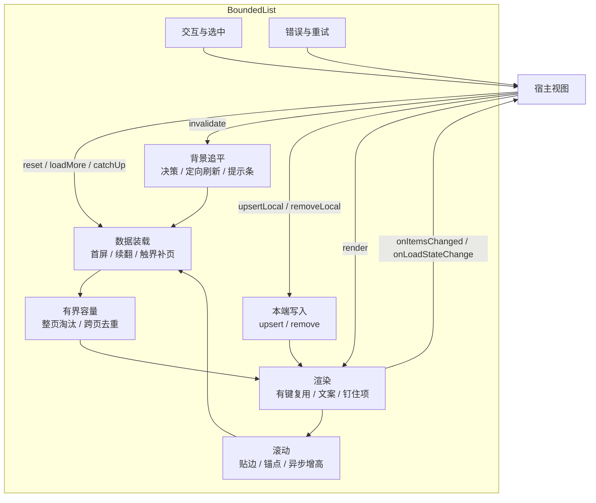
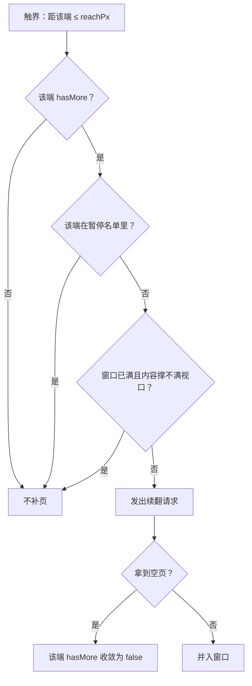
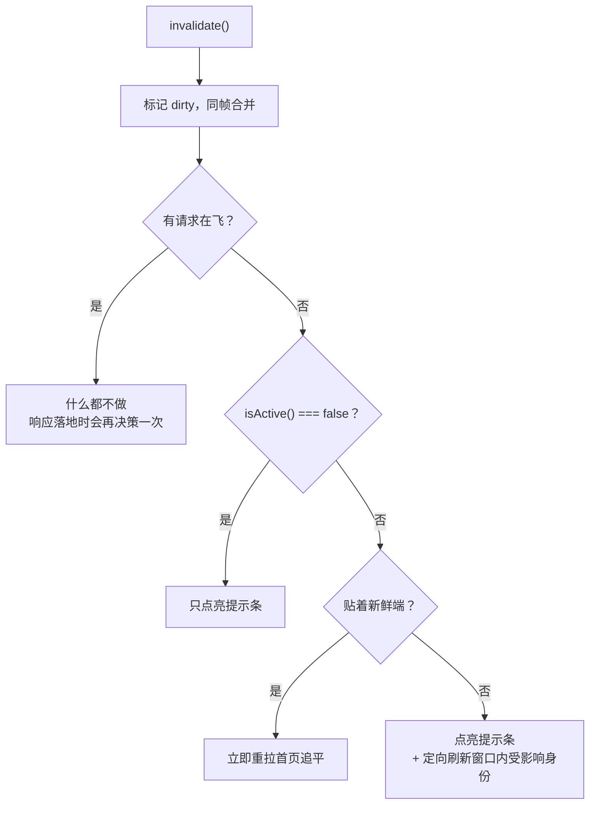

# BoundedList 功能说明

> 主要对照：`packages/uikit/src/app/bounded-list/`（`bounded-list.ts`、`page-window.ts`、`overlay.ts`、`renderer.ts`、`page-source.ts`、`selection.ts`、`frame.ts`、`deep-equal.ts`、`types.ts`、`index.ts`）与 `packages/uikit/src/app/views/`（含宿主侧的 `list-pill.ts`、`local-page-source.ts`、`utils.ts` 的 `debounce`）。
> 最后复核：2026-08-23。
> 触发更新：组件新增 / 删除 / 改变任何一项对外可观察行为时同步更新本文的功能清单与「不做的事」。
> 入口关系：专题索引见 [`README.md`](README.md)；整体模型见 [`导读.md`](导读.md)，参数与状态的精确口径以 [`组件设计.md`](组件设计.md) 为准，接入方式见 [`生产集成.md`](生产集成.md)。
>
> **本文回答「它到底能做什么、什么时候自动做、什么坚决不做」**，按功能逐项展开，并给出每项功能的开关与单一事实源章节；签名、字段表不在这里重复。

## 目录

- [1. 一句话与硬预算](#1-一句话与硬预算)
- [2. 功能全景](#2-功能全景)
- [3. 功能清单总表](#3-功能清单总表)
- [4. 数据装载](#4-数据装载)
- [5. 有界容量](#5-有界容量)
- [6. 背景变化追平](#6-背景变化追平)
- [7. 本端写入](#7-本端写入)
- [8. 渲染](#8-渲染)
- [9. 滚动](#9-滚动)
- [10. 交互与选中](#10-交互与选中)
- [11. 查询条件](#11-查询条件)
- [12. 错误与重试](#12-错误与重试)
- [13. 状态上报](#13-状态上报)
- [14. 生命周期](#14-生命周期)
- [15. 内置数据源](#15-内置数据源)
- [16. 明确不做的事](#16-明确不做的事)
- [17. 参数 → 功能索引](#17-参数--功能索引)
- [18. 最小可用接线](#18-最小可用接线)

---

## 1. 一句话与硬预算

**给定「怎么取一页」和「怎么画一行」，BoundedList 负责一个可滚动列表的其余全部：分页、窗口裁剪、渲染复用、滚动保持、背景追平、本端写入、选中态、错误态与释放。**

它不认识业务（不知道什么是消息、什么是会话），不订阅 SDK，不发起除 `PageSource` / `fetchByIdentity` 以外的任何请求。

硬预算是它区别于「普通分页列表」的地方，且是恒等式而不是尽力而为：

```
渲染行数 ≤ pageSize × maxPages   （权威窗口）
         + pageSize              （本地层上限）
         + pinnedItems().length  （调用方自己钉的条目，调用方自己保证有界）
```

与后端总量无关：后端有 10 条还是 1000 万条，内存和 DOM 都是同一个常数。

## 2. 功能全景



## 3. 功能清单总表

| # | 功能 | 自动发生？ | 开关 / 参数 | 详见 |
|---|---|---|---|---|
| 1 | 首屏加载 | 否，宿主调 `reset()` | `source`、`pageSize` | [§4.1](#41-首屏加载) |
| 2 | 双向续翻 | 是（滚动触界） | `autoLoad`、`reachPx`、`loadMore()` | [§4.2](#42-双向续翻) |
| 3 | 自动补满视口 | 是 | `autoLoad`、`reachPx` | [§4.3](#43-自动补满视口) |
| 4 | 请求单飞与旧响应作废 | 是 | 无（恒定行为） | [§4.4](#44-请求单飞与旧响应作废) |
| 5 | 整页淘汰 | 是 | `maxPages` | [§5.1](#51-整页淘汰) |
| 6 | 跨页去重 | 是 | `identityOf` | [§5.2](#52-跨页去重与超页校验) |
| 7 | 每页归一化 | 是（若提供） | `normalize` | [§5.3](#53-每页归一化) |
| 8 | 轻通知追平决策 | 是 | `invalidate()`、`isActive` | [§6.1](#61-追平决策) |
| 9 | 定向刷新（不重排） | 是（若提供） | `fetchByIdentity` | [§6.2](#62-定向刷新) |
| 10 | 「有更新」状态 | 是 | `state.stale`、`catchUp()`（提示条 DOM 在宿主侧） | [§6.3](#63-有更新状态与宿主提示条) |
| 11 | 宿主广播注册 | 是 | `register`、`standaloneList` | [§6.4](#64-宿主广播注册) |
| 12 | 乐观写入与置顶 | 否，宿主调 `upsertLocal()` | 无 | [§7](#7-本端写入) |
| 13 | 本地删除 | 否，宿主调 `removeLocal()` | 无 | [§7](#7-本端写入) |
| 14 | 有键行复用 | 是 | `identityOf`、`render()` | [§8.1](#81-有键行复用) |
| 15 | 钉住项 | 是 | `pinnedItems` | [§8.2](#82-钉住项) |
| 16 | 六种状态文案 | 是 | `text` | [§8.3](#83-状态文案) |
| 17 | 批前准备回调 | 是（若提供） | `beforeRender` | [§8.4](#84-批前准备与行上下文) |
| 18 | 滚动锚点保持 | 是 | 无（恒定行为） | [§9.1](#91-滚动锚点保持) |
| 19 | 贴边跟随与异步增高校正 | 是 | `order` | [§9.2](#92-贴边跟随) |
| 20 | 指针按下期间推迟重建 | 是 | 无（恒定行为） | [§9.3](#93-指针按下期间推迟重建) |
| 21 | 点击激活 | 是 | `onActivate` | [§10.1](#101-点击激活) |
| 22 | 单选 / 多选 / 上限 | 是（若配置） | `selection` | [§10.2](#102-选中态) |
| 23 | 跨实例共享选中集 | 是（若配置） | `selection.store` | [§10.2](#102-选中态) |
| 24 | 换查询条件重拉 | 是 | `reset({ query })`（防抖在宿主侧） | [§11](#11-查询条件) |
| 25 | 五段式错误处理 | 是 | `onError`、`text.error` | [§12](#12-错误与重试) |
| 26 | 失败端自动补页暂停 | 是 | 无（恒定行为） | [§12.2](#122-失败端暂停与解除) |
| 27 | 只读状态与四类回调 | 是 | `getState()`、`on*` | [§13](#13-状态上报) |
| 28 | 幂等释放 | 否，宿主调 `dispose()` | 无 | [§14](#14-生命周期) |
| 29 | 服务端游标分页数据源 | — | `sdkPageSource` | [§15.1](#151-sdkpagesource) |
| 30 | 本地全量切片数据源 | — | `views/local-page-source.ts`（宿主侧） | [§15.2](#152-localpagesource宿主侧) |

## 4. 数据装载

### 4.1 首屏加载

`reset()` 清空窗口与本地层，以 `cursor: undefined` 拉第一页，落地后默认贴回新鲜端。切换会话、切换筛选、首次进入都走它。

- 新页先落在一个**临时窗口**上，`normalize` 与超页校验都可能抛错，成功了才替换可见窗口——失败不会污染当前画面。
- 追平（组件内部的 `refresh`）与 `reset` 是同一段代码，只差「清不清空」：追平保留当前窗口直到新首页落地，所以**追平期间不闪空**。
- 首屏未落定时渲染 `text.loading()`；落定后为空则渲染 `text.empty()`。

### 4.2 双向续翻

两端都能续翻，用的是各自那一端的游标锚点：

| 端（组件与 wire 协议同名） | 请求参数 | 触发方式 |
|---|---|---|
| `backward` | `backward: true` | 滚动到距顶 `reachPx` 内，或 `loadMore('backward')` |
| `forward` | `backward: false` | 滚动到距底 `reachPx` 内，或 `loadMore('forward')` |

游标对组件完全不透明：只保存与回传，从不解析或拼接。**该端拿不到锚点（空游标）时直接放弃这次续翻**，不会发出语义未定义的空游标请求。

### 4.3 自动补满视口

触界检测在每次渲染后和每个滚动帧执行，目的只有一个：把视口填满。它在任何服务端行为下都必然终止，靠三道闸：



- **空页强制收敛**：拿到空页即把该端 `hasMore` 置 false，服务端违约（空页却说还有更多）也不会无限补页。
- **失败暂停**：见 [§12.2](#122-失败端暂停与解除)。
- **满窗短路**：窗口已满且内容仍撑不满视口（列表被隐藏、行高为 0）时不再自动补页——补进来的一页只会把另一端等量淘汰，两端会永远互相补页。宿主显式 `loadMore()` 不受此限制。

`autoLoad: false` 关掉触界自动补页（此后只有显式 `loadMore(edge)` 能续翻），测试要逐页断言时用它，生产不传。它与 `reachPx` 是两件事：一个决定「补不补」，一个决定「多近算触界」，所以不合并成「`reachPx` 传负值即关闭」那种魔法值。

### 4.4 请求单飞与旧响应作废

同一时刻只有一个分页请求在飞：

| 场景 | 行为 |
|---|---|
| 首页请求（`reset` / 追平） | 抢占：推进窗口世代，在飞的续翻响应落地时被整体丢弃 |
| 续翻请求，且已有请求在飞 | 直接放弃（触界检测每帧都会重来，下一帧自然补上） |
| 定向刷新 | 不占用单飞锁（不动游标、不改顺序），只受世代约束 |
| 重复的追平 | 合并到在飞的那一次；用户点提示条产生的「贴边意图」会并进去，不会被丢掉 |

**过期响应一律整体丢弃，不触发任何回调**——不会出现「旧查询的结果覆盖新查询的窗口」。

## 5. 有界容量

### 5.1 整页淘汰

窗口最多保留 `maxPages` 页。往一端并入新页导致超限时，从**对端整页弹出**，并把对端的续翻游标改回淘汰后的位置、`hasMore` 置 true——被淘汰的数据随时能翻回来。

淘汰以整页为单位而不是逐条，是因为游标是按页给的：留半页就没有对应的锚点可用。

### 5.2 跨页去重与超页校验

- 并入新页前，先把新页里出现过的身份从窗口既有页里摘掉，保证同一身份在渲染序列里**至多出现一次**。
- 一页经 `normalize` 后超过 `pageSize` 条时抛 `RangeError`，该次请求进入失败态——这是对数据源违约的硬校验，防止「有界」被悄悄突破。
- 因去重、就地删除或 `normalize` 过滤而变空的页会被丢弃，两端锚点独立维护，所以空页不会白占 `maxPages` 名额。

### 5.3 每页归一化

`normalize(items)` 对**服务端返回的整页**做排序 / 去重 / 过滤，**不作用于本地层**：本地层的条目按定义就落在新鲜端，不参与排序，让它过 `normalize` 只会带来「一条乐观消息因为还没分配 seq 被排到中间」这类惊喜。

## 6. 背景变化追平

### 6.1 追平决策

`invalidate()` 是轻通知的**唯一入口**，只说「有变化」，怎么追平由组件一处决策：



三个入口会重新叫醒决策：`invalidate()` 本身、请求落地（成功或失败都算）、用户滚回新鲜端。

「有请求在飞时不点亮提示条」是刻意的：那样点亮的提示条会在响应落地后立刻熄灭，用户看到的是闪一下。

### 6.2 定向刷新

`invalidate({ identities })` 且提供了 `fetchByIdentity` 时，落在窗口内的那些身份会被**就地换成最新值**（拉不到即视为已删除，就地摘掉），不重排、不动游标、不打断用户浏览。窗口外的身份不发请求。

定向刷新不需要任何防覆盖记账：它只写窗口，而本地层在渲染时永远盖在窗口之上。

### 6.3 「有更新」状态与宿主提示条

**组件不画提示条**，它只做两件事：在 `getState()` 里报 `stale`（有未追平的变化）与 `failed`（首屏失败），并提供 `catchUp()` 这一个追平入口。

`stale` 刻意是**布尔而不是计数**：「有几条待处理更新」「刷新失败了」「被容量裁掉了几条」是三件不同的事，合成一个数字对用户既不准也没意义。它自动熄灭有两条路径：追平成功；用户自己滚回新鲜端（滚动帧发现贴边就会重新决策，决策的结果就是追平）。

宿主侧的 `views/list-pill.ts` 把提示条接线收成两行：

```ts
const pill = createListPill(host, () => list.catchUp(), {
  updated: () => app.t('chat.listUpdated'),
  retry: () => app.t('common.retry'),
});
// 组件配置里：
onLoadStateChange: (state) => pill.sync(state),
```

| 状态 | 显示 | 点击（都是 `catchUp()`） |
|---|---|---|
| 首屏失败 | `retry()`（不提供则不显示） | 首屏从未成功过 → 重拉首页；否则追平 |
| 有未追平的变化且提供了 `updated()` | 显示 | 贴回新鲜端并立刻追平 |
| 其它 | 隐藏 | — |

**为什么不在组件里**：十二个生产列表里只有五个要提示条。提示条留在组件里的那段时间，十二个实例全都配了 `text.retry`，但其中七个传了 `pillHost: false` —— 那七处文案永远不显示，首屏失败后用户根本没有重试入口，且没人察觉。这类「配了却不生效」的死配置，正是组件替宿主决定 UI 的代价。

### 6.4 宿主广播注册

构造时必须把自己登记到宿主的注册表（`register`），宿主据此在重连成功等时机广播 `invalidate()`。同一页面可以并存多个 AppInstance（嵌入式 UIKit 多格子），它们的列表 `id` 完全相同，所以注册表实体由宿主持有，组件不做进程级注册。

不接入广播的一次性列表（弹窗内的候选列表）显式传 `standaloneList`，让「不注册」成为可 grep 的决定，而不是漏写参数的副作用。

## 7. 本端写入

| 命令 | 语义 | 副作用 |
|---|---|---|
| `upsertLocal(item)` | 该身份以本地值渲染，且位置固定在新鲜端 | 无网络请求、不点亮提示条、不修改权威窗口 |
| `removeLocal(id)` | 该身份不再渲染（窗口与钉住项两段都不渲染），返回删除前是否可见 | 同上；顺带摘掉它自己那一条的选中态 |

三条要点：

1. **窗口里已有同身份时，`upsertLocal` 等价于「移到新鲜端并改内容」**——发消息后会话置顶就是这条语义，宿主不需要为此做任何额外的事。
2. **与在飞请求完全解耦**：无论此刻有没有请求在飞，本地写入都立即可见，且不会被这次响应吞掉（响应只替换窗口，本地层在渲染时叠加在上面）。
3. **生命周期只有一条规则**：一次覆盖首页的请求落地后，比它更早的本地记账全部作废——远端已经给出了包含这段时间的新事实，本地猜测让位。所以本地层不会无限积累，也不需要逐条判断「服务端确认了没有」。

本地层自带 `pageSize` 条上限（兜底，正常场景只有个位数），超出时静默丢弃最旧一条。

删除对**当前还看不见的身份**同样记一笔（此时 `removeLocal` 返回 `false`）：随后的续翻可能把这一页拉进窗口，这笔记账保证它不会被重新拉回来，直到下一次首页追平让位给服务端事实。

用户本来就贴在新鲜端时，本端写入会跟着贴过去（新条目立刻可见）；用户在浏览历史时不动画面。

## 8. 渲染

### 8.1 有键行复用

按 `identityOf` 协调 DOM，只插入 / 移动 / 删除真正变化的节点：

| 判据 | 效果 |
|---|---|
| 条目数据与行上下文都没变 | 直接复用旧节点，**连 `renderItem` 都不跑** |
| 只有行上下文变了（上一条身份、选中态），跑完 `renderItem` 产出的 DOM 与旧节点完全等价 | 仍复用旧节点（不换 DOM，行内状态不丢） |
| 其它（含**条目数据变了但产出 DOM 恰好一致**） | 用新节点替换 |

「数据没变」用结构比较（只看结构不看引用），因此每轮传入新对象的调用方也能命中复用。

**条目数据一变就一定换节点**，哪怕新旧 DOM 长得一模一样：宿主可以在 `renderItem` 里给行挂自己的监听，那些回调闭包着**当时那个条目**，留着旧节点就等于留着一个绑在旧数据上的回调。这条判据对内部数据更新和显式 `render()` 完全一致，没有第二套规则。

`render()` 是宿主的显式重绘入口：每一行都重跑 `renderItem`。展示名、头像等**组件不知道的外部状态**变化时调用它，不要用 `reset()`——后者会重新发请求并重排。

### 8.2 钉住项

`pinnedItems()` 返回的条目钉在头部、不进窗口、不参与分页与淘汰。窗口或本地层里已经出现过的身份，pinned 一律让位（占位会话在真实条目落库后就不该继续钉在头部）；被 `removeLocal()` 删掉的身份也不再钉——否则删除会「删掉一帧又被钉回来」。

渲染、点击命中、选中快照、`onItemsChanged` 共用同一份序列，保证「看到的」「点到的」「报出去的」完全一致。

### 8.3 状态文案

六种文案全部可选、全部是取值函数（便于跟随语言切换实时求值）：

| 文案 | 出现时机 |
|---|---|
| `loading()` | 首屏未落定，或某一端正在续翻 |
| `empty()` | 渲染序列为空 |
| `backwardBoundary()` / `forwardBoundary()` | 该端确实没有更多且列表非空 |
| `error(err)` | 首屏失败且序列为空；不提供则回退到空态文案 |

「有更新」与「重试」的文案不在这里：它们属于宿主的提示条（见 [§6.3](#63-有更新状态与宿主提示条)）。

「无数据」与「无搜索结果」的区分由调用方在 `empty()` 里自己给——它手里就握着搜索框；组件不去猜「什么算已过滤」。

### 8.4 批前准备与行上下文

- `beforeRender(items)`：每轮渲染开始前调用一次，带上本轮完整序列（序列为空时不调用）。用于批量预取展示名、算一次分组基准。
- `renderItem(item, ctx)`：`ctx` 给出身份、是否选中、是否可选、**渲染序列里的上一条**（画日期分隔、连续气泡合并用）。

行上下文**刻意不含行下标**：下标会随头部插页整体平移，一旦进入复用判定，插一页就让整窗口失去复用、每一行都重跑 `renderItem`。需要「按整批数据准备一次」的场景用 `beforeRender`。

## 9. 滚动

### 9.1 滚动锚点保持

渲染前捕获锚点（第一条底边仍在视口内的行 + 它相对视口顶的偏移），渲染后按同一身份的新位置校正 `scrollTop`。**头部插入一整页时，用户眼前的内容不跳**。

拿不到锚点（空列表、首屏、宿主 DOM 不支持布局查询）时退回「恢复渲染前的绝对 `scrollTop`」。两者是「精确」与「兜底」的关系，不叠加。

### 9.2 贴边跟随

`order` 决定新鲜端在哪一端（`desc → backward` 端，如会话；`asc → forward` 端，如消息），并由此决定：贴边阈值、贴边校正帧数，以及贴边时 `scrollTop` 取 0 还是 `scrollHeight`。

- 用户贴在新鲜端时，追平与本端写入都会把画面跟着贴过去；离开新鲜端时画面不动。
- 列表内任意元素触发 `load`（图片、头像加载完成）且此前贴在尾部新鲜端时，重新贴回底部。

**「是否贴边」有两个读法，用错就是一类 bug**，判据是「读的这一刻，布局是用户滚出来的，还是组件自己刚动过的」：

| 读法 | 用在哪 | 为什么 |
|---|---|---|
| 现算 | 滚动帧、追平决策、`getState().atFreshEdge`、本端写入**之前** | 布局是用户滚出来的，现算就是真实位置 |
| 缓存（变化之前的那次观测） | 图片异步增高之后、首页整窗替换之后 | 内容已经变高 / 换过，现算必然把「本来贴着底」误判成「已经滚离底部」 |

缓存值只被三类动作写：用户的原生滚动（同步回调，早于本帧任何重排）、组件自己把画面贴过去、以及本端写入与首页请求的落点判断。

### 9.3 指针按下期间推迟重建

指针按下期间到达的重渲染会被积压，待指针抬起后的下一帧再应用。否则整列表重建会销毁鼠标按下的那一行节点，使抬起落到新节点上，浏览器因「按下与抬起不在同一节点」而不再派发 click，点击被静默吃掉。

指针在列表之外抬起也算数（window 上有兜底监听），不会让列表卡在「永远推迟」的状态。

## 10. 交互与选中

### 10.1 点击激活

行内点击通过事件委托沿父链上溯定位身份，命中后回调 `onActivate(item, ev)`。宿主不需要给每一行挂监听，也不需要在重建 DOM 后重挂。

### 10.2 选中态

| 模式 | 行为 |
|---|---|
| 不配置 `selection` | 点击只激活，行上下文里 `selected` 恒为 false、`selectable` 恒为 true |
| `single` | 点击把选中集替换为仅含该身份，并照常激活 |
| `multi` | 点击翻转该身份；达 `max` 且当前未选中时拒绝并回调 `onExceed()` |

- **上限没有绕过路径**：无论从复选框还是行内其它区域触发，多选都统一走同一个上限检查。
- 达上限时未选中的行会拿到 `selectable: false`，宿主据此禁用它们。
- 多个列表可以共享同一个 `SelectionStore`（转发弹窗的两个 tab）：任一实例改动它，所有共享实例自动重渲并各自上报快照，宿主不需要手工互调 `render()`。共享 store 时不能再传 `max`（上限由 store 自己决定，同时给出构造期抛错）。
- `removeLocal` 只摘掉被删的那一条身份的选中态，共享 store 的其它实例不受牵连。

## 11. 查询条件

`reset({ query })` 换查询条件并立即重拉首页。查询条件原样透传给数据源（组件不解释它的内容），初始值由 `initialQuery` 给出。连续切换时，先发的响应即使晚到也会被世代作废，不会覆盖新查询的窗口。

**防抖在宿主侧**：「输入停顿多久才查」是搜索框的交互决定，与「列表怎么分页」无关——同一个列表在不同宿主里完全可以要不同的节奏，甚至不要防抖。`views/utils.ts` 的 `debounce` 提供这一层：

```ts
const search = debounce((keyword: string) => void list.reset({ query: { keyword } }));
input.addEventListener('input', () => search(input.value.trim()));
// 清空关键字、按回车这类明确意图不该等：
input.addEventListener('keydown', (e) => { if (e.key === 'Enter') search.flush(input.value.trim()); });
// 宿主销毁时：
search.cancel();
```

## 12. 错误与重试

### 12.1 四个阶段各自的表现

| 阶段 | 表现 |
|---|---|
| `reset`（清空重拉首页） | 进入失败态并**照常落定**（空态 / 错误态要显示得出来，不能永远转圈）；序列为空时显示错误文案，提示条变重试入口 |
| `catchup`（保留窗口重拉首页） | 状态同上，但**窗口里的旧内容还完整摆着**，用户看到的不是空列表 |
| `backward` / `forward`（续翻） | 该端加入暂停名单，窗口不变，已显示的内容不受影响 |
| `refresh`（定向刷新） | 只上报，窗口不变 |

`reset` 与 `catchup` 发的是同一种首页请求，但对宿主是两回事：**`reset` 失败意味着用户面前这块列表没内容（该弹提示），`catchup` 失败只是后台追平没成功（该静默）**。消息列表正是靠这个区分决定要不要弹 toast——合成一个取值，宿主就只能在「网络抖一下也弹一次错」和「首屏空白却一声不吭」之间二选一。

全部错误都经 `onError(error, phase)` 上报；没有 `onError` 时降级为 `console.warn`。`reset()` / `loadMore()` 返回的 Promise **永远 resolve**，不产生未处理拒绝。

**首屏失败不自动重试**，避免把一次故障放大成请求风暴：此刻提示条就是重试入口，等用户点击或下一次 `invalidate()`。请求期间到达的通知不会被这次失败吞掉——失败落地后会重新决策一次。

### 12.2 失败端暂停与解除

某端续翻失败后加入暂停名单，防止「失败 → 重渲 → 触界 → 立刻重试」在微任务里死循环。三种方式解除：用户把该端滚离触界范围、宿主显式 `loadMore(edge)`、重新拉首页。

用户滚离失败现场再滚回来时可以自然重试，所以既不会死循环，也不需要额外的重试按钮。

## 13. 状态上报

`getState()` 随时可读，同一份状态也通过 `onLoadStateChange` 主动上报：

| 字段 | 含义 |
|---|---|
| `loaded` | 首屏是否已落定（**失败也算落定**） |
| `loading` / `loadingBackward` / `loadingForward` | 有没有请求在飞、是不是某端的续翻 |
| `hasMoreBackward` / `hasMoreForward` | 该端还有没有数据 |
| `count` | 当前渲染序列长度（含钉住项与本地层） |
| `total` | 服务端声明的总量，未知为 -1 |
| `stale` | 有未追平的变化（宿主据此决定要不要提示） |
| `atFreshEdge` | 当前是否贴在新鲜端（现算几何） |
| `failed` | 首屏是否处于失败态（成功一次即回到 false） |

另外三个回调：`onItemsChanged(items)`（渲染序列变化，含钉住项与本地层）、`onSelectionChange(snapshot)`（选中集变化，`items` 与渲染序列同序）、`onError(error, phase)`。

## 14. 生命周期

- 构造即登记到宿主注册表，构造期校验参数（`pageSize` / `maxPages` 非法、`pageSize × maxPages` 溢出安全整数、`selection.store` 与 `selection.max` 同时给出都会抛错）。
- `dispose()` 注销**全部** DOM 监听（含 window 级的指针兜底）、取消排队的帧任务、清空本地层、从注册表注销。宿主自建的提示条与防抖由宿主一并释放。
- `dispose()` 幂等；之后所有命令式接口都是空操作，在飞响应落地也不再触碰 DOM。

弹窗、面板、页面销毁时必须 `dispose()`；同一宿主重建同名列表前先释放旧实例。

## 15. 数据源

### 15.1 sdkPageSource（组件内置）

服务端 keyset 游标分页：请求原样透传给 SDK，响应里的 `page` 也按同名字段搬进来，调用方只需回答「条目在响应的哪个字段」。组件与 wire 协议共用 `backward`/`forward` 一套方向词汇，全程没有方向转换。

### 15.2 localPageSource（宿主侧）

实现在 `packages/uikit/src/app/views/local-page-source.ts`。一次性把全量拉到内存，之后所有续翻都是对内存数组的下标切片，只有下一次首页请求（`reset`）才重新拉取。**仅用于「刻意选择在客户端过滤 / 排序」的低频弹窗**（提及群成员、添加群成员候选），`loadAll` 必须自带条目安全上限。

它不在组件里：组件的正常形态是「数据在服务端，一次取一页」，这里的数据一开始就全在内存里，分页只是为了复用组件的渲染、选中与交互能力——是宿主选择了在客户端过滤，不是组件提供了这种能力。

游标编码（下标字符串）是内部实现细节，不外传给服务端，不违反「游标对客户端不透明」的项目不变量。首页取哪一端由请求里的 `freshEdge` 决定，所以不需要再配一份展示序，也就没有「两处 `order` 必须一致、不一致就静默取错端」这种跨对象隐式契约。

## 16. 明确不做的事

功能边界写在这里，避免把它当成「万能列表」：

| 不做 | 原因 / 替代 |
|---|---|
| 虚拟滚动（只渲染可视区 + spacer 撑高） | 需要预估行高，聊天消息行高差异极大；有界窗口 + 整页淘汰已经把 DOM 规模压到常数 |
| 键盘导航、`role` / `aria-selected` / `tabindex` | 组件没有键盘导航，写这些属性等于给出一个无法用键盘操作的 listbox 承诺；容器与行的语义交给宿主 |
| 订阅 SDK 事件、理解业务语义 | 事件路由与业务规则留在宿主（例如「当前会话被删除后关闭详情」） |
| 解析、拼接或推断游标 | 游标对组件不透明，只保存与回传 |
| 判断「什么算已过滤」 | 空态与「无搜索结果」的区分由调用方在 `empty()` 里给 |
| 「有 N 条新消息」计数 | 待处理更新数、刷新失败、被容量裁掉的条目是三件事，合成一个数字不准也没意义 |
| 本地写入进权威窗口 | 那就必须回答「响应落地时怎么把本地改动放回去」，会长出一整套重放机制 |
| 两端并发分页 | 并发状态从 1 个字段变成 4 个，收益只是极少数场景快一帧 |
| 首屏失败后自动重试 | 会把一次故障放大成请求风暴；宿主的提示条即重试入口 |
| 排序、过滤、分组等数据加工 | 整页归一化交给 `normalize`，其余是宿主的数据职责 |
| 管理 `scrollElement` 之外的 DOM | 组件写入的 DOM 全部在 `scrollElement` 内，一个节点都不多 |

## 17. 参数 → 功能索引

| 参数 | 打开 / 影响的功能 |
|---|---|
| `id` | 注册表标识、错误日志 |
| `scrollElement` | 全部渲染与滚动功能的宿主容器 |
| `register` / `standaloneList` | [宿主广播注册](#64-宿主广播注册) |
| `isActive` | [追平决策](#61-追平决策)里的「列表不可见」分支 |
| `source` | [数据装载](#4-数据装载)全部 |
| `pageSize` / `maxPages` | [有界容量](#5-有界容量)、本地层上限 |
| `fetchByIdentity` | [定向刷新](#62-定向刷新)（不提供则只点亮 `stale`） |
| `normalize` | [每页归一化](#53-每页归一化) |
| `identityOf` | 去重、锚点、定向刷新、本地记账、选中态、行复用 |
| `order` | [贴边跟随](#92-贴边跟随)、本地层落点、首页贴边方向 |
| `autoLoad` | [自动补满视口](#43-自动补满视口)总开关 |
| `reachPx` | 距某端多少像素内算触界 |
| `beforeRender` / `renderItem` / `pinnedItems` | [渲染](#8-渲染) |
| `text` | [状态文案](#83-状态文案) |
| `selection` | [选中态](#102-选中态) |
| `initialQuery` | [查询条件](#11-查询条件) |
| `onActivate` / `onSelectionChange` / `onLoadStateChange` / `onItemsChanged` / `onError` | [状态上报](#13-状态上报)、[点击激活](#101-点击激活) |

## 18. 最小可用接线

```ts
const list = createBoundedList<Contact>({
  id: 'contacts',
  scrollElement: scroller,
  register: (instance) => app.registerBoundedList(instance),
  pageSize: 20,
  maxPages: 3,
  source: sdkPageSource(
    (req) => app.client.getContacts({ cursor: req.cursor, backward: req.backward, limit: req.limit }),
    (raw) => raw.contacts,
  ),
  identityOf: contactIdentity,
  renderItem: (contact, ctx) => [renderContactRow(contact, ctx.selected)],
  text: {
    loading: () => app.t('common.loading'),
    empty: () => app.t('contacts.empty'),
  },
  onActivate: (contact) => openContact(contact),
});

await list.reset();          // 首屏
list.invalidate();           // 收到该列表的变化通知
list.upsertLocal(contact);   // 本端写入，立即可见并落到新鲜端
list.dispose();              // 视图销毁
```

需要「有更新 / 重试」提示条时，宿主再接一层（见 [§6.3](#63-有更新状态与宿主提示条)）：

```ts
const pill = createListPill(scroller.parentElement, () => list.catchUp(), {
  updated: () => app.t('common.hasUpdate'),
  retry: () => app.t('common.retry'),
});
// 加进上面的 createBoundedList 配置：
onLoadStateChange: (state) => pill.sync(state),
// 视图销毁时与 list.dispose() 一起：
pill.dispose();
```

完整参数与签名见 [`组件设计.md` §5](组件设计.md#5-构造参数)，生产接线样例见 [`生产集成.md` §3](生产集成.md#3-接入步骤)。
