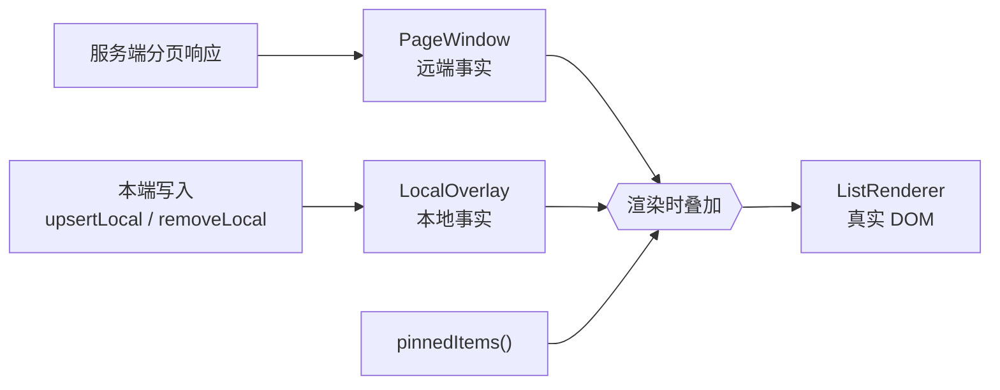
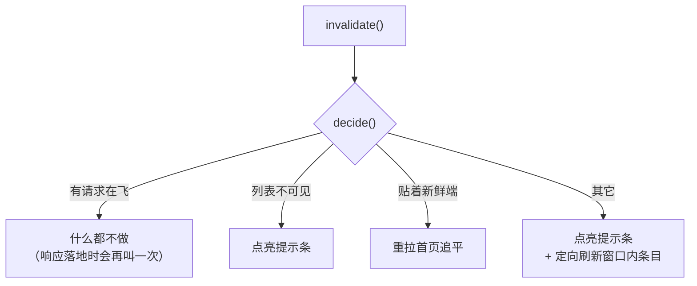
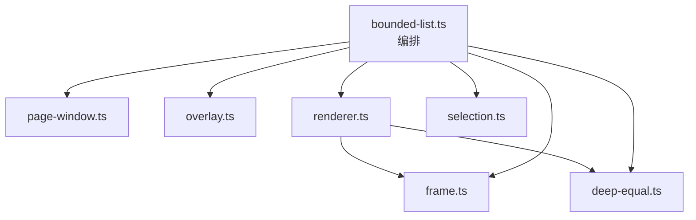
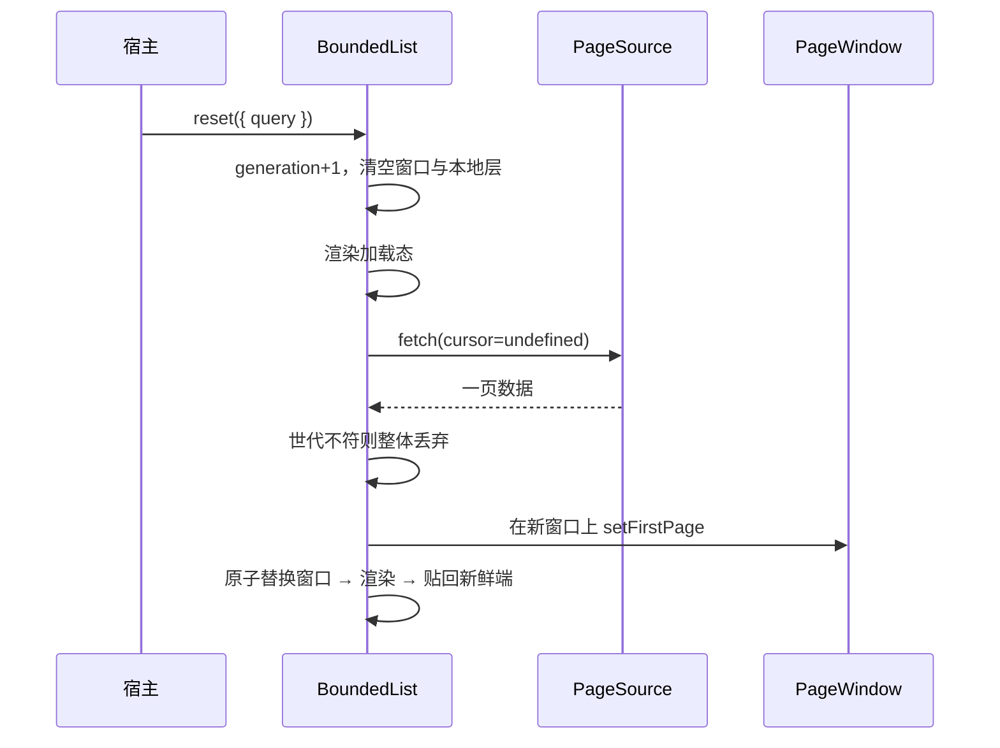

# BoundedList 代码导读

> 主要对照：`packages/uikit/src/app/bounded-list/` 全部 10 个文件，以及宿主侧的 `packages/uikit/src/app/views/list-pill.ts`、`local-page-source.ts`。
> 最后复核：2026-08-23。
> 触发更新：`bounded-list/` 文件增删、分层职责变化、核心心智模型或主线时序变化时同步更新。
> 入口关系：专题索引见 [`README.md`](README.md)；功能清单见 [`功能说明.md`](功能说明.md)，参数与状态的逐项口径见 [`组件设计.md`](组件设计.md)，接入方式见 [`生产集成.md`](生产集成.md)。
>
> **本文是给「要认真读一遍源码」的人写的**：它讲的是**为什么这样分层、按什么顺序读、每个文件解决哪一个问题**。逐项参数表在设计文档里，不在这里重复。

## 目录

- [1. 一句话是什么](#1-一句话是什么)
- [2. 核心心智模型：三个词](#2-核心心智模型三个词)
- [3. 文件地图与阅读顺序](#3-文件地图与阅读顺序)
- [4. 四条主线，读完就懂全局](#4-四条主线读完就懂全局)
- [5. 五条最该记住的不变量](#5-五条最该记住的不变量)
- [6. 为什么不是别的写法](#6-为什么不是别的写法)
- [7. 读代码时的常见疑问](#7-读代码时的常见疑问)

---

## 1. 一句话是什么

**BoundedList 是一个「无论后端有多少数据，内存和 DOM 都恒定」的分页列表组件。**

它替换了会话列表、消息列表、通讯录等十几处各写一遍的分页 + 滚动 + 刷新逻辑。它不认识业务：不知道什么是消息、什么是会话，也不订阅 SDK 事件。宿主给它一个「怎么取一页」的函数和一个「怎么画一行」的函数，它负责其余全部。

「有界」是硬约束，不是尽力而为：窗口最多 `maxPages` 页、每页最多 `pageSize` 条，本地层最多 `pageSize` 条，所以渲染出来的行数恒 ≤ `pageSize × (maxPages + 1)`，与后端总量无关。

## 2. 核心心智模型：三个词

读源码之前只需要记住三句话，它们直接对应 `bounded-list.ts` 文件头的三条规则。

### 2.1 两份事实：窗口 + 本地层

- `PageWindow` **只被服务端响应修改**。任何本地写入都碰不到它。
- `LocalOverlay` 只保存「还没被服务端确认的本端写入」，**渲染时才叠加上去**。
- 渲染序列 = `pinnedItems` + （窗口 叠加 本地层）。

这条边界是整个组件最重要的设计决定。因为本地写入从不进窗口，**服务端响应落地永远不会覆盖本地写入**，于是组件不需要任何「把本地改动重放回新窗口」的机制——没有重放，就没有「重放到哪个窗口、按什么顺序、该不该应用」这一大类问题。

本地层的生命周期只有一条规则：**一次覆盖首页的请求落地后，比它更早的本地记账全部作废**（`overlay.settle`）。远端已经给出了包含这段时间的新事实，本地猜测就该让位。

### 2.2 单飞：同一时刻只有一个分页请求

`loading` 字段既是状态也是锁，取值 `'first' | 'backward' | 'forward' | null`：

- 首页请求（`reset` / 追平）**抢占**：它推进 `generation`，在飞的续翻响应落地时会被整体丢弃；
- 续翻请求在有请求在飞时**直接放弃**——触界检测每帧都会重来，下一帧自然补上。

好处是并发状态从「两端各自的 loading + 权威请求 + 定向刷新」缩成一个字段，请求竞态只剩 `generation` 这一个判据。

### 2.3 一个决策点：只有 `decide()` 决定提示条

「收到通知之后做什么」全组件只有一处（`decide()`）：

「有请求在飞 → 什么都不做」这一条是有代价换来的：早前的实现会在这里先点亮提示条，结果响应一落地又立刻熄灭，用户看到的就是**发完消息后会话列表的「有更新」闪一下**。`stale` 只有 `decide()` / `setStale()` 写，就是为了让这种「有人在别处点亮」的情况不可能再发生。

## 3. 文件地图与阅读顺序

10 个文件，按建议阅读顺序排列。带 ★ 的三个是主干，其余是工具。

| 顺序 | 文件 | 行数量级 | 它解决的问题 |
|---|---|---|---|
| 1 | `types.ts` | 中 | 公共词汇：展示序、Edge、分页请求 / 结果、状态、构造参数 |
| 2 ★ | `page-window.ts` | 中 | 远端事实：整页并入、整页淘汰、跨页去重、两端续翻锚点 |
| 3 ★ | `overlay.ts` | 小 | 本地事实：put / drop 两种记账，叠加与作废 |
| 4 ★ | `bounded-list.ts` | 大 | 编排：命令式接口、请求单飞、追平决策、渲染快照 |
| 5 | `renderer.ts` | 中 | 视图：有键 DOM 协调、滚动锚点、触界检测、点击委托 |
| 6 | `page-source.ts` | 小 | 取页方式：服务端游标分页 |
| 7 | `selection.ts` | 小 | 可跨实例共享的选中集 |
| 8 | `frame.ts` | 小 | 同帧合并、可取消的调度器 |
| 9 | `deep-equal.ts` | 小 | 结构相等：判断某一行的数据与上下文变没变（渲染引擎的行复用判据） |
| 10 | `index.ts` | 小 | 公开导出面 |

两个曾经在这个目录里、现已移到宿主侧的模块：

| 文件 | 为什么不在组件里 |
|---|---|
| `views/list-pill.ts` | 提示条是 UI 决定。组件只报 `stale` / `failed` 并提供 `catchUp()`；十二个生产列表里只有五个要提示条 |
| `views/local-page-source.ts` | 「把内存数组冒充成分页源」是宿主的选择。组件的正常形态是「数据在服务端，一次取一页」 |

分层是单向的，没有回边：

`page-window.ts` 与 `overlay.ts` 是纯数据结构，不认识 DOM；`renderer.ts` 只认识 DOM，不认识分页与通知。**只有 `bounded-list.ts` 同时知道两边**——所以读它时的问题永远是「这一步在协调谁和谁」。

## 4. 四条主线，读完就懂全局

### 4.1 首屏：`reset()`

要点：新页先落在**一个临时窗口**上，`normalize` 和超页校验都可能抛错，成功了才替换可见窗口。追平（`refresh`）走同一段代码，只差 `clear=false`——不清空当前窗口，所以追平期间画面不会闪空。

### 4.2 续翻：触界 → `loadPage(edge)`

滚动帧里，`renderer` 判断某一端进入 `reachPx` 范围就回调 `loadMore(edge)`；组件按 `hasMore`、单飞锁、失败暂停三道闸决定要不要真的发请求。并入用 `window.extend(edge, page)`：先跨页去重，再决定占不占页位，最后从对端整页淘汰。

自动补页只为「把视口填满」服务：窗口已满且内容仍撑不满视口（列表被隐藏、行高为 0）时不再自动补页，否则两端会互相淘汰、永远停不下来。

### 4.3 通知：`invalidate()` → `decide()`

见 §2.3 的决策图。三个入口会重新叫醒决策：`invalidate()` 本身、请求落地、用户滚回新鲜端。

### 4.4 本端写入：`upsertLocal()` / `removeLocal()`

只做三件事：写一条本地记账、丢掉这条身份的定向刷新意图、重绘。**没有网络请求，没有提示条，没有窗口修改**。

值得注意的是 `upsertLocal` 对「窗口里已经有这个身份」的处理：本地层叠加时会把它从原位置摘掉、放到新鲜端。这正是「发完消息后该会话置顶」的语义，宿主不需要为此做任何额外的事。

## 5. 五条最该记住的不变量

改代码之前先确认没有破坏它们，测试也是围绕它们写的。编号沿用 [`组件设计.md` §13.1](组件设计.md#131-不变量) 的完整列表（共 9 条），这里只挑最容易被改坏的五条讲清楚「守在哪」：

| # | 不变量 | 守在哪 |
|---|---|---|
| I1 | 渲染行数 ≤ `pageSize × (maxPages + 1)`，与数据总量无关 | `PageWindow.evict` + `LocalOverlay` 的 limit |
| I3 | 同一身份在渲染序列里至多出现一次 | `PageWindow.dropIdentities` + `overlay.apply` 摘除 + `visibleItems` 的 pinned 去重 |
| I4 | 续翻只使用来自保留页的游标；拿不到锚点就不发请求 | `PageWindow` 的 `backwardCursor` / `forwardCursor` + `loadPage` 的空游标短路 |
| I5 | 过期响应一律整体丢弃，不触发任何回调 | `generation` + `isObsolete` |
| I9 | `dispose()` 之后监听全部归零、提示条 DOM 摘除、排队的帧任务不再触碰 DOM | `ListRenderer.dispose` + `UpdatePillHandle.dispose` + 各处 `disposed` 守卫 |

## 6. 为什么不是别的写法

| 备选方案 | 为什么没采用 |
|---|---|
| 虚拟滚动（只渲染可视区，用 spacer 撑高） | 需要预估行高，聊天消息行高差异极大（图片、引用、转发块）；有界窗口 + 整页淘汰已经把 DOM 规模压到常数，复杂度低得多 |
| 本地写入直接改窗口 | 那就必须回答「服务端响应落地时怎么把本地改动放回去」，会长出重放、重放顺序、重放条件一整套机制。见 §2.1 |
| 两端各自独立并发分页 | 并发状态从 1 个字段变成 4 个，收益只是极少数场景快一帧 |
| 提示条带「有 N 条新消息」计数 | 「几条待处理更新」「刷新失败」「被容量裁掉的」是三件事，合成一个数字对用户既不准也没意义 |
| 让宿主自己判断贴边、自己决定刷新 | 这正是组件化之前的状态：十几处各写一遍，行为互不一致 |

## 7. 读代码时的常见疑问

**Q：`Edge`（backward/forward）和 `order`（asc/desc）是什么关系？**
同一个比特的两种说法。`order` 只在构造时转换一次成「新鲜端在哪一端」（`this.edge`），此后组件内部只说 `backward`/`forward`——与 wire 协议、SDK `PageInfo` 完全同一套词汇，中间没有任何方向映射。

**Q：`stale`（提示条）和 `dirty` 有什么区别？**
`dirty` 是**输入**（收到了通知、还没做决策），`stale` 是**输出**（提示条该不该亮）。分开是必须的：请求在飞时 `dirty` 为真而 `stale` 必须为假，否则就是本文 §2.3 说的那次闪动。

**Q：为什么 `getState()` 要读 DOM？**
`atFreshEdge` 是几何量，只能现算。所以内部渲染路径不调用 `getState()`，只在需要上报状态时调用，避免在一次「读几何 → 写 DOM」之间反复触发同步重排。

**Q：滚动几何散落在几个地方？**
只有一处：`ListRenderer.distanceTo(edge)`（距该端多少像素）。贴边是它比 `STICKY_PX`，触界是它比 `reachPx`，别处不再出现 `scrollTop` / `scrollHeight` 的算式。

**Q：那为什么还有个缓存的贴边状态？**
公式只有一个，**读的时机**有两种。滚动帧、追平决策、`getState()` 读的是用户滚出来的布局，现算就准；而图片异步增高、首页整窗替换之后，布局是组件自己刚改过的，现算必然把「用户本来贴着底」误判成「已经滚离底部」，只能回头看变化之前的那次观测。判据是「读的这一刻，布局有没有被我们自己改过」，详见 [`组件设计.md` §9.3.1](组件设计.md#931-贴边有两套口径用错就是-bug)。

**Q：`normalize` 为什么只作用于服务端的整页？**
它的职责是「把一页整理成合法的一页」（排序、去重、过滤删除态）。本地层的条目按定义就落在新鲜端，不参与排序；让它也过 `normalize` 只会带来「一条乐观消息因为 seq 还没分配而被排到中间」这类惊喜。

**Q：定向刷新（`fetchByIdentity`）为什么不需要防覆盖记账？**
因为它只写窗口，而本地层在渲染时永远盖在窗口之上。一份晚到的定向刷新结果最多把窗口里的旧值写成另一个旧值，永远盖不住本地写入。

**Q：一次 `reset` 在飞时又来一次 `reset` 会怎样？**
后发的推进 `generation`，先发的响应落地时 `isObsolete` 为真、直接 return，不触发任何回调。`firstPageRun` 也被后发的覆盖，所以追平的重入合并总是合并到最新那一次。
