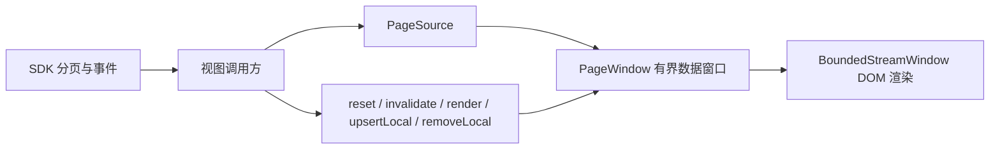

# BoundedList 生产集成指南

> 主要对照：`packages/uikit/src/app/bounded-list/`、`packages/uikit/src/app/views/`、`packages/uikit/src/app/main-app.ts`、`packages/uikit/src/app/app-instance.ts`、`packages/uikit/src/app-config.ts` 与 `packages/uikit/src/app/style.css`。
> 最后复核：2026-07-29。
> 触发更新：生产列表接入范围、SDK 事件路由、身份键、查询、生命周期、滚动容器或列表容量配置变化时同步更新。
> 入口关系：专题索引见 [`README.md`](README.md)；组件接口以 [`组件设计.md`](组件设计.md) 为准，视图交互概览见 [`../UI设计方案.md`](../UI设计方案.md)。

## 1. 集成边界

BoundedList 统一解决长列表的分页、窗口裁剪、渲染、滚动锚点、提示条、选中态和生命周期。它不理解消息、联系人等业务语义，也不直接订阅 SDK 事件。



列表数据和 DOM 节点都以 `pageSize × maxPages` 为硬预算。组件只渲染已加载窗口，不为未加载数据模拟高度；服务端剩余数据由双向 `hasMore` 和边界提示表达。

每个列表必须定义一个新鲜端：

- `head`：最新或最活跃条目在顶部，例如会话和联系人。
- `tail`：最新条目在底部，例如聊天消息。

背景变化仅在用户位于新鲜端时自动追平；否则保持视口并点亮更新提示，避免打断阅读。

## 2. 当前生产接入

| 场景 | 主要文件 | 数据源 | 身份键 | 新鲜端 |
|---|---|---|---|---|
| 会话列表 | `views/chat/conversation-list.ts` | `serverPageSource` | `conversationIdentity` | `head` |
| 消息列表 | `views/chat/message-list.ts` | `serverPageSource` | `messageKey` | `tail` |
| 通讯录好友 | `views/contacts.ts` | `serverPageSource` | `contactIdentity` | `head` |
| 待处理好友请求 | `views/contacts.ts` | `serverPageSource` | `contactIdentity` | `head` |
| 已发出好友请求 | `views/contacts.ts` | `serverPageSource` | `contactIdentity` | `head` |
| 群成员详情 | `views/chat/detail-panel.ts` | `serverPageSource` | 用户 ID | `head` |
| 转发会话候选 | `views/chat/forward.ts` | `serverPageSource` | 会话 key | `head` |
| 转发通讯录候选 | `views/chat/forward.ts` | `serverPageSource` | 会话 key | `head` |
| 建群候选 | `views/contacts.ts` | `serverPageSource` | 好友 UID | `head` |
| 添加群成员候选 | `views/chat/detail-panel.ts` | `localPageSource` | 用户 ID | `head` |
| 提及群成员 | `views/group-member-picker.ts` | `localPageSource` | 用户 ID | `head` |
| 会话内消息搜索 | `views/chat/message-search.ts` | `serverPageSource` | `messageKey` | `tail` |

消息多选继续由 `chatState.selectedMessageIds` 管理，因为消息行包含图片、引用块和动作按钮，整行点击切换选中会与这些交互冲突。其分页、裁剪、锚点和提示条仍由 BoundedList 负责。

全局搜索和组织架构浏览目前保留小规模一次性读取：前者按固定小数量展示两个结果分区，后者是树形管理界面。它们没有伪装成已分页列表；数据规模或交互变化时再独立评估接入。

## 3. 接入步骤

### 3.1 选择数据源

- 服务端已经提供不透明 keyset 游标时使用 `serverPageSource`，原样透传 `cursor`、`backward` 和 `limit`。
- 必须先全量取数、再在本地过滤或排序的低频弹窗使用 `localPageSource`；`loadAll` 必须有页数或条目安全上限。
- 不要在视图层解释或拼接服务端游标。

### 3.2 定义稳定身份

`identityOf` 同时用于跨页去重、滚动锚点、定向刷新和本地增删改，必须在条目生命周期内稳定。

- 消息使用 `msg_id`。
- 用户、群和组织联系人使用带类型的路由身份，不能只拼裸数字。
- 多个列表共享 `SelectionStore` 时必须使用同一身份空间。

### 3.3 登记宿主实例

生产 AppInstance 必须传入：

```ts
register: (instance) => app.registerBoundedList(instance) // 必填；弹窗内一次性列表用 standaloneList
```

同一页面可能挂载多个 AppInstance；模块级注册表只用于独立使用和单测。弹窗、面板或页面销毁时必须调用 `dispose()`，同一宿主重建同名列表前先释放旧实例。

### 3.4 提供渲染与文案

`renderItem` 只负责一行的业务 DOM。空态、错误态、边界提示和更新提示由 `BoundedListText` 统一提供。展示名和头像来自 SDK `DisplayInfoCache`；`display:updated` 到达后调用 `render()`，不重拉分页数据。

## 4. 宿主事件路由

| 业务变化 | 组件命令 | 说明 |
|---|---|---|
| 轻量通知，已知受影响身份 | `invalidate({ identities })` | 窗口内定向刷新；窗口外按新鲜端规则追平或标 stale |
| 轻量通知，不知道具体身份 | `invalidate()` | 由组件决定立即 reset 还是显示提示 |
| 当前条目的展示资料更新 | `render()` | 不发分页请求，不改变滚动位置 |
| 本端产生或乐观插入条目 | `upsertLocal()` | 同步守住硬预算；必要时进入权威追平 |
| 删除或撤销本地可见条目 | `removeLocal()` | 删除后按窗口规则补齐 |
| 会话、筛选或关键字变化 | `reset()` / `setQuery()` | 作废旧世代请求，旧响应不得覆盖新窗口 |

组件不订阅 SDK，这张表由 `main-app.ts` 与各视图实现。业务规则留在宿主，例如当前打开的会话被删除后关闭详情，不应进入通用组件。

## 5. DOM 与滚动约束

1. `scrollElement` 必须有确定高度和 `overflow-y: auto`。
2. 同时展示的两个分页区域不能共享一个滚动物理容器；好友请求的发出 / 收到分区因此使用各自的 `scrollElement`。
3. 不要设置 `overflow-anchor: none`；浏览器原生锚点作为图片和头像异步增高的兜底。
4. `contentElement` 被组件重建，业务监听应放在 `renderItem` 返回节点或交给组件事件委托。
5. 指针按下期间组件会推迟重建，避免 `pointerdown` 与 `pointerup` 落在不同节点而丢失点击。

## 6. 容量配置

容量默认值集中在 `packages/uikit/src/app-config.ts`：

| 范围 | 配置 | 当前含义 |
|---|---|---|
| 消息 | `chat.messagePageSize`、`chat.messagePageMaxPages` | 消息分页大小与保留页数 |
| 其它列表 | `list.pageSize`、`list.maxPages` | 会话、联系人、成员和候选列表的公共预算 |
| 全量成员读取 | `groupMemberPicker.maxPages` | `localPageSource` 防止游标不收敛的安全上限 |
| 选择上限 | `memberPicker.maxSelected`、`forward.maxTargets` | 建群与转发选择数量上限 |

修改容量、裁剪或大数据路径后，除全量正确性测试外还必须运行独立性能入口。测试矩阵和命令见 [`测试方案.md`](测试方案.md)。

## 7. 维护检查点

- 新增列表前先判断它是否可能超过一屏、是否分页、是否需要选中态；满足任一项时优先复用 BoundedList。
- 修改 `identityOf`、`freshEdge`、查询或事件路由时，同步更新本文件和对应视图测试。
- 修改组件参数、方法、状态或内部不变量时，以 [`组件设计.md`](组件设计.md) 为单一事实源。
- 发现浏览器缺陷时更新 [`缺陷列表.md`](缺陷列表.md)，保留正确期望断言；完整回归要求见 [`测试方案.md`](测试方案.md)。
