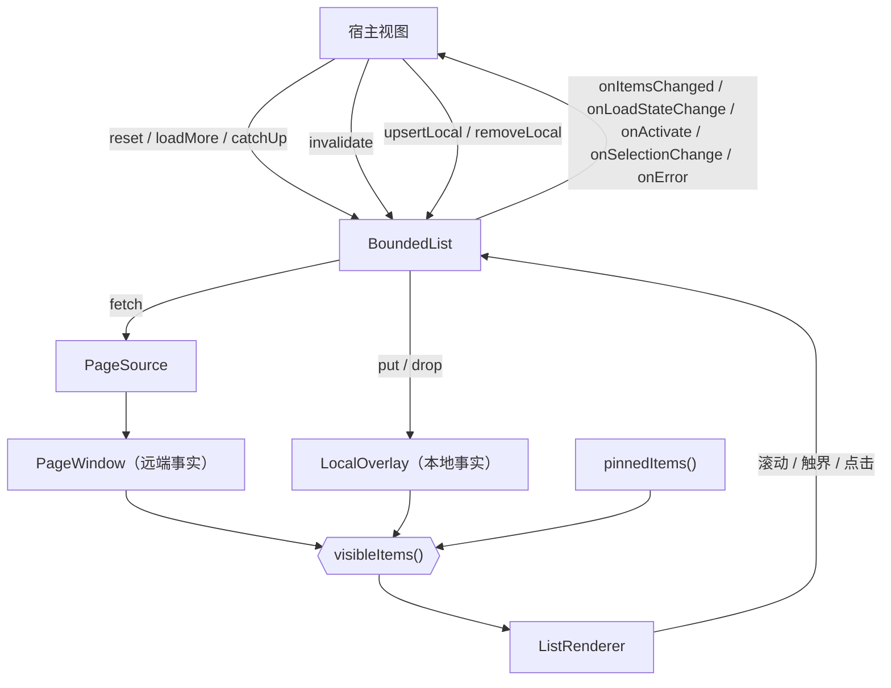

# BoundedList 组件设计与接口说明

> 主要对照：`packages/uikit/src/app/bounded-list/`（`bounded-list.ts`、`page-window.ts`、`overlay.ts`、`renderer.ts`、`page-source.ts`、`selection.ts`、`frame.ts`、`deep-equal.ts`、`types.ts`、`index.ts`）与宿主侧的 `packages/uikit/src/app/views/list-pill.ts`、`local-page-source.ts`、`utils.ts`。
> 最后复核：2026-08-23。
> 触发更新：组件参数、方法、状态字段、内部不变量、导出面或子模块接口变化时同步更新。
> 入口关系：专题索引见 [`README.md`](README.md)；先读 [`导读.md`](导读.md) 建立整体模型，再用本文查具体口径；接入方式见 [`生产集成.md`](生产集成.md)，测试口径见 [`测试方案.md`](测试方案.md)。
>
> 本文是**接口与行为的单一事实源**：参数、状态、方法、行为规则以本文为准，源码注释只解释「为什么」。

## 目录

- [1. 组件定位与分层](#1-组件定位与分层)
- [2. 公开导出面](#2-公开导出面)
- [3. 类型契约](#3-类型契约)
- [4. 数据模型：窗口 + 本地层](#4-数据模型窗口--本地层)
- [5. 构造参数](#5-构造参数)
- [6. 命令式接口](#6-命令式接口)
- [7. 只读状态](#7-只读状态)
- [8. PageSource 数据源](#8-pagesource-数据源)
- [9. ListRenderer 渲染引擎](#9-listrenderer-渲染引擎)
- [10. SelectionStore 选中态](#10-selectionstore-选中态)
- [11. 辅助模块](#11-辅助模块)
- [12. 核心行为规则](#12-核心行为规则)
- [13. 不变量与宿主约定](#13-不变量与宿主约定)

---

## 1. 组件定位与分层

### 1.1 一句话职责

在**恒定的内存与 DOM 预算**内，把一个可分页的数据集渲染成可滚动列表，并统一处理续翻、追平、乐观写入、选中态与生命周期。

组件不认识业务语义，不订阅 SDK，不发起除 `PageSource` / `fetchByIdentity` 之外的任何请求。

### 1.2 分层

| 层 | 文件 | 职责 | 认识 DOM？ | 认识分页？ |
|---|---|---|---|---|
| 编排 | `bounded-list.ts` | 命令式接口、请求单飞、追平决策、渲染快照 | 间接 | 是 |
| 数据（远端） | `page-window.ts` | 整页并入 / 淘汰、跨页去重、两端续翻锚点 | 否 | 是 |
| 数据（本地） | `overlay.ts` | 本端写入的记账、叠加与作废 | 否 | 否 |
| 视图 | `renderer.ts` | 有键 DOM 协调、滚动锚点、触界检测、交互 | 是 | 否 |
| 取数 | `page-source.ts` | 服务端游标分页 / 本地全量切片 | 否 | 是 |
| 选中 | `selection.ts` | 可跨实例共享的选中集 | 否 | 否 |
| 辅助 | `frame.ts`、`deep-equal.ts` | 帧调度、结构比较 | 否 | 否 |

依赖是单向的：编排层依赖其余全部，其余互不依赖（`renderer` 只额外用 `frame` / `deep-equal`）。

### 1.3 数据流



## 2. 公开导出面

`index.ts` 只导出真的有调用方的名字。

| 导出 | 形态 | 说明 |
|---|---|---|
| `createBoundedList(options)` | 函数 | 唯一的实例入口 |
| `sdkPageSource(fetch, selectItems, selectTotal?)` | 函数 | 服务端游标分页数据源 |
| ~~`localPageSource(options)`~~ | — | 已移出组件，见 `views/local-page-source.ts` |
| `SelectionStore` | 类 | 可共享的选中集 |
| `standaloneList` | 常量 | 「不接入宿主广播」的显式 `register` |
| `BoundedList` | 类型 | 调用方持有实例引用用 |
| `BoundedListOptions` / `BoundedListState` / `ErrorPhase` / `FetchPageRequest` / `PageLoadResult` / `PageSource` / `RenderItemContext` / `SelectionSnapshot` | 类型 | 构造与回调签名 |
| `Edge` | 类型 | `loadMore(edge)` 的形参类型 |
| `BoundedListController` | 类型 | 宿主注册表的元素类型 |

导出判定两条，满足其一即导出：**(1)** 在 `packages/uikit/src/app/views/`（生产）或 `packages/uikit/tests/` / `apps/web/tests/`（测试与 harness）真的被引用；**(2)** 出现在公开方法的签名里——调用方要包一层就得能写出这个类型名（`Edge` 属于这一条）。

不导出：`PageWindow`、`LocalOverlay`、`ListRenderer`（实现分层），以及 `BoundedListText`、`DisplayOrder`、`SelectionConfig`、`RegisterBoundedList` 等只作为已导出类型组成部分出现的类型（结构类型下调用方无需单独 import）。

## 3. 类型契约

### 3.1 展示序与新鲜端

| 类型 | 取值 | 含义 |
|---|---|---|
| `DisplayOrder` | `'asc'` / `'desc'` | 列表排列方向。`asc` = 旧→新（消息），`desc` = 新→旧（会话 / 联系人） |
| `Edge` | `'backward'` / `'forward'` | 列表的一端，直接沿用 wire 协议的方向词汇：`backward` = 逆展示序那一端（数组头部、DOM 上方），`forward` = 沿展示序那一端（数组尾部、DOM 下方） |

`order` 只决定一件事：**新鲜端在哪一端**。`desc → backward`，`asc → forward`。转换只在构造时发生一次，此后组件内部只用 `Edge`。

**全项目只有一套方向词汇**：`protocol/yimsg.proto` 的 `PageDirection`、SDK `PageInfo` 的 `hasMoreBackward`/`hasMoreForward`、组件的 `Edge` 与状态字段用的是同样两个词，中间没有任何映射，也**不随展示序变化**：

| 组件 `Edge` | 请求参数 | 该端还有更多 | 视觉位置 |
|---|---|---|---|
| `backward` | `backward: true` | `hasMoreBackward` | 顶部 |
| `forward` | `backward: false` | `hasMoreForward` | 底部 |

### 3.2 分页请求与结果

```ts
interface FetchPageRequest<Q> {
  cursor?: string;        // 未提供 = 拉首页
  backward: boolean;      // true = 朝 backward 端翻，与 SDK 分页参数同名同义
  limit: number;          // 恒等于 pageSize
  query: Q;               // 当前查询条件
}

interface PageLoadResult<T> {
  items: readonly T[];
  startCursor: string;    // 这一页 backward 侧的边界游标
  endCursor: string;      // 这一页 forward 侧的边界游标
  hasMoreBackward: boolean;
  hasMoreForward: boolean;
  total?: number;         // 未提供时组件对外呈现为 -1
}
```

约定：

- 首页请求固定以 `cursor: undefined, backward: false` 发出。`order: 'asc'` 的列表若要「首屏取最新一页」，由数据源自行把它翻译成后端的 backward 请求（见消息列表的实现）。
- 游标对组件不透明：组件只做保存与回传，从不解析或拼接。
- 一页经 `normalize` 后的条目数**不得超过 `pageSize`**，否则窗口抛 `RangeError`，该次请求进入失败态。

### 3.3 渲染上下文与文案

```ts
interface RenderItemContext<T> {
  identity: string;
  selected: boolean;
  selectable: boolean;      // 多选达上限且未选中时为 false
  previous: T | undefined;  // 渲染序列里的上一条
}
```

**刻意不含行下标**：下标会随头部插页整体平移，一旦被调用方依赖就等于把「第几行」写进渲染结果，
头部插一页就让整窗口的复用判定失效。需要按整批数据准备一次的场景用 `beforeRender`。

`BoundedListText` 的每个字段都是可选的取值函数（便于跟随语言切换实时求值）：

| 字段 | 出现时机 |
|---|---|
| `loading()` | 首屏未落定，或某一端正在续翻 |
| `empty()` | 渲染序列为空。**「无数据」与「无搜索结果」由调用方在这一个函数里自己区分**——它手里就握着搜索框，组件不判断「什么算已过滤」 |
| `backwardBoundary()` / `forwardBoundary()` | 该端 `hasMore` 为 false 且列表非空 |

| `error(err)` | 首屏失败且渲染序列为空；缺省时回退到空态文案 |


## 4. 数据模型：窗口 + 本地层

### 4.1 PageWindow（远端事实）

**只被服务端响应修改。** 内部结构是「页数组 + 两端游标 + 两端 hasMore + total」。

| 成员 | 说明 |
|---|---|
| `items` / `count` / `total` | 展平后的条目、条目数、服务端声明的总量（未知为 -1） |
| `hasMoreBackward` / `hasMoreForward` / `hasMore(edge)` | 该端还有没有数据 |
| `cursorFor(edge)` | 该端下一次续翻的锚点；空串表示没有可用锚点 |
| `has(id)` | 身份是否命中窗口 |
| `reset()` | 清空 |
| `setFirstPage(page)` | 整窗替换，两端边界由这一页确立 |
| `extend(edge, page)` | 并入一页；超出 `maxPages` 时从对端整页淘汰 |
| `replace(id, item)` / `remove(id)` | 定向刷新落地用的按身份就地增删；返回是否命中 |

`extend` 的调用前提是**该端已有非空续翻锚点**（拿不到锚点上层就不发这次请求，见 §12.4），
所以它不处理「窗口一个锚点都没有」的情况。

`extend` 的四条记账规则：

1. **先跨页去重**：新页里出现过的身份，先从窗口既有页里摘掉；
2. **锚点与页位分开判断**：源页非空则该端游标必须前进（哪怕 `normalize` 把它滤空），源页为空则游标不动；
3. **空页强制收敛**：源页为空时该端 `hasMore` 置 false，服务端违约（空页却报还有更多）也不会让触界检测无限补页；
4. **整页淘汰**：超出 `maxPages` 时从对端弹出整页，并把对端游标改回淘汰后的位置、`hasMore` 置 true。

两端游标与页数组**解耦维护**：页会因去重、删除、`normalize` 过滤而变空，空页必须能被丢弃（否则白占 `maxPages` 名额，下一次淘汰淘掉的是另一端的真实数据页），游标独立维护才做得到。

### 4.2 LocalOverlay（本地事实）

按身份索引的记账表，两种记账：

| 记账 | 来源 | 渲染效果 |
|---|---|---|
| `put(id, item)` | `upsertLocal` | 该身份以本地值渲染，且**位置固定在新鲜端**；窗口里已有同身份时等价于「移到新鲜端并改内容」 |
| `drop(id)` | `removeLocal` | 该身份不渲染，**窗口与 `pinnedItems()` 两段都不渲染** |

- 记账序即 Map 插入序；重复 `put` 会先删后插，把该身份移到最新（也就是最靠新鲜端）。
- 上限为 `pageSize`，超出时静默丢弃最旧一条。这是兜底，正常场景下本地层只有个位数条目。
- **生命周期只有一条规则**：`settle(mark)` —— 一次覆盖首页的请求落地后，比该请求发出时更早的记账全部作废。
- `drop` 对**当前不在渲染序列里**的身份同样记墓碑（`removeLocal` 此时返回 `false`）：随后的续翻可能把这一页拉进窗口，墓碑保证它不会被重新拉回来，直到下一次 `settle` 让位给服务端事实。

`drop` 要盖住 pinned 是因为 pinned 不进窗口、`apply` 够不着它：`apply` 只作用于 `window.items`，pinned 的过滤由 `visibleItems()` 拿 `isDropped(id)` 单独做一遍。少了这一步，`removeLocal` 会报告删掉了、下一帧宿主又把它钉回来。

### 4.3 渲染序列

```
visibleItems() = 去重(pinnedItems()) ++ overlay.apply(window.items)
```

- `overlay.apply`：先把所有被记账的身份从窗口序列里摘掉，再把 `put` 的条目按记账序落到新鲜端（`backward` 端时最后记账的排最前）。
- pinned 去重：窗口 / 本地层里已经出现的身份，pinned 一律让位（占位会话在真实条目落库后就不该继续钉在头部）；被 `drop` 记了墓碑的身份也不再钉。
- 渲染、点击命中、选中快照、`onItemsChanged` 共用这一份序列，保证「看到的」「点到的」「报出去的」完全一致。

## 5. 构造参数

### 5.1 身份与宿主

| 参数 | 必填 | 说明 |
|---|---|---|
| `id` | 是 | 实例标识，用于注册表与错误日志 |
| `scrollElement` | 是 | 滚动容器，必须有确定高度与 `overflow-y: auto` |

| `register` | 是 | 登记到宿主注册表并返回注销函数；不接入广播的一次性列表显式传 `standaloneList` |
| `isActive` | 否 | 列表当前是否可见；返回 false 时通知只点亮 `stale` |

`register` 必填是刻意的：同一页面可并存多个 AppInstance（嵌入式 UIKit 多格子），它们的列表 `id` 完全相同，退化到进程级注册表会互相覆盖。

### 5.2 数据与容量

| 参数 | 必填 | 说明 |
|---|---|---|
| `source` | 是 | `PageSource<T, Q>` |
| `pageSize` | 是 | 每页条数，≥ 1 的安全整数 |
| `maxPages` | 是 | 窗口保留页数，≥ 1 的安全整数 |
| `fetchByIdentity` | 否 | 定向刷新；不提供时带 `identities` 的通知只点亮 `stale` |
| `normalize` | 否 | 每页归一化（排序 / 去重 / 过滤），**只作用于服务端返回的整页** |
| `identityOf` | 是 | 稳定身份键，用于去重、锚点、定向刷新、本地记账、选中态 |

`pageSize`、`maxPages` 非法或 `pageSize × maxPages` 溢出安全整数时构造期抛 `RangeError`。

### 5.3 展示序与滚动

| 参数 | 默认 | 说明 |
|---|---|---|
| `order` | `'desc'` | 展示序，见 §3.1 |
| `autoLoad` | true | 触界自动补页总开关；关掉后只有显式 `loadMore(edge)` 能续翻 |
| `reachPx` | 160 | 距某端多少像素内算触界 |

贴边阈值（backward 端 4px / forward 端 50px）与贴边校正帧数（backward 端 1 帧 / forward 端 4 帧）由新鲜端直接决定，
是 `bounded-list.ts` 里的常量，不开放为构造参数：没有调用方需要另一套取值，开放出去
只是多两个「传了会怎样」的组合。

### 5.4 渲染、选中与查询

| 参数 | 说明 |
|---|---|
| `beforeRender(items)` | 每轮渲染开始前调用一次，带上本轮完整序列（为空时不调用）；用于按整批数据预取一次上下文 |
| `renderItem(item, ctx)` | 返回该行的**平级根节点数组**；第一个节点承载锚点键 |
| `pinnedItems()` | 固定钉在头部、不进窗口、不参与分页的条目 |
| `text` | `BoundedListText`，见 §3.3 |
| `selection` | `{ mode, max?, store?, onExceed? }`；`store` 与 `max` 互斥（同时给出构造期抛 `TypeError`） |
| `initialQuery` | 初始查询条件 |

### 5.5 事件回调

| 回调 | 触发时机 |
|---|---|
| `onActivate(item, ev)` | 点击某行（多选模式下不触发） |
| `onSelectionChange(snapshot)` | 选中集变化，`items` 与渲染序列同序 |
| `onLoadStateChange(state)` | 加载状态、条目数、`stale` / `failed` 变化（宿主据此同步提示条） |
| `onItemsChanged(items)` | 渲染序列变化，**含 pinnedItems 与本地层** |
| `onError(error, phase)` | `phase ∈ 'reset' \| 'catchup' \| 'backward' \| 'forward' \| 'refresh'`，见 §12.6；不提供时降级为 `console.warn` |

## 6. 命令式接口

| 方法 | 签名 | 说明 |
|---|---|---|
| `reset` | `(opts?: { query?, pinEdge? }) => Promise<void>` | 清空窗口与本地层后重拉首页。`pinEdge` 默认 true（拉完贴回新鲜端）。传了 `query` 才改查询条件 |
| `loadMore` | `(edge) => Promise<void>` | 显式续翻一页；视为用户主动重试，解除该端的自动续翻暂停 |
| `catchUp` | `() => void` | 贴回新鲜端并立刻追平；首屏还没成功过时等价于重拉首页 |
| `invalidate` | `(opts?: { identities? }) => void` | 轻通知唯一入口。同帧内多次调用只做一次决策 |
| `upsertLocal` | `(item) => void` | 本端写入一条，立即可见并落在新鲜端 |
| `removeLocal` | `(id) => boolean` | 本端删除一条，立即消失；返回删除前是否可见 |
| `render` | `() => void` | 宿主显式重绘：每一行都重跑 `renderItem` |
| `dispose` | `() => void` | 释放全部资源；之后所有方法都是空操作，幂等 |

`reset` / `loadMore` 返回的 Promise **永远 resolve**：错误经 `onError` 上报，不产生未处理拒绝。

## 7. 只读状态

`getState(): BoundedListState`

| 字段 | 含义 |
|---|---|
| `loaded` | 首屏是否已落定（**失败也算落定**，否则空态 / 错误态无法显示） |
| `loading` | 是否有请求在飞 |
| `loadingBackward` / `loadingForward` | 在飞的是不是该端的续翻 |
| `hasMoreBackward` / `hasMoreForward` | 该端还有没有数据 |
| `count` | 当前渲染序列长度（含 pinnedItems 与本地层） |
| `total` | 服务端声明的总量，未知为 -1 |
| `stale` | 有已知变化但当前没有追平（宿主据此决定要不要提示） |
| `atFreshEdge` | 当前是否贴在新鲜端（**现算几何**） |
| `failed` | 首屏是否处于失败态（成功一次即回到 false） |

`stale` 刻意是布尔而不是计数：「有几条待处理更新」「刷新失败了」「被容量裁掉了几条」是三件不同的事，合成一个数字对用户既不准也没意义。

## 8. PageSource 数据源

### 8.1 sdkPageSource

```ts
sdkPageSource(fetch, selectItems, selectTotal?)
```

`fetch` 原样透传 `FetchPageRequest`；响应里的 `page`（SDK `PageInfo`）按固定规则映射成
`PageLoadResult`，调用方只需回答「条目在哪个字段」。游标原样透传，不解析、不构造。

响应里的 `hasMoreBackward`/`hasMoreForward` 按同名字段搬进 `PageLoadResult`，**没有方向转换**。
`selectTotal` 只给「总数不在 `page.total` 里」的接口用（如 `getGroupMembers` 的总数在
响应顶层），其余一律不传。

### 8.2 localPageSource（宿主侧，不在组件里）

实现在 `packages/uikit/src/app/views/local-page-source.ts`。一次性拉全量到内存，之后所有续翻都是对内存数组的下标切片。**只用于「刻意选择在客户端过滤 / 排序」的低频弹窗**（提及群成员、添加群成员候选）。

它不属于组件：BoundedList 的正常形态是「数据在服务端，一次取一页」，这里的数据一开始就全在内存里，分页只是为了复用组件的渲染、选中与交互能力——是宿主选择了在客户端过滤，不是组件提供了这种能力。

| 参数 | 说明 |
|---|---|
| `loadAll(query)` | 全量取数；必须自带条目安全上限 |
| `filter(item, query)` | 可选，客户端过滤 |
| `compare(a, b)` | 可选，客户端排序 |

行为要点：

- 只有首页请求（`cursor === undefined`）会重新 `loadAll`；续翻直接切片。
- 游标编码是下标字符串，是本数据源的内部实现细节，不外传给服务端。
- 非法游标按 0 处理，绝不产出 `"NaN"` 这种此后永远翻不动的游标。
- 并发的两次首页请求中，晚返回的旧查询不会覆盖新查询已建立的续翻快照。
- 首页取哪一端由请求里的 `freshEdge` 决定（`'forward'` 取**最后一页**）。它不再自己配一份展示序，所以没有「两处 `order` 必须一致、不一致就静默取错端」这种跨对象隐式契约。

## 9. ListRenderer 渲染引擎

只做三件事：有键 DOM 协调、滚动几何与保持、事件。不认识分页、通知、选中态。

### 9.1 渲染状态

`render(state)` 的 `ListRenderState` 全部字段必填，由 `bounded-list.ts` 一次性填满：`items`、`loaded`、`hasMoreBackward`/`hasMoreForward`、`loadingBackward`/`loadingForward`、`emptyText`、`errorText`、`loadingText`、`backwardBoundaryText`、`forwardBoundaryText`、`loadMore(edge)`、`renderItem`、`keyOf`、`reuseUnchangedRows`、`revisionOf`。

渲染分三个互斥分支：

1. `loaded === false` → 只渲染 loading 提示；
2. `items` 为空 → 渲染 `errorText ?? emptyText` 占位（都没有则渲染成完全空的容器），**仍做触界检测**（服务端可能返回「空页但还有更多」）；
3. 否则 → `[头部提示?, ...条目行, 尾部提示?]`。

### 9.2 行复用与协调

| 判据 | 效果 |
|---|---|
| `reuseUnchangedRows` 且 item 与 revision 都结构相等 | 直接复用旧节点，**不跑 `renderItem`** |
| 否则跑 `renderItem`；**item 结构相等**且候选 DOM 与旧节点完全等价 | 复用旧节点，省掉一次 DOM 替换 |
| 其它（含「item 变了但候选 DOM 恰好一致」） | 用新节点替换 |

**「item 变了就一定换节点」是硬规则，与 `reuseUnchangedRows` 无关。** 宿主可以在 `renderItem` 里给行挂自己的监听（§13.2 第 3 条），那些回调闭包着**当时那个 item**；留着旧节点等于留着一个绑在旧数据上的回调。所以两种模式用同一条判据，不存在「显式重绘更保守」的第二套规则——代价只是「数据变了但渲染结果恰好一样」时多换一次节点。

反过来，「数据没变、只有上下文签名变了」（上一条身份、选中态）时旧节点里的闭包仍然有效，此时复用是安全的，也是这一行存在的意义。

`revisionOf` 是「会影响 `renderItem` 输出、但不在 item 里」的上下文签名，当前包含：上一条身份、选中、可选。**不含行下标**——下标入签名会让任何头部插入使整窗口失去复用；需要「按整批数据准备一次」的调用方用 `beforeRender`。

协调按位置进行：逐个 `insertBefore` 期望节点，再删掉多余的尾部节点。

### 9.3 滚动几何与保持

滚动几何只有一个公式：`distanceTo(edge)` 给出「当前位置距该端还有多少像素」。贴边（比
`STICKY_PX`）与触界（比 `reachPx`）都是拿它与不同阈值比较，组件里没有第二处 `scrollTop` /
`scrollHeight` 的算式。`reachPx` 由 `bounded-list.ts` 解析好默认值后传入，本层不再兜底。

渲染前捕获锚点（第一条底边仍在视口顶以下的行 + 它相对视口顶的偏移），渲染后按同一身份的新位置校正 `scrollTop`。拿不到锚点（空列表、首屏、宿主 DOM 不支持 `getBoundingClientRect`）时退回「恢复渲染前的绝对 `scrollTop`」。两者是「精确」与「兜底」的关系，不叠加。锚点只在第三个分支（有条目）捕获：前两个分支渲染的都是单个占位节点，没有滚动位置可保持。

### 9.3.1 贴边有两套口径，用错就是 bug

`distanceTo` 只回答「此刻距该端多远」。**它此刻准不准，取决于布局有没有被组件自己改过**，所以「用户是不是贴在新鲜端」有两个读法，判据是「读的这一刻，布局是用户滚出来的，还是我们刚动过的」：

| 口径 | 谁在用 | 为什么 |
|---|---|---|
| **现算** `atFreshEdge()` | 滚动帧、追平决策 `decide()`、`getState().atFreshEdge`、`upsertLocal` 写入**之前** | 这些时刻布局是用户滚出来的，现算就是真实位置 |
| **缓存** `stuck` | 图片等异步增高内容 `load` 之后、首页请求落地后的贴边决策 | 内容已经变高 / 整窗换过，现算必然把「用户本来贴着底」误判成「已经滚离底部」，只能回头看变化之前的那次观测 |

`stuck` 的写入者只有三类：原生 `scroll` 事件的同步回调（唯一的「用户操作」写入点，早于本帧任何重排）、`pinToFreshEdge()`（我们刚把它贴过去）、以及本端写入与首页请求的落点判断。同一次滚动不会被写两遍——`onScroll` 帧回调刻意不碰它，否则就多出一份「哪个才算数」的疑问。

同理，`upsertLocal` 的贴边判定必须在 `overlay.put` **之前**做：写入之后渲染引擎会按锚点保持可见内容不动，新条目插进新鲜端，现算必然判成「已离开新鲜端」。

### 9.4 自持的 DOM 事件

| 事件 | 挂在哪 | 用途 |
|---|---|---|
| `scroll` | scrollElement | 同步回调 `onScrollImmediate`（缓存贴边状态的唯一写入点，早于本帧任何重排），帧合并后回调 `onScroll` + 触界检测 |
| `pointerdown` / `pointerup` / `pointercancel` | scrollElement **和 window** | 指针按下期间推迟 DOM 重建，避免点击被吃掉；window 上是「指针在列表外抬起」的兜底 |
| `click` | scrollElement | 事件委托，沿 `parentElement` 上溯找交互键 |
| `load`（捕获） | scrollElement | 图片等异步增高内容加载完成 |

`dispose()` 必须注销**全部**监听，尤其是 window 级的两个：漏掉会让每开一次弹窗就永久泄漏两个监听。

### 9.5 DOM 属性

| 属性 | 写在哪 | 用途 |
|---|---|---|
| `data-bsw-key` | 每行第一个节点 | 滚动锚点标识 |
| `data-bsw-interact-key` | 每行全部根节点 | 点击委托的身份定位 |

这是组件写进 DOM 的**全部**内容：不接管 `scrollElement` 的 `role` / `tabindex`，也不在行上写
`role="option"` / `aria-selected`。组件没有键盘导航，写这些属性等于给出一个无法用键盘操作的
listbox 承诺；容器与行的语义交给宿主按自己的场景决定。

## 10. SelectionStore 选中态

| 成员 | 说明 |
|---|---|
| `has(id)` / `size` / `snapshotIds()` | 查询 |
| `isExceeded(id)` | 已达上限且该 id 未选中（渲染时据此禁用） |
| `toggle(id)` | 返回 `'added'` / `'removed'` / `'rejected'` |
| `delete(id)` / `clear()` / `replaceSingle(id)` | 修改 |
| `subscribe(listener)` | 订阅变化，返回取消函数 |

多个 BoundedList 可共享同一个 store（转发弹窗的两个 tab）：任一实例改动它，所有共享实例自动重渲，调用方不需要手工互调 `render()`。

无论从复选框还是行内其它区域触发，多选都统一走 `toggle` 的上限检查，不存在绕过 `max` 的路径。

## 11. 辅助模块

| 模块 | 接口 | 要点 |
|---|---|---|
| `frame.ts` | `frameScheduler(cb, fallback?)` → 可调用 + `.cancel()`；`nextFrame(cb)` | 同帧合并；取消用递增 token 而不是 `cancelAnimationFrame`（不依赖环境是否真支持取消）。`fallback` 为 `'sync'`（默认）或 `'microtask'`（必须晚于当前同步代码时用） |
| `deep-equal.ts` | `valuesEquivalent(a, b)` | 结构相等，只处理列表条目真实的 JSON 形状（原始值 / 数组 / 普通对象）：原型不同或非普通对象一律判不等，深度上限 8。深度上限同时保证递归终止，所以不需要环引用记账。**不能退化成 `JSON.stringify`**（键序不同会把没变的行判成已变化） |

`BoundedListController` 类型与 `standaloneList` 常量分别在 `types.ts` 与 `bounded-list.ts`：
注册表实体由宿主持有，`standaloneList` 让「不注册」成为可 grep 的显式决定。

## 12. 核心行为规则

### 12.1 请求单飞

`loading: 'first' | 'backward' | 'forward' | null` 既是状态也是锁。

| 场景 | 行为 |
|---|---|
| 首页请求（`reset` / 追平） | 推进 `generation`，在飞的续翻响应落地时被整体丢弃 |
| 续翻请求，且已有请求在飞 | 直接放弃；触界检测每帧都会重来，下一帧自然补上 |
| 定向刷新 | **不占用单飞锁**（它不动游标、不改顺序），只受 `generation` 约束 |
| 追平时已有首页请求在飞 | 合并到在飞的那一次；「落地后贴回新鲜端」的意图会并进去，不被在飞请求原来的参数吞掉 |

`generation` 是让旧响应失效的唯一机制：所有在飞响应在发出时捕获它、落地时比对，不相等就整体丢弃、不触发任何回调。

### 12.2 追平决策

```mermaid
flowchart TD
    A["invalidate()"] --> B["dirty = true<br/>同帧合并"]
    B --> C{"decide()"}
    C -->|有请求在飞| D["返回。响应落地时会再叫一次"]
    C -->|isActive() === false| E["stale = true"]
    C -->|贴着新鲜端| F["refresh()：保留窗口重拉首页"]
    C -->|其它| G["stale = true<br/>+ 定向刷新窗口内受影响身份"]
```

- **点亮 `stale` 只有 `decide()` 一条路径。** 「正在追平」不是「有没看到的更新」；在请求在飞时提前点亮提示条，就会在响应落地后立刻熄灭，用户看到的是闪一下（见 §12.7）。熄灭则不止一条：首页请求落定与 `reset` 清空窗口都会无条件熄灭它。一句话——**可以被「追平成功了」熄灭，绝不能被「正在追平」点亮**。
- 三个入口会重新叫醒决策：`invalidate()`、请求落地（**成功与失败同等对待**，否则失败那次会把这段时间的通知永久吞掉）、用户滚回新鲜端。
- 追平（`refresh`）保留当前窗口，落地时原子替换，所以追平期间画面不闪空。
- **`dirty` 只被首页请求清零**，续翻请求不清，`decide()` 走「只点亮提示条」那一支时也刻意不清。它的含义是「收到过通知、还没被一次首页追平覆盖」，不是「还没做过决策」——正因为决策后它还留着，滚回新鲜端的滚动帧和随后落地的请求才知道这里仍欠一次追平。清早了，§12.3 提示条自动熄灭的第二条路径就断了。请求期间到达的通知会重新置位，落地后再决策一次。

### 12.3 提示条（宿主侧）

**组件不画提示条**：它只在 `BoundedListState` 里报 `stale` 与 `failed`，并提供 `catchUp()` 这一个追平入口。要不要提示、长什么样、挂在哪，由宿主决定——十二个生产列表里只有五个需要提示条。

宿主侧的 `views/list-pill.ts` 把这段接线收成两行：

```ts
const pill = createListPill(host, () => list.catchUp(), { updated: ..., retry: ... });
// 组件配置里：
onLoadStateChange: (state) => pill.sync(state),
```

| 状态 | 提示条 | 点击（都是 `catchUp()`） |
|---|---|---|
| `failed` | 显示 `retry()` 文案（未提供则不显示） | 首屏从未成功过 → `reset`；否则 `refresh` |
| `stale` 且提供了 `updated()` | 显示 | 贴回新鲜端并立刻追平 |
| 其它 | 隐藏 | — |

`stale` 自动熄灭的两条路径：追平成功；用户自己滚回新鲜端（滚动帧发现贴边且 `dirty` → 重新决策 → 追平）。

**为什么放在宿主**：提示条留在组件里时，十二个实例全都配了 `text.retry`，但其中七个传了 `pillHost: false` —— 那七处文案永远不显示，首屏失败后用户根本没有重试入口，且没人察觉。「配了却不生效」这类死配置，正是组件替宿主决定 UI 的代价。

### 12.4 触界检测与自动补页

每次渲染与每个滚动帧都会做触界检测：某端在 `reachPx` 以内且该端 `hasMore` → 请求续翻。

三道闸保证它必然终止：

1. **空页强制收敛**：拿到空页即把该端 `hasMore` 置 false（§4.1 规则 3）；
2. **失败暂停**：某端请求失败后加入 `blocked`，用户把该端滚离触界范围、显式 `loadMore`、或重拉首页后解除；
3. **满窗短路**：窗口已满且内容仍撑不满视口（列表被隐藏、行高为 0）时不再自动补页——补进来的一页只会把另一端等量淘汰，两端会永远互相补页。用户显式 `loadMore` 不受此限制。

另外，续翻锚点为空串时直接放弃（空游标不是首页语义，发出去只会让服务端按未定义行为处理）。

### 12.5 本端写入

`upsertLocal` / `removeLocal` 只做三件事：写一条本地记账、丢掉该身份的定向刷新意图、重绘。**不发请求、不点亮提示条、不修改窗口。**

它们与在飞请求完全解耦：无论此刻有没有请求在飞，本地写入都立即可见，且不会被这次响应吞掉（响应只替换窗口，本地层在渲染时叠加在上面）。

### 12.6 错误处理

| 阶段 | 触发 | 表现 |
|---|---|---|
| `reset`（清空重拉首页） | `reset()` / 首屏 | `failed = true`、`loaded = true`；渲染序列为空时显示错误态，宿主提示条变重试入口；**不自动重试**（等用户点击或下一次 `invalidate`），避免请求风暴 |
| `catchup`（保留窗口重拉首页） | 追平决策、`catchUp()` | 状态同上，但**窗口里的旧内容还完整摆着**，用户看到的不是空列表 |
| `backward` / `forward`（续翻） | 触界补页 / `loadMore` | 该端加入 `blocked`，窗口不变 |
| `refresh`（定向刷新） | 带 `identities` 的通知 | 只上报，窗口不变 |

`reset` 与 `catchup` 发的是同一种首页请求（唯一区别是清不清空窗口），但对宿主是两回事：**`reset` 失败意味着用户面前这块列表没内容，该弹提示；`catchup` 失败只是后台追平没成功，该静默**（提示条仍是重试入口）。合成一个取值，宿主就只能在「网络抖一下也弹一次错」和「首屏空白却一声不吭」之间二选一——消息列表正是靠这个区分决定要不要弹 toast。

全部错误都经 `onError(error, phase)` 上报；没有 `onError` 时降级为 `console.warn`。

### 12.7 已修复的典型缺陷：提示条闪动

复现（修复前）：在聊天框发送一条消息 → 会话列表先出现「有更新」提示条，随即自行消失。

成因：`invalidate()` 在「有请求在飞」的分支里直接点亮提示条，而那次在飞请求落地后决策又判定应该追平，追平成功即熄灭。整个过程只有几百毫秒，用户看到的就是闪一下。

修复：把「收到通知」（`dirty`，输入）与「提示条该亮」（`stale`，输出）拆成两个字段，并规定只有 `decide()` 能写 `stale`；请求在飞时决策直接返回，等响应落地后重新决策。

## 13. 不变量与宿主约定

### 13.1 不变量

| # | 不变量 |
|---|---|
| I1 | 渲染行数 ≤ `pageSize × (maxPages + 1)`（窗口 + 本地层），与数据总量无关 |
| I2 | DOM 中的条目节点数 == `state.count` |
| I3 | 同一身份在渲染序列里至多出现一次 |
| I4 | 续翻只使用来自保留页的游标；拿不到锚点就不发请求 |
| I5 | 过期响应一律整体丢弃，不触发任何回调 |
| I6 | 自动补页在任何服务端行为下都必然终止 |
| I7 | 多选上限没有绕过路径 |
| I8 | 选中态只被自己那一条身份的删除影响，共享 store 的其它实例不受牵连 |
| I9 | `dispose()` 之后监听全部归零、提示条 DOM 摘除、排队的帧任务不再触碰 DOM、注册表不保留该实例 |

### 13.2 宿主约定

1. `scrollElement` 必须有确定高度与 `overflow-y: auto`；两个同时展示的分页区域不能共享同一个滚动容器。
2. 不要设置 `overflow-anchor: none`：浏览器原生锚点是图片、头像异步增高的兜底。
3. `scrollElement` 的子节点由组件全权管理；业务监听放在 `renderItem` 返回的节点上，或交给组件的事件委托。
4. `identityOf` 必须在条目生命周期内稳定；多个列表共享 `SelectionStore` 时必须使用同一身份空间。
5. 弹窗、面板、页面销毁时必须 `dispose()`；同一宿主重建同名列表前先释放旧实例。
6. 展示资料（昵称、头像）变化只调用 `render()`，不要 `reset()`。
