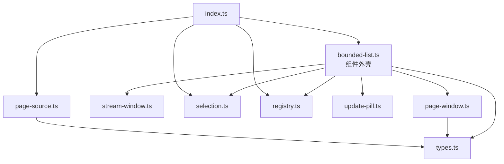
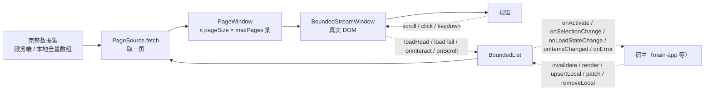
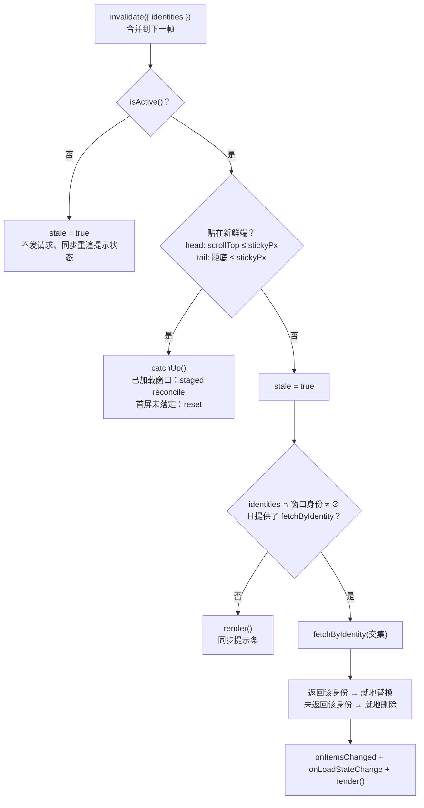
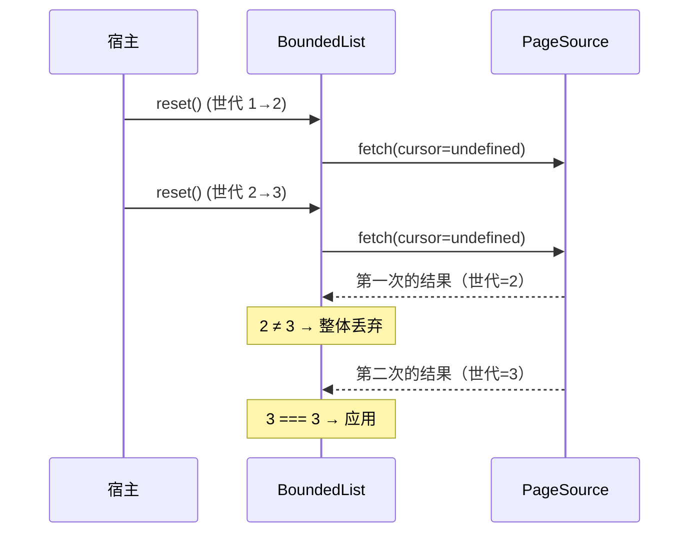
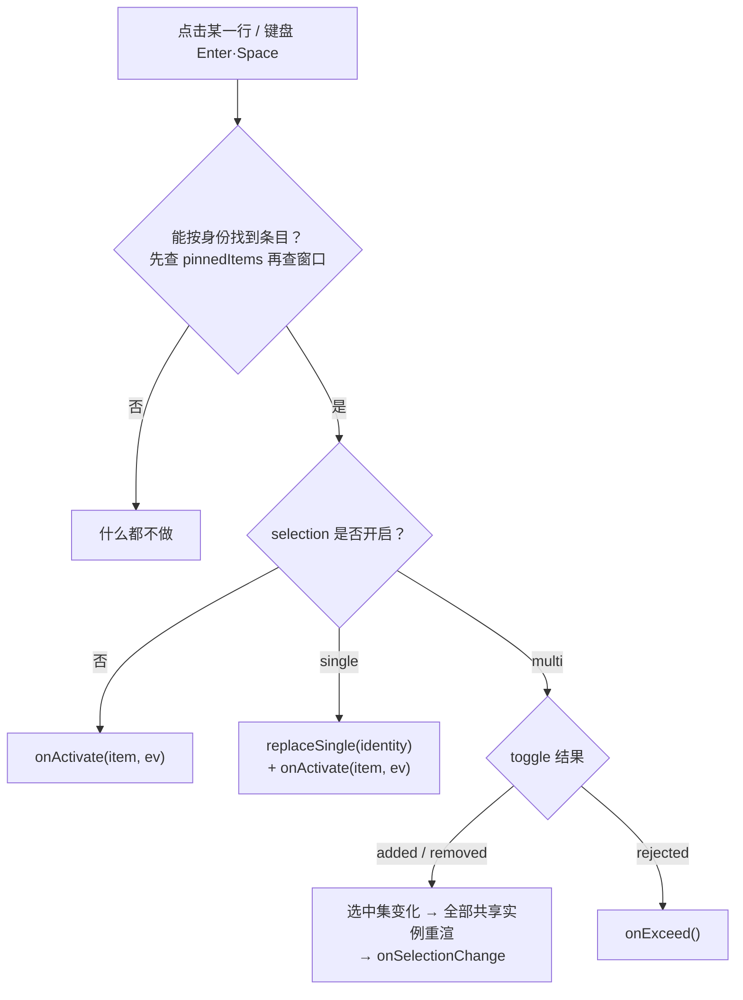

# BoundedList 组件设计与接口说明

> 主要对照：`packages/uikit/src/app/bounded-list/index.ts`、`packages/uikit/src/app/bounded-list/types.ts`、`packages/uikit/src/app/bounded-list/bounded-list.ts`、`packages/uikit/src/app/bounded-list/page-window.ts`、`packages/uikit/src/app/bounded-list/page-source.ts`、`packages/uikit/src/app/bounded-list/stream-window.ts`、`packages/uikit/src/app/bounded-list/selection.ts`、`packages/uikit/src/app/bounded-list/registry.ts`、`packages/uikit/src/app/bounded-list/update-pill.ts`。
> 最后复核：2026-07-30（本次改动：`freshEdge` 改名为展示序 `order`，内部 `Direction`/`FreshEdge` 两套方向词汇合并为单一 `Edge`）。
> 触发更新：`bounded-list/` 目录下任一模块的导出、参数、方法、事件、默认值、状态字段或行为规则变化时同步更新；测试口径同步 [`测试方案.md`](测试方案.md)。
> 入口关系：专题入口见 [`README.md`](README.md)，宿主接线见 [`生产集成.md`](生产集成.md)，上级索引见 [`../../../../docs/architecture/前端文档索引.md`](../../../../docs/architecture/前端文档索引.md)。**本文是 `bounded-list/` 实际实现的接口单一事实源**。

## 目录

- [1. 组件定位](#1-组件定位)
  - [1.1 一句话职责](#11-一句话职责)
  - [1.2 模块分层](#12-模块分层)
  - [1.3 数据流](#13-数据流)
- [2. 公开导出面](#2-公开导出面)
- [3. 类型契约](#3-类型契约)
  - [3.1 展示序与新鲜端](#31-展示序与新鲜端)
  - [3.2 分页请求与结果](#32-分页请求与结果)
  - [3.3 渲染上下文与文案](#33-渲染上下文与文案)
  - [3.4 状态与快照](#34-状态与快照)
- [4. BoundedList 构造参数](#4-boundedlist-构造参数)
  - [4.1 身份与宿主](#41-身份与宿主)
  - [4.2 数据源](#42-数据源)
  - [4.3 身份键](#43-身份键)
  - [4.4 展示序与滚动](#44-展示序与滚动)
  - [4.5 渲染与文案](#45-渲染与文案)
  - [4.6 选中态](#46-选中态)
  - [4.7 查询条件](#47-查询条件)
  - [4.8 事件回调](#48-事件回调)
- [5. BoundedList 命令式接口](#5-boundedlist-命令式接口)
- [6. BoundedList 只读状态](#6-boundedlist-只读状态)
- [7. PageSource 数据源接口](#7-pagesource-数据源接口)
  - [7.1 serverPageSource](#71-serverpagesource)
  - [7.2 localPageSource](#72-localpagesource)
- [8. PageWindow 数据窗口接口](#8-pagewindow-数据窗口接口)
- [9. BoundedStreamWindow 渲染引擎接口](#9-boundedstreamwindow-渲染引擎接口)
  - [9.1 构造参数与渲染状态](#91-构造参数与渲染状态)
  - [9.2 方法](#92-方法)
  - [9.3 自持的 DOM 事件](#93-自持的-dom-事件)
  - [9.4 辅助导出](#94-辅助导出)
- [10. SelectionStore 选中态接口](#10-selectionstore-选中态接口)
- [11. registry 注册表接口](#11-registry-注册表接口)
- [12. update-pill 提示条接口](#12-update-pill-提示条接口)
- [13. 核心行为规则](#13-核心行为规则)
  - [13.1 invalidate 决策树](#131-invalidate-决策树)
  - [13.2 提示条自动消失的三条路径](#132-提示条自动消失的三条路径)
  - [13.3 触界检测与链式补页](#133-触界检测与链式补页)
  - [13.4 请求并发、容量追平与丢弃](#134-请求并发容量追平与丢弃)
  - [13.5 点击与键盘的事件分发](#135-点击与键盘的事件分发)
  - [13.6 渲染时序](#136-渲染时序)
- [14. 不变量与宿主约定](#14-不变量与宿主约定)
- [15. 实现补强与缺陷状态](#15-实现补强与缺陷状态)
  - [15.1 关键语义决策](#151-关键语义决策)
  - [15.2 防御能力](#152-防御能力)
  - [15.3 缺陷状态](#153-缺陷状态)

---

## 1. 组件定位

### 1.1 一句话职责

`BoundedList<T, Q>` 把「**有界滑动窗口 + 有键 DOM 协调 + 双向翻页**」这一套列表机制封装成一个泛型组件：`T` 是条目类型，`Q` 是查询条件类型（无查询条件时为 `void`）。

它负责：分页拉取编排、窗口记账与正常翻页的整页裁剪、live 路径的全局硬预算裁剪、失效游标封锁与 staged 权威 reconcile、跨页去重、就地增删改、按身份复用未变化 DOM、滚动锚点、空态 / 加载态 / 边界提示、提示条、选中态、触界翻页、键盘导航、以及**自己挂的全部监听的注销**。

它不负责：调哪个 SDK 方法（由 `source` 注入）、单行长什么样（由 `renderItem` 注入）、容器的 CSS 高度与 `overflow`（由宿主保证）、订阅 SDK 事件（宿主把事件翻译成一次 `invalidate()`）。

窗口内条目全部使用真实 DOM，数据按页记账，并通过 `order`（展示序）明确最新数据所在的一端；具体生产场景、事件路由和生命周期约束集中在 [`生产集成.md`](生产集成.md)，本文不重复宿主矩阵。

**当前接入状态**：组件本身已完整实现；实测覆盖率见 [`测试方案.md`](测试方案.md) §5，不能写成 100%。生产接入范围以 [`生产集成.md`](生产集成.md) §2 为准；`main-app.ts` 不再手写注册表接线，各调用方通过构造参数 `register` 自行登记，见 §11。

### 1.2 模块分层

```
packages/uikit/src/app/bounded-list/
  index.ts          对外导出面（唯一允许被外部 import 的入口）
  types.ts          纯类型：无运行时代码
  bounded-list.ts   组件外壳：编排、生命周期、事件分发
  page-window.ts    数据窗口：按页边界游标记账、整页裁剪、跨页去重、就地增删改
  page-source.ts    数据源：serverPageSource / localPageSource
  stream-window.ts  渲染引擎：有键 DOM 协调、锚点、边界提示、DOM 事件、触界检测
  selection.ts      选中态：可跨实例共享的 SelectionStore
  registry.ts       实例注册表：重连后一次性广播 invalidate
  update-pill.ts    「有更新」提示条的创建 / 显隐 / 释放
```

依赖方向是单向的，没有环：



`page-source.ts` 不被组件外壳直接引用——数据源是**调用方构造好之后作为参数注入**的，组件只认 `PageSource<T, Q>` 这个接口。

旧的同名文件 `packages/uikit/src/app/bounded-list.ts`（只有 `BoundedListController` 接口）已经删除，该契约并入 `registry.ts`，因此 `import ... from './bounded-list'` 直接拿到本组件的公开导出面，不再被同名 `.ts` 遮蔽。

### 1.3 数据流



---

## 2. 公开导出面

`index.ts` 是唯一允许被外部 import 的入口。导出面刻意保持最小：

| 导出 | 种类 | 说明 |
|---|---|---|
| `createBoundedList<T, Q>(options)` | 函数 | 创建组件实例。**唯一**的实例来源。 |
| `serverPageSource<R, T, Q>(fetch, map)` | 函数 | 服务端 keyset 游标分页数据源。 |
| `localPageSource<T, Q>(options)` | 函数 | 本地全量数组切片数据源。 |
| `SelectionStore` | 类 | 可跨实例共享的选中集。 |
| `standaloneList` | 常量 | `register` 的具名空实现：模态框内一次性候选列表用它显式声明「不接入宿主广播」（见 §11）。 |
| 类型 | `BoundedList`、`BoundedListOptions`、`BoundedListState`、`BoundedListController`、`ErrorPhase`、`FetchPageRequest`、`PageLoadResult`、`PageSource`、`RenderItemContext`、`SelectionSnapshot` | 见 §3。 |

导出面的判定口径是**有没有真实调用方**：一个名字只有在 `packages/uikit/src/app/views/`（生产）或
`packages/uikit/tests/` / `apps/web/tests/`（测试与 harness）里真的被引用，才出现在 `index.ts`。

按这个口径，以下类型只在本目录内部使用，因此**不导出**：`BoundedListText`、`Edge`、
`DisplayOrder`、`SelectionConfig`、`RegisterBoundedList`、`LocalPageSourceOptions`、`ToggleResult`。
它们仍然是已导出类型（`BoundedListOptions` 等）的组成部分，结构类型下调用方无需单独
import 也能正常构造与标注。

`BoundedList` 按**类型**导出而不是按类导出：调用方只用 `type BoundedList` 持有实例引用，
没有任何 `new BoundedList(...)` 或静态成员访问，实例统一从 `createBoundedList` 来。

`PageWindow`、`BoundedStreamWindow`、`createUpdatePill` **不在** `index.ts` 的导出面里：它们是组件内部实现，只有单测按路径直接 import。

---

## 3. 类型契约

全部定义在 `types.ts`（除 `SelectionStore` / `ToggleResult` 在 `selection.ts`、`LocalPageSourceOptions` 在 `page-source.ts`）。`types.ts` 只有类型、没有任何运行时代码。

### 3.1 展示序与新鲜端

```typescript
type DisplayOrder = 'asc' | 'desc';
type Edge = 'head' | 'tail';
```

| 类型 | 取值 | 含义 |
|---|---|---|
| `DisplayOrder`（公开，构造参数用） | `'asc'` | 旧→新（如消息）：新数据从尾部进来 |
| | `'desc'` | 新→旧（如会话 / 通讯录 / 群成员，默认）：新数据从头部进来 |
| `Edge`（内部，不导出） | `'head'` | 数组 / DOM 的头部 |
| | `'tail'` | 数组 / DOM 的尾部 |

这里曾经并存两套词汇——`Direction`（`'forward'` / `'backward'`，描述续翻请求朝哪边）和
`FreshEdge`（`'head'` / `'tail'`，描述哪端新鲜）。但 `backward` 恒等于 `head`、`forward` 恒等于
`tail`，两者从未有过例外，是同一根轴的两个名字，现已合并为一套：组件内部一律用 `Edge`
表达「数组的哪一端」，`FetchPageRequest.backward` 只在请求 wire 协议（§3.2）那一层保留，
与 `Edge` 的换算固定为 `head → backward: true`、`tail → backward: false`（`loadMoreInternal`
里的唯一一处转换）。

`order`（构造参数，见 §4.4）与 `Edge` 的换算固定为：`order: 'desc'`（默认）→ 新鲜端
`at: 'head'`；`order: 'asc'` → 新鲜端 `at: 'tail'`。展示序与新鲜端是同一个比特的两种说法，
只在构造期换算一次，此后组件内部只用 `edge.at` / `edge.away` 两个派生值。

### 3.2 分页请求与结果

```typescript
interface FetchPageRequest<Q> {
  readonly cursor?: string;   // 不透明游标；未提供 = reset（拉首页）
  readonly backward: boolean; // true = 向更靠前 / 更旧的方向
  readonly limit: number;     // 等于构造参数 pageSize
  readonly query: Q;          // 当前查询条件
}

interface PageLoadResult<T> {
  readonly items: readonly T[];
  readonly startCursor: string;
  readonly endCursor: string;
  readonly hasMoreBackward: boolean;
  readonly hasMoreForward: boolean;
  readonly total?: number;    // 未提供 = 未知，组件对外呈现为 -1
}

interface PageSource<T, Q> {
  fetch(req: FetchPageRequest<Q>): Promise<PageLoadResult<T>>;
}
```

这三个类型是**协议 `PageQuery` / `PageInfo`（`protocol/yimsg.proto`）的 wire 镜像**，故意保留
`backward` / `hasMoreBackward` / `hasMoreForward` 这套协议自己的方向词汇，不随 §3.1 的
`Edge` 改名——它们与 SDK 的 `get_*` 响应做 1:1 结构整理（§7.1），改名只会在这层制造一次
无意义的字段映射。

关于 `cursor` 的三条硬约定：

1. **`undefined` 才是 reset 语义**。组件只在 `reset()` 里传 `undefined`；`loadMore()` 一定传字符串（哪怕是空串）。
2. **游标对组件不透明**：组件既不解析也不构造游标，只在「首页 `startCursor`」「尾页 `endCursor`」之间原样搬运。
3. `PageLoadResult` 与 SDK 各 `get_*` 返回的 `PageInfo` 同构，调用方在 `serverPageSource` 的 `map` 里做一次结构整理即可。

`hasMoreBackward` / `hasMoreForward` 由**服务端**决定，不看条数：一页返回不足 `limit` 条也可能仍然「还有更多」。**唯一的例外是续翻拿到空页**——`items` 为空意味着该方向确实没有数据了，窗口会把该端强制收敛为 `false`，不管服务端怎么说（§8）。这是防止服务端违反契约时触界检测无限补页的兜底。

source 必须遵守请求的 `limit`：每次 `PageLoadResult.items` 经 `normalize` 后都不得超过该次 `pageSize`。`setInitial`、`appendTail`、`prependHead` 三条入窗路径统一校验；超量时抛 `RangeError`，由 BoundedList 进入对应的 `reset` / `tail` / `head` 错误流程（`ErrorPhase`，见 §3.4）。组件不会静默截断，因为截断会让服务端游标与实际接纳条目不一致并可能跳过数据。

### 3.3 渲染上下文与文案

```typescript
interface RenderItemContext<T> {
  readonly index: number;          // 在「pinnedItems + 窗口条目」拼接后的下标
  readonly identity: string;       // identityOf(item) 的结果
  readonly selected: boolean;      // 未开启 selection 时恒为 false
  readonly selectable: boolean;    // 未开启 selection 时恒为 true
  readonly previous: T | undefined; // 上一条（index=0 时为 undefined）
}

interface BoundedListText {
  readonly loading?: () => string;
  readonly empty?: () => string;
  readonly emptyFiltered?: () => string;
  readonly headBoundary?: () => string;
  readonly tailBoundary?: () => string;
  readonly updatePill?: () => string;
  readonly error?: (error: unknown) => string;
  readonly retry?: () => string;
}
```

文案一律是**函数**而不是字符串，因为语言可以在运行时切换；每次渲染都重新求值。全部字段可选，**不提供就不渲染对应元素**——`updatePill` 缺省时提示条整个不出现，而不是显示一个空白色块。

| 文案 | 出现位置 | 生效条件 |
|---|---|---|
| `loading` | 首屏未加载时占满容器；续翻时出现在加载的那一端 | `!loaded`，或该端 `hasMore && loading*` |
| `empty` | 列表为空 | `loaded && items.length === 0 && !查询生效` |
| `emptyFiltered` | 有查询条件但无结果；缺省时回退到 `empty` | `loaded && items.length === 0 && 查询生效` |
| `headBoundary` | 固定显示在头部 | `!hasMoreHead` |
| `tailBoundary` | 固定显示在尾部 | `!hasMoreTail` |
| `updatePill` | 提示条文案，**不接收数量** | `stale === true` **且**提供了本文案；不提供就不显示提示条 |
| `error` | 首屏加载失败时代替空态显示 | `failed && 列表为空`；不提供则退化为空态文案 |
| `retry` | 数据请求失败时提示条变成重试入口（容量游标失效时走显式 staged reconcile，否则 `reset`） | `failed`；不提供则失败后不显示提示条 |

「查询生效」的判定是**结构比较**（不看引用，也不看对象键的书写顺序）：同一引用直接判等；否则逐层比对数组 / 普通对象的键集合与取值，嵌套超过 8 层不再展开、一律视为不相等（这个深度上限同时兼作环引用兜底）。

### 3.4 状态与快照

```typescript
interface BoundedListState {
  readonly loaded: boolean;        // 首屏是否已落定（含「失败落定」）
  readonly loading: boolean;       // loadingHead || loadingTail || staged reconcile
  readonly loadingHead: boolean;   // 头部正在加载
  readonly loadingTail: boolean;   // 尾部正在加载
  readonly hasMoreHead: boolean;
  readonly hasMoreTail: boolean;
  readonly count: number;          // 窗口内条目数（不含 pinnedItems）
  readonly total: number;          // 服务端 PageInfo.total；-1 = 未知
  readonly stale: boolean;         // 有未追平的变化，提示条该亮；刻意不是计数         // 有待追平的背景更新（提示条是否亮）
  readonly atFreshEdge: boolean;   // 当前是否贴在新鲜端（实时读 DOM）
  readonly failed: boolean;        // 最近一次首页 reset / 容量 reconcile 是否失败
}

interface SelectionSnapshot<T> {
  readonly ids: ReadonlySet<string>;
  readonly count: number;
  readonly items: readonly T[];    // 命中 ids 的完整条目
}

type ErrorPhase = 'reset' | 'head' | 'tail' | 'refresh';
```

---

## 4. BoundedList 构造参数

`BoundedListOptions<T, Q = void>`。**所有配置一次性在构造时给全，构造后不再变更；要改配置就重建实例。**

### 4.1 身份与宿主

| 参数 | 类型 | 必填 | 默认 | 语义 |
|---|---|---|---|---|
| `id` | `string` | 是 | — | 实例唯一标识。构造时自动登记到注册表，`dispose()` 自动注销。同 id 重复注册互相覆盖（新的覆盖旧的）。也用于未提供 `onError` 时的 `console.warn` 前缀 `[BoundedList:<id>]`。空串是合法值，组件不做校验。 |
| `scrollElement` | `HTMLElement` | 是 | — | 原生滚动容器。组件在它上面挂 `scroll` / `pointerdown` / `pointerup` / `pointercancel` / `keydown`，并读它的 `scrollTop` / `scrollHeight` / `clientHeight` 做触界与贴边判定。**必须有确定高度和 `overflow-y: auto`**。 |
| `contentElement` | `HTMLElement` | 否 | `scrollElement` | 内容容器。两个 tab 共用一个滚动容器时（通讯录的好友 / 请求），各实例指向自己的内容节点。`click` 与 `load` 委托挂在它上面。 |
| `pillHost` | `HTMLElement \| false` | 否 | `scrollElement.parentElement ?? false` | 提示条挂载点。传 `false`（或滚动容器没有父元素）时不创建任何提示条 DOM，提示条相关方法退化为空操作，但 `state.stale` 仍照常记账。 |
| `isActive` | `() => boolean` | 否 | 恒 `true` | 宿主可见性判定。返回 `false` 时 `invalidate()` 只记 stale、不发任何请求，但**仍会重渲一次**（提示条要在宿主切回可见的那一刻就是最新的）。可见性优先于贴边判定：不可见时即使贴在新鲜端也不追平。 |
| `register` | `RegisterBoundedList` | 否 | 进程级注册表 | 把自己登记到宿主注册表并返回注销函数。**同一页面并存多个 AppInstance 时必须传**，否则各实例的同名列表会在进程级注册表里互相覆盖（§11）。 |

### 4.2 数据源

| 参数 | 类型 | 必填 | 默认 | 语义 |
|---|---|---|---|---|
| `pageSize` | `number` | 是 | — | 每次拉取条数，原样作为 `FetchPageRequest.limit` 透传给 `source`；必须是正安全整数。source 经 normalize 后单页超过它会快速失败。 |
| `maxPages` | `number` | 是 | — | 正常翻页最多保留页数，超出按**整页**从相反端裁剪；必须是正安全整数。`pageSize × maxPages` 是所有路径统一执行的内存与 DOM 硬上界。 |
| `source` | `PageSource<T, Q>` | 是 | — | 「怎么取一页」，见 §7。 |
| `fetchByIdentity` | `(ids: readonly string[]) => Promise<readonly T[]>` | 否 | — | **定向拉单条**（批量）。`invalidate({ identities })` 命中窗口内条目时用它按身份精确拉当前状态；返回结果里没有的身份视为已删除并就地移除。不提供则 `invalidate` 退化为「只点亮提示条」。 |
| `normalize` | `(items: readonly T[]) => T[]` | 否 | `(items) => [...items]` | 每页入窗前的归一化。作用于 `setInitial` / `appendTail` / `prependHead` 的**该页条目**，以及 `mergeLive` 的**整页条目**。消息列表用它做「同 messageId 保留最新、删除态剔除、按 seq 升序」。 |

### 4.3 身份键

| 参数 | 类型 | 必填 | 语义 |
|---|---|---|---|
| `identityOf` | `(item: T) => string` | 是 | **一个身份键，五处使用**：跨页去重、渲染锚点（`data-bsw-key`）、`invalidate({ identities })` 的交集判定、`patch` / `removeLocal` 的定位、选中集的 key。合并成一个参数就从类型上消灭了「数据层 `identityOf` 与渲染层 `keyOf` 双口径」的隐患。 |

身份键必须与**展示序键彻底解耦**：只由路由分片身份决定，绝不随实时重排或改名而变化（会话 `friendUid:groupId`、联系人 `uid:groupId:orgId`、群成员 `userId`、消息 `messageId`）。

### 4.4 展示序与滚动

| 参数 | 类型 | 默认 | 语义 |
|---|---|---|---|
| `order` | `DisplayOrder`（`'asc'` \| `'desc'`） | `'desc'` | 展示序，与协议文档「展示序」用词一致（`docs/architecture/同步机制方案.md`）：`'asc'` = 旧→新（如消息），新鲜端在尾部；`'desc'` = 新→旧（如会话 / 通讯录 / 群成员），新鲜端在头部。只在构造期转换成内部的 `edge.at`（见 §3.1），决定 `reset({ pinEdge: true })` 把滚动摁到哪一端、贴边判定看哪一端、`upsertLocal` 并入哪一页、提示条路径② 认哪一端。 |
| `stickyPx` | `number` | `head: 4`、`tail: 50` | 贴边判定阈值（含等号：`scrollTop <= stickyPx` 即算贴顶）。 |
| `reachPx` | `number` | `160` | 触界加载阈值：距边界 ≤ 此值且该端 `hasMore` 就请求下一页。默认值来自渲染引擎的 `DEFAULT_REACH_PX`。 |
| `settleFrames` | `number` | `head: 1`、`tail: 4` | `reset({ pinEdge: true })` 后连续重设滚动位置的帧数。第 1 帧同步执行，其余经 `requestAnimationFrame` 排队（环境没有 rAF 时退化为同步递归）。`tail` 需要多帧是因为图片等富内容首帧还是占位尺寸。 |

`tail` 端的贴边判定是 `max(0, scrollHeight - clientHeight) - scrollTop <= stickyPx`；内容不足一屏时 `maxScrollTop` 被夹到 0，此时**两端都判定为贴边**。

### 4.5 渲染与文案

| 参数 | 类型 | 必填 | 语义 |
|---|---|---|---|
| `renderItem` | `(item: T, ctx: RenderItemContext<T>) => readonly HTMLElement[]` | 是 | 画一行。返回数组是因为一行可能由多个平级元素组成（群聊消息的「发送者名 + 气泡行」）。组件把 `identityOf(item)` 写到返回数组**首元素**的 `data-bsw-key` 上作为锚点；返回空数组表示这一条不产生任何节点（也就没有锚点）。 |
| `pinnedItems` | `() => readonly T[]` | 否 | 钉在窗口条目**头部**、不进数据窗口的纯展示条目（会话列表的「空会话占位」、`@` 选择器的「所有人」）。参与渲染、参与 `renderItem` 的 `index` / `previous` 链、参与点击命中，但**不计入 `state.count`**，也不参与分页与裁剪。**组件按身份去重，窗口是权威**：pinned 里凡是窗口已有的身份一律让位（占位会话在真实条目落库后自动不再钉住），pinned 自身重复也只保留第一条。调用方直接把候选全交出来即可，不需要自己过滤。 |
| `text` | `BoundedListText` | 是 | 全部文案，见 §3.3。可以是空对象 `{}`。 |

### 4.6 选中态

```typescript
interface SelectionConfig {
  readonly mode: 'single' | 'multi';
  readonly max?: number;
  readonly store?: SelectionStore;
  readonly onExceed?: () => void;
}
```

| 字段 | 语义 |
|---|---|
| `mode` | `'single'`：点击 → `replaceSingle(identity)` **并且**触发 `onActivate`（单选常等价于确认）。`'multi'`：点击 → `toggle(identity)`，**不**触发 `onActivate`。 |
| `max` | 多选上限，只用于组件自建 store。**与 `store` 互斥**：两者同时给出会在构造时抛 `TypeError`（共享 store 的上限只能由该 store 自己决定，静默忽略一个会埋隐患）。 |
| `store` | 外部共享的选中集。多个实例共享同一个 `store` 时，任一实例改动它，组件负责通知所有共享实例各自重渲，调用方不需要手工互调对方的 `render`。 |
| `onExceed` | 多选达上限且当前未选中时被拒绝的回调（宿主一般 `showToast`）。 |

不传 `selection` 则列表不可选：点击直接走 `onActivate`，`RenderItemContext.selected` 恒 `false`、`selectable` 恒 `true`。

**上限检查没有绕过路径**：无论点在行的哪个区域（复选框、头像、空白），多选都统一走 `SelectionStore.toggle` 内置的上限检查。

`selection.store` 与 `selection.max` **构造互斥**：共享 store 的上限必须在 `new SelectionStore(max)` 时确定，不能再给组件一个会被误解为覆盖 store 配置的 `max`；同时传入会抛 `TypeError`。

### 4.7 查询条件

| 参数 | 类型 | 语义 |
|---|---|---|
| `initialQuery` | `Q` | 初始查询条件；同时是「查询是否生效」的比较基准（决定空态用 `empty` 还是 `emptyFiltered`）。不提供时为 `undefined`。 |

`query` 的更新有两条路径：`setQuery(query, opts?)`（带防抖）与 `reset({ query })`（立即）。`reset` 用 `hasOwnProperty` 判断是否传了 `query`，因此**显式传 `query: undefined` 会真的把查询条件清空**，与「不传 `query`」（沿用上一次）语义不同。

### 4.8 事件回调

事件以构造参数里的回调形式提供，每个事件只有一个订阅者，没有 on/off 生命周期管理。

| 回调 | 签名 | 触发时机 |
|---|---|---|
| `onActivate` | `(item: T, ev: Event) => void` | 点击某一行（未开启 selection，或 `single` 模式），或键盘 `Enter` / `Space` 落在聚焦行。点不到条目（陈旧 DOM）时不触发。 |
| `onSelectionChange` | `(snapshot: SelectionSnapshot<T>) => void` | 选中集变化（含共享 `store` 被其它实例改动）。`snapshot.items` 由「pinnedItems + 窗口条目」按此顺序过滤得到，与渲染顺序一致。 |
| `onLoadStateChange` | `(state: BoundedListState) => void` | `reset`、`loadMore`、staged reconcile 的开始 / 结束，及 `upsertLocal`、命中的 `removeLocal`、定向刷新落地之后。组件**不做前后 diff**，同样的状态也可能连续上报。 |
| `onItemsChanged` | `(items: readonly T[]) => void` | 窗口内容变化：`reset` / staged reconcile / `loadMore` 成功、`upsertLocal`、命中的 `patch` / `removeLocal`、定向刷新落地。参数是**窗口条目**，不含 `pinnedItems`。 |
| `onError` | `(error: unknown, phase: ErrorPhase) => void` | 任一次拉取失败；容量 reconcile 仍按首页权威请求上报 `phase='reset'`。未提供时组件 `console.warn`，**绝不产生未处理的 Promise 拒绝**。过期请求与已 `dispose` 实例上的失败都被静默丢弃，不上报。 |

---

## 5. BoundedList 命令式接口

| 方法 | 签名 | 语义 | 并发与幂等 |
|---|---|---|---|
| `id` | `get id(): string` | 只读，返回构造时的 `id`。 | — |
| `reset` | `(opts?: { query?: Q; pinEdge?: boolean }) => Promise<void>` | 清空窗口、熄灭 `stale`、无游标拉首页重建。`pinEdge` 默认 `true`：渲染后把滚动摁到新鲜端（`order` 派生出的 `edge.at`）。传 `query` 同时更新查询条件。 | 推进窗口世代，后发 reset 胜出；请求在飞期间的本地 upsert / patch / remove 按 identity 记录最终态，在首页候选窗口上重放后再提交（overlay 是有界 Map，硬预算见 §13.4）。返回 Promise 永远 resolve。 |
| `loadMore` | `(edge: Edge) => Promise<void>` | 正常情况下按该端可信边界游标续翻一页，超限整页裁剪。显式调用视为「用户主动重试」，会解除该端的自动续翻暂停（§13.3）。 | live eviction 已使该端游标失效时，不读旧游标，改发起 staged 权威 reconcile（与其它入口共享同一个在途 Promise）。普通分页期间的本地最终态在返回页并入后重放：`replace` / `remove` 无条件应用，`upsert` 只在窗口里已有该身份时按 replace 应用（见 §13.4）。返回 Promise 永远 resolve。 |
| `setQuery` | `(query: Q, opts?: { debounceMs?: number }) => void` | 更新查询条件并 `reset`。`debounceMs` 默认 `300`；`<= 0` 时同步发起 `reset`。 | 新的调用会取消上一次尚未触发的计时器；`dispose()` 也会取消。 |
| `invalidate` | `(opts?: { identities?: readonly string[] }) => void` | **轻通知唯一入口**，按 §13.1 决策树处理。**不接受数量**（见 §3.4 `stale`）；`identities` 用于定向刷新。 | 合并到下一帧执行；同一帧内多次调用只跑一次决策，`identities` 按 Set 去重合并。 |
| `upsertLocal` | `(item: T) => void` | 本端产生的新条目并入新鲜端，经 `normalize`。**前提是窗口已经追平新鲜端**（该端 `hasMore` 已为 `false`）：只有这时才能确定这条新条目和已加载内容的真实相邻关系。窗口为空时自建一页。 | 窗口尚未追平新鲜端时**不会**猜测位置并入 DOM，只点亮一次待处理提示，由用户或贴边追平从服务端拿回真实顺序。已追平时无条件并入（本端发送要立即可见），同步跨页去重并裁到硬预算；eviction 后立即封锁被裁端游标，并作废基于旧边界的在飞普通分页。权威请求在飞（或因本次 eviction 即将排一次）时，并入照做并同时记入 overlay，由那次响应在新窗口上重放，用户看不到闪动，见 §13.4。 |
| `patch` | `(id: string, update: (item: T) => T) => boolean` | 就地更新窗口内该身份的全部条目，页结构与边界游标不变。返回是否命中。命中才重渲并触发 `onItemsChanged`。 | 同步；使该 identity 的在飞定向刷新失效。任一数据请求在飞或容量游标已失效时，同时记录 `replace` overlay。 |
| `removeLocal` | `(id: string) => boolean` | 就地删除窗口内该身份的条目，剩余条目自然往上补齐。返回是否命中。命中时**只精确摘掉这一个身份**的选中态。 | 同步；使该 identity 的在飞定向刷新失效。任一数据请求在飞时，**无论窗口里有没有命中**都记一条 `remove` overlay——在飞的权威页或分页可能携带这个身份的旧记录，只有留下 `remove` 才能在重放时把它挡住。共享 `store` 时其它实例、`pinnedItems`、已被裁剪出窗口的选中项不受影响。 |
| `render` | `() => void` | 用当前状态重渲（`pinnedItems` 重新求值、`text` 重新求值、`renderItem` 全部重跑），并同步提示条。展示资料异步到达（`display:updated`）时宿主调它。 | 不发任何请求、不改变滚动位置。指针按下期间只记账不动 DOM，抬起后下一帧应用。 |
| `dispose` | `() => void` | 注销全部监听、移除提示条 DOM、还原 a11y 属性、取消防抖及普通 / 容量帧调度、清空 mutation overlay、取消选中订阅、从宿主注册表注销，并丢弃所有未完成请求与定位帧。 | 幂等。调用后其它命令均为空操作（`patch` / `removeLocal` 返回 `false`），但 `getState()` 仍可读。 |

**构造期校验**：`pageSize` 与 `maxPages` 必须是不小于 1 的安全整数，二者乘积也必须是安全整数，否则构造直接抛 `RangeError`；`selection.store` 与 `selection.max` 同时给出抛 `TypeError`。参数不合法宁可当场失败，也不静默退化成空窗口或失真的容量预算。

**约定**：弹窗 / 面板级列表必须在关闭路径上 `dispose()`；页面级列表在宿主的 disposer 里 `dispose()`。同 id 重建实例前必须先 `dispose()` 旧实例。

---

## 6. BoundedList 只读状态

`getState(): BoundedListState` 每次返回**新对象**，改它不影响组件。字段语义见 §3.4，几条容易踩的细节：

- `loaded` 用的是组件自己的 `firstLoadDone`，不是 `PageWindow.loaded`。**`reset` 失败也会把它置 `true`**——否则界面会永久卡在「加载中」。因此 `loaded === true` 只表示「首屏已落定」，不表示「首屏成功」。
- `hasMoreHead` / `hasMoreTail` 在组件里是**只读**的，语义是「**该端现在能不能续翻**」。正常分页取自 `PageWindow`；live eviction 使某端游标失效时，该端立即对外屏蔽为 `false`，从而阻止渲染引擎用旧游标自动续翻。
- 因此 `hasMoreHead === false` **不等于**「那一端没有数据了」：它还包含「有数据，但边界游标暂时不可信」这种情况。「没有更多了」边界提示因此不看它，而是看窗口自己的账（渲染状态里的 `atHeadEnd` / `atTailEnd`，见 §9.1）。两者混用会在 live 硬裁剪之后错报「已到最早」，而且那之后一旦追平失败，这条错误提示就再没有东西会把它改回来。
- `total` 直接透传服务端 `PageInfo.total`；续翻页未带 `total` 时保留上一次已知值；`reset` 后回到 `-1`。
- `atFreshEdge` 是**实时读 DOM** 计算的，不是缓存值；`dispose()` 之后仍按当前 DOM 返回结果。
- `count` 不含 `pinnedItems`。
- `loading` 还包含 staged 容量 reconcile；因此 reconcile 请求在飞时 `loading=true`，但当前窗口与 DOM 不被清空。
- `failed` 表示最近一次权威首页 reset / 容量 reconcile 本身失败（source 抛错 / rejected）。公开 `reset` 开始会清空旧窗口，但期间进入的本地条目仍受硬预算保护；容量 reconcile 失败时保留当前 capped rows。mutation overlay 超过硬预算只会静默丢最旧的一条（§13.4），不会让 reset / reconcile 失败。普通 loadMore 的不完整页沿用分页错误模型：丢弃页、封锁两端游标并进入 stale，但 `failed` 不置真。

---

## 7. PageSource 数据源接口

### 7.1 serverPageSource

```typescript
function serverPageSource<R, T, Q>(
  fetch: (req: FetchPageRequest<Q>) => Promise<R>,
  map: (raw: R) => PageLoadResult<T>,
): PageSource<T, Q>
```

实现只有一行：`fetch(req).then(map)`。三条契约：

1. **请求原样透传**，包括 `cursor: undefined`（reset 语义）——不会被替换成空串。
2. **游标原样搬运**，任意不透明内容都不解析、不构造。
3. **错误原样透传**：`fetch` 与 `map` 抛出的异常都不在这里吞掉，由上层 `BoundedList` 按 `onError` 接管。

`map` 是做结构整理的地方，也可以顺带做过滤（例如转发候选里剔除组织类联系人），组件不感知。

### 7.2 localPageSource

```typescript
interface LocalPageSourceOptions<T, Q> {
  readonly loadAll: (query: Q) => Promise<T[]>;
  readonly filter?: (item: T, query: Q) => boolean;
  readonly compare?: (a: T, b: T) => number;
  readonly order?: DisplayOrder; // 默认 'desc'，必须与所属 BoundedList 的 order 一致
}

function localPageSource<T, Q>(options: LocalPageSourceOptions<T, Q>): PageSource<T, Q>
```

用于「**刻意选择在客户端过滤 / 排序**」的场景（提及群成员按拼音排序 + 子串过滤、添加群成员候选）。它不改变数据获取方式，只把本地数组切成逻辑页喂给同一个有界窗口。

行为：

| 情况 | 行为 |
|---|---|
| `cursor === undefined`（reset / setQuery） | 重新 `loadAll(query)` → 应用 `filter` → 应用 `compare` → 只让最新 reload 世代发布为共享 `entries` → 用本次私有 snapshot 返回新鲜端那一页：`order: 'desc'`（默认）取 `[0, limit)`，`order: 'asc'` 取最后 `limit` 条 |
| `backward === true` | 对 `entries` 取 `[cursor - limit, cursor)` 切片，**不重新 loadAll** |
| `backward === false` | 对 `entries` 取 `[cursor, cursor + limit)` 切片，**不重新 loadAll** |

`order` 早前写死取最前面一页，与新鲜端在尾部的列表（如 `order: 'asc'`）搭配会静默取错端；现在由参数显式表达，必须与所属 `BoundedList` 的 `order` 一致。

游标编码是**字符串化的下标**，`startCursor` / `endCursor` 分别是该页在 `entries` 里的 `[start, end)` 半开区间端点。这套编码完全是内部实现细节，与服务端不透明游标不共享、不混用，也不会外传给服务端。

边界处理：游标先经 `Number.isFinite` 校验，无法解析成有限数（`'abc'`、`''`、`'NaN'`、`'Infinity'`…）一律按 `0` 处理，**绝不产出 `"NaN"` 这种此后永远翻不动的游标**；两端下标再经 `Math.max(0, Math.min(x, entries.length))` 夹紧，`clampedEnd >= clampedStart` 恒成立，因此永远不会产生负下标切片或越界条目。`total` 恒等于 `entries.length`（过滤后的条数）。

`filter` / `compare` 都作用在 `loadAll` 返回数组的**副本**上，不会污染调用方数组。

多个 reset 并发时，generation 守卫只允许最新世代发布共享 `entries` 缓存；旧世代自己的首页 snapshot 仍可返回给上层，由 BoundedList 的窗口世代守卫丢弃。若调用方需要展示加载进度（例如「已加载 N 人」），在 `loadAll` 内部自行通过闭包上报即可，不需要经由 `PageSource` 接口透传。

---

## 8. PageWindow 数据窗口接口

`class PageWindow<T>`（内部模块，不在 `index.ts` 导出面）。生产 BoundedList 总会把已经验证的 `pageSize` 传入，PageWindow 据此建立 `hardBudget = pageSize × maxPages`；直接构造时保留默认无限 pageSize 仅用于内部兼容，不属于 BoundedList 对外契约。

```typescript
constructor(
  maxPages: number,
  normalize: (items: readonly T[]) => T[] = (items) => [...items],
  identityOf?: (item: T) => string,
  pageSize: number = Number.POSITIVE_INFINITY,
)
```

内部状态是 `pages: { items: T[]; startCursor: string; endCursor: string }[]` 加三个标量（`before` / `after` / `totalCount`）。

| 只读属性 | 类型 | 语义 |
|---|---|---|
| `hasMoreHead` / `hasMoreTail` | `boolean` | 只有 getter，没有 setter。 |
| `loaded` | `boolean` | `pages.length > 0`。注意**空首页不算已加载**（组件层因此另用 `firstLoadDone`）。 |
| `total` | `number` | `-1` 表示未知。 |
| `items` | `T[]` | 每次调用都重新 flatten 拼接一个新数组。 |
| `count` | `number` | 各页条目数之和。 |

| 方法 | 语义 |
|---|---|
| `cursorFor(edge: Edge): string` | 该端下一次续翻要用的游标。与 `pages` **解耦维护**：页可能因跨页去重 / `removeLocal` 被清空而整页回收，但「窗口边界在哪里」不因此改变。从未加载过才是 `''`。早前这里是 `backwardCursor` / `forwardCursor` 两个 getter，合并成一个 `Edge` 参数化方法，与 `mergeLive(item, edge)` / `trimToHardBudget(edge)` 的既有风格一致。 |
| `hasIdentity(id): boolean` | 逐页逐条比对 `identityOf`。未提供 `identityOf` 时恒 `false`。 |
| `reset(): void` | 清空全部页、两端 `hasMore`、`total`。 |
| `setInitial(page): void` | 先 normalize 并校验单页不超过 `pageSize`，再清空后放入这一页；空页不占页位，但两端锚点照常取该页的 `startCursor` / `endCursor`。超量抛 `RangeError`，不接纳部分数据。 |
| `appendTail(page): number` | 往尾部续翻并入一页（wire 上的 `backward: false` 分页，恒等于本窗口的 tail 端）。先 normalize + 单页上限校验，再用新页身份清理其它页同身份旧条目 → 原 source 页非空时即保留该页及新边界游标（即使 normalize 后 0 条）→ 更新 `moreTail` / `total` → 超 `maxPages` 时整页裁首。返回实际接纳条数。 |
| `prependHead(page): number` | 往头部续翻并入一页（wire 上的 `backward: true` 分页，恒等于本窗口的 head 端）。对称处理并返回实际接纳条数。原 source 页非空但 normalize 后为空时仍推进边界游标，避免下一次续翻重复请求旧 cursor；真正的空 source 页才收敛该方向。 |
| `updateMatching(match, update): boolean` | 就地替换全部匹配条目，页结构与边界游标不变。返回是否命中。 |
| `removeMatching(match): boolean` | 就地删除全部匹配条目。页可能变空甚至全空，但**页本身与其边界游标保留**。返回是否命中。 |
| `mergeLive(item, edge): number` | 先跨页去重 → 并入新鲜端并 normalize → 若超过 `hardBudget`，从非新鲜端逐条同步裁剪。返回被裁条数，供上层封锁失效游标并安排 staged reconcile。**前提契约**：调用方必须先确认该端 `hasMore` 已经是 `false`（窗口已经追平新鲜端）——`mergeLive` 自己不会替调用方把 `hasMore` 强行改成 `false`；窗口还没追平时贸然并入会把新条目错误地拼接在一段旧历史后面，还会顺带关掉真正的续翻（早前版本在这里无条件置 `false`，是已修复的正确性缺陷）。 |

跨页去重的时机是「新页入窗**之前**」，删除的是其它保留页里的同身份旧条目——**新拉的页代表服务端当前真值，用新的覆盖旧的**。被清空的旧页仍占一个 `maxPages` 名额且仍保留有效边界游标，这是已知取舍。

live 裁剪与普通翻页裁剪不同：普通翻页有服务端页游标，可整页裁剪；live 条目没有新游标，只能先按条同步裁到硬预算。只要 `mergeLive` 返回 eviction，BoundedList 就把被裁端游标标为失效并对外屏蔽该端 `hasMore`，同时作废所有基于旧边界的在飞普通分页；自动 / 手动续翻都不得再携旧 cursor。后续追平使用 `cursor: undefined` 的 staged 权威 reconcile：当前 capped 窗口继续显示，候选首页在独立 `PageWindow` 中构造并重放在飞本地变更，成功后才原子替换；失败则保留现有数据和 retry 入口。

`BoundedList.upsertLocal` 只在窗口**已经**追平新鲜端（该端 `hasMore` 已为 `false`）时才调用 `mergeLive`；否则只点亮一次待处理提示，不动 DOM，也不试图记住它——本端新增的相邻关系无法凭空推断，猜位置会把它错误地拼在一段旧历史后面。

---

## 9. BoundedStreamWindow 渲染引擎接口

`class BoundedStreamWindow<T>`（内部模块）。窗口内每条数据都拥有真实 DOM，没有 spacer，也没有 `itemSize` / `overscan` 配置；数据变化时按 `keyOf` 协调行块，语义未变化且新旧 DOM 等价的行保留原节点，只移动、插入、替换或删除真正变化的节点。

### 9.1 构造参数与渲染状态

```typescript
interface BoundedStreamWindowOptions {
  readonly scrollElement: HTMLElement;
  readonly contentElement?: HTMLElement;                 // 默认 = scrollElement
  readonly reachPx?: number;                             // 默认 160
  readonly onScroll?: () => void;                        // 每个滚动帧，触界检测之前
  readonly onInteract?: (identity: string, ev: Event) => void;
  readonly onContentLoad?: () => void;                   // contentElement 内 load 捕获
}

interface BoundedStreamWindowRenderState<T> {
  readonly items: ReadonlyArray<T>;
  readonly loaded?: boolean;          // 默认 true
  readonly hasMoreHead?: boolean;     // 现在能不能续翻 → 驱动触界检测
  readonly hasMoreTail?: boolean;
  readonly atHeadEnd?: boolean;       // 确认到达数据尽头 → 驱动边界提示；默认 !hasMoreHead
  readonly atTailEnd?: boolean;
  readonly loadingHead?: boolean;
  readonly loadingTail?: boolean;
  readonly emptyText?: string;
  readonly errorText?: string;        // 提供时在列表为空的分支里代替 emptyText
  readonly loadingText?: string;
  readonly headBoundaryText?: string;
  readonly tailBoundaryText?: string;
  readonly loadHead?: () => void;
  readonly loadTail?: () => void;
  readonly renderItem: (item: T, index: number) => ReadonlyArray<HTMLElement>;
  readonly keyOf: (item: T, index: number) => string;
}
```

### 9.2 方法

| 方法 | 语义 |
|---|---|
| `render(state)` | 记下 `state` 为 `lastState`；指针按下期间只标记积压并返回，否则立即应用（时序见 §13.6）。`dispose()` 之后是空操作。 |
| `isAtEdge(edge, stickyPx): boolean` | 纯几何查询，不依赖内部状态；`dispose()` 之后仍可用。 |
| `dispose()` | 取消两个帧调度、注销 `scrollElement` / `window` / `contentElement` 上的全部监听、清空 `lastState`。幂等。 |

### 9.3 自持的 DOM 事件

调用方不需要、也不应该再自己挂这些监听：

| 事件 | 挂在哪 | 引擎做什么 |
|---|---|---|
| `scroll` | `scrollElement` | 经 `requestAnimationFrame` 帧合并 → `onScroll?.()` → `checkReach()` |
| `pointerdown` | `scrollElement` | 标记指针按下，之后的 `render` 只记账不动 DOM |
| `pointerup` / `pointercancel` | `scrollElement` **和** `window` | 清标记；有积压则安排到下一帧重建。挂 `window` 是因为指针可能在列表外抬起；**这两个必须在 `dispose()` 里移除**。`ownerDocument.defaultView` 为空时跳过。 |
| `click` | `contentElement`（事件委托） | 从 `ev.target` 沿 `parentElement` 上溯，找到第一个带 `data-bsw-interact-key` 的祖先 → `onInteract(key, ev)`。每个 `renderItem` 平级根元素都带交互键；只有首根带 `data-bsw-key` 作为滚动锚点。 |
| `keydown` | `scrollElement` | `↑` / `↓` 移动焦点行（首次 `↓` 落在第 0 条、首次 `↑` 落在最后一条；越界时改为触发对应端的 `loadHead` / `loadTail` 且**不移动焦点**），`Enter` / `Space` 激活当前聚焦行 → `onInteract(key, ev)`（与点击同一个回调，不区分来源）。方向键与激活键会 `preventDefault()`；其它按键完全不消费。 |
| `load`（捕获） | `contentElement` | `onContentLoad?.()`。图片等异步增高内容加载完成的钩子。 |

焦点行用 `bsw-row-focused` class 标记，同时持久保存 `focusedKey`。重渲时优先按 identity 在新数组中找回下标；只有原身份已被裁掉时才钳制到最近合法下标，因此 prepend 不会让焦点漂到另一条数据。

### 9.4 DOM 属性名

`data-bsw-key`（滚动锚点）与 `data-bsw-interact-key`（交互身份）只由本模块写入，不作为
常量导出：调用方与测试统一用属性选择器（`[data-bsw-key]`）定位节点，不 import 常量本身。

---

## 10. SelectionStore 选中态接口

```typescript
type ToggleResult = 'added' | 'removed' | 'rejected';

class SelectionStore {
  constructor(max?: number);
  has(id: string): boolean;
  get size(): number;
  isExceeded(id: string): boolean;
  snapshotIds(): ReadonlySet<string>;
  subscribe(listener: () => void): () => void;
  toggle(id: string): ToggleResult;
  delete(id: string): boolean;
  replaceSingle(id: string): void;
  clear(): void;
}
```

| 方法 | 语义 | 是否通知订阅者 |
|---|---|---|
| `has` / `size` | 查询。 | — |
| `isExceeded(id)` | 「已达上限且该 id 当前未选中」→ `true`，用于渲染时禁用未选项。未设 `max` 时恒 `false`。 | — |
| `snapshotIds()` | 返回**拷贝**，改它不影响 store。 | — |
| `subscribe(listener)` | 返回取消函数（幂等）。`listeners` 是 `Set`，同一函数重复订阅只登记一份。 | — |
| `toggle(id)` | 已选中 → 删除并返回 `'removed'`；未选中且已达 `max` → 返回 `'rejected'`；否则加入并返回 `'added'`。 | 仅 `added` / `removed` 通知 |
| `delete(id)` | 精确移除一个身份，返回是否真的删掉了。`removeLocal` 用它，只动这一个身份。 | 仅在确实删掉时通知 |
| `replaceSingle(id)` | 选中集替换为仅含该 id，**不受 `max` 约束**。 | 总是通知 |
| `clear()` | 清空。 | 仅在原本非空时通知 |

`max = 0` 表示「任何 id 都不可选」。通知**先快照订阅者集合再遍历**，因此语义是确定的：本轮新增的订阅不会被本轮通知到，本轮注销的仍会收到本轮通知，不依赖 `Set` 的遍历时机。

---

## 11. registry 注册表接口

```typescript
interface BoundedListController {
  readonly id: string;
  invalidate(): void | Promise<void>;
}

/** register 的具名空实现：显式声明「本列表不接入宿主广播」。 */
const standaloneList: RegisterBoundedList;
```

**注册表实体属于宿主，组件本身不持有任何注册表。** 这一点是必须的：同一页面可以并存多个
AppInstance（嵌入式 UIKit 的多格子场景），它们的列表 id 完全相同，共用一份注册表会互相覆盖。
组件通过**必填**的构造参数 `register` 接进宿主那一份：

```typescript
const list = createBoundedList({ ..., register: (c) => app.registerBoundedList(c) });
```

`app-instance.ts` 持有按 AppInstance 隔离的注册表，重连时调 `app.invalidateBoundedLists()` 广播。
`BoundedList` 本身满足 `BoundedListController` 契约（有 `id` 与 `invalidate()`），可以直接传进去。

模态框内的一次性候选列表（`group-member-picker`、`contacts.createGroupMembers`、
`detail.addMember`）生命周期短于一次重连，被广播追平没有意义，用 `standaloneList` 显式声明：

```typescript
const list = createBoundedList({ ..., register: standaloneList });
```

写成具名常量而不是省略参数，是为了让「不注册」成为可 grep、可复核的显式决定。组件曾经允许
省略 `register` 并退化到一份进程级注册表，结果是同名列表互相覆盖，而那份注册表的广播函数在
生产代码里从未被调用——落进去的实例只进不出也收不到任何通知。该退化路径连同
`registerBoundedList` / `unregisterBoundedList` / `invalidateAllBoundedLists` /
`registeredBoundedListIds` 已整体删除。

---

## 12. update-pill 提示条接口

```typescript
interface UpdatePillHandle {
  setVisible(visible: boolean, text?: string): void;
  dispose(): void;
}

function createUpdatePill(host: HTMLElement | false, onClick: () => void): UpdatePillHandle;
```

- `host` 传 `false` 时不创建任何 DOM，返回的 handle 全是空操作。
- 创建出的节点 class 固定为 `list-updated-pill new-message-pill hidden`，挂在 `host` 下。
- `setVisible(visible, text)`：`text` 为 `undefined` 时**保留上次文案**；传空串会真的清空文案。
- `dispose()`：注销点击监听并把节点从 DOM 上摘除；幂等，之后 `setVisible` 不再影响 `host`。

组件在每次 `render()` 末尾同步提示条：首屏失败时仅在提供 `text.retry` 时显示重试入口；正常 stale 状态仅在 `text.updatePill` 实际返回文案时显示，文案缺省绝不出现空白可点击提示条。

---

## 13. 核心行为规则

### 13.1 invalidate 决策树



要点：

0. **提示条只表达「有 / 没有」，不表达「几条」。** 三种成因——收到未追平的变化通知、
   首屏刷新失败但窗口里还有旧数据、本端条目被硬预算裁掉——对用户是同一件事：「下面有你
   没看到的东西，点一下追平」。用计数表达它们必须为每种成因约定一套合并规则（累加 /
   至少 1 / 取较大者），三种语义混进一个数字，报给用户的条数既不准也没意义。真需要精确
   条数的调用方自己数最准（它本来就是自己在调 `invalidate`）。
1. **只拉看得见的**。不在窗口里的身份不发请求；它的最新状态会在用户滚到那里或整体追平时自然带回来。
2. **一次批量**。`fetchByIdentity` 收的是数组不是单个 id。
3. **「拉不回来」等于「已删除」**。这让删除通知不需要单独的处理路径。
4. **按 identity 判陈旧**。每个实际命中且在飞的 identity 都有独立 generation/token；同 identity 的后发刷新或本地 `patch` / `removeLocal` / `upsertLocal` 使旧响应失效，不同 identity 的并发请求可以分别落地。refresh 先于旧普通分页落地时，接受的 found / absent 最终态必须写入 overlay，让晚到旧页重放后不回退新值、不复活删除项；head / tail 双端并发时，首个端落定后 overlay 仍保留，两端都落定后才清理。没有旧分页在飞时则淘汰同 identity 旧 overlay。token 在成功、同步/异步失败、本地写入或窗口世代作废后立即释放。

定向刷新落地时**页结构与边界游标完全不变**，续翻锚点不受影响。

### 13.2 提示条自动消失的三条路径

| # | 路径 | 触发条件 | 效果 |
|---|---|---|---|
| ① | 用户自己滚回新鲜端 | 每个滚动帧检查 `stale && !loadingHead && !loadingTail && atFreshEdge` | 已加载窗口统一 staged reconcile，保留当前 DOM 到新首页原子提交；首屏尚未落定时走 `reset` |
| ② | 翻页翻到新鲜端的尽头 | `loadMore(edge.at)` 之后该端 `hasMore` 收敛为 `false` | `stale` 熄灭 |
| ③ | 调用方主动 `reset` | 切换会话、切 tab、点击提示条 | `stale` 熄灭 |

路径② 的判定是「该端 `hasMore` 变成 `false`」而不是「拿到空页」：非空的最后一页同样意味着新鲜端之后再无未加载数据，提示条必须一起消失。

### 13.3 触界检测与链式补页

`checkReach()` 在**每次 `applyRender` 末尾**和**每个滚动帧**执行：

```
maxScrollTop = max(0, scrollHeight - clientHeight)
scrollTop ≤ reachPx                且 hasMoreHead → loadHead()
maxScrollTop - scrollTop ≤ reachPx 且 hasMoreTail  → loadTail()
```

引擎只用 `hasMore*` **快照**粗滤，真正的并发与终止守卫在 `loadMore` 内部（实时读 `loadingHead` / `loadingTail` / `hasMore*`）。live eviction 后失效端对外 `hasMore=false`，因此引擎不会自动携旧 cursor 续翻；宿主显式请求该端时也会转入无游标 staged reconcile。

注意触界检测与边界提示用的是**两个不同信号**：触界看 `hasMore*`（能不能续翻），边界提示看 `atHeadEnd` / `atTailEnd`（是不是确认到尽头）。失效游标期间两者都不该动作——既不自动续翻，也不显示「没有更多了」。

「首屏不足一屏」由同一条循环覆盖：每次渲染后都触界检测，内容不满一屏就继续补页，直到填满视窗或某方向返回空页。**列表为空时同样做触界检测**——服务端可能返回「空页但还有更多」（`around` 锚点加载的乐观策略、全过滤命中为空等），不检测就会永久定格在空态。只有 `loaded === false`（首屏尚未落定）这一条 early return 不检测。

循环的终止性由两道闸门保证：

1. **空页强制收敛**：续翻拿到空页时窗口把该端 `hasMore` 置 `false`，不管服务端怎么说（§8）。服务端违反契约也停得下来。
2. **失败退避**：某端请求失败后，触界驱动的自动续翻在该端被暂停，避免「失败 → 重渲 → 触界 → 立刻重试」在微任务里死循环（页面会因此完全卡住）。暂停在三种情况下解除——用户把该端滚离触界范围（`reachPx` 之外）、宿主显式调用 `loadMore(edge)`、或发生 `reset`。**暂停只挡自动触发，不挡显式调用**，所以「滚开再滚回来」这个最自然的重试手势照常可用。

另外，某端没有可用边界游标（空串）时 `loadMore` 直接返回不发请求：空串不是 reset 语义，发出去只会让服务端按未定义行为处理。窗口为空但服务端给过真实游标时，那个锚点仍然保留并继续可用（§8）。

### 13.4 请求并发、容量追平与丢弃

窗口级权威世代使用 `windowGeneration`；公开 `reset` 与 staged 容量 reconcile 都会推进它。推进世代是「让旧响应失效」的**唯一**机制，统一走 `discardInFlightResponses()`，落地侧统一用 `isObsolete(generation)` 判断（同时覆盖 `dispose()` 之后）：



- `loadMore` **捕获**当前世代但不推进：被后续 `reset` / reconcile 取代后结果整体丢弃；两端可以同时在飞。请求期间发生的本地 mutation 会在返回页并入后按 identity 重放，返回页中的旧值不能覆盖本地最终态。
- live eviction 会推进世代并清除普通分页 loading，从而一次性作废所有基于旧窗口边界的在飞 `loadMore`；它们晚到的成功或失败结果都不能再修改当前窗口。
- 公开 `reset` 与 reconcile 开始时都会把 `loadingHead` / `loadingTail` 归零，因此被丢弃的 `loadMore` 不会留下悬空加载标志。
- 被丢弃的请求（无论成功还是失败）都**不触发任何回调**：不 `onError`、不 `onItemsChanged`、不重渲。
- `dispose()` 之后同理：所有在飞请求的结果被丢弃。
- **定向刷新使用窗口 + identity 双层守卫**：请求捕获当前世代，并只为实际命中且在飞的 identity 建立独立 token。窗口世代变化时整批作废；窗口不变时逐 identity 判断，因此同 identity 后发刷新 / 本地写入胜出，而不同 identity 的并发结果互不淘汰。接受结果时，若旧普通分页仍在飞，就把 found 记为 replace、absent 记为 remove overlay；否则删除同 identity 旧 overlay。token 在成功、同步/异步失败、本地写入或世代推进作废后立即释放，不能随历史 identity 无界增长。
- 任一 reset / loadMore / reconcile 数据请求在飞时到达的 `invalidate({ identities })` 都先保留为 pending，不在尚未落定的窗口上定向刷新；数据请求落定后重新调度整套决策，对最新窗口求交集并拉取。这样既不会先更新后被提交覆盖，也不会让旧 refresh 晚到污染新窗口。

已加载窗口追平统一使用 reconcile，而不是“先清空再等响应”的公开 `reset`；容量 eviction 只是还会额外封锁失效游标：

1. 同步裁剪后立即封锁被裁端旧游标，当前窗口继续以 `count ≤ pageSize×maxPages` 显示。
2. 后台发 `cursor: undefined` 的权威首页请求；同一时刻只允许一个权威首页请求在飞，显式追平（`loadMore`、提示条重试）一律复用在途请求的同一个 Promise，并取消尚未执行的自动调度帧——不再制造第二个并发请求。**公开 `reset` 与 reconcile 在这件事上完全对等**：两者都在发起时把自己的 Promise 登记进在飞记录，因此 reset 在飞期间的一次容量追平会合并到那次 reset，而不是推进世代把它作废再发一个（与下面第 8 条「权威请求已在飞时不额外安排第二次追平」是同一条约定）。
3. 所有数据请求（普通 reset / loadMore / 容量 reconcile）期间的 `patch` / `removeLocal` 都按 identity 记录最终态；首页响应在独立 `PageWindow` 中完成 normalize、单页校验和 mutation 重放后原子替换，分页响应在并入当前窗口后重放，均不得覆盖本地最终态。
4. 请求失败、响应校验失败或被更新世代取代时，当前 capped rows 不被清空；有效失败进入 `failed + stale` 并保留 retry。
5. mutation overlay 是按 identity 合并的有界 Map，不是会丢语义的操作 FIFO。唯一 identity 数超过 `pageSize×maxPages` 时只静默丢最旧的一条——这个数量级需要一次请求的在飞窗口内发生这么多个不同 identity 的本地写入，现实中不会发生，用一次可忽略的极端退化换掉「显式失败 + 强制新快照」的复杂度，不会让 reset / reconcile 因此失败。所有路径都**绝不在响应处理循环里自动重取**。

**overlay 按「是否依赖位置」分成两类，重放由同一个函数（`replayOverlay`）完成，只用一个
参数区分目标窗口的新鲜端是否确定。**

`replace`（该身份若在窗口里就改成这个值）和 `remove`（该身份从窗口里去掉）与位置无关：
幂等、与重放顺序无关、命中不到就是空操作，因此重放到任何窗口上都安全，也不会让窗口变大。

`upsert`（本端新增）依赖「自己和已加载内容的相邻关系」，**只重放进权威窗口**。这一条是关键的
简化：权威首页按构造就是新鲜端那一页（该端 `hasMore` 必为 `false`），相邻关系在那里天然确定，
所以不需要逐条判定目标窗口有没有追平新鲜端——早前那条判定连同「不满足就留在 overlay 里等下
一次」的重试机制一起删除了。普通分页并入时，`upsert` 只在窗口里**已经有这个身份**时才应用，
那等价于一次 `replace`（位置由窗口自己决定），用于挡住返回页带回的同一身份旧值。

记 `upsert` 的唯一目的，是让本端并入活过一次权威窗口替换：并入本身在 `upsertLocal` 里已经
同步做完、立刻可见，overlay 只负责它不要在权威响应落地时消失。**不能改成「点亮提示条、让
服务端顺序为准」**——那会让本端条目在响应落地时先消失、贴边自动追平再取一次后重新出现，
形成一次可见闪动，而触发条件（窗口已满且刚发生过容量裁剪，紧接着又有本端新增）在消息列表
底部连续发消息时是常态。回归见单元用例 `G3n`。

重放顺序即操作顺序：`upsertLocal` 会把身份移动到新鲜端，所以它写 overlay 时把条目移到 Map
末尾；`patch` 只改值不改位置，就地覆盖（`Map.set` 对已存在的键保持原插入位置），并且命中已有
`upsert` 时保持 `upsert` 语义——降级成 `replace` 会让这条本端新增在重放时找不到目标而丢失。

### 13.5 点击与键盘的事件分发



**「选一个东西」用组件事件，「对这一行做一件事」用 `renderItem` 里挂的监听**——右键菜单、长按、行内按钮都由 `renderItem` 自己处理，组件不拦截也不代劳。

### 13.6 渲染时序

`applyRender(state)` 的固定步骤：

```
1. pendingRender = false
2. 先读：scrollOffset = scrollElement.scrollTop
        anchor = 视口顶部第一条可见条目 { key, delta }   // 拿不到布局信息时为 null
        focusedKey 若存在则在新 items 中按 identity 找回 focusedIndex
        原身份消失时才把 focusedIndex 钳制到最近合法下标
3. loaded === false  → 协调为只含 loadingText 的内容，直接返回（不恢复 scrollTop、不触界检测）
   items.length === 0 → 渲染 errorText ?? emptyText，focusedIndex 归 -1，
                        做一次触界检测后返回（不恢复 scrollTop）
4. 头部：atHeadEnd && headBoundaryText → 边界提示（atHeadEnd 缺省时退化为
        !hasMoreHead；两者的区别见 §6 与 §9.1）
        否则 loadingHead && loadingText  → 加载提示
5. 逐条 renderItem(item, index) 生成候选行块；首元素打 data-bsw-key / 焦点 class，
   每个平级根元素都打 data-bsw-interact-key。显式 `render()` 只有在旧 item 语义等价
   且候选 DOM 等价时复用旧行块；组件内部的数据更新使用身份键事件委托，只要候选 DOM
   等价就复用，避免服务端快照里 UI 未使用的字段变化造成整行替换
6. 尾部：atTailEnd && tailBoundaryText → 边界提示
        否则 loadingTail && loadingText    → 加载提示
7. 按目标节点顺序就地协调：保留已在正确位置的节点，移动可复用节点，
   插入新节点，最后删除目标集合之外的旧节点
8. 滚动位置只由一套机制负责：anchor 存在 → 按公式校正；否则才退回恢复绝对 scrollTop
9. checkReach()
```

**为什么仍然「先读后改」**：插入、移动、替换或删除节点都可能改变内容高度和浏览器的原生滚动锚定结果，所以滚动位置与业务锚点必须在 DOM 协调前确定。

锚点校正公式：`scrollTop += (锚点行新顶 - 视口顶) - delta`，对头部插入、尾部裁剪、双端同时变化一视同仁。窗口内全部条目都有真实 DOM，因此渲染后读到的行位置仍是最终布局，不需要任何高度估算。

**恢复绝对 `scrollTop` 与锚点校正是「兜底」与「精确」的关系，不叠加。** 有锚点时只做锚点校正：头部插页的正确结果是「锚点行位置不变」，而恢复渲染前的绝对 `scrollTop` 会让内容整体跳动。只有拿不到锚点时（空列表、首屏、宿主 DOM 不提供 `getBoundingClientRect`）才退回绝对值，把 DOM 协调过程中被浏览器夹回 0 的 `scrollTop` 还原。

**焦点钳制必须早于取焦点键**：窗口变短时若先按旧下标取键、再钳制，这一次渲染会整帧丢失高亮，要再渲染一次才恢复。

**指针按下期间不协调 DOM**：当前按下行若恰好变化，协调仍可能替换该节点，`mouseup` 落到新节点上，浏览器因「按下与抬起不在同一节点」而不再派发 `click`。因此按下到抬起之间的 `render` 只更新 `lastState` 并标记积压，抬起后的**下一帧**才应用；抬起到下一帧之间若又发生一次正常渲染，积压的冲刷退化为空操作。

---

## 14. 不变量与宿主约定

组件保证的不变量（单测逐条覆盖，见 [`测试方案.md`](测试方案.md) §3）：

1. **窗口硬有界**：source 每页经 normalize 后不得超过 `pageSize`；正常翻页与任意数量的 `upsertLocal` 都保证 `state.count ≤ pageSize × maxPages`，没有软上界例外。
2. **DOM 有界**：条目节点数正比于 `state.count`，与数据总量无关。
3. **身份唯一**：提供 `identityOf` 时，窗口内同一身份至多出现一次——续翻与 `upsertLocal` 都做跨页去重，只有「同一页内部自带重复」这一种情况留给 `normalize`。
4. **游标只来自服务端**：续翻锚点由 `PageWindow` 按「窗口边界在哪里」独立维护（页被回收不改变边界，见 §8），取值一律来自服务端返回的 `startCursor` / `endCursor`；live eviction 后立即封锁被裁端旧游标，只允许无游标 staged reconcile，不在客户端猜测或重建游标。
5. **不产生未处理的 Promise 拒绝**：`reset` / `loadMore` 返回的 Promise 永远 resolve；注册表广播里的异步拒绝也被兜住。
6. **自动加载必然终止**：空页强制收敛 + 失败退避，任何服务端行为下触界补页都不会变成不让出主线程的死循环。
7. **可完全释放**：`dispose()` 之后 `scrollElement`、`contentElement`、`window` 上由组件挂的监听数全部归 0，提示条 DOM 被摘除，a11y 属性还原，已排队的滚动定位帧不再触碰 DOM，注册表不再含该实例。
8. **远端响应不覆盖本地最终态**：普通 reset / loadMore / 容量 reconcile 都重放请求期间按 identity 合并的本地 mutation（只在目标窗口已追平新鲜端时重放 `upsert`，见 §8）；无法完整重放时保留当前有界窗口且不自动循环。reset / reconcile 失败进入 `failed + stale`；普通分页封锁两端游标并进入 stale / 显式 staged reconcile 但不置 `failed`。用户一次显式追平（`loadMore` / 提示条重试）即可复用或建立新的权威请求快照。
9. **定向刷新按 identity 隔离**：同 identity 的后发刷新或本地写入胜出，不同 identity 的并发刷新各自可落地；token 只为实际命中的在飞 identity 存活并有完整释放路径。

宿主必须保证的：

| 项 | 要求 |
|---|---|
| CSS | `scrollElement` 有确定高度和 `overflow-y: auto`；不要设 `overflow-anchor: none`（保留浏览器原生 scroll anchoring 作为兜底）。 |
| 生命周期 | 弹窗 / 面板级实例在关闭路径 `dispose()`；页面级实例在宿主 disposer 里 `dispose()`；同 id 重建前先 `dispose()` 旧实例。 |
| 事件路由 | 组件不订阅 SDK 事件。宿主把 SDK 事件翻译成 `invalidate()` / `render()` / `upsertLocal()` / `removeLocal()` / `reset()` 调用，路由表见 [`生产集成.md`](生产集成.md) §4。 |
| 展示资料 | 昵称 / 头像走 SDK `DisplayInfoCache`；宿主在渲染前为窗口内条目批量预取，`display:updated` 到达后调 `render()`（不重拉、不动滚动位置）。 |
| 键盘可达性 | 组件补 `tabindex="0"` / `role="listbox"`（多选再加 `aria-multiselectable`），并给每行首元素补 `role="option"` 与（开启 selection 时）`aria-selected`；构造时快照宿主原属性，`dispose()` 精确恢复原值或原缺省。 |
| 多实例 | 同一页面并存多个 AppInstance 时，创建列表必须传 `register: (c) => app.registerBoundedList(c)`，否则重连广播会因为 id 相同而互相覆盖。 |

---

## 15. 实现补强与缺陷状态

### 15.1 关键语义决策

| 决策 | 当前语义 | 原因 |
|---|---|---|
| 首屏状态 | `state.loaded` 表示首屏已经落定；`state.failed` 另行区分加载失败 | 空首页与尚未加载都可能没有页面，必须避免把错误态显示成空态。 |
| 多选上限 | 无论点击行内哪个可选区域，都在翻转前检查 `max` | 防止从非复选框区域绕过上限。 |
| 更新提示收敛 | 新鲜端 `hasMore` 收敛为 `false` 即可清除提示，不要求返回空页 | 非空的最后一页同样证明新鲜端已追平。 |

### 15.2 防御能力

以下能力是当前接口契约的一部分，用于守住多实例、错误恢复、无障碍与并发最终态：

| 能力 | 说明 |
|---|---|
| `register` 构造参数 | 把实例登记到宿主注册表而不是进程级注册表，保证多 AppInstance 场景下重连广播不串台（§11）。 |
| `text.error` / `text.retry` + `state.failed` | 首屏失败时显示错误态而不是「暂无数据」，提示条位置复用为重试入口（§3.3、§6）；所有生产列表都配置了 `retry` 文案，失败后不会卡在没有重试入口的死态。 |
| a11y 属性 | `tabindex` / `role=listbox` / `role=option` / `aria-selected` / `aria-multiselectable`，`dispose()` 时精确还原宿主原值（§14）。 |
| 构造期与 source 校验 | `pageSize` / `maxPages` 及乘积必须是安全正整数，`selection.store` 与 `selection.max` 互斥；source 页 normalize 后超 `pageSize` 拒绝整页并进入错误态。 |
| live 硬预算与 staged 权威追平 | `upsertLocal` 只在窗口已追平新鲜端时才去重并同步裁到 `pageSize×maxPages`；未追平时记入 overlay 等下次追平重放，不猜测位置硬并入。eviction 后封锁失效游标并作废旧边界分页。后台 reconcile 保留 capped DOM、重放在飞本地变更并原子替换；重放遵循同样的「已追平新鲜端」前提。 |
| 按 identity 的刷新 token | 窗口世代（`windowGeneration`）隔离整批；只为实际命中的在飞 identity 建 token，只淘汰同 identity 的旧刷新，并防止在飞刷新覆盖本地写入；落定后立即释放。 |
| 自动加载终止性 | 空页强制收敛 + 失败退避 + 空游标短路，保证触界补页在任何服务端行为下都会停（§13.3）。 |

### 15.3 缺陷状态

首轮单元评审的 26 条 `BL-UNIT-BUG-NNN`、真实 Chromium 与代码复核发现的 14 条 `BL-BUG-NNN` 以及测试基础设施缺陷均已统一收口到 [`缺陷列表.md`](缺陷列表.md)，当前全部 CLOSED。真实 Chromium 功能基线为 50 项，独立性能基线为 6 项；测试分项和执行口径见 [`测试方案.md`](测试方案.md)。
