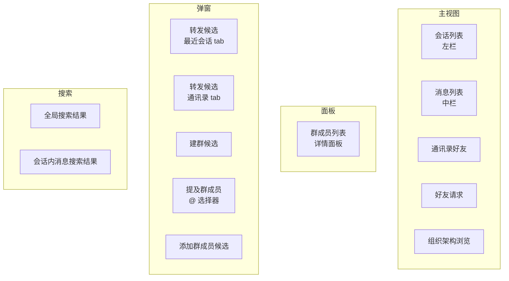
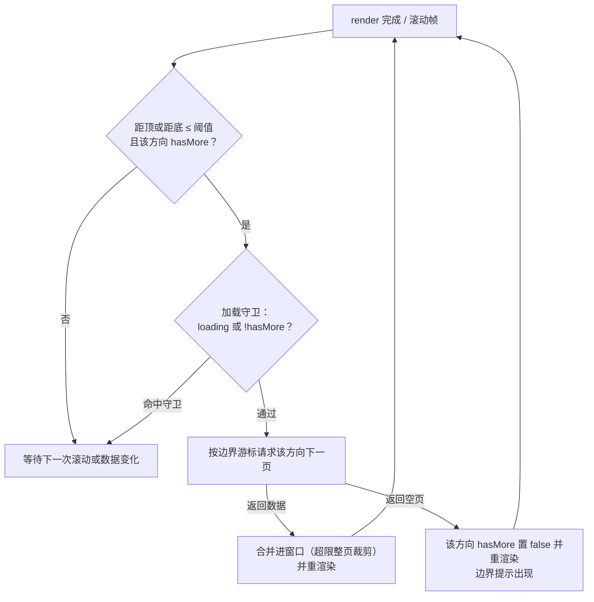
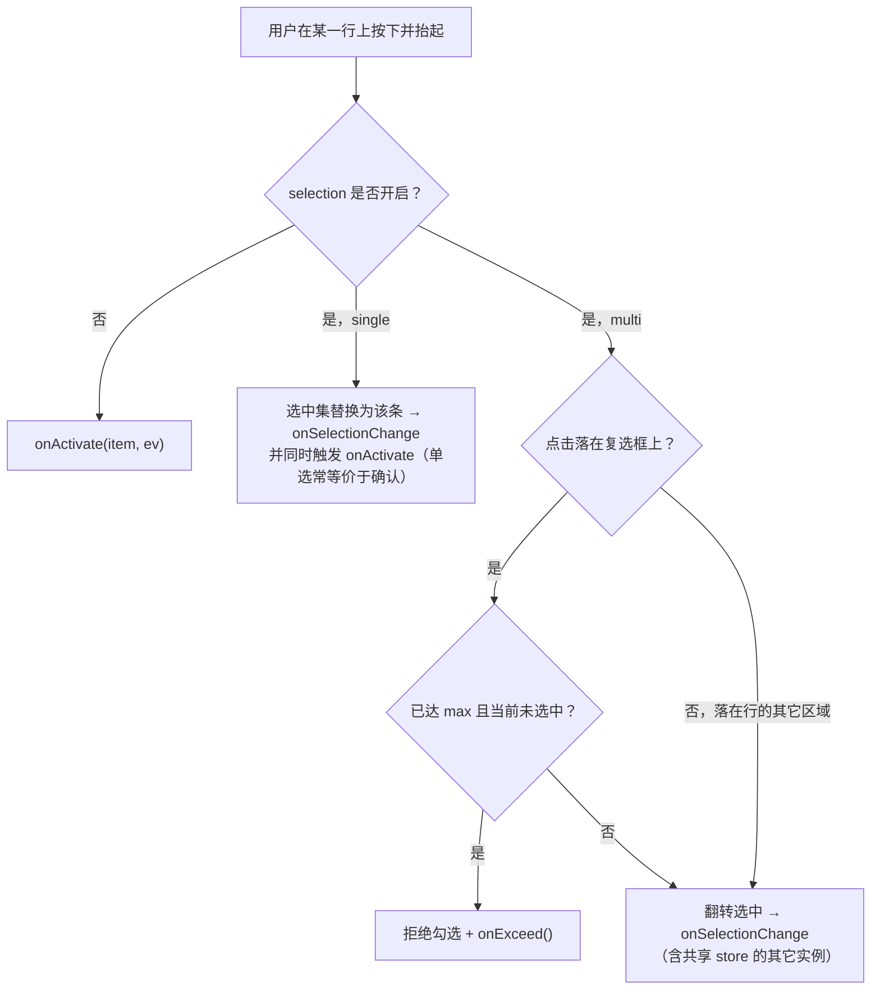
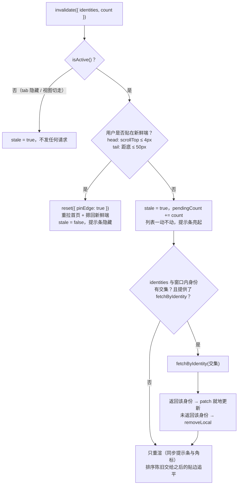
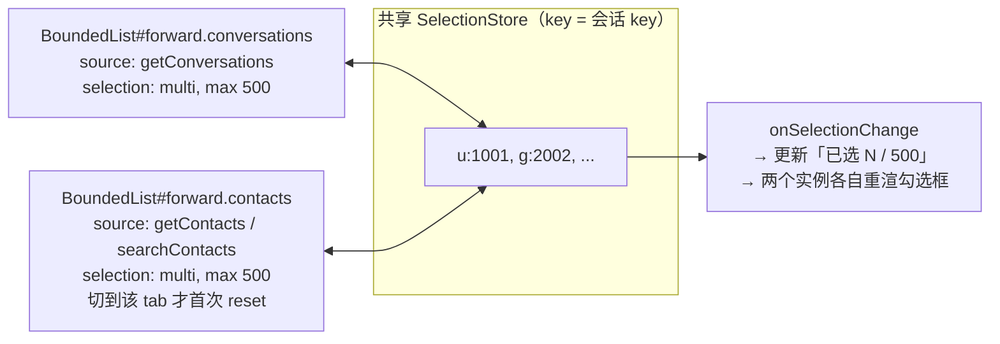

# 有界列表窗口组件设计方案

> 主要对照：`packages/uikit/src/app/bounded-list/`、`packages/uikit/tests/unit/bounded-list/`、`apps/web/tests/component/`、`apps/web/tests/performance/`、`apps/web/tests/support/bounded-list/`，以及已完成迁移的生产调用方 `packages/uikit/src/app/views/`（`views/chat/conversation-list.ts`、`message-list.ts`、`message-page.ts`、`message-search.ts`、`forward.ts`、`detail-panel.ts`、`views/contacts.ts`、`views/group-member-picker.ts`）与 `packages/uikit/src/app-config.ts`。旧生产路径 `bounded-page-window.ts`、`bounded-stream-window.ts` 与旧 `bounded-list.ts` 注册表已随迁移完成删除，历史实现见 git 历史。
> 最后复核：2026-07-29。
> 触发更新：列表渲染引擎、有界窗口分页 / 裁剪 / 边界游标算法、身份键口径、消息分页归一化、锚点策略、提示条行为、组件契约（参数 / 方法 / 事件）或列表分页配置变化时同步更新。
> 入口关系：上级索引见 [`README.md`](../README.md)；本文是 UIKit 有界列表**原理、目标态契约与生产迁移状态**的单一事实源，`UI设计方案.md` §8 保留概述性表格。§1–§6 是规范契约，§3 记录生产迁移的完成状态与仍未接入组件的剩余场景，§7 是当前实现（组件本身 + 各调用方）的逐文件对照，§8 记录剩余差距与验收状态。`bounded-list/` 已落地接口以 [`BoundedList组件设计.md`](BoundedList组件设计.md) 为准，fake DOM 单元 / 压力测试与 25 条修复记录见 [`BoundedList测试方案.md`](BoundedList测试方案.md)，真实 Chromium 与性能矩阵见 [`测试方案.md` §7](../../../docs/development/测试方案.md#7-boundedlist-playwright-与性能专项)，浏览器复测状态见 [`boundedlist/缺陷列表.md`](boundedlist/缺陷列表.md)。

## 目录

- [1. 组件定位与边界](#1-组件定位与边界)
  - [1.1 IM 里到处都是列表](#11-im-里到处都是列表)
  - [1.2 组件负责什么，不负责什么](#12-组件负责什么不负责什么)
  - [1.3 目标与取舍](#13-目标与取舍)
- [2. 原理](#2-原理)
  - [2.1 成本在 DOM，不在数据](#21-成本在-dom不在数据)
  - [2.2 三层模型](#22-三层模型)
  - [2.3 数据窗口：按页边界游标记账](#23-数据窗口按页边界游标记账)
  - [2.4 渲染窗口：有界全量渲染](#24-渲染窗口有界全量渲染)
  - [2.5 分页与触界](#25-分页与触界)
  - [2.6 锚点：内容双端变化时画面不动](#26-锚点内容双端变化时画面不动)
  - [2.7 新鲜端：每个列表只有一个新数据方向](#27-新鲜端每个列表只有一个新数据方向)
- [3. 现状：生产调用方迁移已完成](#3-现状生产调用方迁移已完成)
  - [3.1 已完成迁移的调用方](#31-已完成迁移的调用方)
  - [3.2 六处此前未接入组件的列表：四处已接入，两处保留现状](#32-六处此前未接入组件的列表四处已接入两处保留现状)
  - [3.3 旧生产路径曾有的缺陷（已随迁移解决）](#33-旧生产路径曾有的缺陷已随迁移解决)
- [4. 组件契约 BoundedList](#4-组件契约-boundedlist)
  - [4.1 最小可用示例](#41-最小可用示例)
  - [4.2 构造参数](#42-构造参数)
  - [4.3 命令式接口](#43-命令式接口)
  - [4.4 只读状态](#44-只读状态)
  - [4.5 组件抛出的事件](#45-组件抛出的事件)
  - [4.6 组件自持的 DOM 事件](#46-组件自持的-dom-事件)
  - [4.7 宿主事件路由表](#47-宿主事件路由表)
- [5. 核心行为剧本](#5-核心行为剧本)
  - [5.1 数据变化到提示条亮起](#51-数据变化到提示条亮起)
  - [5.2 命中窗口就定向拉单条](#52-命中窗口就定向拉单条)
  - [5.3 提示条自动消失的三条路径](#53-提示条自动消失的三条路径)
  - [5.4 点击一个条目会发生什么](#54-点击一个条目会发生什么)
  - [5.5 翻页与链式补页](#55-翻页与链式补页)
  - [5.6 本端产生的新条目](#56-本端产生的新条目)
  - [5.7 展示资料异步到达](#57-展示资料异步到达)
- [6. 场景矩阵](#6-场景矩阵)
  - [6.1 全部列表一张表](#61-全部列表一张表)
  - [6.2 转发选择目标](#62-转发选择目标)
  - [6.3 群成员列表](#63-群成员列表)
  - [6.4 提及群成员](#64-提及群成员)
  - [6.5 迁移后消失的重复代码](#65-迁移后消失的重复代码)
- [7. 当前实现逐文件对照](#7-当前实现逐文件对照)
  - [7.1 会话列表与消息列表](#71-会话列表与消息列表)
  - [7.2 通讯录](#72-通讯录)
  - [7.3 通讯录 tab 的 DOM 结构调整](#73-通讯录-tab-的-dom-结构调整为好友请求分页腾出独立滚动容器)
  - [7.4 转发弹窗、群成员、群成员选择器](#74-转发弹窗群成员群成员选择器)
  - [7.5 会话内消息搜索](#75-会话内消息搜索)
- [8. 差距清单与落地顺序](#8-差距清单与落地顺序)
  - [8.1 差距清单](#81-差距清单)
  - [8.2 分阶段落地](#82-分阶段落地)
  - [8.3 验收测试](#83-验收测试)
- [9. 配置参数说明](#9-配置参数说明)
- [10. CSS 约束](#10-css-约束)
- [11. 扩展阅读](#11-扩展阅读)

---

## 1. 组件定位与边界

### 1.1 IM 里到处都是列表

「列表」不是聊天窗口的一个附属控件，它就是 IM 前端本身。把当前 UIKit 里所有滚动的、可能超过一屏的、需要翻页的东西列出来：



十三处。它们的数据类型不同（`LocalConversation` / `Message` / `Contact` / `GroupMember` / `TagChild`），交互不同（点开 / 多选 / 单选 / 跳转），刷新策略不同（实时重排 / 弹窗生命周期内静止），但**滚动、翻页、裁剪、锚点、空态、边界提示、加载态、身份去重、提示条、选中态**这十件事完全一样。任何一处单独实现这十件事，都会在某个边界组合上出错——事实上现在就出错了（§3.4）。

结论：这必须是**一个组件**，不是两个工具类加十二份胶水。本文其余部分就是这个组件的契约。

### 1.2 组件负责什么，不负责什么

边界划清楚，组件才不会长成第二个 `app-instance`。

| | 组件负责 | 组件不负责 |
|---|---|---|
| 数据 | 分页拉取编排、窗口记账、整页裁剪、跨页去重、就地增删改 | 具体调哪个 SDK 方法（由 `fetchPage` 注入） |
| 渲染 | 清空重建、锚点保持、空态 / 加载态 / 边界提示、提示条 | 单行长什么样（由 `renderItem` 注入） |
| 滚动 | scroll 监听、帧合并、触界检测、贴边判定、指针期间推迟重建 | 容器的 CSS 高度与 `overflow`（由宿主保证，§10） |
| 事件 | 条目激活、选中变更、加载态变更、错误上抛 | 业务动作（打开会话、勾选转发目标…） |
| 生命周期 | 自己挂的所有监听的注销（`dispose`） | 宿主 DOM 的创建与销毁 |
| 通知 | 提供 `invalidate` 入口，按贴边规则决定追平还是提示 | 订阅 SDK 事件、决定哪个事件打给哪个列表（宿主路由，§4.7） |

最后一条是刻意的：组件**不直接订阅 SDK 事件**。「`messages:received` 该唤醒哪几个列表」是应用级知识，放进组件就把组件绑死在聊天语义上，`@` 选择器、组织架构这类列表根本不需要它。宿主把 SDK 事件翻译成一次 `invalidate()` 调用，组件只认这一个入口——这也让组件可以在不启动 SDK 的情况下单测。

### 1.3 目标与取舍

聊天应用的列表天然是长列表（消息数万条、会话和联系人成百上千），不能全量拉取、全量渲染。本项目用**单一模式**收敛复杂度：**有界滑动窗口 + 全量渲染 + 双向翻页**。明确取舍：

1. **滚动条不要求精确**，甚至不需要出现（CSS 已隐藏滚动条）。滚动空间只代表「已加载窗口」，绝不为未加载数据模拟高度。
2. **到顶 / 到底用轻量提示**：未加载数据只由 `hasMoreBefore` / `hasMoreAfter` 表达，滚到边界时显示「加载中」或「已到最早 / 已到最新 / 没有更多」。
3. **背景数据变化不打断浏览**：列表不动，只点亮提示条；只有用户已贴在「新鲜端」（§2.7）时才直接重拉。

这些取舍删掉了上一代实现里只为「滚动条精确」服务的全部复杂度：逐行实测高度（rAF 首测 + ResizeObserver）、测量缓存、估算校正，以及「固定行高窗口切片 + spacer」那一整套渲染路径。剩下的都是确定性计算：渲染只有一种模式，没有 `itemSize` / `spacer` / `overscan` 配置。

整个实现没有引入第三方虚拟列表库，全部用原生 TypeScript 和 DOM API 完成。

---

## 2. 原理

§2 讲与具体代码无关的原理；§4 起是组件契约；§7 是当前代码对照。

### 2.1 成本在 DOM，不在数据

一条数据在内存里只是一个几百字节的对象，数组放几万条毫无压力；但把它**渲染**出来是另一回事：每行至少是「容器 + 头像 + 文本」好几个元素节点，浏览器要为每个节点维护样式、布局和绘制信息。节点数上去之后，首次渲染、每次 reflow 乃至滚动合成都会变慢。

而屏幕高度是固定的：无论数据有多少，用户一次只能看见十几行。

```
全量渲染整个数据集：DOM 节点数 ∝ 数据总量   （必卡）
有界列表窗口：       DOM 节点数 ∝ 窗口上限   （恒定几十~一两百个节点，与数据量无关）
```

出发点就这一句：**渲染成本应该正比于「窗口里有多少」，而不是「一共有多少」。**

### 2.2 三层模型


- **数据源 `PageSource`** 抽象「怎么取一页」。两种实现：
  - `serverPageSource`：透传服务端不透明 keyset 游标（会话、消息、联系人、群成员、搜索结果……绝大多数场景）；
  - `localPageSource`：对一个已经全量加载到内存的数组做本地切片，游标就是下标。用于**刻意选择在客户端做过滤 / 排序**的场景（提及群成员按拼音排序 + 子串过滤，§6.4——这是为了不在群成员表冗余昵称而做的取舍，不是服务端能力缺失）。本地游标不会外传给服务端，不违反「游标对客户端不透明」。
- **数据窗口**解决「数据太多」：内存里只保留完整数据集中用户附近的若干页，靠分页拉取扩展、超限时整页裁剪收缩（§2.3）；
- **渲染窗口**解决「DOM 太多」：因为数据窗口本身有上限，渲染窗口干脆等于数据窗口，**全部渲染**（§2.4）。

关键在于：把 `localPageSource` 也纳进同一个数据窗口，本地全量数据同样只有一个有界切片进 DOM。**「一次性拉全量」和「一次性渲染全量」是两件独立的事**：前者在低频小集合上是合理的工程取舍（换取服务端零冗余、零同步负担），后者在任何规模下都不可以接受。区分这两件事，是 `localPageSource` 存在的全部理由。

### 2.3 数据窗口：按页边界游标记账

服务端展示通道是 **keyset 游标分页**：只能从已知边界顺序翻页，游标对客户端**不透明**（禁止客户端解析或构造，见[《同步机制方案》](../../../docs/architecture/同步机制方案.md)）。要做「裁掉一端、用户滚回去时再拉回来」的有界滑动窗口，关键是裁剪后还能找到那一端的续翻锚点。

做法是**按页记账**：窗口是若干「已加载页」的有序拼接，每页保存服务端随该页返回的 `start_cursor` 与 `end_cursor`。

```
完整集合（展示序）
----------------------------------------------------------------->

       page0            page1            page2
   [s0 .. e0]       [s1 .. e1]       [s2 .. e2]
       └ 首页 start_cursor=s0          尾页 end_cursor=e2 ┘
  hasMoreBefore?  ← 向前续翻用 s0      向后续翻用 e2 →  hasMoreAfter?
```

- 续翻向后（更靠后 / 更新）：用尾页 `end_cursor`，方向 FORWARD，结果追加到尾部；
- 续翻向前（更靠前 / 更旧）：用首页 `start_cursor`，方向 BACKWARD，结果插入到头部；
- 窗口最多保留 `maxPages` 页，**整页**从相反端裁剪，并把被裁端的 `hasMore` 置 true。

被裁掉的整页连同它的边界游标一起丢弃，但相邻保留页的边界游标仍是有效的续翻锚点——内存窗口只是完整集合上的一个视图，丢弃不等于丢失。整页裁剪让「裁剪后续翻」无需在客户端重建游标，天然契合不透明游标。

### 2.4 渲染窗口：有界全量渲染

经典虚拟列表只渲染视窗附近的行，再用 spacer 撑高滚动条，这要求「不渲染某行也能知道它有多高」——固定行高才算得准，变高行（消息气泡）就得「估算 + 实测 + 校正」，复杂度几乎全来源于此。

既然数据窗口已经有上限，就不必再切片：**窗口里的全部条目都渲染成真实 DOM**。高度不可知的根源是「想替没渲染的行报高度」，全部渲染后这个问题整个消失：没有 spacer、没有行高配置、没有估算误差、滚动零重建，行高永远是浏览器布局的真实值。一两百个节点对任何现代浏览器都是小负载，重建只发生在数据变化时。

### 2.5 分页与触界

放弃为完整数据集模拟总高度（§1.3 取舍 1）：**滚动空间只代表已加载窗口**。滚动条比例会随加载推进而变化，但聊天场景没人盯着滚动条看绝对位置（CSS 干脆隐藏了它），「还有没有更多」用边界提示文字表达足够。

剩下的只是何时翻页：滚动接近边界（距顶 / 距底不足一个阈值）且该方向 `hasMore` 时触发。



这个循环天然覆盖「首屏不足一屏」：render 后立即触界检测，内容不满一屏就继续补页，直到填满视窗或服务端返回空页——循环必然终止。

### 2.6 锚点：内容双端变化时画面不动

向头部插入一页更旧数据后，浏览器保持的是 `scrollTop` 这个**数值**，而不是用户正在看的**内容**：同一 scrollTop 之下内容整体被推下去一页，画面猛跳。

画面「不动」的精确定义是：用户正在看的那条（锚点）相对视口顶的偏移 `delta` 在重渲染前后不变。由此直接得出修正公式：

```
渲染前：delta = 锚点行顶 - 视口顶
渲染后：scrollTop += (锚点行新顶 - 视口顶) - delta
```

这个公式对头部插入、尾部裁剪、双端同时变化一视同仁。前提是渲染后读到的行位置就是最终布局，这正是全量渲染（无估算）才能给出的保证。

### 2.7 新鲜端：每个列表只有一个新数据方向

这是把三个列表各自的「贴顶 / 贴底」规则统一成一条契约的关键抽象。

每个列表都有一个**新鲜端**（`freshEdge`）：新数据总是从这一端进来。

| 列表 | 展示序 | 新鲜端 | 贴边判定 | 贴边时的自动行为 |
|---|---|---|---|---|
| 消息列表 | seq 升序（旧→新） | `tail`（底部） | 距底 ≤ 50px | 重拉最新一页并滚到底 |
| 会话列表 | seq 降序（活跃→沉默） | `head`（顶部） | 距顶 ≤ 4px | 重拉首页并滚回顶 |
| 通讯录 | sort_key 升序 | `head`（顶部） | 距顶 ≤ 4px | 重拉首页并滚回顶 |
| 弹窗内候选列表 | 各自 | `head` | — | 无背景刷新，不适用 |

有了这个抽象，「收到新数据怎么办」只有一条规则，不再需要每个列表各写一遍：

```
在新鲜端  → 直接追平（reset 到新鲜端），用户看到的就是最新
不在新鲜端 → 只点亮提示条，列表一动不动；用户回到新鲜端时自动追平
```

贴边阈值不同（50px vs 4px）是因为消息列表底部有输入框遮挡和图片异步增高，需要更宽的容差；会话 / 通讯录顶部没有这些干扰，必须严格贴顶才算「用户在看最新」，否则轻微滚动就会被误判成贴边而重排列表。

---

## 3. 现状：生产调用方迁移已完成

`packages/uikit/src/app/bounded-list/` 的独立 BoundedList 核心（§4 契约）与生产调用方现在是**同一条代码路径**：旧 `bounded-page-window.ts`、`bounded-stream-window.ts` 与旧 `bounded-list.ts`（`BoundedListController` 手工注册表）已随本次迁移删除，历史实现见 git 历史。旧生产旧路径曾有的 11 条缺陷（§3.4 旧版记录，见下）随旧代码删除一并消失；独立核心自身曾在真实浏览器中确认的 11 条缺陷同样已经全部关闭，历史与回归证据维护在 [`boundedlist/缺陷列表.md`](boundedlist/缺陷列表.md)。

### 3.1 已完成迁移的调用方

以下八处此前各自手写分页 / loading / 竞态守卫 / 提示条的场景，现在统一通过 `createBoundedList` 接入：

| # | 场景 | 文件 | identityOf | freshEdge | fetchByIdentity |
|---|---|---|---|---|---|
| 1 | 会话列表 | `views/chat/conversation-list.ts` | `conversationIdentity` | head | `getConversations({ targets })` |
| 2 | 消息列表 | `views/chat/message-list.ts` + `message-page.ts` | `messageKey` | tail | — |
| 3 | 通讯录好友 | `views/contacts.ts` | `contactIdentity` | head | `getContacts({ friendUids/groupIds/orgIds })` |
| 4 | 好友请求 | `views/contacts.ts` | `contactIdentity` | head | 同上 |
| 5 | 群成员 | `views/chat/detail-panel.ts` | `member.userId` | head | — |
| 6 | 转发候选（会话） | `views/chat/forward.ts` | `describeConversation(conv).key` | head | — |
| 7 | 转发候选（通讯录） | `views/chat/forward.ts` | `describeConversation(forwardContactConv(c)).key` | head | — |
| 8 | 建群候选 | `views/contacts.ts`（`showCreateGroupModal`） | `contactFriendUid` | head | — |

八处胶水收敛后的统一能力：`loadingBefore` / `loadingAfter` 独立、`reset` 后按 `freshEdge` 自动摁到对应端（`pinEdge` + `settleFrames`）、提示条由 `pillHost` + `text.updatePill` 统一管理、贴顶 / 贴底阈值收敛为 `stickyPx`（带 `freshEdge` 相关默认值）、关键字搜索统一走 `setQuery`（内置 300ms 防抖）、转发弹窗的选中态改为跨两个 tab 共享的 `SelectionStore`。

### 3.2 六处此前未接入组件的列表：四处已接入，两处保留现状

| 场景 | 文件 | 迁移状态 | 说明 |
|---|---|---|---|
| 我发出的好友请求 | `views/contacts.ts`（`getOutgoingRequestList`） | **已接入**，`serverPageSource` | 从「一次性拉 `pageSize×4=160` 条硬截断」改为按 `getContacts(PENDING_OUTGOING)` 双向翻页；与「待我处理」请求列表各自独立滚动（见 §10 CSS 变更） |
| 添加群成员候选 | `views/chat/detail-panel.ts`（`showAddMemberModal`） | **已接入**，`localPageSource` | 数据侧维持一次性全量拉取不变（低频操作的既有取舍），渲染侧改为有界窗口 |
| 提及群成员（@） | `views/group-member-picker.ts` | **已接入**，`localPageSource` + `pinnedItems`（“所有人”） | 数据侧同上维持不变；DOM 节点数恒定 ≤ `pageSize×maxPages`，新增键盘导航 |
| 会话内消息搜索结果 | `views/chat/message-search.ts` | **已接入**，`serverPageSource` | 从一次性 30 条改为 `searchMessages` 双向翻页；关键字为空时保持空白（不发请求），非空时走 `setQuery` |
| 全局搜索结果（联系人 + 消息） | `views/chat/global-search.ts` | **保留现状，未接入** | 仍是一次性拉取（联系人 8 条 + 消息 20 条）硬截断。两个结果分区当前共享同一个非独立滚动的结果面板，要按 §10 的思路给两个分区各自独立的滚动容器才能接入组件而不产生「共享滚动容器互相触发翻页」的问题；这是一次独立的小改动，留作后续任务 |
| 组织架构浏览 | `views/contacts.ts`（`renderOrgPanel`）、`views/org-admin.ts` | **保留现状，未接入** | 仍是 `getTags({ limit: 200 })` 一次性拉取 + `innerHTML` 拼接；`org-admin.ts` 是管理员专用工具弹层（改部门 / 成员 / 管理员），本来就不在原十三处列表场景之列 |

四个 SDK 方法（`searchMessages` / `searchContacts` / `getTags` / `getGroupMembers`）**全部支持 keyset 游标分页**，服务端能力是齐的；全局搜索与组织架构浏览未接入纯粹是客户端渲染侧尚未改造，不是能力缺口。

### 3.3 旧生产路径曾有的缺陷（已随迁移解决）

以下问题曾经来自已删除的生产旧路径，按严重度排列记录在案，供追溯；全部已通过迁移到 BoundedList 解决，不需要再单独修复：

| # | 缺陷 | 解决方式 |
|---|---|---|
| ① | 渲染引擎没有 `dispose`，弹窗每开一次泄漏两个 window 级监听 | `BoundedStreamWindow.dispose()` 注销全部监听（含 window 级 pointer 兜底）；`detail-panel.ts` 的 `showGroupDetail` 在重建前先 `dispose` 上一个群成员列表实例，`forward.ts` / `group-member-picker.ts` / `detail-panel.ts` 的 `showAddMemberModal` 在弹窗关闭路径统一调用 `dispose()` |
| ② | 「回到最新」提示条 `count<=0` 分支是死代码 | `text.updatePill` 由调用方一次性给出完整文案函数（`count>0` 显示条数，否则 `chat.jumpToLatest`），显隐只看 `stale`，不再要求 `count>0` |
| ③ | `pendingNewMessageCount` 触底空页路径不归零 | 组件内部 `pendingCount` 与 `stale` 在 `settleFreshEdgeBoundary` 里一起清零，不再是两个分散字段 |
| ④ | 部分调用方没有错误处理，产生未处理 Promise 拒绝 | 组件 `reset` / `loadMore` 内部统一 try/catch，未提供 `onError` 时兜底 `console.warn`，绝不向外抛出未处理拒绝 |
| ⑤ | 身份键 `identityOf` / `keyOf` 两套口径 | 组件合并为一个 `identityOf` 参数，去重与锚点共用同一次计算 |
| ⑥ | 数据窗口 `hasMoreBefore` / `hasMoreAfter` 曾是外部可写字段 | 组件内部状态私有，只读 `state.hasMoreBefore/hasMoreAfter` 由分页结果与 live 裁剪驱动，外部不可直写 |

---

## 4. 组件契约 BoundedList

规范契约与当前独立核心都是泛型组件 `BoundedList<T, Q>`：`T` 是条目类型，`Q` 是查询条件类型（关键字、状态过滤等，无查询条件时为 `void`）。实际目录：

```
packages/uikit/src/app/bounded-list/
  index.ts          对外只导出 createBoundedList 与类型
  bounded-list.ts   组件外壳：编排、生命周期、事件
  page-window.ts    数据窗口（今 bounded-page-window.ts 平移）
  stream-window.ts  渲染引擎（今 bounded-stream-window.ts 平移 + dispose）
  page-source.ts    serverPageSource / localPageSource
  update-pill.ts    提示条
  selection.ts      选中态
  registry.ts       BoundedListController 注册表（今 bounded-list.ts）
```

### 4.1 最小可用示例

以通讯录好友列表为例，组件化之后调用方只剩「取数据」和「画一行」两件事：

```typescript
const friends = createBoundedList<Contact, { keyword: string }>({
  id: 'contacts.friends',
  scrollElement: contactsScroller(),
  contentElement: app.$('friends-tab'),
  pillHost: contactsScroller().parentElement,

  pageSize: APP_CONFIG.list.pageSize,
  maxPages: APP_CONFIG.list.maxPages,
  source: serverPageSource(({ cursor, backward, limit, query }) =>
    query.keyword
      ? app.client.searchContacts({ keyword: query.keyword, status: CONTACT_FRIEND, cursor, backward, limit })
      : app.client.getContacts({ status: CONTACT_FRIEND, cursor, backward, limit }),
    (page) => ({ items: page.contacts, ...page.page }),
  ),
  fetchByIdentity: (ids) =>
    app.client.getContacts({ friendUids: ids }).then((p) => p.contacts),

  identityOf: contactIdentity,
  freshEdge: 'head',

  renderItem: (contact) => [renderContactRow(app, contact)],
  text: {
    empty: () => app.t('contacts.noFriends'),
    emptyFiltered: () => app.t('contacts.noSearchResults'),
    loading: () => app.t('common.loading'),
    tailBoundary: () => app.t('contacts.noMoreContacts'),
    updatePill: () => app.t('contacts.listUpdated'),
  },

  onActivate: (contact) => void showContactDetail(contact),
});

app.registerDisposer(() => friends.dispose());
void friends.reset();
```

对比现状：`contacts.ts` 里对应的 `loadFriendPage` + `renderFriends` + `applyFriendKeywordChange` + `maybeCatchUpStale` + `ensureContactsUpdatePill` + `syncContactsUpdatePill` 共约 170 行，其中只有 `renderContactRow` 那一段（约 40 行）是真正的业务。

### 4.2 构造参数

所有参数一次性在构造时给全，组件构造后不再变更配置（要变就重建）。文案类参数一律传函数而非字符串，因为语言可以在运行时切换。

#### 身份与宿主

| 参数 | 类型 | 必填 | 作用 |
|---|---|---|---|
| `id` | `string` | 是 | 列表唯一标识。用于向 `BoundedListController` 注册表登记（`invalidateBoundedLists` 广播的目标）、日志与调试。同 id 重复注册互相覆盖。 |
| `scrollElement` | `HTMLElement` | 是 | 原生滚动容器。组件在它上面挂 `scroll` / `pointerdown` / `pointerup` / `pointercancel`，并读它的 `scrollTop` / `scrollHeight` / `clientHeight` 做触界与贴边判定。**必须有确定高度和 `overflow-y: auto`**（§10）。 |
| `contentElement` | `HTMLElement` | 否 | 内容容器，默认等于 `scrollElement`。两个 tab 共用一个滚动容器时（通讯录的好友 / 请求），两个列表实例各自指向自己的内容节点，滚动容器相同、内容互不干扰。 |
| `pillHost` | `HTMLElement \| false` | 否 | 提示条挂载点，默认取 `scrollElement.parentElement`。传 `false` 表示这个列表不要提示条（弹窗内候选列表没有背景刷新，不需要）。 |
| `isActive` | `() => boolean` | 否 | 宿主可见性判定，默认恒 true。返回 false 时 `invalidate()` 只记 stale 不发请求——tab 隐藏、视图切走时不该为看不见的列表消耗请求。现状里这个判断散落成 `isFriendsTabActive()` / `!app.$('view-contacts').classList.contains('hidden')` 等各种写法。 |

#### 数据源

| 参数 | 类型 | 必填 | 作用 |
|---|---|---|---|
| `pageSize` | `number` | 是 | 每次拉取条数，透传给 `source`；必须是正安全整数。source 经 normalize 后返回超过该值时整页拒绝并进入错误态。 |
| `maxPages` | `number` | 是 | 正常翻页最多保留页数；必须是正安全整数。`pageSize × maxPages` 是 server、local 与 live 路径共同执行的内存 / DOM 硬上限。 |
| `source` | `PageSource<T, Q>` | 是 | 「怎么取一页」。见下。 |
| `fetchByIdentity` | `(ids: readonly string[]) => Promise<readonly T[]>` | 否 | **定向拉单条**。`invalidate({ identities })` 命中窗口内条目时用它按身份精确拉当前状态；返回结果里没有的身份视为已删除。不提供则 `invalidate` 退化为「只点亮提示条」。这是「更新的信息在窗口里就去拉那一条」这条需求的落点（§5.2）。 |
| `normalize` | `(items: readonly T[]) => T[]` | 否 | 每页入窗前的归一化，默认恒等。消息列表用它做「同 messageId 保留最新、删除态剔除、按 seq 升序」。 |

`PageSource` 的两种实现：

```typescript
type FetchPageRequest<Q> = {
  cursor?: string;        // 不透明游标；reset 时为 undefined
  backward: boolean;      // true = 向更靠前 / 更旧的方向
  limit: number;
  query: Q;               // 当前查询条件（关键字、状态过滤等）
};

// ① 服务端分页：游标原样透传，不解析、不构造
serverPageSource<R, T, Q>(
  fetch: (req: FetchPageRequest<Q>) => Promise<R>,
  map: (raw: R) => PageLoadResult<T>,
): PageSource<T, Q>

// ② 本地分页：对已全量加载的数组做切片，游标 = 下标
localPageSource<T, Q>(options: {
  loadAll: (query: Q, onProgress?: (loaded: number) => void) => Promise<T[]>;
  filter?: (item: T, query: Q) => boolean;
  compare?: (a: T, b: T) => number;
}): PageSource<T, Q>
```

`localPageSource` 让「必须本地过滤 / 排序」的场景也走同一个有界窗口：全量数据留在组件私有数组里（有上限、可释放），窗口里始终只有 `pageSize × maxPages` 条，DOM 里也只有这么多。`query` 变化时重跑 `filter` / `compare` 再从头切片。

source 契约是“请求多少，单页最多返回多少”：`PageLoadResult.items` 经 normalize 后不得超过 `pageSize`。恶意或错误 source 超量时组件抛 `RangeError`，reset 进入 `failed=true` 且不接纳部分页面；不做静默截断，避免游标与实际接纳条目错位。`localPageSource` 的并发 reload 还使用 generation：只有最新查询能发布共享续翻缓存和进度。

#### 身份键

| 参数 | 类型 | 必填 | 作用 |
|---|---|---|---|
| `identityOf` | `(item: T) => string` | 是 | **一个身份键，三处使用**：跨页去重（§7.2）、渲染锚点（`data-bsw-key`）、`invalidate({ identities })` 的匹配。合并成一个参数就从类型上消灭了 §3.4 ⑤ 的双口径问题。 |

身份键必须与**展示序键彻底解耦**：只由路由分片身份决定，绝不随实时重排或改名而变化。

| 数据类型 | 身份键 | 展示序键（会变） |
|---|---|---|
| `LocalConversation` | `friendUid:groupId` | `seq`（收到新消息就变） |
| `Contact` | `uid:groupId:orgId` | `sort_key`（改名就变） |
| `GroupMember` | `userId` | role 倒序 + uid 升序（角色变更就变） |
| `Message` | `messageId` | `seq`（**不可变**，因此消息的去重只是防御性兜底） |

#### 新鲜端与滚动

| 参数 | 类型 | 默认 | 作用 |
|---|---|---|---|
| `freshEdge` | `'head' \| 'tail'` | `'head'` | 新数据从哪一端进来（§2.7）。决定 `reset` 后把滚动摁到哪一端、贴边判定看哪一端、`invalidate` 时是否直接追平。 |
| `stickyPx` | `number` | head: 4，tail: 50 | 贴边判定阈值。取代现在散落的 `LIST_TOP_STICKY_PX` / `NEAR_BOTTOM_THRESHOLD_PX` 两个复制常量。 |
| `reachPx` | `number` | 160 | 触界加载阈值：距边界这么近就请求该方向下一页。 |
| `settleFrames` | `number` | head: 1，tail: 4 | `reset` 后把滚动摁到新鲜端时连续重设的帧数。`tail` 需要多帧是因为图片等富内容首帧还是占位尺寸（§7.4）。 |

#### 渲染与文案

| 参数 | 类型 | 必填 | 作用 |
|---|---|---|---|
| `renderItem` | `(item: T, ctx: RenderItemContext<T>) => readonly HTMLElement[]` | 是 | 画一行。首元素写 `data-bsw-key` 作为滚动锚点；所有平级根元素都写交互键，因此点击任一部分都映射到同一 identity。 |
| `pinnedItems` | `() => readonly T[]` | 否 | 钉在窗口条目**头部**、不进数据窗口的纯展示条目。用于会话列表的「空会话占位」（刚从通讯录点开、还没有任何消息的会话）。 |
| `text` | `BoundedListText` | 是 | 全部文案，惰性求值。 |

`RenderItemContext` 提供渲染这一行时需要的上下文，避免调用方从外部闭包里捞：

```typescript
interface RenderItemContext<T> {
  index: number;
  identity: string;
  selected: boolean;         // 选中态（selection 开启时）
  selectable: boolean;       // 未选中且已达 max 时为 false，用于禁用复选框
  previous: T | undefined;   // 上一条，用于「同一发送者不重复显示名字」这类逻辑
}
```

`BoundedListText` 全部可选，不提供就不渲染对应元素：

| 字段 | 出现位置 | 现状对应 |
|---|---|---|
| `loading` | 加载中的那一端 | `common.loading` |
| `empty` | 列表为空 | `chat.noConversations` / `contacts.noFriends` / `detail.noMembers` |
| `emptyFiltered` | 有查询条件但无结果 | `contacts.noSearchResults` |
| `headBoundary` | `!hasMoreBefore` 时固定显示在头部 | `chat.reachedEarliest` |
| `tailBoundary` | `!hasMoreAfter` 时固定显示在尾部 | `chat.reachedLatest` / `chat.noMoreConversations` / `contacts.noMoreContacts` |
| `updatePill` | 提示条文案，可接收 `count` | `chat.listUpdated` / `contacts.listUpdated` / `chat.newMessagesCount` |

#### 选中态

| 参数 | 类型 | 作用 |
|---|---|---|
| `selection` | `{ mode: 'single' \| 'multi'; max?: number; store?: SelectionStore; onExceed?: () => void }` | 不传则不可选。`max` 只用于组件内部新建 store；传外部 `store` 时上限由该 store 构造参数决定，`store+max` 同时出现会构造失败。共享 store 的多个实例自动同步；`onExceed` 在 store 拒绝新增时回调。 |

### 4.3 命令式接口

| 方法 | 签名 | 语义 | 并发与幂等 |
|---|---|---|---|
| `reset` | `(opts?: { query?: Q; pinEdge?: boolean }) => Promise<void>` | 清空窗口，无游标拉首页重建。`pinEdge` 默认 true：渲染后把滚动摁到 `freshEdge`（覆盖锚点恢复）。传 `query` 同时更新查询条件。 | 递增内部 requestId，旧请求返回后整体丢弃；在飞期间的本地最终态会在候选首页重放；overlay 溢出时拒绝旧响应、保留当前有界本地窗口并 `failed + stale`，不自动循环 |
| `loadMore` | `(dir: 'forward' \| 'backward') => Promise<void>` | 按该方向可信边界游标续翻一页，超限整页裁剪；容量游标失效时是显式追平入口。 | 在飞期间的本地最终态会在返回页并入后重放，live eviction 会作废基于旧边界的普通分页；overlay 溢出时丢弃页、封锁两端游标并进入 stale，但不置 `failed`；一次显式重试即可建立新快照，撞上已溢出的在途 reconcile 时立即以新 requestId 作废旧请求并新发无游标请求 |
| `setQuery` | `(query: Q, opts?: { debounceMs?: number }) => void` | 更新查询条件并 `reset`。`debounceMs` 由组件统一防抖（默认 300ms），取代调用方各写一个 `setTimeout` |
| `invalidate` | `(opts?: { identities?: readonly string[]; count?: number }) => void` | **轻通知唯一入口**。按 §5.1 的决策树决定「直接追平」还是「点亮提示条 + 定向拉单条」。`count` 用于「有 N 条新消息」的累加。 | 内部合并到下一帧执行，同一帧内多次 `invalidate` 只跑一次 |
| `upsertLocal` | `(item: T) => void` | 本端新条目先跨页去重，再并入新鲜端并按 `pageSize×maxPages` 从非新鲜端同步裁剪。eviction 后立即封锁被裁端旧游标；贴边用户后台 staged reconcile，离边用户先看到 stale。 | 当前有界 DOM 立即可见；任一数据请求在飞期间的新变更都会记录并重放，权威请求已在飞时不额外安排第二次追平 |
| `patch` | `(id: string, update: (item: T) => T) => boolean` | 就地更新窗口内该身份的条目，页结构与边界游标不变。返回是否命中。 | 使该 identity 的在飞定向刷新失效；任一数据请求期间记录 replace overlay |
| `removeLocal` | `(id: string) => boolean` | 就地删除窗口内该身份的条目，剩余条目自然往上补齐（防抖动）。返回是否命中。 | 使该 identity 的在飞定向刷新失效；任一数据请求期间记录 remove overlay |
| `render` | `() => void` | 用当前状态重渲。业务状态（如选中模式开关、高亮 id）变化后调用。 | 指针按下期间只记账不动 DOM，抬起后下一帧应用（§7.3） |
| `scrollToIdentity` | `(id: string, opts?: { block?: 'center' \| 'nearest' }) => boolean` | 把某个身份的行滚进视口。返回该身份是否在窗口内。用于搜索跳转定位（现状是 `message-search.ts` 自己 `querySelector` + `scrollIntoView`）。 | 同步 |
| `dispose` | `() => void` | 注销**全部**监听（含 window 级 pointer 兜底）、清空窗口与 `lastState`、从注册表注销、取消未完成请求的 apply。 | 幂等；调用后其它方法均为空操作 |

`dispose` 是当前完全缺失的能力，也是 §3.4 ① 泄漏的唯一正解。约定：**弹窗 / 面板级列表必须在关闭路径上 `dispose()`，页面级列表在 `app.registerDisposer` 里 `dispose()`。**

### 4.4 只读状态

```typescript
interface BoundedListState {
  loaded: boolean;          // 首屏是否已落定
  loading: boolean;         // 任一方向或 staged reconcile 正在加载
  loadingBefore: boolean;   // 头部方向正在加载（独立，不再和尾部共用一个布尔量）
  loadingAfter: boolean;    // 尾部方向正在加载
  hasMoreBefore: boolean;
  hasMoreAfter: boolean;
  count: number;            // 窗口内条目数（不含 pinnedItems）
  total: number;            // 服务端 page.total；小于 0 表示未知
  stale: boolean;           // 有待追平的背景更新（提示条是否亮）
  pendingCount: number;     // 待追平的条数，用于「有 N 条新消息」
  atFreshEdge: boolean;     // 当前是否贴在新鲜端
  failed: boolean;          // 最近一次首页 reset / 容量 reconcile 是否失败
}
```

- `total` 直接透传服务端 `PageInfo.total`，供「群成员 (238)」这类标题使用——现状是 `detail-panel.ts` 自己维护一个 `memberTotal` 变量并在每次翻页后手工同步。
- `hasMoreBefore` / `hasMoreAfter` 在组件里是**只读**的。正常值来自分页结果；live eviction 使被裁端游标失效时，该端立即对外屏蔽为 `false`，阻止自动触界使用旧 cursor。

### 4.5 组件抛出的事件

事件以构造参数里的回调形式提供（与仓库既有风格一致，且天然只有一个订阅者，不需要 on/off 生命周期管理）。

| 事件 | 签名 | 触发时机 | 组件的默认动作 | 典型用法 |
|---|---|---|---|---|
| `onActivate` | `(item, ev: Event) => void` | 用户点击某一行（`selection` 未开启时），或键盘 Enter / Space 落在某一行 | 无（纯通知） | 打开会话、打开联系人详情、跳转到搜索命中的消息 |
| `onSelectionChange` | `(snapshot: SelectionSnapshot<T>) => void` | 勾选 / 取消勾选，或共享 `store` 被另一个列表实例改动 | 重渲自己以同步勾选框 | 更新「已选 3 / 500」计数、启用确认按钮 |
| `onLoadStateChange` | `(state: BoundedListState) => void` | `loaded` / `loading*` / `hasMore*` / `count` / `total` 任一变化 | 重渲边界提示与加载提示 | 刷新「群成员 (238)」标题、禁用 / 启用外部按钮 |
| `onStaleChange` | `(stale: boolean, pendingCount: number) => void` | `stale` 翻转（背景更新到来 / 追平完成） | 同步提示条显隐与文案 | 需要在提示条之外另加视觉反馈时使用；一般不用 |
| `onItemsChanged` | `(items: readonly T[]) => void` | 窗口内容变化（翻页、裁剪、patch、remove、upsert） | 重渲 | 消息列表据此同步 `chatState.currentMessages` 投影、修剪已选中但已滚出窗口的 id |
| `onError` | `(error: unknown, phase: 'reset' \| 'forward' \| 'backward' \| 'refresh') => void` | 任一次拉取失败 | 恢复 loading 标志并重渲（保证不会定格在「加载中」） | `showToast`；不提供时组件 `console.warn`，**绝不产生未处理的 Promise 拒绝**（修掉 §3.4 ④） |
| `onEmptyPage` | `(dir: 'forward' \| 'backward') => void` | 某方向返回空页，该端 `hasMore` 收敛为 false | 重渲以显示边界提示；若该端是新鲜端，清 `stale` 与 `pendingCount` | 极少使用；`around` 锚点加载后的两端收敛可据此打点 |

关于「点击某个项会触发哪个事件」——这是最容易含糊的一点，明确如下：



补充两条组件必须自己兜住的细节：

- **指针按下期间不重建 DOM**。整列表 `innerHTML = ''` 重建会销毁鼠标按下的那一行节点，`mouseup` 落到新节点上，浏览器因「按下与抬起不在同一节点」而**不再派发 `click`**——点击被吃掉。组件在指针按下到抬起之间只更新状态、不动 DOM，抬起后下一帧再重建（§7.3）。
- **右键 / 长按不是 `onActivate`**。消息列表的操作菜单由 `renderItem` 自己在返回的元素上挂 `contextmenu` / `touchstart` 长按，组件不拦截，也不代劳。

### 4.6 组件自持的 DOM 事件

调用方不需要、也不应该再自己挂这些监听：

| 事件 | 挂在哪 | 组件做什么 |
|---|---|---|
| `scroll` | `scrollElement` | 经 `requestAnimationFrame` 帧合并 → 更新 `atFreshEdge` → 贴边追平判定（§5.3）→ 触界检测（§5.5） |
| `pointerdown` | `scrollElement` | 标记指针按下，之后的 `render` 只记账不动 DOM |
| `pointerup` / `pointercancel` | `scrollElement` **和** `window` | 清标记；有积压则安排到下一帧重建。挂 `window` 是因为指针可能在列表外抬起——**这两个监听必须在 `dispose` 里移除**（§3.4 ①） |
| `click` | `contentElement`（事件委托） | 按每个平级根元素的交互键定位条目 → 分发 `onActivate` / `onSelectionChange`；滚动锚点仍只认首根的 `data-bsw-key` |
| `keydown` | `scrollElement` | `↑` / `↓` 移动焦点行（到达窗口边缘时触发对应方向翻页），`Enter` / `Space` 激活，`Esc` 交给宿主。提及群成员场景必需 |
| `load`（捕获） | `contentElement` | 图片等异步增高内容加载完成时，若 `freshEdge='tail'` 且当前贴边，把滚动摁回底部（现状写在 `setup.ts` 里） |

### 4.7 宿主事件路由表

组件不订阅 SDK 事件，宿主（`main-app.ts`）负责翻译。目标态的完整路由：

| SDK 事件 | payload | 路由到哪些列表 | 调用 |
|---|---|---|---|
| `messages:received` | `{ messages, conversationKeys }` | 会话列表 | `invalidate({ identities: conversationKeys, count: messages.length })` |
| | | 当前会话消息列表 | `invalidate({ count: 1 })`（不消费 payload，追平时重读服务端） |
| `conversations:sent` | `{ keys }` | 会话列表 | `reset({ pinEdge: true })`——本端主动行为，无条件把该会话顶到最上面，不点亮提示条 |
| `conversations:clearunread` | `{ keys }` | 会话列表 | `invalidate({ identities: keys })`——只更未读角标，不重排 |
| `conversations:delete` | `{ keys }` | 会话列表 | 同上；定向拉取后该会话不存在即 `removeLocal` |
| `messages:deleted` | `{ messageId, key }` | 消息列表 | `removeLocal(messageId)` |
| | | 会话列表 | `invalidate({ identities: [key] })`（刷新预览） |
| `contacts:updated` | `{ reason }` | 好友列表、请求列表 | `invalidate()`（无 identities，只能整体追平或点亮提示条） |
| `session:sync` (success, messages/conversations) | — | 会话列表 | `invalidate()` |
| `session:sync` (success, contacts) | — | 好友列表、请求列表 | `invalidate()` |
| `display:updated` | `{ keys, scope }` | 全部可见列表 | `render()`——展示名 / 头像到达，只重渲不重拉（§5.7） |
| `org:updated` | `{ orgIds }` | 组织架构列表 | `invalidate()` |
| `connection:connected`（此前断过线） | — | 全部已注册列表 | 注册表广播 `invalidate()`，等价于每个列表各收到一次「有新数据」通知 |

`connection:connected` 那一行就是生产旧路径 `BoundedListController` / `invalidateBoundedLists()` 的能力。独立核心已经在构造时自动注册、`dispose` 时自动注销；生产视图迁移后才可删除 `main-app.ts` 手写的三段 `registerBoundedList`。

---

## 5. 核心行为剧本

### 5.1 数据变化到提示条亮起

`invalidate()` 是唯一入口，决策树如下。这条路径同时覆盖「收到新消息」「收到新联系人」「他端清未读」「他端删会话」——它们的差别只在有没有 `identities`。



为什么不在「不贴边」时也重排？因为重排会把用户正在看的那一行挪走，这正是「打断浏览」。所以列表位置纹丝不动，只有**已经在窗口里、用户可能正看着的那几条**被就地刷新（未读角标、最新预览、备注名），排序留到用户自己回到新鲜端时统一追平。这就是「轻通知 + 主动拉取」同步模型在 UI 层的具体形态。

### 5.2 命中窗口就定向拉单条

这是 §5.1 里 `fetchByIdentity` 那一支的展开，也是「如果更新的信息在窗口里，就触发注册的接口去拉那一条数据」这条需求的完整定义。

```
收到通知，带 identities = [A, B, C]
  ↓
与窗口内身份求交集
  ├ A 在窗口第 2 页 ✓
  ├ B 不在窗口（已被裁掉，用户看不见）✗ —— 不为它发请求
  └ C 在窗口第 4 页 ✓
  ↓
fetchByIdentity([A, C])  ← 一次批量请求，不是每条一次
  ↓
返回 { A: 新状态 }（C 不在返回里）
  ├ A → patch：就地替换第 2 页里的那一条
  └ C → removeLocal：从第 4 页剔除（服务端已删除）
  ↓
重渲：页结构与边界游标完全不变，续翻锚点不受影响
      剩余条目在 flatten 后自然往上补齐，不抖动
      窗口变短后触界检测按真实长度链式补页
```

三条设计要点：

1. **只拉看得见的**。不在窗口里的条目用户根本看不到，为它发请求纯属浪费；它的最新状态会在用户滚到那里、或整体追平时自然带回来。
2. **一次批量**。`fetchByIdentity` 收的是数组不是单个 id，映射到 `getConversations({ targets })` / `getContacts({ friendUids })` 这类批量接口。
3. **「拉不回来」等于「已删除」**。这让删除通知不需要单独的处理路径：`conversations:delete` 和 `conversations:clearunread` 走完全相同的代码，差别只在服务端返不返回那一条。
4. **按 identity generation/token 判陈旧**。窗口级 `requestId` 隔离 reset / reconcile / live eviction 世代；同 identity 的后发刷新或本地 `patch` / `removeLocal` / `upsertLocal` 再让旧响应失效。不同 identity 使用独立 token，因此并发请求可以分别落地，不被全局刷新序号误淘汰。refresh 先于旧普通分页落地时，接受的 found / absent 最终态写入 overlay，保证晚到旧页不回退新值、不复活删除项；backward / forward 双向并发时，overlay 在首个方向落地后继续保留，全部落定后再清理。没有旧分页在飞时则淘汰同 identity 旧 overlay。token 只为实际命中的在飞 identity 存活，并在成功、同步/异步失败、本地写入或窗口世代作废后立即释放。
5. **数据请求期间延后决策**。reset / loadMore / reconcile 在飞时收到的 identities 保持 pending，不在尚未落定的窗口上发定向刷新；数据请求落定后再对最新窗口求交集并执行，消除“先落地后被覆盖”和“旧结果晚到污染新窗口”两种竞态。

命中条目都不在窗口时仍然要重渲一次（同步提示条与未读角标），只是不发定向请求。

### 5.3 提示条自动消失的三条路径

提示条**不需要点**也会消失。这是明确的设计目标：点击只是三条路径中最不常用的一条的手动触发器。

| # | 路径 | 触发条件 | 效果 |
|---|---|---|---|
| ① | **用户自己滚回新鲜端** | 每个滚动帧检查：`stale && !loading && atFreshEdge` | 普通 stale 自动 `reset`；容量游标失效时改走 staged reconcile |
| ② | **翻页翻到了新鲜端的尽头** | 触界续翻拿到空页 → 该端 `hasMore = false` | 新鲜端之后已无未加载数据，`stale` 与 `pendingCount` 一并清零，提示条隐藏 |
| ③ | **调用方主动 reset** | 切换会话、切 tab、本端发送消息、点击提示条 | 提示条隐藏 |

路径 ① 就是现有的 `catchUpAtEdge` 契约，它把三处「stale && atEdge」的手写判断收敛成一个函数——当初正是因为消息列表漏挂了 `onScroll` 才导致「手动滑到底提示条不消失」。组件化后连这个函数都不必对外暴露：贴边追平是组件在滚动帧里自带的行为。

路径 ② 在当前代码里对消息列表**只做了一半**：`hasNewer` 归零使提示条隐藏，但 `pendingNewMessageCount` 没清（§3.4 ③），残留计数会带到下一次。组件必须把两者一起清。

### 5.4 点击一个条目会发生什么

事件分发规则见 §4.5 的决策图。这里补充每个真实场景点下去的完整链路：

| 场景 | 点击落点 | 组件事件 | 宿主动作 |
|---|---|---|---|
| 会话列表 | 整行 | `onActivate(conv)` | `openConversation`：设为当前会话 → `resetMessagePage` → 清未读 → 渲染头部 → 拉最新一页 → `scrollToBottom` |
| 通讯录好友 | 整行 | `onActivate(contact)` | `showContactDetail`：右侧详情面板 |
| 消息列表 | 气泡 / 图片 / 文件 | 无（`renderItem` 内部处理） | 打开大图、下载文件、展开转发详情 |
| 消息列表 | 「⋯」按钮 / 右键 / 长按 | 无（`renderItem` 内部处理） | `showMessageActionMenu` |
| 消息列表（多选模式） | 复选框 | `onSelectionChange` | 更新底部选择栏计数与按钮可用性 |
| 转发候选 | 整行或复选框 | `onSelectionChange` | 更新「已选 N / 500」；共享 store 让另一个 tab 的同一目标同步勾上 |
| 建群候选 | 复选框 | `onSelectionChange` | 更新「已选 N」；达上限后未选项禁用 |
| 群成员（群主视角） | 「−」按钮 | 无（`renderItem` 内部处理） | 确认弹窗 → `removeGroupMember` → 重开详情 |
| 提及群成员 | 整行 | `onActivate(member)` + 单选语义 | 关闭弹窗，把 `@昵称 ` 插入输入框，记入 `composerMentions` |
| 搜索结果 | 整行 | `onActivate(message)` | 切到目标会话 shell → `around` 锚点拉一页 → `scrollToIdentity` + 高亮 |

判断依据很简单：**「选一个东西」用组件事件，「对这一行做一件事」用 `renderItem` 里挂的监听**。组件不试图接管后者，否则要为「行内可能有几个按钮」定义一整套子事件协议，得不偿失。

### 5.5 翻页与链式补页

滚动帧里的触界检测（§2.5）：

```
maxScrollTop = scrollHeight - clientHeight
scrollTop ≤ reachPx                且 hasMoreBefore → loadMore('backward')
maxScrollTop - scrollTop ≤ reachPx 且 hasMoreAfter  → loadMore('forward')
```

组件只用 `hasMore*` 快照粗滤，真正的并发与终止守卫在 `loadMore` 内部（实时读 `loadingBefore` / `loadingAfter` / `hasMore*`）。这个分工很重要：快照会在回调修改状态之后、下次 render 之前过期，只靠快照会重复发请求。

「首屏不足一屏」由同一条循环覆盖：每次 render 末尾都做一次触界检测，内容不满一屏就继续补页，直到填满视窗或某方向返回空页。循环必然终止，因为每次要么窗口变长、要么某端 `hasMore` 收敛为 false。

`around` 锚点加载（搜索跳转）是特例：服务端按协议先乐观把两端 `has_more` 都置 true，客户端滚到真实边界拿到空页后再收敛。链式补页机制天然支持这一点，不需要额外代码。

### 5.6 本端产生的新条目

本端发送消息、转发成功回包，都是「我知道有一条新数据，且我手上就有它的完整内容」——不需要重新拉：

```
upsertLocal(message)
  ├ 先从全部保留页移除同 identity 旧值
  ├ 并入新鲜端所在的那一页（tail → 尾页，head → 首页）
  ├ 经 normalize（消息：去重 + 按 seq 排序）
  ├ 超过 pageSize×maxPages 时从非新鲜端逐条同步裁剪
  ├ 新鲜端方向的 hasMore 置 false（这就是最新的，后面没有了）
  └ 发生裁剪：立即封锁被裁端旧游标；贴边后台 staged reconcile，离边先标记 stale
```

`upsertLocal` 自己参与跨页去重，不能只依赖尾页 `normalize`。live 条目没有新的服务端游标，因此同步裁剪的第一步是立刻守住 DOM / 内存硬预算，并把被裁端的旧游标标为失效。此刻所有基于旧窗口边界的在飞普通分页也随窗口 `requestId` 一起作废，晚到结果不得修改当前窗口。此后自动触界不再暴露该端 `hasMore`；显式 `loadMore`、滚回新鲜端或点击提示条都改走 `cursor: undefined` 的 staged 权威 reconcile。

staged reconcile 不清空当前窗口：请求在飞时继续显示 capped rows；期间发生的 `upsertLocal` / `patch` / `removeLocal` 按 identity 合并为有界最终态 overlay。权威首页响应先在独立窗口完成 normalize、上限校验和变更重放，全部成功后才原子替换；失败时保留原数据，设置 `failed + stale` 并提供 retry。普通 reset 与 loadMore 在飞时也重放同一类本地最终态，不能让任何远端响应覆盖 live 变更。权威 reset / reconcile 已在飞时再次发生 live eviction，只进入当前 overlay，由当前请求重放；不能额外 schedule / invalidate 后再发第二次首页请求，否则第二次响应会覆盖首轮已重放成功的 live。

overlay 的唯一 identity 超过硬预算时，reset / reconcile 拒绝无法完整重放的响应，保留当前有界窗口并进入 `failed + stale`；普通 loadMore 则丢弃该页、封锁两端游标并进入 stale / 显式 staged reconcile，沿用普通分页错误模型而不把 `state.failed` 置真。三条路径都**绝不自动循环拉取**，因为组件无法擅自假设 source 已同步全部纯本地变化。用户或调用方一次显式 `loadMore` / 提示条重试把该时刻作为新的权威快照边界。若显式重试撞上 overlay 已溢出的在途 reconcile，组件立即递增 `requestId` 作废旧响应并发起新的 `cursor: undefined` 请求，无需第二次点击。若完整重放后再次 eviction，游标仍保持封锁，不能把不完整边界伪装成可信分页状态。

会话列表在本端发送时的行为不同：走 `reset({ pinEdge: true })` 而不是 `upsertLocal`，因为发送会改变**排序**（该会话跳到最活跃端），只有重拉首页才能拿到正确顺序。这是主动行为，把用户视口拽回顶部是符合预期的，不点亮提示条。

### 5.7 展示资料异步到达

昵称、群名、头像不存在条目数据里，而是走 SDK 的 `DisplayInfoCache`：`getUserInfos` / `getGroupInfos` 同步返回当前缓存快照，缓存未命中时在后台拉取，到达后广播 `display:updated`。

因此每次 render 前，调用方在 `renderItem` 之外还要为**窗口内全部条目**批量预取一次展示信息（窗口有界，这个批量是有上限的）。`display:updated` 到达后宿主只需 `render()`——不重拉数据，不动滚动位置，重渲时 `getUserInfos` 就能拿到新缓存。

`group-member-picker.ts` 现在自己订阅 `display:updated` 并在回调里重算受影响成员的展示名、重新排序、重渲。组件化后这条路径统一为：`display:updated` → 宿主 → `render()`；需要按展示名排序的场景（`localPageSource` 的 `compare`）由组件在重渲前重跑 `compare`。

---

## 6. 场景矩阵

### 6.1 全部列表一张表

组件化之后，十三处列表全部落在同一张表里。`freshEdge`、`selection`、`fetchByIdentity` 三列决定了它们行为上的全部差异。

| 场景 | 数据源 | `identityOf` | `freshEdge` | `selection` | `fetchByIdentity` | 背景刷新 | 当前状态 |
|---|---|---|---|---|---|---|---|
| 会话列表 | `getConversations` | `friendUid:groupId` | head | — | `getConversations({ targets })` | 提示条 + 定向刷新 | 已接入 |
| 消息列表 | `getMessages` | `messageId` | tail | 未使用组件内置 selection（call-site 刻意偏离，见下） | — | 提示条（计数） | 已接入 |
| 通讯录好友 | `getContacts` / `searchContacts` | `uid:groupId:orgId` | head | — | `getContacts({ friendUids/groupIds/orgIds })` | 提示条 + 定向刷新 | 已接入 |
| 好友请求 | `getContacts(PENDING_INCOMING)` | 同上 | head | — | 同上 | 提示条 + 定向刷新 | 已接入 |
| 我发出的请求 | `getContacts(PENDING_OUTGOING)` | 同上 | head | — | — | 无（`pillHost: false`） | **已接入** |
| 群成员 | `getGroupMembers` | `userId` | head | — | — | 无（面板重开重建） | 已接入 |
| 转发候选（会话） | `getConversations` | `describeConversation(conv).key` | head | multi，共享 store | — | 无 | 已接入 |
| 转发候选（通讯录） | `getContacts` / `searchContacts` | `describeConversation(forwardContactConv(c)).key` | head | multi，共享同一 store | — | 无 | 已接入 |
| 建群候选 | `getContacts(FRIEND)` | `contactFriendUid` | head | multi，max 500 | — | 无 | 已接入 |
| 提及群成员 | **`localPageSource`**（`getGroupMembers` 全量 + 拼音排序 + 子串过滤，数据侧有意为之，§6.4） | `userId` | head | single | — | 无 | **已接入**（渲染侧） |
| 添加群成员候选 | **`localPageSource`**（好友全量 − 已在群成员，本地子串过滤） | `uid` | head | —（点即添加） | — | 无 | **已接入**（渲染侧） |
| 会话内消息搜索 | `searchMessages({ target })` | `messageId` | head | — | — | 无 | **已接入** |
| 全局搜索结果 | `searchContacts` + `searchMessages` | — | — | — | — | 无 | **保留现状，未接入**（§3.2） |
| 组织架构浏览 | `getTags` | — | — | — | — | — | **保留现状，未接入**（§3.2） |

搜索结果列表的 `freshEdge` 是 head 只是形式上的取值——它们没有背景刷新、`pillHost: false`，新鲜端语义不参与任何判断。消息列表未使用组件内置 `selection` 是本次迁移的一处刻意偏离：消息行内有图片 / 引用块 / "⋯" 按钮等多个独立可点击区域，多选模式下"点行内任意位置切换勾选"的通用语义与"点具体区域触发该区域自己的动作"冲突，因此继续沿用调用方自己维护 `chatState.selectedMessageIds` 的写法（`message-list.ts` 的 `renderItem` 内联渲染勾选框并挂 `change` 监听），只是分页 / 边界 / 提示条部分接入组件。

### 6.2 转发选择目标

用户点名的第一个场景。转发弹窗要在**两个 tab** 里选目标：「最近会话」和「通讯录」，同一个人可能同时出现在两边，勾选必须同步。



关键设计：**选中集是一个独立对象，两个列表实例都指向它**。任一实例改动它，组件通知所有共享该 store 的实例重渲。现状是 `forward.ts` 在每个 change 回调末尾手工调用对方的 render 函数（`if (contactsLoaded || contactsLoading) renderContactItems();` / `renderConversationItems();`），既容易漏，也把两个列表耦合死了。

两个 tab 的其它差异都是参数级的：

- 通讯录 tab 带关键字搜索 → `setQuery({ keyword })`，防抖由组件负责；
- 通讯录 tab 切过去才首次拉 → 切 tab 时调 `reset()`，此前 `loaded=false` 显示 loading 文案；
- 通讯录条目要过滤掉组织类（不是会话目标）→ 在 `source` 的 `map` 里 filter，组件不感知。

**关掉弹窗时两个实例都必须 `dispose()`**——这正是现在泄漏最严重的地方。

### 6.3 群成员列表

详情面板里的成员列表。数据源直白（`getGroupMembers` 双向翻页），特别之处有三点：

1. **标题显示总数而非窗口条数**。`state.total` 直接来自服务端 `page.total`，「群成员 (238)」显示的是 238 而不是窗口里的 200。现状是 `detail-panel.ts` 自己维护 `memberTotal` 并在每次翻页后手工 `if (page.total >= 0) memberTotal = page.total;`，组件化后由 `onLoadStateChange` 自动驱动。
2. **行内有操作按钮**（群主可移除成员）。按 §5.4 的分工，这个按钮的监听挂在 `renderItem` 返回的元素上，不走组件事件。
3. **无背景刷新，面板重开即重建**。所以每次 `showGroupDetail` 都新建实例——**必须在重建前 `dispose()` 掉上一个**。现在没有 dispose，而 `showGroupDetail` 会被改备注、收藏、换头像、移除成员反复调用，是泄漏的第二大来源。

未来若要支持「成员变更实时反映」，只需补一个 `fetchByIdentity: (uids) => getGroupMembers 按 uid 批量`，其余不动。

### 6.4 提及群成员

用户点名的第二个场景：输入 `@` 弹出成员选择器。

现状（`group-member-picker.ts`）：循环拉最多 200 页（8000 人）→ 批量取展示名 → 按拼音排序 → 关键字子串过滤 → **把过滤后的全部条目逐个 `appendChild`**。八千人的群就是八千个 DOM 节点，正是有界列表要消灭的东西。

**「全量拉取 + 客户端排序过滤」是刻意的架构决策，本方案不改它。** `getGroupMembers` 没有关键字参数不是能力缺口，而是不做的结果：

- 群成员搜索要匹配的是**昵称 / 备注名**，而群成员表（`group_member`）**刻意不存昵称**——昵称的单一事实源是用户资料，前端读的是 SDK `DisplayInfoCache` 的快照。
- 要在服务端搜就必须把昵称冗余进群成员表。代价是：用户改一次名，要反查并更新他所在**全部群**的成员记录；这些记录按 `group_id` 分片，与按 `uid` 分片的用户资料不在同一个分片，跨分片批量写、失败重试、更新窗口期内的读写不一致全都要处理。为一个低频功能引入一条长期的跨分片同步链路，收益远不抵成本。
- 群成员选择是低频操作（点一次 `@` 才触发），一次性拉全量带来的等待可以接受；`groupMemberPicker.maxPages` 是防御游标不收敛的安全兜底，不是产品上限。

同样的取舍已经写在 `group-member-picker.ts` 的文件注释和 [`UI设计方案.md`](UI设计方案.md) §7.6 里，本文与之保持一致。

所以**数据侧维持现状**：继续一次性拉全量、继续在客户端按拼音排序和子串过滤、继续不发任何服务端搜索请求。要改的只有**渲染侧**——`localPageSource` 正是为这种「数据已经全在本地、但不能全量渲染」的场景准备的，它不改变数据获取方式，只把本地数组切成逻辑页喂给同一个有界窗口：

```typescript
const picker = createBoundedList<GroupMember, { keyword: string }>({
  id: 'group-member-picker',
  scrollElement: listEl,
  pillHost: false,
  pageSize: APP_CONFIG.list.pageSize,
  maxPages: APP_CONFIG.list.maxPages,

  source: localPageSource({
    // 数据侧完全沿用现有实现：一次性拉全量（低频操作，换取群成员表不冗余昵称），
    // 拉取进度通过 onProgress 反馈到「已加载 N 人」
    loadAll: (_query, onProgress) => loadAllMembers(app, groupId, excluded, onProgress),
    // 关键字过滤与拼音排序仍然都在本地，不发任何服务端搜索请求；query 变化时重跑
    filter: (m, q) => !q.keyword || nameOf(m).toLowerCase().includes(q.keyword.toLowerCase()),
    compare: (a, b) => collator.compare(nameOf(a), nameOf(b)),
  }),

  identityOf: (m) => m.userId || '0',
  freshEdge: 'head',
  selection: { mode: 'single' },
  renderItem: (m) => [renderMemberRow(app, m)],
  text: { loading: () => app.t('groupMemberPicker.loadingCount', { n: loadedCount }), /* … */ },
  onActivate: (m) => finish({ kind: 'member', uid: m.userId }),
});
```

改造后同时拿到四个当前没有的能力：

| 能力 | 现状 | 组件化后 |
|---|---|---|
| DOM 节点数 | ∝ 过滤后结果数（可达数千） | 恒定 ≤ `pageSize × maxPages` = 200 |
| 键盘导航 | 无（只能鼠标点） | `↑` / `↓` / `Enter` 由组件提供，输入 `@` 后可直接键选 |
| 滚动锚点 | 无（`display:updated` 重排后画面跳） | `identityOf` 锚点保持 |
| 边界提示 | 无 | 「没有更多成员」自动出现 |

而这四项全部**不涉及服务端与数据库**：请求次数、请求参数、`group_member` 表结构、昵称的存放位置都与今天完全一致。

「所有人」这个静态选项不属于成员数据，用 `pinnedItems` 钉在头部，不参与过滤与分页——语义与会话列表的「空会话占位」完全一致，复用同一个参数。

同一套 `localPageSource` 也直接覆盖「添加群成员」候选列表（`detail-panel.ts` 的 `showAddMemberModal`）：它按注释明确复用了群成员选择器同样的「低频操作、一次性全量拉取」取舍，渲染侧的问题与解法完全相同——数据侧同样一个字节都不用改。

### 6.5 迁移后消失的重复代码

| 类别 | 现在有几份 | 迁移后 |
|---|---|---|
| 分页编排（reset / forward / backward 三分支 + loading + requestId + 错误处理） | 8 | 1（组件内） |
| SDK `page` → `PageLoadResult` 的映射 | 8（其中 `contactPageLoad` 已抽出，其余内联） | 1（`serverPageSource` 的 `map`，每处一行） |
| 提示条 ensure / sync | 3 | 1（组件内） |
| 贴边追平判断 | 3（已用 `catchUpAtEdge` 抽出判断，但三处的守卫条件仍不一致） | 1（组件内，无需对外暴露） |
| 贴边阈值常量 | 2 份 `LIST_TOP_STICKY_PX` + 1 份 `NEAR_BOTTOM_THRESHOLD_PX` | 1（`stickyPx` 参数，带 `freshEdge` 相关默认值） |
| 关键字搜索 + 防抖 | 2 | 1（`setQuery`） |
| 选中态 + 上限 + 跨列表同步 | 3 | 1（`selection` + `SelectionStore`） |
| reset 后归零 / 摁到边缘 | 4 种写法 | 1（`pinEdge` + `settleFrames`） |
| 每行挂 click 监听 | 每处每行一个 | 1 个事件委托 |

粗估：约 600 行胶水收敛为约 250 行组件代码 + 每处 20~40 行配置。更重要的不是行数，是**边界行为从此只有一份实现**——§3.2 里那些「写岔了」的不一致再也不会出现。

---

## 7. 当前实现逐文件对照

组件内部实现（数据窗口 `PageWindow`、渲染引擎 `BoundedStreamWindow`、跨页去重、选中态、提示条、事件委托与键盘导航）以 [`BoundedList组件设计.md`](BoundedList组件设计.md) §7–§13 为单一事实源，本节不重复；这里只记录**各调用方怎么接线**——每处传了什么 `identityOf` / `freshEdge` / `fetchByIdentity`，以及页面级 DOM 结构上需要注意的地方。

### 7.1 会话列表与消息列表

`views/chat/conversation-list.ts` 的 `getConversationList(app)` 惰性创建 `app.chatState.conversationList`（首次创建即 `reset()`），`identityOf = conversationIdentity`（`friendUid:groupId`），`freshEdge: 'head'`，`fetchByIdentity` 用 `getConversations({ targets })`。SDK 通知（`conversations:clearunread` / `delete`、`messages:received` 的 `conversationKeys`）携带的 key 是 `describeConversation().key` 口径（`u:<uid>` / `g:<gid>`），与 `identityOf` 的路由身份口径不同，`sdkKeyToIdentity` / `identityToTarget` 两个函数负责互转，不能直接混用。「空会话占位」通过 `pinnedItems` 钉在窗口头部。`refreshConversations(keys)` 在 `invalidate({ identities })` 之外，单独对"当前打开的会话是否已被删除"做一次直接的 `getConversations({ targets })` 确认，命中则 `closeStaleConversation`——这是业务规则，不是组件通用能力，因此没有塞进 `fetchByIdentity` 路径。

`views/chat/message-list.ts` 的 `getMessageList(app)` 同样惰性创建、全程复用同一个实例，`identityOf = messageKey`，`normalize = sortUniqueBySeq`，`freshEdge: 'tail'`，`isActive` 判断当前会话是否存在且聊天视图可见。查询类型 `MessageQuery = { aroundMsgId?: string }` 承载搜索跳转的锚点加载：`aroundMsgId` 非空且 `cursor===undefined` 时 source 改用 `getMessages({ around })`，否则按 `cursor`/`backward` 正常翻页。切换会话即调用 `reset({ query: {} })`（不再手写 `messagePageRequestId` 竞态判断——组件自身的 `requestId` 已经保证旧请求不会覆盖新窗口）；`message-page.ts` 收缩为薄封装：`resetMessagePage` 只清高亮 / 选中 / 待发送状态并返回一个世代计数器（供 `message-search.ts` 的锚点跳转在 `await` 之后判断自己是否仍是最新意图），`appendLiveMessageToPage` / `removeMessageFromPage` 直接委托 `messageList.upsertLocal` / `removeLocal`。新消息提示条、"回到最新"文案、`pendingCount` 记账全部收敛进组件的 `pillHost` + `text.updatePill`，不再有 `message-list.ts` 自己的 `ensureNewMessagePill`；图片等异步增高内容的贴底回弹也改由组件自身的 `onContentLoad` 处理，`setup.ts` 不再需要手动订阅 `message-list` 的 `load` 事件。

消息列表**没有**使用组件内置的 `selection` 参数：消息行内有图片 / 引用块 / "⋯" 按钮等多个独立可点击区域，多选模式下"点行内任意位置切换勾选"的通用语义与"点具体区域触发该区域自己的动作"冲突，因此继续沿用 `chatState.selectedMessageIds` + `renderItem` 内联勾选框 `change` 监听的写法，只是分页 / 边界 / 提示条部分接入组件。

### 7.2 通讯录

`views/contacts.ts` 有三个独立的 `BoundedList<Contact, ...>` 实例：好友（`contacts.friends`，`initialQuery.keyword` 承载关键字搜索、非空时 source 改走 `searchContacts`）、待我处理的请求（`contacts.requests`）、我发出的请求（`contacts.outgoingRequests`，`pillHost: false`，无背景刷新）。三者 `identityOf` 都是 `contactIdentity`（`uid:groupId:orgId`），`fetchByIdentity` 把身份串按 `:` 拆成三段分别归入 `friendUids` / `groupIds` / `orgIds` 后一次批量调用 `getContacts`。建群候选（`showCreateGroupModal` 里的临时 `BoundedList`）用组件内置 `selection: { mode: 'multi', max, onExceed }` 替代手写的 `selectedUids` 上限判断。

**组织架构浏览（`renderOrgPanel`）与全局搜索（`global-search.ts`）目前仍保持一次性拉取的旧写法，未接入组件**，原因与后续计划见 §3.2。

### 7.3 通讯录 tab 的 DOM 结构调整（为好友请求分页腾出独立滚动容器）

好友 / 请求 / 搜索三个 tab 原先共用同一个可滚动的 `.contacts-content` 容器（`overflow-y: auto`），组件迁移前"我发出的请求"是不分页的一次性渲染，和"待我处理的请求"叠放在同一个滚动物理空间里没有问题。迁移后两者都要独立触发滚动分页，若仍共享同一个 `scrollElement`，两个 `BoundedList` 实例会挂在同一个 DOM 节点上，其中一个的翻页会被另一个的滚动位置误触发。因此改为：

```
.contacts-content { overflow: hidden; display: flex; flex-direction: column; }  // 不再自己滚动
  #friends-tab   { height: 100%; overflow-y: auto; }               // 好友列表自己的滚动容器
  #requests-tab  { height: 100%; display: flex; flex-direction: column; overflow: hidden; }
    #requests-outgoing-title  // 静态标题，仅在 outgoingRequestList 的 count>0 时显示
    #requests-outgoing  { flex: 0 0 auto; max-height: 38%; overflow-y: auto; }  // 我发出的请求
    #requests-incoming  { flex: 1; overflow-y: auto; min-height: 0; }          // 待我处理的请求
  #search-tab    { height: 100%; overflow-y: auto; }
```

`contacts.friends` 的 `scrollElement` 是 `#friends-tab`，`contacts.requests` 是 `#requests-incoming`，`contacts.outgoingRequests` 是 `#requests-outgoing`，三者互不干扰。

### 7.4 转发弹窗、群成员、群成员选择器

`views/chat/forward.ts` 的两个 `BoundedList`（会话 tab、通讯录 tab）共享同一个 `SelectionStore(FORWARD_MAX_TARGETS)`：任一 tab 勾选后组件自动通知另一个重渲勾选框，替代旧的"手工调用对方 render 函数"。两者 `identityOf` 都是 `describeConversation(...).key`（不是路由身份），因为共享选中集的 key 必须是同一个空间。弹窗关闭时显式 `dispose()` 两个实例——这正是设计方案 §3.3 ①旧内存泄漏的位置。

`views/chat/detail-panel.ts` 的 `showGroupDetail` 每次调用都先 `dispose()` 上一个群成员列表实例（用 `WeakMap<AppInstance, BoundedList<GroupMember>>` 记录当前实例）再新建，面板 HTML 先铺一个"头部占位 + `#members-list` 容器"的骨架、`reset()` 拿到首页确定 `isOwner`（决定要不要展示换头像入口）之后只重写头部区域，不重建 `#members-list`（否则会把刚绑定监听的滚动容器节点顶替掉）。`showAddMemberModal` 改用 `localPageSource`：`loadAll` 复用原有的"全量拉群成员用于排除 + 全量拉好友"两阶段一次性拉取（数据侧完全不变），`filter`/`compare` 做本地关键字过滤和拼音排序，渲染侧交给组件。

`views/group-member-picker.ts` 同样用 `localPageSource` 包住原有的一次性全量拉取，`pinnedItems` 钉住"所有人"选项（`includeMentionAll` 时），`selection: { mode: 'single' }` 让鼠标点击和键盘 `Enter` 都能触发 `onActivate` 完成选择。**已知限制**：`localPageSource` 的 `compare`/`filter` 只在首次 `loadAll` 时按当时可得的展示名跑一次，`display:updated` 到达后 `renderItem` 会现读最新缓存显示正确的名字，但不会触发重新排序；且当"所有人"被钉住时，`pinnedItems` 参与 `items.length` 计算，导致关键字过滤后即使真实成员为空也不会出现 `emptyFiltered` 文案（只是没有真实成员行，视觉上够清楚）。两者都是可接受的低频操作范围内的简化，均不涉及数据正确性。

### 7.5 会话内消息搜索

`views/chat/message-search.ts` 的结果列表是一个按 `{ keyword }` 查询的 `BoundedList<Message, { keyword: string }>`；`initialQuery` 与当前 query 相等（即关键字为空）时 `isQueryActive()` 为 false，没有配置 `text.empty`，因此未搜索状态保持空白，只有关键字非空且零结果时才显示 `text.emptyFiltered`（"未找到相关消息"）。清空关键字走 `debounceMs: 0` 立即回到空白态，非空关键字沿用组件默认 300ms 防抖；`Enter` 键同样立即触发。

---

## 8. 差距清单与落地顺序

当前完成状态：

| 范围 | 状态 |
|---|---|
| 独立 BoundedList 核心与 Vitest 套件 | 已实现 |
| 真实 Chromium 功能 / 性能专项 | 已实现；51 个功能 + 6 个性能用例全部 PASS，12 个历史缺陷均 CLOSED |
| 页面级列表迁移（会话、消息、通讯录好友 / 请求） | **已完成** |
| 弹窗 / 面板列表迁移（转发候选、群成员、建群候选） | **已完成** |
| 六处未接入列表补齐 | **四处已完成**（我发出的请求、添加群成员候选、提及群成员、会话内消息搜索）；**两处保留现状**（全局搜索、组织架构浏览，见 §3.2） |
| 旧窗口和手写胶水删除 | **已完成**：`bounded-page-window.ts`、`bounded-stream-window.ts`、旧 `bounded-list.ts` 注册表已删除 |

### 8.1 差距清单（历史记录，全部已解决或明确保留）

| # | 差距 | 解决状态 |
|---|---|---|
| 1 | 渲染引擎没有 `dispose`，window 级 pointer 监听不注销 | 已解决：组件 `dispose()` 统一注销；转发弹窗、群详情、建群候选、群成员选择器、添加成员弹窗关闭路径均已调用 |
| 2 | 消息提示条 `count <= 0` 时恒隐藏，无「回到最新」入口 | 已解决：`text.updatePill` 一次性给出完整文案，显隐只看 `stale` |
| 3 | 触底空页路径不清 `pendingNewMessageCount` | 已解决：组件内部 `pendingCount` 与 `stale` 统一清零 |
| 4 | 两处翻页没有 `catch`（转发候选、群成员） | 已解决：组件 `reset`/`loadMore` 内部统一 try/catch，`onError` 兜底 |
| 5 | 提及群成员 / 添加群成员候选的**渲染侧**未接入组件 | 已解决：两处均改用 `localPageSource`，数据侧一次性全量拉取不变 |
| 6 | 身份键双口径（`identityOf` / `keyOf`） | 已解决：合并为一个 `identityOf` |
| 7 | 缺 `PageSource` 抽象（尤其 `localPageSource`） | 已解决：`serverPageSource` / `localPageSource` 均已实现并投入使用 |
| 8 | 缺共享 `SelectionStore` | 已解决：转发双 tab、建群候选、群成员选择器均已使用 |
| 9 | 缺统一提示条组件 | 已解决：`pillHost` + `text.updatePill` |
| 10 | 缺统一 `setQuery` 防抖 | 已解决：好友列表、转发通讯录 tab、消息搜索均已使用组件内置防抖 |
| 11 | `loadingBefore` / `loadingAfter` 共用一个布尔量 | 已解决：组件内部独立维护两个方向 |
| 12 | `hasMoreBefore` / `hasMoreAfter` 公开可写 | 已解决：组件内部状态私有，只读 `getState()` |
| 13 | 缺 `total` 透传 | 已解决：`state.total` 直接来自 `PageInfo.total` |
| 14 | 缺键盘导航与 a11y | 已解决：组件统一提供 `role`/`tabindex`/方向键/Enter |
| 15 | 会话内搜索 / 我发出的请求四处无分页，硬截断——与群成员两处的「有意全量」不同 | **三处已解决**（会话内搜索、我发出的请求、添加群成员/提及群成员的渲染侧）；**全局搜索、组织架构浏览保留现状**（§3.2），是本次迁移明确划定的范围边界，不是遗漏 |
| 16 | 空列表 + `hasMore=true` 时不做触界检测 | 已解决：组件空态分支同样执行 `checkReach()` |
| 17 | 独立核心质量门禁已满足，生产视图尚未迁移 | 已解决：本节顶部状态表 |

### 8.2 分阶段落地（全部完成）

**阶段 0：止血** —— 已被后续阶段直接吸收：旧生产路径整体删除，dispose / 提示条 / 错误处理等修复直接体现在新实现里，不需要再对旧代码打补丁。

**阶段 1：抽出组件外壳** —— 已完成（独立核心 + Vitest + Chromium 专项）。

**阶段 2：迁移页面级列表** —— 已完成：好友请求 → 通讯录好友 → 会话列表 → 消息列表全部迁移，`refreshConversations` 收敛为 `invalidate({ identities })` + `fetchByIdentity`，`message-page.ts` 投影同步改为 `onItemsChanged`。

**阶段 3：迁移弹窗 / 面板列表 + 选中态** —— 已完成：`SelectionStore` 已实现并用于转发候选（双 tab 共享 store）、建群候选、群成员选择器。

**阶段 4：补齐未接入的列表** —— 四处已完成（提及群成员、添加群成员候选、我发出的请求、会话内消息搜索），数据侧的一次性全量拉取按计划保持不变，只换渲染层；全局搜索与组织架构浏览保留现状，留作后续独立任务（需要先解决共享滚动容器的布局问题，见 §3.2）。

**阶段 5：清理** —— 已完成：`bounded-list.ts` 手写的三处 `registerBoundedList` 已删除（各 `BoundedList` 通过 `register` 参数自行登记），`LIST_TOP_STICKY_PX` 重复常量已随迁移消失，a11y 属性由组件统一提供。

### 8.3 验收测试

验收分三层：

| 层级 | 位置 | 当前口径 |
|---|---|---|
| Vitest 组件级 | `packages/uikit/tests/unit/bounded-list/*.test.ts` | 8 个文件、441 项，覆盖组件外壳、PageWindow、server / local PageSource、SelectionStore、registry、StreamWindow、提示条 |
| Chromium 功能 | `apps/web/tests/component/bounded-list.spec.ts` | 50 个真实浏览器用例，覆盖参数、命令、回调、DOM 事件、并发、错误与生命周期 |
| Chromium 性能 | `apps/web/tests/performance/bounded-list.performance.spec.ts` | 6 个用例，覆盖 100,000 条本地数据、逻辑 1,000,000 条、250 页、10,000 次 invalidate、300 次创建 / 销毁和 1,000 次实时插入 |

截至 2026-07-29，功能 spec 51 项全部 PASS，性能 spec 6 项全部 PASS，57 项中没有 `test.fail`、`skip` 或 `fixme`；`BL-BUG-001`～`012` 全部 CLOSED。完整矩阵、阈值、单 worker / project dependency 见 [`docs/development/测试方案.md` §7](../../../docs/development/测试方案.md#7-boundedlist-playwright-与性能专项)，关闭证据见 [`boundedlist/缺陷列表.md`](boundedlist/缺陷列表.md)。

验收完成必须同时满足：

1. 51 项功能与 6 项性能正确期望断言全部作为普通测试通过，不得删除、跳过或放宽。
2. DOM 和数据窗口在 server page、local page 与连续 `upsertLocal` 三条路径都满足 `pageSize×maxPages` 硬上限。
3. 独立性能专项按 [`测试方案.md` §7.6](../../../docs/development/测试方案.md#76-执行命令与项目依赖) 的单 worker 命令完成验证。
4. 从仓库根目录执行 `./tools/run_all_tests.sh` 全量通过；其 component 分类以 `chromium-component`、零重试包含 BoundedList 功能 spec，但按要求不运行性能 spec。性能另由 `./tools/run_performance_tests.sh` 独立验证。

---

## 9. 配置参数说明

文件：`packages/uikit/src/app-config.ts`

| 场景 | 参数 | 默认值 | 含义 |
|---|---|---|---|
| 消息列表 | `chat.messagePageSize` | 30 | 每次拉取消息条数 |
| 消息列表 | `chat.messagePageMaxPages` | 5 | 消息窗口最多保留页数（30×5=150 条上限） |
| 其它列表 | `list.pageSize` | 40 | 会话 / 通讯录 / 群成员 / 转发候选 / 建群候选每页拉取条数 |
| 其它列表 | `list.maxPages` | 5 | 列表窗口最多保留页数（40×5=200 条上限） |
| 提及群成员 | `groupMemberPicker.maxPages` | 200 | 一次性全量拉取的安全上限（页），防御游标不收敛 |
| 建群 | `memberPicker.maxSelected` | 500 | 建群成员选择上限 |
| 转发 | `forward.maxTargets` | 500 | 转发目标选择上限 |

组件内部常量（`bounded-list/stream-window.ts`）：`DEFAULT_REACH_PX = 160`（触顶 / 触底加载触发阈值，可用 `reachPx` 覆盖）。视图层的贴边阈值、settle 帧数已经收敛为组件构造参数 `stickyPx`（默认 head 4px / tail 50px）与 `settleFrames`（默认 head 1 帧 / tail 4 帧），不再有 `LIST_TOP_STICKY_PX` / `NEAR_BOTTOM_THRESHOLD_PX` 这类各处复制的常量；`message-list.ts` 仍保留 `NEAR_BOTTOM_THRESHOLD_PX` 与 `isNearBottom()`，但只用于 `view-refresh.ts` 判断"外部重渲染后要不要保持贴底"，与组件内部的贴边判定无关。`scrollToBottom` 的 4 帧稳定循环仍作为独立工具函数保留，供本端发送 / 转发成功（`upsertLocal` 不自动滚动到底）等场景显式调用。

## 10. CSS 约束

```css
/* 滚动容器：必须有明确高度和 overflow-y:auto */
#conversation-list { flex: 1; overflow-y: auto; }
#message-list      { flex: 1; overflow-y: auto; padding: 16px; }
#members-list       { max-height: 320px; overflow-y: auto; }
#friends-tab        { height: 100%; overflow-y: auto; }
#requests-incoming  { flex: 1; overflow-y: auto; min-height: 0; }
#requests-outgoing  { flex: 0 0 auto; max-height: 38%; overflow-y: auto; }
#message-search-results { max-height: 280px; overflow-y: auto; }
```

`.contacts-content` 本身不再是滚动容器（`overflow: hidden; display: flex; flex-direction: column;`），好友 / 请求 / 搜索三个 tab 各自拥有独立的滚动容器——迁移前三者共用 `.contacts-content` 一个滚动物理空间没有问题（旧版"我发出的请求"是一次性渲染，不参与滚动分页触发），迁移后"我发出的请求"与"待我处理的请求"都要独立触发翻页，必须拆成两个互不干扰的 `scrollElement`（详见 §7.3）。

所有列表都是有界窗口全量渲染：组件在数据变更时用 `identityOf` 锚点保持视口位置，滚动不重建 DOM，因此统一保留浏览器原生 scroll anchoring 兜底头像 / 图片等异步增高，**不再**对任何列表设 `overflow-anchor: none`，也不再有 spacer 元素。

提示条样式同在 `style.css`：`createUpdatePill` 统一生成 `.list-updated-pill.new-message-pill` 结构，`hidden` 类控制显隐；会话列表、通讯录好友 / 请求列表默认挂在 `scrollElement.parentElement` 下，消息列表默认挂在 `#message-list` 的父元素下，视觉位置与旧版一致。`.list-boundary-hint` 是边界 / 加载提示行（`.list-boundary-hint-top` / `-bottom` 区分两端），`.empty-state` 是空态，`.list-error-state` 是首屏加载失败态（新增，旧版没有专门的错误态样式，此前失败只能落回空态文案）。

## 11. 扩展阅读

| 文档 | 关联内容 |
|---|---|
| [`UI设计方案.md`](UI设计方案.md) §8 | 渲染策略总表和有界列表窗口概述 |
| [`UIKit阅读指南.md`](UIKit阅读指南.md) | 浏览器心智模型、DOM/CSS 基础，适合无前端经验读者 |
| [`BoundedList 缺陷列表`](boundedlist/缺陷列表.md) | 真实 Chromium 历史缺陷、关闭证据与回归基线 |
| [`测试方案.md` §7](../../../docs/development/测试方案.md#7-boundedlist-playwright-与性能专项) | 57 个 Playwright 功能 / 性能用例矩阵、数据级别、阈值和执行入口 |
| [`有界集合方案.md`](../../sdk/docs/有界集合方案.md) | `FifoMap` / `FifoSet` / `BoundedQueue` 等基础设施，窗口背后的内存约束思路 |
| [`../../同步机制方案.md`](../../../docs/architecture/同步机制方案.md) | 消息、会话 keyset 游标设计，「轻通知 + 主动拉取」模型，与分页拉取逻辑对应 |
| [`sdk接口说明.md`](../../sdk/docs/sdk接口说明.md) | `getConversations` / `getMessages` / `getContacts` / `getGroupMembers` / `searchContacts` / `searchMessages` / `getTags` 的分页参数与返回结构 |
