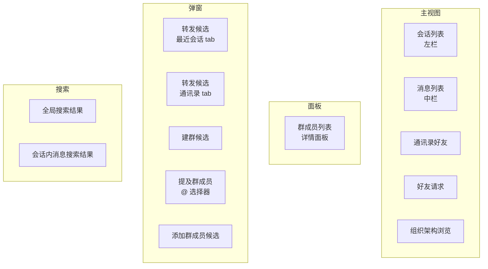
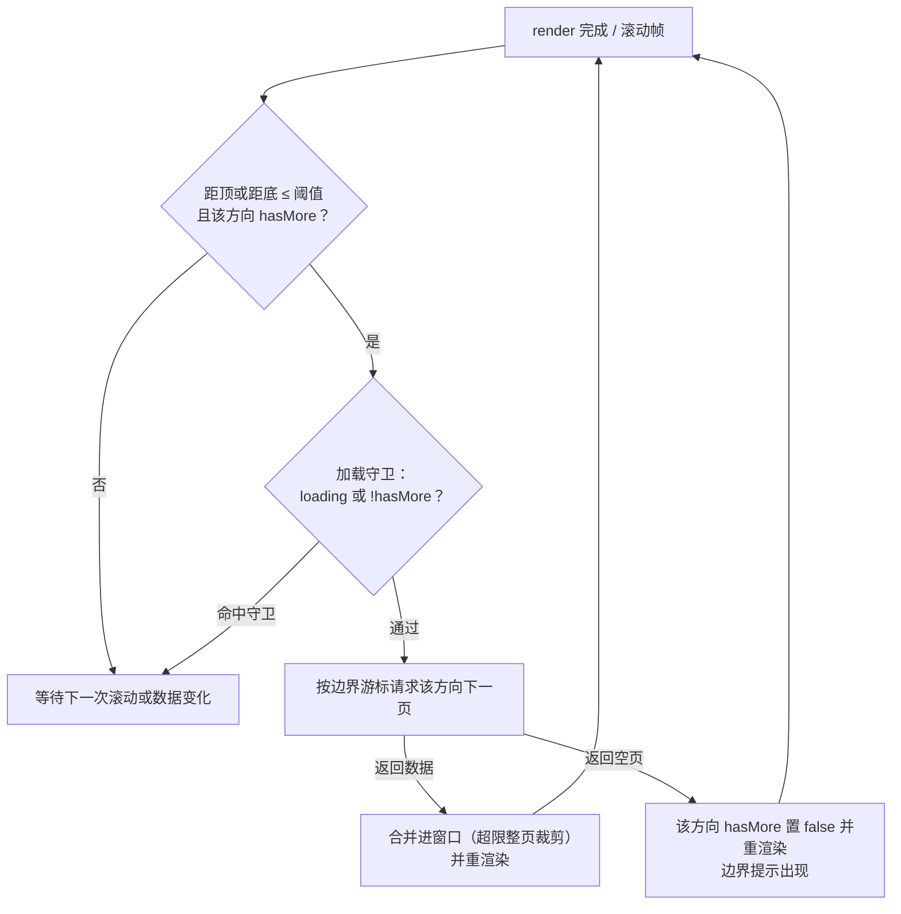
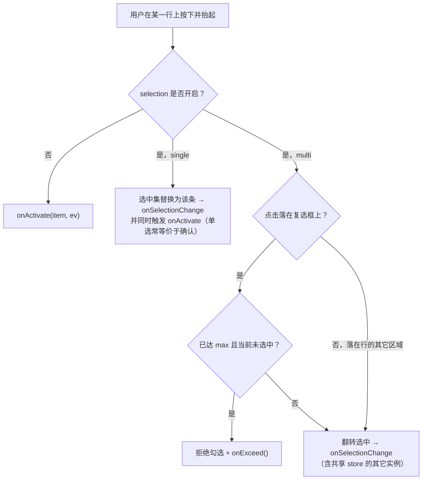
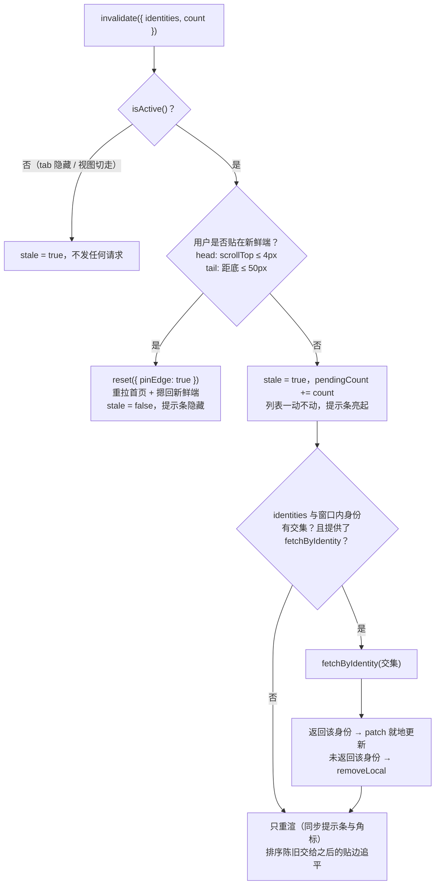
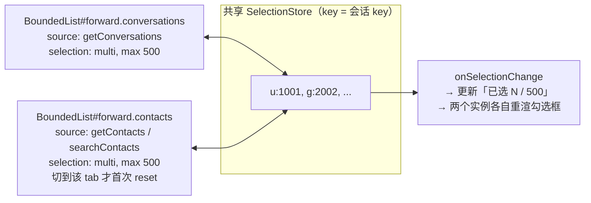

# 有界列表窗口组件设计方案

> 主要对照：`packages/uikit/src/app/bounded-list/`、`packages/uikit/tests/unit/bounded-list/`、`apps/web/tests/component/`、`apps/web/tests/performance/`、`apps/web/tests/support/bounded-list/`，以及仍在生产视图中使用的 `packages/uikit/src/app/bounded-stream-window.ts`、`packages/uikit/src/app/bounded-page-window.ts`、`packages/uikit/src/app/bounded-list.ts`、`packages/uikit/src/app/views/` 与 `packages/uikit/src/app-config.ts`。
> 最后复核：2026-07-29。
> 触发更新：列表渲染引擎、有界窗口分页 / 裁剪 / 边界游标算法、身份键口径、消息分页归一化、锚点策略、提示条行为、组件契约（参数 / 方法 / 事件）或列表分页配置变化时同步更新。
> 入口关系：上级索引见 [`README.md`](../README.md)；本文是 UIKit 有界列表**原理、目标态契约与生产迁移状态**的单一事实源，`UI设计方案.md` §8 保留概述性表格。§1–§6 是规范契约，§3 与 §7 区分“独立组件核心已实现”和“生产调用方尚未迁移”，§8 记录剩余差距与验收状态。`bounded-list/` 已落地接口以 [`BoundedList组件设计.md`](BoundedList组件设计.md) 为准，fake DOM 单元 / 压力测试与 25 条修复记录见 [`BoundedList测试方案.md`](BoundedList测试方案.md)，真实 Chromium 与性能矩阵见 [`测试方案.md` §7](../../../docs/development/测试方案.md#7-boundedlist-playwright-与性能专项)，浏览器复测状态见 [`boundedlist/缺陷列表.md`](boundedlist/缺陷列表.md)。

## 目录

- [1. 组件定位与边界](#1-组件定位与边界)
  - [1.1 IM 里到处都是列表](#11-im-里到处都是列表)
  - [1.2 组件负责什么，不负责什么](#12-组件负责什么不负责什么)
  - [1.3 目标与取舍](#13-目标与取舍)
- [2. 原理](#2-原理)
  - [2.1 成本在 DOM，不在数据](#21-成本在-dom不在数据)
  - [2.2 三层模型](#22-三层模型)
  - [2.3 数据窗口：按页边界游标记账](#23-数据窗口按页边界游标记账)
  - [2.4 渲染窗口：有界全量渲染](#24-渲染窗口有界全量渲染)
  - [2.5 分页与触界](#25-分页与触界)
  - [2.6 锚点：内容双端变化时画面不动](#26-锚点内容双端变化时画面不动)
  - [2.7 新鲜端：每个列表只有一个新数据方向](#27-新鲜端每个列表只有一个新数据方向)
- [3. 现状：核心已实现，生产调用方未迁移](#3-现状核心已实现生产调用方未迁移)
  - [3.1 独立核心与生产旧路径的职责边界](#31-独立核心与生产旧路径的职责边界)
  - [3.2 八处调用方各自手写的胶水](#32-八处调用方各自手写的胶水)
  - [3.3 六处根本没接入的列表](#33-六处根本没接入的列表)
  - [3.4 已确认的缺陷](#34-已确认的缺陷)
- [4. 组件契约 BoundedList](#4-组件契约-boundedlist)
  - [4.1 最小可用示例](#41-最小可用示例)
  - [4.2 构造参数](#42-构造参数)
  - [4.3 命令式接口](#43-命令式接口)
  - [4.4 只读状态](#44-只读状态)
  - [4.5 组件抛出的事件](#45-组件抛出的事件)
  - [4.6 组件自持的 DOM 事件](#46-组件自持的-dom-事件)
  - [4.7 宿主事件路由表](#47-宿主事件路由表)
- [5. 核心行为剧本](#5-核心行为剧本)
  - [5.1 数据变化到提示条亮起](#51-数据变化到提示条亮起)
  - [5.2 命中窗口就定向拉单条](#52-命中窗口就定向拉单条)
  - [5.3 提示条自动消失的三条路径](#53-提示条自动消失的三条路径)
  - [5.4 点击一个条目会发生什么](#54-点击一个条目会发生什么)
  - [5.5 翻页与链式补页](#55-翻页与链式补页)
  - [5.6 本端产生的新条目](#56-本端产生的新条目)
  - [5.7 展示资料异步到达](#57-展示资料异步到达)
- [6. 场景矩阵](#6-场景矩阵)
  - [6.1 全部列表一张表](#61-全部列表一张表)
  - [6.2 转发选择目标](#62-转发选择目标)
  - [6.3 群成员列表](#63-群成员列表)
  - [6.4 提及群成员](#64-提及群成员)
  - [6.5 迁移后消失的重复代码](#65-迁移后消失的重复代码)
- [7. 当前实现逐文件对照](#7-当前实现逐文件对照)
  - [7.1 数据窗口 BoundedPageWindow](#71-数据窗口-boundedpagewindow)
  - [7.2 跨页去重](#72-跨页去重)
  - [7.3 渲染引擎 BoundedStreamWindow](#73-渲染引擎-boundedstreamwindow)
  - [7.4 消息列表](#74-消息列表)
  - [7.5 会话列表与提示条](#75-会话列表与提示条)
  - [7.6 其它列表场景](#76-其它列表场景)
- [8. 差距清单与落地顺序](#8-差距清单与落地顺序)
  - [8.1 差距清单](#81-差距清单)
  - [8.2 分阶段落地](#82-分阶段落地)
  - [8.3 验收测试](#83-验收测试)
- [9. 配置参数说明](#9-配置参数说明)
- [10. CSS 约束](#10-css-约束)
- [11. 扩展阅读](#11-扩展阅读)

---

## 1. 组件定位与边界

### 1.1 IM 里到处都是列表

「列表」不是聊天窗口的一个附属控件，它就是 IM 前端本身。把当前 UIKit 里所有滚动的、可能超过一屏的、需要翻页的东西列出来：



十三处。它们的数据类型不同（`LocalConversation` / `Message` / `Contact` / `GroupMember` / `TagChild`），交互不同（点开 / 多选 / 单选 / 跳转），刷新策略不同（实时重排 / 弹窗生命周期内静止），但**滚动、翻页、裁剪、锚点、空态、边界提示、加载态、身份去重、提示条、选中态**这十件事完全一样。任何一处单独实现这十件事，都会在某个边界组合上出错——事实上现在就出错了（§3.4）。

结论：这必须是**一个组件**，不是两个工具类加十二份胶水。本文其余部分就是这个组件的契约。

### 1.2 组件负责什么，不负责什么

边界划清楚，组件才不会长成第二个 `app-instance`。

| | 组件负责 | 组件不负责 |
|---|---|---|
| 数据 | 分页拉取编排、窗口记账、整页裁剪、跨页去重、就地增删改 | 具体调哪个 SDK 方法（由 `fetchPage` 注入） |
| 渲染 | 清空重建、锚点保持、空态 / 加载态 / 边界提示、提示条 | 单行长什么样（由 `renderItem` 注入） |
| 滚动 | scroll 监听、帧合并、触界检测、贴边判定、指针期间推迟重建 | 容器的 CSS 高度与 `overflow`（由宿主保证，§10） |
| 事件 | 条目激活、选中变更、加载态变更、错误上抛 | 业务动作（打开会话、勾选转发目标…） |
| 生命周期 | 自己挂的所有监听的注销（`dispose`） | 宿主 DOM 的创建与销毁 |
| 通知 | 提供 `invalidate` 入口，按贴边规则决定追平还是提示 | 订阅 SDK 事件、决定哪个事件打给哪个列表（宿主路由，§4.7） |

最后一条是刻意的：组件**不直接订阅 SDK 事件**。「`messages:received` 该唤醒哪几个列表」是应用级知识，放进组件就把组件绑死在聊天语义上，`@` 选择器、组织架构这类列表根本不需要它。宿主把 SDK 事件翻译成一次 `invalidate()` 调用，组件只认这一个入口——这也让组件可以在不启动 SDK 的情况下单测。

### 1.3 目标与取舍

聊天应用的列表天然是长列表（消息数万条、会话和联系人成百上千），不能全量拉取、全量渲染。本项目用**单一模式**收敛复杂度：**有界滑动窗口 + 全量渲染 + 双向翻页**。明确取舍：

1. **滚动条不要求精确**，甚至不需要出现（CSS 已隐藏滚动条）。滚动空间只代表「已加载窗口」，绝不为未加载数据模拟高度。
2. **到顶 / 到底用轻量提示**：未加载数据只由 `hasMoreBefore` / `hasMoreAfter` 表达，滚到边界时显示「加载中」或「已到最早 / 已到最新 / 没有更多」。
3. **背景数据变化不打断浏览**：列表不动，只点亮提示条；只有用户已贴在「新鲜端」（§2.7）时才直接重拉。

这些取舍删掉了上一代实现里只为「滚动条精确」服务的全部复杂度：逐行实测高度（rAF 首测 + ResizeObserver）、测量缓存、估算校正，以及「固定行高窗口切片 + spacer」那一整套渲染路径。剩下的都是确定性计算：渲染只有一种模式，没有 `itemSize` / `spacer` / `overscan` 配置。

整个实现没有引入第三方虚拟列表库，全部用原生 TypeScript 和 DOM API 完成。

---

## 2. 原理

§2 讲与具体代码无关的原理；§4 起是组件契约；§7 是当前代码对照。

### 2.1 成本在 DOM，不在数据

一条数据在内存里只是一个几百字节的对象，数组放几万条毫无压力；但把它**渲染**出来是另一回事：每行至少是「容器 + 头像 + 文本」好几个元素节点，浏览器要为每个节点维护样式、布局和绘制信息。节点数上去之后，首次渲染、每次 reflow 乃至滚动合成都会变慢。

而屏幕高度是固定的：无论数据有多少，用户一次只能看见十几行。

```
全量渲染整个数据集：DOM 节点数 ∝ 数据总量   （必卡）
有界列表窗口：       DOM 节点数 ∝ 窗口上限   （恒定几十~一两百个节点，与数据量无关）
```

出发点就这一句：**渲染成本应该正比于「窗口里有多少」，而不是「一共有多少」。**

### 2.2 三层模型


- **数据源 `PageSource`** 抽象「怎么取一页」。两种实现：
  - `serverPageSource`：透传服务端不透明 keyset 游标（会话、消息、联系人、群成员、搜索结果……绝大多数场景）；
  - `localPageSource`：对一个已经全量加载到内存的数组做本地切片，游标就是下标。用于**刻意选择在客户端做过滤 / 排序**的场景（提及群成员按拼音排序 + 子串过滤，§6.4——这是为了不在群成员表冗余昵称而做的取舍，不是服务端能力缺失）。本地游标不会外传给服务端，不违反「游标对客户端不透明」。
- **数据窗口**解决「数据太多」：内存里只保留完整数据集中用户附近的若干页，靠分页拉取扩展、超限时整页裁剪收缩（§2.3）；
- **渲染窗口**解决「DOM 太多」：因为数据窗口本身有上限，渲染窗口干脆等于数据窗口，**全部渲染**（§2.4）。

关键在于：把 `localPageSource` 也纳进同一个数据窗口，本地全量数据同样只有一个有界切片进 DOM。**「一次性拉全量」和「一次性渲染全量」是两件独立的事**：前者在低频小集合上是合理的工程取舍（换取服务端零冗余、零同步负担），后者在任何规模下都不可以接受。区分这两件事，是 `localPageSource` 存在的全部理由。

### 2.3 数据窗口：按页边界游标记账

服务端展示通道是 **keyset 游标分页**：只能从已知边界顺序翻页，游标对客户端**不透明**（禁止客户端解析或构造，见[《同步机制方案》](../../../docs/architecture/同步机制方案.md)）。要做「裁掉一端、用户滚回去时再拉回来」的有界滑动窗口，关键是裁剪后还能找到那一端的续翻锚点。

做法是**按页记账**：窗口是若干「已加载页」的有序拼接，每页保存服务端随该页返回的 `start_cursor` 与 `end_cursor`。

```
完整集合（展示序）
----------------------------------------------------------------->

       page0            page1            page2
   [s0 .. e0]       [s1 .. e1]       [s2 .. e2]
       └ 首页 start_cursor=s0          尾页 end_cursor=e2 ┘
  hasMoreBefore?  ← 向前续翻用 s0      向后续翻用 e2 →  hasMoreAfter?
```

- 续翻向后（更靠后 / 更新）：用尾页 `end_cursor`，方向 FORWARD，结果追加到尾部；
- 续翻向前（更靠前 / 更旧）：用首页 `start_cursor`，方向 BACKWARD，结果插入到头部；
- 窗口最多保留 `maxPages` 页，**整页**从相反端裁剪，并把被裁端的 `hasMore` 置 true。

被裁掉的整页连同它的边界游标一起丢弃，但相邻保留页的边界游标仍是有效的续翻锚点——内存窗口只是完整集合上的一个视图，丢弃不等于丢失。整页裁剪让「裁剪后续翻」无需在客户端重建游标，天然契合不透明游标。

### 2.4 渲染窗口：有界全量渲染

经典虚拟列表只渲染视窗附近的行，再用 spacer 撑高滚动条，这要求「不渲染某行也能知道它有多高」——固定行高才算得准，变高行（消息气泡）就得「估算 + 实测 + 校正」，复杂度几乎全来源于此。

既然数据窗口已经有上限，就不必再切片：**窗口里的全部条目都渲染成真实 DOM**。高度不可知的根源是「想替没渲染的行报高度」，全部渲染后这个问题整个消失：没有 spacer、没有行高配置、没有估算误差、滚动零重建，行高永远是浏览器布局的真实值。一两百个节点对任何现代浏览器都是小负载，重建只发生在数据变化时。

### 2.5 分页与触界

放弃为完整数据集模拟总高度（§1.3 取舍 1）：**滚动空间只代表已加载窗口**。滚动条比例会随加载推进而变化，但聊天场景没人盯着滚动条看绝对位置（CSS 干脆隐藏了它），「还有没有更多」用边界提示文字表达足够。

剩下的只是何时翻页：滚动接近边界（距顶 / 距底不足一个阈值）且该方向 `hasMore` 时触发。



这个循环天然覆盖「首屏不足一屏」：render 后立即触界检测，内容不满一屏就继续补页，直到填满视窗或服务端返回空页——循环必然终止。

### 2.6 锚点：内容双端变化时画面不动

向头部插入一页更旧数据后，浏览器保持的是 `scrollTop` 这个**数值**，而不是用户正在看的**内容**：同一 scrollTop 之下内容整体被推下去一页，画面猛跳。

画面「不动」的精确定义是：用户正在看的那条（锚点）相对视口顶的偏移 `delta` 在重渲染前后不变。由此直接得出修正公式：

```
渲染前：delta = 锚点行顶 - 视口顶
渲染后：scrollTop += (锚点行新顶 - 视口顶) - delta
```

这个公式对头部插入、尾部裁剪、双端同时变化一视同仁。前提是渲染后读到的行位置就是最终布局，这正是全量渲染（无估算）才能给出的保证。

### 2.7 新鲜端：每个列表只有一个新数据方向

这是把三个列表各自的「贴顶 / 贴底」规则统一成一条契约的关键抽象。

每个列表都有一个**新鲜端**（`freshEdge`）：新数据总是从这一端进来。

| 列表 | 展示序 | 新鲜端 | 贴边判定 | 贴边时的自动行为 |
|---|---|---|---|---|
| 消息列表 | seq 升序（旧→新） | `tail`（底部） | 距底 ≤ 50px | 重拉最新一页并滚到底 |
| 会话列表 | seq 降序（活跃→沉默） | `head`（顶部） | 距顶 ≤ 4px | 重拉首页并滚回顶 |
| 通讯录 | sort_key 升序 | `head`（顶部） | 距顶 ≤ 4px | 重拉首页并滚回顶 |
| 弹窗内候选列表 | 各自 | `head` | — | 无背景刷新，不适用 |

有了这个抽象，「收到新数据怎么办」只有一条规则，不再需要每个列表各写一遍：

```
在新鲜端  → 直接追平（reset 到新鲜端），用户看到的就是最新
不在新鲜端 → 只点亮提示条，列表一动不动；用户回到新鲜端时自动追平
```

贴边阈值不同（50px vs 4px）是因为消息列表底部有输入框遮挡和图片异步增高，需要更宽的容差；会话 / 通讯录顶部没有这些干扰，必须严格贴顶才算「用户在看最新」，否则轻微滚动就会被误判成贴边而重排列表。

---

## 3. 现状：核心已实现，生产调用方未迁移

仓库当前同时存在两条代码路径，不能把“独立核心已经实现”误写成“生产 UI 已完成组件迁移”：

- `packages/uikit/src/app/bounded-list/` 已实现 §4 契约的独立 BoundedList 核心，并有 Vitest 与真实 Chromium browser harness。
- `packages/uikit/src/app/views/` 的页面、面板和弹窗调用方仍使用旧 `bounded-page-window.ts`、`bounded-stream-window.ts` 与手写编排，尚未创建新 BoundedList 实例。

因此本节和 §8 的生产迁移影响仍然成立；新核心自身曾在真实浏览器中确认的 11 条缺陷已经全部关闭，历史与回归证据维护在 [`boundedlist/缺陷列表.md`](boundedlist/缺陷列表.md)。

### 3.1 独立核心与生产旧路径的职责边界

| 路径 | 文件 | 当前职责 | 状态 |
|---|---|---|---|
| 独立核心 | `bounded-list/bounded-list.ts` | 编排 PageWindow、StreamWindow、查询、轻通知、提示条、选择、生命周期与回调 | 已实现，Chromium 功能 / 性能专项全通过 |
| 独立核心 | `bounded-list/page-window.ts`、`page-source.ts` | 只读边界状态、server / local source、分页、硬预算裁剪、去重和本地变更 | 已实现，source 超页与 live 硬预算均有回归 |
| 独立核心 | `bounded-list/stream-window.ts`、`update-pill.ts` | DOM 渲染、锚点、事件委托、键盘、提示条与 dispose | 已实现，交互 / 生命周期回归通过 |
| 独立核心 | `bounded-list/selection.ts`、`registry.ts` | 共享选中态与组件注册表 | 已实现 |
| 生产旧路径 | `bounded-page-window.ts`、`bounded-stream-window.ts` | 视图当前实际使用的数据窗口与渲染引擎 | 仍在使用 |
| 生产旧路径 | `bounded-list.ts` | 只有 `BoundedListController { id, invalidate() }` 注册广播 | 仍在使用 |

旧 `BoundedListController` 由 `main-app.ts` 手工注册 `conversations` / `open-conversation-messages` / `contacts`，其 `invalidate` 直接指向各视图既有函数。旧数据窗口与渲染引擎之间的分页、请求、竞态、错误和提示条编排仍全部由调用方手写。

### 3.2 八处调用方各自手写的胶水

| # | 场景 | 文件 | 胶水行数（约） | 独立的 loading 变量 | 请求竞态守卫 | 错误处理 |
|---|---|---|---|---|---|---|
| 1 | 会话列表 | `conversation-list.ts` | 120 | `conversationPageLoading` | `conversationPageRequestId` | `console.warn` |
| 2 | 消息列表 | `message-list.ts` + `message-page.ts` | 130 | `loadingMoreMessages` / `loadingNewerMessages`（两个） | `messagePageRequestId` | `console.warn` |
| 3 | 通讯录好友 | `contacts.ts` | 70 | `friendPageLoading` | `friendPageRequestId` | `showToast` |
| 4 | 好友请求 | `contacts.ts` | 60 | `requestPageLoading` | `requestPageRequestId` | `showToast` |
| 5 | 群成员 | `detail-panel.ts` | 55 | `memberLoading` | 借用 `detailRequestId` | **无** |
| 6 | 转发候选（会话） | `forward.ts` | 50 | `loading` | **无** | **无** |
| 7 | 转发候选（通讯录） | `forward.ts` | 60 | `contactsLoading` | `contactRequestId` | `showToast` |
| 8 | 建群候选 | `contacts.ts` | 60 | `loading` | `requestId` | `showToast` |

这不是「有点重复」，是**同一段逻辑写了八遍并且已经写岔了**：

- **空方向的处理不一致**：`loadFriendPage` 在 `!hasMoreAfter` 时会 `renderFriends(); return;`（重渲以刷新边界提示），`loadConversations` 直接 `return`（不重渲）。
- **loading 的粒度不一致**：消息列表分 `loadingMoreMessages` / `loadingNewerMessages` 两端；其余七处共用一个布尔量，于是 `loadingBefore` 和 `loadingAfter` 同时为 true，翻一页时列表**上下两端同时显示「加载中」**。
- **`loaded` 字段形同虚设**：会话列表和通讯录都在 `render` 之前 `if (!xxxPageLoaded) return;`，引擎的「未加载只显示 loadingText」分支根本走不到；只有 `forward.ts` 的通讯录 tab 真的用到了它。
- **`reset` 后要不要归零滚动位置，各写各的**：会话列表在 `loadConversations` 末尾 `scrollTop = 0`；通讯录在 `loadContacts` 里先算 `pinTop` 再决定；消息列表用 `scrollToBottom` 的四帧稳定循环；弹窗列表完全不处理。
- **贴边追平的守卫条件不一致**：会话列表 `stale && !pageLoading`，消息列表 `pending > 0 && !loadingNewer`，通讯录只有 `stale`（loading 守卫藏在 `loadContacts` 内部）。
- **提示条各写一份**：`#conversation-update-pill`、`#contacts-update-pill`、`#new-message-pill` 三处各有一对 `ensureXxxPill` / `syncXxxPill`，共用同一套 CSS class，但创建、挂载、文案、显隐逻辑复制了三遍。
- **贴顶阈值常量复制了两份**：`LIST_TOP_STICKY_PX = 4` 同时出现在 `conversation-list.ts` 和 `contacts.ts`。
- **选中态各写一份**：`forward.ts` 的 `selectedKeys`（多选 + 上限 + 跨 tab 手工互相 `render` 同步）、`contacts.ts` 建群的 `selectedUids`（多选 + 上限 + 禁用未选项）、`group-member-picker.ts` 的单选直接 `finish()`。
- **关键字搜索各写一份**：好友列表和转发通讯录 tab 都实现了「关键字非空 → 改走 `searchContacts` → 300ms 防抖 → reset 窗口」，两份代码几乎逐行相同。

### 3.3 六处根本没接入的列表

这六处是纯手写渲染，没有窗口、没有锚点、没有边界提示、没有分页。注意区分两类：**数据获取方式有意为之**（提及群成员、添加群成员）与**确实缺分页**（其余四处）——但六处的**渲染方式**都需要接入组件：

| 场景 | 文件 | 现状 | 风险 |
|---|---|---|---|
| **提及群成员（@）** | `group-member-picker.ts` | 打开时按 `groupMemberPicker.maxPages`（200 页 × 40 = 8000 人）循环拉全量，批量取展示名，本地拼音排序，`for` 循环把**过滤后的全部条目**逐个 `appendChild` | 拉全量是有意取舍（§6.4），**渲染全量不是**：大群直接产生数千个 DOM 节点；另无键盘导航、无锚点 |
| **添加群成员候选** | `detail-panel.ts` `showAddMemberModal` | 全量拉群成员用于排除 + 全量拉好友，本地子串过滤，全量渲染 | 同上：拉全量是有意取舍，渲染全量不是 |
| 我发出的好友请求 | `contacts.ts` `renderOutgoingRequests` | 一次性拉 `pageSize × 4 = 160` 条，`DocumentFragment` 全量渲染 | 超过 160 条静默截断，用户无从知晓 |
| 全局搜索结果 | `global-search.ts` | 联系人 8 条 + 消息 20 条，一次性渲染，无翻页 | 结果被硬截断，没有「加载更多」 |
| 会话内消息搜索结果 | `message-search.ts` | 一次性 30 条，无翻页 | 同上 |
| 组织架构浏览 | `contacts.ts` `renderOrgPanel` | `getTags({ limit: 200 })` 一次性拉，`innerHTML` 拼接 | 超过 200 个子节点的组织层级会被截断 |

四个 SDK 方法（`searchMessages` / `searchContacts` / `getTags` / `getGroupMembers`）**全部支持 keyset 游标分页**，服务端能力是齐的，缺的只是客户端接入。

提及群成员是其中唯一一个**数据获取方式不需要改**的：它「一次性拉全量 + 客户端排序过滤」是明确的架构决策（不为搜索在群成员表冗余昵称，理由见 §6.4 与 [`UI设计方案.md`](UI设计方案.md) §7.6），本方案完全保留。要接入组件的只是**渲染侧**，靠 §2.2 的 `localPageSource` 完成。

### 3.4 已确认的缺陷

以下问题来自生产旧路径，按严重度排列。独立核心已经为其中多项提供统一能力，但在生产调用方完成迁移前，这些用户可见影响不会自动消失；独立核心自身的 11 个真实浏览器缺陷已经 CLOSED，见 [`boundedlist/缺陷列表.md`](boundedlist/缺陷列表.md)。

**① 渲染引擎没有 `dispose`，弹窗每开一次泄漏两个 window 级监听（内存泄漏）**

`BoundedStreamWindow` 构造函数在 `scrollElement.ownerDocument.defaultView`（即 `window`）上挂了 `pointerup` / `pointercancel` 兜底监听，**从不移除**，类也没有 `dispose()`。挂在 `scrollElement` 上的监听随元素回收没问题，window 上这两个不会。

`release` 闭包持有 `this`，`this.lastState` 又持有整份渲染状态（items 数组 + 每行的 `renderItem` 闭包 + 闭包捕获的 `app`），于是**整个列表实例连同数据被永久保留**。受影响的是全部弹窗 / 面板级实例：

- 每次打开转发弹窗：1~2 个实例（会话 tab + 通讯录 tab）；
- 每次打开建群弹窗：1 个实例；
- 每次 `showGroupDetail`：1 个实例——而改备注、收藏 / 取消收藏、换群头像、移除成员**每次都会重新调用 `showGroupDetail`**，一次群管理操作就是一次泄漏。

这直接违反项目不变量「长期内存状态必须有上限、淘汰策略或释放路径」。

**② 「回到最新」提示条的文案分支是死代码，文档描述与代码不符**

`syncNewMessagePill`：

```typescript
pill.textContent = count > 0 ? t('chat.newMessagesCount', { n: count }) : t('chat.jumpToLatest');
pill.classList.toggle('hidden', !app.chatState.messagePageHasNewer || count <= 0);
```

显隐条件要求 `count > 0`，所以 `count <= 0` 时的 `chat.jumpToLatest`（「↓ 有新消息」）**永远不会被用户看见**。本文上一版称「上翻加载历史导致尾部被整页裁剪时提示条同样亮起，充当『回到最新』入口」——这在代码里不成立：上翻裁尾只会让 `hasNewer=true`，`pendingNewMessageCount` 仍是 0，提示条保持隐藏。用户上翻很久之后没有任何「回到最新」的快捷入口，只能一直往下滚。

**③ `pendingNewMessageCount` 在触底空页路径上不归零，计数会串**

触底续翻拿到空页时，`hasMoreAfter` 被置 false → 提示条隐藏，但 `pendingNewMessageCount` 没有清零（清零只发生在 `reloadLatestMessagePage` 和 `resetMessagePage`）。而这条路径上 `maybeCatchUpNewMessages` 被 `!loadingNewerMessages` 守卫挡住、加载完又不一定有新的 scroll 事件来重触发，于是残留计数会带到下一次提示条亮起，显示成偏大的「有 N 条新消息」。

**④ 部分调用方没有错误处理，翻页失败会产生未处理的 Promise 拒绝**

`forward.ts` 的 `maybeLoadMore` 和 `detail-panel.ts` 的 `loadMoreMembers` 都只有 `try/finally` 没有 `catch`。它们由引擎的 `loadAfter?.()` 以 `void maybeLoadMore(...)` 形式调用，请求失败时异常无人接管，用户也看不到任何提示，列表静默停在原地。

**⑤ 身份键有两套口径**

数据层去重用 `identityOf`，渲染层锚点用 `keyOf`，两者必须一致才安全，但现在靠约定维系：

- 会话列表：`identityOf = conversationIdentity`（`friendUid:groupId`），`keyOf = describeConversation(conv).key`（`u:<uid>` / `g:<gid>`）——一一对应但不是同一个函数；
- 通讯录：`contacts.ts` 专门写了 `const contactKey = contactIdentity;` 把两者强行对齐，并加注释说明「保证两者口径一致」——这种「靠注释保证」正是应该由组件在类型上保证的东西。

**⑥ 数据窗口的 `hasMoreBefore` / `hasMoreAfter` 是公开可写字段**

`message-page.ts` 直接写 `messageWindow.hasMoreAfter = true`（`markMessagesHasNewer`）和 `= false`（`appendLiveMessageToPage`）。窗口的边界状态本应只由分页结果驱动，外部直写让「窗口状态是否可信」失去了单一来源。

**⑦ 文档与代码的其它出入（本次已修正）**

| 位置 | 上一版文档 | 代码事实 |
|---|---|---|
| 请求 tab 的 `contentElement` | `#requests-tab` | `#requests-incoming` |
| 两个核心文件行数 | 约 130 行 / 约 170 行 | 176 行 / 244 行 |
| `conversations:sent` | 「`keys` 非空」 | handler 完全不读 `keys`，只调 `renderConversationList({ toTop: true })` |
| 数据窗口方法表 | 缺 `updateMatching` / `removeMatching` | 两者是定向刷新的基础，正文引用了却没进表 |
| 「推广到所有列表」 | 无保留地声称 | 实际有六处列表没接入（§3.3） |

---

## 4. 组件契约 BoundedList

规范契约与当前独立核心都是泛型组件 `BoundedList<T, Q>`：`T` 是条目类型，`Q` 是查询条件类型（关键字、状态过滤等，无查询条件时为 `void`）。实际目录：

```
packages/uikit/src/app/bounded-list/
  index.ts          对外只导出 createBoundedList 与类型
  bounded-list.ts   组件外壳：编排、生命周期、事件
  page-window.ts    数据窗口（今 bounded-page-window.ts 平移）
  stream-window.ts  渲染引擎（今 bounded-stream-window.ts 平移 + dispose）
  page-source.ts    serverPageSource / localPageSource
  update-pill.ts    提示条
  selection.ts      选中态
  registry.ts       BoundedListController 注册表（今 bounded-list.ts）
```

### 4.1 最小可用示例

以通讯录好友列表为例，组件化之后调用方只剩「取数据」和「画一行」两件事：

```typescript
const friends = createBoundedList<Contact, { keyword: string }>({
  id: 'contacts.friends',
  scrollElement: contactsScroller(),
  contentElement: app.$('friends-tab'),
  pillHost: contactsScroller().parentElement,

  pageSize: APP_CONFIG.list.pageSize,
  maxPages: APP_CONFIG.list.maxPages,
  source: serverPageSource(({ cursor, backward, limit, query }) =>
    query.keyword
      ? app.client.searchContacts({ keyword: query.keyword, status: CONTACT_FRIEND, cursor, backward, limit })
      : app.client.getContacts({ status: CONTACT_FRIEND, cursor, backward, limit }),
    (page) => ({ items: page.contacts, ...page.page }),
  ),
  fetchByIdentity: (ids) =>
    app.client.getContacts({ friendUids: ids }).then((p) => p.contacts),

  identityOf: contactIdentity,
  freshEdge: 'head',

  renderItem: (contact) => [renderContactRow(app, contact)],
  text: {
    empty: () => app.t('contacts.noFriends'),
    emptyFiltered: () => app.t('contacts.noSearchResults'),
    loading: () => app.t('common.loading'),
    tailBoundary: () => app.t('contacts.noMoreContacts'),
    updatePill: () => app.t('contacts.listUpdated'),
  },

  onActivate: (contact) => void showContactDetail(contact),
});

app.registerDisposer(() => friends.dispose());
void friends.reset();
```

对比现状：`contacts.ts` 里对应的 `loadFriendPage` + `renderFriends` + `applyFriendKeywordChange` + `maybeCatchUpStale` + `ensureContactsUpdatePill` + `syncContactsUpdatePill` 共约 170 行，其中只有 `renderContactRow` 那一段（约 40 行）是真正的业务。

### 4.2 构造参数

所有参数一次性在构造时给全，组件构造后不再变更配置（要变就重建）。文案类参数一律传函数而非字符串，因为语言可以在运行时切换。

#### 身份与宿主

| 参数 | 类型 | 必填 | 作用 |
|---|---|---|---|
| `id` | `string` | 是 | 列表唯一标识。用于向 `BoundedListController` 注册表登记（`invalidateBoundedLists` 广播的目标）、日志与调试。同 id 重复注册互相覆盖。 |
| `scrollElement` | `HTMLElement` | 是 | 原生滚动容器。组件在它上面挂 `scroll` / `pointerdown` / `pointerup` / `pointercancel`，并读它的 `scrollTop` / `scrollHeight` / `clientHeight` 做触界与贴边判定。**必须有确定高度和 `overflow-y: auto`**（§10）。 |
| `contentElement` | `HTMLElement` | 否 | 内容容器，默认等于 `scrollElement`。两个 tab 共用一个滚动容器时（通讯录的好友 / 请求），两个列表实例各自指向自己的内容节点，滚动容器相同、内容互不干扰。 |
| `pillHost` | `HTMLElement \| false` | 否 | 提示条挂载点，默认取 `scrollElement.parentElement`。传 `false` 表示这个列表不要提示条（弹窗内候选列表没有背景刷新，不需要）。 |
| `isActive` | `() => boolean` | 否 | 宿主可见性判定，默认恒 true。返回 false 时 `invalidate()` 只记 stale 不发请求——tab 隐藏、视图切走时不该为看不见的列表消耗请求。现状里这个判断散落成 `isFriendsTabActive()` / `!app.$('view-contacts').classList.contains('hidden')` 等各种写法。 |

#### 数据源

| 参数 | 类型 | 必填 | 作用 |
|---|---|---|---|
| `pageSize` | `number` | 是 | 每次拉取条数，透传给 `source`；必须是正安全整数。source 经 normalize 后返回超过该值时整页拒绝并进入错误态。 |
| `maxPages` | `number` | 是 | 正常翻页最多保留页数；必须是正安全整数。`pageSize × maxPages` 是 server、local 与 live 路径共同执行的内存 / DOM 硬上限。 |
| `source` | `PageSource<T, Q>` | 是 | 「怎么取一页」。见下。 |
| `fetchByIdentity` | `(ids: readonly string[]) => Promise<readonly T[]>` | 否 | **定向拉单条**。`invalidate({ identities })` 命中窗口内条目时用它按身份精确拉当前状态；返回结果里没有的身份视为已删除。不提供则 `invalidate` 退化为「只点亮提示条」。这是「更新的信息在窗口里就去拉那一条」这条需求的落点（§5.2）。 |
| `normalize` | `(items: readonly T[]) => T[]` | 否 | 每页入窗前的归一化，默认恒等。消息列表用它做「同 messageId 保留最新、删除态剔除、按 seq 升序」。 |

`PageSource` 的两种实现：

```typescript
type FetchPageRequest<Q> = {
  cursor?: string;        // 不透明游标；reset 时为 undefined
  backward: boolean;      // true = 向更靠前 / 更旧的方向
  limit: number;
  query: Q;               // 当前查询条件（关键字、状态过滤等）
};

// ① 服务端分页：游标原样透传，不解析、不构造
serverPageSource<R, T, Q>(
  fetch: (req: FetchPageRequest<Q>) => Promise<R>,
  map: (raw: R) => PageLoadResult<T>,
): PageSource<T, Q>

// ② 本地分页：对已全量加载的数组做切片，游标 = 下标
localPageSource<T, Q>(options: {
  loadAll: (query: Q, onProgress?: (loaded: number) => void) => Promise<T[]>;
  filter?: (item: T, query: Q) => boolean;
  compare?: (a: T, b: T) => number;
}): PageSource<T, Q>
```

`localPageSource` 让「必须本地过滤 / 排序」的场景也走同一个有界窗口：全量数据留在组件私有数组里（有上限、可释放），窗口里始终只有 `pageSize × maxPages` 条，DOM 里也只有这么多。`query` 变化时重跑 `filter` / `compare` 再从头切片。

source 契约是“请求多少，单页最多返回多少”：`PageLoadResult.items` 经 normalize 后不得超过 `pageSize`。恶意或错误 source 超量时组件抛 `RangeError`，reset 进入 `failed=true` 且不接纳部分页面；不做静默截断，避免游标与实际接纳条目错位。`localPageSource` 的并发 reload 还使用 generation：只有最新查询能发布共享续翻缓存和进度。

#### 身份键

| 参数 | 类型 | 必填 | 作用 |
|---|---|---|---|
| `identityOf` | `(item: T) => string` | 是 | **一个身份键，三处使用**：跨页去重（§7.2）、渲染锚点（`data-bsw-key`）、`invalidate({ identities })` 的匹配。合并成一个参数就从类型上消灭了 §3.4 ⑤ 的双口径问题。 |

身份键必须与**展示序键彻底解耦**：只由路由分片身份决定，绝不随实时重排或改名而变化。

| 数据类型 | 身份键 | 展示序键（会变） |
|---|---|---|
| `LocalConversation` | `friendUid:groupId` | `seq`（收到新消息就变） |
| `Contact` | `uid:groupId:orgId` | `sort_key`（改名就变） |
| `GroupMember` | `userId` | role 倒序 + uid 升序（角色变更就变） |
| `Message` | `messageId` | `seq`（**不可变**，因此消息的去重只是防御性兜底） |

#### 新鲜端与滚动

| 参数 | 类型 | 默认 | 作用 |
|---|---|---|---|
| `freshEdge` | `'head' \| 'tail'` | `'head'` | 新数据从哪一端进来（§2.7）。决定 `reset` 后把滚动摁到哪一端、贴边判定看哪一端、`invalidate` 时是否直接追平。 |
| `stickyPx` | `number` | head: 4，tail: 50 | 贴边判定阈值。取代现在散落的 `LIST_TOP_STICKY_PX` / `NEAR_BOTTOM_THRESHOLD_PX` 两个复制常量。 |
| `reachPx` | `number` | 160 | 触界加载阈值：距边界这么近就请求该方向下一页。 |
| `settleFrames` | `number` | head: 1，tail: 4 | `reset` 后把滚动摁到新鲜端时连续重设的帧数。`tail` 需要多帧是因为图片等富内容首帧还是占位尺寸（§7.4）。 |

#### 渲染与文案

| 参数 | 类型 | 必填 | 作用 |
|---|---|---|---|
| `renderItem` | `(item: T, ctx: RenderItemContext<T>) => readonly HTMLElement[]` | 是 | 画一行。首元素写 `data-bsw-key` 作为滚动锚点；所有平级根元素都写交互键，因此点击任一部分都映射到同一 identity。 |
| `pinnedItems` | `() => readonly T[]` | 否 | 钉在窗口条目**头部**、不进数据窗口的纯展示条目。用于会话列表的「空会话占位」（刚从通讯录点开、还没有任何消息的会话）。 |
| `text` | `BoundedListText` | 是 | 全部文案，惰性求值。 |

`RenderItemContext` 提供渲染这一行时需要的上下文，避免调用方从外部闭包里捞：

```typescript
interface RenderItemContext<T> {
  index: number;
  identity: string;
  selected: boolean;         // 选中态（selection 开启时）
  selectable: boolean;       // 未选中且已达 max 时为 false，用于禁用复选框
  previous: T | undefined;   // 上一条，用于「同一发送者不重复显示名字」这类逻辑
}
```

`BoundedListText` 全部可选，不提供就不渲染对应元素：

| 字段 | 出现位置 | 现状对应 |
|---|---|---|
| `loading` | 加载中的那一端 | `common.loading` |
| `empty` | 列表为空 | `chat.noConversations` / `contacts.noFriends` / `detail.noMembers` |
| `emptyFiltered` | 有查询条件但无结果 | `contacts.noSearchResults` |
| `headBoundary` | `!hasMoreBefore` 时固定显示在头部 | `chat.reachedEarliest` |
| `tailBoundary` | `!hasMoreAfter` 时固定显示在尾部 | `chat.reachedLatest` / `chat.noMoreConversations` / `contacts.noMoreContacts` |
| `updatePill` | 提示条文案，可接收 `count` | `chat.listUpdated` / `contacts.listUpdated` / `chat.newMessagesCount` |

#### 选中态

| 参数 | 类型 | 作用 |
|---|---|---|
| `selection` | `{ mode: 'single' \| 'multi'; max?: number; store?: SelectionStore; onExceed?: () => void }` | 不传则不可选。`max` 只用于组件内部新建 store；传外部 `store` 时上限由该 store 构造参数决定，`store+max` 同时出现会构造失败。共享 store 的多个实例自动同步；`onExceed` 在 store 拒绝新增时回调。 |

### 4.3 命令式接口

| 方法 | 签名 | 语义 | 并发与幂等 |
|---|---|---|---|
| `reset` | `(opts?: { query?: Q; pinEdge?: boolean }) => Promise<void>` | 清空窗口，无游标拉首页重建。`pinEdge` 默认 true：渲染后把滚动摁到 `freshEdge`（覆盖锚点恢复）。传 `query` 同时更新查询条件。 | 递增内部 requestId，旧请求返回后整体丢弃；在飞期间的本地最终态会在候选首页重放；overlay 溢出时拒绝旧响应、保留当前有界本地窗口并 `failed + stale`，不自动循环 |
| `loadMore` | `(dir: 'forward' \| 'backward') => Promise<void>` | 按该方向可信边界游标续翻一页，超限整页裁剪；容量游标失效时是显式追平入口。 | 在飞期间的本地最终态会在返回页并入后重放，live eviction 会作废基于旧边界的普通分页；overlay 溢出时丢弃页、封锁两端游标并进入 stale，但不置 `failed`；一次显式重试即可建立新快照，撞上已溢出的在途 reconcile 时立即以新 requestId 作废旧请求并新发无游标请求 |
| `setQuery` | `(query: Q, opts?: { debounceMs?: number }) => void` | 更新查询条件并 `reset`。`debounceMs` 由组件统一防抖（默认 300ms），取代调用方各写一个 `setTimeout` |
| `invalidate` | `(opts?: { identities?: readonly string[]; count?: number }) => void` | **轻通知唯一入口**。按 §5.1 的决策树决定「直接追平」还是「点亮提示条 + 定向拉单条」。`count` 用于「有 N 条新消息」的累加。 | 内部合并到下一帧执行，同一帧内多次 `invalidate` 只跑一次 |
| `upsertLocal` | `(item: T) => void` | 本端新条目先跨页去重，再并入新鲜端并按 `pageSize×maxPages` 从非新鲜端同步裁剪。eviction 后立即封锁被裁端旧游标；贴边用户后台 staged reconcile，离边用户先看到 stale。 | 当前有界 DOM 立即可见；任一数据请求在飞期间的新变更都会记录并重放，权威请求已在飞时不额外安排第二次追平 |
| `patch` | `(id: string, update: (item: T) => T) => boolean` | 就地更新窗口内该身份的条目，页结构与边界游标不变。返回是否命中。 | 使该 identity 的在飞定向刷新失效；任一数据请求期间记录 replace overlay |
| `removeLocal` | `(id: string) => boolean` | 就地删除窗口内该身份的条目，剩余条目自然往上补齐（防抖动）。返回是否命中。 | 使该 identity 的在飞定向刷新失效；任一数据请求期间记录 remove overlay |
| `render` | `() => void` | 用当前状态重渲。业务状态（如选中模式开关、高亮 id）变化后调用。 | 指针按下期间只记账不动 DOM，抬起后下一帧应用（§7.3） |
| `scrollToIdentity` | `(id: string, opts?: { block?: 'center' \| 'nearest' }) => boolean` | 把某个身份的行滚进视口。返回该身份是否在窗口内。用于搜索跳转定位（现状是 `message-search.ts` 自己 `querySelector` + `scrollIntoView`）。 | 同步 |
| `dispose` | `() => void` | 注销**全部**监听（含 window 级 pointer 兜底）、清空窗口与 `lastState`、从注册表注销、取消未完成请求的 apply。 | 幂等；调用后其它方法均为空操作 |

`dispose` 是当前完全缺失的能力，也是 §3.4 ① 泄漏的唯一正解。约定：**弹窗 / 面板级列表必须在关闭路径上 `dispose()`，页面级列表在 `app.registerDisposer` 里 `dispose()`。**

### 4.4 只读状态

```typescript
interface BoundedListState {
  loaded: boolean;          // 首屏是否已落定
  loading: boolean;         // 任一方向或 staged reconcile 正在加载
  loadingBefore: boolean;   // 头部方向正在加载（独立，不再和尾部共用一个布尔量）
  loadingAfter: boolean;    // 尾部方向正在加载
  hasMoreBefore: boolean;
  hasMoreAfter: boolean;
  count: number;            // 窗口内条目数（不含 pinnedItems）
  total: number;            // 服务端 page.total；小于 0 表示未知
  stale: boolean;           // 有待追平的背景更新（提示条是否亮）
  pendingCount: number;     // 待追平的条数，用于「有 N 条新消息」
  atFreshEdge: boolean;     // 当前是否贴在新鲜端
  failed: boolean;          // 最近一次首页 reset / 容量 reconcile 是否失败
}
```

- `total` 直接透传服务端 `PageInfo.total`，供「群成员 (238)」这类标题使用——现状是 `detail-panel.ts` 自己维护一个 `memberTotal` 变量并在每次翻页后手工同步。
- `hasMoreBefore` / `hasMoreAfter` 在组件里是**只读**的。正常值来自分页结果；live eviction 使被裁端游标失效时，该端立即对外屏蔽为 `false`，阻止自动触界使用旧 cursor。

### 4.5 组件抛出的事件

事件以构造参数里的回调形式提供（与仓库既有风格一致，且天然只有一个订阅者，不需要 on/off 生命周期管理）。

| 事件 | 签名 | 触发时机 | 组件的默认动作 | 典型用法 |
|---|---|---|---|---|
| `onActivate` | `(item, ev: Event) => void` | 用户点击某一行（`selection` 未开启时），或键盘 Enter / Space 落在某一行 | 无（纯通知） | 打开会话、打开联系人详情、跳转到搜索命中的消息 |
| `onSelectionChange` | `(snapshot: SelectionSnapshot<T>) => void` | 勾选 / 取消勾选，或共享 `store` 被另一个列表实例改动 | 重渲自己以同步勾选框 | 更新「已选 3 / 500」计数、启用确认按钮 |
| `onLoadStateChange` | `(state: BoundedListState) => void` | `loaded` / `loading*` / `hasMore*` / `count` / `total` 任一变化 | 重渲边界提示与加载提示 | 刷新「群成员 (238)」标题、禁用 / 启用外部按钮 |
| `onStaleChange` | `(stale: boolean, pendingCount: number) => void` | `stale` 翻转（背景更新到来 / 追平完成） | 同步提示条显隐与文案 | 需要在提示条之外另加视觉反馈时使用；一般不用 |
| `onItemsChanged` | `(items: readonly T[]) => void` | 窗口内容变化（翻页、裁剪、patch、remove、upsert） | 重渲 | 消息列表据此同步 `chatState.currentMessages` 投影、修剪已选中但已滚出窗口的 id |
| `onError` | `(error: unknown, phase: 'reset' \| 'forward' \| 'backward' \| 'refresh') => void` | 任一次拉取失败 | 恢复 loading 标志并重渲（保证不会定格在「加载中」） | `showToast`；不提供时组件 `console.warn`，**绝不产生未处理的 Promise 拒绝**（修掉 §3.4 ④） |
| `onEmptyPage` | `(dir: 'forward' \| 'backward') => void` | 某方向返回空页，该端 `hasMore` 收敛为 false | 重渲以显示边界提示；若该端是新鲜端，清 `stale` 与 `pendingCount` | 极少使用；`around` 锚点加载后的两端收敛可据此打点 |

关于「点击某个项会触发哪个事件」——这是最容易含糊的一点，明确如下：



补充两条组件必须自己兜住的细节：

- **指针按下期间不重建 DOM**。整列表 `innerHTML = ''` 重建会销毁鼠标按下的那一行节点，`mouseup` 落到新节点上，浏览器因「按下与抬起不在同一节点」而**不再派发 `click`**——点击被吃掉。组件在指针按下到抬起之间只更新状态、不动 DOM，抬起后下一帧再重建（§7.3）。
- **右键 / 长按不是 `onActivate`**。消息列表的操作菜单由 `renderItem` 自己在返回的元素上挂 `contextmenu` / `touchstart` 长按，组件不拦截，也不代劳。

### 4.6 组件自持的 DOM 事件

调用方不需要、也不应该再自己挂这些监听：

| 事件 | 挂在哪 | 组件做什么 |
|---|---|---|
| `scroll` | `scrollElement` | 经 `requestAnimationFrame` 帧合并 → 更新 `atFreshEdge` → 贴边追平判定（§5.3）→ 触界检测（§5.5） |
| `pointerdown` | `scrollElement` | 标记指针按下，之后的 `render` 只记账不动 DOM |
| `pointerup` / `pointercancel` | `scrollElement` **和** `window` | 清标记；有积压则安排到下一帧重建。挂 `window` 是因为指针可能在列表外抬起——**这两个监听必须在 `dispose` 里移除**（§3.4 ①） |
| `click` | `contentElement`（事件委托） | 按每个平级根元素的交互键定位条目 → 分发 `onActivate` / `onSelectionChange`；滚动锚点仍只认首根的 `data-bsw-key` |
| `keydown` | `scrollElement` | `↑` / `↓` 移动焦点行（到达窗口边缘时触发对应方向翻页），`Enter` / `Space` 激活，`Esc` 交给宿主。提及群成员场景必需 |
| `load`（捕获） | `contentElement` | 图片等异步增高内容加载完成时，若 `freshEdge='tail'` 且当前贴边，把滚动摁回底部（现状写在 `setup.ts` 里） |

### 4.7 宿主事件路由表

组件不订阅 SDK 事件，宿主（`main-app.ts`）负责翻译。目标态的完整路由：

| SDK 事件 | payload | 路由到哪些列表 | 调用 |
|---|---|---|---|
| `messages:received` | `{ messages, conversationKeys }` | 会话列表 | `invalidate({ identities: conversationKeys, count: messages.length })` |
| | | 当前会话消息列表 | `invalidate({ count: 1 })`（不消费 payload，追平时重读服务端） |
| `conversations:sent` | `{ keys }` | 会话列表 | `reset({ pinEdge: true })`——本端主动行为，无条件把该会话顶到最上面，不点亮提示条 |
| `conversations:clearunread` | `{ keys }` | 会话列表 | `invalidate({ identities: keys })`——只更未读角标，不重排 |
| `conversations:delete` | `{ keys }` | 会话列表 | 同上；定向拉取后该会话不存在即 `removeLocal` |
| `messages:deleted` | `{ messageId, key }` | 消息列表 | `removeLocal(messageId)` |
| | | 会话列表 | `invalidate({ identities: [key] })`（刷新预览） |
| `contacts:updated` | `{ reason }` | 好友列表、请求列表 | `invalidate()`（无 identities，只能整体追平或点亮提示条） |
| `session:sync` (success, messages/conversations) | — | 会话列表 | `invalidate()` |
| `session:sync` (success, contacts) | — | 好友列表、请求列表 | `invalidate()` |
| `display:updated` | `{ keys, scope }` | 全部可见列表 | `render()`——展示名 / 头像到达，只重渲不重拉（§5.7） |
| `org:updated` | `{ orgIds }` | 组织架构列表 | `invalidate()` |
| `connection:connected`（此前断过线） | — | 全部已注册列表 | 注册表广播 `invalidate()`，等价于每个列表各收到一次「有新数据」通知 |

`connection:connected` 那一行就是生产旧路径 `BoundedListController` / `invalidateBoundedLists()` 的能力。独立核心已经在构造时自动注册、`dispose` 时自动注销；生产视图迁移后才可删除 `main-app.ts` 手写的三段 `registerBoundedList`。

---

## 5. 核心行为剧本

### 5.1 数据变化到提示条亮起

`invalidate()` 是唯一入口，决策树如下。这条路径同时覆盖「收到新消息」「收到新联系人」「他端清未读」「他端删会话」——它们的差别只在有没有 `identities`。



为什么不在「不贴边」时也重排？因为重排会把用户正在看的那一行挪走，这正是「打断浏览」。所以列表位置纹丝不动，只有**已经在窗口里、用户可能正看着的那几条**被就地刷新（未读角标、最新预览、备注名），排序留到用户自己回到新鲜端时统一追平。这就是「轻通知 + 主动拉取」同步模型在 UI 层的具体形态。

### 5.2 命中窗口就定向拉单条

这是 §5.1 里 `fetchByIdentity` 那一支的展开，也是「如果更新的信息在窗口里，就触发注册的接口去拉那一条数据」这条需求的完整定义。

```
收到通知，带 identities = [A, B, C]
  ↓
与窗口内身份求交集
  ├ A 在窗口第 2 页 ✓
  ├ B 不在窗口（已被裁掉，用户看不见）✗ —— 不为它发请求
  └ C 在窗口第 4 页 ✓
  ↓
fetchByIdentity([A, C])  ← 一次批量请求，不是每条一次
  ↓
返回 { A: 新状态 }（C 不在返回里）
  ├ A → patch：就地替换第 2 页里的那一条
  └ C → removeLocal：从第 4 页剔除（服务端已删除）
  ↓
重渲：页结构与边界游标完全不变，续翻锚点不受影响
      剩余条目在 flatten 后自然往上补齐，不抖动
      窗口变短后触界检测按真实长度链式补页
```

三条设计要点：

1. **只拉看得见的**。不在窗口里的条目用户根本看不到，为它发请求纯属浪费；它的最新状态会在用户滚到那里、或整体追平时自然带回来。
2. **一次批量**。`fetchByIdentity` 收的是数组不是单个 id，映射到 `getConversations({ targets })` / `getContacts({ friendUids })` 这类批量接口。
3. **「拉不回来」等于「已删除」**。这让删除通知不需要单独的处理路径：`conversations:delete` 和 `conversations:clearunread` 走完全相同的代码，差别只在服务端返不返回那一条。
4. **按 identity generation/token 判陈旧**。窗口级 `requestId` 隔离 reset / reconcile / live eviction 世代；同 identity 的后发刷新或本地 `patch` / `removeLocal` / `upsertLocal` 再让旧响应失效。不同 identity 使用独立 token，因此并发请求可以分别落地，不被全局刷新序号误淘汰。refresh 先于旧普通分页落地时，接受的 found / absent 最终态写入 overlay，保证晚到旧页不回退新值、不复活删除项；backward / forward 双向并发时，overlay 在首个方向落地后继续保留，全部落定后再清理。没有旧分页在飞时则淘汰同 identity 旧 overlay。token 只为实际命中的在飞 identity 存活，并在成功、同步/异步失败、本地写入或窗口世代作废后立即释放。
5. **数据请求期间延后决策**。reset / loadMore / reconcile 在飞时收到的 identities 保持 pending，不在尚未落定的窗口上发定向刷新；数据请求落定后再对最新窗口求交集并执行，消除“先落地后被覆盖”和“旧结果晚到污染新窗口”两种竞态。

命中条目都不在窗口时仍然要重渲一次（同步提示条与未读角标），只是不发定向请求。

### 5.3 提示条自动消失的三条路径

提示条**不需要点**也会消失。这是明确的设计目标：点击只是三条路径中最不常用的一条的手动触发器。

| # | 路径 | 触发条件 | 效果 |
|---|---|---|---|
| ① | **用户自己滚回新鲜端** | 每个滚动帧检查：`stale && !loading && atFreshEdge` | 普通 stale 自动 `reset`；容量游标失效时改走 staged reconcile |
| ② | **翻页翻到了新鲜端的尽头** | 触界续翻拿到空页 → 该端 `hasMore = false` | 新鲜端之后已无未加载数据，`stale` 与 `pendingCount` 一并清零，提示条隐藏 |
| ③ | **调用方主动 reset** | 切换会话、切 tab、本端发送消息、点击提示条 | 提示条隐藏 |

路径 ① 就是现有的 `catchUpAtEdge` 契约，它把三处「stale && atEdge」的手写判断收敛成一个函数——当初正是因为消息列表漏挂了 `onScroll` 才导致「手动滑到底提示条不消失」。组件化后连这个函数都不必对外暴露：贴边追平是组件在滚动帧里自带的行为。

路径 ② 在当前代码里对消息列表**只做了一半**：`hasNewer` 归零使提示条隐藏，但 `pendingNewMessageCount` 没清（§3.4 ③），残留计数会带到下一次。组件必须把两者一起清。

### 5.4 点击一个条目会发生什么

事件分发规则见 §4.5 的决策图。这里补充每个真实场景点下去的完整链路：

| 场景 | 点击落点 | 组件事件 | 宿主动作 |
|---|---|---|---|
| 会话列表 | 整行 | `onActivate(conv)` | `openConversation`：设为当前会话 → `resetMessagePage` → 清未读 → 渲染头部 → 拉最新一页 → `scrollToBottom` |
| 通讯录好友 | 整行 | `onActivate(contact)` | `showContactDetail`：右侧详情面板 |
| 消息列表 | 气泡 / 图片 / 文件 | 无（`renderItem` 内部处理） | 打开大图、下载文件、展开转发详情 |
| 消息列表 | 「⋯」按钮 / 右键 / 长按 | 无（`renderItem` 内部处理） | `showMessageActionMenu` |
| 消息列表（多选模式） | 复选框 | `onSelectionChange` | 更新底部选择栏计数与按钮可用性 |
| 转发候选 | 整行或复选框 | `onSelectionChange` | 更新「已选 N / 500」；共享 store 让另一个 tab 的同一目标同步勾上 |
| 建群候选 | 复选框 | `onSelectionChange` | 更新「已选 N」；达上限后未选项禁用 |
| 群成员（群主视角） | 「−」按钮 | 无（`renderItem` 内部处理） | 确认弹窗 → `removeGroupMember` → 重开详情 |
| 提及群成员 | 整行 | `onActivate(member)` + 单选语义 | 关闭弹窗，把 `@昵称 ` 插入输入框，记入 `composerMentions` |
| 搜索结果 | 整行 | `onActivate(message)` | 切到目标会话 shell → `around` 锚点拉一页 → `scrollToIdentity` + 高亮 |

判断依据很简单：**「选一个东西」用组件事件，「对这一行做一件事」用 `renderItem` 里挂的监听**。组件不试图接管后者，否则要为「行内可能有几个按钮」定义一整套子事件协议，得不偿失。

### 5.5 翻页与链式补页

滚动帧里的触界检测（§2.5）：

```
maxScrollTop = scrollHeight - clientHeight
scrollTop ≤ reachPx                且 hasMoreBefore → loadMore('backward')
maxScrollTop - scrollTop ≤ reachPx 且 hasMoreAfter  → loadMore('forward')
```

组件只用 `hasMore*` 快照粗滤，真正的并发与终止守卫在 `loadMore` 内部（实时读 `loadingBefore` / `loadingAfter` / `hasMore*`）。这个分工很重要：快照会在回调修改状态之后、下次 render 之前过期，只靠快照会重复发请求。

「首屏不足一屏」由同一条循环覆盖：每次 render 末尾都做一次触界检测，内容不满一屏就继续补页，直到填满视窗或某方向返回空页。循环必然终止，因为每次要么窗口变长、要么某端 `hasMore` 收敛为 false。

`around` 锚点加载（搜索跳转）是特例：服务端按协议先乐观把两端 `has_more` 都置 true，客户端滚到真实边界拿到空页后再收敛。链式补页机制天然支持这一点，不需要额外代码。

### 5.6 本端产生的新条目

本端发送消息、转发成功回包，都是「我知道有一条新数据，且我手上就有它的完整内容」——不需要重新拉：

```
upsertLocal(message)
  ├ 先从全部保留页移除同 identity 旧值
  ├ 并入新鲜端所在的那一页（tail → 尾页，head → 首页）
  ├ 经 normalize（消息：去重 + 按 seq 排序）
  ├ 超过 pageSize×maxPages 时从非新鲜端逐条同步裁剪
  ├ 新鲜端方向的 hasMore 置 false（这就是最新的，后面没有了）
  └ 发生裁剪：立即封锁被裁端旧游标；贴边后台 staged reconcile，离边先标记 stale
```

`upsertLocal` 自己参与跨页去重，不能只依赖尾页 `normalize`。live 条目没有新的服务端游标，因此同步裁剪的第一步是立刻守住 DOM / 内存硬预算，并把被裁端的旧游标标为失效。此刻所有基于旧窗口边界的在飞普通分页也随窗口 `requestId` 一起作废，晚到结果不得修改当前窗口。此后自动触界不再暴露该端 `hasMore`；显式 `loadMore`、滚回新鲜端或点击提示条都改走 `cursor: undefined` 的 staged 权威 reconcile。

staged reconcile 不清空当前窗口：请求在飞时继续显示 capped rows；期间发生的 `upsertLocal` / `patch` / `removeLocal` 按 identity 合并为有界最终态 overlay。权威首页响应先在独立窗口完成 normalize、上限校验和变更重放，全部成功后才原子替换；失败时保留原数据，设置 `failed + stale` 并提供 retry。普通 reset 与 loadMore 在飞时也重放同一类本地最终态，不能让任何远端响应覆盖 live 变更。权威 reset / reconcile 已在飞时再次发生 live eviction，只进入当前 overlay，由当前请求重放；不能额外 schedule / invalidate 后再发第二次首页请求，否则第二次响应会覆盖首轮已重放成功的 live。

overlay 的唯一 identity 超过硬预算时，reset / reconcile 拒绝无法完整重放的响应，保留当前有界窗口并进入 `failed + stale`；普通 loadMore 则丢弃该页、封锁两端游标并进入 stale / 显式 staged reconcile，沿用普通分页错误模型而不把 `state.failed` 置真。三条路径都**绝不自动循环拉取**，因为组件无法擅自假设 source 已同步全部纯本地变化。用户或调用方一次显式 `loadMore` / 提示条重试把该时刻作为新的权威快照边界。若显式重试撞上 overlay 已溢出的在途 reconcile，组件立即递增 `requestId` 作废旧响应并发起新的 `cursor: undefined` 请求，无需第二次点击。若完整重放后再次 eviction，游标仍保持封锁，不能把不完整边界伪装成可信分页状态。

会话列表在本端发送时的行为不同：走 `reset({ pinEdge: true })` 而不是 `upsertLocal`，因为发送会改变**排序**（该会话跳到最活跃端），只有重拉首页才能拿到正确顺序。这是主动行为，把用户视口拽回顶部是符合预期的，不点亮提示条。

### 5.7 展示资料异步到达

昵称、群名、头像不存在条目数据里，而是走 SDK 的 `DisplayInfoCache`：`getUserInfos` / `getGroupInfos` 同步返回当前缓存快照，缓存未命中时在后台拉取，到达后广播 `display:updated`。

因此每次 render 前，调用方在 `renderItem` 之外还要为**窗口内全部条目**批量预取一次展示信息（窗口有界，这个批量是有上限的）。`display:updated` 到达后宿主只需 `render()`——不重拉数据，不动滚动位置，重渲时 `getUserInfos` 就能拿到新缓存。

`group-member-picker.ts` 现在自己订阅 `display:updated` 并在回调里重算受影响成员的展示名、重新排序、重渲。组件化后这条路径统一为：`display:updated` → 宿主 → `render()`；需要按展示名排序的场景（`localPageSource` 的 `compare`）由组件在重渲前重跑 `compare`。

---

## 6. 场景矩阵

### 6.1 全部列表一张表

组件化之后，十三处列表全部落在同一张表里。`freshEdge`、`selection`、`fetchByIdentity` 三列决定了它们行为上的全部差异。

| 场景 | 数据源 | `identityOf` | `freshEdge` | `selection` | `fetchByIdentity` | 背景刷新 | 当前状态 |
|---|---|---|---|---|---|---|---|
| 会话列表 | `getConversations` | `friendUid:groupId` | head | — | `getConversations({ targets })` | 提示条 + 定向刷新 | 已接入 |
| 消息列表 | `getMessages` | `messageId` | tail | multi（多选转发 / 删除） | — | 提示条（计数） | 已接入 |
| 通讯录好友 | `getContacts` / `searchContacts` | `uid:groupId:orgId` | head | — | `getContacts({ friendUids })` | 提示条 | 已接入（缺定向刷新） |
| 好友请求 | `getContacts(PENDING_INCOMING)` | 同上 | head | — | 同上 | 提示条 | 已接入（缺定向刷新） |
| 我发出的请求 | `getContacts(PENDING_OUTGOING)` | 同上 | head | — | — | 无 | **未接入** |
| 群成员 | `getGroupMembers` | `userId` | head | — | — | 无（面板重开重建） | 已接入 |
| 转发候选（会话） | `getConversations` | `friendUid:groupId` | head | multi，共享 store | — | 无 | 已接入 |
| 转发候选（通讯录） | `getContacts` / `searchContacts` | `uid:groupId:orgId` | head | multi，共享同一 store | — | 无 | 已接入 |
| 建群候选 | `getContacts(FRIEND)` | 同上 | head | multi，max 500 | — | 无 | 已接入 |
| 提及群成员 | **`localPageSource`**（`getGroupMembers` 全量 + 拼音排序 + 子串过滤，数据侧有意为之，§6.4） | `userId` | head | single | — | 无 | **渲染侧未接入** |
| 添加群成员候选 | **`localPageSource`**（好友全量 − 已在群成员，本地子串过滤） | `uid:groupId:orgId` | head | —（点即添加） | — | 无 | **渲染侧未接入** |
| 全局搜索结果 | `searchContacts` + `searchMessages` | `uid:groupId:orgId` / `messageId` | head | — | — | 无 | **未接入** |
| 会话内消息搜索 | `searchMessages({ target })` | `messageId` | head | — | — | 无 | **未接入** |
| 组织架构浏览 | `getTags` | `orgId:tagId:childId` | head | — | — | `org:updated` → invalidate | **未接入** |

搜索结果列表的 `freshEdge` 是 head 只是形式上的取值——它们没有背景刷新、`pillHost: false`，新鲜端语义不参与任何判断。

### 6.2 转发选择目标

用户点名的第一个场景。转发弹窗要在**两个 tab** 里选目标：「最近会话」和「通讯录」，同一个人可能同时出现在两边，勾选必须同步。



关键设计：**选中集是一个独立对象，两个列表实例都指向它**。任一实例改动它，组件通知所有共享该 store 的实例重渲。现状是 `forward.ts` 在每个 change 回调末尾手工调用对方的 render 函数（`if (contactsLoaded || contactsLoading) renderContactItems();` / `renderConversationItems();`），既容易漏，也把两个列表耦合死了。

两个 tab 的其它差异都是参数级的：

- 通讯录 tab 带关键字搜索 → `setQuery({ keyword })`，防抖由组件负责；
- 通讯录 tab 切过去才首次拉 → 切 tab 时调 `reset()`，此前 `loaded=false` 显示 loading 文案；
- 通讯录条目要过滤掉组织类（不是会话目标）→ 在 `source` 的 `map` 里 filter，组件不感知。

**关掉弹窗时两个实例都必须 `dispose()`**——这正是现在泄漏最严重的地方。

### 6.3 群成员列表

详情面板里的成员列表。数据源直白（`getGroupMembers` 双向翻页），特别之处有三点：

1. **标题显示总数而非窗口条数**。`state.total` 直接来自服务端 `page.total`，「群成员 (238)」显示的是 238 而不是窗口里的 200。现状是 `detail-panel.ts` 自己维护 `memberTotal` 并在每次翻页后手工 `if (page.total >= 0) memberTotal = page.total;`，组件化后由 `onLoadStateChange` 自动驱动。
2. **行内有操作按钮**（群主可移除成员）。按 §5.4 的分工，这个按钮的监听挂在 `renderItem` 返回的元素上，不走组件事件。
3. **无背景刷新，面板重开即重建**。所以每次 `showGroupDetail` 都新建实例——**必须在重建前 `dispose()` 掉上一个**。现在没有 dispose，而 `showGroupDetail` 会被改备注、收藏、换头像、移除成员反复调用，是泄漏的第二大来源。

未来若要支持「成员变更实时反映」，只需补一个 `fetchByIdentity: (uids) => getGroupMembers 按 uid 批量`，其余不动。

### 6.4 提及群成员

用户点名的第二个场景：输入 `@` 弹出成员选择器。

现状（`group-member-picker.ts`）：循环拉最多 200 页（8000 人）→ 批量取展示名 → 按拼音排序 → 关键字子串过滤 → **把过滤后的全部条目逐个 `appendChild`**。八千人的群就是八千个 DOM 节点，正是有界列表要消灭的东西。

**「全量拉取 + 客户端排序过滤」是刻意的架构决策，本方案不改它。** `getGroupMembers` 没有关键字参数不是能力缺口，而是不做的结果：

- 群成员搜索要匹配的是**昵称 / 备注名**，而群成员表（`group_member`）**刻意不存昵称**——昵称的单一事实源是用户资料，前端读的是 SDK `DisplayInfoCache` 的快照。
- 要在服务端搜就必须把昵称冗余进群成员表。代价是：用户改一次名，要反查并更新他所在**全部群**的成员记录；这些记录按 `group_id` 分片，与按 `uid` 分片的用户资料不在同一个分片，跨分片批量写、失败重试、更新窗口期内的读写不一致全都要处理。为一个低频功能引入一条长期的跨分片同步链路，收益远不抵成本。
- 群成员选择是低频操作（点一次 `@` 才触发），一次性拉全量带来的等待可以接受；`groupMemberPicker.maxPages` 是防御游标不收敛的安全兜底，不是产品上限。

同样的取舍已经写在 `group-member-picker.ts` 的文件注释和 [`UI设计方案.md`](UI设计方案.md) §7.6 里，本文与之保持一致。

所以**数据侧维持现状**：继续一次性拉全量、继续在客户端按拼音排序和子串过滤、继续不发任何服务端搜索请求。要改的只有**渲染侧**——`localPageSource` 正是为这种「数据已经全在本地、但不能全量渲染」的场景准备的，它不改变数据获取方式，只把本地数组切成逻辑页喂给同一个有界窗口：

```typescript
const picker = createBoundedList<GroupMember, { keyword: string }>({
  id: 'group-member-picker',
  scrollElement: listEl,
  pillHost: false,
  pageSize: APP_CONFIG.list.pageSize,
  maxPages: APP_CONFIG.list.maxPages,

  source: localPageSource({
    // 数据侧完全沿用现有实现：一次性拉全量（低频操作，换取群成员表不冗余昵称），
    // 拉取进度通过 onProgress 反馈到「已加载 N 人」
    loadAll: (_query, onProgress) => loadAllMembers(app, groupId, excluded, onProgress),
    // 关键字过滤与拼音排序仍然都在本地，不发任何服务端搜索请求；query 变化时重跑
    filter: (m, q) => !q.keyword || nameOf(m).toLowerCase().includes(q.keyword.toLowerCase()),
    compare: (a, b) => collator.compare(nameOf(a), nameOf(b)),
  }),

  identityOf: (m) => m.userId || '0',
  freshEdge: 'head',
  selection: { mode: 'single' },
  renderItem: (m) => [renderMemberRow(app, m)],
  text: { loading: () => app.t('groupMemberPicker.loadingCount', { n: loadedCount }), /* … */ },
  onActivate: (m) => finish({ kind: 'member', uid: m.userId }),
});
```

改造后同时拿到四个当前没有的能力：

| 能力 | 现状 | 组件化后 |
|---|---|---|
| DOM 节点数 | ∝ 过滤后结果数（可达数千） | 恒定 ≤ `pageSize × maxPages` = 200 |
| 键盘导航 | 无（只能鼠标点） | `↑` / `↓` / `Enter` 由组件提供，输入 `@` 后可直接键选 |
| 滚动锚点 | 无（`display:updated` 重排后画面跳） | `identityOf` 锚点保持 |
| 边界提示 | 无 | 「没有更多成员」自动出现 |

而这四项全部**不涉及服务端与数据库**：请求次数、请求参数、`group_member` 表结构、昵称的存放位置都与今天完全一致。

「所有人」这个静态选项不属于成员数据，用 `pinnedItems` 钉在头部，不参与过滤与分页——语义与会话列表的「空会话占位」完全一致，复用同一个参数。

同一套 `localPageSource` 也直接覆盖「添加群成员」候选列表（`detail-panel.ts` 的 `showAddMemberModal`）：它按注释明确复用了群成员选择器同样的「低频操作、一次性全量拉取」取舍，渲染侧的问题与解法完全相同——数据侧同样一个字节都不用改。

### 6.5 迁移后消失的重复代码

| 类别 | 现在有几份 | 迁移后 |
|---|---|---|
| 分页编排（reset / forward / backward 三分支 + loading + requestId + 错误处理） | 8 | 1（组件内） |
| SDK `page` → `PageLoadResult` 的映射 | 8（其中 `contactPageLoad` 已抽出，其余内联） | 1（`serverPageSource` 的 `map`，每处一行） |
| 提示条 ensure / sync | 3 | 1（组件内） |
| 贴边追平判断 | 3（已用 `catchUpAtEdge` 抽出判断，但三处的守卫条件仍不一致） | 1（组件内，无需对外暴露） |
| 贴边阈值常量 | 2 份 `LIST_TOP_STICKY_PX` + 1 份 `NEAR_BOTTOM_THRESHOLD_PX` | 1（`stickyPx` 参数，带 `freshEdge` 相关默认值） |
| 关键字搜索 + 防抖 | 2 | 1（`setQuery`） |
| 选中态 + 上限 + 跨列表同步 | 3 | 1（`selection` + `SelectionStore`） |
| reset 后归零 / 摁到边缘 | 4 种写法 | 1（`pinEdge` + `settleFrames`） |
| 每行挂 click 监听 | 每处每行一个 | 1 个事件委托 |

粗估：约 600 行胶水收敛为约 250 行组件代码 + 每处 20~40 行配置。更重要的不是行数，是**边界行为从此只有一份实现**——§3.2 里那些「写岔了」的不一致再也不会出现。

---

## 7. 当前实现逐文件对照

本节描述**今天仓库里的代码**。当前独立核心与生产旧路径并存：

| 范围 | 代码 | 测试 | 是否被生产视图使用 |
|---|---|---|---|
| 独立 BoundedList 核心 | `packages/uikit/src/app/bounded-list/` 九个文件 | `packages/uikit/tests/unit/bounded-list/`；`apps/web/tests/component/`；`apps/web/tests/performance/` | 否 |
| 生产旧窗口 | `packages/uikit/src/app/bounded-page-window.ts`、`bounded-stream-window.ts`、旧 `bounded-list.ts` | 旧 UIKit 单测和主应用 Playwright | 是 |

独立核心已经实现 `createBoundedList`、`PageSource`、`SelectionStore`、提示条、注册表、事件委托、键盘导航与 dispose。以下 §7.1–§7.6 继续描述生产视图实际依赖的旧路径，避免把尚未迁移的目标实现当成线上事实。

### 7.1 数据窗口 BoundedPageWindow

文件：`packages/uikit/src/app/bounded-page-window.ts`（176 行）。所有列表共用的数据窗口，泛型 `BoundedPageWindow<T>`：

```
构造：new BoundedPageWindow<T>(maxPages, normalize?, identityOf?)
  maxPages    窗口最多保留多少页，超出整页裁剪
  normalize   每页入窗前对该页条目的归一化（默认恒等；消息列表用它去重 / 过滤删除态 / 按 seq 排序）
  identityOf  条目的稳定身份键，用于跨页去重（默认不去重；会话 / 联系人 / 群成员必须传，§7.2）

状态：pages[]（每页 { items, startCursor, endCursor }）、hasMoreBefore、hasMoreAfter（两者公开可写）
读取：items（flatten 拼接）、count、loaded、backwardCursor（首页 start）、forwardCursor（尾页 end）
```

| 方法 | 触发时机 | 窗口变化 |
|---|---|---|
| `reset` | 切换 / 重拉前清空 | 清空所有页与 hasMore |
| `setInitial(page)` | 打开 / 重拉首页 | 清空后放入这一页（空页则 `pages=[]`，`loaded` 为 false），hasMore 取该页两端 |
| `appendForward(page)` | 触底续翻向后 | 跨页去重后尾部追加；超 `maxPages` 整页裁首并 `hasMoreBefore=true` |
| `prependBackward(page)` | 触顶续翻向前 | 跨页去重后头部插入；超 `maxPages` 整页裁尾并 `hasMoreAfter=true` |
| `updateMatching(match, update)` | 定向刷新命中条目（清未读、改预览、改备注） | 就地替换匹配条目，页结构与边界游标不变；返回是否命中 |
| `removeMatching(match)` | 定向刷新发现已删除、`messages:deleted` | 就地删除匹配条目，剩余条目 flatten 后自然上补；页可能变短甚至为空，边界游标仍有效 |
| `appendLive(item)` | 本地发送 / 转发成功回包 | 旧生产路径仅并入尾页、经 normalize 后按页裁首；其“不跨页去重”行为是待迁移差距，不是新 BoundedList 契约 |

`PageLoadResult<T>`（`{ items, startCursor, endCursor, hasMoreBackward, hasMoreForward }`）与 SDK 各 `get_*` 返回的 `page`（`PageInfo`）同构，调用方把 SDK 结果整理成它喂给窗口，全程不解析游标。注意 `PageLoadResult` 不含 `total`——需要总数的调用方（群成员）自己从 SDK 响应里取。

### 7.2 跨页去重

keyset 游标只保证**单次查询快照内**翻页边界不重叠，**前提是排序键不可变**：消息的 `seq` 绑定 `messageId` 永不变，各页 keyset 区间在身份上天然不相交，跨页拼接永不重复。但**会话和联系人的展示序键是可变的**——会话收到新消息会按新 `seq` 重排、联系人改名会按新 `sort_key` 重排，同一实体会在不同时刻落到不同页：

```
会话窗口（展示序 seq DESC，活跃→沉默）
  窗口已加载 [1,2,3,4,5,6...]，会话 5 当前落在某保留页 P
  ① 用户向后滚动，头部页被整页裁掉（hasMoreBefore=true）
  ② 会话 5 收到新消息：seq 变大、跳到最活跃端；但窗口里 P 仍是旧快照（stale 5）
  ③ 用户滚回顶部触发 prependBackward，拉回的更活跃页里又出现了 5
  ④ 朴素拼接 = 新页的 5 + 旧页 P 的 5 → 同一会话渲染两次（重复！）
```

> 注：纯「向后下滑」方向不会重复——`seq` 单调增、会话只会往**活跃端**跳，跳到的是已划过的区域；真正的重复出现在**反向回滚 + 整页裁剪 + 并发重排**这一边界组合。

**解法（`identityOf` 驱动）**：传入与展示序键解耦的稳定身份键（会话 = `friendUid:groupId`，联系人 = `uid:groupId:orgId`，群成员 = `userId`，消息 = `messageId`，见 `list-identity.ts`）。`appendForward` / `prependBackward` 在新页入窗**之前**，先把其它保留页里与新页同身份的旧条目删掉——**新拉的页代表服务端当前真值，用新的覆盖旧的**。这样整个窗口里每个身份至多出现一次，从源头杜绝重复渲染。

**稳定性取舍（不追求完美，但重复显示不可接受）**：

- **排序变动 / 实时重排**：被覆盖的旧条目所在页会变短、甚至变空，不再与服务端「整页」一一对应。这不影响正确性——`hasMore` 由服务端 `PageInfo` 决定、不看条数；续翻锚点用首 / 尾页的边界游标，**空页仍保留其有效边界游标**。代价是空页仍占一个 `maxPages` 名额、可能让某真实页提前被裁（提前一点触发续翻），可接受。
- **可视窗口最顶 / 最底变动**：去重发生在续翻入窗那一刻，删除的是「视窗之外、用户看不到」的旧页条目；渲染层按 `keyOf` 锚点保持视口位置（§2.6），最顶 / 最底条目的相对位置不跳。极端情况下若被删条目恰好影响锚点，最多是一次轻微位移，**不会出现重复或错乱**。
- **陈旧但不重复**：身份去重只解决「重复」。某会话被删 / 内容变化但其所在旧页未刷新，仍可能短暂显示陈旧数据——这由「贴新鲜端自动 reset 追平」覆盖（§5.3），与去重正交。多端短期不一致本就是同步模型允许的（见[《同步机制方案》](../../../docs/architecture/同步机制方案.md)）。
- **旧路径与新核心的差异**：消息窗口的 `seq` 不可变、跨页天然不重复，`identityOf` 在旧路径中主要是防御性兜底；旧 `appendLive`（仅消息用）保持尾页归一化且不做跨页去重。该行为只描述尚未迁移的旧生产路径；新 BoundedList 的 `mergeLive` 会按稳定身份去重，并始终受 `pageSize * maxPages` 全局硬预算约束。

### 7.3 渲染引擎 BoundedStreamWindow

文件：`packages/uikit/src/app/bounded-stream-window.ts`（244 行）。所有列表共用同一个引擎、**只有一种渲染模式**：有界窗口全量渲染。

构造参数（`BoundedStreamWindowOptions`）：

| 字段 | 作用 |
|---|---|
| `scrollElement` | 原生滚动容器；引擎只监听 scroll / pointer*，不接管 wheel / touchmove |
| `contentElement` | 内容容器，未传时与 `scrollElement` 相同（通讯录两个 tab 共用滚动容器时分开传） |
| `onScroll` | 每个滚动帧（触界检测前）执行的回调，供「列表有更新」贴边追平等场景使用 |

每次数据变化时，调用方把当前状态整体交给 `render(state)`（`BoundedStreamWindowRenderState<T>` 共 14 个字段：`items`、`loaded`、`hasMoreBefore`、`hasMoreAfter`、`loadingBefore`、`loadingAfter`、`emptyText`、`loadingText`、`topBoundaryText`、`bottomBoundaryText`、`loadBefore`、`loadAfter`、`renderItem`、`keyOf`）：

```
render(state):
  0. 记下 state 为 lastState；指针按下期间只标记积压并返回，不动 DOM
  1. scrollOffset = scrollElement.scrollTop                 // 先读后清
     keyOf 提供时：anchor = 视口顶部第一条可见条目 { key, delta }
  2. content.innerHTML = ''
  3. 未加载（loaded=false）→ 只显示 loadingText，直接返回（不恢复 scrollTop、不触界检测）
     空列表 → 只显示 emptyText（.empty-state），直接返回（同上）
  4. 头部：!hasMoreBefore 且有 topBoundaryText → 「已到最早」
           否则 loadingBefore 且有 loadingText → 「加载中」
  5. 渲染 items 全部，每条由调用方 renderItem(item, index) 生成元素数组；
     keyOf 提供时在该条首元素打 data-bsw-key
  6. 尾部：!hasMoreAfter 且有 bottomBoundaryText → 「已到最新 / 没有更多」
           否则 loadingAfter 且有 loadingText → 「加载中」
  7. 恢复 scrollTop = scrollOffset；anchor 存在则按 §2.6 公式校正
  8. checkReach()                                           // 触顶 / 触底检测
```

**为什么「先读后清」？** 执行 `innerHTML = ''` 后容器内容高度瞬间归零，浏览器会把 `scrollTop` 夹回 0；scrollTop 与锚点都必须在清空前确定，渲染完再恢复。

**步骤 3 的两条 early return 不恢复 scrollTop、也不做触界检测**：空列表本身没有滚动空间，无所谓；但「空列表 + `hasMoreAfter=true`」这个组合会停在原地不再补页。实践中服务端返回空页时 `hasMore` 一并为 false，不会触发。

**触界检测 `checkReach`**（render 末尾和滚动帧执行）：

```
maxScrollTop = scrollHeight - clientHeight
scrollTop ≤ 160px                且 hasMoreBefore → loadBefore()
maxScrollTop - scrollTop ≤ 160px 且 hasMoreAfter  → loadAfter()
```

引擎只用 `hasMore*` **快照**粗滤；并发与终止守卫由加载回调自身的实时 `loading` / `hasMore` 状态承担。链式补页天然成立（§2.5）。

**滚动接线**：引擎构造时自己给 `scrollElement` 挂 scroll 监听（经 `createFrameScheduler` 帧合并），每帧先调 `onScroll?.()` 再 `checkReach()`，DOM 不随滚动变化。页面级列表用 `getOrCreateBoundedStreamWindow(WeakMap, owner, factory)` 复用实例；弹窗 / 详情面板每次打开都新建实例，**且没有注销路径**（§3.4 ①）。

**指针按下期间推迟重建（避免吃掉点击）**：`render` 是整列表 `innerHTML = ''` 重建，会销毁鼠标按下的那一行节点。若重建发生在 `mousedown` 与 `mouseup` 之间，`mouseup` 落到新节点上，浏览器因「按下与抬起不在同一节点」而**不再派发 `click`**——点击被「吃掉」。初始同步阶段后台刷新（`messages:received` / `session:sync success` → 会话列表 `force` reset）会在「一堆网络请求」期间反复重建列表，表现为「刚打开点会话没反应，过一会儿才行」。

引擎据此在 `scrollElement` 上监听 `pointerdown` / `pointerup` / `pointercancel`（并在 `window` 上兜底监听释放，以防指针在列表外抬起）：指针按下期间 `render(state)` 只更新 `lastState` 并标记积压，不动 DOM；指针抬起后用 `createFrameScheduler` 把积压的重建安排到**下一帧**。`click` 在 `pointerup` 之后、下一帧之前同步派发，因此仍落在存活的原节点上，点击不再失效；随后下一帧再按最新 `lastState` 重建。指针未按下时 `render` 一如既往立即应用，常规渲染路径不受影响。

**辅助导出**：

- `createFrameScheduler(callback)`：把同一帧内的多次调用合并成一次（无 `requestAnimationFrame` 时同步执行，便于单测）。
- `catchUpAtEdge(hasPendingUpdate, isAtEdge, catchUp)`：「背景有更新 + 贴边缘追平」的统一契约，三处调用方共用。
- `getOrCreateBoundedStreamWindow(cache, owner, factory)`：WeakMap 复用页面级实例。

### 7.4 消息列表

文件：`message-list.ts`、`message-page.ts`。消息数据窗口是 `BoundedPageWindow<Message>`（存于 `chatState.messageWindow`），`normalize = sortUniqueBySeq`：同 `messageId` 保留最新状态、删除态剔除、按 seq 升序；`identityOf = messageKey`。窗口上限 `messagePageMaxPages` 页（默认 5 页 × 30 条 = 150 条）。

`message-page.ts` 是窗口在消息场景上的薄封装，并把窗口投影同步到 `chatState`（`currentMessages` 供渲染 / 选择栏读取，`messagePageHasOlder` / `messagePageHasNewer` 由窗口两端 hasMore 派生，并修剪已滚出窗口的选中 id）：

| 函数 | 触发时机 | 对窗口做什么 |
|---|---|---|
| `resetMessagePage` | 切换会话 | `reset()` + 清空全部消息相关状态，返回新的 `messagePageRequestId` |
| `setInitialMessagePage(result)` | 打开会话首次加载；贴底收到重绘信号或点击提示条后重拉最新一页 | `setInitial` |
| `prependOlderMessagesToPage(result)` | 上滑触顶加载更旧 | `prependBackward` |
| `appendNewerMessagesToPage(result)` | 下滑触底加载更新 | `appendForward` |
| `removeMessageFromPage(messageId)` | `messages:deleted` | `removeMatching`，返回是否命中 |
| `appendLiveMessageToPage(message)` | 本地发送 / 转发成功回包 | `appendLive` + 直接把 `hasMoreAfter` 置 false |
| `markMessagesHasNewer` | 未贴底时收到重绘信号 | 直接把 `hasMoreAfter` 置 true |

续翻游标取自窗口：`messageBackwardCursor`（首页 start）、`messageForwardCursor`（尾页 end），原样透传给 `get_messages`，不在前端构造游标。

**DOM 锚点**：每条消息首元素带 `data-bsw-key`（messageId），翻页头 / 尾插入或裁剪后由引擎统一保持视口位置（§2.6、§7.3）。

**scrollToBottom 与图片加载贴底**：

```typescript
const BOTTOM_SETTLE_FRAME_COUNT = 4;
export function scrollToBottom(app) {
  let remaining = BOTTOM_SETTLE_FRAME_COUNT;
  const settle = () => { list.scrollTop = list.scrollHeight; if (--remaining > 0) scheduleFrame(settle); };
  settle();
}
```

图片等富内容首帧可能还是占位尺寸，连续若干帧重设才能真正到底。更晚到达的长尾由两层兜底：`setup.ts` 在消息列表挂 `load` 捕获监听（`stickToBottomAfterContentGrew`，读 `messageListStickToBottom` 缓存而非现算 `isNearBottom`——`load` 触发时图片已把内容撑高，现算必然误判成「已经不贴底」）；列表保留浏览器原生 scroll anchoring（未设 `overflow-anchor: none`），视口上方异步增高由浏览器自动锚定。

**新消息提示条** `#new-message-pill`：`renderMessages` 末尾调 `syncNewMessagePill`，显隐条件是 `messagePageHasNewer && pendingNewMessageCount > 0`（**两个条件都要**，因此 `chat.jumpToLatest` 文案分支实际不可见，见 §3.4 ②）。`refreshOpenConversation`（收到 `messages:received` 重绘信号，不消费 payload）：

```
窗口尾部之后已有更新（hasNewer=true）→ pendingNewMessageCount++，只同步提示条
用户未贴底（距底 > 50px）且窗口非空  → pendingNewMessageCount++ + markMessagesHasNewer + 整份重渲
                                       （必须重渲：否则引擎仍持有 hasMoreAfter=false 的旧快照，
                                        用户之后自己滑到底既不会触发触底续拉、也绕不开贴底判定，
                                        提示条只能靠点击才消失）
用户贴底                             → reloadLatestMessagePage()：重拉最新一页、滚到底部、
                                       pendingNewMessageCount 归零、自动清未读
```

点击提示条执行 `reloadLatestMessagePage()`；提示条亮起后用户自己滑到底由 `maybeCatchUpNewMessages`（`catchUpAtEdge` 的消息列表实例）追平。切换会话（`resetMessagePage`）也会清零计数。

### 7.5 会话列表与提示条

文件：`conversation-list.ts`。会话列表是 `chatState.conversationWindow`（`BoundedPageWindow<LocalConversation>`，`identityOf = conversationIdentity`），顶端锚定在「最活跃」那一端：

```
首次进入 / 贴顶刷新 / 实时重排 / 备注变更
  → loadConversations({ mode:"reset" })：无游标拉首页重建窗口 + getUnreadCount
触底（checkReach，hasMoreAfter）
  → loadConversations({ mode:"forward" })：尾页 end_cursor 向后拉一页，超限整页裁首
触顶（checkReach，hasMoreBefore，即此前向后滚动裁掉过更活跃页）
  → loadConversations({ mode:"backward" })：首页 start_cursor 向前拉回被裁页
```

**背景刷新不打断浏览**（`renderConversationList({ force:true })`，由他端来消息 `messages:received` / 同步完成触发；初始渲染由 `renderReadyState` 调 `renderConversationList()` 完成）：

```
用户贴顶（scrollTop ≤ 4px）→ 直接 reset 重拉首页并自动滚回最顶端（新会话立即可见）
否则                       → conversationListStale = true：列表不重排，点亮
                             #conversation-update-pill（"有新消息"）
  ├ 带受影响会话 key（messages:received 的 conversationKeys）
  │   → refreshConversations(keys)：对仍在数据窗口内的会话定向拉取并就地更新未读/预览，
  │     不在窗口的会话只兜底刷新未读角标（否则"收到消息列表完全不动"）
  └ 不带 key（同步完成等）→ 仅刷新未读角标，重渲当前数据
点击提示条 或 滚回顶部（onScroll → maybeCatchUpStale）→ reset 重拉首页，提示条隐藏
```

**reset 必须显式归零滚动容器**：`loadConversations({ mode:"reset" })` 渲染后会把 `scrollTop` 置 0。reset 语义是回到「最活跃端」重建首页，但 `render` 的锚点恢复会把原视口顶部条目顶在原位，从而把新置顶 / 新增的会话挤出视口——表现为「明明贴顶却要下拉才看得到新会话，下一条消息又因 scrollTop>4 误亮提示条」。渲染后归零覆盖锚点恢复，与消息列表贴底时 `scrollToBottom` 对称。`toTop`（本端发送）和贴顶背景刷新共用这一归零逻辑。

本端发送消息走 `renderConversationList({ toTop:true })`：`main-app.ts` 收到 `conversations:sent` 后只调 `{ toTop: true }`（不读事件里的 `keys`），无论当前滚动位置都 reset 重拉首页并滚回顶部，让自己发出的会话回到顶部，不点亮提示条——这是用户主动行为，移动到顶部即预期。

`conversations:clearunread` / `conversations:delete` 不走 force 重拉，而走 `refreshConversations(keys)`：对仍在数据窗口内的会话调 `getConversations({ targets })` 定向拉取当前状态，`updateMatching` 就地更新命中条目；拉取后该会话不存在（已删除）则 `removeMatching` 把它从所在页剔除，剩余条目在 flatten 后自然往上补齐（防抖动）。`messages:deleted` 用 `removeMatching` 删消息窗口对应消息，并对所在会话定向刷新预览。`messages:received` 在不贴顶时也复用这条路径，让收到消息的会话即时更新未读 / 预览而不重排。页结构与边界游标不变，续翻锚点不受影响；删除使窗口变短后，`render` 末尾触界检测按窗口**真实长度**判断：视窗未填满且仍有更多时链式补页，超过 `maxPages` 仍按整页裁剪。命中条目都不在数据窗口时不做定向拉取，但仍刷新未读角标并重渲（同步提示条），靠后续贴顶 / 全量刷新追平排序。当前打开的会话在定向刷新中被判定为已删除时，`closeStaleConversation` 关回空态并重渲列表。

会话 `seq` 随新消息重排，双向续翻 + 整页裁剪叠加并发重排时同一会话可能被不同页带回，靠 `identityOf` 跨页去重保证绝不重复显示（§7.2）。

仅展示用的「空会话占位」（刚从通讯录点开、还没有任何消息的会话）固定插在窗口条目头部参与渲染，不进入持久数据。

通讯录列表同理有 `#contacts-update-pill`（「通讯录有更新」），由 `loadContacts({ background: true })` 在不贴顶时点亮，`maybeCatchUpStale` 贴顶追平。三个提示条共用 `.new-message-pill` 基础样式，会话 / 通讯录的额外带 `.list-updated-pill`（改变 bottom 偏移）。

### 7.6 其它列表场景

所有已接入的列表都是「有界滑动窗口 + 全量渲染 + 双向翻页」，差别只在数据源与背景刷新策略。游标一律用服务端返回的不透明边界游标，按整页裁剪。凡展示序键可变的列表（会话 / 联系人 / 群成员）都传 `identityOf` 跨页去重（§7.2）。

| 场景 | 文件 | 数据加载 | 背景刷新策略 |
|---|---|---|---|
| 通讯录好友 | `contacts.ts` | `get_contacts` 双向翻页；`#friends-search-input` 关键字非空时改走 `search_contacts`，共用同一窗口与游标机制 | 不贴顶时推迟（`contactsStale`），滚回顶部后追平并自动滚回最顶端（`loadContacts` 贴顶时 reset 后归零 `scrollTop`，同会话列表）；角标即时更新 |
| 好友请求（待我处理） | `contacts.ts` | `get_contacts(PENDING_INCOMING)` 双向翻页 | 同上；红点只表达已加载窗口内是否存在请求 |
| 群成员 | `detail-panel.ts` | `get_group_members` 双向翻页，标题用 `page.total` 显示成员总数（面板内 `memberTotal` 变量手工同步） | 无背景刷新（面板重开重建） |
| 转发候选（最近会话 tab） | `forward.ts` | `get_conversations` 双向翻页；首页在弹窗打开前预拉 | 无背景刷新（弹窗生命周期内） |
| 转发候选（通讯录 tab） | `forward.ts` | `get_contacts` / `search_contacts`（关键字非空时）双向翻页，切到该 tab 才首次拉取 | 无背景刷新（弹窗生命周期内） |
| 建群候选 | `contacts.ts` | `get_contacts`（只取用户好友，过滤掉收藏群）双向翻页 | 无背景刷新（弹窗生命周期内） |

通讯录两个 tab（好友 / 请求）共用滚动容器 `.contacts-content`，两个引擎实例分别以 `#friends-tab` 和 `#requests-incoming` 作为 `contentElement`（请求 tab 的「我发出的请求」区块 `#requests-outgoing` 是独立的非分页渲染，不归引擎管），翻页加载回调里按 tab 可见性短路；tab 切换时按 tab 记忆并恢复 scrollTop。

转发弹窗的两个 tab 共用同一个选中 key 集合（`selectedKeys`），任一 tab 勾选后手工调用对方的 render 函数保持勾选框同步。

未接入的六处列表见 §3.3。

---

## 8. 差距清单与落地顺序

当前完成状态：

| 范围 | 状态 |
|---|---|
| 独立 BoundedList 核心与 Vitest 套件 | 已实现 |
| 真实 Chromium 功能 / 性能专项 | 已实现；51 个功能 + 6 个性能用例全部 PASS，12 个历史缺陷均 CLOSED |
| 页面级列表迁移 | 未开始 |
| 弹窗 / 面板列表迁移 | 未开始 |
| 六处未接入列表补齐 | 未开始 |
| 旧窗口和手写胶水删除 | 未开始 |

### 8.1 差距清单

| # | 差距 | 影响 | 优先级 |
|---|---|---|---|
| 1 | 渲染引擎没有 `dispose`，window 级 pointer 监听不注销 | **内存泄漏**：每次开转发弹窗 / 群详情都永久保留一个实例及其全部数据，违反项目不变量 | P0 |
| 2 | 消息提示条 `count <= 0` 时恒隐藏，无「回到最新」入口 | 上翻历史很久后只能一路往下滚 | P0 |
| 3 | 触底空页路径不清 `pendingNewMessageCount` | 提示条条数偏大，显示错误信息 | P1 |
| 4 | 两处翻页没有 `catch`（转发候选、群成员） | 请求失败产生未处理 Promise 拒绝，用户无提示，列表静默停住 | P1 |
| 5 | 提及群成员 / 添加群成员候选的**渲染侧**未接入组件（数据侧的一次性全量拉取是有意取舍，不改） | 大群渲染数千 DOM 节点；无键盘导航；无锚点 | P1 |
| 6 | 身份键双口径（`identityOf` / `keyOf`），靠注释对齐 | 任一处改动不同步就会重复渲染或锚点失效 | P1 |
| 7 | 缺 `PageSource` 抽象（尤其 `localPageSource`） | 刻意在客户端做过滤 / 排序的场景（群成员相关两处）无法复用有界窗口，只能全量渲染 | P1 |
| 8 | 缺共享 `SelectionStore` | 转发双 tab 靠手工互调 render 同步，易漏；三处选中态各写一遍 | P1 |
| 9 | 缺统一提示条组件 | 三份 ensure / sync 复制代码 | P2 |
| 10 | 缺统一 `setQuery` 防抖 | 关键字搜索逻辑写了两遍 | P2 |
| 11 | `loadingBefore` / `loadingAfter` 共用一个布尔量（七处） | 翻一页时上下两端同时显示「加载中」 | P2 |
| 12 | `hasMoreBefore` / `hasMoreAfter` 公开可写，被外部直写 | 窗口边界状态失去单一来源 | P2 |
| 13 | 缺 `total` 透传 | 群成员总数靠面板内变量手工同步 | P2 |
| 14 | 缺键盘导航与 a11y（`role` / `tabindex` / 方向键） | 全部列表都不可键盘操作 | P2 |
| 15 | 搜索结果 / 我发出的请求 / 组织架构四处无分页，硬截断（8 / 20 / 30 / 160 / 200 条）——与群成员两处的「有意全量」不同，这四处是确实缺分页 | 结果被静默丢弃，用户无从知晓 | P2 |
| 16 | 空列表 + `hasMore=true` 时不做触界检测 | 理论上会停在空态不补页（当前服务端行为下不触发） | P3 |
| 17 | 独立核心的组件级与真实浏览器专项已经通过，但生产视图尚未迁移 | 核心质量门禁已满足；用户可见收益仍需完成调用方迁移 | P1 |

### 8.2 分阶段落地

每一阶段都可独立合入、独立回归，不需要一次性大改。

**阶段 0：止血（P0，生产旧路径未完成）**
给 `BoundedStreamWindow` 加 `dispose()`，注销 window 级 pointer 监听、清空 `lastState`；在 `forward.ts`、`detail-panel.ts`、建群弹窗的关闭 / 重建路径上调用。修正提示条显隐条件，让 `hasNewer && count === 0` 时显示「回到最新」。补两处缺失的 `catch`。**不动结构**，纯修缺陷。

**阶段 1：抽出组件外壳（已完成独立实现）**
`bounded-list/` 已实现 `createBoundedList`、`serverPageSource`、`localPageSource`、分页编排、`invalidate` 决策树、提示条、选择、`dispose`、事件回调、注册表与组件自身单测；尚未迁移调用方。真实浏览器 11 条历史缺陷已全部关闭，阶段 2 可以把重心转向逐个调用方迁移。

**阶段 2：迁移页面级列表**
按「改动风险从低到高」迁移：好友请求 → 通讯录好友 → 会话列表 → 消息列表。每迁一个删掉对应的手写胶水，跑一次全量测试。会话列表迁移时把 `refreshConversations` 收敛成 `fetchByIdentity`；消息列表迁移时把 `message-page.ts` 的投影同步改成 `onItemsChanged`。

**阶段 3：迁移弹窗 / 面板列表 + 选中态**
实现 `SelectionStore`，迁移转发候选（双 tab 共享 store）、建群候选、群成员。这一阶段结束后 §3.2 的八处胶水全部消失。

**阶段 4：补齐未接入的列表**
使用已经实现的 `localPageSource` 与键盘导航改造提及群成员选择器和添加群成员候选列表——**只换渲染层，`loadAll` 直接包住现有的全量拉取函数，请求次数与参数不变**；再把全局搜索、会话内搜索、我发出的请求、组织架构浏览四处接入（都是 `serverPageSource` + 几行配置）。

**阶段 5：清理**
删除 `bounded-list.ts` 里手写的三处 `registerBoundedList`（改由组件自动注册），统一 `LIST_TOP_STICKY_PX` / `NEAR_BOTTOM_THRESHOLD_PX` 常量，补 a11y 属性。

### 8.3 验收测试

验收分三层：

| 层级 | 位置 | 当前口径 |
|---|---|---|
| Vitest 组件级 | `packages/uikit/tests/unit/bounded-list/*.test.ts` | 8 个文件、441 项，覆盖组件外壳、PageWindow、server / local PageSource、SelectionStore、registry、StreamWindow、提示条 |
| Chromium 功能 | `apps/web/tests/component/bounded-list.spec.ts` | 50 个真实浏览器用例，覆盖参数、命令、回调、DOM 事件、并发、错误与生命周期 |
| Chromium 性能 | `apps/web/tests/performance/bounded-list.performance.spec.ts` | 6 个用例，覆盖 100,000 条本地数据、逻辑 1,000,000 条、250 页、10,000 次 invalidate、300 次创建 / 销毁和 1,000 次实时插入 |

截至 2026-07-29，功能 spec 51 项全部 PASS，性能 spec 6 项全部 PASS，57 项中没有 `test.fail`、`skip` 或 `fixme`；`BL-BUG-001`～`012` 全部 CLOSED。完整矩阵、阈值、单 worker / project dependency 见 [`docs/development/测试方案.md` §7](../../../docs/development/测试方案.md#7-boundedlist-playwright-与性能专项)，关闭证据见 [`boundedlist/缺陷列表.md`](boundedlist/缺陷列表.md)。

验收完成必须同时满足：

1. 51 项功能与 6 项性能正确期望断言全部作为普通测试通过，不得删除、跳过或放宽。
2. DOM 和数据窗口在 server page、local page 与连续 `upsertLocal` 三条路径都满足 `pageSize×maxPages` 硬上限。
3. 独立性能专项按 [`测试方案.md` §7.6](../../../docs/development/测试方案.md#76-执行命令与项目依赖) 的单 worker 命令完成验证。
4. 从仓库根目录执行 `./tools/run_all_tests.sh` 全量通过；其 component 分类以 `chromium-component`、零重试包含 BoundedList 功能 spec，但按要求不运行性能 spec。性能另由 `./tools/run_performance_tests.sh` 独立验证。

---

## 9. 配置参数说明

文件：`packages/uikit/src/app-config.ts`

| 场景 | 参数 | 默认值 | 含义 |
|---|---|---|---|
| 消息列表 | `chat.messagePageSize` | 30 | 每次拉取消息条数 |
| 消息列表 | `chat.messagePageMaxPages` | 5 | 消息窗口最多保留页数（30×5=150 条上限） |
| 其它列表 | `list.pageSize` | 40 | 会话 / 通讯录 / 群成员 / 转发候选 / 建群候选每页拉取条数 |
| 其它列表 | `list.maxPages` | 5 | 列表窗口最多保留页数（40×5=200 条上限） |
| 提及群成员 | `groupMemberPicker.maxPages` | 200 | 一次性全量拉取的安全上限（页），防御游标不收敛 |
| 建群 | `memberPicker.maxSelected` | 500 | 建群成员选择上限 |
| 转发 | `forward.maxTargets` | 500 | 转发目标选择上限 |

引擎内部常量（`bounded-stream-window.ts`）：`REACH_THRESHOLD_PX = 160`（触顶 / 触底加载触发阈值）。

视图层常量：消息列表「贴底」判定 50px（`NEAR_BOTTOM_THRESHOLD_PX`，`message-list.ts`）、列表「贴顶」判定 4px（`LIST_TOP_STICKY_PX`，在 `conversation-list.ts` 和 `contacts.ts` 各有一份）、`scrollToBottom` 稳定帧数 4（`BOTTOM_SETTLE_FRAME_COUNT`）。引擎没有 `itemSize` / `overscan` / spacer 等切片相关配置。

独立核心已经把这三个视图层常量收敛为 `stickyPx` / `settleFrames` 两个带默认值的构造参数（§4.2）；生产视图迁移前仍继续使用旧常量。

## 10. CSS 约束

```css
/* 滚动容器：必须有明确高度和 overflow-y:auto */
#conversation-list { flex: 1; overflow-y: auto; }
#message-list      { flex: 1; overflow-y: auto; padding: 16px; }
.contacts-content  { flex: 1; overflow-y: auto; }
#members-list      { max-height: 320px; overflow-y: auto; }
```

所有列表都是有界窗口全量渲染：引擎在数据变更时用 `keyOf` 锚点保持视口位置，滚动不重建 DOM，因此统一保留浏览器原生 scroll anchoring 兜底头像 / 图片等异步增高，**不再**对任何列表设 `overflow-anchor: none`，也不再有 `.bounded-stream-spacer`。

提示条样式同在 `style.css`：`.new-message-pill` 绝对定位悬浮于 `#center-panel` 内消息列表底部上方；`.list-updated-pill` 复用同一基础样式并改 `bottom` 偏移，悬浮于 `#left-panel` 底部；`hidden` 类控制显隐。`.list-boundary-hint` 是边界 / 加载提示行（`.list-boundary-hint-top` / `-bottom` 区分两端），`.empty-state` 是空态。

## 11. 扩展阅读

| 文档 | 关联内容 |
|---|---|
| [`UI设计方案.md`](UI设计方案.md) §8 | 渲染策略总表和有界列表窗口概述 |
| [`UIKit阅读指南.md`](UIKit阅读指南.md) | 浏览器心智模型、DOM/CSS 基础，适合无前端经验读者 |
| [`BoundedList 缺陷列表`](boundedlist/缺陷列表.md) | 真实 Chromium 历史缺陷、关闭证据与回归基线 |
| [`测试方案.md` §7](../../../docs/development/测试方案.md#7-boundedlist-playwright-与性能专项) | 57 个 Playwright 功能 / 性能用例矩阵、数据级别、阈值和执行入口 |
| [`有界集合方案.md`](../../sdk/docs/有界集合方案.md) | `FifoMap` / `FifoSet` / `BoundedQueue` 等基础设施，窗口背后的内存约束思路 |
| [`../../同步机制方案.md`](../../../docs/architecture/同步机制方案.md) | 消息、会话 keyset 游标设计，「轻通知 + 主动拉取」模型，与分页拉取逻辑对应 |
| [`sdk接口说明.md`](../../sdk/docs/sdk接口说明.md) | `getConversations` / `getMessages` / `getContacts` / `getGroupMembers` / `searchContacts` / `searchMessages` / `getTags` 的分页参数与返回结构 |
