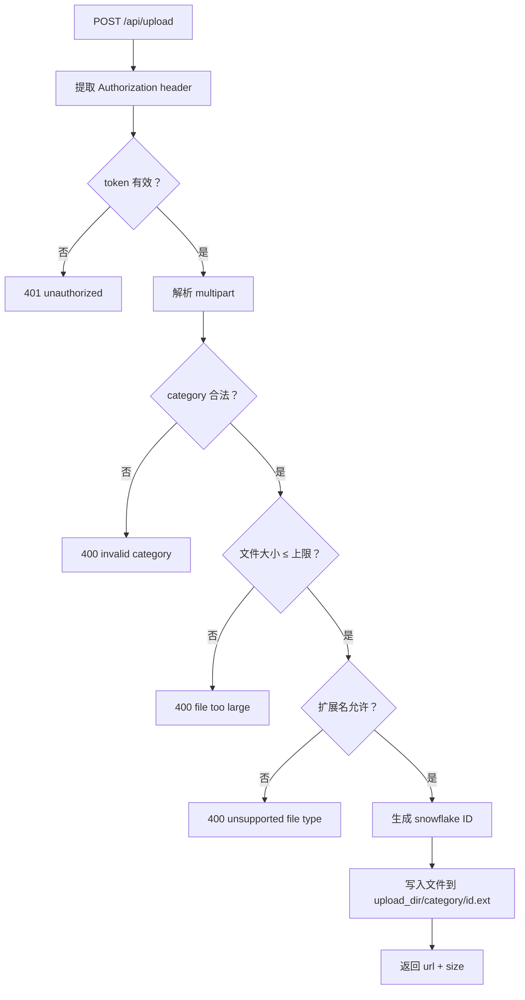
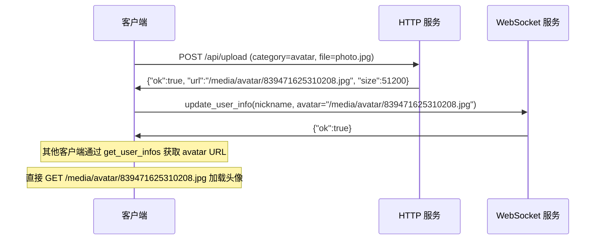
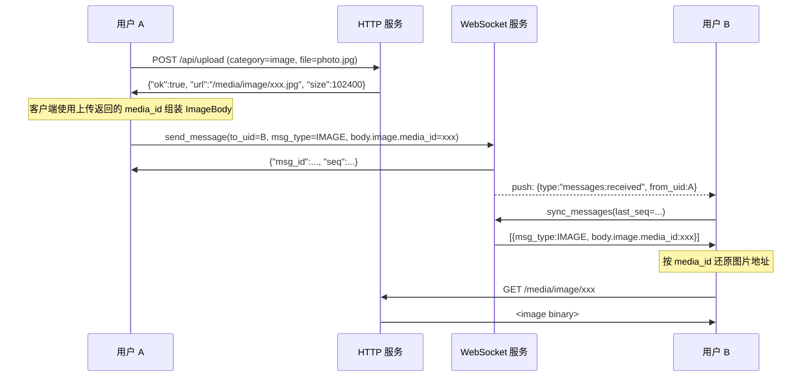
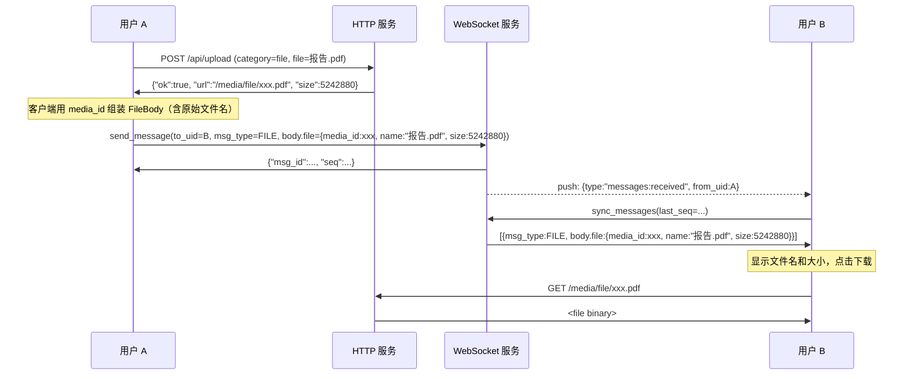

# 多媒体资源设计方案

> 主要对照：`server/cmd/yimsg-server/main.go`、`server/internal/service/upload.go`、`packages/uikit/src/app/views/`。
> 最后复核：2026-05-30。
> 触发更新：上传路由、媒体静态访问、大小限制或消息内容引用方式变化时同步更新。
> 入口关系：上级索引见 [`README.md`](README.md)；本文说明 HTTP 上传、静态资源访问和消息内容中的媒体引用方式。

## 目录

- [1. 设计目标与约束](#1-设计目标与约束)
- [2. 资源分类](#2-资源分类)
- [3. 存储设计](#3-存储设计)
  - [3.1 目录结构](#31-目录结构)
  - [3.2 文件命名](#32-文件命名)
  - [3.3 访问路径](#33-访问路径)
- [4. 配置扩展](#4-配置扩展)
  - [4.1 config.toml](#41-configtoml)
  - [4.2 MediaConfig](#42-mediaconfig)
- [5. HTTP 上传接口](#5-http-上传接口)
  - [5.1 接口定义](#51-接口定义)
  - [5.2 处理流程](#52-处理流程)
  - [5.3 鉴权](#53-鉴权)
  - [5.4 校验规则](#54-校验规则)
- [6. 文件访问](#6-文件访问)
- [7. 消息类型扩展](#7-消息类型扩展)
  - [7.1 当前消息类型](#71-当前消息类型)
  - [7.2 消息 body 与媒体引用约定](#72-消息-body-与媒体引用约定)
- [8. 使用流程](#8-使用流程)
  - [8.1 头像上传](#81-头像上传)
  - [8.2 图片消息](#82-图片消息)
  - [8.3 文件消息](#83-文件消息)
- [9. 安全性](#9-安全性)
  - [9.1 上传安全](#91-上传安全)
  - [9.2 访问安全](#92-访问安全)
- [10. 代码变更清单](#10-代码变更清单)
- [11. 设计决策](#11-设计决策)
- [12. 未来扩展](#12-未来扩展)

## 1. 设计目标与约束

| 约束 | 说明 |
|------|------|
| 资源类型 | 头像（用户/群）、图片消息、文件消息 |
| 上传通道 | HTTP multipart/form-data（不走 WebSocket） |
| 访问控制 | `/media/` 公开静态访问，当前未做下载鉴权或签名 URL；URL 不应视为权限边界 |
| 存储后端 | 本地文件系统 |
| 数据库 | **不新增表**，文件元信息内嵌在现有字段中 |
| 缩略图 | 不生成，客户端自行处理图片缩放 |
| 文件去重 | 不做，snowflake ID 天然唯一 |

---

## 2. 资源分类

| 类别 | 用途 | 关联字段 | 使用方式 |
|------|------|---------|---------|
| avatar | 用户头像、群头像 | `user.avatar` / `group_info.avatar` | 上传后通过 WS 更新 profile/group_info |
| image | 图片消息 | `ImageBody.media_id`（msg_type=IMAGE） | 上传得到 media_id 后用 `sendImage` 引用 |
| file | 文件消息 | `FileBody.media_id`（msg_type=FILE） | 上传得到 media_id 后用 `sendFile` 引用 |

---

## 3. 存储设计

### 3.1 目录结构

```
{data_dir}/media/
├── avatar/     # 头像（用户 + 群）
├── image/      # 图片消息附件
└── file/       # 文件消息附件
```

服务端启动时自动创建以上目录。

### 3.2 文件命名

```
{snowflake_id}.{ext}
```

示例：`839471625310208.jpg`

| 属性 | 说明 |
|------|------|
| snowflake ID | 复用现有 `IdGenerator`，全局唯一、按时间大致递增；不提供安全随机性 |
| 扩展名 | 保留原始文件扩展名，便于浏览器识别 MIME 类型 |
| 路径唯一性 | `{category}/{id}.{ext}` 天然唯一，无冲突 |

### 3.3 访问路径

文件通过 HTTP 静态服务访问：

```
GET /media/{category}/{snowflake_id}.{ext}

示例：GET /media/avatar/839471625310208.jpg
      GET /media/image/839471625310209.png
      GET /media/file/839471625310210.pdf
```

---

## 4. 配置扩展

### 4.1 config.toml

```toml
[media]
upload_dir = "./data/media"
max_avatar_bytes = 5242880       # 5MB
max_image_bytes = 10485760       # 10MB
max_file_bytes = 104857600       # 100MB
```

### 4.2 MediaConfig

```go
type MediaConfig struct {
    UploadDir      string `toml:"upload_dir"`
    MaxAvatarBytes int64  `toml:"max_avatar_bytes"`
    MaxImageBytes  int64  `toml:"max_image_bytes"`
    MaxFileBytes   int64  `toml:"max_file_bytes"`
}
```

加入 `Config` 顶层结构：

```go
type Config struct {
    Server   ServerConfig   `toml:"server"`
    Database DatabaseConfig `toml:"database"`
    Session  SessionConfig  `toml:"session"`
    GC       GCConfig       `toml:"gc"`
    Frontend FrontendConfig `toml:"frontend"`
    Media    MediaConfig    `toml:"media"`    // 新增
}
```

---

## 5. HTTP 上传接口

### 5.1 接口定义

**端点：** `POST /api/upload`

**请求：**

```
POST /api/upload
Authorization: Bearer <token>
Content-Type: multipart/form-data

  category: "avatar" | "image" | "file"
  file: <binary>
```

**响应（成功）：**

```json
{
    "ok": true,
    "url": "/media/image/839471625310208.jpg",
    "size": 102400
}
```

**响应（失败）：**

```json
{
    "ok": false,
    "error": "file too large"
}
```

### 5.2 处理流程



### 5.3 鉴权

复用现有 `auth.Authenticate(state, token)` 函数。从 HTTP 请求的 `Authorization: Bearer <token>` header 提取 token：

```go
func extractToken(r *http.Request) string {
    auth := r.Header.Get("Authorization")
    return strings.TrimPrefix(auth, "Bearer ")
}
```

### 5.4 校验规则

**文件大小限制（按 category）：**

| 类别 | 默认上限 |
|------|---------|
| avatar | 5MB |
| image | 10MB |
| file | 100MB |

**扩展名白名单：**

| 类别 | 允许的扩展名 |
|------|------------|
| avatar | jpg, jpeg, png, webp |
| image | jpg, jpeg, png, gif, webp |
| file | 不限制（所有扩展名） |

---

## 6. 文件访问

在 `net/http` 中挂载 `/media` 路径：

```go
mux.Handle("/media/", service.MediaHandler(cfg.Media.UploadDir))
```

- 公开访问，无需鉴权
- `MediaHandler` 对带扩展名的路径（头像）直接读取；对不带扩展名的 `media_id` 路径按 `<id>.*` 解析实际文件，使消息 body 只需保存 `media_id`
- 当前适合开发与简单公开媒体场景；若需要私密媒体，应增加鉴权代理或签名 URL

---

## 7. 消息类型扩展

### 7.1 当前消息类型

```go
// server/internal/dal/types.go
const (
    MsgText     int8 = 1
    MsgImage    int8 = 2
    MsgSystem   int8 = 3
    MsgFile     int8 = 4
    MsgRecall   int8 = 5
    MsgQuote    int8 = 6
    MsgForward  int8 = 7
    MsgMarkdown int8 = 8
)
```

### 7.2 消息 body 与媒体引用约定

消息正文统一为 protobuf `MessageBody`（详见 [`消息能力方案.md`](消息能力方案.md)）。媒体消息**只用 `media_id` 引用**，不在 body 中保存长地址：

| msg_type | body | 媒体字段 |
|----------|------|----------|
| IMAGE | `ImageBody` | `media_id`（int64）、可选 `size/width/height/mime/caption` |
| FILE | `FileBody` | `media_id`（int64）、`name`、可选 `size/mime` |

上传接口返回 `media_id`（及兼容用途的 `url`、`size`）。客户端按约定 `/media/{image\|file}/{media_id}` 还原访问地址：`MediaHandler` 对不带扩展名的 `media_id` 路径按 `<id>.*` 解析实际文件，对带扩展名的路径（如头像 `/media/avatar/{id}.png`）直接读取。

**校验边界：** 服务端校验 `ImageBody`/`FileBody` 的 `media_id` 非空、文件名非空；不解析媒体内容。头像仍按 `UserInfo.avatar` URL 引用，不在本方案的 media_id 范围内。

---

## 8. 使用流程

### 8.1 头像上传



群头像同理：上传后通过 `update_group_info(group_id, name, avatar)` 设置。

### 8.2 图片消息



### 8.3 文件消息



---

## 9. 安全性

### 9.1 上传安全

| 防护 | 措施 |
|------|------|
| 未授权上传 | `Authorization: Bearer <token>` 鉴权，复用现有 session 机制 |
| 文件过大 | 按 category 限制大小（avatar 5MB / image 10MB / file 100MB） |
| 危险文件类型 | avatar/image 限制扩展名白名单 |
| 路径穿越 | 文件名由服务端生成（snowflake ID），不使用客户端提供的文件名 |

### 9.2 访问安全

| 防护 | 措施 |
|------|------|
| 公开静态访问 | `/media/` 由 `http.FileServer` 直接托管，无下载鉴权；私密媒体需要后续增加签名 URL 或鉴权代理 |
| 路径穿越 | 文件名由服务端生成，静态服务根目录固定在 `cfg.Media.UploadDir` |
| 目录列表 | 当前直接使用 `http.FileServer`，未额外屏蔽目录索引；生产化时应包装 `FileSystem` 禁止列目录 |

---

## 10. 代码变更清单

| 文件 | 变更类型 | 内容 |
|------|---------|------|
| `server/internal/config/config.go` | 修改 | 新增 `MediaConfig` 结构体，加入 `Config` |
| `server/internal/dal/types.go` | 当前实现 | 定义 `MsgImage = 1`、`MsgFile = 3`，并保留 `MsgMarkdown = 4` / `MsgExt = 5` |
| `server/cmd/yimsg-server/main.go` | 修改 | 新增 `/api/upload` 路由 + `/media` 静态服务 + 启动时创建目录 |
| `server/internal/service/upload.go` | 新建 | 上传处理器（鉴权、校验、存储、响应） |
| 运行配置 | 当前实现 | 支持 `[media]` 配置段 |

---

## 11. 设计决策

| 决策 | 方案 | 理由 |
|------|------|------|
| 上传通道 | HTTP multipart（非 WebSocket） | WS 不适合大文件传输，HTTP multipart 是标准做法 |
| 文件命名 | snowflake ID | 复用现有 ID 生成器，全局唯一、便于排序；不承担权限控制 |
| 访问控制 | 公开静态访问 | 实现简单，`http.FileServer` 直接挂载；私密媒体需另加鉴权或签名 URL |
| 媒体引用 | body 仅存 media_id | 服务端按 media_id 解析文件，前后端解耦，不在 body 塞长地址 |
| 不新增数据库表 | 元信息内嵌 body（media_id 等） | 文件无需独立查询/索引，减少系统复杂度 |
| 不做文件 GC | 第一版永久保留 | 简化实现；将来可扫描 message + avatar 找孤儿文件 |
| 不做缩略图 | 客户端处理 | 避免引入图片处理库，保持服务端轻量 |

---

## 12. 未来扩展

| 方向 | 说明 |
|------|------|
| 文件 GC | 定期扫描 media 目录，对比消息 body 的 media_id 和 user/group_info.avatar，删除孤儿文件 |
| 云存储 | 上传处理器抽象为 interface，支持 S3/OSS 等对象存储后端 |
| 缩略图 | 上传时生成缩略图（`{id}_thumb.{ext}`），`ImageBody` 增加缩略图字段 |
| 文件大小统计 | 按用户统计已用存储空间，支持配额限制 |
